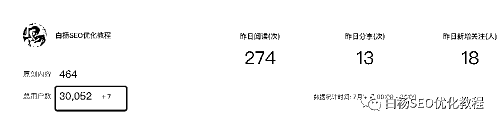
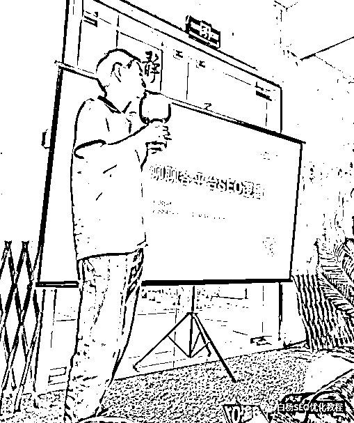

# SEO 垂直领域公众号 3 万粉丝，做对了什么？为什么说现在是流量为王？

> 原文：[`www.yuque.com/for_lazy/thfiu8/upzxe45qr1ifdtr7`](https://www.yuque.com/for_lazy/thfiu8/upzxe45qr1ifdtr7)

## (25 赞)SEO 垂直领域公众号 3 万粉丝，做对了什么？为什么说现在是流量为王？ 

作者： 白杨 SEO 

日期：2023-08-01 

公众号垂直 SEO 领域 30000 关注，做对了什么？ 

这不是标题党，在上周五的时候，这个公众号正式达到了 30000 关注！如图，现在的人数是 30052。 

  

30000，如果不加任何限定条件，有的人可能觉得很厉害，也有的人觉得没啥了不起，还有的人觉得，公众号也快和百度一样日落西山了… 

但如果我告诉，这个公众号从 2018 年 1 月 23 日注册，4 月 23 日正式开始运营，每周至少写一篇，连续写了五年，从未断更呢？ 

但如果我告诉你，SEO 这个词近 10 年一直是在下降，现在下降更是只有平均值的四分之一，而白杨 SEO 公众号的粉丝却一直是正增长呢？ 

  

SEO 真的足够小众，尤其现在来说。上周六受生财杭州群主邀请做为线下嘉宾之一分享下 SEO，我原计划分享 SEO 发展趋势和一些玩法，后面他说把主题定位了各平台 SEO 逻辑， 

  

图来自另一个分享嘉宾，也是白杨 SEO 微信好友奶茶拍照发我的。其实当时我拿到这个话题，压力还是蛮大的。各平台 SEO，讲真别说我一个白杨，就算十个也不可能实战得完，互联网上的平台太多太多了。 

我知道自己擅长什么，不擅长什么，所以我开场就说了 2 点真(tao)诚（lu）： 

第一点，感谢主办方邀请，作为嘉宾最大的好处是可以比大家多 2 分钟自我介绍，哈哈哈。公众号有 30000 粉丝，从 0-1 做出了一个号，个人微信也超过 3 万好友了，所以有一点点搞流量经验。 

第二点，各平台太多了，不敢说来分享，只是来和大家探讨。今天来了 SEO 流量分享，我后面还有高客单变现分享，今天就只差一个产品嘉宾分享了，如果来了就更完美了，从产品到流量再到变现，完整闭环更好。说完这两点，就收到了大家的掌声。 

我在一上台还说了句，其实在下面大家自我介绍的时候，我和你们一样，也是非常紧张，但我站到了这上面来分享，突然就自信起来了。然后我问大家知道 SEO 举个手，近 30 人还不到 5 个人。 

其实从这次分享我最大的收获是，后续尽量让 SEO 也更白话下，让 SEO 与大家关心的搞流量，关心的搞钱，关心的各个具体行业结合起来！从白杨 SEO 优化教程这个名字可以看出，最开始注册公众号就是分享 SEO，SEO 优化，SEO 教程，那时还是以网站为主。 

但自从手机端用户远远大于 PC 端用户，移动端 APP 大于 PC 网站流量时开始，我就开始把 SEO 从纯网站优化到全网各平台了。 

回到主题，30000 粉丝关注，一直持续增长，做对了什么？ 

白杨 SEO 以下 3 点分享，也许会对你所做、所在的行业都会有启发！ 

1、取一个好的名字，是成功的一半！ 

很多人以为白杨是我的本名，其实不是，这只是我的网名。白杨 SEO 老朋友应该知道我叫什么，以前有写过，姓杨。关于白杨，很多人叫这个。白杨，一般人第一想到是白杨树，小时候的白杨礼赞记忆深刻，还有小白杨歌等等。 

为什么要在白杨后面加上 SEO？很简单，知道 SEO 的人知道白杨是搞搜索流量的，不知道的人就会好奇，就会去搜索，这就达到了我想要的效果不是吗？ 

  

关于白杨 SEO 这个昵称来源，看我另一篇：[白杨 SEO：从事 SEO 行业为什么要取昵称？白杨昵称来源](https://link.zhihu.com/?target=http%3A//mp.weixin.qq.com/s%3F__biz%3DMzU2NTQzMzA4Nw%3D%3D%26mid%3D2247483653%26idx%3D1%26sn%3D2cf2a67fed6f83dbe7c3bb9755fd8e17%26chksm%3Dfcba8695cbcd0f8371fe57acb04034ac00922213d2cf7c3b78da7f2fc5d3d0d92ac6dce9f3ce%26scene%3D21%23wechat_redirect) 

2、生态占位，抢占了用户的心理认知！ 

生态占位这个词不是我说的，具体是哪位大佬说的我也不清楚了。我第一次知道是在跟我的一个以前知乎实战训练营学员，现在也是知乎养老保险领域 TOP 车子交流所知。简单理解就是，不管是大到在一个平台里，还是小到在一个社群里（QQ，微信，星球），你的标签让其他人如果需要第一想到你就成功了！ 

回到白杨 SEO 公众号来说，在微信搜索这个生态，因为我这个 SEO 公众号 2018 年就在公众号注册了，也有人比我注册早的，但没有像我一样 SEO 领域持续在写作分享，5 年 450 篇+原创，所以在公众号 SEO 领域慢慢就成了一个 TOP 占位了。 

  

再比如说，我在其它星球分享或者回答，大家一看到白杨 SEO 这个昵称就知道了，或者有朋友问，SEO 谁在做，还在研究，基本都会推荐白杨 SEO 哈。 

3、比坚持更重要的是心力，相信相信的力量！ 

心力，又是我学到一个词，是在周六线下分享奶茶提到的。大致是说，生财有很多航海实战，为什么做出有成绩的人还是少数。是大家学习能力不行？是执行能力不行？都不是，是心力！ 

心力是什么？简单理解就是相信的力量，就是相信自己一定能做成的信念！就是做完与做好的区别，就像我最小徒弟说的，你到底想赚钱有多少的决心！ 

心力，百度说是精神和体力，也没有错。所以为什么很多人会有心无力，为什么随着年龄增长，心力也会下降。我是 2018 年才有 200 多个粉丝的时候我就相信自己能做起来，并且坚持做，具体如图： 

  

原文看这：[白杨 SEO：谈谈微信公众号怎么运营与白杨 SEO 网站优化实例](https://link.zhihu.com/?target=http%3A//mp.weixin.qq.com/s%3F__biz%3DMzU2NTQzMzA4Nw%3D%3D%26mid%3D2247483803%26idx%3D1%26sn%3Dbd7c9a5f1a18e3612ab958ab71eaf4ac%26chksm%3Dfcba860bcbcd0f1d9d036759ea6c55ad4a18e76d022d3de2df816cedceea8e0009e57d1d4756%26scene%3D21%23wechat_redirect) 

其实除了上面说的三点启发，最最最重要的是，我的脸皮比较厚，我坚信只要好内容（哪怕这个比较基础），对有的人有用，我就会去分享，哪怕别人各种不好评论。 

为什么说现在是流量为王？ 

  

上面截图是本星球嘉宾顾小北几年前的分享，现在依旧如此。 

你们有在抖音买东西吗？有多少人觉得抖音上的不管短视频还是直播便宜的？是不是觉得京东贵？ 图 5，图 6 同样的产品，为啥抖音贵？ 

  

  

你不懂互联网流量可以，你不懂什么信息流推荐也可以，但你知道吗？因为抖音的日活流量是京东的好几倍，哪怕是拼多多也比不上抖音！ 谁有流量（潜在消费者）谁就有定价权。 

最后，回到本质，现在不缺产品了，只是缺好产品！就像我说做 seo 需要做好内容一样，现在各平台也不缺内容了（不管图文还是视频），缺的是优质内容！ 

生意的本质是流量，转化的本质是信任！而产品、服务或干货内容是你获取信任的基础！明白赚钱底层逻辑，你才能赚得更久！ 

作者简介： 

白杨 SEO，专注 SEO 研究十年，全网 SEO 流量实战派，对互联网精准流量有深入研究。个人微信：baiyang2047，如需交流或合作，请注明来原生财有术和具体需求，谢谢。 

评论区： 

坏孩（大学生） : seo 收费标准一般怎么样呀 白杨 SEO : 你问的这个到底是网站还是其他平台 seo？即使网站 seo 收费也没有一个统一标准哈 坏孩（大学生） : 白哥，我想问的是公众号的 梁 : 同是做网站，必须赞一个 白杨 SEO : 这个也没标准，而且要看所花成本而定哈。如果是一些流量小词，自己都能做上去，大词这个做粉丝互动等看资源了哈 白杨 SEO : 谢谢，多多交流 书豪 : 白杨老师的 SEO 技术太牛啦 白杨 SEO : 谢谢夸奖，继续努力，你也很优秀呀 

  