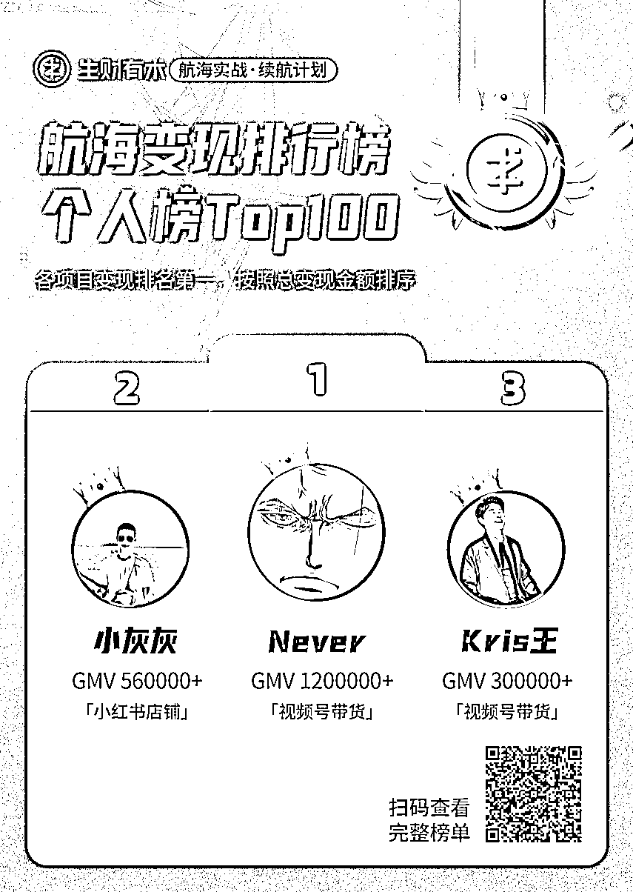
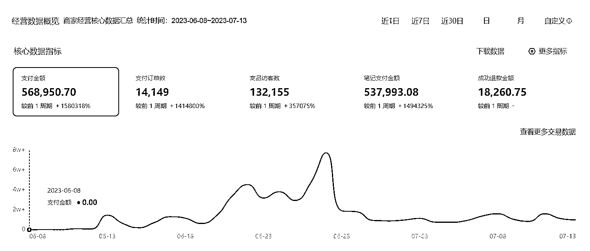

# 我是如何通过小红书店铺一个月赚了 25W 的

> 原文：[`www.yuque.com/for_lazy/thfiu8/xbngszvqhoa0mq5c`](https://www.yuque.com/for_lazy/thfiu8/xbngszvqhoa0mq5c)

<ne-h2 id="d6aa804e" data-lake-id="d6aa804e"><ne-heading-ext><ne-heading-anchor></ne-heading-anchor><ne-heading-fold></ne-heading-fold></ne-heading-ext><ne-heading-content><ne-text id="u99c1277b">(精华帖)(289 赞)我是如何通过小红书店铺一个月赚了 25W 的</ne-text></ne-heading-content></ne-h2> <ne-p id="u74350db3" data-lake-id="u74350db3"><ne-text id="ueb8ed8bc">作者： 小灰灰</ne-text></ne-p> <ne-p id="u1c2d7a04" data-lake-id="u1c2d7a04"><ne-text id="u63f92695">日期：2023-08-04</ne-text></ne-p> <ne-p id="u396fc244" data-lake-id="u396fc244"><ne-text id="u802b69a4">生财的圈友们，大家好！我是小灰灰，一位入圈 4 年的老圈友，大多数人应该都不认识我，毕竟之前也确实没有什么干货可以给大家分享，所以大多时候都在潜水。在这次 6 月续航中，我参加了小红书店铺的航海，很荣幸能够登上个人变现榜，并获得第二名的好成绩。在这次航海中，我一个人，3 个号，一个月时间达成了 56W 的 GMV，净利润在 25W 左右。</ne-text></ne-p> <ne-p id="u9cf69dfa" data-lake-id="u9cf69dfa"><ne-text id="u92be22f6">生财卧虎藏龙，大佬数不胜数，我这个成绩在大佬面前不值一提，但好在也算拿到了正反馈。我知道还有很多跟我之前的状态一样没有跑通闭环，没有拿到正反馈的圈友。希望我的分享能给你带来一点点启发，也感谢你的阅读！</ne-text></ne-p> <ne-p id="u31e527a4" data-lake-id="u31e527a4"><ne-card data-card-name="image" data-card-type="inline" id="ih21p" data-event-boundary="card">  <ne-p id="u692386db" data-lake-id="u692386db"><ne-card data-card-name="image" data-card-type="inline" id="jZLI5" data-event-boundary="card">  <ne-p id="u37727ef0" data-lake-id="u37727ef0"><ne-text id="u22a47957">为了给大家更好的阅读体验，烦请移步飞书阅读全部内容：</ne-text></ne-p> <ne-p id="u66de1195" data-lake-id="u66de1195">[<ne-text id="uc9e24fde">我是如何通过小红书店铺一个月赚了 25W 的</ne-text>](https://nyxaxmtuk5.feishu.cn/docx/UFahdSZTyoWG0Fx0JupcAmBqncd?from=from_copylink)</ne-p> <ne-p id="ub1908dcd" data-lake-id="ub1908dcd"><ne-text id="ud82324b4">在这里特别感谢</ne-text><ne-text id="u8ad42602" ne-bold="true">@盗坤</ne-text><ne-text id="ue296a53b">，</ne-text><ne-text id="uec5ca287" ne-bold="true">@木易</ne-text><ne-text id="u759fdd07">，</ne-text><ne-text id="u0dbb8834" ne-bold="true">@Erik</ne-text><ne-text id="u81fa1f94">，</ne-text><ne-text id="u6f035de9" ne-bold="true">@茶茶</ne-text><ne-text id="uf4373e35">，</ne-text><ne-text id="uc0428282" ne-bold="true">@佩佩</ne-text><ne-text id="u317b94f5">，</ne-text><ne-text id="u59357fc5" ne-bold="true">@亦仁</ne-text><ne-text id="ub432608d">等等好多好多人，每个人都以不同形式帮助过我，教给我知识，给过我力量，也感谢</ne-text><ne-text id="ube4788e2" ne-bold="true">@郭晓文</ne-text><ne-text id="ufc276d0b">在我写这篇帖子过程中的指导，感恩！</ne-text></ne-p> <ne-hole id="u6988ce0a" data-lake-id="u6988ce0a"><ne-card data-card-name="hr" data-card-type="block" id="b9oLy" data-event-boundary="card"><ne-p id="ubf506a0a" data-lake-id="ubf506a0a"><ne-text id="u7936343b">评论区：</ne-text></ne-p> <ne-p id="u95509907" data-lake-id="u95509907"><ne-text id="uc4ab7042">精灵 : 厉害的</ne-text> <ne-text id="ub82c7575">Mayflouris* : 小灰灰优秀[强]</ne-text> <ne-text id="uca36bdfa">小灰灰 : 谢谢[愉快]</ne-text> <ne-text id="u2f204ba3">小灰灰 : [抱拳][抱拳]</ne-text> <ne-text id="u87502512">勤学 : 祝贺灰灰跑通航海项目，迎来再次突破🎉</ne-text></ne-p> <ne-p id="u3df6e752" data-lake-id="u3df6e752"><ne-text id="u1e9702fe">感谢分享[强][强]</ne-text> <ne-text id="ud9c29b6c">书豪 : 线下和灰灰吃了几次饭，灰灰确实非常有能力[强][强][强]，小红书成绩实至名归</ne-text> <ne-text id="u39f1690a">小灰灰 : 书豪过奖了，向你学习！[呲牙]</ne-text> <ne-text id="uc5b5f50e">阿童木 : 老乡优秀！</ne-text></ne-p> <ne-p id="uf70be799" data-lake-id="uf70be799"><ne-card data-card-name="image" data-card-type="inline" id="IzSKr" data-event-boundary="card">  <ne-hole id="u592749f0" data-lake-id="u592749f0"><ne-card data-card-name="hr" data-card-type="block" id="hFe4U" data-event-boundary="card"></ne-card></ne-hole></ne-card></ne-p></ne-card></ne-hole></ne-card></ne-p></ne-card></ne-p>