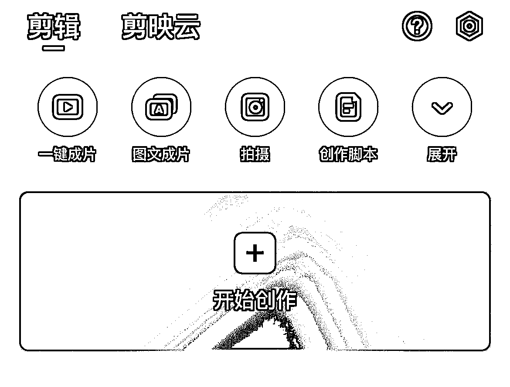
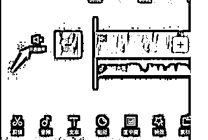

# 带 04 年大二堂妹做小红书店铺，从 0 开始做小红书的一些经验和踩坑分享

> 原文：[`www.yuque.com/for_lazy/thfiu8/mggx49ntif00cxyi`](https://www.yuque.com/for_lazy/thfiu8/mggx49ntif00cxyi)

## (精华帖)(135 赞)带 04 年大二堂妹做小红书店铺，从 0 开始做小红书的一些经验和踩坑分享 

作者： 书豪 

日期：2023-08-04 

##### 各位朋友好，我是在杭州的生财龙珠圈友书豪，一个连续创业四年的 95 后，目前连续四年都年入百万。 

#####   

##### 6 月份家里叔叔让我带堂妹暑假实习学做小红书电商，说是堂妹打算在老家找一份餐厅的服务员苦哈哈赚点辛苦钱但是学不到东西。说干就干，因为是家里亲戚的缘故，堂妹在我这里赚的钱，我一分都没有分，并且很开心，我告诉她我在大学的时候不知道做互联网可以赚到钱，你现在的年纪做互联网是一个非常好的开始呀！ 

##### 

##### 今天给大家分享一下我具体教堂妹做小红书店铺的指导细节和具体方法，如果你是一个手里有几个员工的小老板，不知道如何指导团队去做小红书电商，不知道具体的管理带人细节，这篇文章也许能对你有帮助！上车，咱们出发！一起生财有术，各位 enjoy！ 

#####   

#### 今日围绕这几点内容去分享： 

#### 1\.  带堂妹做小红书店铺的心理建设 

#### 2\.  教 19 岁的堂妹选品 

#### 3\.  出单后货源的选择 

#### 4.  视频的剪辑以及笔记封面的制作 

5.  笔记的发布以及文案制作 

6. 一些踩坑点提前告知堂妹 

一、堂妹做小红书店铺前的心理建设 

因为堂妹是一个互联网小白，在学校里也没有做过兼职，没赚过钱，也没有任何的小红书项目经验。所以在开始之前我就给她做足了心理建设。我对她的预期值管理，就是以一个过来人的身边告诉她，你在小红书店铺上赚 1 块钱就可以了，达到了我给你发一个大红包。这让堂妹在最初没有开单的一段时间也能保持心态的稳定，没有草草的因为不开单就放弃。所以我认为在做互联网项目之前，想好自己的预期值，是非常重要的，不论是视频号还是抖音还是公众号平台，大多数人抱着非常高的热情进入，带着失望离场，首先心态上就败了，刚做一两周没有结果就放弃，这都是没有做好预期值管理的原因。 

良好的预期值能够帮助堂妹在小红书开店铺发笔记带货整个项目过程中的的行动力！ 

## 二、教堂妹选品 

我告诉我亲爱的堂妹，我说在小红书开店铺发笔记卖货啊，你最重要的就是选品！ 

我给俺家堂妹举了一个例子，我说呀，你不是喜欢坦克 300 那个车吗，我说你喜欢坦克 300 这个车，是不是因为坦克 300 本身的车型外观颜值好看对吧，大多数女生喜欢坦克 300 都是因为好看，以我对女生对车的了解，你可能连坦克 300 有哪些车型不同车型的配置价格这些都不了解对吧，堂妹点点头！我说就以坦克 300 举例，你在小红书搜索坦克 300 是不是巨多笔记，笔记内容点赞数量都比较多对吧，那你在小红书上搜大众迈腾丰田凯美瑞这种你们觉得丑的车是不是在小红书的流量远远低于坦克 300 呀！ 

我告诉堂妹，我说我举这个坦克 300 和丰田凯美瑞这种车的笔记内容的例子给你，是想告诉你一个事实。 

选品其实也是在选择视频图文的素材的优劣。选品的重要性相当于地基，地基的好坏决定上层建筑，选品的精准度也直接决定了后期能否开单。堂妹今年大一暑假，是一个准大二的学生。那么我告诉她，你选品不要去思考，就以 

小红书账号低于 200 粉丝，同时最近 7 天发的单篇带货笔记点赞过 100，同时该带货笔记商品销量大于 100 的品为跟品原则。 

当然堂妹在后续的选品和开单过程中，也验证了这个数据的精准性。这个数据能够精准的在排除账号粉丝量的变量情况下，找到最符合当前小红书用户需求的商品。 

堂妹因为知道我创业赚到了钱，对我业务能力的可靠性和专业度首先比较信任，这也增强了我带她的信心，在这种低粉爆款方法的支持下，她深信也一定可以复刻出一个简易的小红书店铺卖货账号。 

有了精准的选品方法，还需要高效的工具，我直接给她开了一个灰豚数据来分析帮助她高效选品。截图是实际用到教给她的过滤条件 

  

对于商品的选择一定是看数据说话为准，堂妹也有时候会好奇，为什么 xxx 这个东西会成为爆品，和她的常识完全相违背。但是数据才是真是展现小红书大部分用户真是需要的现实，避免先入为主也真的很重要。 

我想分享给大家的是，如果你是初创公司，刚招人带团队的时候，不需要让新人思考，直接给新员工一个具体可以执行的步骤，简简单单 123 可以开干的执行标准，非常重要！ 

## 三、开店及上品、货源平台的选择 

对于小红书开店的过程，我们公司的操作手册我是直接给堂妹的，这些她作为一个大学生，学起来非常简单。 

整个上品的步骤拆分为： 

灰豚数据选品->通过至尊宝全网搜索订好上家商家->利用蚂蚁搬家插件进行上品上架->进行素材的混剪生成 4-5 个视频->进行关联上品的视频笔记发布 

灰豚数据的选品我们前面已经介绍过了，接下来要用到的“至尊宝”和“蚂蚁搬家”这些非常实用的工具（类似的工具还有很多），提前给堂妹具体的下载地址和使用方法链接就好了。 

关于货源平台的选择，大多数以淘宝和1688为主，不推荐拼多多，拼多多的机制对于无货源的商家来说不太友好。 

而对于选的品，1688 很多的不支持一件代发，综合所有的因素而且考虑到后期淘宝的发货和退换货流程都做的比较成熟，所以我告诉堂妹，选品找货源，直接上淘宝！ 

然而淘宝平台上的相同款式也会有很多家同时在卖，且价钱差的也很多，堂妹会不知道如何选择！ 

具体教给堂妹的执行标准是如下 

1.价格上排除最贵和最便宜的。 

2.店铺货品不垂直的不能选。很多店铺的上品杂乱，主图不清晰，这样的店铺需要避开 

3.销售量<50 、评价没有或评价与实物不符或者用商品图刷单的评价的 这样的商品尽量不要选则 

4.销售量>100 且有真实评价,和客服交谈时回复比较快的店铺可以考虑 

## 四、视频的剪辑及笔记封面的制作 

工具：剪映 去水印小程序 

素材的采集：1.小红书低分爆款商品的笔记 

                  2.淘宝、拼多多同款商品的视频、主图（淘宝的视频不能下载可以用录屏功能） 

交给堂妹的混剪操作流程： 

1.利用去水印小程序去掉小红书低分爆款笔记的水印，并保存在相册中 

2.点击开始创作，将刚刚采集好的素材选中并添加 

  

2.点击最下方的音频按钮 

  

3.点击提取音乐 选中小红书低粉爆款的视频（或任何你想用的视频音乐） 提取视频中的背景音乐或旁白，作为我们视频的主背景音乐 

  

4.关闭所有的视频原声 

  

5.混合素材：将去水印的小红书视频从中间分割，并添加从天猫或淘宝获取到的素材。 

 

6.对不同的素材进行混合 

 

7.将混合好的视频导出。 

8.将不同的素材调换顺序或添加滤镜、贴纸等，只要有几处变动即可，再导出为新的视频，每个品生成大概 4-5 个视频 

9.笔记封面的选择：封面的选择一定要清晰、干净、突出商品本身，最好是模特的上身图。 可以选择淘宝的样品图或直接使用低分爆品的视频原图。例如： 

 

## 

## 五、笔记的发布及文案 

考虑到堂妹没有太多的经验，所以在发布笔记的时候，我让堂妹先按照我的要求对低粉爆款的产品笔记进行了各方面的分析，包括：笔记封面，笔记标题，笔记文案，笔记内容等。在进行匹配自己商品特点的修改后进行发布。其实对于堂妹这样的小白来说，文案和标题，用抄和模仿的方式远比自己凭借不成熟的经验去创新要有效率的多。这里给堂妹看了我对于爆款拆解的超细文章[小红书爆款封面最新设计攻略！带你掌握流量密码](https://articles.zsxq.com/id_bbisxulzsup1.html) 

举例：低分爆款文案：姐妹们答应我都去穿这套碎花连衣裙！ 

模范文案：天啊！这件连衣裙太美了！姐妹们答应我一定都去穿！ 

类似这样用惊叹语气+emoji 表情+商品的针对人群（适合小个子、显瘦、显腿长、仙女、OL 风等等等 ）给自己的商品贴上标签，突出商品特点，也可以将主要的关键词加在笔记的封面上，突出重点抓人住有需要的人的眼球 

比如： 

  

笔记发布后就可以等待买家的消息啦。 

## 六、踩坑点规避 <ne-oli index-type="0"><ne-oli-i>1</ne-oli-i><ne-oli-c class="ne-oli-content" id="u5b467ab2" data-lake-id="u5b467ab2">于上家的选定，告诉堂妹一定要擦亮眼睛，多看销售额和评价，不能单纯的图低价。选定上家时一味的追求了低价，会碰上很多不靠谱没有及时发货的商家，规避客户的投诉，是可以为整个销售过程免去了很多的麻烦的。</ne-oli-c></ne-oli> <ne-oli index-type="0"><ne-oli-i>2</ne-oli-i></ne-oli><ne-oli index-type="0"><ne-oli-i>3</ne-oli-i></ne-oli><ne-oli index-type="0"><ne-oli-i>4</ne-oli-i><ne-oli-c class="ne-oli-content" id="u9ac84009" data-lake-id="u9ac84009">对于价钱的加价。堂妹很担心加价太高卖不出去。但是经过实验证明 50%-100%的加价幅度也是可以出单很多的！教堂妹做的品类为女装类，刚开始加价的时候她只在原价上加了十块钱，后来又因为发货问题换了上家，再加上平台手续费扣除，她发现自己是在白忙活！</ne-oli-c></ne-oli> 

3.对于视频笔记的发布，我的总结是一定要多发，每个品准备的 4-5 个视频一定每天都要发，每天发 1 条和每天发 8 条的效果是截然不同的，堂妹成交的第一单是这个品类发的第 11 个视频才出单，所以心态好也真的很重要。不要过早的放弃。但是对于 5 天内发了 15 个笔记以上的品依旧没有开单的时候，我会告诉她果断放弃，选择新的低粉爆款。 

## 结尾 

堂妹其实无疑是幸运的，在过程中因为站在相对有经验的哥肩膀上，吸收我们走过的经验避免了很多的问题，能够在一开始就接触到一套正确的理论+方法+工具，能够用最快的速度总结出自己的经验。也希望我教堂妹做小红书店铺的分享能够帮助到生财的圈友们，祝大家在搞钱的道路上，顺风顺水顺财神~咱们一起生财有术！ 

最后也有不少圈友私下问我，小红书是不是不能正常去淘宝下单发货了，目前情况一切正常，新人不要受这些平台消息一惊一乍的，都还没开始做呢！？小红书店铺依然值得深耕！ 

以上，一起生财有术！对于小红书有不懂的问题欢迎交流，微信  wshinvest1 

## 往期文章： 

[如何矩阵化经营 30 个小红书店铺月利润过 20 万？](https://articles.zsxq.com/id_3qslvwfcmwn3.html) 

# [小红书店铺卖情娶内衣，直播+笔记打法月入 6000 保姆级教程](https://articles.zsxq.com/id_jj8hu5xhf5c4.html) 

[人生的第一个 100 万，我是怎么赚到的？！](https://articles.zsxq.com/id_kek27cqo56wf.html) 

[组织生财有术福建厦门圈友聚会复盘！](https://articles.zsxq.com/id_7gqhllpk7tpk.html) 

[小红书单店铺单月 6000+利润选品保姆级教程](https://articles.zsxq.com/id_xwveu3e0usfv.html) 

[小红书无货源电商，单品 4w+利润，我做了什么？](https://articles.zsxq.com/id_8o3ptacdp6mj.html) 

[抖音直播间月消耗过百万的千川投流经验分享](https://articles.zsxq.com/id_d3zembkeh2cw.html) 

[2023 小红书幼教考编保姆级教程](https://articles.zsxq.com/id_cpdec6j4xtho.html) 

[小红书爆款封面最新设计攻略！带你掌握流量密码](https://articles.zsxq.com/id_bbisxulzsup1.html) 

[如何拆解一个小红书爆款视频](https://articles.zsxq.com/id_opo78sxacew9.html) 

[小红书无货源电商做女装如何选品？](https://articles.zsxq.com/id_1wxixz3rofb3.html) 

[小红书颜值测评变现保姆级教程](https://articles.zsxq.com/id_15njj2g5hxfr.html) 

[小红书低粉爆款案例拆解教程](https://articles.zsxq.com/id_0nmnwdg6mb0l.html) 

[小红书新人入局月入 100-1000 元保姆级教程](https://articles.zsxq.com/id_sbk8lqv5unca.html) 

[抖音单品短视频带货 1000 万 GMV，我是怎么做到的？！](https://articles.zsxq.com/id_qoak1w7ptnwf.html) 

[抖音直播间月消耗过百万的千川投流经验分享](https://articles.zsxq.com/id_d3zembkeh2cw.html) 

##   

评论区： 

周彦充 : 高产，[强][强][强] 阿甘｜豪华车买手 : 厉害，书豪哥最近放大招啊 丹丹🍀 : 太猛了，太猛了 小六六~ : 豪哥牛皮，自己能赚钱，还能带身边人一起致富！ 书豪 : 保持空杯，一起生财[呲牙][呲牙][呲牙] 书豪 : 冲冲冲，输出倒逼输入[呲牙] 书豪 : 赚大钱找阿甘买豪车 孟 _MENG : 书豪大哥牛逼 

  