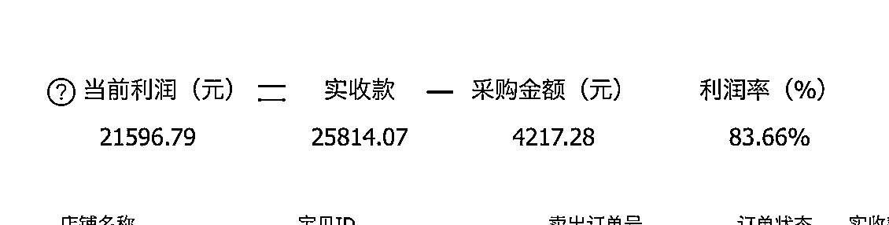

# 小红书无货源经验分享：利润率 80%+单品

> 原文：[`www.yuque.com/for_lazy/thfiu8/xowen933snvx0ves`](https://www.yuque.com/for_lazy/thfiu8/xowen933snvx0ves)

## (76 赞)小红书无货源经验分享：利润率 80%+单品 

作者： Zoey 

日期：2023-08-02 

大家好，我是 Zoey，一个奔波在各个平台做搬运混剪的崽~ 在这篇分享中，我将介绍自己在 上做无货源的经验，希望能为你带来启发 

一、数据 让我们先来看看一些具体数据。这是五月底开店的一个号，单店铺只爆了一个品，而这个品主要是一个笔记爆了带起来的。单品给我带来了 27000+的 GMV,它的利润率是 80%+，实际到手利润大概 2.5W，数据如下（逸淘有部分订单没有被统计到 

下面开始正式分享，图片较多，完整版请移步飞书：[https://kds96nqxnz.feishu.cn/docx/UaxldXPH4ogRHexIo56cIeEmnGc?from=from_copylink](https://kds96nqxnz.feishu.cn/docx/UaxldXPH4ogRHexIo56cIeEmnGc?from=from_copylink)  

  

  

评论区： 

林轻风 : 好棒 Alex : 厉害 Ben : 一个企业号开店，不发内容，同时绑定 3 个企业号挂店铺，用这 3 个企业号来发混剪内容挂链接，号违规了再解绑重新注册绑定，可以解决你的问题。 Zoey : 是的，刚开始第一个店不知道 才踩坑的🤣 Zoey : 谢谢🫰 Zoey : 谢谢 一起生财！ cenky : 这三个企业号挂链接需要 1000 粉丝吗 Ben : 不用，0 粉挂 

  