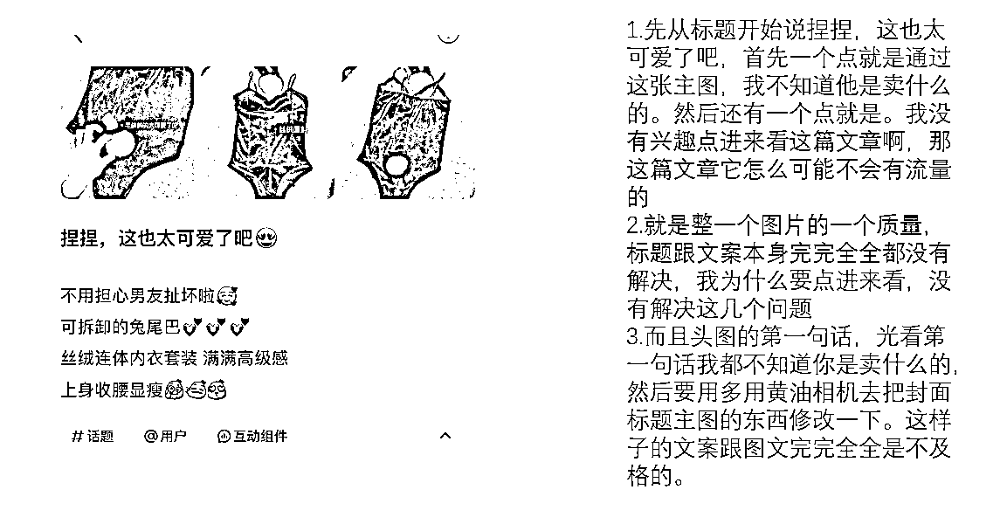
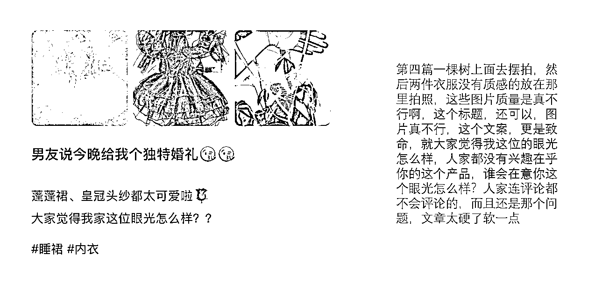
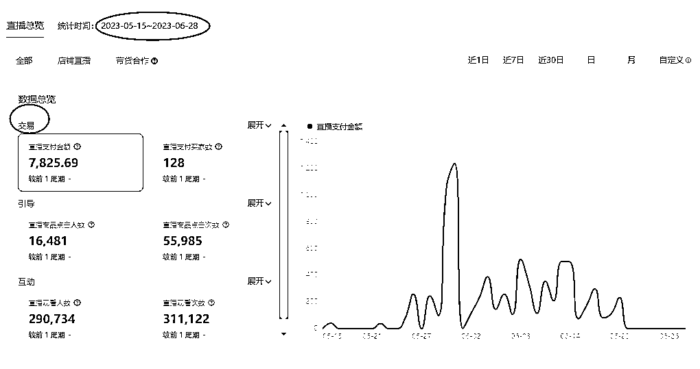
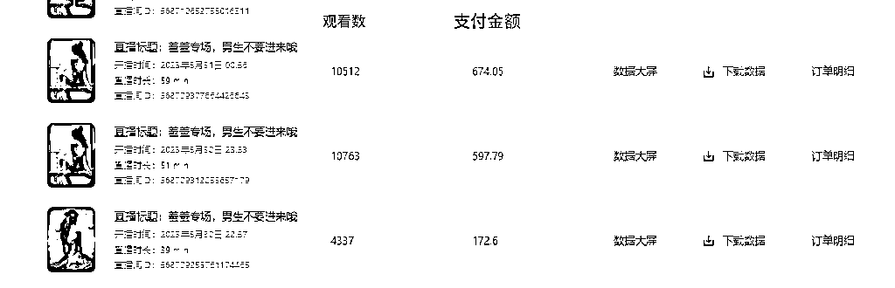
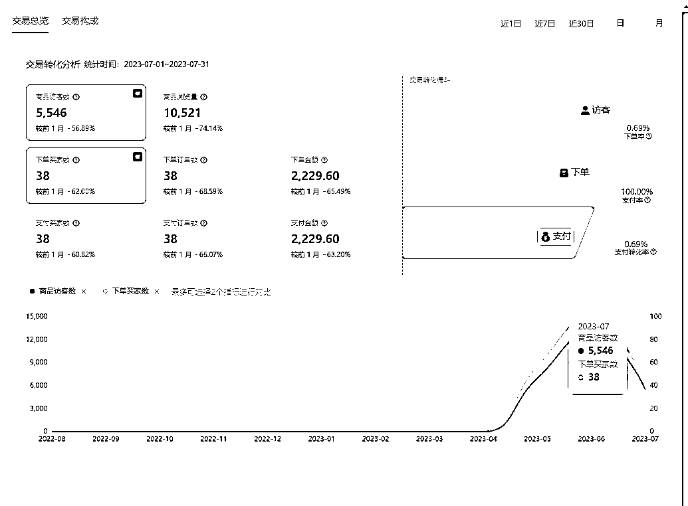

# 小红书店铺卖情趣内衣，直播+笔记打法月入 6000 保姆级教程

> 原文：[`www.yuque.com/for_lazy/thfiu8/lfh1au2nc9yt6vqo`](https://www.yuque.com/for_lazy/thfiu8/lfh1au2nc9yt6vqo)

<ne-h2 id="13bf9a98" data-lake-id="13bf9a98"><ne-heading-ext><ne-heading-anchor></ne-heading-anchor><ne-heading-fold></ne-heading-fold></ne-heading-ext><ne-heading-content><ne-text id="ud382c950">(64 赞)小红书店铺卖情趣内衣，直播+笔记打法月入 6000 保姆级教程</ne-text></ne-heading-content></ne-h2> <ne-p id="u06c9e613" data-lake-id="u06c9e613"><ne-text id="u2852902e">作者： 书豪</ne-text></ne-p> <ne-p id="u42e76f7f" data-lake-id="u42e76f7f"><ne-text id="u623817a9">日期：2023-08-01</ne-text></ne-p> <ne-h5 id="ee01c72c" data-lake-id="ee01c72c"><ne-heading-ext><ne-heading-anchor></ne-heading-anchor><ne-heading-fold></ne-heading-fold></ne-heading-ext><ne-heading-content><ne-text id="u1ef84490" style="color: rgb(73, 73, 73);">各位朋友好，我是在杭州的生财龙珠圈友书豪，一个连续创业四年的 95 后，目前连续四年都年入百万。</ne-text></ne-heading-content></ne-h5> <ne-h5 id="1ade1ad9" data-lake-id="1ade1ad9"><ne-heading-ext><ne-heading-anchor></ne-heading-anchor><ne-heading-fold></ne-heading-fold></ne-heading-ext> <ne-heading-content></ne-heading-content></ne-h5> <ne-h5 id="7af25c39" data-lake-id="7af25c39"><ne-heading-ext><ne-heading-anchor></ne-heading-anchor><ne-heading-fold></ne-heading-fold></ne-heading-ext><ne-heading-content><ne-text id="u66a4665a" ne-bold="true">从三月份到八月份，我们团队总计在运营 30 家小红书店铺，目前一个月利润在 20 万左右，平均下来我们单店铺单月的利润在 6000 元左右。</ne-text></ne-heading-content></ne-h5> <ne-h5 id="4fe8b9dd" data-lake-id="4fe8b9dd"><ne-heading-ext><ne-heading-anchor></ne-heading-anchor><ne-heading-fold></ne-heading-fold></ne-heading-ext><ne-heading-content></ne-heading-content></ne-h5><ne-h5 id="2ba230a9" data-lake-id="2ba230a9"><ne-heading-ext><ne-heading-anchor></ne-heading-anchor><ne-heading-fold></ne-heading-fold></ne-heading-ext><ne-heading-content><ne-text id="u16b2f80f" ne-bold="true">今天给大家分享其中我们一家羞羞的内衣店铺的玩法。</ne-text></ne-heading-content></ne-h5> <ne-h4 id="2f25d2ed" data-lake-id="2f25d2ed"><ne-heading-ext><ne-heading-anchor></ne-heading-anchor><ne-heading-fold></ne-heading-fold></ne-heading-ext><ne-heading-content><ne-text id="u14db1f4b" ne-bold="true">主要围绕这几点内容去分享：</ne-text></ne-heading-content></ne-h4> <ne-h4 id="cf3e743a" data-lake-id="cf3e743a"><ne-heading-ext><ne-heading-anchor></ne-heading-anchor><ne-heading-fold></ne-heading-fold></ne-heading-ext><ne-heading-content><ne-text id="u55d55931" ne-bold="true">1\.  </ne-text><ne-text id="ub6b4de12" ne-bold="true">为什么会选择做情娶内衣（羞羞的内衣）？</ne-text></ne-heading-content></ne-h4> <ne-h4 id="899d0b5d" data-lake-id="899d0b5d"><ne-heading-ext><ne-heading-anchor></ne-heading-anchor><ne-heading-fold></ne-heading-fold></ne-heading-ext><ne-heading-content><ne-text id="uca914ff4" ne-bold="true">2\.  </ne-text><ne-text id="u5126e789" ne-bold="true">情娶</ne-text><ne-text id="ua52eba2b" ne-bold="true">内衣如何选品？</ne-text></ne-heading-content></ne-h4> <ne-h4 id="f3314e36" data-lake-id="f3314e36"><ne-heading-ext><ne-heading-anchor></ne-heading-anchor><ne-heading-fold></ne-heading-fold></ne-heading-ext><ne-heading-content><ne-text id="u508c0ed8" ne-bold="true">3\.  </ne-text><ne-text id="u70c8dc6c" ne-bold="true">如何做笔记？做标题？做视频？做封面？</ne-text></ne-heading-content></ne-h4> <ne-h4 id="7aa22c28" data-lake-id="7aa22c28"><ne-heading-ext><ne-heading-anchor></ne-heading-anchor><ne-heading-fold></ne-heading-fold></ne-heading-ext><ne-heading-content><ne-text id="u2b88d4a3" ne-bold="true">4</ne-text><ne-text id="u3198afc5" ne-bold="true">.  </ne-text><ne-text id="uee9ebda0" ne-bold="true">小红书如何直播卖货，封面、标题、逼单话术和赠品全方位优化？</ne-text></ne-heading-content></ne-h4> <ne-p id="u29aef151" data-lake-id="u29aef151"><ne-text id="u84e67884" ne-bold="true">5</ne-text><ne-text id="u05b605ae" ne-bold="true">.  如何</ne-text><ne-text id="u5fd513db" ne-bold="true">避免违规呢？</ne-text></ne-p> <ne-p id="u406ecb4b" data-lake-id="u406ecb4b"><ne-text id="u9bae3a36" ne-bold="true">一、那么为什么会选择做情娶内衣（羞羞的内衣）？</ne-text></ne-p> <ne-p id="ub0d5ba2d" data-lake-id="ub0d5ba2d"><ne-text id="u32e6b1d7">第一：在开始做之前，我们通过在抖音以及小红书都调查了一下，发现这个类目在市场上需求还是蛮大的，且竞争力也没那么大。</ne-text></ne-p> <ne-p id="uea91e00a" data-lake-id="uea91e00a"><ne-text id="u76cdacc5">第二：</ne-text><ne-text id="u73ac6cfe" ne-bold="true">情娶</ne-text><ne-text id="u2c3106c6">内衣的款式变化会比较多，这方向的设计方向比较有趣，自己想把店铺做大，往原创品牌有货源的方向走。小红书店铺长期盈利肯定是有货源为主要支撑。</ne-text></ne-p> <ne-p id="u487e231f" data-lake-id="u487e231f"><ne-text id="ub10857ac">第三：这个充斥着各种不确定的时代，促使人们产生更为复杂的多元化的情绪，譬如，孤独，焦虑，忧郁，暴躁，怜悯，希望等，会更加注重自己精神上的需求。对于 QQ 内衣这个东西，我不会觉得害羞，我觉得这是人类正常的一个欲望。并且，我觉得</ne-text><ne-text id="ued87e42b" ne-bold="true">情娶</ne-text><ne-text id="u9babfdf4">内衣也是情侣之间的调和剂，我相信很多人也是如此。</ne-text></ne-p> <ne-p id="u77db374a" data-lake-id="u77db374a"><ne-text id="u19aa7809">以上是我自己想做</ne-text><ne-text id="uf42f5d21" ne-bold="true">情娶</ne-text><ne-text id="uf8c42758">内衣的原因，下面开始进入选品阶段。插个小插曲，在开始做这个之后，也会有圈友问，为什么做这个？不羞？</ne-text></ne-p> <ne-p id="u3cecc5f8" data-lake-id="u3cecc5f8"><ne-text id="u59a2d4bf">我说的是，饮食男女，食色性也，审视自己的内心，做小红书永远最重要的是用户的需求，市场的需求。比起做女装，QQ 内衣好做多了。</ne-text></ne-p> <ne-p id="u430cb040" data-lake-id="u430cb040"><ne-text id="u080d614d" ne-bold="true">二、如何选品？</ne-text></ne-p> <ne-p id="u0544f0f9" data-lake-id="u0544f0f9"><ne-text id="ud4c3bd17">在选品之前，我是先定位好我自己想走的一个服装风格，接着想好了我的品牌名以及设计好品牌 logo，再把小红书的简介想好，表面的门面弄好了，我就开始选品了。</ne-text></ne-p> <ne-p id="u2598bb80" data-lake-id="u2598bb80"><ne-text id="u499e4c53">1.选品标准。</ne-text></ne-p> <ne-p id="u523ad20f" data-lake-id="u523ad20f"><ne-text id="ubf9b4fda">（1）小红书找低粉爆款。（这个在小红书找不多）</ne-text></ne-p> <ne-p id="uca7e3cc4" data-lake-id="uca7e3cc4"><ne-text id="uf7cd58dd">（2）抖音找销量高的款</ne-text></ne-p> <ne-p id="u9927ecfe" data-lake-id="u9927ecfe"><ne-text id="u83121f27">（3）1688 找销量 1000+以上的品，且发货时间在 24 小时内或 48 小时内，预售的不要选。</ne-text></ne-p> <ne-p id="u480261cb" data-lake-id="u480261cb"><ne-text id="u61bb3991">（4）自己觉得好的款式。</ne-text></ne-p> <ne-p id="udce7ccba" data-lake-id="udce7ccba"><ne-text id="u8eaae726" ne-bold="true">三、如何做笔记？做标题？做视频？做封面？</ne-text></ne-p> <ne-p id="uf95d4efc" data-lake-id="uf95d4efc"><ne-text id="u9ae43965">1.买样品，回来自己拍视频，在小红书找那些爆款标题，关键词，直接搬过来。</ne-text></ne-p> <ne-p id="u4a8e6f44" data-lake-id="u4a8e6f44"><ne-text id="u19403c3f">我也是第一次做 QQ 内衣这类品，笔记视频自己实拍的比较多，同行是你最好的老师，实拍视频呈现方式参考做的比较好的同行就行。</ne-text></ne-p> <ne-p id="u26244a1a" data-lake-id="u26244a1a"><ne-text id="uc4491d9b">实拍视频参考账号：雪乃的试衣间（424511432）、羞羞秘密花园（6147070105）、头文字 D（3810173024）、趁夜出击（882989161）</ne-text></ne-p> <ne-p id="uc75c0e77" data-lake-id="uc75c0e77"><ne-text id="u08761d39">2.图文笔记内容把控</ne-text></ne-p> <ne-p id="uf1486ae3" data-lake-id="uf1486ae3"><ne-text id="u8b403a20">（1）图片尺寸 1:1/4:3/3:4</ne-text></ne-p> <ne-p id="u303f6b8c" data-lake-id="u303f6b8c"><ne-text id="uffabe10e">（2）文字直白易懂</ne-text></ne-p> <ne-p id="uf3970fa8" data-lake-id="uf3970fa8"><ne-text id="ue1b3d9b3">（3）评论区互动引导</ne-text></ne-p> <ne-p id="u0b8c7942" data-lake-id="u0b8c7942"><ne-text id="u6376a1d7">（4）封面和标题方向一致</ne-text></ne-p> <ne-p id="u9dd69dcb" data-lake-id="u9dd69dcb"><ne-text id="ua311c554">（5）有卖点</ne-text></ne-p> <ne-p id="uee4b07be" data-lake-id="uee4b07be"><ne-text id="u6bbb7d03">（6）定位精准</ne-text></ne-p> <ne-p id="u0e8b7106" data-lake-id="u0e8b7106"><ne-text id="ue3cb30d6">（7）色调/风格一致</ne-text></ne-p> <ne-p id="u8abff51d" data-lake-id="u8abff51d"><ne-text id="ud70f760d">（8）有针对目标用户</ne-text></ne-p> <ne-p id="u0c50f8e9" data-lake-id="u0c50f8e9"><ne-text id="ufb11e20b">（9）没有太高饱和的颜色</ne-text></ne-p> <ne-p id="ub9a594cb" data-lake-id="ub9a594cb"><ne-text id="u838933a8">（10）不要过度修图，适当用 emoji 分离</ne-text></ne-p> <ne-p id="uf9e5fa6c" data-lake-id="uf9e5fa6c"><ne-text id="u455eca70">3.分享错误案例</ne-text></ne-p> <ne-p id="u9b18070c" data-lake-id="u9b18070c"><ne-text id="u1818e6be">3.分享错误案例</ne-text></ne-p> <ne-p id="u0a6203c8" data-lake-id="u0a6203c8"><ne-card data-card-name="image" data-card-type="inline" id="utaNJ" data-event-boundary="card"><ne-card data-card-name="image" data-card-type="inline" id="EuXUn" data-event-boundary="card">  <ne-p id="u50104331" data-lake-id="u50104331"><ne-card data-card-name="image" data-card-type="inline" id="IhLCn" data-event-boundary="card">  <ne-p id="ucacafc67" data-lake-id="ucacafc67"><ne-card data-card-name="image" data-card-type="inline" id="ZgGlF" data-event-boundary="card">  <ne-p id="u4cd8eafd" data-lake-id="u4cd8eafd"><ne-text id="u2dc106a1">最主要的点，要想把图片拍好，一定要把景、灯光补好。（没有道具的去买）</ne-text></ne-p> <ne-p id="ued119ddf" data-lake-id="ued119ddf"><ne-text id="u2e4b7e58" ne-bold="true">正确笔记分享（保持封面整洁干净）</ne-text></ne-p> <ne-p id="u2bed3da8" data-lake-id="u2bed3da8"><ne-card data-card-name="image" data-card-type="inline" id="kzOSP" data-event-boundary="card">  <ne-p id="ub211024a" data-lake-id="ub211024a"><ne-text id="uabea4ee8" ne-bold="true">四、为什么我们在小红书直播卖货，如何做呢？</ne-text></ne-p> <ne-p id="u0522f203" data-lake-id="u0522f203"><ne-text id="u8ea66e42">其实，我们这个情娶内衣店刚开始的那段时间笔记的效果并不好，于是，我们减少了发笔记的量，开始晚上直播（晚上 10 点-2 点），那是 2023 年 5 月 16 号开始播，基本每天都播，第一天播，才 20 多个人观看，但我们并没有放弃，我们第二天开始优化直播封面和标题，第二晚我们场观有 1000 人以上，当时我们很兴奋，虽然第二场没有出单。</ne-text></ne-p> <ne-p id="ub6426104" data-lake-id="ub6426104"><ne-text id="u42af2bc7">但我们发现直播封面跟标题很重要，于是我们第三天开始找更符合情趣内衣更吸引人的封面。以下是我们测过的封面</ne-text></ne-p> <ne-p id="ude64c913" data-lake-id="ude64c913"><ne-card data-card-name="image" data-card-type="inline" id="wOOwF" data-event-boundary="card">  <ne-p id="u0d7318cc" data-lake-id="u0d7318cc"><ne-text id="ud5509f37" ne-bold="true">在那之后，我们都会观察每一场的的点击率，也正是封面问题解决了，我们的观看量也是每天都在加，也开始稳定出单，最高场观达 1 万+，当晚成交率 24 单。</ne-text></ne-p> <ne-p id="u72570d77" data-lake-id="u72570d77"><ne-card data-card-name="image" data-card-type="inline" id="NfaWd" data-event-boundary="card">  <ne-p id="ub9fd34eb" data-lake-id="ub9fd34eb"><ne-text id="uf863890f">最高场观数据截图</ne-text></ne-p> <ne-p id="ud5e21289" data-lake-id="ud5e21289"><ne-card data-card-name="image" data-card-type="inline" id="qfq1N" data-event-boundary="card">  <ne-p id="u8ff51850" data-lake-id="u8ff51850"><ne-text id="u80fd34a9">但后面，我们又遇到一个问题，就是在 618 期间，我们直播的流量猛降，当时很着急，因为也没有违规，不明白为什么，就一直在寻找原因，然后也去看了其他同行的直播，发现他们的直播观看量也很少，但是没有我们店铺那么严重，尽管如此我们还是坚持播，2 天后吧，流量稍微也上 1000+了，也有出 1-2 单，但受到 618 那些大主播的影响，我们流量是没之前那么好了。在那之后，我们每晚播的成交量都只有 1-5 单左右。我们决定停播开始优化笔记。</ne-text></ne-p> <ne-p id="u62177b35" data-lake-id="u62177b35"><ne-text id="ue1c52e49">以下是停播后的转化数据</ne-text></ne-p> <ne-p id="ucc10c4bb" data-lake-id="ucc10c4bb"><ne-card data-card-name="image" data-card-type="inline" id="mYtNj" data-event-boundary="card">  <ne-p id="u308ab1ef" data-lake-id="u308ab1ef"><ne-card data-card-name="image" data-card-type="inline" id="Vi5cr" data-event-boundary="card">  <ne-p id="u8fcc9bb1" data-lake-id="u8fcc9bb1"><ne-text id="u4643cd23" ne-bold="true">直播逼单话术和套路</ne-text></ne-p> <ne-p id="u1b4916ae" data-lake-id="u1b4916ae"><ne-text id="u79e107f3">分享一个我们在直播间常用的一个方法：送丝袜。</ne-text></ne-p> <ne-p id="u04bbd701" data-lake-id="u04bbd701"><ne-text id="u86e32e0b">提醒用户今晚在直播间下单就送丝袜，找几个托，回到直播间回复：已拍，记得送丝袜哦</ne-text></ne-p> <ne-p id="u4bf2f087" data-lake-id="u4bf2f087"><ne-text id="u4c5a67dd">给大家说一下，在直播期间，我们测出一个规律，那就是每场开播时，小红书都会给到爆光扶持，这个时候你的场观会升的很快，但也就维持 30 分钟左右，之后的话，就没什么人进来了，正因为发现了这一点，我们实行多场次少时间的计划，也就是我们每一次开播只在 50 分钟或一个小时左右，反正只要没流量了，我们就下播，休息 10 分钟，再继续开播，但是现在小红书直播规则改了，平台需要你播上 3 个小时才给到 3000 的曝光率，因此，现在也很多同行也都没有在直播了。</ne-text></ne-p> <ne-p id="u08f8a858" data-lake-id="u08f8a858"><ne-text id="ufa476efb">目前我们店铺停播后，就开始已发笔记为主，笔记的话是我们原创视频+混剪，混剪的话是在抖音找同款素材，一下就可以了，每天发 5-6 条。因为有粉丝的基础，再加上每天发上几条笔记，我们店铺每天也有稳定的出单量。</ne-text></ne-p> <ne-p id="uaff89e08" data-lake-id="uaff89e08"><ne-text id="udc84376e">最后再说一下，违规问题，因为这个类目也容易违规。</ne-text></ne-p> <ne-p id="uc2e0531c" data-lake-id="uc2e0531c"><ne-text id="u11f28aac" ne-bold="true">违规点总结</ne-text></ne-p> <ne-p id="u11e84f44" data-lake-id="u11e84f44"><ne-text id="u9d0b694d">1.商品类目错放</ne-text></ne-p> <ne-p id="u66efa6cc" data-lake-id="u66efa6cc"><ne-text id="ud0825763">解决办法：</ne-text></ne-p> <ne-p id="u78cf42c7" data-lake-id="u78cf42c7"><ne-text id="u6bd650c2">（1）注册医疗器械的资格证书（这个大多数人不会去弄，太麻烦）</ne-text></ne-p> <ne-p id="ude3bc159" data-lake-id="ude3bc159"><ne-text id="ucf679ec3">（2）标题不要出现情趣字体，以及商品图不过审的就自己买回来用人台实拍上架（这个也不能说完全避免，有些还是会收到类目错放的问题，这个没有办法，你只能去申诉或则修改标题图片，还是不过审就不要这个款，直接下架）</ne-text></ne-p> <ne-p id="u753c8ac2" data-lake-id="u753c8ac2"><ne-text id="u7cbec928">2.笔记违规</ne-text></ne-p> <ne-p id="u475b8bc5" data-lake-id="u475b8bc5"><ne-text id="ua702a9c5">笔记违规无非就是太漏，不良诱导。</ne-text></ne-p> <ne-p id="u931f4360" data-lake-id="u931f4360"><ne-text id="u4c44b8fd">这种的话不要放真人模特穿的图就可以了，还有做的视频笔记，氛围不要弄得太欲，不然也容易违规。</ne-text></ne-p> <ne-p id="u76bfd355" data-lake-id="u76bfd355"><ne-text id="uf7a5a872" ne-bold="true">如何进一步优化笔记</ne-text></ne-p> <ne-p id="ua97ba601" data-lake-id="ua97ba601"><ne-text id="ue147bfae">1.做原创视频，保持笔记的一个风格统一性。</ne-text></ne-p> <ne-p id="uac308387" data-lake-id="uac308387"><ne-text id="u96267522">2.笔记标题，不要太低俗，要给到人一个共情（可参考杜蕾斯的广告）</ne-text></ne-p> <ne-p id="u1655d11c" data-lake-id="u1655d11c"><ne-text id="u22614027">当然这个适合有一定粉丝基础的且想往品牌方向走的，如果刚开始做的话，就建议从抖音或小红书搬运素材混剪，标题参考爆文标题。</ne-text></ne-p> <ne-p id="uc9448ffa" data-lake-id="uc9448ffa"><ne-text id="u32466ee9">关于抖音或小红书素材混剪方法</ne-text></ne-p> <ne-p id="u61bd5e51" data-lake-id="u61bd5e51"><ne-text id="u100a622a">1.直接拿视频，封面加一些文字，如，显瘦、聚拢等。</ne-text></ne-p> <ne-p id="ud5d82479" data-lake-id="ud5d82479"><ne-text id="u9ab26593">2.将视频进行抽帧。</ne-text></ne-p> <ne-p id="u02844344" data-lake-id="u02844344"><ne-text id="u03815834">3.将抖音实拍的商品图片下载下来做成视频</ne-text></ne-p> <ne-p id="u940619d5" data-lake-id="u940619d5"><ne-text id="u747f3bb5" ne-bold="true">直播方式</ne-text></ne-p> <ne-p id="uc6a35c0a" data-lake-id="uc6a35c0a"><ne-text id="u0553aa84">最后说一下这个问题，如果想直播，建议不用特意请直播，因为这个类目的直播不同于普通的服装直播，因为情娶内衣这种款式，更多的是追求款式，按照你买衣服的逻辑是行不通的，分享一下自己的想法。</ne-text></ne-p> <ne-p id="u6abd8940" data-lake-id="u6abd8940"><ne-text id="ub50dd47d">1.可以情侣直播，主要以互动放松的形式，让人们在直播间停留于时间长一点。</ne-text></ne-p> <ne-p id="u1b228669" data-lake-id="u1b228669"><ne-text id="u2def8de7">2.把直播间打造一个浪漫高级的感觉，给人们讲爱情，讲讲情话、情诗，引起大家的共鸣，让人觉得直播有价值，千万不要擦边、低俗，这样随时被举报。</ne-text></ne-p> <ne-p id="u5c19be11" data-lake-id="u5c19be11"><ne-text id="u7117c135">3.直播讲话时，声音要柔，要给到人一种氛围感，但不要嗲。</ne-text></ne-p> <ne-p id="ue46b1bee" data-lake-id="ue46b1bee"><ne-text id="u234da6a9">情趣内衣赛道还是很推荐的，相比女装好做很多，竞争力也相对较少。</ne-text></ne-p> <ne-p id="u0e76856c" data-lake-id="u0e76856c"><ne-text id="ue06ba3f9" style="background-color: rgb(255, 255, 255); color: rgb(47, 48, 52);">以上，一起生财有术！欢迎各位圈友前来交流，微信  wshinvest1</ne-text></ne-p> <ne-h2 id="5db5939a" data-lake-id="5db5939a"><ne-heading-ext><ne-heading-anchor></ne-heading-anchor><ne-heading-fold></ne-heading-fold></ne-heading-ext><ne-heading-content><ne-text id="u2f9daf2a" ne-bold="true">往期文章：</ne-text></ne-heading-content></ne-h2> <ne-h3 id="b0b64645" data-lake-id="b0b64645"><ne-heading-ext><ne-heading-anchor></ne-heading-anchor><ne-heading-fold></ne-heading-fold></ne-heading-ext><ne-heading-content>[<ne-text id="u8d192cff" ne-bold="true" ne-underline="true">如何矩阵化经营 30 个小红书店铺月利润过 20 万？</ne-text>](https://articles.zsxq.com/id_3qslvwfcmwn3.html)</ne-heading-content></ne-h3> <ne-p id="u7055220e" data-lake-id="u7055220e">[<ne-text id="u65c8cb2b" ne-bold="true" ne-underline="true">人生的第一个 100 万，我是怎么赚到的？！</ne-text>](https://articles.zsxq.com/id_kek27cqo56wf.html)</ne-p> <ne-h4 id="b65485c6" data-lake-id="b65485c6"><ne-heading-ext><ne-heading-anchor></ne-heading-anchor><ne-heading-fold></ne-heading-fold></ne-heading-ext><ne-heading-content>[<ne-text id="uc9094adc" ne-bold="true" ne-underline="true">组织生财有术福建厦门圈友聚会复盘！</ne-text>](https://articles.zsxq.com/id_7gqhllpk7tpk.html)</ne-heading-content></ne-h4> <ne-h3 id="b0a18646" data-lake-id="b0a18646"><ne-heading-ext><ne-heading-anchor></ne-heading-anchor><ne-heading-fold></ne-heading-fold></ne-heading-ext><ne-heading-content>[<ne-text id="uc31781e3" ne-bold="true" ne-underline="true">小红书单店铺单月 6000+利润选品保姆级教程</ne-text>](https://articles.zsxq.com/id_xwveu3e0usfv.html)</ne-heading-content></ne-h3> <ne-h3 id="7dfe62ce" data-lake-id="7dfe62ce"><ne-heading-ext><ne-heading-anchor></ne-heading-anchor><ne-heading-fold></ne-heading-fold></ne-heading-ext><ne-heading-content>[<ne-text id="udcb21435" ne-bold="true" ne-underline="true">小红书无货源电商，单品 4w+利润，我做了什么？</ne-text>](https://articles.zsxq.com/id_8o3ptacdp6mj.html)</ne-heading-content></ne-h3> <ne-h3 id="673e56f5" data-lake-id="673e56f5"><ne-heading-ext><ne-heading-anchor></ne-heading-anchor><ne-heading-fold></ne-heading-fold></ne-heading-ext><ne-heading-content>[<ne-text id="u86683752" ne-bold="true" ne-underline="true">抖音直播间月消耗过百万的千川投流经验分享</ne-text>](https://articles.zsxq.com/id_d3zembkeh2cw.html)</ne-heading-content></ne-h3> <ne-h3 id="71707296" data-lake-id="71707296"><ne-heading-ext><ne-heading-anchor></ne-heading-anchor><ne-heading-fold></ne-heading-fold></ne-heading-ext><ne-heading-content>[<ne-text id="uf1126a28" ne-bold="true" ne-underline="true">2023 小红书幼教考编保姆级教程</ne-text>](https://articles.zsxq.com/id_cpdec6j4xtho.html)</ne-heading-content></ne-h3> <ne-h3 id="8b2491f0" data-lake-id="8b2491f0"><ne-heading-ext><ne-heading-anchor></ne-heading-anchor><ne-heading-fold></ne-heading-fold></ne-heading-ext><ne-heading-content>[<ne-text id="u305d61b5" ne-bold="true" ne-underline="true">小红书爆款封面最新设计攻略！带你掌握流量密码</ne-text>](https://articles.zsxq.com/id_bbisxulzsup1.html)</ne-heading-content></ne-h3> <ne-h3 id="60b5aec1" data-lake-id="60b5aec1"><ne-heading-ext><ne-heading-anchor></ne-heading-anchor><ne-heading-fold></ne-heading-fold></ne-heading-ext><ne-heading-content>[<ne-text id="uecb76fbe" ne-bold="true" ne-underline="true">如何拆解一个小红书爆款视频</ne-text>](https://articles.zsxq.com/id_opo78sxacew9.html)</ne-heading-content></ne-h3> <ne-h3 id="745f49cc" data-lake-id="745f49cc"><ne-heading-ext><ne-heading-anchor></ne-heading-anchor><ne-heading-fold></ne-heading-fold></ne-heading-ext><ne-heading-content>[<ne-text id="u94a034ef" ne-bold="true" ne-underline="true">小红书无货源电商做女装如何选品？</ne-text>](https://articles.zsxq.com/id_1wxixz3rofb3.html)</ne-heading-content></ne-h3> <ne-h3 id="417ae9e5" data-lake-id="417ae9e5"><ne-heading-ext><ne-heading-anchor></ne-heading-anchor><ne-heading-fold></ne-heading-fold></ne-heading-ext><ne-heading-content>[<ne-text id="udc892471" ne-bold="true" ne-underline="true">小红书颜值测评变现保姆级教程</ne-text>](https://articles.zsxq.com/id_15njj2g5hxfr.html)</ne-heading-content></ne-h3> <ne-h3 id="530dd444" data-lake-id="530dd444"><ne-heading-ext><ne-heading-anchor></ne-heading-anchor><ne-heading-fold></ne-heading-fold></ne-heading-ext><ne-heading-content>[<ne-text id="u6952b58e" ne-bold="true" ne-underline="true">小红书低粉爆款案例拆解教程</ne-text>](https://articles.zsxq.com/id_0nmnwdg6mb0l.html)</ne-heading-content></ne-h3> <ne-h3 id="6054e001" data-lake-id="6054e001"><ne-heading-ext><ne-heading-anchor></ne-heading-anchor><ne-heading-fold></ne-heading-fold></ne-heading-ext><ne-heading-content>[<ne-text id="uea49b2e4" ne-bold="true" ne-underline="true">小红书新人入局月入 100-1000 元保姆级教程</ne-text>](https://articles.zsxq.com/id_sbk8lqv5unca.html)</ne-heading-content></ne-h3> <ne-h3 id="9039450f" data-lake-id="9039450f"><ne-heading-ext><ne-heading-anchor></ne-heading-anchor><ne-heading-fold></ne-heading-fold></ne-heading-ext> <ne-heading-content></ne-heading-content></ne-h3> <ne-h3 id="065ebffa" data-lake-id="065ebffa"><ne-heading-ext><ne-heading-anchor></ne-heading-anchor><ne-heading-fold></ne-heading-fold></ne-heading-ext><ne-heading-content>[<ne-text id="u4171875c" ne-bold="true" ne-underline="true">抖音单品短视频带货 1000 万 GMV，我是怎么做到的？！</ne-text>](https://articles.zsxq.com/id_qoak1w7ptnwf.html)</ne-heading-content></ne-h3> <ne-h3 id="673e56f5-1" data-lake-id="673e56f5-1"><ne-heading-ext><ne-heading-anchor></ne-heading-anchor><ne-heading-fold></ne-heading-fold></ne-heading-ext><ne-heading-content>[<ne-text id="u90606317" ne-bold="true" ne-underline="true">抖音直播间月消耗过百万的千川投流经验分享</ne-text>](https://articles.zsxq.com/id_d3zembkeh2cw.html)</ne-heading-content></ne-h3> <ne-hole id="u20df1c1b" data-lake-id="u20df1c1b"><ne-card data-card-name="hr" data-card-type="block" id="gtu8L" data-event-boundary="card"><ne-p id="u2e687dda" data-lake-id="u2e687dda"><ne-text id="udec94a45">评论区：</ne-text></ne-p> <ne-p id="u54ab8111" data-lake-id="u54ab8111"><ne-text id="u351c77e0">坏孩（大学生） : 书豪哥牛 b</ne-text> <ne-text id="u927f7c34">sharge : 优秀的豪哥，真诚的分享</ne-text> <ne-text id="udf3f0ce0">蓝子鱼 : 优秀，配合直播提升成交率</ne-text> <ne-text id="u28e996e1">书豪 : 期待和坏孩喝一个!</ne-text> <ne-text id="ub97d4559">书豪 : 谢谢 S 哥认可[呲牙][呲牙]</ne-text> <ne-text id="uf001fba5">书豪 : 子鱼老师的文章我经常看</ne-text> <ne-text id="u9ec94d82">谢安生 : 这次还带有直播的经验，豪哥真是真诚分享，大赞！</ne-text> <ne-text id="u90e7036c">月起星九 : 豪哥团队是专业的[强]</ne-text></ne-p> <ne-p id="ub2b8f89f" data-lake-id="ub2b8f89f"><ne-card data-card-name="image" data-card-type="inline" id="t6Sqx" data-event-boundary="card">  <ne-hole id="uba326729" data-lake-id="uba326729"><ne-card data-card-name="hr" data-card-type="block" id="xlmmS" data-event-boundary="card"></ne-card></ne-hole></ne-card></ne-p></ne-card></ne-hole></ne-card></ne-p></ne-card></ne-p></ne-card></ne-p></ne-card></ne-p></ne-card></ne-p></ne-card></ne-p></ne-card></ne-p></ne-card></ne-p></ne-card></ne-card></ne-p>