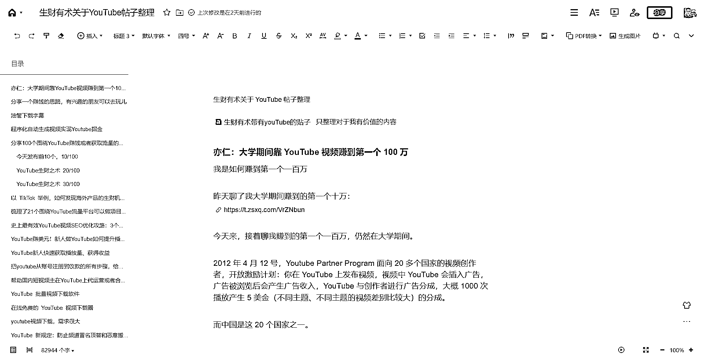
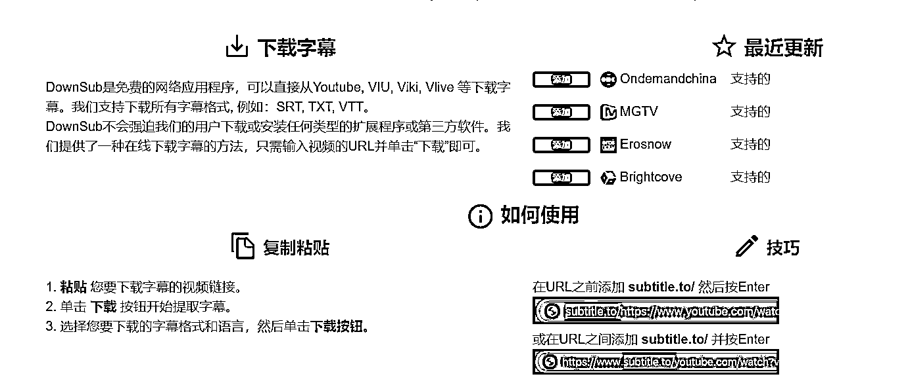
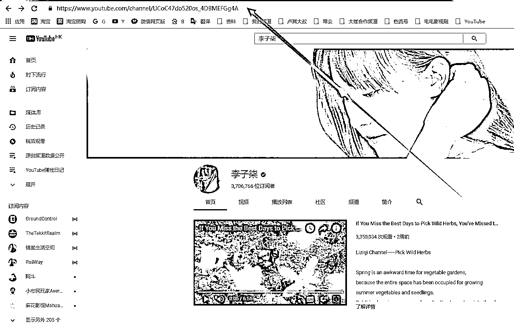

# 生财有术关于 YouTube 帖子整理

> 原文：[`www.yuque.com/for_lazy/thfiu8/wqf57shwy68ryit1`](https://www.yuque.com/for_lazy/thfiu8/wqf57shwy68ryit1)

## (55 赞)生财有术关于 YouTube 帖子整理 

作者： 书情小跟班 

日期：2023-07-31 

我前面写的帖子   

为什么 YouTube 非常值得你做？ https://wx.zsxq.com/mweb/views/topicdetail/topicdetail.html?topic_id=588121251252584 

关于 YouTube YTT 收款的大致流程  https://wx.zsxq.com/mweb/views/topicdetail/topicdetail.html?topic_id=811858545512582 

关于做油管的细节，很多话题可以聊，最重要的是开始行动，你不行动那么永远都赚不到钱的，最近有一个关于 YouTube 的收益图，看得我很上头，如下图所示 

  

YouTube 值得一做，人嘛总是有一个榜样的力量会给自己极大的信心的，正如生财有些帖子写着赚多少钱多少钱同样也会给人力量。 

闲言少叙，回归主题，我把我在生财整理的帖子发出来，整理的原因非常简单，我下半年的重点就是做 YouTube，主要精力就是做 YouTube。 

我不太清楚生财是否会不会组织 YouTube 航海，这个不重要，我整理是我自己需要，顺便分享给大家，这样的话，大家不会一个个去翻帖子了，我已经帮你们整理出部分来了。 

如果生财日后做 YouTube 航海，自然想到的就是做航海手册，我这边没做这个事，好了，大的合集见这个链接 【腾讯文档】生财有术关于 YouTube 帖子整理 

[https://docs.qq.com/doc/DRnFhcVViZkxZcFhi](https://docs.qq.com/doc/DRnFhcVViZkxZcFhi) ，关于排版的问题，我不太会排版，暂时先用腾讯文档版，后期有空再整理飞书版吧，毕竟生财习惯用飞书来分享 

还是大家直接看腾讯文档吧，后续除了整理生财原来的帖子，我自己也会更新关于 YouTube 相关的资讯 

  <ne-h3 id="a330ec24" data-lake-id="a330ec24">亦仁：大学期间靠 YouTube 视频赚到第一个 100 万</ne-h3> 

我是如何赚到第一个一百万 

昨天聊了我大学期间赚到的第一个十万： 

今天来，接着聊我赚到的第一个一百万，仍然在大学期间。 

2012 年 4 月 12 号，Youtube Partner Program 面向 20 多个国家的视频创作者，开放激励计划：你在 YouTube 上发布视频，视频中 YouTube 会插入广告，广告被浏览后会产生广告收入，YouTube 与创作者进行广告分成，大概 1000 次播放产生 5 美金（不同主题、不同主题的视频差别比较大）的分成。 

而中国是这 20 个国家之一。 

同样，2012 年，7 月份，我在读研究生，暑假，当时在纠结毕业后走什么路线，是变成一个专业人士呢，还是做自己喜欢的互联网，也很迷茫。  

当时，我在网上有一个关系很好的朋友，我们两个人是在一个网络电话论坛（有机会介绍这段故事）认识的，我俩经常闲着没事瞎聊，一个偶然的机会，刷到了上面 YouTube Partner Program 面向中国开放的消息，比较敏锐，觉得是个赚钱的机会。  

为什么会刷到呢？  

可能没事就喜欢在网上看看这些新的消息。加上有赚到过钱的经历，对这些信息算很敏感。 

刷到那条新闻，又觉得是个机会后，快速的去测试了下（当时执行力真的很强）。 

我们就开始去注册 YouTube 账号，申请 Adsense ，然后从国内搬运了一些视频过去，为了快速测试，也没管什么版权不版权，这一测试不要紧，随便搬的前 10 个视频，就产生了 5 美金的收入。  

机会来了！ 

还记得生财日历第一句话我怎么说的吗？  

“有钱赚的时候，要集中所有的资源和精力， All in，不要小富即安。 过几年你会拍大腿，那么好的捡钱的机会，为什么错过了” 

我就是从这段经历，得出的这个感触。 

经过一些思想挣扎，我放弃了当时正在备考的注册会计师资格证，开始 All in 进 YouTube 赚钱这个机会。  

从一个账户到几百个账户， 

从一个主题到几百个主题， 

从一个人到带着全班一起， 

从搬运视频到自己找热点创作一些视频， 

从手动传视频到几百台 VPS 到脚本自动化， 

从每天几个小时到几乎全天， 

。。。 

印象最深的是，伦敦奥运会，全球热点，所有人都在关注，大流量，超级大流量。 

但 Youtube 没有直播，所有人想看最新消息，得等专业视频机构做好视频传到 Youtube 上去，这个时候，谁第一时间，把视频传上去，就是上百万流量的机会，几千美金的收入，说时间就是钱，不为过。 

但没办法在 Youtube 做直播，怎么办？ 

办法总比困难多，只要你有强烈的赚钱欲望，困难一定是可以解决的。 

记住这句话，只要你有强烈的赚钱欲望，所有的问题都不是问题。 

我在国内，通过国内的视频网站守着奥运会直播，结果一出来，立马配上几张图片和语音合成，生成几十个短视频，丢到 Youtube 上去，再做一些最基本的关键词，一传上去，再一刷新，播放就过千了，搜索流量疯狂涌进来。 

回头看，那段时间，真的是捡钱的时候，一个火热视频赚几千美金太平常了。 

就这样，差不多持续了两年时间，赚到了我人生中第一个一百万，比一百万还多点。  

我们班上不少跟着我一起做 Youtube 的同学，毕业后就在南京买了房，没靠家里。 

后来竞争者越来越多，加上我们不怎么注重视频质量，除了赚到了美金，没有什么沉淀（这句话有点欠揍）。Youtube 的流量红利期结束，进入到了专业视频创作者的领域，我也因为毕业来到了阿里，没有继续做这个事情。 

这个是我人生中第一个赚到一百万的项目。 

读研期间，还做了另外一件事，做考研笔记生意，写软文引流到 QQ，卖我自己整理的原创笔记，送 VIP 群咨询服务，后来装满了几个 500 人的 QQ 群，基本后来考上那个专业的同学，有差不多一半买过我的笔记。 

最后，总结下我从这个一百万中学习到了什么： 

1. 想清楚自己要什么是最重要的。 

不要太在乎别人的想法，我们那个还算不错学校的学生，放弃专业去做 Youtube 会被认为不务正业，但自己想清楚后，就不要太在乎别人的想法了。 

2. 多多与别人分享，分享是个多轮博弈，你主动分享一次，别人回馈你一点，你再分享一点，别人再回馈一点，这样就进入一个正向循环。  

如果你分享了，对方没有反馈，那么也没有什么必要难受，实际上你过滤掉了一个不值得深入交往的人，把时间节约了出来； 

3. 找到机会后，尽快产品化、自动化、规模化、矩阵化、建立团队，这些都是你的杠杆，可以大大提高效率。 

4. 随着 Youtube 项目的结束，我意识到要有自己的产品，不做没有积累的事情，长期打磨，慢慢优化，到一定临界点，产品会爆发出极大的能量，但做产品得坐很长时间的冷板凳，这过程中，得有现金流的业务。 

这背后又有一个 1000 万的故事。 

5. 得有自己的小圈子，大家可以深入交流。 

这个赚钱机会应该是我个跟另外一个小伙伴，两个人琢磨出来的，那个人怎么认识的呢， 泡论坛的时候认识的，我们两个经常一起交流怎么打免费网络电话。 

后来还找到一个朋友帮我们写了批量脚本，之后因为各自忙其他事情不再联系。后来这个朋友加入了生财有术，再后来，他才知道，那个”亦仁大大“是他当年帮助写脚本的小伙子，两个人在微信上一顿唏嘘。 

6. 保持足够多的信息输入量，特别是一手信息，信息越多，越有价值。有些人因为信息爆炸而退圈，这不正是他们应该留下来的原因才对？ 

7. 赚钱，得趁早。 <ne-h3 id="e676745b" data-lake-id="e676745b">分享一个赚钱的思路，有兴趣的朋友可以去玩儿</ne-h3> 

前段时间有个朋友推荐了一个好的视频，但国内总是找不到这个没有删减版的 

想着到外网的 YouTube 上去找，结果也没有找到。 

但是却拿着手机看了快一天的 YouTube 的视频。 

发现上面好多的视频，是批量化电脑语音自动生成，然后合成的视频。 

就是最简单的搬运把头条或者公众号等的爆款，甚至不用修改，直接标题照抄，文章的内容，用软件文字转语音，然后找几个有点相关的图片，语音加图片合成视频。 

这个模式可以批量化运作，赚广告费 

或许圈子里的朋友已经有人在玩儿了。 <ne-h3 id="a0439689" data-lake-id="a0439689">油管下载字幕</ne-h3> 

最近看到很多小说推文和中视频的伙伴，从油管找视频的伙伴不会下载字幕，有字幕就可以翻译，然后剪辑也会更顺畅。 

工具免费分享一下： 

  <ne-h3 id="7c12a3ca" data-lake-id="7c12a3ca">程序化自动生成视频实现 Youtube 掘金</ne-h3> 

大家好，我叫二两，目前在广州一家游戏公司做算法工程师，除了主业外，业余时间也喜欢跟着生财里老师傅研究副业的生财之道，这里分享一个通过程序化的方式自动生成视频然后实现 Youtube 变现的实操案例。 

本文不会提供我目前使用的代码，但也会给出代码级别的参考项目，让你躺捡工具，少走很多弯路... 

程序化自动生成视频实现 Youtube 掘金   [https://www.yuque.com/erliang-vtlak/nynb90/dw1b3q](https://www.yuque.com/erliang-vtlak/nynb90/dw1b3q) <ne-h3 id="23416dcf" data-lake-id="23416dcf">分享 100 个围绕 YouTube 赚钱或者获取流量的思路</ne-h3> <ne-h4 id="48c91d62" data-lake-id="48c91d62">今天发布前 10 个，10/100 </ne-h4> 

分享 100 个围绕 YouTube 赚钱或者获取流量的思路，亦仁原创。  

几乎每个思路都有成功的案例了，我们需要的只是模仿并超越，如果超越不了，分一杯羹也可以。  

今天发布前 10 个，10/100  

1. Youtube channel 代运营平台，国内品牌商海外 channel 代运营商，可大可小； 

2. Youtube Adsense earnings 估算平台，小工具，类似于 similarweb， 可以取名叫 similarchannels， 估算每个 youtube channel 收入如何； 

3. Youtube +Audiam， Audiam 是版权管理联盟，可以不经过 Youtube 就可以迅速获得 Youtube Content ID 功能，更多请 Google，很多机会； 

4. Youtube 视频素材库，创意库每日热点，参考新榜、西瓜集、微小宝的每日素材库； 

5. PPT 转 Youtube 视频工具，小部分人的刚需，PPT 转视频功能，加上配乐；同时也是做 SEO 的好工具，youtube 视频的排名较高； 

6. 国内分发 Youtube 平台，获取网红 youtube 主在国内视频平台发布的版权，之前有人分享过南瓜脸在快手上获得几百万浏览、几十万粉丝的案例； 

7. Youtube 视频监控工具，频道、视频、话题、关键词等监测，并提供数据分析报告； 

8. Youtube banner 大小裁剪工具，banner 搜索、推荐等， 从谷歌图片聚合后做专项主题； 

9. Youtube 视频 wordpress 聚合插件，生成垂直主题的视频网站，如小猫、小狗可爱的视频； 

10. Youtube ideas 生产机，首先收集大量的大流量的视频，做数据分析处理后，输入某关键词就可以提示一些正在获取较大流量的关键词，类似[keywordstoo.io](http://keywordstoo.io)或者[tinykeywords.com](http://tinykeywords.com)。 <ne-h4 id="9961995d" data-lake-id="9961995d">YouTube 生财之术 20/100</ne-h4> 

上次分享了 10 个 YouTube 生财之术（见图片），今天接着来。  

20/100 

1. Youtube 和各品牌高清 icon 聚合下载平台 

示例网站 ，月流量 430 万，70%流量来自于搜索引擎。该网站收集各大网站的 icon，分类整理后结构化出图片大小、类别、风格、是否授权等，提供给需要使用 Icon 素材的人。变现方式为 Adsense，按照 1 美元/1000 次的估算，此网站月收入约为 4300 美元。  

2. Youtube movie trailers 聚合平台 

纯电影预告片频道，流量巨大，大多数预告片都是 CC(知识共享），无版权纠纷。 如果没有预告片，可以用海报生成小视频，能蹭到很多热点流量。 

3. Youtube 年度 top 视频生成工具或聚合频道 

类似于 Instagram 上年度 top9 合成一张图片方便分享到社交网络上，类似 Instagram 工具，Youtube 上面可能会也有机会。 

4. Youtube trueview 海外广告代投放 

国内品牌商出海需求，外贸产品 Youtube 推广。 精益的做法可以通过社交网络宣传或者付费推广接单，然后在 fiverr 上找到供应商。 

5. Youtube 粉丝工具 

粉丝维护工具、垃圾评论删除工具等 

案例，提供的功能包括订阅解锁视频工具，粉丝邮件 list 收集，youtube 着落页建设等，按月收费，从月 19 刀到月 129 刀不等； 

6. Youtube 盈利交流社区 

youtube 主交流论坛，案例， 月 46.8 万访客。 

7. Youtube+CPS 

垂直主题+clickbank or amazon or dropshipping，举一个大疆无人机的例子，因为大疆官方 Youtube channel 里很多是 CC（creative comments)视频， 这些视频允许下载了再创作， 所以我们下载这些视频后重新上传，换缩略图、换标题，然后导购到官方购买链接， 

8. Youtube to gif 

视频转换小工具，快手早期就是做 gif 转换的相关工具。参考案例，月流量 540 万。 

9. Youtube 一键分享分发平台 

代发布平台，一键上传到多个视频平台去； 

10. Youtube 搬砖工 

你懂的，不多说， 国内转国外，国外转国内。 <ne-h4 id="72adde2e" data-lake-id="72adde2e">YouTube 生财之术 30/100</ne-h4> 

之前分享了 20/100 个 YouTube 引流以及生财的相关案例，今天继续 30/100。  

前两个分享是 YouTube 字幕相关。 

YouTube 字幕功能真的是非常惊艳，从自动识别到自动翻译再到人工互助翻译，非常人性化。 

从用户角度考虑，围绕字幕，以下这两点可能是有一些需求， 经过我搜索确认，确实发现流量不小的对应产品。 

字幕下载器与字幕搜索器 

1. 前者解决离线学习的需求。  

如有一场很精彩的 TED 演讲，用户希望将字幕导出后整理成一份文档保存或者打印，这其中是导出的需求。  

然而 Youtube 官方并不支持字幕导出，需求产生了。 Google 搜索 youtube subtitles download，排名第一的网站，月 190 万访问，日均 6 万多访问， 需求可见。  

2. 后者解决音视频快速检索的需求。 

比如希望检索哪些视频或者音频中提到关键词“苹果”，目前几乎是做不到。 

有一些解决方案是将视频或者音频进行语音转文字的方式来实现，效率较低。 但如果通过 Youtube 字幕的功能，也许可以实现曲线救国。 此需求相对较弱， 但如果能有很好的产品支持，也许在 2B 端会很受欢迎。  

Youtube 的播放列表功能 

我作为一个普通用户，对播放列表的需求有 

3. 批量下载 Youtube playlist 的所有视频或者音频。 

这个需求比较好理解， 我们有下载单个 Youtube 视频的需求，一定会有下载整个视频列表的需求。 

比如下载整个 NBA 精彩集锦列表，收藏或者离线观看。 因为与单个下载 Youtube 视频的打的点不一样，可以形成一定的差异化。 比如这样一个网站 ， 每个月 230 万访问。 

4. 通过别人的 playlist 建立自己的 playlist。 

这个需求可能会略微小众一些， 但也很好理解。 知乎上有很多别人创建的精彩收藏夹，这些收藏夹里面的内容大部分是我们自己喜欢的， 小部分是希望移除的，如果有工具可以将这些收藏夹移到我的收藏夹，并且我可以进行增加与删除，那么这个工具会受到一部分人的欢迎。 搜索了下也确实有这样的解决方案，， 每个月 310 万访问。  

5. Youtube playlist 迁移到其他平台。 

这个需求在我们之前的“一起赚美元”的一个专栏中提到过，一个开发者，通过建立歌单迁移的服务，一个月收入赚到 10000 美元以上。  

Youtube 账户相关 

6. 简单粗暴的 Youtube 账号买卖。  

特别是对于国人，注册一个 gmail 是相当麻烦的事情，首先得能 fq，其次得能找到一个验证账户的手机号码，可能 90%以上的用户都被挡在了门外。  

除了国人对 Gmail 账号的需求，Youtube 营销也对多账号有很大的需求。 这块市场能够支撑起百万美元的市场，不细讲了。  

7. 还记得注册微信号的时候，是否试了好多次微信 ID 都提示被注册掉了？同样的，注册 Youtube 账户的时候，有同样的苦恼。 有苦恼就会产生需求。 

Youtube username generator 就是满足这样需求的产品，，每月 160 万访问，几乎零成本。  

垂直频道相关 

重点看几个不需要持续更新视频，可以比较轻易产生被动收入的领域 

8. white noise 

我们分析过的 Relaxing White Noise 频道，近 40 万订阅。既可以通过播放视频的广告产生收入，又可以直接产生购买行为，是个竞争不那么激烈的赚钱细分领域，一年轻松百万级收入  

9. Product unwrapping/opening, 也就是我们理解的开箱视频。 

因为开箱视频的流量几乎是最精准的购买流量，转化率会惊人的高， 比如大疆无人机有什么新款型号出来时，我们可以去观察下相应开箱视频的流量，肯定也很惊人。 

10. 圣经相关领域 

在昨天的“一起赚美元专栏中，我们提到媒介形式的变换，就可以获取到不菲的流量，专栏中的西班牙小哥仅仅是做了一个西班牙语的 iOS App，就做到每个月 10000 美元的收入。 同样的， 在 Youtube 上有相似的需求，比如，就是将圣经做成音频并上传到 Youtube 上去，订阅量 76000 多。 <ne-h3 id="456c4093" data-lake-id="456c4093">以 TikTok 举例，如何发现海外产品的生财机会 ？</ne-h3> 

以 TikTok 举例，如何发现海外产品的生财机会 ？ 

本文关键词：Google 流量研究、关键词挖掘、TikTok、SEO；文章 3000 字，读完只需 8 分钟~ 

你好，我是三林，互联网产品人。上一篇文章聊到一个资源套利的下载站：通过 SEO 获客并导向公众号实现广告变现。其抓住了国内用户需要谷歌浏览器插件但又下载不易的需求。那回归到需求出发，我们该怎么发现类似的创业/生财机会呢？今天围绕此... <ne-h3 id="17cbf380" data-lake-id="17cbf380">梳理了 21 个围绕 YouTube 流量平台可以做项目的思路</ne-h3> 

梳理了 21 个围绕 YouTube 流量平台可以做项目的思路，几乎每一个目前都已经有了成功的案例。  

1. Youtube 白噪音视频，之前分享过，通过 Youtube 来导流，卖虚拟服务。 

2. 聚合垂直的 Youtube 频道，如化妆、惊悚、奇异、搞笑、小猫小狗等，通过头条号、公众号、微博号等来经营，做的好可以再往 app 走。  

3. 基于关键词的 Youtube 的短视频 rss 服务，类似于大辉老师新出的 redhub，不过是视频版的。 

想法生成 

4. Youtube ideas 聚合，基于热点以及历史数据，提供一些拍客视频的想法，按月收费服务。 

5. Youtube 榜单/YoutubeTOP 列表，提供精彩视频以及 playlist 的导航以及分析。 

创作 

6. Youtube 免版权音乐下载，youtube 自身提供一些免费版权的音乐，可以将这些聚合起来之后免费提供，通过广告或者一些素材收费。  

7. Youtube tag 提取工具，Youtube Tags 搜索器，自动提取，有个思路是分久必合，合久必分，别人收费的你免费，别人巨无霸，你单点切入。  

8. Youtube Name generator，如，  每月接近百万流量。  

9. Youtube 关键词分析服务商，提供关键词的指导建议，按月收费服务。现在 Adwords 不免费提供 keyword planner 之后， 此类需求上升。如，每月 430 万流量。 

推广 

10. Youtube 广告收入估算，, 日 2000 流量。  

11. Youtube 订阅者、账户、点赞、评论、分享服务，太多了。  

12. Youtube 营销服务，找到上面的服务商，打包成一个营销套餐。 

13. Youtube 网红服务商，Youtube 上找到联系到红人还比较难， 所以需要试验几次，收集到某一个垂直领域的联系方式之后，可以帮助国内的跨境电商做营销服务。  

盈利 

14. Youtube 广告中间服务，掌握 Youtube 广告投放技巧后，帮助国内或者国外的人在 Youtube 上投放广告，类似于 Facebook 或者 Adwords 的广告代投放。 

15. Youtube 视频分销服务，找到国内的版权所有者，或者国外 Youtube 的红人视频，签协议， 在国内分发或者在国外分发。  

周边 

16. Youtube logo 下载，各个版本各个颜色的 logo 下载。每天 2000 流量。 

17. Youtube logo maker 制作器，同上。 

YouTube MP3 /视频下载器，之前讨论过，月流量和盈利特别惊人。 

18. Youtube 视频转 gif, ，每月 700 万流量， 

19. Youtube 国内视频下载服务，卖梯子是一种思路，提供视频是另外一种思路。  

20. Youtube 字幕引流思路， Youtube 会自动生成字幕，将这些字幕导出后并整理成一篇文章，供单独下载，也许是一个很好的文章来源。  

21. Youtube 视频转文字，直接分享过一篇创业项目的文章。 <ne-h3 id="9039450f" data-lake-id="9039450f"> </ne-h3> <ne-h3 id="6a3df1cc" data-lake-id="6a3df1cc">史上最有效 YouTube 视频 SEO 优化攻略：3 个月 YouTube 视频流量提高 900%</ne-h3> 

史上最有效 YouTube 视频 SEO 优化攻略：3 个月 YouTube 视频流量提高 900% 

图帕先生是怎样在 3 个月靠 SEO 把 YouTube 视频流量提高 900%的？ 

本文就是引导大家怎么做好 YouTube 视频的 SEO 优化，提供史上最有效 YouTube 视频 SEO 优化攻略，通过自然视频流量，提高品牌知名度和销量。 

我是怎样在 3 个月把 YouTube 视频流量提高 900%的？ 

全靠 YouTube 视频的 SEO 优化！... <ne-h3 id="a0fb2a44" data-lake-id="a0fb2a44">YouTube 赚美元！新人做 YouTube 如何提升播放量、怎样优化内容？优化哪些方面？</ne-h3> 

YouTube 赚美元！新人做 YouTube 如何提升播放量、怎样优化内容？优化哪些方面？ 

我从做 YouTube 到现在也有几年时间，刚开始做的时候就是靠兴趣，到现在的 11w 粉丝，频道现在进入一个缓慢增长期，更多的时间开发其他领域和学习，包括生财有术的精华帖，最近刚开一个视频频道，记录自己所学的东西！4 月 18 号当天录制了一期视频：介绍在生财有术这一年的收获，视频连接：https://wx.zsxq.com/mweb/views/topicdetail/topicdetail.html?topic_id=815124588422152 <ne-h3 id="b1e25732" data-lake-id="b1e25732">把 youtube 从账号注册到收款的所有步骤，给大家拆解一下</ne-h3> 

油管  短视频  Youtube  

大家好，我是阿雷！经常看 youtube 的小伙伴应该会刷到我的视频。我运营的 youtube 账号:阿雷科技，目前拥有 10.5w 粉丝！（图 1） 

收入一般般，每一个有 1000 美金左右收入！因为自己做的领域，比较小众！收入跟播放量有关系！具体怎么算，大概就一千播放量有 2-8 美金，不同的内容和国家地区，差异也比较大！具体可以看亦仁大大之前发过的帖子！ 

原文链接： 

相关链接： 

我也是看到亦仁大大！的精华帖时就有想法复盘一下！由于平时比较忙！今天我会把 youtube 从账号注册到收款的所有步骤给大家拆解一下！帮助到短视频出海的小伙伴，或者想要出海没有运营的！我可以帮上忙！星球里面肯定也有比我牛皮的！可能还没有露面！我就先献丑了！ 

我是 18 年开始做 youtube 的平台，当时在国内很少有人做，也许都是闷声发大财，不告诉你怎么搞，包括后期的收款啥的网上都找不到靠谱的信息！也是一路摸索出来的，这次分享纯手打，同时也有一个私心，不知道我离龙珠有多远的距离！ 

账号注册 

youtube 是 google 旗下的，所以有一个 google 账号就可以搞定 

google 账号注册非常简单！只要挂上梯子国内手机号都可以注册 google 账号！这个非常简单！如果实在搞不定你可以自己搜索！ 

有了 google 账号就有了 n 个 youtube 频道账号！也就是说一个谷歌账号就可以开通 n 个 youtube 频道！每一个频道可以起不同的名字！可以上传不同的内容！频道与频道之间是没有任何联系的！开通方法通过 google 品牌创建！稍微摸索就可以搞定！ 

重点:每一个 yt 频道都可以设置国家和地区！只要不设置成中国就有资格通过获利！这个很重要！ 

adsense 账号就是 google 的流量主账号！我就是收钱的账号！一般一个 google 账号就会有一个 adsense 账号！这个需要填写你的真实地址，你在中国就填写中国的真实地址，后面收 pin 会用到 

获利要求 

一句话说清楚就是 创建的 YouTube 频道，12 个月内达到 1000 订阅，4000 小时播放量，YouTube 就会自动审核你的频道内容，是否有资格获得 YouTube 合作伙伴，也就是获利，这里就说到了内容，很多人辛辛苦苦搬运内容，最后都没有通过审核，还有很多的原创度很低的都没有通过审核， 

所以这个给大家一个提醒，原创很重要，即使搬运的东西给你过审了，后期会封号的，18 年抖音搬运项目在 YouTube 很火，很多账号都在搞，但是 19 年说封！还有审核的时间也跟你的内容原创度有关系，有的真人出镜的原创度比较高的的内容几天就能审核通过，有的内容达到要求，审核两个月或者更久，我的这个频道达到要求，审核两个月才通过！有的甚至还审核不过，我曾经也做过一个小号，有搬运，达到审核要求但是平台审核不通过！ 

很早以前是可以通过有 google 投广告推广自己的频道达到订阅和播放要求的，但是 2020YouTube 做了调整，通过推广的时间不算在，所以门槛也一直在提高 

所以内容一定要原创，最好真人出镜，或者原创度，辨识度非常高！这样比较稳 

通过获利只是第一步，至关重要的一部，如果不能够通过获利，后面的就不要看了 

pin 码 

pin 码是频道通过获利以后，广告费收入达到 100 美金以后，Google AdSense 会发送一个验证你真人地址的 pin 码信件，Google 会给你发送一个平邮信，这封信从国外邮寄过来，并且信件上没有电话，只有你的住址，邮编，姓名，（这里就回到 AdSense 账号那一步，要填写真实地址） 

这种平邮信，就是一个小信封，从国外邮寄到国内，特别容易丢失，每个人都有三次机会，如果第一封信四个星期你还没有收到，你可以在 Google AdSense 后台再一次申请重新发 pin 信，一共有四次机会，四次邮寄的 pin 是一样的，只要有一个收到就可以，即使四次都没有收到，你还可以通过人工验证，一般都可以通过！ 

这是官方 的解读视频： 

pin 码信长这个样子，我当时做 YouTube 也没有见过，网上都找不到图片，打开以后有一串数字代码，把代码填写 AdSense 后台，就可以大功告成！ 

图片:  

图片:  

收款 

目前在国内收款，有三种， 

第一种是个人，5000 美金以内，目前只能通过招商电汇，超过 5000 就需要外汇局备案，具体还没有操作过 

第二种，公司，公对公的收款方式比较多，西联汇款，或者电汇都可以！也是需要外汇局备案，公司由外汇的业务，可以电汇也可以西联汇款 

第三种 mcn 这种形式 mcn 会抽取%20 的手续费，收款方式通过 man 收取，然后转到你的个人账户！一般不建议 mcn 收款 

最后提醒大家，因为 youtube 平台的周期比长，适合做过短视频的，如果你是新手，可能坚持到获利比较难！ 

如果有机会跟各位大佬合作的，或者帮助运营的，或者有产品推广的，可以加我微信详聊：1084814092 

https://wx.zsxq.com/mweb/views/topicdetail/topicdetail.html?topic_id=421114414428258&inviter_id=48544844412158&share_from=CopyUrl&keyword=q7a6AuR <ne-h3 id="25e4807c" data-lake-id="25e4807c">帮助国内短视频主在 YouTube 上代运营或者合作运营是个很赚钱的生意</ne-h3> 

说实话，我觉得帮助国内短视频主在 YouTube 上代运营或者合作运营是个很赚钱的生意，海外华人的阅读量不低，YouTube 的分成很高，收入不一定比国内差。 

而且，视频上传到 YouTube 上去，这是顺手的事情，没给短视频主带来很大的成本。 

比如办公室小野的 YouTube 频道，每个视频都是几百万到几千万的播放，根据我的经验，千次播放能有 2 到 3 美元的收入分成，100 万的播放大概就能有 2000 到 3000 美元的分成。 

谈下 100 个这样的 PO 主呢？ 

--------------------------------------------------------------------------------------------------------------------------- 

发现一些数据，可以验证之前的思路。 

图中主要看下单月 YouTube 广告联盟的收入，顺手赚来的。 <ne-h3 id="e4332972" data-lake-id="e4332972">YouTube 批量视频下载软件</ne-h3> 

风向标 一下班被这事刷屏了 

之前我有送福利手机卡，身边有朋友就增加了手机卡的采购量。 

再结合今天发的帖子，提到关于 YouTube 大 V 抄袭洗稿一事，朋友找我要卡目的不言而喻了。 

两个字—搬运，所谓无利不起早，也别像 YouTube 大 v 自说自话的总裁找小 up 去抄，普通人无脑上就完了。 

抱有做废几个号的心态，执行力拉满，变速变现。 

当然了这事我做不来，毕竟有本职工作，一枚程序员没那么闲。 

我对于搬运的事保持中立态度，如果你想赚波快钱，搬运下当短期项目来做。 

我知道有人是破釜沉舟了，那么你确实可以试一试，当然了大 v 的瞧不上搬运的。 

我只能说每个人都有每个人的生存方式吧。 

如果你想好了，真心想做，那么这里送一个软件给你，这软件可以批量把 YouTube 上的视频下载下来。 

链接🔗地址在这  通过百度网盘分享的文件：YoutubeD… 

链接: 

提取码:h6og 

说到搬运，有些生财圈友应该对卢其大树有印象的。 

他全职搬运最后失败了，大家都是过了 18 岁的成年人，什么该做，什么不该做，自己应该是有自己的价值观。 

先抄再超，我还是希望大家都能做原创，当然了这不现实，诚然坐拥百万的 YouTube 大 v 自说自话的总裁都不能洁身自好，更何况芸芸众生的普通人呢？ 

B 站作为中国的油管，确实是，B 站充斥着大量从 YouTube 直接搬运过来的视频。你不搬运有人搬运。 <ne-h3 id="1013e4c3" data-lake-id="1013e4c3">在线免费的 YouTube 视频下载器</ne-h3> 

风向标 一款在线免费的 YouTube 视频下载器：RipYouTube - 免费在线 Youtube 下载器，支持 PC、平板、手机。 <ne-h3 id="ebfffb3a" data-lake-id="ebfffb3a">youtube 视频下载，需求很大</ne-h3> 

做一个可以做 youtube 视频下载的网站，做自媒体的很多会有需求的，变现可以收会员费，目前了解到在 qq 群里很多人都在找。这个应该技术比较简单，而且扩展一下，把一些熟悉的国外论坛，或者视频站，聚合起来，做导航站引流，做下载功能收费，或者做数据标签变现，都可以。借现在内容变现的东风，很多人都在找视频。 <ne-h3 id="eeadbd5d" data-lake-id="eeadbd5d">YouTube 新规定：防止频道冒名顶替和恶意搬运</ne-h3> 

风向标 YouTube 新规定，8 月 21 日生效 

使用与另一个频道相同的名称和头像，或在名称中插入空格、将字母 O 替换为数字 0。 

使用他人的真实姓名、用户名、头像、品牌、徽标或其他个人信息来伪造身份 

设置与其他人的频道具有相同名称和头像的频道，并假装该人向频道发布内容 

使用他人的姓名和头像建立频道，并在其他频道上假装该人发表评论 

在频道描述中声称自己是“粉丝账户”，但未在频道名称或简介中明确提及原频道，恶意搬运原频道的视频内容 

仿冒现有的新闻类频道 

使用相关方法搬运或者获取流量的要注意了，防止被封号 <ne-h3 id="620bb432" data-lake-id="620bb432">YouTube 航海三个月后，我突破了 4000 小时观看，成功加入官方 YPP 盈利</ne-h3> 

《Youtube 航海三个月后，我突破了 4000 小时观看，成功加入官方 YPP 盈利》 

大家好，我是华生。曾经在互联网圈打滚 6 年，打工与创业，横跨多个行业，遍历产品、市场、运营不同岗位，也曾在一家知名创投机构做过 2 年投后管理。19 年底辞职和老婆一起到澳洲边工作边旅行 2 年。如今两人都在台北做着不受地域限制的工作，构建自己的多元杠杆收入。 

（之前做过一次关于人生杠杆的分享： ... 

点击链接查看剩余内容  <ne-h3 id="e6e9795d" data-lake-id="e6e9795d">亦仁：李子柒的视频为什么行？</ne-h3> 

李子柒在 Youtube 火了，Youtube 上的广告收入也很大，有些国内做短视频的 MCN 包括圈友跃跃欲试。 

提个关键问题，如果你的视频用了抖音的各种配音、配乐，那么这个视频在 Youtube 上面的广告收入基本跟你没关系，几乎都会被音乐版权方 match 到，视频的广告费是打给音乐版权方，人家授权抖音使用这些视频，没有授权拿着这些音乐到 Youtube 上传播。 

李子柒的视频为什么行？ 因为她的视频基本没声音，不侵犯任何人的版权。 

这也说明一个新的机会，如果你是抖音的音乐人，创作的音乐被大量抖音号用，也许找到了一条新的致富路子，不过得搞定 YouTube 的 Content ID 系统，我还没听说谁搞定过。 <ne-h4 id="fc9e7c46" data-lake-id="fc9e7c46">如何查询某个频道能赚多少钱？</ne-h4> 

一起赚美元   YouTube   

如何查询某个频道能赚多少钱？这个专业评测网站可以一探究竟！ 

如何使用呢？ 

第一，打开网站 

第二，打开视频网站[www.youtube.com](http://www.youtube.com) 

第三，打开某频道并复制主页链接，比如李子柒频道主页（不低于 50 万美元/年） 

第四，粘贴链接到，回车 

第五，回车之后即可看到数据（大概的一个收入情况，也有其他很有参考性的内容可以借鉴，慢慢挖掘吧） 

我还专门做了一期视频讲解，能上网的朋友可以点击链接看看 

 

 

 <ne-h3 id="ab96974a" data-lake-id="ab96974a">david 分享他两个 YouTube 频道的情况</ne-h3> 

最近看很多朋友在分享视频，个人也接触过一些并在实操，主要以 Youtube 居多。 

实践生财有术的先抄后超原则，垂直类，小成果： 

Youtube 账号 1，1 个月 1000 粉丝，6000+时观看，不发视频，粉丝增长缓慢，真人露脸；Youtube 账号 2,  1 年多 3500 粉丝，没超过 3000 观看时长，1 个月未发，粉丝稳定增长。 

账号 1 是娱乐性质，符合平台属性，娱乐为主，观看量居多，但是粉丝增长速度慢；账号 2 是学习类，之前发过，坚持每周更新，包括提前写稿，打磨等等的，大概 1 个月没更新了，Youtube 推荐量稳定，粉丝增长量稳定，目前账号 1 坚持日更。 

我跟刘大猫一样，更喜欢长视频，喜欢真实高质量的内容，随着时间变化，这些内容依然具有参考意义，当然也不否定短视频。 

看到很多人在说抖音和 B 站，我们星球有太多大佬在做抖音，短平快，可以作为赚钱工具，个人觉的很难形成个人 IP，本身 B 站更适合长视频，但是就像大张伟说的一样“池子是中国脱口秀的未来，中国脱口秀没有未来”，B 站成不了 Youtube，无法多元化，除非出海，但是我依然觉的 B 站不错。 

个人做视频，建议多做垂直，千万不要给自己加戏，简单化的内容不一定没有价值。 <ne-h3 id="decb905d" data-lake-id="decb905d">一起赚美元：Shoppe，外国“微商”的销售工具，每月盈利 12w 美金</ne-h3> 

案例分享 

今天分享的案例是：Shoppe，外国“微商”的销售工具，通过按月付费的订阅模式，可以做到$120,000/月的盈利。 

产品简介： 

外国“微商”的销售工具。直销公司（一般是多级分销公司）的代理用 Shoppe 销售他们代理的产品，既节省了时间，又为其顾客提供了很好的购物体验。 

这些直销公司往往不允许代理在大的电商平台或自建电商网站来销售产品，Shoppe 则可以帮代理们在社交平台实现售卖。 

想法&MVP&启动： 

2015 年 11 月，作者的妻子开始代理 LuLaRoe（）的衣服，LuLaRoe 是美国一家使用“Multi-level Marketing（多级分销）”方式售卖衣服的公司。2016 年 4 月，夫妻俩绞尽脑汁想要通过 Facebook 群组相册（Group albums）来卖衣服。因为类似 LuLaRoe 这样的直销公司（Direct Sales Companies）对他们的代理都有限制，代理们不能通过 Etsy、Amazon、Ebay 或自建电商网站（如使用 Shopify）来销售产品。 

后来作者想，为什么自己要通过 Facebook 来销售呢？答案很明显，因为没有别的符合 LuLaRoe 的规定的销售方式，那为什么不做一个呢？而因为他自己就是目标用户，知道自己需要什么，他能为 MVP（Minimum Viable Product）列出一个清晰的功能列表。这个 MVP 需要一个基本的库存和订单管理系统，还有一个简单的电子商务系统。 

对于 Shoppe 来说，获取用户非常简单，用户会互相推荐他们使用的工具。因为这种代理互相之间联系非常紧密，他们处于一种金字塔结构当中，有自己上级和下级（与国内微商的代理玩法一致），如果你搞到一个忠实用户，基本就可以触及他们所有人。 

他花了 6 周时间开发 MVP，并拿给他的妻子和她的“同事”（同样从事 LuLaRoe 代理的人）们使用，给了他们全部功能的永久免费使用权。其中有几个人在公司中位置很高（可能是类似代理微商中较高级别的角色，有数量庞大的下级代理），有很大的影响力，这很有帮助。 

作者花了很多精力问他们的痛点是什么，然后看看 Shoppe 能否解决这些问题，听取用户的意见，并根据反馈迭代产品，用户数每周都以更快的速度不断增长。这些用户告诉作者，他们之所以向别人推荐 Shoppe，就是因为作者对他们意见的积极响应。 

为了更好地跟用户沟通，作者建了 Facebook 群组，把用户都拉了进去。这里成了作者了解用户需求的知识库，而且可以让用户感受到作者多么在意他们。 

Shoppe 一开始只服务 LuLaRoe 的代理，后来他们把产品做的更加通用化，以适用其他直销公司的代理使用。而获取这些新公司代理用户的方式则一如之前：获取一些忠实用户，然后让他们互相推荐。 

讨论： 

1. 又是一个从自己的需求出发，找到产品思路的案例。 

2. 国外“微商”主要聚集在什么地方？Facebook？WhatsApp？ 

3. 国内微商都用什么工具来卖产品？好像大部分都不使用工具，直接在微信中沟通和付款，但我印象中好像听说过这样的产品。 

产品名称：Shoppe 

发布时间：2016 

运营渠道： 

[Shoppewith.me](http://Shoppewith.me)： 

Facebook Page： 

Twitter： 

YouTube Channel： 

Instagram： 

流量概况： 

截至 2017 年 7 月，Shoppe 共有 22,000 名用户。 

[Shoppewith.me](http://Shoppewith.me)：27,000UV/月（2018.7-2018.9 均值），有近 50%的流量来自 Facebook，这与之前大部分案例都是不同的，Shoppe 主要靠“微商”用户之间互相传播，外国“微商”应该主要在 Facebook 上活跃吧。 

盈利方式：按月付费的订阅模式 

盈利能力：$120,000/月（2017.7） 

作者：Ryan 

扩展阅读： 

1.  <ne-h3 id="9039450f-1" data-lake-id="9039450f-1"> </ne-h3> <ne-h3 id="c44aa1bd" data-lake-id="c44aa1bd">一起赚美元：链接用户和画家的 Instapainting，月入 3.2w 美元</ne-h3> 

案例分享 

产品名称：Instapainting 

发布时间：2014.1 

运营渠道： 

网站： 

Twitter： 

Facebook Page： 

YouTube Channel： 

产品简介：上传一张照片，帮你画成一幅画。并从一个卖画的店铺，迭代为一个连接用户和画家的平台。 

流量概况：15,000UV/月（2018.6-2018.8 均值），近 40%流量来自搜索引擎，关键词由很多长尾词构成，SEO 效果较好。 

盈利方式：收取用户的费用，付费给画家画画，通过差价盈利。 

盈利能力：32,000 美元/月（2016.8） 

作者：Chris Chen（），YC 创业营 2011 年冬季批成员。 

参加 YC 创业营三年后，Chris 花光了 YC 的投资和自己一些项目赚到的钱。好消息是，这时他已经测试了很多的想法，已经非常擅长制作 MVP（Minimum Viable Product）了。这时他的一个朋友从中国带来了一批油画，想让他帮忙做一个网站销售。Chris 受此启发，创建了 Instapainting。 

网站最初的版本只有一个页面，只做 3 件事： 

1. 让用户上传照片。 

2. 让用户付款。 

3. 告诉用户他们的照片将被手工画成油画，于 2 周后寄出。 

Chris 把网站发到了 Reddit 创业板块（），2 周内就创造了 2000 美金的销售。虽然这时由于画画的成本较高，每个订单还微微亏损，但是已经证明这个想法是可行的，接下来只是做大利润然后大干一场。 

不久，就有很多画家（大部分来自中国）主动联系了 Chris，他们已经在 eBay，Alibaba，Etsy 这样的地方提供他们的服务了。Chris 知道这下网站可以盈利了，接下来的问题是怎么优化流程和增加销售。 

优化流程方面，Chris 使用了自动化的方式： 

1. 起初他需要人工把订单发给画家，而现在画家可以通过平台和买家直接沟通处理订单。 

2. 通过买卖双方互相评价来控制服务质量。 

3. 使用竞价算法来为每个订单选择最合适的画家，相信也可以用来提高利润。