# 从 1 条风向标到实操闭环变现 100w，赋能千人团队月 GMV 破千万的多多视频创业实操分享

> 原文：[`www.yuque.com/for_lazy/thfiu8/odsdagn6elg5f3fi`](https://www.yuque.com/for_lazy/thfiu8/odsdagn6elg5f3fi)

## (精华帖)(130 赞)从 1 条风向标到实操闭环变现 100w，赋能千人团队月 GMV 破千万的多多视频创业实操分享 

作者： 孟 _MENG 

日期：2023-08-04 

大家好，我是孟 _MENG，加入生财有术 3 年了，14 岁家庭变故被迫辍学，一无所有，18 岁挣到互联网的第一个百万，回想来时路并不觉得自己有多强，只是刚好在生财有术接触到了第一手信息，抓住了平台红利。 

正是加入生财有术，改变了我的人生轨迹，加入生财这几年，我的成长是巨大的，要感谢亦仁大大搭建的平台，感谢各位大佬的无私分享。 

从 21 年底，看到圈友徐子浅发的风向标，开始进入多多视频这个项目，一开始靠假认证批量怼，赚到了第一块钱。 

到后来与圈友徐子浅合作，开实操训练营累计达人资源，期间经历数次平台改革，从个人带货转型到团队作战，前端对接达人，后端对接商家，22 年赚到了第一个百万。 

希望通过我从个人玩家到开训练营，再到转型招商团队，成立 mcn 机构赋能达人的这些经验心得，可以给后来者作为参考，避开我踩过的坑，帮助到想了解或深耕这个项目的圈友。 

# 一、自我介绍 

03 年 10 月出生在广东潮汕的一个普通小镇上，农村家庭谈不上富有，但也不算贫穷。 

往前倒推 30 年，去北上广深赚大钱还是很多人的追求，父母也一样外出赚钱，开始了十几年的深漂，我便变成了留守儿童，把我送入私立的寄宿学校，开始学着独立。 

原以为人生会一切按部就班，读书毕业上班，14 岁这年突如其来的噩耗，家父折腾生意，加了杠杆，政策一变，一切重来，家里能卖的都卖了，还有 100w 的缺口，还不上咋办，走了弯路，锒铛入狱。 

  

催收公司能通过各种渠道找到我们的个人信息，不管我换多少个号码，总能找到我的电话，天天催收，银行给居委会里发协查函，经常当地有人上门催收，到村里开广播，全世界都知道我家负债，家父蹲号，那阵子都感觉特别抬不起头。 

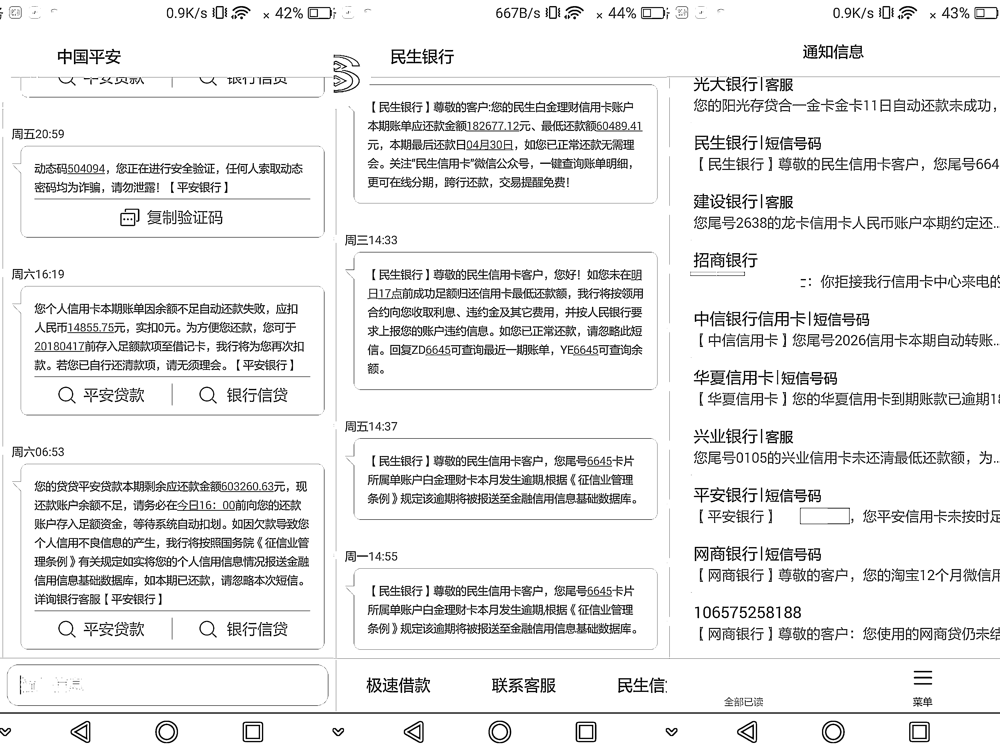  

当时都不敢回家了，在外面租了一个老房子，晚上睡着睡着那个墙皮就往下掉，第 2 天醒来满身是灰。夏天天气热了，出租屋有空调也不舍得开…… 

记得有一次，下雨天屋顶就漏水，吃饭吃着吃着，墙皮跟雨水都往下掉，不舍得浪费，就着雨水和泪水一口一口往里送，能填饱肚子，对当时的我来说就是天大的事儿。 

家里就两个娃，作为老大的我，肯定要担起责任，面对现实，在亲戚帮助下接盘个小店，开始早起贪黑的日子，这里踩过的坑，吃过的苦就不说了，人总要学着慢慢长大，14 岁的我，当时只有一个念头，那就是我得变有钱。 

从小就对互联网特别感兴趣，想着没给学校交学费，那肯定要给社会交学费，再吃不上饭每个月都会留出预算来付费学习，开始在互联网付费购买私域运营，外卖运营等课程，靠朋友圈裂变+抖音探店投放，实体店开始稳定日入 4 位数。 

正是因为付费，接触到不同圈层的人，当时一个外卖运营的导师，在推广美团会员拉新，我抓住机会，利用信息差做人设，各地级市美团外卖经理信息不互通，谁都不认识谁，但有共同痛点，每月要完成会员 KPI。 

我便开始潜入各种外卖运营群，有意无意暗示我也是某城市经理，伪装成城市经理人设分享知识，展示我有低价会员渠道。 

不仅让美团经理完成任务指标，还可以额外合规返利，就这样靠美团会员拉新+外卖返利，裂变 2w 人代理团队，连升几级直接到联创，赚到我在互联网的第 1 个 10 万。 

好景不长，美团和合作方合约到期，拿不到低价会员，盈利太差，平台便把这个项目砍掉了。 

同年我加入生财有术，既然手上没项目，我就开始寻找项目。 

期间又尝试了美团团节社，视频号书单，外卖 CPS 公众号，热点引流，抖音带货，也拿过大大小小的成绩。 

正是因为加入生财有术，有了前面这些丰富的经历，打开了我的认知，拓宽了我的眼界，才能让我敏锐地在风向标捕捉到异常值，深度挖掘多多视频带货项目，到现在已变现 7 位数有余，拿到了一个小结果，正在进一步放大。 

关于多多视频，虽然圈内已经有了许多文章做了详细的介绍，但依然有圈友对此比较陌生。 

简单来说，多多视频是拼多多旗下的短视频平台，相较于“抖快”，它没有独立 app，但对比于“视频号”，它又有一级入口资源位优势。 

多多视频是一个目前最宽松的短视频带货平台，它不需要粉丝，不需要实名，不需要保证金，甚至不需要原创，靠搬运就能获得收益，这些给了普通人赚钱的机会。 

希望接下来这篇文字，给像我曾经一样迷茫的普通人带来一点启发和力量。如有不妥之处，还请不吝指正。 

#   

# 二、拼多多带货的几个阶段 

整个过程的具体玩法和发展业务细节概括为以下五个阶段： 

1、个人自己做多多视频带货，靠“量”取胜 

2、做训练营带学员，沟通打造爆款商品 

3、平台政策变化，尝试线下佣金结算 

4、成为达人和商家之间的桥梁，前端为达人提供素材和商品链接，后端对接商家选品 

5、转型招商团队，成立 mcn 机构赋能达人 

阶段一：个人玩家，积累商家资源 

自从生财的风向标栏目上线以来，我就把抖音戒掉了，一有碎片时间就会打开刷一刷，开开眼界，原来还能这么赚！ 

21 年底我跟往常一样，每天的碎片时间刷风向标，刷到圈友徐子浅发的风向标，了解到多多视频扶持期，简单了解过后，便开始下场实操，先干了再说。 

（1）风口来得时候，早就是优势 

靠买别人 P 图伪装原创作者认证的账号，来获取流量扶持，也挣到了钱，后被平台打击，便搁置了。 

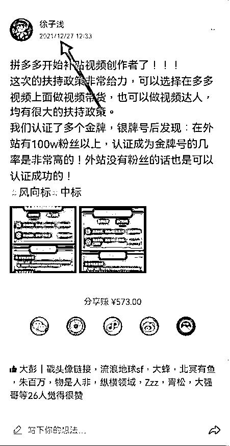  

22 年 2 月底，偶然打开多多视频，看到新推出百万爆款扶持计划，且没有原创作者门槛，我意识到机会来了，开始重拾多多视频。 

2022 年的 3 月份，圈友徐子浅分享了多多视频的实操贴，链接了徐子浅一起交流，互通有无。一个网络上的陌生人，愿意把研究了几个月的实操方法分享给我，这也就是生财独有的氛围了。 

得益于生财圈友徐子浅的无私分享，才让我在多多视频扶持期挣到了第一块钱，领略了“真诚利他”的生财实践，这也为我成为徐子浅的合伙人埋下了伏笔。 

于是我在 3 月初加入了圈友徐子浅的社群，帮我打开了新世界，原来在热门爆款里的链接去找同款更低价的链接，更容易爆量，仅仅用了 20 多天，视频的播放量上了一个新台阶。 

仅仅是下载，搬运，这两个动作，当月突破百万播放视频就有多个，佣金单天过万，20 多天变现 7w+，还带身边不少朋友都入局，变现都很可观。 

正如狗哥所说： 

在大的赛道和类目打不过别人的时候，可以考虑一些小众的类目和赛道，付出同样的努力，可以拿到不同的结果。 

在其他平台想靠搬运这么快拿到结果，可不容易。 

当即 all in 多多视频，加设备开干，于是在 5 月份我拿到了 20w+的小结果。 

  

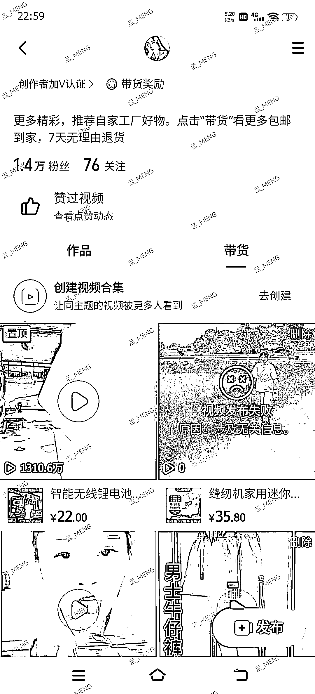  

去年的个人玩法大多已经过时，比如投带货流量卡，每天 2000 的流量卡大部分当时做带货的人都知道，但每周 10 万的流量卡只给 30 个账号，基本一半以上都被我长期把持。 

研究个人玩法一直是我的优势，沉迷于个人玩法，看不到外面的世界就是我的最大短板。 

 

阶段二：带学员做，共同打造爆款商品 

22 年 5 月，我在生财分享了我的一篇实操经验的帖子，得到不少圈友的认可，都想跟我和圈友徐子浅学习。 

之前社群的交付做的不错，很多人都拿到了结果，我们的信心大增，便接纳了这部分圈友。 

社群有 200 多个伙伴后，我们开始借鉴生财的分享得龙珠玩法，鼓励学员多分享，人人为我，我为人人。 

 

我们的社群成员也开始会在实操后，把自己的方法和技巧，以及踩过得坑分享出来。 

就这样，社群成员人人互相学习，互通爆单方法论，几乎每天都在爆单。不断的探索，几乎每天都在爆单。 

这一年社群出现了，很多学员日佣过万，月佣 20 万，单人年佣 100 万（包含线下结算部分），并且不止一位，这就是我们去年的成绩。 

但希望看到数据的你，不要焦虑，这些都是过去式了， 

以后个人纯靠视频带货很难达去年的成就了，去年我们团队只是刚好站在风口上，拼命抓住了它。 

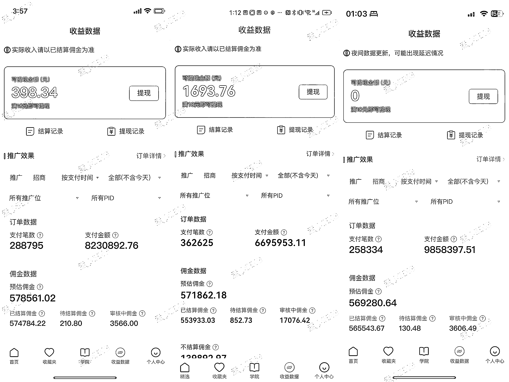 

 

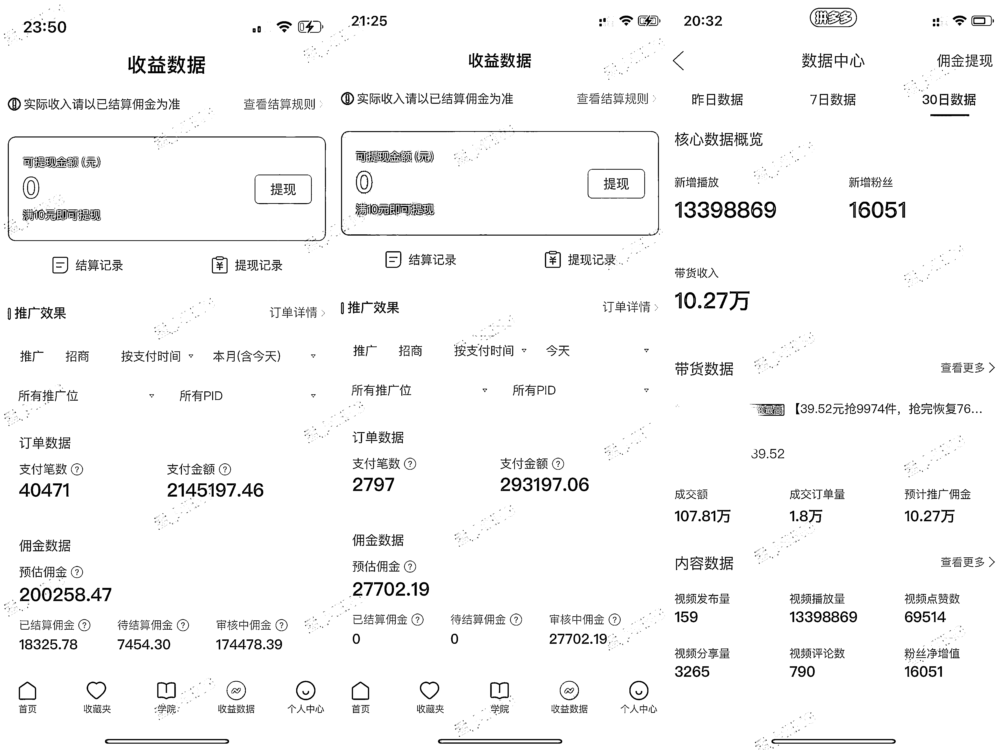 

 

训练营得到学员的一致好评 

现在多多视频，每个月都要完成过 50 个爆款的任务去获得带货资格，无形中每个月都会浪费 2-5 天去做无用功。 

从今年 3 月份开始，平台吞佣金的情况更严重了，并且至今也没有做出调整，以后大概率会一直如此。以前爆一个视频拿到手十几万的情况都不稀奇，今年能拿到 1 万就谢天谢地了，这些都阻碍了个人线上收益的上限。 

由于多多视频带货走的是多多进宝的结算渠道，那多多进宝又有一个链接爆单限制推广的阈值，个人店每天 800 单，专营店和旗舰店 5000 单，这就是拼多多避免商家低价超卖或者爆单了发不出去货，影响消费者体验的一个风控机制。 

到达风控阈值之后，多多视频继续爆多多进宝就会限制推广，视频一样爆，也同样出单，但链接不再有佣金，只有建了单品推广的链接才能，通过商家后台手动点击保障发货解除这个限制。 

这也是去年很多人做多多视频带货的第一个误区：以为爆单了被商家撤佣金了，其实是平台风控了。 

推手能帮商家出单，商家高兴还来不及呢，怎么会撤佣金。 

学员爆单了被风控了，我就帮助学员跟商家去谈判，以恢复佣金，并保持长期合作，就结识了不少爆过单的商家。 

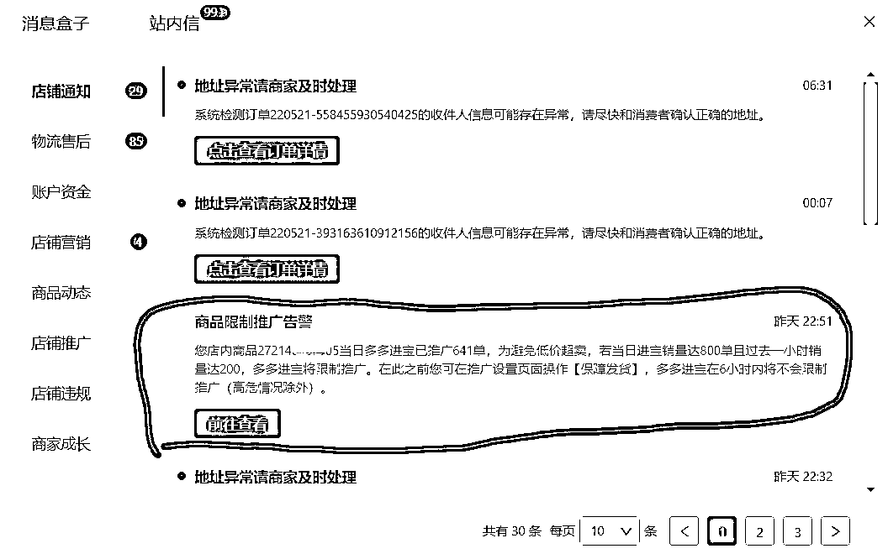  

商家后台消息盒子 

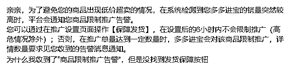  

为什么会被风控的官方解答 

初始合作的商家，大多是我们爆单爆到限制推广的商家，都是有一定打爆链接能力的，取得联系之后不断紧密合作。 

同时官方小二那边也在找带货达人，有些关系不错的商家会把我们推给小二，小二又会将其他 top 商家推给我们，这样我们合作的商家越来越多。 

22 年 10 月，多多视频开始出现大量的，视频爆了，播放量在涨，点赞也爆涨，链接猛出单，但是不出佣金的情况。 

这也是很多人做多多视频带货的第二个误区：以为平台出 bug 了，直接把视频删了，不去深入分析原因。 

经过团队和商家共同测试，知道了这里面的问题所在，就是商家开直通车把我们的视频当做投放素材了，直通车带来的流量出的订单，不计入视频佣金。大部分老学员的佣金都直线下滑。 

有很多人放弃了换了其他项目，我们团队靠着之前合作的商家，用线下结算，一直支撑着。 

也就是关闭多多进宝佣金，不影响视频挂车，我们发视频正常去带货。 

出单了，商家通过后台的视频带货端口，查看我们的出单情况，给我们结算佣金，前提是，商家的利润能覆盖直通车推广费和支付给我们推手的佣金。 

商家后台的数据是最准确的，包含自然流量跟直通车付费流量。 

这就是我们跟商家线下合作的截图，商家后台能看到视频明细，然后给我们微信结账即可。 

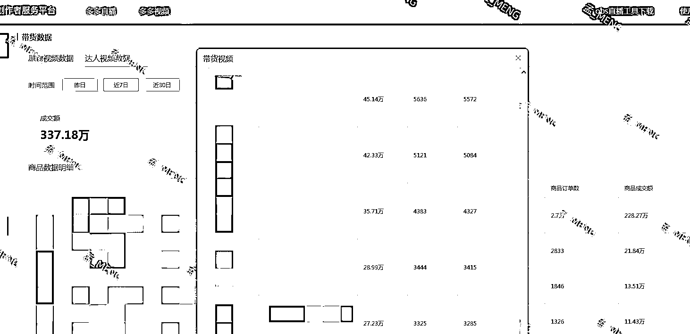  

中途也错过视频号的风口，后悔过，但也想着，连多多视频都做不好，其他项目能做好吗？ 

是木易大佬那篇《绑着炸弹做淘宝，负债百万的逆袭之路》一直激励着我： 

真的不用刻意的在每个风口之间疲于奔命，如果你愿意努力，人生最坏的结果，也不过是大器晚成。 

阶段三：爆单后筛选链接，初步尝试线下结算 

就这样一直坚持着，去年 11 月底到今年 2 月，这个线上吞单的情况好转了一阵，那会正是口罩放开期间，我及时捕捉到热点，开始带货 yq 等相关产品。 

一开始我只是一个人做，靠着长期积累的经验，链接挂上去，基本都能出单。 

11 月 23 号发的视频，到 26 号大爆发，一大早干了近 5000 单，爆单了联系上老板，还可以线下结算，给了我很大信心，开始全力 all in 这个品。 

  

后面怕封号，视频都删了，只找到这个图片 

 

正当我想拉几个伙伴一起开干的时候，可能是连熬了几个大夜的缘故。 

12 月 1 号开始发烧，一开始靠吃退烧药，扛了几天，到 8 号实在扛不住了，头痛欲裂，全身冒冷汗，直接上急诊，医院也没床位，查了个血，开了点药，随后就是每天打吊针了。 

 

一开始拉小伙伴来做的时候，他们会问我，用违规素材，怕不怕封号？ 

当时我脑海里只有一件事，与其考虑账号会不会被封，不如先考虑这个月能不能赚到钱，今天能不能赚到钱，钱赚到了，我重新开号又如何，算好投产比，就往死里冲。 

与其拉长战线，不如猛烈的增加炮火！ 

 

因为是线下结算，正反馈来得太快了，看着商家把一笔款一笔款的进来，我每天还是继续熬夜，就是一直不退烧，后来咋好了也忘了，反正一发烧记忆力也不好了，根本没反应过来去请人干，全部是机械性动作，一刻都停不下来。 

早上拖着沉重的身体起床，开始对接商家，筛选链接，安排伙伴找素材，中午去打吊针。 

晚上又回家测链接，发视频，连续打了十几天吊针，靠着意志力一直强撑着，每天工作十来个小时。 

这种拿命在赚钱，心力交瘁的感觉，让我真的感觉很痛快很爽，我穷怕了，这个钱我必须要赚，因为我不知道下次机会是什么时候了！ 

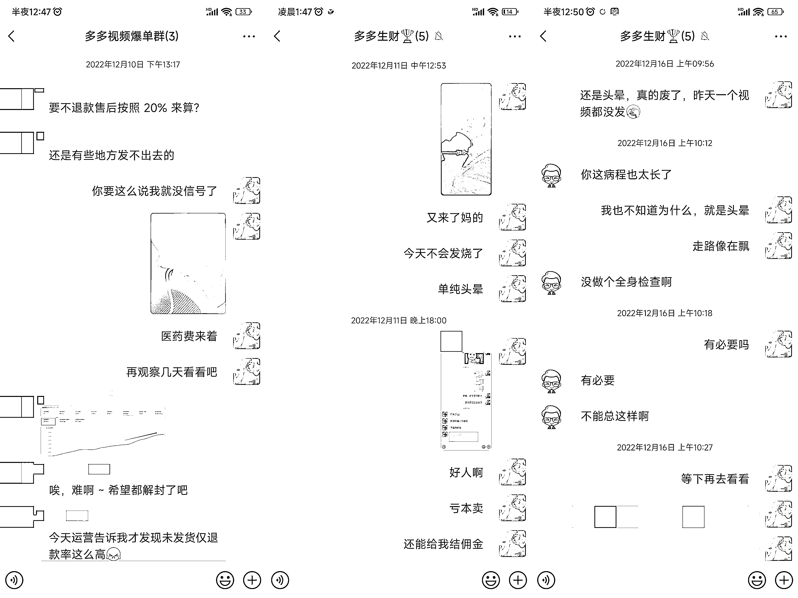 

12 月中才好了没几天，大概是上天惩罚我天天熬夜，一天连肝十几个小时，发烧十几天也没休息过。 

我又发烧了，一个月发烧两次的我，感觉全身虚脱，脑子转不动了，再也没有精力去谈商家了，没办法根据商家的反馈去及时的回应调整，爆单爆到限制了，自然也就没办法线下结算。 

只好开启了直播，因为从来没做过多多直播，什么互动率，停留率，下单率全都顾不上。 

虽说是录播，但靠视频带来的流量，一般卖个几十单就不推流量了，只能开一场又关一场，一天几十个账号轮流播，所以要一直盯着反复开关播，每天早上 7 点直播到晚上 12 点，期间还偶尔去店里盯一盯，有时候太困了就一边喝咖啡，一边掐自己大腿。 

想得到从未有过的东西，就得付出从未有过的努力。 

 

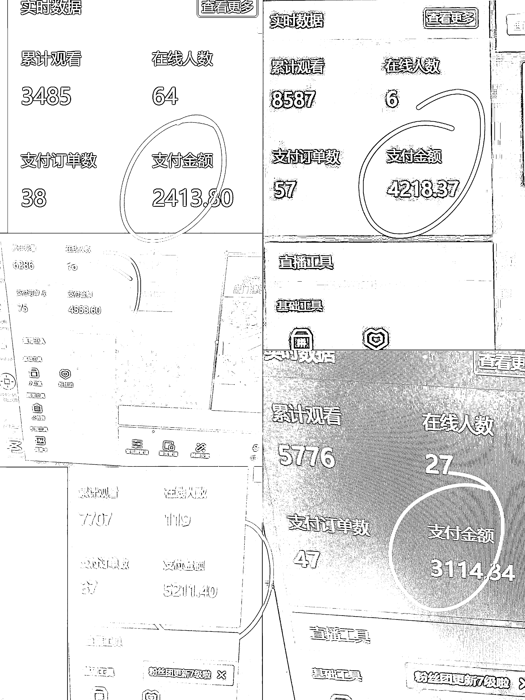 

就这样硬撑着一个月下来，我变现大几十万。 

我不觉得拿到这个成绩，自己有多牛逼，能力有多强， 

我只是比别人幸运一些，风口来了，我刚好抓住了，仅此而已。 

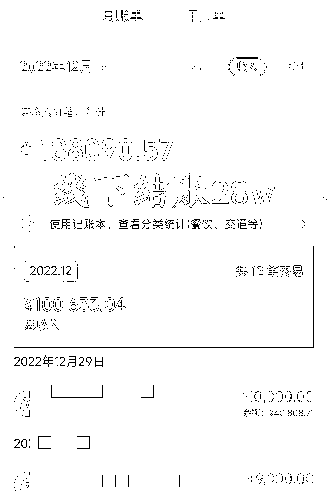 

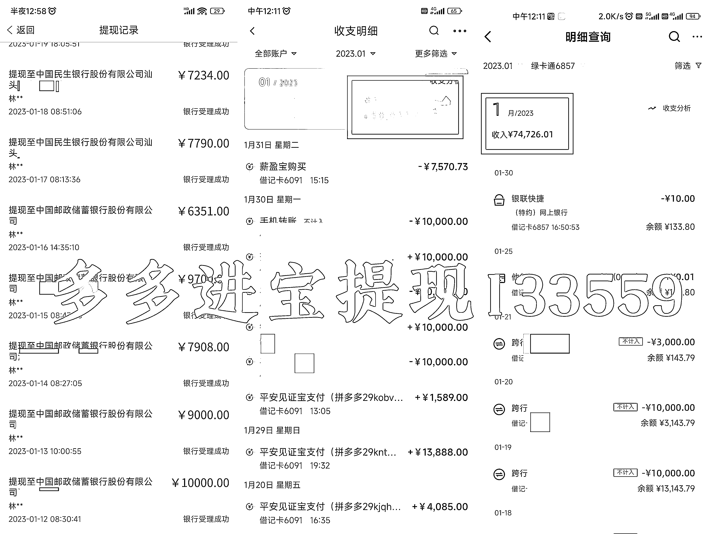 

我还以为熟悉的多多又回来了，可以大干一番了。 

但事与愿违，2 月底开始线上吞佣金又更加严重了，不止直通车链接会吞佣金，连自然流量的链接，平台也会吞佣金。 

在流氓平台赚钱，就要比它更流氓，于是和团队开始探索，全面线下结算模式，直接跳过平台，跟商家线下合作。 

阶段四：前端给达人提供素材和商品链接，后端对接商家选品以及产出优质链接 

（1）一年来累积了不少商家，那就先解决达人问题，聚点人，跑通最小 MVP,测试模式可行性 

初步开始尝试，把以前的老社群成员聚在一起， 

靠我们自身谈判商家的优势及社群一年来累积的信任感，90 个内测名额，一天就抢完了。 

 

而这 90 个老成员都是原来一年里经常都在爆单的， 

那他们是怎么心甘情愿的跟我们机构合作给我们分佣？ 

外面教做多多视频的个人也好，团队也罢。 

都是只教线上，视频跑 100 万的播放，可能多多进宝后台就出个几十单，其余的都让拼多多吞走了。 

而我们这批老成员都领略过线下结算的威力， 

爆 100 万播放的视频，至少能达到 3%的商卡点击率，20%的下单率，至少能产出 3000 单以上。 

 

爆单后通过团队力量与商家谈判，走线下结算，能让他们爆单的收入提升上百倍！ 

（2）达人有了，怎么提高找素材的效率？ 

团队经过一年多爆单经验累积，发现抖音快手的 cid 投流视频，宣传夸大离谱，类似 10 几年前电视广告的风格，符合多多视频人群，容易爆单。 

于是我们咬咬牙花 3w 元直接买投流行业的素材透视眼-有米有数，用来下载素材给学员使用。 

这个网站收录了全网各大平台投流的电商素材，能被投手用来花钱投流的，肯定是优质素材。 

这里以超声波驱蚊灯为例搜索，能发现一下就搜出来，厂家背景，剧情带货，硬广类等电商投流素材。 

 

正是使用这一功能，团队学员在 5 月份，用硬广剧情素材爆了一个线下合作商家的驱蚊灯。 

单视频做到了 138w 的成交额，还被官方小二作为案例，在线下分享会宣讲。 

 

商家给到爆品后，我们先把素材下载好，放到网盘，达人只需要做下载视频，上传视频的动作就行了，大大提高了达人的效率，这也要得益于平台几乎不查重的机制。 

毕竟这是购物平台，而不是内容平台。 

通过 3 个月的努力和沉淀，我们合作商家的数量翻倍了，达到了 200 多位。 

同时也懂得了一些店铺运营知识，指点过一些新手商家做链接，社群成员的收益明显提高了。 

也有学员单日破万，有的已经超过了去年的同期收益，好的带货成绩也给我们带来了更多商家。 

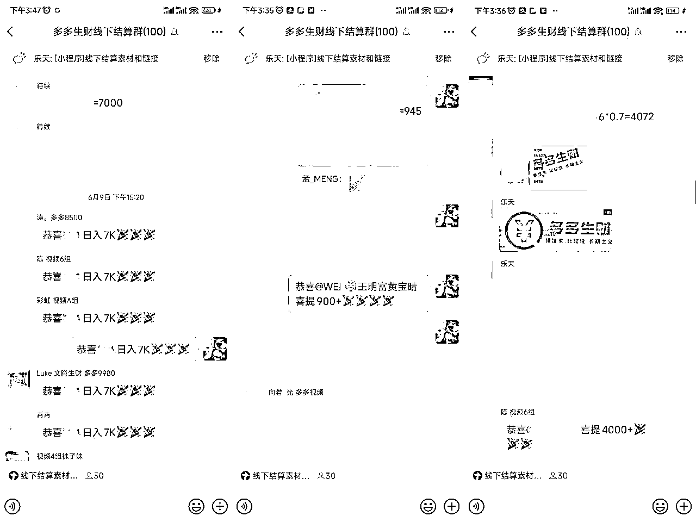 

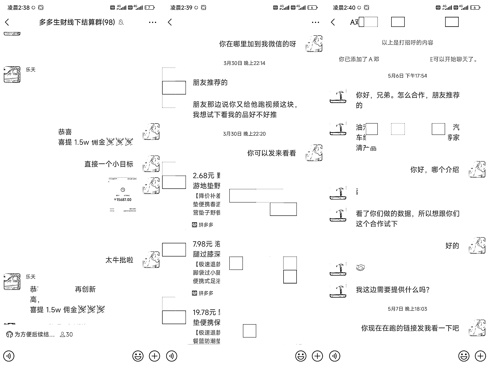 

阶段五：拓展引流渠道，增加达人，让视频爆单的概率进一步增加 

多次爆单的商家，往往有产出更多爆单链接的能力，随着产出的优质链接越多，发现现有达人账号明显不够用。 

想起来 2 月份的时候，看到盗坤大佬发的，在公众号发的一篇文章，讲的是一个创业者， 

通过无底薪招聘合伙人的方式来搬运剪辑，发布视频，自己则负责后端，按收益分成，靠这个模式赚了 500 万。 

我和团队就开始思考多多视频能不能也这么做，我们手上掌握大量的优质商家和链接，只要低成本招聘到"无底薪合伙人"，帮助他们赚到钱，那我自然也就能赚钱了！ 

多多视频是一个好项目，但是要一直稳定爆单，这是不确定性的。 

那么招聘 “合伙人” 来线下办公肯定是不现实的，要承担巨大的成本和风险，于是我们开始尝试，通过抖音直播，展示简单易上手的实操，每天只需两小时，不影响你带娃或者上班，以此来吸引想通过副业赚点小钱的宝妈群体。 

用一个相对低廉的门槛费，让 “合伙人们” 先拥有 “沉没成本”，通过绑定机构，不等爆款任务审核，直接对接线下结账链接，且长期扶持线上带货的方式，与“合伙人们”深度绑定，长期分润。 

现在就来到这个阶段的核心了，怎么解决流量问题？ 

我们采用的是抖音直播招副业粉的方式，通过口播多多视频副业，展示简单易上手的实操，线上快速拿资格+线下结算的优势来吸引宝妈副业粉。 

4 月 1 号开始，到 5 月底，2 个月的时间，最终付费加入的新学员有 600 多位。 

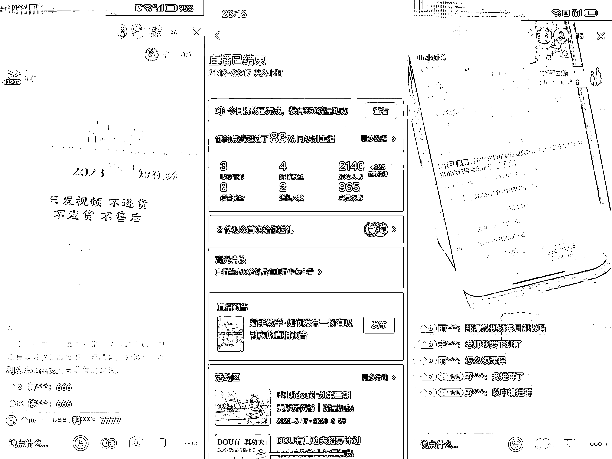 

下面我就把我们这个项目的重点部分-抖音直播引流， 

分 3 个板块进行拆解，希望能让想做这个项目的圈友能快速上手！ 

1.开播前准备 

 

2.直播中 

 

3.下播后 

 

正如盗坤大佬的文章所言 

通过无底薪筛选过来的宝妈，里面有很多的狼，她们的主观能动性特别的强，赚钱欲望极高！ 

刚开始我们的设想是，第一个月以开单为主，争取让大部分人看到第 1 块钱，并没指望他们在短期内能真正赚到钱，因为这是一群毫无经验的宝妈。 

没想到通过无底薪筛选过来的宝妈，执行力特强，听话照做，自己实操过后，再来反馈问题。 

不像我们之前曾引流过其他类型的副业粉，还没开始干，就一大堆问题。 

让我印象最深刻的是有一个二胎全职宝妈，操作 6 个账号，每天搬运 300 条视频，一个半月雷打不动！ 

从日入几块到几百到迎来一次大爆发，单日 4000+， 

到我写文章这天，这个以前未接触过互联网的宝妈，3 个月累积赚了 2w+。 

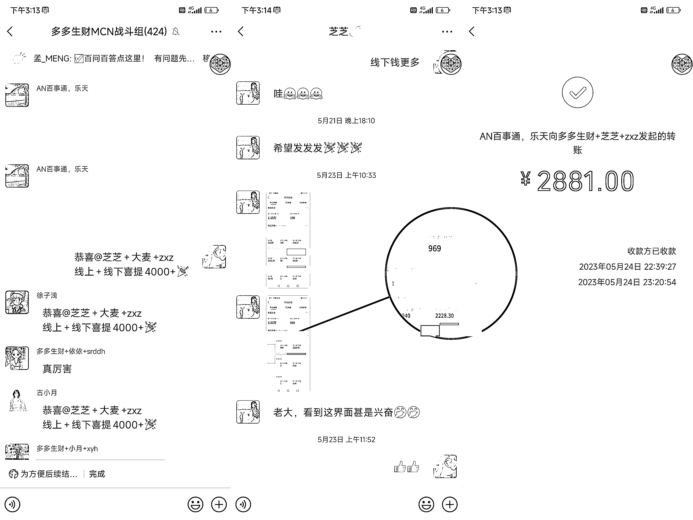 

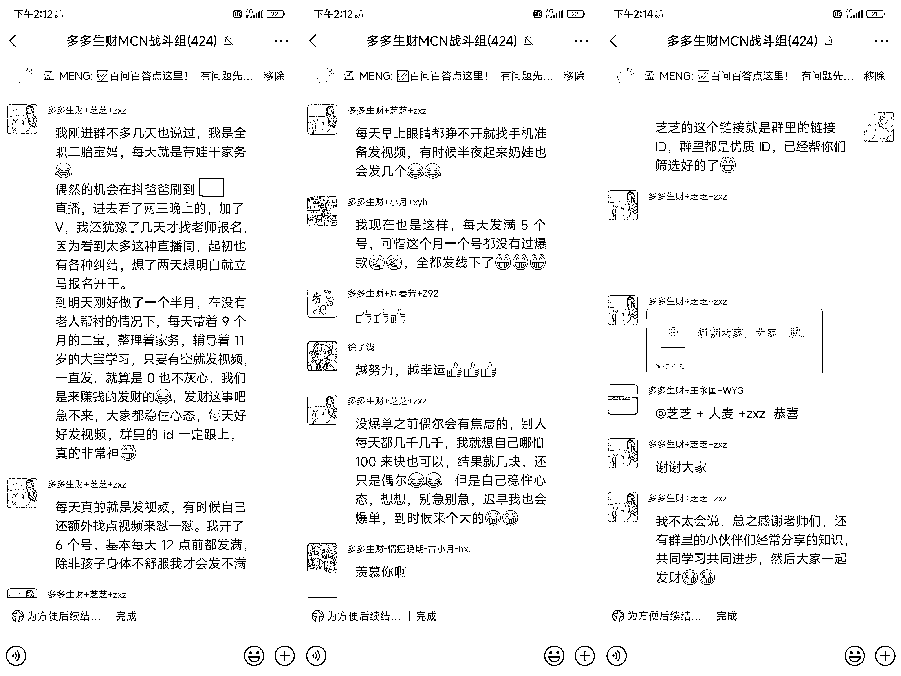 

始于微末，发于华枝，只问耕耘，丰盛自来。 

就这样，在招了 400 人的时候，我们的收益就实现了翻倍！ 

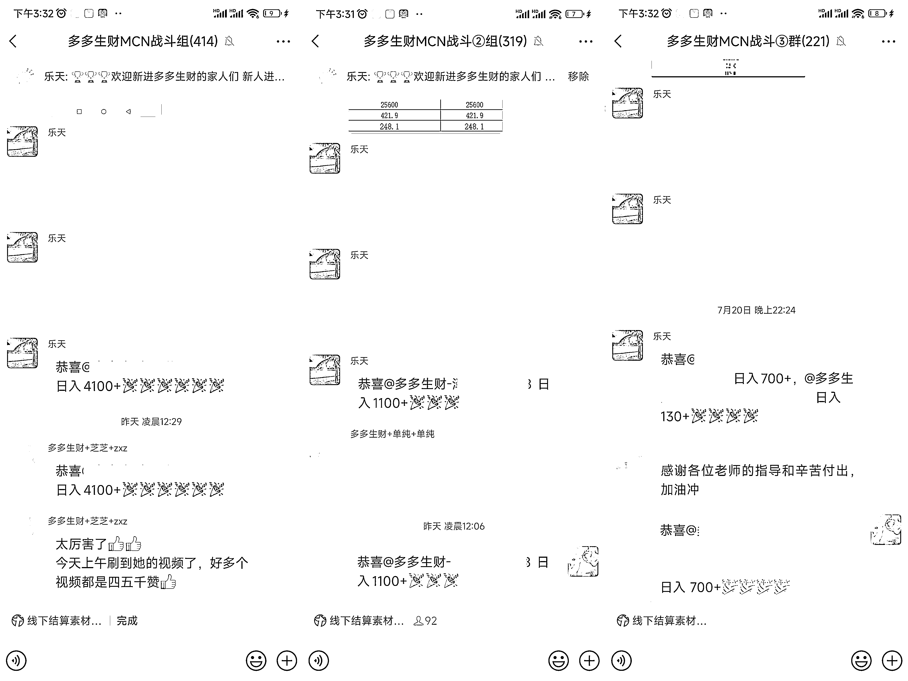 

# 二、如何筛选供应商，建立合作关系 

经过和上百位商家打了一年多的交道，发现在爆品生命周期越来越短的当下，谁跟爆品速度越快谁就能赚到第一波钱，后续进场的商家就只能打价格战了。 

我们也从中积累了一些经验，能更加快速的识别优质商家，这里分享给大家，希望能帮做带货项目的圈友更好的找到后端合作商家。 

筛选优质商家主要有以下几个维度 

（1）看这个商家跟爆品的速度快不快。 

通常情况下多多视频一个爆品的生命周期在一个月左右，跟爆品的速度快就意味着能吃到第一口肉，后来的就只有喝汤的份了！ 

（2）看这个商家的产品有没有价格优势。 

拼多多的比价系统非常强大，商品的价格低，消费者能得到实惠，平台就会愿意给商品推流，我们的带货视频就可以顺势把这个流量放大 

（3）看这个商家卖的货品质如何。 

有的商家卖得商品质量过差或者缺斤短两，这样的商品链接达人带了以后，视频还没跑两天，商品就会因为差评投诉过多被平台限制推广，因为多多视频没有更换链接的功能，所以我们之前发的视频就会全军覆没！ 

（4）看商家有没有合作共赢的精神。 

有的商家到结算日，总是要催很久才能把佣金打给我们，碰到这样结算不痛快的商家就要及时止损，有和他沟通交流的时间不如给结算痛快的商家多爆两条链接！ 

# 三、新人想做的门槛和建议 

（1）个人玩家角度 

多多视频带货现在不需要交保证金，不需要粉丝数，注册好拼多多账号，过一下 50 视频门槛，即可开始带货，几乎没有门槛，也造成了涌入这个项目的人非常多，如果你今年想自己做多多视频，可以参考以下几条： 

1\. 先干起来 

先干起来，就已经成功了一半。 

新手最忌讳的就是，还没下场实操就这里研究一下，那里研究一下，你不需要去深究平台，不要钻牛角尖，等你真的把这些东西研究明白了，别人早就爆单了。 

一边实操一边学习，遇到不懂的再去请教别人，学习资料，在实战中解决问题！ 

2\. 首先账号要多 

因为今年在 MCN 机构的宣传下，必定会在短时间内涌入大量的人来跟你竞争，我们团队收益稳定的学员当中最多的自己运营 30 多个账号，一半的也在 10-20 个账号之间。所以建议新手 3 个账号起步，过了第一个月熟悉期后，应考虑加到 10 个账号。 

3.理解平台人群： 

三四线城市下沉市场用户，对产品的质量要求不高。 

接近生活，实用且价格实惠的商品更受短视频观众的喜爱。 

都用拼多多买东西了，肯定是要买便宜的，所以咱们带货要选择价格相对更便宜的商品。 

4\. 理解用户行为 

这就是一个购物平台，用户打开拼多多就是想来购物的，如果单纯想刷视频娱乐，那应该是去抖音快手。 

既然用户刷多多视频是带着购物需求来得，是以下单为导向，那么选一条优质的商品链接就是重中之中。 

多多视频的推流逻辑，是靠链接流量，来带动视频流量， 

同一个视频，有的会跑出很高的播放量，有的却没有播放量，两种结果，唯一的不同，就是因为带了不同的商品链接。 

（2）机构入局角度 <ne-h4 id="8444eef5" data-lake-id="8444eef5">1\. 搭建前端引流体系</ne-h4> 

引流的方法我们主要有找做知识分享的主播合作以及和运营私域的博主合作。 

我们前期想要扩张人数的时候，找的是我们以前的一个做过直播的老学员，现在也是我们直播事业部的合伙人。 

找知识分享主播拉人的优势在于：学员通过直播间讲解的一些基础操作，已经大概了解了这个项目，比较容易上手，直播一般拉的宝妈多一些，他们中很大一部分每天的碎片时间比较多，空闲的时间都可以用来发短视频，宝妈心态比较良好！ 

劣势在于：如果不能快速搭建起来直播团队的话，进人的速度比较慢，一个优秀的主播大概一天也只能招收 10 个学员左右，我们做机构一定要人多，才能去博取更多爆单的概率，获取确定性收益。 

和运营私域的博主合作是目前引流最简单高效的玩法了，私域博主有人，而我们有跑通的项目，双方一拍即和，前期沟通好分成比例，需要在准备一篇软文，让私域博主去分发推广，我们做好交付就行了。 <ne-h4 id="24a04897" data-lake-id="24a04897">2.搭建交付结算体系</ne-h4> 

当把人引进来了以后最重要的就是交付了，只有让学员赚到钱了，我们这个项目才能持续的发展下去。 

我参加过生财有术的外卖 CPS，抖音视频带货小航海，都成功变现，拿到了小小的成果。 

从中不仅学到了项目，成功变现，还学到了如何高质量的运营一个训练营。 

参加生财小航海的时候，使用实操手册，和百问百答很方便，颗粒度足够细，实操的时候在细节方面给了很多帮助。 

照猫画虎，针对多多视频，我们也做了一个实操手册， 

让学员可以一步一步跟着实操，尽快的熟悉平台，赚到第 1 块钱。 

并且把学员的高频问题整理成百问百答手册，让学员有问题，可以第一时间搜索文档找到答案，减轻我们的工作量。 

 

鉴于我们初期引流的学员都是互联网新手，我们还准备了各个环节的视频教程，从怎么注册账号，怎么绑定账号，怎么去下载视频，事无巨细搭配着手册，让小白进了之后也能轻松上手。 

综上所述，在做好后端的同时，要尽最大努力，赋能达人去变现，机构跟达人是深度绑定的，让达人赚到钱，机构自然也就赚钱了，那这个项目才具有可持续性。 

# 四、我踩过的坑 

（1）太高估人性 

个人带货阶段的时候，也带学员做，想着扶持学员，让学员快速放大项目，就把手上的商家资源无偿对接给学员。 

不曾想，学员直接恶意竞争，开出超低佣金来抢商家，这也让我们在后面的机构阶段更加慎重。 

机构应当和商家每天保持紧密联系，定期回访，在商家起链接的货损阶段，给到一定的免单区间，共同承担货损成本，以此和商家保持长期合作，增加团队自身的核心竞争力，让个体小玩家失去和商家谈判的能力。 

（2）太高估个人力量 

早有听说有同行开启了 MCN 模式，通过规模躺赚，但之前一直不屑一顾，因为我们个人收益，抵得上一整个 mcn 的收益，甚至更多。 

但个人的力量终归是有限的，短视频有太多的不确定性，只能通过不断的加号加设备来维持。 

浪费了很多时间精力，也错过了去年 MCN 红利期，去年的多多视频不吞单，疫情期间，大多人都在寻找副业，正是做 mcn 的最好时机。 

但我相信，只要开始，一切都不晚，种一棵树最好的时间是 10 年前，其次是现在。 <ne-h3 id="dd16eb3c" data-lake-id="dd16eb3c">（3）太信任商家</ne-h3> 

有不少商家看到我们视频爆了之后，通过达人私信来联系我们达人再联系上我们机构。 

碰巧商家的品是当下热品我们也想做，我们在没收押金等风险措施的情况下，就给商家带货了。 

不曾想，带爆了之后，商家通过 ps 后台图片来糊弄我们，给我们虚假数据。 

幸好足够熟悉平台，知道商品价格带小数位，那每一个视频数据的后面肯定都带小数位，才避开这次危机，没造成什么损失。 

真实数据：成交金额带小数位 

 

虚假数据：成交金额不带小数位 

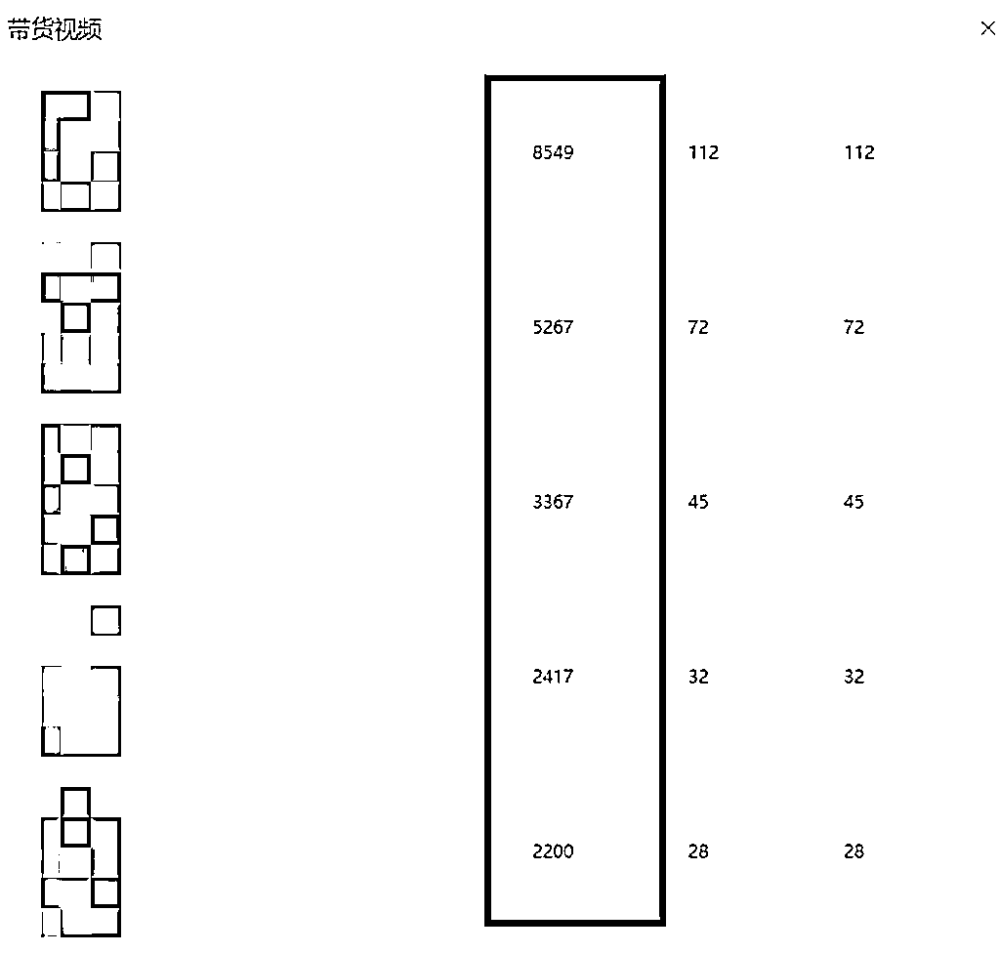 

经过这次事件，我们开始完善风控机制，不管再牛逼的商家，再熟的商家都要根据日订单量，收取一定的押金，以免再次出现这种情况。 

# 五、最后总结 

行文至此，回想起鱼丸刚开始找我约稿时，因文笔欠佳，迟迟无法成文。 

到杨爽姐，和圈内几位相交好友鼓励我先写出来，只要是真诚分享，不管写得如何，能给想了解或实操这个项目的圈友，带来一点启发，少走一点弯路，这就够了。 

前前后后修改了四版，最后这一版是我在凌晨 4:20 的时候完成的，白天要对接商家选品，去商家店铺挑选链接，时间排的满满的，只有深夜能抽出来时间写文章。 

回顾这几年，从懵懵懂懂到小有所成，加入生财有术，刷精华帖，参加小航海，刷风向标，下场实操，分享实操贴，链接圈友，合作项目，放大收益。环环相扣，连点成面，前行的每一步，都算数。 

一飞冲天是特例，厚积薄发的才是人生。 

感谢我的事业合伙人，徐子浅，乐天，待续，萍子，是我们无数次，在深夜头脑碰撞，一次又一次的摔倒，又爬起来，才有了今天的成绩！ 

特别感谢好朋友胜前，若虚，生财前辈：梁靠谱，以及我的合伙人们协助我完善这篇文章，感谢这一路上在无形中给我力量的圈友们，狗哥，木易，郭晓文，随心，盗坤等等，感谢你们，一直不断鼓励我，给我前行的力量！ 

祝生财有术越办越好，圈友们越赚越多！ 

评论区： 

坏脾气的小可爱 : 牛呀，太厉害了！ 爱吃肉酱拌面的冰沙 : 厉害🐮 黑猫 : 牛 徐子浅 : 孟总牛逼 超级靠谱[强] 小吕 : 一路生花，直呼孟总牛逼👍 梵野 : 我为孟总举大旗[呲牙] Vic 胜前 : 太优秀啦！项目发展的标杆路径，从个人到团队、从 0 到 1 再复制、从风口到归于平淡，风口过去了，但却形成了自己的护城河，祝孟哥越来越好～ 半条咸鱼 : 牛逼 

 