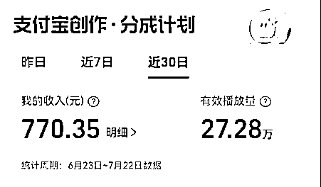
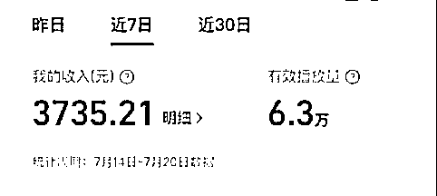
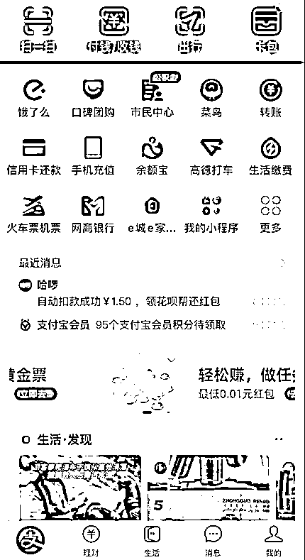
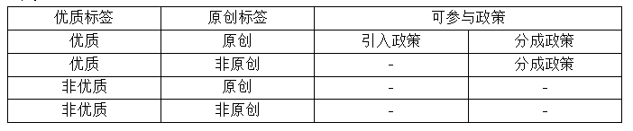
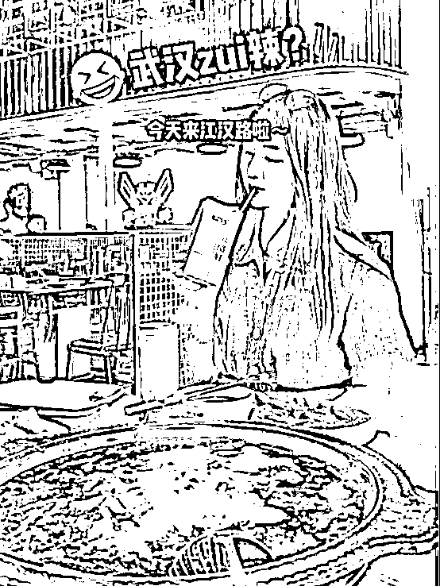
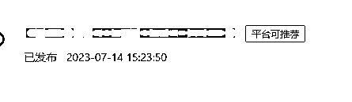

# 支付宝分成计划玩法实操详解和避坑玩法

> 原文：[`www.yuque.com/for_lazy/thfiu8/eah3eu9x4pkqds9k`](https://www.yuque.com/for_lazy/thfiu8/eah3eu9x4pkqds9k)

<ne-h2 id="a8371dc1" data-lake-id="a8371dc1"><ne-heading-ext><ne-heading-anchor></ne-heading-anchor><ne-heading-fold></ne-heading-fold></ne-heading-ext><ne-heading-content><ne-text id="u54a0649c">(精华帖)(82 赞)支付宝分成计划玩法实操详解和避坑玩法</ne-text></ne-heading-content></ne-h2> <ne-p id="u000a94e8" data-lake-id="u000a94e8"><ne-text id="u14b56a67">作者： 白丁</ne-text></ne-p> <ne-p id="u98eed9df" data-lake-id="u98eed9df"><ne-text id="u84fa5aa9">日期：2023-07-31</ne-text></ne-p> <ne-p id="u7dfc910d" data-lake-id="u7dfc910d"><ne-text id="u73d539d0">《支付宝分成计划玩法实操详解，分享这个项目避坑玩法》</ne-text></ne-p> <ne-p id="u9761f5a1" data-lake-id="u9761f5a1"><ne-text id="u485e2c45">哈喽，大家好~我是白丁，生财圈的新人</ne-text></ne-p> <ne-p id="u1f5e12c0" data-lake-id="u1f5e12c0"><ne-text id="u86ae22ec">这是我第一次在生财里发文，我是今年 4 月 20 号开始加入生财的，平时在生财有术里收获了很多知识，这个圈子里分享的内容也非常真诚。本来这个课程是为比高老师的高研社做的打卡课程，我想着那边几千人都参与了这个打卡课，也藏不住私了。所以今天我给大家分享一下我最近做支付宝分成计划这个项目的玩法和心得，希望能对想做支付宝分成计划的伙伴有所帮助。</ne-text></ne-p> <ne-p id="u4ce37c2a" data-lake-id="u4ce37c2a"><ne-text id="u4eb28a42">我主要围绕以下这几个点详细的展开分享：</ne-text></ne-p> <ne-p id="u81889177" data-lake-id="u81889177"><ne-text id="ub498b184">1.为什么要做支付宝生活号</ne-text></ne-p> <ne-p id="ud85e575f" data-lake-id="ud85e575f"><ne-text id="u58a848b1">2.当前做支付宝生活号的三类人</ne-text></ne-p> <ne-p id="u62d2dbcf" data-lake-id="u62d2dbcf"><ne-text id="u728a3291">3.开通收益的条件解读</ne-text></ne-p> <ne-p id="u9c5151df" data-lake-id="u9c5151df"><ne-text id="ue2b566d3">4.每个账号的单价为什么都不一样和怎么提高单价</ne-text></ne-p> <ne-p id="u70a0cbee" data-lake-id="u70a0cbee"><ne-text id="udddbbd6c">5.普通人怎么在支付宝生活号内掘金，怎么能搬运开通收益？开通收益后怎么维护？</ne-text></ne-p> <ne-p id="u52a670ab" data-lake-id="u52a670ab"><ne-text id="u3db6d867">6.支付宝生活号封面如何设置？什么样的封面开通不了收益？</ne-text></ne-p> <ne-p id="u30e9b67b" data-lake-id="u30e9b67b"><ne-text id="ue00e53f8">7.做支付宝生活号的内容雷区有哪些？</ne-text></ne-p> <ne-p id="ud719da38" data-lake-id="ud719da38"><ne-text id="ucd7b9e4e" ne-bold="true">一、为什么要做支付宝生活号</ne-text></ne-p> <ne-p id="u75d35e9f" data-lake-id="u75d35e9f"><ne-text id="u6614634c">一个新的内容平台出现，在初期都是属于一个混沌期，这个时候相当于一个小风口，平台对内容的审核不是特别严格，只要不是做的太过分都是睁一只闭一只眼。这个时候恰恰是入局最好的时候，也是最好撸收益的时候。如今各个平台给内容创作者的收益已经非常少了，没有特别强的内容生产能力想获得收益变的很难，既然有这么一个高单价的平台出现我们就非常有必要进去试试水。</ne-text></ne-p> <ne-p id="u3fcc3a5e" data-lake-id="u3fcc3a5e"><ne-text id="u9cc4bca0">目前他的流量入口只有支付宝首页，但我们不要忘了阿里旗下还有别的内容平台，像优酷、大鱼号，我们畅想一下万一其他平台也给支付宝生活号流量呢，这样的流量也是不允许我们忽略的。</ne-text></ne-p> <ne-p id="u0731b24f" data-lake-id="u0731b24f"><ne-text id="ue2fc5c99" ne-bold="true">所以我们提前布局，其他交给时间。</ne-text></ne-p> <ne-p id="u000e5f22" data-lake-id="u000e5f22"><ne-text id="u51a9fcbd">支付宝生活号其实很早就有了，一直都没有给特别大的流量。</ne-text></ne-p> <ne-p id="u5142e34b" data-lake-id="u5142e34b"><ne-card data-card-name="image" data-card-type="inline" id="UdmLz" data-event-boundary="card">  <ne-p id="u7236c686" data-lake-id="u7236c686"><ne-text id="u99a893d6">大家是不是都是通过这张图开始关心支付宝生活号的，这个项目能火和这张图有直接关系，万次播放 266 元的单价谁看了都心动，之后一些做流量的博主开始猛推这个项目，然后这个项目就火了。其实这个单价算少的，我们自己也在做一批号，单价从几十到几百的都有。</ne-text></ne-p> <ne-p id="u513fa787" data-lake-id="u513fa787"><ne-card data-card-name="image" data-card-type="inline" id="Ej7e3" data-event-boundary="card"><ne-card data-card-name="image" data-card-type="inline" id="R4Hlx" data-event-boundary="card">  <ne-p id="ucf4d8583" data-lake-id="ucf4d8583"><ne-text id="ub78953e3">具体为什么每个号的单价不一样，我在后面单独解说，方便各位同学在实操中提高自己的内容单价。</ne-text></ne-p> <ne-p id="ua0cdea13" data-lake-id="ua0cdea13"><ne-text id="u99797bbe" ne-bold="true">二、当前做支付宝生活号的三类人</ne-text></ne-p> <ne-p id="u30f4f6fb" data-lake-id="u30f4f6fb"><ne-text id="ufa1591f2">支付宝生活号零门槛入驻，打开自己的支付宝在下面有“生活”这个入口点进去完善资料就算注册了，如果没有更新一下支付宝版本就有了。目前在支付宝里掘金的主要有三类人，也对应的三种账号：</ne-text></ne-p> <ne-p id="u9db7978c" data-lake-id="u9db7978c"><ne-card data-card-name="image" data-card-type="inline" id="k4k5A" data-event-boundary="card">  <ne-p id="u1073e2a9" data-lake-id="u1073e2a9"><ne-text id="ua4688fd8">1.个人号</ne-text></ne-p> <ne-p id="u4559ee0a" data-lake-id="u4559ee0a"><ne-text id="u5b84be64">个人号只要有实名的支付宝都可以开通，刚开通的时候是没有收益的，需要满足五个条件就可以提交申请。还有一类个人号，有其他平台账号粉丝的可以找 MCN 提交，这样的号看内容质量决定开通了有没有分成权限，一般在其他平台做的二创内容，只要质量不是特别低，都能拿到支付宝的分成收益。</ne-text><ne-text id="uf0525abe" ne-bold="true">如果你有抖音/快手有 10W 粉丝或者知乎/小红书/B 站有 1W 粉丝，可以看我的主页联系我，我帮提交申请开通分成计划，审核通过了发视频就有收益。</ne-text></ne-p> <ne-p id="ude64939f" data-lake-id="ude64939f"><ne-card data-card-name="image" data-card-type="inline" id="W0gzA" data-event-boundary="card"></ne-card></ne-p> <ne-p id="ue8a0075f" data-lake-id="ue8a0075f"><ne-text id="ufeaf3bb8">2.企业号</ne-text></ne-p> <ne-p id="ue89b76af" data-lake-id="ue89b76af"><ne-text id="u537e06c5">企业号和个人号一样，入驻政策和分成收益政策都是一样的。企业号可以提交申请生活号 MCN，提交通过后可以签约达人入驻享受拉新收益和达人收益分成，而个人号不可以。</ne-text></ne-p> <ne-p id="uefd4ad67" data-lake-id="uefd4ad67"><ne-text id="u122ddb00">3.生活号 MCN</ne-text></ne-p> <ne-p id="uf62c0711" data-lake-id="uf62c0711"><ne-text id="udcc5bcca">申请生活号必须是企业主体，申请的企业必须经营年限一年以上，一年内无违规记录，且有 5 个满足条件的账号或者有 5 个账号为企业开局证明背书。生活号 MCN 福利收益是非常高的，有拉新奖励和签约达人分成。</ne-text></ne-p> <ne-p id="u47195517" data-lake-id="u47195517"><ne-text id="uaa904134">目前申请成功的 MCN 公司特别少，支付宝对 MCN 开放也很谨慎，只要申请通过了就能跑马圈地，享受第一波真正的红利，签约达人成功就有拉新收益。</ne-text>[<ne-text id="u90683d55">p.alipay.com</ne-text>](http://p.alipay.com)<ne-text id="u5f5888fc">这是申请地址，官方钉钉号：30410015958。</ne-text></ne-p> <ne-p id="u6129cb68" data-lake-id="u6129cb68"><ne-text id="u94e50d0e">如果生财里的伙伴满足开通 MCN 条件一定去申请一个，这是实实在在的一波红利，阿里真金白银的给到了机构。还有就是个人有 10W 粉的抖音/快手号或者小红书/B 站/知乎有 1W 粉丝可以找 MCN 机构提交申请开通收益，申请通过了发视频就有收益，单价依照近 10 条视频质量评级。</ne-text></ne-p> <ne-p id="ub3ca0513" data-lake-id="ub3ca0513"><ne-text id="u6e16418e" ne-bold="true">三、开通收益的解读</ne-text></ne-p> <ne-p id="u90b482fb" data-lake-id="u90b482fb"><ne-text id="u0c5d6471">我们个人在做支付宝生活号分成计划的时候都需要通过这五个条件才能有收益：</ne-text></ne-p> <ne-p id="uc68c554e" data-lake-id="uc68c554e"><ne-card data-card-name="image" data-card-type="inline" id="JmGNy" data-event-boundary="card">  <ne-p id="u255d10a2" data-lake-id="u255d10a2"><ne-text id="u045e0a86">1.近 30 天活跃粉丝量≥100</ne-text></ne-p> <ne-p id="ub800f1f7" data-lake-id="ub800f1f7"><ne-text id="ufa044a77">这个 100 粉丝看起来很简单。在我们做号的时候会发现这一条几乎让 99%的博主崩溃，因为生活号的用户实在是少，发出去的视频播放量也特别少，就不可能发几条视频就有很多粉丝。这个 100 粉丝不是说账号够 100 粉丝就行，是要求活跃粉。什么意思呢？就是最起码关注你的粉丝是看生活号的，在这一点我们经过测试已经跑通，可以通过刷子解决。在刷粉前我们会在自己的账号里发布 3 条视频，刷粉来的粉丝关注后刷一下账号内的视频就会成为活跃粉或者先刷完视频再关注就行了。这样活跃粉解决了，在粉丝里还有一个坑。支付宝能检测出你的粉丝是刷的，在所有条件满足了你点击“立即加入”进入审核期，一次性刷的粉很容易被判定是刷粉的，会拒绝我们的账号开通分成计划。在 7 月 20 号之前还没有这么严格。后来我们经过测试这一条也解决了，就是一天不要刷太多，一天刷粉不要超过 15 个，分多天刷并且刷的粉要观看新发的视频就能规避掉。这个方法具体后面会不会被和谐，能管用多久就看支付宝了。</ne-text></ne-p> <ne-p id="u503ae336" data-lake-id="u503ae336"><ne-text id="u98a90ea9">2.近 30 天发布视频数量≥4</ne-text></ne-p> <ne-p id="uec4aaece" data-lake-id="uec4aaece"><ne-text id="udc89d8a5">这一条非常好满足，就不多讲了。</ne-text></ne-p> <ne-p id="u2a63b0a1" data-lake-id="u2a63b0a1"><ne-text id="u0eb3730c">3.近 30 天视频条均播放量≥100</ne-text></ne-p> <ne-p id="udad382fd" data-lake-id="udad382fd"><ne-text id="ue546a1cb">这一条也没有特别要讲的，怼视频就行了。这里有一个点要注意，如果我们发布 10 多条视频后平均播放不足 100，我们看一下那一条拉了平均值，把这条视频删除了就行了。</ne-text></ne-p> <ne-p id="ua23123f4" data-lake-id="ua23123f4"><ne-text id="u08f4efad">4.实名认证</ne-text></ne-p> <ne-p id="u33ee8bec" data-lake-id="u33ee8bec"><ne-text id="u31909663">实名认证需要刷脸，所以使用主体最好用自己或者身边人的。实名认证还会涉及到提现，所以在实名选择上一定要慎重。</ne-text></ne-p> <ne-p id="u3f96c87d" data-lake-id="u3f96c87d"><ne-text id="ucf3e1217">5.符合平台画风要求</ne-text></ne-p> <ne-p id="u76b950a4" data-lake-id="u76b950a4"><ne-text id="u31da0d29">这个目前是大坑，大部分人都是卡在这一条上面了。支付宝对画风这一点要求的特别严格，标题、版权、内容质量、封面、内容垂直度等都算画风，所以我们在开通分成前对内容必须严格，按照他的要求去做才能开通，他的画风内容要求可以参考这个链接：</ne-text>[<ne-text id="u7c88a135">https://www.yuque.com/mayan-6kuum/cz8y3u/ikpa7rb643kaz7cn</ne-text>](https://www.yuque.com/mayan-6kuum/cz8y3u/ikpa7rb643kaz7cn)</ne-p> <ne-p id="u19b98a9e" data-lake-id="u19b98a9e"><ne-text id="u57e826dc">所以说平台画风非常坑，我们也是不断试错不断调整，对视频的封面、内容优化，申请的时候通过率大大提高了。</ne-text></ne-p> <ne-p id="u62ab8fea" data-lake-id="u62ab8fea"><ne-text id="u43076f61" ne-bold="true">四、为什么每个账号的单价都不一样</ne-text></ne-p> <ne-p id="u8324904a" data-lake-id="u8324904a"><ne-card data-card-name="image" data-card-type="inline" id="nn0v8" data-event-boundary="card"><ne-card data-card-name="image" data-card-type="inline" id="Iuq53" data-event-boundary="card">  <ne-p id="u998ea5e1" data-lake-id="u998ea5e1"><ne-text id="uf944a215">上面两个账号的收益单价相差的就很离谱，为什么一个单价 411 一个单价 28 呢？这在以往我们所做的平台里这么离谱的单价差是重来没有的，在支付宝生活号里是真实存在的，因为支付宝生活号的单价受领域与评级影响，领域和评级不同单价也不一样。具体评级看下面这个表：</ne-text></ne-p> <ne-p id="u5a78db11" data-lake-id="u5a78db11"><ne-card data-card-name="image" data-card-type="inline" id="CsY1K" data-event-boundary="card">  <ne-p id="ud5492bd5" data-lake-id="ud5492bd5"><ne-text id="u899d2cc2">通过上表就非常清晰了，能拿到高单价的都是优质的原创内容。所以我们在做内容的时候就要了解什么样的内容算优质的。目前我们摸索出影响单价的因素有：</ne-text></ne-p> <ne-p id="u018fa412" data-lake-id="u018fa412"><ne-text id="u427d44e9">1. 有效播放量</ne-text></ne-p> <ne-p id="u5cab855a" data-lake-id="u5cab855a"><ne-text id="u76ad3c0b">2. 内容质量：包含内容的垂直度、画面清晰、解说与画面匹配</ne-text></ne-p> <ne-p id="u3d3693c6" data-lake-id="u3d3693c6"><ne-text id="u6d2ea287">3. 播放时长</ne-text></ne-p> <ne-p id="u2941bcc7" data-lake-id="u2941bcc7"><ne-text id="u98fda465">4. 账号价值：这个是支付宝生活号评级，我们看不到，只能通过单价判定</ne-text></ne-p> <ne-p id="ue292157f" data-lake-id="ue292157f"><ne-text id="u40b7d923">这是我们目前摸索出的几个影响单价的重要指标，针对这些指标我们在做视频的时候制定了标准，对封面、标题、内容等都有规范，我们做内容的标准也分享给大家：</ne-text></ne-p> <ne-p id="ua073f5b9" data-lake-id="ua073f5b9"><ne-text id="uaa82dfdd">1.内容时长：1-5 分</ne-text></ne-p> <ne-p id="u9d4fb20e" data-lake-id="u9d4fb20e"><ne-text id="u6bfde3bc">支付宝生活号视频要求 15 秒到 15 分钟，我们在实操的时候发现视频太短完全没有收益，视频低于 1 分钟对单价影响就特别大，经过实测视频做 1-5 分钟完全 OK，时长太短单价上不去，如果做的太长又耗时太长。</ne-text></ne-p> <ne-p id="uca4e39e7" data-lake-id="uca4e39e7"><ne-text id="ub8d91c65">2.封面：开通分成计划的重要指标</ne-text></ne-p> <ne-p id="u9acfd443" data-lake-id="u9acfd443"><ne-text id="u6488538e">支付宝生活号对封面的要求非常严格，封面不合格提交分成计划的时候都会成为被拒绝的因素，所以我们在封面上必须要注意，无论横屏还是竖屏封面都不允许模糊、黑边白边，添加元素不能覆盖主体等。</ne-text><ne-text id="u0baefd13" ne-bold="true">封面我单独放到后面重点讲，封面真的很重要。</ne-text></ne-p> <ne-p id="ua9a6917d" data-lake-id="ua9a6917d"><ne-text id="u071c6f78">3.内容领域垂直</ne-text></ne-p> <ne-p id="u3f7618ca" data-lake-id="u3f7618ca"><ne-text id="uea649542">在做内容的时候要做垂直领域的，内容越垂直账号的标签越优质。</ne-text></ne-p> <ne-p id="ub179dfb4" data-lake-id="ub179dfb4"><ne-text id="u64df19ca">4.内容优质</ne-text></ne-p> <ne-p id="u9b9eba6f" data-lake-id="u9b9eba6f"><ne-text id="ube9dcd40">我们现在主要做的是二创视频，发布的视频分辨率必须 720P 以上，视频里的素材在一个视频内不重复出现，解说稿不做水文，注重文案的完整性。在制作上对素材再做常规的去重处理，视频内绝不允许有水印、logo、站外名称出现，因为我们的素材都是在其他平台拿过来的，经常会出现 logo、水印，所以我们下载视频的时候都是用轻抖先去水印，然后再人工过一遍。</ne-text></ne-p> <ne-p id="u097822ee" data-lake-id="u097822ee"><ne-text id="u1876c93c">为了开通分成计划和提高单价，我建议同学们去做二创，二创做的优秀了也能拿到非常高的单价，做的时候不用担心缺素材，抖音、快手、视频号、B 站、youtube 上大量的素材可供使用，现在做的人还很少，不用担心素材判重。</ne-text></ne-p> <ne-p id="ud8b15943" data-lake-id="ud8b15943"><ne-text id="uff8712bf" ne-bold="true">五、普通人怎么在支付宝生活号内掘金，怎么能搬运开通收益？开通收益后怎么维护？</ne-text></ne-p> <ne-p id="u4255f340" data-lake-id="u4255f340"><ne-text id="uf32b9560">做内容原创是根本，但没有原创能力就不能玩了吗？可以玩，但是要承担一定的风险。我们在初期的时候也做过一批搬运号，满足条件了去提交申请分成计划也能通过。在搬的时候也有技巧，可以找其他平台的博主，不要找粉丝量大的，因为粉丝量大的博主他们覆盖范围广，容易被他们的粉丝举报，只要一举报就会封号。所以我们找对标搬运号会找一些小博主，粉丝 10W 以下的内容质量又符合我们条件的，把他整个账号全部复制过来，头像、简介全部复制，即使有他的粉丝看到也会误认为这个博主入驻了支付宝生活号，然后我们就可以搬他的视频，完全不受影响，直到开通分成计划。</ne-text></ne-p> <ne-p id="uee2dca15" data-lake-id="uee2dca15"><ne-text id="uddcf1499" ne-bold="true">开通分成计划后立即换皮，把头像、简介换成自己的，内容做隐藏。因为我们是借人家的壳，不换皮的话迟早会爆雷，一旦爆雷号就没有了。这一点非常重要。</ne-text></ne-p> <ne-p id="ud780f0fa" data-lake-id="ud780f0fa"><ne-text id="ue6a77a44">换皮后就发布自己的原创或者二创视频，这样就既可以快速开通分成计划也避免后面被封号。支付宝生活号对搬运打压非常严重，只要被举报落实搬运直接就封号，所以做搬运还是要非常慎重的。</ne-text></ne-p> <ne-p id="u86f96c06" data-lake-id="u86f96c06"><ne-text id="u4f5b4c8f" ne-bold="true">目前这种方法还管用，以后会不会被河蟹和什么时候河蟹就很难说了，也许是明天，也许不会河蟹，看天命！</ne-text></ne-p> <ne-p id="ue4b6415d" data-lake-id="ue4b6415d"><ne-text id="u6493a835" ne-bold="true">六、支付宝生活号封面如何设置？什么样的封面开通不了收益？</ne-text></ne-p> <ne-p id="ud056c324" data-lake-id="ud056c324"><ne-text id="u3984a547">同学们可能会奇怪一个封面有必要单独来讲啊，我们在跑这个项目的时候发现支付宝生活号对封面的要求简直太严格了，封面做不好会影响到开通创作分成计划。所以封面非常重要，下面我把我们实操经验分享给大家！</ne-text></ne-p> <ne-p id="u97e16ebd" data-lake-id="u97e16ebd"><ne-text id="u2aad2b62">封面构成</ne-text></ne-p> <ne-p id="ue4f2afcc" data-lake-id="ue4f2afcc"><ne-text id="ua7601ef5" ne-bold="true">背景+主体+元素</ne-text></ne-p> <ne-p id="u8adce586" data-lake-id="u8adce586"><ne-card data-card-name="image" data-card-type="inline" id="TjI0r" data-event-boundary="card"></ne-card></ne-p> <ne-p id="ue1e2516d" data-lake-id="ue1e2516d"><ne-text id="ucaf10d68">这就是一张标准的探店封面</ne-text></ne-p> <ne-p id="udbca2d8d" data-lake-id="udbca2d8d"><ne-text id="u460e0c3e">背景：人物后面的都属于背景</ne-text></ne-p> <ne-p id="u400ad2b5" data-lake-id="u400ad2b5"><ne-text id="u3c46cfb2">主体：人物+火锅</ne-text></ne-p> <ne-p id="u5fb4c5fc" data-lake-id="u5fb4c5fc"><ne-text id="u2dd0731b">元素：白色的字“表情武汉 zui 辣？和今天来汉江路啦~”</ne-text></ne-p> <ne-p id="uc0128589" data-lake-id="uc0128589"><ne-text id="u993c816e">支付宝生活号要求封面主体明确，不能用杂乱的图片做封面。</ne-text></ne-p> <ne-p id="uae83e1ce" data-lake-id="uae83e1ce"><ne-text id="u3716eec2">支付宝生活号视频分横屏和竖屏，他对应的比例是 4:3 和 3:4。根据自己的素材比例做对应的封面。</ne-text></ne-p> <ne-p id="u70013f7b" data-lake-id="u70013f7b"><ne-text id="u74b201a1">我们现在自己在做封面的时候也有一套标准分享给同学们！</ne-text></ne-p> <ne-p id="u214aeb5f" data-lake-id="u214aeb5f"><ne-text id="u5e7d2859">1.素材不好的封面单独做</ne-text></ne-p> <ne-p id="ud05f957e" data-lake-id="ud05f957e"><ne-text id="u96030fd7">2.封面主体明确</ne-text></ne-p> <ne-p id="u71c38240" data-lake-id="u71c38240"><ne-text id="u78403457">3.封面清晰不模糊</ne-text></ne-p> <ne-p id="u5cec6c6c" data-lake-id="u5cec6c6c"><ne-text id="ue9212e04">4.封面与内容有相关性，不带有商品属性</ne-text></ne-p> <ne-p id="uef45dcc7" data-lake-id="uef45dcc7"><ne-text id="u8c8fa20e">5.封面没有黑边或者虚化背景</ne-text></ne-p> <ne-p id="u665bc4f6" data-lake-id="u665bc4f6"><ne-text id="u3f503030">6.加文字或者贴纸不要覆盖或者抢了主体</ne-text></ne-p> <ne-p id="u44faaf9a" data-lake-id="u44faaf9a"><ne-text id="u0256a846">我在这里拿几个案例说明一下：</ne-text></ne-p> <ne-p id="u81532fc2" data-lake-id="u81532fc2"><ne-card data-card-name="image" data-card-type="inline" id="qpjNH" data-event-boundary="card"><ne-card data-card-name="image" data-card-type="inline" id="k3Q60" data-event-boundary="card"></ne-card>  <ne-p id="u0c5681eb" data-lake-id="u0c5681eb"><ne-text id="u81e5bd6b">像这种带有黑边和虚化背景的都不合格，我们在用封面的时候习惯了用上传成功的系统推荐一帧做封面，如果我们的素材他满足不了满屏色彩就必须要单独做封面，做封面也不用太复杂，在美图秀秀或者稿定设计里简单的做一下，只要封面和视频有相关性满屏就可以，按上面的 6 条标准去做就是一张合格的封面。</ne-text></ne-p> <ne-p id="u3606085a" data-lake-id="u3606085a"><ne-text id="u233eab33">封面只要注意一下就行，不要犯懒，犯懒的结果就是开通分成计划时被拒以及影响视频单价。</ne-text></ne-p> <ne-p id="u35fbe5c2" data-lake-id="u35fbe5c2"><ne-text id="u1499f54a" ne-bold="true">七、做支付宝生活号的内容雷区有哪些？</ne-text></ne-p> <ne-p id="ub80eb1b6" data-lake-id="ub80eb1b6"><ne-text id="ue2ec05be">我们在做支付宝生活号的时候有些内容是不符合平台调性的，发出去会发现没有“平台可推荐”标识</ne-text></ne-p> <ne-p id="u4bc653da" data-lake-id="u4bc653da"><ne-card data-card-name="image" data-card-type="inline" id="eN4BA" data-event-boundary="card">  <ne-p id="ua4cba3a7" data-lake-id="ua4cba3a7"><ne-card data-card-name="image" data-card-type="inline" id="LqLOA" data-event-boundary="card"></ne-card></ne-p> <ne-p id="u01a5e334" data-lake-id="u01a5e334"><ne-text id="ua68ce340">这里我也对这些不推荐的类目做了整理：</ne-text></ne-p> <ne-p id="ua6707aa7" data-lake-id="ua6707aa7"><ne-text id="u95e37c51">减压类、水文拼凑、单图或者多图视频、画面重复</ne-text></ne-p> <ne-p id="u2756668a" data-lake-id="u2756668a"><ne-text id="ua583c1f3">过期旧闻</ne-text></ne-p> <ne-p id="u07eb3fcc" data-lake-id="u07eb3fcc"><ne-text id="u44071c4d">PPT 类</ne-text></ne-p> <ne-p id="uee4c85f3" data-lake-id="uee4c85f3"><ne-text id="ub3bbd8c7">低俗擦边：小三、出轨、婆媳关系、地域挑拨、身体擦边</ne-text></ne-p> <ne-p id="ue66b66cf" data-lake-id="ue66b66cf"><ne-text id="ue3130d71">民族冲突</ne-text></ne-p> <ne-p id="uab8418f1" data-lake-id="uab8418f1"><ne-text id="uea53f6ca">画面不适：挖耳屎、挤痘痘</ne-text></ne-p> <ne-p id="u0cd9f226" data-lake-id="u0cd9f226"><ne-text id="u1a672f3e">以上这些内容都是不符合平台调性的，不要碰，发出去没流量还容易被判违规不推荐，影响整个账号权重。</ne-text></ne-p> <ne-p id="u78a47fbe" data-lake-id="u78a47fbe"><ne-text id="u91281183">第一次写文感觉有点乱，做一个补充和总结。当下我们做支付宝号还是倾向于做二创或者原创，好处是可以拿到高单价和持续做，符合平台要求，做搬运迟早会被举报嘎掉。支付宝生活号对探店这个领域是重点中的重点扶持领域，在做探店的博主一定要入驻。对于做内容领域的选择我推荐做探店、美食、好物推荐、手工制作 、萌宠、科普、家居生活 、三农、数码科技、育儿、旅行、汽车，这些领域都是符合支付宝生活号的内容调性。</ne-text></ne-p> <ne-p id="u853928db" data-lake-id="u853928db"><ne-text id="u0fc7f0b4">在做号的时候必须注重封面，发布内容的时候我建议大家用电脑端发布，电脑端可以自定义上传封面（电脑端地址：</ne-text>[<ne-text id="u1dec88c6">sweb.alipay.com</ne-text>](http://sweb.alipay.com)<ne-text id="ucc5c94b7">）。视频不要太模糊，平台要求画质至少 540P，模糊的视频会被判非优质内容，取消分成计划。通过分成计划后也不要妄想大批量搬运或者制作低质视频，平台会不定期巡查，发内容低质就会降单价甚至取消分成计划。</ne-text></ne-p> <ne-p id="u91fd6e3b" data-lake-id="u91fd6e3b"><ne-text id="ud12d5781">最后建议大家平常心，支付宝生活号用户并不多，发出去的视频两位数播放很正常，心态要好一些，爆一篇视频的收入很可观，近期明显感觉到出爆文比以前多了，视频的播放量也在上升，所以稳住持续干，现在只是跑马圈地，占个坑等待爆发。</ne-text></ne-p> <ne-p id="u5696d411" data-lake-id="u5696d411"><ne-text id="u84806345">以上就是我今天的分享内容，希望我的分享对当下在做以及想做支付宝生活号分成计划的同学有帮助，有问题也欢迎一起交流~</ne-text></ne-p> <ne-hole id="u6cb52b1f" data-lake-id="u6cb52b1f"><ne-card data-card-name="hr" data-card-type="block" id="eZFBz" data-event-boundary="card"><ne-p id="u1744c810" data-lake-id="u1744c810"><ne-text id="u112c6afc">评论区：</ne-text></ne-p> <ne-p id="u4152debb" data-lake-id="u4152debb"><ne-text id="u70013dee">白丁 : 全文 5000 多字希望对大家有帮助</ne-text> <ne-text id="ub366e2b5">Alex : [强][强]</ne-text> <ne-text id="uf057d53f">阿聪 : 想问下 一天发几条[呲牙]</ne-text> <ne-text id="udea4d14e">白丁 : 不要超 10 条</ne-text> <ne-text id="ua237a6f2">阿聪 : 谢谢</ne-text> <ne-text id="uae1057ca">文少 : 感谢分享</ne-text> <ne-text id="u1686890d">梦宸 : [强][强][强]</ne-text> <ne-text id="u8356b050">亦仁 : 感谢分享，已加精华。</ne-text></ne-p> <ne-p id="u2d003ecf" data-lake-id="u2d003ecf"><ne-card data-card-name="image" data-card-type="inline" id="Q4RJA" data-event-boundary="card">  <ne-hole id="ua2056408" data-lake-id="ua2056408"><ne-card data-card-name="hr" data-card-type="block" id="METnj" data-event-boundary="card"></ne-card></ne-hole></ne-card></ne-p></ne-card></ne-hole></ne-card></ne-p></ne-card></ne-p></ne-card></ne-p></ne-card></ne-card></ne-p></ne-card></ne-p></ne-card></ne-p></ne-card></ne-card></ne-p></ne-card></ne-p>