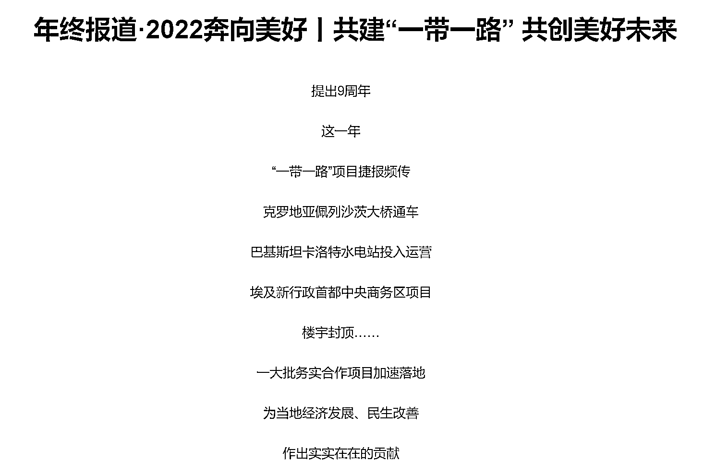
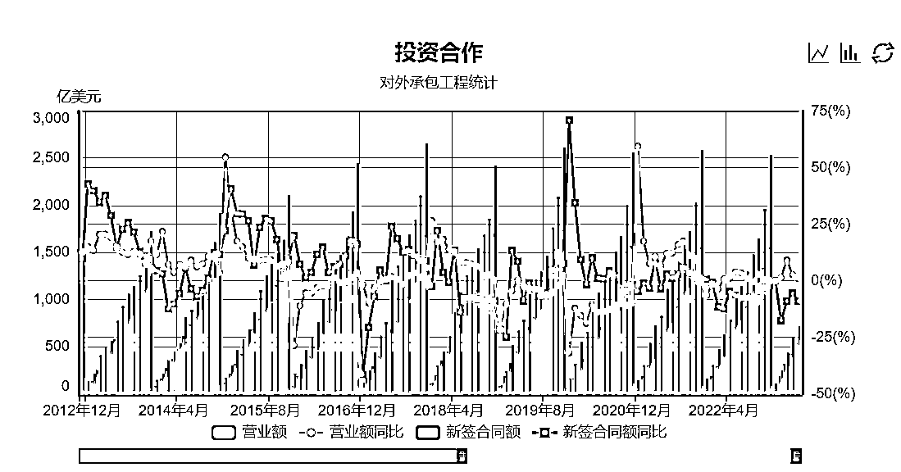
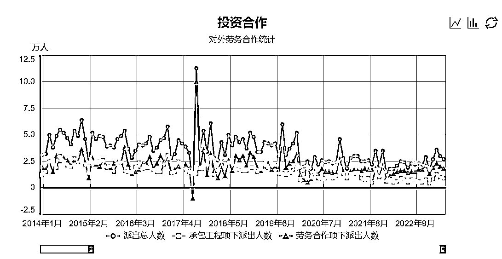
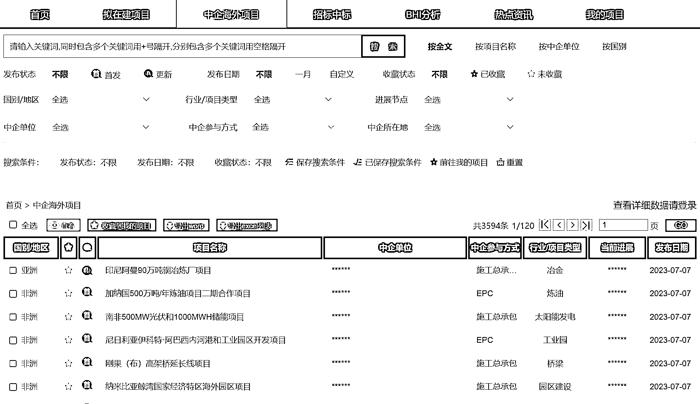

# 在国际工程中有哪些赚钱机会？

> 原文：[`www.yuque.com/for_lazy/thfiu8/zirewy9nkiic3p4l`](https://www.yuque.com/for_lazy/thfiu8/zirewy9nkiic3p4l)

<ne-h2 id="bd07c67d" data-lake-id="bd07c67d"><ne-heading-ext><ne-heading-anchor></ne-heading-anchor><ne-heading-fold></ne-heading-fold></ne-heading-ext><ne-heading-content><ne-text id="uc27c9925">(31 赞)在国际工程中有哪些赚钱机会？</ne-text></ne-heading-content></ne-h2> <ne-p id="u5689e158" data-lake-id="u5689e158"><ne-text id="u91c809b0">作者： Eric</ne-text></ne-p> <ne-p id="u9308ff8e" data-lake-id="u9308ff8e"><ne-text id="u5dc1ca66">日期：2023-08-02</ne-text></ne-p> <ne-p id="u367ecbcd" data-lake-id="u367ecbcd"><ne-text id="u2a06bea5" ne-bold="true">国际工程</ne-text><ne-text id="u4377b9c1" style="background-color: rgb(255, 255, 255); color: rgb(31, 35, 41);">，比如一带一路建设工程，铁路制造、港口制造、跨海大桥等等，这些背后都是以央企国企为主体的中国工程承包商。</ne-text></ne-p> <ne-p id="u41e80479" data-lake-id="u41e80479"><ne-text id="uff40bde9" style="background-color: rgb(255, 255, 255); color: rgb(31, 35, 41);">在这个赛道还有很多机会，上到工程项目代理、咨询业务，下到机票代理、餐饮、购物，都很适合普通的公司和个人去做。</ne-text></ne-p> <ne-p id="u908dd00e" data-lake-id="u908dd00e"><ne-text id="u85c0aa0c" style="background-color: rgb(255, 255, 255); color: rgb(31, 35, 41);">今天在这里，我想和大家分享，一带一路大背景下国际工程的商机和案例，如果能和自己现在所做的赛道、资源结合，或许又是一个新项目诞生。</ne-text></ne-p> <ne-p id="ua6fdea91" data-lake-id="ua6fdea91"><ne-card data-card-name="image" data-card-type="inline" id="NcjNn" data-event-boundary="card">  <ne-p id="ueea25dc1" data-lake-id="ueea25dc1"><ne-card data-card-name="image" data-card-type="inline" id="NxD3d" data-event-boundary="card">  <ne-p id="u7bbe4ac5" data-lake-id="u7bbe4ac5"><ne-text id="ud8cba944" style="color: rgb(31, 35, 41);">大家好，我是 Eric，一个从事海外项目市场开发近十年的海外老兵，参与过非洲、东南亚多国电力能源项目的开发工作。</ne-text></ne-p> <ne-p id="uec78ff1d" data-lake-id="uec78ff1d"><ne-text id="u6cc637bf" style="color: rgb(31, 35, 41);">目前主要从事海外项目市场开发咨询工作，也建立了海外市场信息网络平台和社群为各大企业和海外从业人员提供服务。</ne-text></ne-p> <ne-h1 id="dcc5e435" data-lake-id="dcc5e435"><ne-heading-ext><ne-heading-anchor></ne-heading-anchor><ne-heading-fold></ne-heading-fold></ne-heading-ext><ne-heading-content><ne-text id="u054cacb3" style="background-color: rgb(255, 255, 255); color: rgb(31, 35, 41);">一、背景</ne-text></ne-heading-content></ne-h1> <ne-p id="u107147ab" data-lake-id="u107147ab"><ne-text id="ucaa34b63" style="background-color: rgb(255, 255, 255); color: rgb(31, 35, 41);">今年是共建“一带一路”倡议提出十周年。</ne-text></ne-p> <ne-p id="u170577e9" data-lake-id="u170577e9"><ne-text id="ue522de51" style="background-color: rgb(255, 255, 255); color: rgb(31, 35, 41);">共建“一带一路”倡议提出以来，始终坚持共商共建共享原则，以高标准、可持续、惠民生为目标，聚焦重点领域、重点地区、重点项目，持续推进民生工程、民心工程，为推动构建人类命运共同体、畅通国内国际双循环提供了有力支撑和强劲动力。</ne-text></ne-p> <ne-p id="u612647e6" data-lake-id="u612647e6"><ne-text id="u747b7d9e" style="color: rgb(31, 35, 41);">2022 年，我国企业在“一带一路”沿线国家非金融类直接投资 1410.5 亿元人民币，较上年增长 7.7%（折合 209.7 亿美元，增长 3.3%），占同期总额的 17.9%，与上年同期持平，主要投向新加坡、印度尼西亚、马来西亚、泰国、越南、巴基斯坦、阿拉伯联合酋长国、柬埔寨、塞尔维亚和孟加拉国等国家。</ne-text></ne-p> <ne-p id="u90e4f241" data-lake-id="u90e4f241"><ne-text id="udb898463" style="color: rgb(31, 35, 41);">对外承包工程方面，我国企业在“一带一路”沿线国家新签对外承包工程项目合同 5514 份，新签合同额 8718.4 亿元人民币，增长 0.8%（折合 1296.2 亿美元，下降 3.3%），占同期我国对外承包工程新签合同额的 51.2%；完成营业额 5713.1 亿元人民币，下降 1.3%（折合 849.4 亿美元，下降 5.3%），占同期总额的 54.8%。</ne-text></ne-p> <ne-p id="u9b366861" data-lake-id="u9b366861"><ne-card data-card-name="image" data-card-type="inline" id="rV98u" data-event-boundary="card">  <ne-p id="u8dc5f455" data-lake-id="u8dc5f455"><ne-text id="ud49bf0ac" style="background-color: rgb(255, 255, 255); color: rgb(31, 35, 41);">中国建筑企业在全球范围规模大，竞争力强。</ne-text></ne-p> <ne-p id="u62dee88c" data-lake-id="u62dee88c"><ne-text id="u864cef34" style="background-color: rgb(255, 255, 255); color: rgb(31, 35, 41);">根据 2021 年 ENR 全球承包商 250 强榜单，中国共有 64 家建筑企业入围，前 7 家全部是中国企业，前 20 中有 15 家中国企业，中国入选企业营业额占 250 强全部营业额的 64.7%。</ne-text></ne-p> <ne-p id="ub6643303" data-lake-id="ub6643303"><ne-text id="ud0d68ee8" style="background-color: rgb(255, 255, 255); color: rgb(31, 35, 41);">ENR 国际承包商 250 家上榜企业 2021 年的国际营业总额为 3979 亿美元，其中上榜中国企业国际营业额为 1129 亿美元。</ne-text></ne-p> <ne-p id="uca6124b0" data-lake-id="uca6124b0"><ne-text id="u0d8720d1" style="background-color: rgb(255, 255, 255); color: rgb(31, 35, 41);">为了开发和执行国际工程项目，中国每年大概会向海外派出人员近 50 万，即使是在 2019 年至 2021 年特别期间，每年也有 30 多万外派人员。</ne-text></ne-p> <ne-p id="u2ebcd5e8" data-lake-id="u2ebcd5e8"><ne-text id="ub16f29c3" style="background-color: rgb(255, 255, 255); color: rgb(31, 35, 41);">由于经济发展水平和文化差异等原因，在很多第三世界发展中国家及地区，围绕着这些外派人员的工作和生活，衣食住行，娱乐等服务需求，存在着不小的蓝海商机。</ne-text></ne-p> <ne-p id="u47ebccbf" data-lake-id="u47ebccbf"><ne-card data-card-name="image" data-card-type="inline" id="QjPdo" data-event-boundary="card">  <ne-h1 id="f126bed9" data-lake-id="f126bed9"><ne-heading-ext><ne-heading-anchor></ne-heading-anchor><ne-heading-fold></ne-heading-fold></ne-heading-ext><ne-heading-content><ne-text id="u6a545813" style="color: rgb(31, 35, 41);">二、趋势</ne-text></ne-heading-content></ne-h1> <ne-p id="u8fd61579" data-lake-id="u8fd61579"><ne-text id="ud84ab983" style="background-color: rgb(255, 255, 255); color: rgb(38, 38, 38);">一是未来几年全球化将以更加区域化的方式表现，如 RECP 开始生效，全球最大的自贸区诞生。</ne-text></ne-p> <ne-p id="u7fe8af50" data-lake-id="u7fe8af50"><ne-text id="u253fe9d6" style="background-color: rgb(255, 255, 255); color: rgb(38, 38, 38);">二是全球大国实施货币宽松政策，多国均实施经济刺激计划，会有大量外来资金进入基础领域，外来资金将带动国际工程规模扩张。</ne-text></ne-p> <ne-p id="u23a0ecbd" data-lake-id="u23a0ecbd"><ne-text id="ud9418e1f" style="background-color: rgb(255, 255, 255); color: rgb(38, 38, 38);">三是美元指数下跌、大宗商品价格上涨，这些都是国际工程的有利因素。</ne-text></ne-p> <ne-p id="u8357c232" data-lake-id="u8357c232"><ne-text id="u3d2fd8e7" style="background-color: rgb(255, 255, 255); color: rgb(38, 38, 38);">四是中美欧等对碳排放达成一致，碳减排和碳交易给各行各业带来深刻影响，将提升建筑业的门槛，给国际工程带来机遇。</ne-text></ne-p> <ne-p id="ue849295f" data-lake-id="ue849295f"><ne-text id="ub911ffee" style="background-color: rgb(255, 255, 255); color: rgb(38, 38, 38);">五是建筑行业工厂化和数字化革命也会大幅度推高建筑业门槛，从而拉动国际工程。</ne-text></ne-p> <ne-p id="u04b292aa" data-lake-id="u04b292aa"><ne-text id="uc1dc454e" style="background-color: rgb(255, 255, 255); color: rgb(38, 38, 38);">六是帮助发展中国家建设基础设施成为国际社会共识，诸如“一带一路”、B3W 和 Global Gateway 等都是以基础设施建设为核心的全球化倡议，将大大促进国际工程行业的发展。</ne-text></ne-p> <ne-p id="u85a5b18b" data-lake-id="u85a5b18b"><ne-text id="u56314335" style="background-color: rgb(255, 255, 255); color: rgb(38, 38, 38);">未来几年全球国际工程市场向好，海外基础设施会成为投资热点，2025 年前后全球国际工程承包有望恢复到 2013 年的峰值。</ne-text></ne-p> <ne-p id="ud9929265" data-lake-id="ud9929265"><ne-text id="ub4f132a0" ne-bold="true">未来几年全球国际工程的增长重点包括：</ne-text></ne-p> <ne-p id="u370ccc8f" data-lake-id="u370ccc8f"><ne-text id="u36f0d8dc" style="background-color: rgb(255, 255, 255); color: rgb(38, 38, 38);">一是能源转型和碳减排所带来相关领域的增长；</ne-text></ne-p> <ne-p id="ua4f9d7fe" data-lake-id="ua4f9d7fe"><ne-text id="u563030b1" style="background-color: rgb(255, 255, 255); color: rgb(38, 38, 38);">二是建筑工厂化和数字化带来的增长；</ne-text></ne-p> <ne-p id="u156cfb9a" data-lake-id="u156cfb9a"><ne-text id="uc70f1f2f" style="background-color: rgb(255, 255, 255); color: rgb(38, 38, 38);">三是城市化导致的交通和建筑工程方面的增长；</ne-text></ne-p> <ne-p id="ucc0b005c" data-lake-id="ucc0b005c"><ne-text id="uff91b609" style="background-color: rgb(255, 255, 255); color: rgb(38, 38, 38);">四是全球性缺水导致水工程领域的增长。</ne-text></ne-p> <ne-p id="ue4ab532e" data-lake-id="ue4ab532e"><ne-text id="u49e8303b" style="color: rgb(31, 35, 41);">RCEP 生效将推动亚洲地区产业链、供应链一体化进程不断加深。近岸和友岸产业链、供应链转移将提升东盟、东欧、拉美地区投资热度，建议企业提前行动和布局，把握发展的主动权。</ne-text></ne-p> <ne-h1 id="7dba21ef" data-lake-id="7dba21ef"><ne-heading-ext><ne-heading-anchor></ne-heading-anchor><ne-heading-fold></ne-heading-fold></ne-heading-ext><ne-heading-content><ne-text id="u67234b3e" style="color: rgb(31, 35, 41);">三、商业机会</ne-text></ne-heading-content></ne-h1> <ne-p id="u1fa86716" data-lake-id="u1fa86716"><ne-text id="u90c76d42" style="color: rgb(31, 35, 41);">关于国际工程相关的商业机会，我想从工程项目链条和人员两个维度展开分享。</ne-text></ne-p> <ne-p id="u7497d2ad" data-lake-id="u7497d2ad"><ne-text id="ue9866359" ne-bold="true">（1）工程项目链条</ne-text></ne-p> <ne-p id="u4f0bbc97" data-lake-id="u4f0bbc97"><ne-text id="u8cee10ac" style="color: rgb(31, 35, 41);">首先，我们要明确，鉴于国际工程项目的体量和风险，国际工程行业的主体大玩家是大型央企和国企。</ne-text></ne-p> <ne-p id="u78214647" data-lake-id="u78214647"><ne-text id="u4d0e6591" style="color: rgb(31, 35, 41);">任何一个行业，都有一条从上游到下游的产业和供应链，只要能站住这个链条的一环，就能活的不错。</ne-text></ne-p> <ne-p id="u92417a39" data-lake-id="u92417a39"><ne-text id="u63baf34d" style="color: rgb(31, 35, 41);">国际工程也是如此。</ne-text></ne-p> <ne-p id="ubbe6f159" data-lake-id="ubbe6f159"><ne-text id="u3c32b8b0" style="color: rgb(31, 35, 41);">国际工程门槛最高，风险最大的就是总承包业务（EPC），这些都是由国字头的承包商来承担的。</ne-text></ne-p> <ne-p id="u10d076ee" data-lake-id="u10d076ee"><ne-text id="ue83750d1" style="color: rgb(31, 35, 41);">而国际工程从前期项目开发，项目融资、项目执行，项目运营这个流程来看，对于有相关资源的企业和个人都有参与获利的机会。</ne-text></ne-p> <ne-p id="u6ca71053" data-lake-id="u6ca71053"><ne-text id="uaefc6f50" ne-bold="true">1.1 项目代理</ne-text></ne-p> <ne-p id="u74391315" data-lake-id="u74391315"><ne-text id="u8f2bb7da" style="color: rgb(31, 35, 41);">国际工程项目，基本上每个项目都有代理，为了合规，也称为“咨询”，可以理解为居间商。</ne-text></ne-p> <ne-p id="uf1bef6ba" data-lake-id="uf1bef6ba"><ne-text id="ue6b2082c" style="color: rgb(31, 35, 41);">大型的国家项目，这个一般人不用想。</ne-text></ne-p> <ne-p id="u97354129" data-lake-id="u97354129"><ne-text id="ud1c78a2d" style="color: rgb(31, 35, 41);">但海外也有很多项目业主是私企，不仅有当地的企业，也有中国想在当地投资建厂的企业。</ne-text></ne-p> <ne-p id="ub95aa516" data-lake-id="ub95aa516"><ne-text id="uce6d4952" style="color: rgb(31, 35, 41);">这类项目可大可小，如果有合适的资源，撮合项目一旦成功，收益颇丰。</ne-text></ne-p> <ne-p id="uf05ca129" data-lake-id="uf05ca129"><ne-text id="ub9250224" style="color: rgb(31, 35, 41);">但如果没有和双方的任一方绑定好利益，很可能即使项目落地，也与自己没啥关系。</ne-text></ne-p> <ne-p id="u54cba182" data-lake-id="u54cba182"><ne-text id="ud1c2ff0c" ne-bold="true">1.2 项目咨询</ne-text></ne-p> <ne-p id="u7f3fef5a" data-lake-id="u7f3fef5a"><ne-text id="u234fdd04" style="color: rgb(31, 35, 41);">除了上面的代理“咨询”，还有工程项目相关的“真”咨询服务，包括财务、税务、法律、市场、招投标等。</ne-text></ne-p> <ne-p id="u835fb6af" data-lake-id="u835fb6af"><ne-text id="ue46af9a3" style="color: rgb(31, 35, 41);">有些中国承包商在所在国从事工程业务年份久，该踩过的坑基本都踩过了，对于上述咨询服务需求不大。</ne-text></ne-p> <ne-p id="ud5013676" data-lake-id="ud5013676"><ne-text id="u934010c6" style="color: rgb(31, 35, 41);">但每年总会有新的中国企业进入各个国家开拓工程市场承接项目，因为他们都有海外业绩指标需要完成。</ne-text></ne-p> <ne-p id="u9a198554" data-lake-id="u9a198554"><ne-text id="u145cba74" style="color: rgb(31, 35, 41);">针对这些新来的中国企业，当地的中国老企业是不欢迎他们的，因为自己都吃不饱，又来个分蛋糕的，谁乐意？</ne-text></ne-p> <ne-p id="u12d08474" data-lake-id="u12d08474"><ne-text id="u9740db51" style="color: rgb(31, 35, 41);">所以同行是仇家，老企业的各种踩坑经验都是不会去分享交流的，市场信息更是严禁泄密给同行。</ne-text></ne-p> <ne-p id="u6997c2dc" data-lake-id="u6997c2dc"><ne-text id="ud48a007e" style="color: rgb(31, 35, 41);">如果在当地有一定的市场经验和相关资源，为这些新来的企业提供配套的咨询服务，也是一个挺好的业务。</ne-text></ne-p> <ne-p id="u6d424e79" data-lake-id="u6d424e79"><ne-text id="udd3ce781" ne-bold="true">1.3 本地分包</ne-text></ne-p> <ne-p id="uc7c96e2b" data-lake-id="uc7c96e2b"><ne-text id="u7fd1c2e3" style="color: rgb(31, 35, 41);">大型的项目，总包方需要各类专业分包和物资采购，大比例会在总包方签下合同后，在国内进行招标。</ne-text></ne-p> <ne-p id="u4d58f46f" data-lake-id="u4d58f46f"><ne-text id="u435a795e" style="color: rgb(31, 35, 41);">这其实就相当于国内项目的招标了，只是项目执行地在国外。</ne-text></ne-p> <ne-p id="u7eaf600b" data-lake-id="u7eaf600b"><ne-text id="u712c4731" style="color: rgb(31, 35, 41);">国内投标有多卷，水有多深，这里就不多说了。</ne-text></ne-p> <ne-p id="u32dedc03" data-lake-id="u32dedc03"><ne-text id="u12a0ec7f" style="color: rgb(31, 35, 41);">但这些中国企业的海外总包项目在当地的分包招标采购比国内要灵活得多。</ne-text></ne-p> <ne-p id="u268de8d9" data-lake-id="u268de8d9"><ne-text id="ua3d5ddcb" style="color: rgb(31, 35, 41);">而且为了提高属地化水平，降低用工成本，中国总承包企业在当地执行项目时越来越注重当地本土分包商的参与。</ne-text></ne-p> <ne-p id="u818424f0" data-lake-id="u818424f0"><ne-text id="u32e310ff" style="color: rgb(31, 35, 41);">但对于施工管理来说，项目部还是更愿意使用中国队伍，毕竟管理起来更容易。加班加点赶工期，中国施工队伍没问题，但是本地队伍，想都不要想。</ne-text></ne-p> <ne-p id="ua06eaea9" data-lake-id="ua06eaea9"><ne-text id="ud8fdcda4" style="color: rgb(31, 35, 41);">因此，一些中国民营施工分包商在当地注册公司，组织当地施工队伍。</ne-text></ne-p> <ne-p id="u2f71b85c" data-lake-id="u2f71b85c"><ne-text id="u317c299f" style="color: rgb(31, 35, 41);">一方面可以避免海外项目国内招标的红海厮杀，可以较为容易得获取分包业务；</ne-text></ne-p> <ne-p id="u34df3993" data-lake-id="u34df3993"><ne-text id="u74e7646c" style="color: rgb(31, 35, 41);">另一方面，总包方在提高了属地化和国际化管理水平的同时，也更方便地管理本地的分包队伍，最终实现双赢。</ne-text></ne-p> <ne-p id="u1ce59253" data-lake-id="u1ce59253"><ne-card data-card-name="image" data-card-type="inline" id="Fi8vJ" data-event-boundary="card">  <ne-p id="u0e9c447b" data-lake-id="u0e9c447b"><ne-text id="u27c131b8" ne-bold="true">（2）外派人员</ne-text></ne-p> <ne-p id="u303585f8" data-lake-id="u303585f8"><ne-text id="u30b80c7a" style="color: rgb(31, 35, 41);">根据中国商务部的统计数据，中国每年外派的工程和劳务人员近 50 万，即使在 2019-2021 年，</ne-text><ne-text id="u7c87ad31" style="background-color: rgb(255, 255, 255); color: rgb(31, 35, 41);">每年也有 30 多万外派人员。</ne-text></ne-p> <ne-p id="uc6a4c1a1" data-lake-id="uc6a4c1a1"><ne-text id="u942900a0" style="background-color: rgb(255, 255, 255); color: rgb(31, 35, 41);">由于经济发展水平和文化差异等原因，在很多第三世界发展中国家及地区，围绕着这些外派人员的工作和生活，衣食住行，娱乐等服务需求，存在着不小的蓝海商机。</ne-text></ne-p> <ne-p id="ue15866bb" data-lake-id="ue15866bb"><ne-text id="ue5392633" ne-bold="true">1、签证代办</ne-text></ne-p> <ne-p id="u11456c19" data-lake-id="u11456c19"><ne-text id="u3c832706">中国护照有时候办理签证都非常麻烦，很多时候签证要得也急，这个业务一直刚需，利润也非常高。</ne-text></ne-p> <ne-p id="udf9a7f79" data-lake-id="udf9a7f79"><ne-text id="u84094605" ne-bold="true">2、机票票务</ne-text></ne-p> <ne-p id="u427f70aa" data-lake-id="u427f70aa"><ne-text id="u5ee3c6bc">单纯出机票就没啥竞争力了，有朋友在孟加拉这三年靠卖机票加配套的服务一个人兼职就赚了一千万多万。当然也有特殊时期的原因。</ne-text></ne-p> <ne-p id="ubb3f767f" data-lake-id="ubb3f767f"><ne-text id="ub7b5adfa" ne-bold="true">3、当地旅游商务地接</ne-text></ne-p> <ne-p id="u514b1211" data-lake-id="u514b1211"><ne-text id="u916f60dd">主要服务国内商务考察团，公司领导视察，不同国别差别挺大。</ne-text></ne-p> <ne-p id="u2998d915" data-lake-id="u2998d915"><ne-text id="u212b3b26" ne-bold="true">4、餐饮</ne-text></ne-p> <ne-p id="u692b606e" data-lake-id="u692b606e"><ne-text id="uf68ca041">在很多亚非拉国家，当地的中餐馆绝对属于高消费，主要客户都是中国企业常驻和外派人员。</ne-text></ne-p> <ne-p id="uf14ca9db" data-lake-id="uf14ca9db"><ne-text id="u90953a4a" ne-bold="true">5、购物</ne-text></ne-p> <ne-p id="u8bede0db" data-lake-id="u8bede0db"><ne-text id="ua55efffd">有的大项目高峰期上千人，平时也有几百人，一个项目一干就是几年，在项目部旁边开个小超市，卖卖烟酒茶加上各类中国超市大路货，也是稳赚不赔的业务。</ne-text></ne-p> <ne-p id="ub19983c9" data-lake-id="ub19983c9"><ne-text id="u816632c0" ne-bold="true">6、娱乐</ne-text></ne-p> <ne-p id="ucf53a363" data-lake-id="ucf53a363"><ne-text id="uc7827dc3">不论是非洲还是东南亚，专门服务中国人的 KTV 之类的就没有不赚钱的。</ne-text></ne-p> <ne-p id="u5e6aa0df" data-lake-id="u5e6aa0df"><ne-text id="u80575072">有在非洲租个别墅（其实就是两层普通带院子的房子）原始形态，也有在东南亚花了千万装修的豪华形态，懂得都懂，就不多说了。</ne-text></ne-p> <ne-p id="ua3f8e370" data-lake-id="ua3f8e370"><ne-text id="u549ad6fe" style="color: rgb(31, 35, 41);">如果觉得在国内太卷，不妨打开眼界，在一带一路的国家里看看，无论是有资源有能力的公司团队，还是普通的个人，跟着干国际工程的中国企业走出去，虽然中国企业干的很多工程都巨亏，但从没听说过干上面这些业务的没赚到钱的。</ne-text></ne-p> <ne-p id="u8ddda161" data-lake-id="u8ddda161"><ne-text id="u66949536" style="color: rgb(31, 35, 41);">可能这就是所谓的，一鲸落万物生吧。</ne-text></ne-p> <ne-hole id="u90479adb" data-lake-id="u90479adb"><ne-card data-card-name="hr" data-card-type="block" id="O85k6" data-event-boundary="card"><ne-p id="u542a5d5d" data-lake-id="u542a5d5d"><ne-text id="uf7eb26c2">评论区：</ne-text></ne-p> <ne-p id="uaf016266" data-lake-id="uaf016266"><ne-text id="u19b76441">Eric : 有任何问题欢迎大家来交流沟通[太阳]</ne-text> <ne-text id="u58f6a010">Fredrich : 要么服务商，要么做分包商，不要做老外生意[偷笑]</ne-text> <ne-text id="uf85139a7">Aimmon : 西部大开发，也值得关注，很多人并不了解其中的门门道道</ne-text> <ne-text id="u6ec9f580">Alex : [呲牙][呲牙]</ne-text> <ne-text id="ucba546ee">Eric : 老外生意也有很多中国人做，大多是私企老板</ne-text> <ne-text id="u4720fe92">Eric : 😃 😃 😃</ne-text> <ne-text id="u9a46d735">Eric : 可以分享下？😄</ne-text> <ne-text id="u33cde640">Aimmon : 数字人民币也属于其中一环，也有一些门道</ne-text></ne-p> <ne-p id="uc4df3c7d" data-lake-id="uc4df3c7d"><ne-card data-card-name="image" data-card-type="inline" id="tjJgH" data-event-boundary="card">  <ne-hole id="u83889bea" data-lake-id="u83889bea"><ne-card data-card-name="hr" data-card-type="block" id="chdg0" data-event-boundary="card"></ne-card></ne-hole></ne-card></ne-p></ne-card></ne-hole></ne-card></ne-p></ne-card></ne-p></ne-card></ne-p></ne-card></ne-p></ne-card></ne-p>