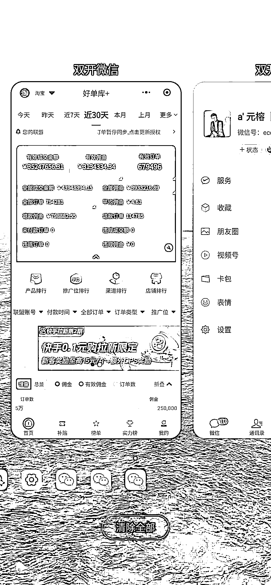
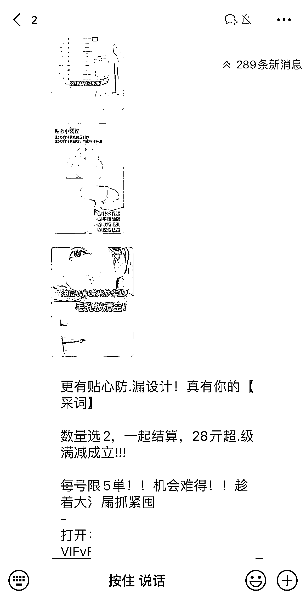

# 淘客，今年怎么了？还有机会吗？

> 原文：[`www.yuque.com/for_lazy/thfiu8/voc4luwuzhourux0`](https://www.yuque.com/for_lazy/thfiu8/voc4luwuzhourux0)

<ne-h2 id="190d726a" data-lake-id="190d726a"><ne-heading-ext><ne-heading-anchor></ne-heading-anchor><ne-heading-fold></ne-heading-fold></ne-heading-ext><ne-heading-content><ne-text id="ue26aeef8">(25 赞)淘客，今年怎么了？还有机会吗？</ne-text></ne-heading-content></ne-h2> <ne-p id="uc2d7dc80" data-lake-id="uc2d7dc80"><ne-text id="ud2d6e778">作者： 元榕</ne-text></ne-p> <ne-p id="ucb24c579" data-lake-id="ucb24c579"><ne-text id="u1253136b">日期：2023-08-04</ne-text></ne-p> <ne-p id="ub5895120" data-lake-id="ub5895120"><ne-text id="u9e4ee4d0">几个月没写文章啦，主要是今年发展方向做了些调整，上半年我每个月都有 10 天以上的时间在外地游学、出差，加上公司基础的事务，确实比较忙，就一直没动笔。</ne-text></ne-p> <ne-p id="u5e5bf897" data-lake-id="u5e5bf897"><ne-text id="u212bd3df">趁下午灵感比较丰富，就抽出时间和大家简单聊聊；</ne-text></ne-p> <ne-p id="u93d1f74b" data-lake-id="u93d1f74b"><ne-text id="ua05954d5">前段时间去出差，和朋友聊到淘客，都会问这么个问题：“淘客现在还能做吗？怎么感觉这个项目没声音了？是不是黄了？”</ne-text></ne-p> <ne-p id="u72ea58e4" data-lake-id="u72ea58e4"><ne-text id="u90f07dc4" ne-bold="true">确实，淘客在今年，市场活力明显比去年低迷许多。</ne-text></ne-p> <ne-p id="u6c8a5f75" data-lake-id="u6c8a5f75"><ne-text id="u90b405b1">元榕从事淘客行业 4 年多，现月佣金在 200W，早期以淘客作为突破口，破圈出来的创业者，包括我司现业务仍以淘客为主，在行业也是属于一线玩家。</ne-text></ne-p> <ne-p id="u6b9904be" data-lake-id="u6b9904be"><ne-card data-card-name="image" data-card-type="inline" id="mZ0BI" data-event-boundary="card">  <ne-p id="ua0d313e7" data-lake-id="ua0d313e7"><ne-text id="ub9a5a1b6" style="background-color: rgb(255, 255, 255); color: rgb(178, 178, 178);">图 1</ne-text></ne-p> <ne-p id="uf1784b0e" data-lake-id="uf1784b0e"><ne-text id="u015294d4">今天就斗胆从我的角度和大家聊聊，</ne-text><ne-text id="uc88437ca" ne-bold="true">导致这个现状的几点原因。</ne-text></ne-p> <ne-p id="u279bcb1d" data-lake-id="u279bcb1d"><ne-text id="ube1cf074">现在关注我公众号的，除了部分淘客玩家，也有很多都是其他互联网项目的宝子。</ne-text></ne-p> <ne-p id="udd422778" data-lake-id="udd422778"><ne-text id="u7f90fd72">正式开始聊之前，先给大家梳理下淘客这个行业（如果是已经是淘客圈内玩家，请直接看下方正文）。</ne-text></ne-p> <ne-p id="u486274d8" data-lake-id="u486274d8"><ne-text id="u9221299f">淘客是帮助淘宝上的商家推广产品，从而赚取佣金的推手，每成功推广成交一单，就会获得对应的佣金。</ne-text></ne-p> <ne-p id="u3559b665" data-lake-id="u3559b665"><ne-text id="uf3c062aa">这种以成交结果付费的模式，也叫作</ne-text><ne-text id="u647d367e" ne-bold="true">CPS 模式。</ne-text></ne-p> <ne-p id="u6c75105b" data-lake-id="u6c75105b"><ne-text id="u6abaf779">为什么商家要找淘客带货出单呢？</ne-text></ne-p> <ne-p id="u1a1a1f0c" data-lake-id="u1a1a1f0c"><ne-text id="u5309f4fa">首先我们要知道淘宝商家，想要让商品搜索权重升高，展位更靠前，获得更多的</ne-text><ne-text id="ua26298ee" ne-bold="true">站内流量。</ne-text></ne-p> <ne-p id="uc8e8bfb0" data-lake-id="uc8e8bfb0"><ne-text id="uea66cee9">很重要的参考指标就是</ne-text><ne-text id="u4cd329c4" ne-bold="true">产品销量和评价。</ne-text><ne-text id="ue6a6bf6c">商家面对这个情况，很多会选择补单，但是补单是有风险的。</ne-text></ne-p> <ne-p id="u928fa5e1" data-lake-id="u928fa5e1"><ne-text id="u0bfc00ad">那淘客呢，刚好可以解决商家这个问题。</ne-text></ne-p> <ne-p id="u457e9754" data-lake-id="u457e9754"><ne-text id="u5a4207d7">让淘客去帮忙带货出单，给商品增加销量，自然而然商品的权重就会提高。且途径都是官方途径，合理合法的，风险低。</ne-text></ne-p> <ne-p id="ucbfa61f3" data-lake-id="ucbfa61f3"><ne-text id="u823a2218">所以淘客帮商家推广，获得佣金；商家给出推广费，让商品权重升高，获取更多流量，你情我愿。</ne-text></ne-p> <ne-p id="u9242242c" data-lake-id="u9242242c"><ne-text id="uec66b500">说到这里，商家和淘客玩家两方都是受益的，这个生意能做吗？能！</ne-text></ne-p> <ne-p id="ufba7a3bc" data-lake-id="ufba7a3bc"><ne-text id="uc2eef6c9">那作为淘宝平台的推广营销方，阿里妈妈又该怎么获利？</ne-text></ne-p> <ne-p id="ub7a7cf85" data-lake-id="ub7a7cf85"><ne-text id="u55bde144">平台方获利来源于技术服务费，阿里妈妈每个月会找淘客收取佣金 10%技术服务费，平台依托这个作为营收。</ne-text></ne-p> <ne-p id="u393e3765" data-lake-id="u393e3765"><ne-text id="u53aecadc">这下大功告成，平台方也搞定了。</ne-text></ne-p> <ne-p id="u4804f4c3" data-lake-id="u4804f4c3"><ne-text id="uf308282e">综合来看，</ne-text><ne-text id="u86d6186d" ne-bold="true">商家愿意花钱，淘客愿意推广，平台方也能通过服务费获利，三者受益，</ne-text><ne-text id="udd871677">这件事儿就成了。</ne-text></ne-p> <ne-p id="u8cb4573c" data-lake-id="u8cb4573c"><ne-text id="u594e10f3">讲到这里，基本帮大家梳理清楚淘客这个行业的底层逻辑啦。</ne-text></ne-p> <ne-p id="u9cd8a618" data-lake-id="u9cd8a618"><ne-text id="udac1c607">其他就不过多赘述，回到话题，淘客今年过来相对较低迷的原因是啥？各位看官听我细细道来。</ne-text></ne-p> <ne-p id="u660ec13a" data-lake-id="u660ec13a"><ne-text id="u542b26b6" ne-bold="true">1、流量成本升高；</ne-text></ne-p> <ne-p id="u581b9251" data-lake-id="u581b9251"><ne-text id="u15f7d90e">淘客去年最火热的模式，毋庸置疑是社群模式。</ne-text></ne-p> <ne-p id="ub4a799e3" data-lake-id="ub4a799e3"><ne-text id="u9c15ea63">社群模式是啥样的？简单解释，就是淘客们把用户引导到微信群内，给群内的用户推广产品，出单后自己获得佣金。你肯定见过，这里给大家放张图：</ne-text></ne-p> <ne-p id="ud8d4e2a0" data-lake-id="ud8d4e2a0"><ne-card data-card-name="image" data-card-type="inline" id="XMGS5" data-event-boundary="card">  <ne-p id="uc745b198" data-lake-id="uc745b198"><ne-text id="u67687825" style="color: rgb(178, 178, 178); background-color: rgb(255, 255, 255);">图 2</ne-text></ne-p> <ne-p id="uda773a0c" data-lake-id="uda773a0c"><ne-text id="uba6211c1">这样的群，引导来的用户流量，都是有成本的。</ne-text></ne-p> <ne-p id="u4350ed1b" data-lake-id="u4350ed1b"><ne-text id="u78bc42b8">一般淘客们，是找些做流量投放的人直接花钱买。计费方式也很简单：一个用户到私域上多少钱。</ne-text></ne-p> <ne-p id="u3e2f77a8" data-lake-id="u3e2f77a8"><ne-text id="u29272ca5">然后呢，再把群的成本，和每天群用户产出的佣金，两者综合起来计算。就可以算出这个成本需要多久才能赚回来，也就是常说的</ne-text><ne-text id="u80437df1" ne-bold="true">回本周期</ne-text><ne-text id="uc805b8b0">。</ne-text></ne-p> <ne-p id="udf88e4a8" data-lake-id="udf88e4a8"><ne-text id="ue6d351b0">以社群淘客的美妆赛道为例：</ne-text></ne-p> <ne-p id="ufe6732f9" data-lake-id="ufe6732f9"><ne-text id="u7f6536f2">去年单群流量成本在 6000 左右，运营没问题，回本周期基本可以拉在 6 个月内。去年我司投入 500W 左右资金入局美妆，目前投入已经回本。</ne-text></ne-p> <ne-p id="u0329d248" data-lake-id="u0329d248"><ne-text id="u7fb7ca66">而今年的流量成本，单群已经到近 1.3 万元，几乎是去年的翻倍，淘客从业者，算的都是 ROI，回本周期在能接受的范围内，大家才愿意投入。</ne-text></ne-p> <ne-p id="u29802a20" data-lake-id="u29802a20"><ne-text id="ud2b7920d">流量成本升高，回本周期拉长，时间拖的越久，不确定性就越多，风险指数也会越高，各位老板们就不愿意去大量投入。</ne-text></ne-p> <ne-p id="u5b96fa5a" data-lake-id="u5b96fa5a"><ne-text id="u9d1fe490">很多去年投入大几百万的同行朋友，我问他们今年为啥不继续做，得到的回答都是：</ne-text><ne-text id="ufd5b23c6" ne-bold="true">流量成本太高。</ne-text></ne-p> <ne-p id="u6cf52008" data-lake-id="u6cf52008"><ne-text id="u72a6174f" ne-bold="true">那为啥流量成本今年升高了呢？</ne-text></ne-p> <ne-p id="u4bf2f399" data-lake-id="u4bf2f399"><ne-text id="u67ae0d93" style="color: rgb(0, 0, 0);">影响到流量成本的原因主要有以下几个方面：</ne-text></ne-p> <ne-p id="u60a58c7d" data-lake-id="u60a58c7d"><ne-text id="u326fef64" ne-bold="true">一方面是内容原因；</ne-text><ne-text id="u389427ab" style="color: rgb(0, 0, 0);">抖音作为最</ne-text><ne-text id="ufdc6ff75">主流的流量获取渠道，</ne-text><ne-text id="u9000426a" style="color: rgb(0, 0, 0);">平台投放成本升高。</ne-text></ne-p> <ne-p id="u54644158" data-lake-id="u54644158"><ne-text id="ue7ca218a">去年一条素材走天下，然而</ne-text><ne-text id="u60d24b55" ne-bold="true">现在被平台管控，出现很多素材过不了，钱烧不动等因素，成本自然提升。</ne-text></ne-p> <ne-p id="u8993ce00" data-lake-id="u8993ce00"><ne-text id="uc532ff3c">但这只是表象。</ne-text></ne-p> <ne-p id="u3b16cf04" data-lake-id="u3b16cf04"><ne-text id="u2087b918">和很多在抖音上做投放引流的头部团队聊过这事儿，流量成本升高的核心原因，除了内容原因之外，还有更重要的点。</ne-text></ne-p> <ne-p id="u91251024" data-lake-id="u91251024"><ne-text id="ue172681b" ne-bold="true">即：曝光转化率降低。</ne-text></ne-p> <ne-p id="u7a690251" data-lake-id="u7a690251"><ne-text id="u6893eca6">什么意思？给大家解释下；</ne-text></ne-p> <ne-p id="uc57aca80" data-lake-id="uc57aca80"><ne-text id="u29192e94">我们在抖音上投放素材，其实就是花钱买曝光逻辑，我们花多少钱，平台就给多少曝光，这点很容易理解。</ne-text></ne-p> <ne-p id="u691a34c4" data-lake-id="u691a34c4"><ne-text id="u3db70a0f">今年在抖音上的投放曝光成本，与去年相比，并没有升高，那为啥综合成本会升高呢？</ne-text></ne-p> <ne-p id="u89255254" data-lake-id="u89255254"><ne-text id="uf0213283" ne-bold="true">因为用户，已经被同类型广告反复营销过 N 次。</ne-text></ne-p> <ne-p id="ua2c92d1a" data-lake-id="ua2c92d1a"><ne-text id="ud6fa5a40">作为用户，第一次看到这类营销内容，会被引导添加；第二次，会添加，但是第三次，第四次呢？</ne-text></ne-p> <ne-p id="ud276a955" data-lake-id="ud276a955"><ne-text id="uead77a46">大概率不会，因为已经对这个内容疲乏。</ne-text></ne-p> <ne-p id="ua2998835" data-lake-id="ua2998835"><ne-text id="ue12cbb89">举个例子：假设之前在抖音建计划投流，10 块钱可以有 50 个人看到，会有 40 个人被我成功引导进入私域。</ne-text></ne-p> <ne-p id="uc5420592" data-lake-id="uc5420592"><ne-text id="ubd69fb2a">现在，我 10 块钱投放出去，同样会有 50 个人看到，但用户对这些内容早就不感冒了，成功引导进入的私域的可能只有 20 个人。</ne-text></ne-p> <ne-p id="u015f8cdc" data-lake-id="u015f8cdc"><ne-text id="u72c85107" ne-bold="true">这就是差别，曝光转化率的降低，才是背后真正导致，综合成本提升的主要原因。</ne-text></ne-p> <ne-p id="u238089a9" data-lake-id="u238089a9"><ne-text id="u89600dde">还有一方面的因素，我在接下来第二点会讲到。</ne-text></ne-p> <ne-p id="u5ca2e749" data-lake-id="u5ca2e749"><ne-text id="ue8f54112" ne-bold="true">2、资本入局；</ne-text></ne-p> <ne-p id="uc17ddec8" data-lake-id="uc17ddec8"><ne-text id="u9c75c333">去年淘客亮眼的表现，让资金充裕的玩家看到机会。</ne-text></ne-p> <ne-p id="ua9609a66" data-lake-id="ua9609a66"><ne-text id="u5d93714b">从资本角度来分析，项目 6-10 个月回本，而且可以快速批量放大，是很难得的。</ne-text></ne-p> <ne-p id="u8b3e43e2" data-lake-id="u8b3e43e2"><ne-text id="ua002419b">用句网络段子来说：去年放眼整个互联网项目圈，淘客都是相当炸裂的存在！</ne-text></ne-p> <ne-p id="u257a355c" data-lake-id="u257a355c"><ne-text id="u4c4057f1">所以资本看到淘客的市场潜力，开始大量投入资金入局淘客。</ne-text></ne-p> <ne-p id="ua28395bc" data-lake-id="ua28395bc"><ne-text id="u630556ab">为啥说资本入局会影响市场呢？</ne-text></ne-p> <ne-p id="u3ff4fa25" data-lake-id="u3ff4fa25"><ne-text id="u9b168317">资本入局项目，这些投资人，都是拿出大量资金来算投产的，他们想的是，怎么把钱快速花出去，让体量快速上来，</ne-text><ne-text id="u5d79c624" ne-bold="true">用规模来增加后期收益的杠杆。</ne-text></ne-p> <ne-p id="u9565979f" data-lake-id="u9565979f"><ne-text id="ucccf96d2">想要快速放大规模，就得吃流量。</ne-text></ne-p> <ne-p id="ubff264f0" data-lake-id="ubff264f0"><ne-text id="u8b20f075">为了能够吃到更多量，很多时候都会直接给流量主，超过市场平均的价格，高价疯狂揽量。</ne-text></ne-p> <ne-p id="ud9ee2148" data-lake-id="ud9ee2148"><ne-text id="ufa7f958a">也正因为这个原因，所以影响流量成本的第二点原因也出来了。市场价格被这些资本玩家抬起来，流量主卖到市场的价格也会更高。</ne-text></ne-p> <ne-p id="ubd8f54b3" data-lake-id="ubd8f54b3"><ne-text id="u8daf11cf" ne-bold="true">这不仅影响流量成本，也直接影响到了整个行业之前的平稳状况。</ne-text></ne-p> <ne-p id="ufa94d37b" data-lake-id="ufa94d37b"><ne-text id="uc64306ac" ne-bold="true">3、品类不足；</ne-text></ne-p> <ne-p id="u8ffbd031" data-lake-id="u8ffbd031"><ne-text id="ue962b45f">相比较去年而言，今年淘客的品类是越来越少。</ne-text></ne-p> <ne-p id="ua9b64f4f" data-lake-id="ua9b64f4f"><ne-text id="u269fbb96">去年能够快速起量的原因是官方在推美妆产品，品类全、好单多。</ne-text></ne-p> <ne-p id="u79619f9f" data-lake-id="u79619f9f"><ne-text id="u2157f18d">但今年过来，美妆品基本上就那几个，相比去年没有那么丰富。</ne-text></ne-p> <ne-p id="udd86e335" data-lake-id="udd86e335"><ne-text id="u5b005bf4">品类不丰富，淘客的选择性少，用户的选择性也少，产出持续走下坡路，这也导致市场变得没有之前那么沸沸扬扬。</ne-text></ne-p> <ne-p id="u6d9dfeb5" data-lake-id="u6d9dfeb5"><ne-card data-card-name="image" data-card-type="inline" id="A92zP" data-event-boundary="card"></ne-card></ne-p> <ne-p id="u8576607c" data-lake-id="u8576607c"><ne-text id="u375ab581" style="background-color: rgb(255, 255, 255); color: rgb(178, 178, 178);">图 3，摄于厦门鼓浪屿</ne-text></ne-p> <ne-p id="ud220eae9" data-lake-id="ud220eae9"><ne-text id="u860a9ce1" ne-bold="true">淘客又该何去何从？</ne-text></ne-p> <ne-p id="uee5c113d" data-lake-id="uee5c113d"><ne-text id="ufd127152">既然是这样的情况，淘客到底还能继续做嘛？还适合入局吗？</ne-text></ne-p> <ne-p id="u4b2f33bc" data-lake-id="u4b2f33bc"><ne-text id="u5bd5e7ab">这里结合我自己团队，和行业内发展比较好的同行案例与各位分享。</ne-text></ne-p> <ne-p id="udc7ef89f" data-lake-id="udc7ef89f"><ne-text id="u030ef23e">在当下发展的比较好的模式，基本上分为以下几个：</ne-text></ne-p> <ne-p id="u44a9833b" data-lake-id="u44a9833b"><ne-text id="ufe3ab67a" ne-bold="true">1、精细化运营社群；</ne-text></ne-p> <ne-p id="u4b207c50" data-lake-id="u4b207c50"><ne-text id="u5cccda23">这个方法基于的底层逻辑，是在同样流量成本的情况下，对用户进行深度开发，使其产出更多价值。</ne-text></ne-p> <ne-p id="uaaf0b96e" data-lake-id="uaaf0b96e"><ne-text id="ub9014378">精细化运营一般在开群、运营、上拖、群内活动等方面进行优化延展。</ne-text></ne-p> <ne-p id="u5c8832f4" data-lake-id="u5c8832f4"><ne-text id="u58a0275c">以捡漏群为例子。据我了解，现在圈内精细化运营的玩家头部，甚至可以做到</ne-text><ne-text id="uad55fe47" ne-bold="true">半个月回流量成本，一个月回全部成本。</ne-text></ne-p> <ne-p id="u367fead7" data-lake-id="u367fead7"><ne-text id="uadd74239">且后续用户粘性及产出都会比较高。</ne-text></ne-p> <ne-p id="uab75c822" data-lake-id="uab75c822"><ne-text id="ua38cc592">关于这个的运营操盘逻辑，如果大家愿意听的话，我可以邀请来分享下他的操盘玩法。</ne-text></ne-p> <ne-p id="u2957b26a" data-lake-id="u2957b26a"><ne-text id="u0c75b2af" ne-bold="true">2、细分领域赛道；</ne-text></ne-p> <ne-p id="u702bcd2c" data-lake-id="u702bcd2c"><ne-text id="u8978c447">因为普通的捡漏、美妆社群成本升高，且用户产值基本没有太明显增长。</ne-text></ne-p> <ne-p id="uf251432b" data-lake-id="uf251432b"><ne-text id="ua1f20e4c">在这时候，有的淘客玩家就选择细分领域赛道。</ne-text></ne-p> <ne-p id="u20d0bd23" data-lake-id="u20d0bd23"><ne-text id="u608c6f52">如：母婴、猫车、狗车、撸酒等赛道，</ne-text><ne-text id="u427d073f" ne-bold="true">这类用户更垂直，产值也会相对高些。</ne-text></ne-p> <ne-p id="u57b831d9" data-lake-id="u57b831d9"><ne-text id="ufe93595f">另一方面，从流量成本的角度考虑，还记得我文章前面讲到的：「流量曝光转化逻辑」吗？咱们还是带入这逻辑。</ne-text></ne-p> <ne-p id="u3c45c99e" data-lake-id="u3c45c99e"><ne-text id="ube31cd13" ne-bold="true">用户在平台看到新的流量营销内容，同样曝光的情况下，流量的曝光转化会更高，成本会降低。</ne-text></ne-p> <ne-p id="u88d54e0b" data-lake-id="u88d54e0b"><ne-text id="u2ec507e4">反之，重复看到一种营销内容，会疲乏，看得多了就没有添加的兴趣，导致曝光转化率下降。</ne-text></ne-p> <ne-p id="u7c2cb119" data-lake-id="u7c2cb119"><ne-text id="u0a768771">母婴、猫车、撸酒等细分领域，对于用户来说是新鲜的，新的内容能提起用户兴趣，曝光转化率自然就会高些。</ne-text></ne-p> <ne-p id="u80a80133" data-lake-id="u80a80133"><ne-text id="ua6e56626">符合我们的逻辑。</ne-text></ne-p> <ne-p id="ua4652c2f" data-lake-id="ua4652c2f"><ne-text id="u80a97cba">所以在去年年初，当时美妆群的出现，群成本低于捡漏 1000 多元，但后续产值收益却是捡漏的 1.3 倍左右。</ne-text></ne-p> <ne-p id="u53dc4569" data-lake-id="u53dc4569"><ne-text id="u2c819acb" ne-bold="true">流量成本更低，回本周期缩短，这才是根本优势。</ne-text></ne-p> <ne-p id="u1cbfe349" data-lake-id="u1cbfe349"><ne-text id="uba187cf0">那有宝子会说，母婴现在单群 13000 多，比现在捡漏那些贵多了，是什么原因呢？</ne-text></ne-p> <ne-p id="ud5f23b48" data-lake-id="ud5f23b48"><ne-text id="u7e97b651">其实同样的道理，母婴在去年，年底到今年被大量投放，用户对这个内容也是进入了疲乏期，加上切的足够垂直细分，引流钩子常常是纸尿裤这些垂直内容，用户成本自然上升，这么说应该就理解了吧。</ne-text></ne-p> <ne-p id="u6d7c1568" data-lake-id="u6d7c1568"><ne-text id="u6ffb0ee3">回到话题，细分领域赛道的这部分玩家，属于另辟他径，不与主流市场做竞争，选择擅长的领域深耕，也更符合现在行业发展的方向。</ne-text></ne-p> <ne-p id="u298907c6" data-lake-id="u298907c6"><ne-text id="uec88efac" ne-bold="true">3、快团团等私域赛道；</ne-text></ne-p> <ne-p id="uf6f5f902" data-lake-id="uf6f5f902"><ne-text id="ua900f7e6">今年快团团模式爆火，是因为老淘客对市场失去信心的表现。在快团团的模式架构中，供货团长、帮卖团长的身份与淘客的招商淘客、社群淘客两者都非常相似。</ne-text></ne-p> <ne-p id="ua3ef99b5" data-lake-id="ua3ef99b5"><ne-text id="u8e609396">且本质上都是私域生意；很多基建、用户资源都可以直接平移使用。</ne-text></ne-p> <ne-p id="ud116d686" data-lake-id="ud116d686"><ne-text id="ue76ea24d">有些淘客玩家，今年也选择转型到快团团发力。</ne-text></ne-p> <ne-p id="u803f2c64" data-lake-id="u803f2c64"><ne-text id="u8f70977e">和几位转型快团团的淘客朋友们聊过，大家转型的主要原因，基本可以概况为以下几个方面：</ne-text></ne-p> <ne-p id="u53967a31" data-lake-id="u53967a31"><ne-text id="ua1367497" ne-bold="true">一方面，为了把流量捏在自己手里；</ne-text></ne-p> <ne-p id="ue010b913" data-lake-id="ue010b913"><ne-text id="uc155275c">做淘客，本质上还是帮助淘宝上的商家推广产品，引来的流量最终都会导向到淘宝成交；</ne-text></ne-p> <ne-p id="ub8082507" data-lake-id="ub8082507"><ne-text id="u0e5947fa">而快团团作为款免费的工具，可以帮助淘客们，完成从商品发布、到营销推广、最终成交转化的全链路。</ne-text></ne-p> <ne-p id="u8941dc2b" data-lake-id="u8941dc2b"><ne-text id="u7b9b0e30">这部分人就把快团团当成自己的平台来使用，用户从引导，下单，完成购物，全都捏在自己手上，长期捆绑用户。</ne-text></ne-p> <ne-p id="u37f199e5" data-lake-id="u37f199e5"><ne-text id="u451a2838" ne-bold="true">另一方面，想打造出自己的 IP 团队品牌。</ne-text></ne-p> <ne-p id="u73132465" data-lake-id="u73132465"><ne-text id="u304b0238">就像我们会因为李佳琦的买它，在他直播间购物；会因为小杨哥推荐的某款产品而下单；这些行为本质上，不是因为产品，而是因为相信他这个人。</ne-text></ne-p> <ne-p id="ucf93588d" data-lake-id="ucf93588d"><ne-text id="u9ae58672">所有 CPS 从业者的终极梦想，</ne-text><ne-text id="u9aea55d5" ne-bold="true">能够让用户因为你而买单，不断复购。</ne-text></ne-p> <ne-p id="ub23696e3" data-lake-id="ub23696e3"><ne-text id="u7a670738" ne-bold="true">都是为了最大限度的开发用户，利用好流量，实现长期经营，持续复购，稳定营收。</ne-text></ne-p> <ne-p id="uda4ad39a" data-lake-id="uda4ad39a"><ne-text id="u197ef1fb">我个人看法是，快团团虽然和淘客有共通性，但实际的操盘运营还是有比较大差异的。</ne-text></ne-p> <ne-p id="u2d792415" data-lake-id="u2d792415"><ne-text id="u98affd04">淘客的收割运营打法，直接套到快团团上肯定是不行的，真要切入，还是得找该领域内比较资深的团队交流碰撞下。</ne-text></ne-p> <ne-p id="udfe03376" data-lake-id="udfe03376"><ne-text id="uf4445539">至此，这次聊的内容也差不多到这儿，太久没写文章，以更轻松的写法和各位聊聊。</ne-text></ne-p> <ne-p id="ue6fa5210" data-lake-id="ue6fa5210"><ne-text id="u08c42254">不知道大家对于这种短文的形式接受度如何，如果感觉这样的形式也还行的话，请点个赞，接下来我也尽量多与大家分享些行业观察、商业分析和看法。</ne-text></ne-p> <ne-p id="ub583a00a" data-lake-id="ub583a00a"><ne-text id="uf2f9eaa7">这次的分享到这儿就结束啦，大家如果感兴趣，或者对文章内容有任何问题，欢迎找我交流~</ne-text></ne-p> <ne-p id="ua6d0c6af" data-lake-id="ua6d0c6af"><ne-text id="u57d70d7d">元榕个人微信：eco263</ne-text></ne-p> <ne-hole id="uaea466b3" data-lake-id="uaea466b3"><ne-card data-card-name="hr" data-card-type="block" id="W9lxJ" data-event-boundary="card"><ne-p id="u6c517142" data-lake-id="u6c517142"><ne-text id="u9db3f35d">评论区：</ne-text></ne-p> <ne-p id="ubbbf2da2" data-lake-id="ubbbf2da2"><ne-text id="u1fb2cffc">周彦充 : 先赞再看，yyds</ne-text> <ne-text id="uc97c8981">元榕 : 彦充哥~</ne-text> <ne-text id="u3f573901">书豪 : 元帅[呲牙]</ne-text> <ne-text id="u999722c0">元榕 : 书豪哥</ne-text></ne-p> <ne-p id="u20c1401f" data-lake-id="u20c1401f"><ne-card data-card-name="image" data-card-type="inline" id="eGjKL" data-event-boundary="card">  <ne-hole id="u4139ba17" data-lake-id="u4139ba17"><ne-card data-card-name="hr" data-card-type="block" id="ucS12" data-event-boundary="card"></ne-card></ne-hole></ne-card></ne-p></ne-card></ne-hole></ne-card></ne-p></ne-card></ne-p>