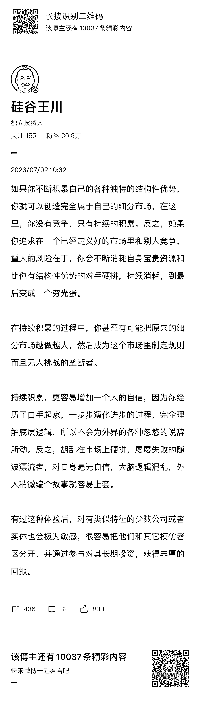

# 如果你不断积累自己的各种独特的结构性优势，也可以创造完全属于自己的细分市场

> 原文：[`www.yuque.com/for_lazy/thfiu8/cu42xwynglgzzdwt`](https://www.yuque.com/for_lazy/thfiu8/cu42xwynglgzzdwt)

## (20 赞)如果你不断积累自己的各种独特的结构性优势，也可以创造完全属于自己的细分市场 

作者： 亦仁的收藏夹 

日期：2023-08-02 

如果你不断积累自己的各种独特的结构性优势，你就可以创造完全属于自己的细分市场，在这里，你没有竞争，只有持续的积累。 

反之，如果你追求在一个已经定义好的市场里和别人竞争，重大的风险在于,你会不断消耗自身宝贵资源和比你有结构性优势的对手硬拼，持续消耗，到最后变成一个穷光蛋。  

评论区： 

云峰 : 走别人的路，让自己无路可走 

  