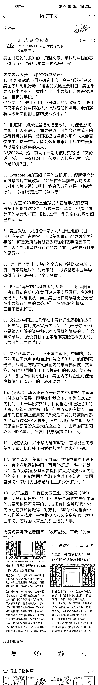

# 美国《纽约时报》的一篇新文章，承认对中国的芯片供应链的封锁行动“是一种战争行为“

> 原文：[`www.yuque.com/for_lazy/thfiu8/clbep905frptk47h`](https://www.yuque.com/for_lazy/thfiu8/clbep905frptk47h)

## (9 赞)美国《纽约时报》的一篇新文章，承认对中国的芯片供应链的封锁行动“是一种战争行为“ 

作者： 亦仁的收藏夹 

日期：2023-07-31 

美国《纽约时报》的一篇新文章，承认对中国的芯片供应链的封锁行动"是一种战争行为"。  

评论区： 

暂无评论 

  