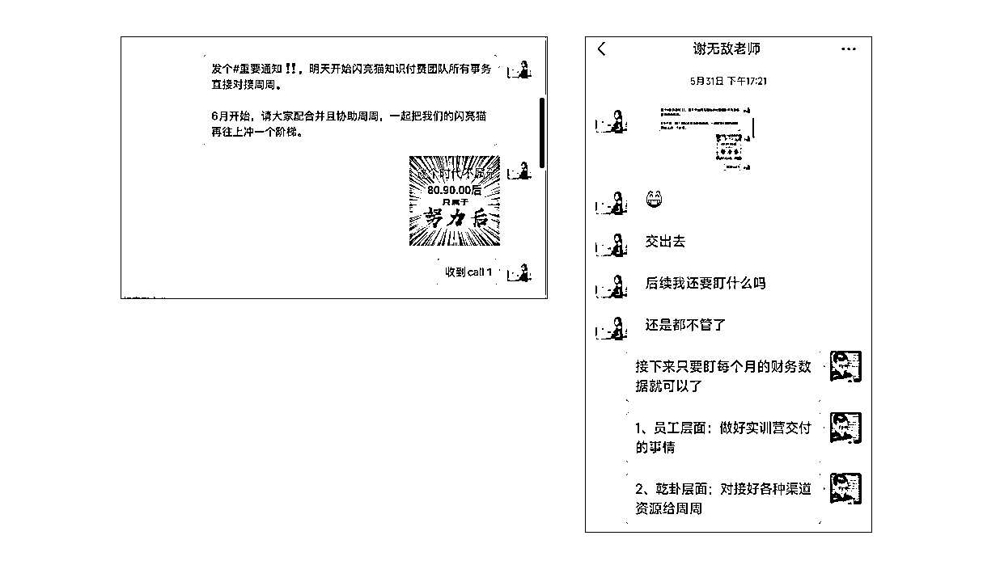
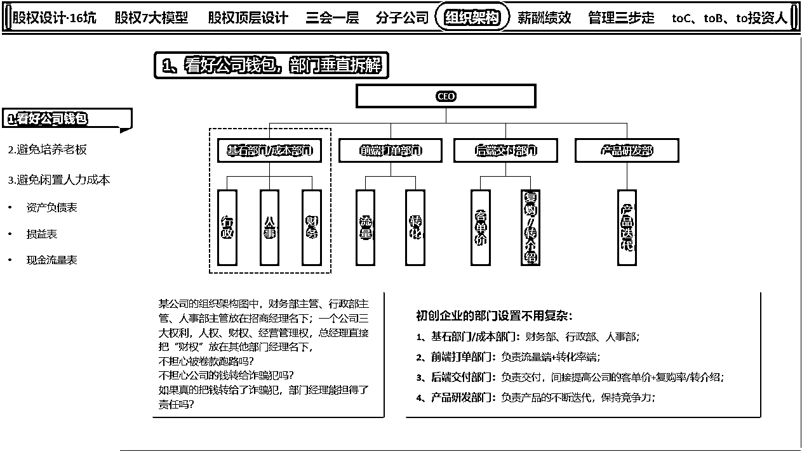
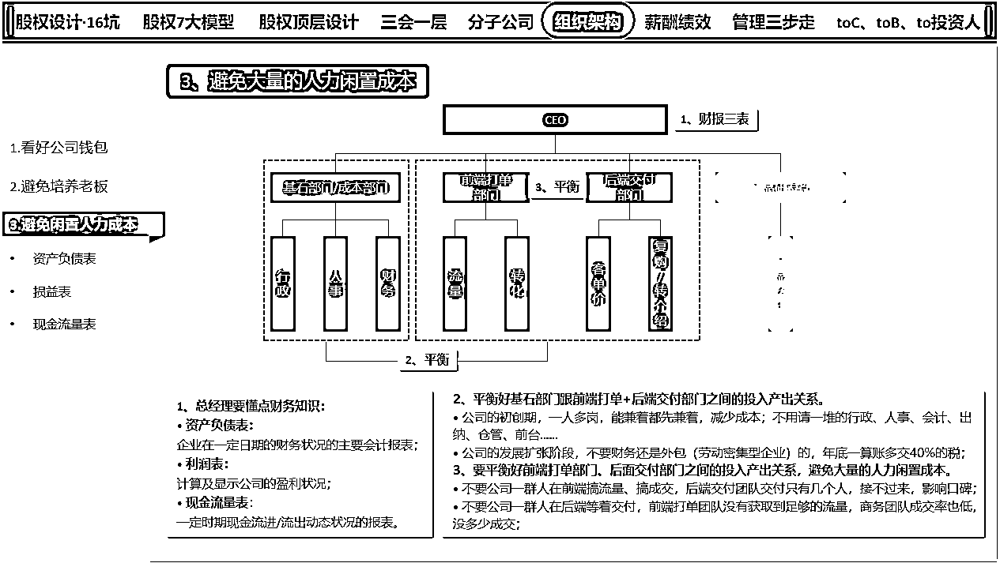
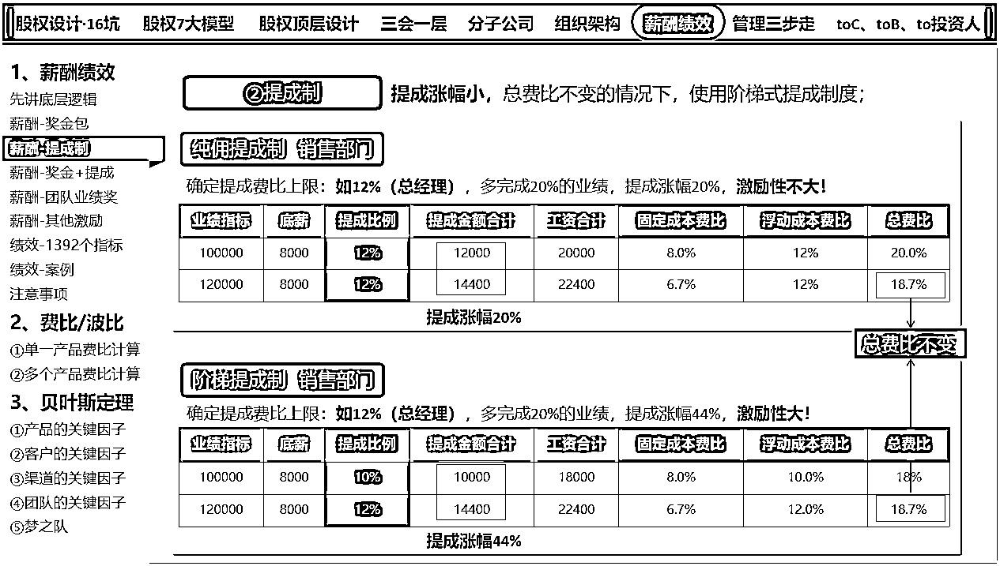
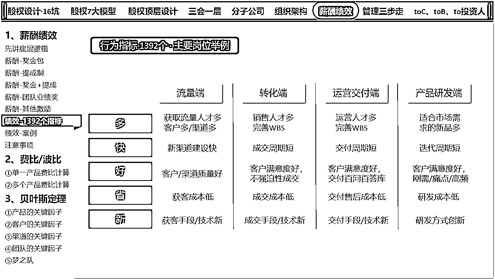
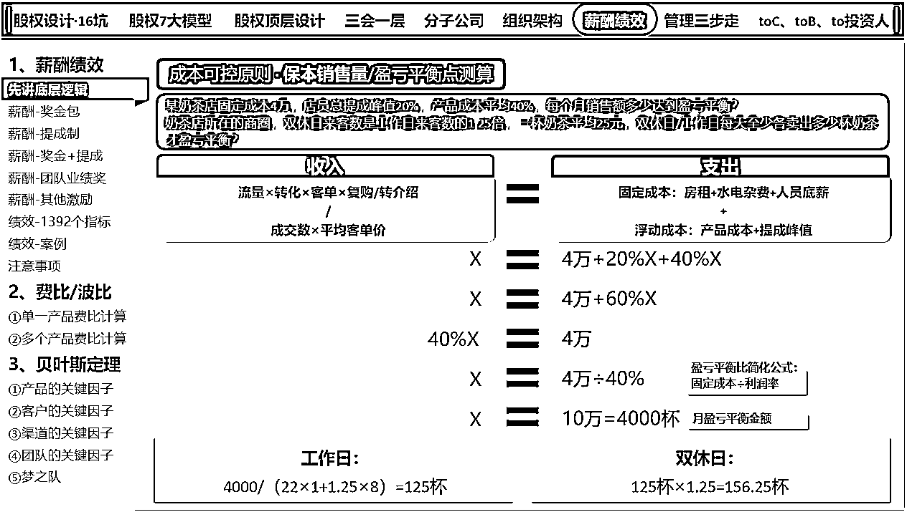
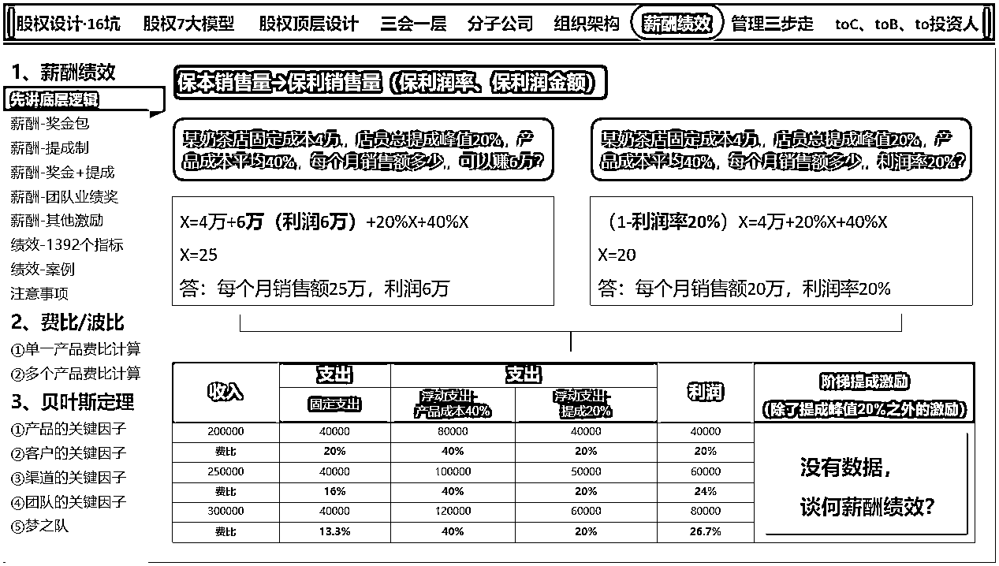
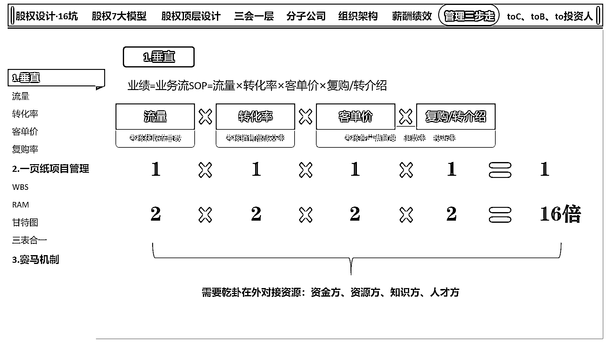
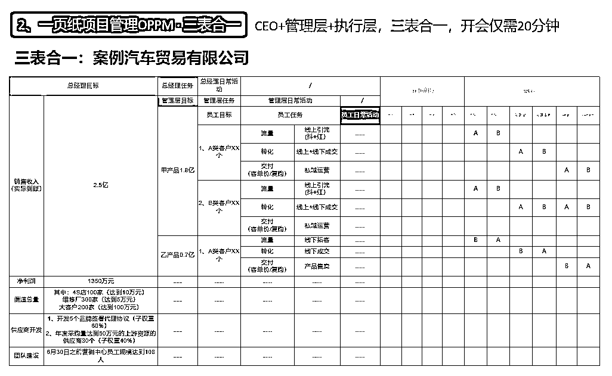
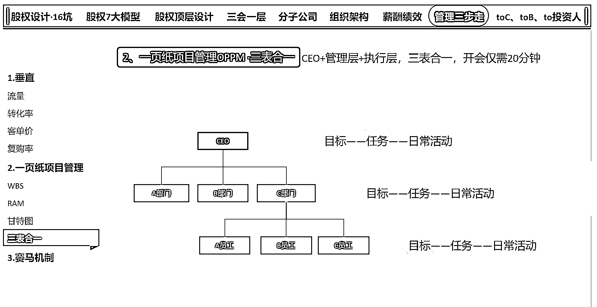

# 老板必读如何让公司 3 个月时间，业绩翻 3 倍？

> 原文：[`www.yuque.com/for_lazy/thfiu8/lfna3q62v6gu1clf`](https://www.yuque.com/for_lazy/thfiu8/lfna3q62v6gu1clf)

<ne-h2 id="e6e742dd" data-lake-id="e6e742dd"><ne-heading-ext><ne-heading-anchor></ne-heading-anchor><ne-heading-fold></ne-heading-fold></ne-heading-ext><ne-heading-content><ne-text id="u25f0d8b0">(精华帖)(125 赞)老板必读如何让公司 3 个月时间，业绩翻 3 倍？</ne-text></ne-heading-content></ne-h2> <ne-p id="ua931dd61" data-lake-id="ua931dd61"><ne-text id="u46da39f5">作者： 深圳刘宁培</ne-text></ne-p> <ne-p id="u55d61719" data-lake-id="u55d61719"><ne-text id="u0f9fb083">日期：2023-08-10</ne-text></ne-p> <ne-p id="u9732debf" data-lake-id="u9732debf"><ne-text id="u834b640b">我是刘宁培，也可以喊我宁老师，龙凤胎奶爸，常居深圳，全国飞。</ne-text></ne-p> <ne-p id="ude3865e6" data-lake-id="ude3865e6"><ne-text id="u668cec57">主业企业咨询：股权设计、企业经营管理、商业模式板块。</ne-text></ne-p> <ne-p id="u0152f149" data-lake-id="u0152f149"><ne-text id="uef211de1">副业做点小投资：开开知名品牌的加盟店，年底线下摆摊卖卖红包对联。</ne-text></ne-p> <ne-p id="u3b86eb6f" data-lake-id="u3b86eb6f"><ne-text id="udd232ec5">是生财第二期就一直续费至今的老圈友，编号 1748。</ne-text></ne-p> <ne-p id="u56b972ff" data-lake-id="u56b972ff"><ne-text id="u37c48493">我在生财有术立的生态位，一直是跟股权设计/股权激励相关的，前后写了三篇文章，都拿过精华帖，链接如下：</ne-text></ne-p> <ne-p id="u622e5a04" data-lake-id="u622e5a04"><ne-text id="u39b1b1b9">①企业初创期股权知识，避坑 80%+：</ne-text>[<ne-text id="ucb7913fe">https://t.zsxq.com/fyNbAuR</ne-text>](https://t.zsxq.com/fyNbAuR)</ne-p> <ne-p id="u6393ffa4" data-lake-id="u6393ffa4"><ne-text id="ua06f5c97">②股权顶层设计：</ne-text>[<ne-text id="uec76c39b">https://t.zsxq.com/UBqVvjU</ne-text>](https://t.zsxq.com/UBqVvjU)<ne-text id="u896e9cbe">、</ne-text>[<ne-text id="u66a536aa">https://t.zsxq.com/27eqV7A</ne-text>](https://t.zsxq.com/27eqV7A)</ne-p> <ne-p id="u05911b40" data-lake-id="u05911b40"><ne-text id="ued06cc75">③股权激励：</ne-text>[<ne-text id="u04a7c334">https://t.zsxq.com/05iMB2Zfu</ne-text>](https://t.zsxq.com/05iMB2Zfu)</ne-p> <ne-p id="ufb4e5c4f" data-lake-id="ufb4e5c4f"><ne-text id="u495d9a41">之所以立“股权”相关的生态位，因为“股权”背靠公司法，是公司“所有权”层面，不像“经营权”层面的薪酬绩效/管理，老板有调整的空间，</ne-text></ne-p> <ne-p id="u7a92546d" data-lake-id="u7a92546d"><ne-text id="u6ba49102">股东之间一旦发生了“股权”相关不可调解的矛盾，基本上就是打官司解决，</ne-text><ne-text id="ud0b7f8bf" ne-bold="true">轻则公司业务从头开始，重则公司业务就废了</ne-text><ne-text id="u8b2e30ba">，所以每个公司几乎都有“股权设计”的需求。</ne-text></ne-p> <ne-p id="u38d91864" data-lake-id="u38d91864"><ne-text id="u65b16187">近半年成交的生财圈友，如亦仁大哥、谢无敌老师、盖哥、刀姐、任佳伟老师、马超老师、陈亚东老师、旭教练老师、刘子荣老师、高夫人、林蔷七老师、七小等，还有几个年利润过千万的大哥、大姐、小姐姐......</ne-text></ne-p> <ne-p id="u75edb557" data-lake-id="u75edb557"><ne-text id="u9e240af4">虽然立的是“股权”的生态位，但“薪酬、管理”板块的内容也有做。</ne-text></ne-p> <ne-p id="u97d43dfb" data-lake-id="u97d43dfb"><ne-text id="ua182b318">接下来这篇文章，给大家讲讲，我是如何通过“所有权”的股权激励+“经营权”的薪酬管理，</ne-text><ne-text id="ud66e384e" style="background-color: rgba(255, 246, 122, 0.8);">让@谢无敌老师的闪亮猫传媒业绩，在短短 3 个月的时间，翻了 3 倍</ne-text><ne-text id="u441a4203" ne-bold="true">。</ne-text></ne-p> <ne-p id="u56cd402a" data-lake-id="u56cd402a"><ne-text id="u89193e35">谢无敌老师，大家应该都认识哈，介绍如下：</ne-text></ne-p> <ne-oli index-type="0"><ne-oli-i>1</ne-oli-i><ne-oli-c class="ne-oli-content" id="u8124b2b6" data-lake-id="u8124b2b6"><ne-text id="u3b80d2cf">闪亮猫传媒创始人，通过小红书矩阵号帮自家家居品牌引流变现超过 2000 万；</ne-text></ne-oli-c></ne-oli> <ne-oli index-type="0"><ne-oli-i>2</ne-oli-i><ne-oli-c class="ne-oli-content" id="uf7acb0bd" data-lake-id="uf7acb0bd"><ne-text id="u44051a58">小红书实战营带练导师，已孵化美食、职场、设计、艺术、宠物等多个类目 IP，冠军学员最高变现 600W+</ne-text></ne-oli-c></ne-oli> <ne-oli index-type="0"><ne-oli-i>3</ne-oli-i><ne-oli-c class="ne-oli-content" id="u69894fc6" data-lake-id="u69894fc6"><ne-text id="u1ce52d1e">【谢无敌的红书宝】知识星球主理人，垂直于小红书运营，帮助 3000+成员实现内容变现。</ne-text></ne-oli-c></ne-oli> <ne-p id="u834d9c4b" data-lake-id="u834d9c4b"><ne-text id="u24595cc9">给谢无敌老师落地交付的板块，有以下 9 个板块：股权设计 16 坑、股权 7 大模型、股权顶层设计、三会一层、分子公司、组织架构、薪酬绩效、管理三步走、toCtoBto 投资人。</ne-text></ne-p> <ne-p id="u4e36784e" data-lake-id="u4e36784e"><ne-text id="u639b21df">我的交付比较特殊，客户先把所有要解决的问题准备好，100 个问题也好、200 个问题也好，先听我讲课，一个板块一个板块过，客户想要的答案，90%都在我这 9 个板块之内，如果不在，现场再百问百答咨询解决。</ne-text></ne-p> <ne-p id="ub320fd70" data-lake-id="ub320fd70"><ne-card data-card-name="image" data-card-type="inline" id="NkVzw" data-event-boundary="card">  <ne-p id="u41bcf411" data-lake-id="u41bcf411"><ne-text id="ufd440397" ne-bold="true">谢无敌老师目前的情况：</ne-text></ne-p> <ne-p id="u7a4110fc" data-lake-id="u7a4110fc"><ne-text id="uaa3cde1c">（1）她的工作量减少 60%+；</ne-text></ne-p> <ne-p id="ua593f278" data-lake-id="ua593f278"><ne-text id="u59cd12bb">（2）直到 7 月份，闪亮猫传媒主营业务业绩翻 3 倍；</ne-text></ne-p> <ne-p id="u5108061a" data-lake-id="u5108061a"><ne-text id="u9e5b7936">（3）腾出时间操盘绘素坊新项目，新项目月利润 7 位数（我也进了这个新项目，争取在年底，一起让新项目月利润翻个 3-5 倍）</ne-text></ne-p> <ne-p id="u460fe0cc" data-lake-id="u460fe0cc"><ne-card data-card-name="image" data-card-type="inline" id="sWq9c" data-event-boundary="card">  <ne-p id="ue95d8d6a" data-lake-id="ue95d8d6a"><ne-card data-card-name="image" data-card-type="inline" id="z4XLK" data-event-boundary="card">  <ne-h3 id="3437a3db" data-lake-id="3437a3db"><ne-heading-ext><ne-heading-anchor></ne-heading-anchor><ne-heading-fold></ne-heading-fold></ne-heading-ext><ne-heading-content><ne-text id="u0f5b6b03" style="background-color: rgb(98, 210, 86);">一、</ne-text><ne-text id="u81f0a6a5" ne-bold="true">谢无敌老师想要解决的问题</ne-text></ne-heading-content></ne-h3> <ne-p id="uf34fac78" data-lake-id="uf34fac78"><ne-text id="uc9eac3e7">今年 3 月份她找到我，想找我解决的问题，大概是以下 3 个方面：</ne-text></ne-p> <ne-p id="u73c87796" data-lake-id="u73c87796"><ne-text id="ua8a6074d">1、团队成员很多，她却忙得很；</ne-text></ne-p> <ne-p id="uc69e5886" data-lake-id="uc69e5886"><ne-text id="uc431012e">2、所有事情亲力亲为，团队人极其依赖她；</ne-text></ne-p> <ne-p id="u50438e5f" data-lake-id="u50438e5f"><ne-text id="ue736d591">3、工作环节一旦她不监督，很容易出现问题，业绩增长较慢；</ne-text></ne-p> <ne-p id="u3ea30964" data-lake-id="u3ea30964"><ne-card data-card-name="image" data-card-type="inline" id="r0l44" data-event-boundary="card">  <ne-h3 id="0ced6e37" data-lake-id="0ced6e37"><ne-heading-ext><ne-heading-anchor></ne-heading-anchor><ne-heading-fold></ne-heading-fold></ne-heading-ext><ne-heading-content><ne-text id="ua30b9e4e" ne-bold="true">二、经营权层面的方法论：组织架构</ne-text></ne-heading-content></ne-h3> <ne-p id="uf427082a" data-lake-id="uf427082a"><ne-text id="u688b3744">我帮助谢无敌老师落地交付的时候，她当时主要有 2 个主营产品（目前已经扩大到 4 个产品）</ne-text></ne-p> <ne-p id="ua0131fd2" data-lake-id="ua0131fd2"><ne-text id="uc8e7c4b4">产品①：知识星球社群；</ne-text></ne-p> <ne-p id="u0a4f4ba1" data-lake-id="u0a4f4ba1"><ne-text id="u559f82d1">产品②：商家实战营课程；</ne-text></ne-p> <ne-p id="ud379f5ee" data-lake-id="ud379f5ee"><ne-text id="u075cb96d">闪亮猫团队负责这 2 个板块的团队成员，工作职责有重合，并且是好几个人之间彼此有交叉重合，这种情况下，一来容易吃“大锅饭”，二来责权利不清晰，容易甩锅扯皮，做不到合情合理的论功行赏。</ne-text></ne-p> <ne-p id="uada60af9" data-lake-id="uada60af9"><ne-text id="u742ab0f5">于是我把闪亮猫传媒的组织架构重新进行了拆解，逻辑如下：</ne-text></ne-p> <ne-h4 id="48d46d41" data-lake-id="48d46d41"><ne-heading-ext><ne-heading-anchor></ne-heading-anchor><ne-heading-fold></ne-heading-fold></ne-heading-ext><ne-heading-content><ne-text id="u0646c387" style="background-color: rgba(78, 131, 253, 0.55);">2.1</ne-text> <ne-text id="u78bce4f3" ne-bold="true">看好公司钱包，部门垂直拆解</ne-text></ne-heading-content></ne-h4> <ne-p id="uc90d076d" data-lake-id="uc90d076d"><ne-card data-card-name="image" data-card-type="inline" id="lThk7" data-event-boundary="card">  <ne-p id="ubb2c0dc1" data-lake-id="ubb2c0dc1"><ne-text id="u49cc8666">初创企业的部门设置不用复杂：</ne-text></ne-p> <ne-p id="uc9c82838" data-lake-id="uc9c82838"><ne-text id="u7c9a8533">（1）基石部门/成本部门：财务部、行政部、人事部；</ne-text></ne-p> <ne-p id="ud1c4d822" data-lake-id="ud1c4d822"><ne-text id="ufb1c4647">（2）前端部门：负责流量端+转化率端；</ne-text></ne-p> <ne-p id="u94049926" data-lake-id="u94049926"><ne-text id="udee9223c">（3）后端交付部门：负责交付，间接提高公司的客单价+复购率/转介绍；</ne-text></ne-p> <ne-p id="uf354cf26" data-lake-id="uf354cf26"><ne-text id="u1329a871">（4）产品研发部门：负责产品的不断迭代，保持竞争力；</ne-text></ne-p> <ne-p id="u89e664de" data-lake-id="u89e664de"><ne-text id="ufa5e79d8">闪亮猫知识付费团队被我拆成了 3 个部门：</ne-text></ne-p> <ne-p id="u58ea3a1d" data-lake-id="u58ea3a1d"><ne-text id="uc77d4758" ne-bold="true">部门①：前端部门-流量，</ne-text><ne-text id="uba4b54ef">负责去各平台种草获客，不管是小红书、抖音、知乎、视频号、公众号等，考核的是获客数，如每个月目标 10000 个公域流量导到私域；</ne-text></ne-p> <ne-p id="u10bac6b9" data-lake-id="u10bac6b9"><ne-text id="u75ca4992" ne-bold="true">部门②：前端部门-转化率，</ne-text><ne-text id="ud53c8df4">负责将导流过来的客户成交到知识星球、商家实战营，考核成交率，不管是微信聊天成交、电话语音成交，以收钱为主；</ne-text></ne-p> <ne-p id="uce5a6742" data-lake-id="uce5a6742"><ne-text id="uef9f1b1a" ne-bold="true">部门③：后端交付部门-客单价/复购/转介绍，</ne-text><ne-text id="u55d0f258">知识星球/商家实战营的的活动运营、内容运营、培训交付。</ne-text></ne-p> <ne-p id="u8d3c838b" data-lake-id="u8d3c838b"><ne-text id="ude65bf28">优化后，谢无敌老师的身份变成了交付板块的一名员工（不以老板身份/股东身份自居），被安排到做直播交付+答疑+上课等事宜，听 CEO 的安排，考核的是退费率、投诉率、客户满意度。</ne-text></ne-p> <ne-p id="u28249af7" data-lake-id="u28249af7"><ne-text id="uc22a07e3">被我拆后的 3 个部门，每个部门的职责清晰，有工作上的重新磨合、协调，但不会再有重叠的工作职责，避免“大锅饭”“扯皮甩锅”。</ne-text></ne-p> <ne-h4 id="6ffc27d2" data-lake-id="6ffc27d2"><ne-heading-ext><ne-heading-anchor></ne-heading-anchor><ne-heading-fold></ne-heading-fold></ne-heading-ext><ne-heading-content><ne-text id="u1046c32c" ne-bold="true">2.2 避免大量的人力闲置成本</ne-text></ne-heading-content></ne-h4> <ne-p id="u8d01cb6b" data-lake-id="u8d01cb6b"><ne-card data-card-name="image" data-card-type="inline" id="GkN4I" data-event-boundary="card">  <ne-p id="udb3bcffb" data-lake-id="udb3bcffb"><ne-text id="u6a1dbe71" ne-bold="true">（1）总经理要懂点财务知识：</ne-text></ne-p> <ne-p id="ufe4a119d" data-lake-id="ufe4a119d"><ne-text id="u5a2e4e79">· 资产负债表：企业在一定日期的财务状况的主要会计报表；</ne-text></ne-p> <ne-p id="u13cf0afd" data-lake-id="u13cf0afd"><ne-text id="uf7f5a8f1">· 利润表：计算及显示公司的盈利状况；</ne-text></ne-p> <ne-p id="u5ed0c0b1" data-lake-id="u5ed0c0b1"><ne-text id="u841eda8e">· 现金流量表：一定时期现金流进/流出动态状况的报表。</ne-text></ne-p> <ne-p id="u0dfb2ec5" data-lake-id="u0dfb2ec5"><ne-text id="u9802c78e" ne-bold="true">（2）平衡好基石部门跟前端+后端交付部门之间的投入产出关系。</ne-text></ne-p> <ne-p id="u9787c663" data-lake-id="u9787c663"><ne-text id="ud7d087bf">· 公司的初创期，一人多岗，能兼着都先兼着，减少成本；不用请一堆的行政、人事、会计、出纳、仓管、前台......</ne-text></ne-p> <ne-p id="ud9b23254" data-lake-id="ud9b23254"><ne-text id="ue3c4bf35">· 公司的发展扩张阶段，不要财务还是外包（劳动密集型企业）的，年底一算账多交 40%的税；</ne-text></ne-p> <ne-p id="u6b030eab" data-lake-id="u6b030eab"><ne-text id="u9840e72d" ne-bold="true">（3）要平衡好前端部门、后面交付部门之间的投入产出关系，避免大量的人力闲置成本。</ne-text></ne-p> <ne-p id="uc0f99b6c" data-lake-id="uc0f99b6c"><ne-text id="ued822771">· 不要公司一群人在前端搞流量、搞成交，后端交付团队交付只有几个人，接不过来，影响口碑；</ne-text></ne-p> <ne-p id="uca129686" data-lake-id="uca129686"><ne-text id="uceb6dac6">· 不要公司一群人在后端等着交付，前端团队没有获取到足够的流量，商务团队成交率也低，没多少成交；</ne-text></ne-p> <ne-p id="u56b1db9d" data-lake-id="u56b1db9d"><ne-text id="u7846f003">谢无敌老师是特许金融分析师（CFA），财务板块，一点就通。</ne-text></ne-p> <ne-p id="u85c2e06e" data-lake-id="u85c2e06e"><ne-text id="u252aa785">当下主要平衡好前端部门、后端部门之间的平衡；</ne-text></ne-p> <ne-p id="u10547c7b" data-lake-id="u10547c7b"><ne-text id="ua08d149a">如：前端有新的方法论让流量翻倍的时候，及时跟转化部/交付部门沟通，人手是否足够，要及时招人，</ne-text></ne-p> <ne-p id="ub3c3bae8" data-lake-id="ub3c3bae8"><ne-text id="u65d3a8b7">如：转化率越来越高的时候，及时跟后端运营交付部门沟通，人手是否足够，要及时招人，</ne-text></ne-p> <ne-p id="u316c69dd" data-lake-id="u316c69dd"><ne-text id="u762b9675" ne-bold="true">如果你作为 CEO，得会看财务三大报表：</ne-text></ne-p> <ne-p id="u844d3396" data-lake-id="u844d3396"><ne-text id="u56e7aa91">要知道前端部门跟后端交付部门的工作量是否相对平衡，可以有 10-20%的不平衡，也就是大家上班的时候摸摸鱼嘛，</ne-text></ne-p> <ne-p id="ue287ae13" data-lake-id="ue287ae13"><ne-text id="uee6eb8f4">但是不要因不会看财务三大报表，前后端的不平衡有 40%以上都不知道，导致的后果要么就是前端一堆流量后端承接不住，浪费了；要么就是前端流量短缺，后端一群人等着交付，最终导致大量的人力闲置成本。</ne-text></ne-p> <ne-h3 id="5a768551" data-lake-id="5a768551"><ne-heading-ext><ne-heading-anchor></ne-heading-anchor><ne-heading-fold></ne-heading-fold></ne-heading-ext><ne-heading-content><ne-text id="u93d4aded" style="background-color: rgb(98, 210, 86);">三</ne-text><ne-text id="ud2306e6a" ne-bold="true">、经营权层面的方法论：薪酬/绩效</ne-text></ne-heading-content></ne-h3> <ne-h3 id="4fe8b9dd" data-lake-id="4fe8b9dd"><ne-heading-ext><ne-heading-anchor></ne-heading-anchor><ne-heading-fold></ne-heading-fold></ne-heading-ext><ne-heading-content></ne-heading-content></ne-h3><ne-h4 id="47f80a49" data-lake-id="47f80a49"><ne-heading-ext><ne-heading-anchor></ne-heading-anchor><ne-heading-fold></ne-heading-fold></ne-heading-ext><ne-heading-content><ne-text id="u449ec41e" ne-bold="true">3.1 薪酬：</ne-text></ne-heading-content></ne-h4> <ne-p id="ucd557981" data-lake-id="ucd557981"><ne-text id="uab7da453">正常来说，不同的部门，会设置不同的薪酬体系，常见的有以下几种：</ne-text></ne-p> <ne-p id="ua0ad3116" data-lake-id="ua0ad3116"><ne-text id="ua395b21d">（1）奖金包；</ne-text></ne-p> <ne-p id="ua64582c3" data-lake-id="ua64582c3"><ne-text id="ue552bdb5">（2）纯佣提成制/阶梯提成制；</ne-text></ne-p> <ne-p id="ud4029654" data-lake-id="ud4029654"><ne-text id="ud9c817da">（3）奖金+提成制/纯佣提成制；</ne-text></ne-p> <ne-p id="ua73cbaab" data-lake-id="ua73cbaab"><ne-text id="ubadb8cad">公司发展不同阶段、不同部门，有不同的运用场景，常见的运用场景如下：</ne-text></ne-p> <ne-p id="udf141a96" data-lake-id="udf141a96"><ne-text id="ue288c297">给闪亮猫前端流量和转化团队、后端交付团队，用的都是</ne-text><ne-text id="u8e630c39" ne-bold="true">底薪+奖金包+纯佣提成+行为指标考核，</ne-text></ne-p> <ne-p id="ub89349cd" data-lake-id="ub89349cd"><ne-card data-card-name="image" data-card-type="inline" id="h6KOq" data-event-boundary="card">  <ne-p id="u2b644125" data-lake-id="u2b644125"><ne-card data-card-name="image" data-card-type="inline" id="ucAfT" data-event-boundary="card">  <ne-p id="uacd96a1c" data-lake-id="uacd96a1c"><ne-card data-card-name="image" data-card-type="inline" id="ClBVc" data-event-boundary="card">  <ne-p id="ub602385e" data-lake-id="ub602385e"><ne-card data-card-name="image" data-card-type="inline" id="b4DNl" data-event-boundary="card">  <ne-h4 id="57fe7513" data-lake-id="57fe7513"><ne-heading-ext><ne-heading-anchor></ne-heading-anchor><ne-heading-fold></ne-heading-fold></ne-heading-ext><ne-heading-content><ne-text id="ud208c0e6" ne-bold="true">3.2 绩效：</ne-text></ne-heading-content></ne-h4> <ne-p id="u4f80e9da" data-lake-id="u4f80e9da"><ne-text id="u05d6aa74">至于绩效，因为我有 KPI 指标库，里面涵盖了各部门的行为指标 1392 个（有需要的圈友可以找我领取 lnp266）</ne-text></ne-p> <ne-p id="u74d824c6" data-lake-id="u74d824c6"><ne-card data-card-name="image" data-card-type="inline" id="EJban" data-event-boundary="card">  <ne-p id="u22bcce5c" data-lake-id="u22bcce5c"><ne-card data-card-name="image" data-card-type="inline" id="IK4rp" data-event-boundary="card"><ne-card data-card-name="image" data-card-type="inline" id="lAwsA" data-event-boundary="card">  <ne-p id="uc4ea9ff2" data-lake-id="uc4ea9ff2"><ne-text id="u7a3575db">绩效的底层逻辑目标是多快好省新，主要岗位行为指标举例如下：</ne-text></ne-p> <ne-p id="uea55d8eb" data-lake-id="uea55d8eb"><ne-text id="u7903ea11" ne-bold="true">我给闪亮猫团队的绩效考核指标，目的就是多快好省新</ne-text></ne-p> <ne-p id="uf788da15" data-lake-id="uf788da15"><ne-card data-card-name="image" data-card-type="inline" id="iBq0u" data-event-boundary="card">  <ne-p id="ub2df5ed8" data-lake-id="ub2df5ed8"><ne-text id="u460260a7" ne-bold="true">但是要注意以下几个细节：</ne-text></ne-p> <ne-p id="u59c9a1ac" data-lake-id="u59c9a1ac"><ne-text id="u5c2fc8b2">（1）考核项不要过多，3-7 条即可，曾经见过 60 条考核项的绩效要求；</ne-text></ne-p> <ne-p id="u81111a40" data-lake-id="u81111a40"><ne-text id="ufd81743b">（2）每个考核项权重，≥10%，小于 10%，没太大意义；</ne-text></ne-p> <ne-p id="u5dc359a6" data-lake-id="u5dc359a6"><ne-text id="ud6f8d1d4">（3）钱在哪里，心在哪里，曾见过绩效的 50%，是老板的满意度评价，养了一群溜须拍马的员工；</ne-text></ne-p> <ne-p id="u7f45d2fd" data-lake-id="u7f45d2fd"><ne-card data-card-name="image" data-card-type="inline" id="gIguM" data-event-boundary="card">  <ne-h4 id="b9d85665" data-lake-id="b9d85665"><ne-heading-ext><ne-heading-anchor></ne-heading-anchor><ne-heading-fold></ne-heading-fold></ne-heading-ext><ne-heading-content><ne-text id="ue96dd6a1" ne-bold="true">3.3 薪酬+绩效，一定是奔着共赢去的</ne-text></ne-heading-content></ne-h4> <ne-p id="ub2c805fc" data-lake-id="ub2c805fc"><ne-text id="ue22e1088">有人说，员工不能拿太高的工资，容易心思多；薪酬绩效就是为克扣员工工资存在的；公司招聘的人越来越多，公司的利润率越来越低......</ne-text></ne-p> <ne-p id="uf67c90b8" data-lake-id="uf67c90b8"><ne-text id="u525a1aef">在我们这，以上情况是不存在的，薪酬绩效的最终目的，一定是公司员工共赢，而不是博弈。</ne-text></ne-p> <ne-p id="u71d4a00b" data-lake-id="u71d4a00b"><ne-text id="u09fe76b5">我们会通过详细的财务测算，测算出公司每个月的盈亏平衡是多少、测出每个部门的盈亏平衡是多少、测出每个员工的盈亏平衡是多少，设定好对应薪酬绩效，大家一起分增量市场。</ne-text></ne-p> <ne-p id="u7043c565" data-lake-id="u7043c565"><ne-text id="u0ab21dee">所以薪酬绩效设置到位，公司招聘的人越来越多，公司的利润率一定越来越高，因为固定成本几乎不变或者为微增，销售额增加，固定成本费比下降，公司利润提增加。</ne-text></ne-p> <ne-p id="u8b3fdee6" data-lake-id="u8b3fdee6"><ne-text id="ua1f3ea10">谢无敌老师的闪亮猫公司，不涉及到这个盈亏平衡的测算。</ne-text></ne-p> <ne-p id="uf7dd5a1a" data-lake-id="uf7dd5a1a"><ne-text id="u4ef760eb">起盘的新的项目，涉及到盈亏平衡的测算，要确定每个月的销售额达到多少，才能养得起另外一个项目几十人的团队，上海陆家嘴的房租，可不便宜啊。</ne-text></ne-p> <ne-p id="u3bd91496" data-lake-id="u3bd91496"><ne-text id="uf89c68b2" ne-bold="true">大概逻辑如下，先测出盈亏平衡点（也叫收支平衡点、损益平衡点、保本销售量），再测保利（利润率、利润额）销售量。</ne-text></ne-p> <ne-p id="u9997d07c" data-lake-id="u9997d07c"><ne-card data-card-name="image" data-card-type="inline" id="rIf1M" data-event-boundary="card">  <ne-p id="uf3870fcc" data-lake-id="uf3870fcc"><ne-card data-card-name="image" data-card-type="inline" id="KQwog" data-event-boundary="card">  <ne-h3 id="87af8f81" data-lake-id="87af8f81"><ne-heading-ext><ne-heading-anchor></ne-heading-anchor><ne-heading-fold></ne-heading-fold></ne-heading-ext><ne-heading-content><ne-text id="u48018564" ne-bold="true">四、经营权层面的方法论：管理三步走</ne-text></ne-heading-content></ne-h3> <ne-h3 id="4fe8b9dd-1" data-lake-id="4fe8b9dd-1"><ne-heading-ext><ne-heading-anchor></ne-heading-anchor><ne-heading-fold></ne-heading-fold></ne-heading-ext><ne-heading-content></ne-heading-content></ne-h3><ne-h4 id="0303e093" data-lake-id="0303e093"><ne-heading-ext><ne-heading-anchor></ne-heading-anchor><ne-heading-fold></ne-heading-fold></ne-heading-ext><ne-heading-content><ne-text id="uf4b37d15" ne-bold="true">4.1 垂直</ne-text></ne-heading-content></ne-h4> <ne-p id="u6d3518b7" data-lake-id="u6d3518b7"><ne-text id="ub07115d5">这个在组织架构板块中讲过了，每个部门只做自己垂直的板块。</ne-text></ne-p> <ne-p id="uaa804acd" data-lake-id="uaa804acd"><ne-text id="uc27f31d7">好处：垂直人效最高/垂直避免扯皮/团队扩充招聘新人上手快。</ne-text></ne-p> <ne-p id="ub67780b1" data-lake-id="ub67780b1"><ne-card data-card-name="image" data-card-type="inline" id="qB0VK" data-event-boundary="card">  <ne-h4 id="d4525895" data-lake-id="d4525895"><ne-heading-ext><ne-heading-anchor></ne-heading-anchor><ne-heading-fold></ne-heading-fold></ne-heading-ext><ne-heading-content><ne-text id="uf96b9915" ne-bold="true">4.2 一页纸相关管理</ne-text></ne-heading-content></ne-h4> <ne-p id="ud538e309" data-lake-id="ud538e309"><ne-text id="u9115b761">之前写过一篇文章，关于一页纸项目管理这个工具的，篇幅太长，就不重复了，有需要的，可以自行查看哈。</ne-text></ne-p> <ne-p id="u128d8c8d" data-lake-id="u128d8c8d"><ne-text id="u223cc24e">链接如下：</ne-text>[<ne-text id="u348f3979">https://t.zsxq.com/117GcZDrn</ne-text>](https://t.zsxq.com/117GcZDrn)</ne-p> <ne-p id="ue8445549" data-lake-id="ue8445549"><ne-card data-card-name="image" data-card-type="inline" id="firLy" data-event-boundary="card">  <ne-p id="u7d476f03" data-lake-id="u7d476f03"><ne-card data-card-name="image" data-card-type="inline" id="eQr5O" data-event-boundary="card">  <ne-p id="ue70ad864" data-lake-id="ue70ad864"><ne-text id="u9a27cb92">一页纸项目管理，从上到下，三表合一；</ne-text></ne-p> <ne-p id="u38aec296" data-lake-id="u38aec296"><ne-text id="uf9a5e06c">将流量部门、转化部门、交付部门要做的必然事件、时间周期、责任人都罗列好，</ne-text></ne-p> <ne-p id="uc87ede1e" data-lake-id="uc87ede1e"><ne-text id="u0c64027c">接下来每个月各部门的动作几乎都很固定，落地的时候，将闪亮猫公司的流量部门、转化部门、交付部门会影响业务成败的事件写好，</ne-text></ne-p> <ne-p id="u353b5199" data-lake-id="u353b5199"><ne-text id="ud1a42399">以后各部门的周会、月会、季度会、年会，就是反复拿出这张表，来讨论这些事件。</ne-text></ne-p> <ne-p id="u337749f6" data-lake-id="u337749f6"><ne-text id="u825c81f6">随着运营的刷新，事件数量会有增减，但不会有太大的变动，有增减的时候，同步刷新这张表。</ne-text></ne-p> <ne-p id="u92f5d1e9" data-lake-id="u92f5d1e9"><ne-text id="ue01a06ba">表格模板如下：</ne-text></ne-p> <ne-p id="u7d6e871a" data-lake-id="u7d6e871a"><ne-card data-card-name="image" data-card-type="inline" id="jyIda" data-event-boundary="card">  <ne-p id="u054c400e" data-lake-id="u054c400e"><ne-card data-card-name="image" data-card-type="inline" id="EMHEI" data-event-boundary="card">  <ne-h4 id="47af8340" data-lake-id="47af8340"><ne-heading-ext><ne-heading-anchor></ne-heading-anchor><ne-heading-fold></ne-heading-fold></ne-heading-ext><ne-heading-content><ne-text id="u62dd7c5a" ne-bold="true">4.3 赛马机制</ne-text></ne-heading-content></ne-h4> <ne-p id="uc74842b3" data-lake-id="uc74842b3"><ne-text id="u0c369f7f">马云说的很对，大部分人离职，就两个原因，钱没到位，心受委屈了。</ne-text></ne-p> <ne-p id="u270583f2" data-lake-id="u270583f2"><ne-text id="u87089e55">通过合理的薪酬绩效体系，让员工赚得足够多，收入远高于同岗位的人员，让员工“钱到位”，而不是压榨员工；</ne-text></ne-p> <ne-p id="u6445d5cb" data-lake-id="u6445d5cb"><ne-text id="uf1d0a0a1">通过垂直+一页纸项目管理，明确员工的责权利，要做到什么结果，过程路径是什么，让员工“心不受委屈”，而不是让员工今天做这个，明天安排做那个，像无头苍蝇一样一直做无用功。</ne-text></ne-p> <ne-p id="ufa456000" data-lake-id="ufa456000"><ne-text id="u2460d23b">通过搭建薪酬绩效+管理体系，员工一来钱到位，二来心不受委屈，公司就有资格说一句话，我没亏待任何一个员工，但如果是员工经常犯错又不改错，亏待了公司，那就不好意思了，启动赛马机制，能者上。</ne-text></ne-p> <ne-h3 id="d7d65364" data-lake-id="d7d65364"><ne-heading-ext><ne-heading-anchor></ne-heading-anchor><ne-heading-fold></ne-heading-fold></ne-heading-ext><ne-heading-content><ne-text id="u261c540b" ne-bold="true">五、所有权层面的方法论：股权激励</ne-text></ne-heading-content></ne-h3> <ne-p id="u99e2b9b6" data-lake-id="u99e2b9b6"><ne-text id="u2b97749b">因为谢无敌老师个人的最终定位，不单单是做小红书赛道的知识付费业务。</ne-text></ne-p> <ne-p id="u00c4b039" data-lake-id="u00c4b039"><ne-text id="u1215e46f">还有和鹏老师一起经营绘素坊集团的东方风格家居设计。</ne-text></ne-p> <ne-p id="u324fe290" data-lake-id="u324fe290"><ne-text id="u5fbf1256" ne-bold="true">所以：谢无敌在闪亮猫公司的定位，是执行董事的角色，负责对接外部资源，如资金/资源/知识/人才。所以闪亮猫公司的 CEO 是另一个人，而不是谢无敌老师。</ne-text></ne-p> <ne-p id="u2c6a4e1d" data-lake-id="u2c6a4e1d"><ne-text id="uf57f65fd">3 月 25 日是生财有术的线下千人大会，前一天，3 月 24 日，我借了亦仁大哥的其中一个办公室，约了闪亮猫的两位股东+未来的 CEO。</ne-text></ne-p> <ne-p id="u1f6ffc01" data-lake-id="u1f6ffc01"><ne-text id="u0c09937b">我跟未来的 CEO 讲了几件事：</ne-text></ne-p> <ne-p id="u1dfbfceb" data-lake-id="u1dfbfceb"><ne-text id="u681f0c60">（1）未来谢无敌、鹏老师等人绘素坊集团的战略规划</ne-text></ne-p> <ne-p id="u1fa98fcc" data-lake-id="u1fa98fcc"><ne-text id="uae6a1030">（2）未来谢无敌老师在闪亮猫只做执行董事，帮你在外对接你想要的资源，协助你做业绩</ne-text></ne-p> <ne-p id="u60845d99" data-lake-id="u60845d99"><ne-text id="u16f17ab3">（3）你未来做 CEO 的收入，完成不同业绩，不同的分红比例，到手年薪分别是多少</ne-text></ne-p> <ne-p id="ud63c6504" data-lake-id="ud63c6504"><ne-text id="uc36e33c0">（4）有什么疑惑或者不清楚的，现场随时可以问我</ne-text></ne-p> <ne-p id="ub827148a" data-lake-id="ub827148a"><ne-text id="u509eb9c4">结果，搞定，双赢。</ne-text></ne-p> <ne-p id="uab67e42f" data-lake-id="uab67e42f"><ne-text id="ua1863a6e">目前闪亮猫 CEO 的工作态度可比谢无敌老师积极，还也带着团队迁徙到了杭州（暂驻生财有术办公室），整个团队一条心把业绩做大做强。</ne-text></ne-p> <ne-p id="udc8eaff0" data-lake-id="udc8eaff0"><ne-card data-card-name="image" data-card-type="inline" id="LVtCx" data-event-boundary="card">  <ne-p id="u29b40ff8" data-lake-id="u29b40ff8"><ne-text id="u870c5327">以上是我今天的分享，希望对你有帮助，如果你也有企业经营难点，欢迎找我聊一聊。</ne-text></ne-p> <ne-hole id="u0929abfb" data-lake-id="u0929abfb"><ne-card data-card-name="hr" data-card-type="block" id="GRWS8" data-event-boundary="card"><ne-p id="u1395b5f8" data-lake-id="u1395b5f8"><ne-text id="u0f48ec12">评论区：</ne-text></ne-p> <ne-p id="uc31737ea" data-lake-id="uc31737ea"><ne-text id="u2711f901">菜菜—-福鼎白茶批发* : [强][强]将来再做团队，🈶️股权架构，员工激励一定找宁老师帮忙设计。逻辑清晰，架构清楚[强]</ne-text> <ne-text id="u4a257df5">书情小跟班 : 触及到我知识盲区了，这篇文章值得多看几遍啊</ne-text> <ne-text id="uc00d5393">七小 : 宁培哥 yyds</ne-text> <ne-text id="ucf4a29b1">嗡嗡嗡起 JoyBoy : 宁老师方便➕个好友吗？想了解一下</ne-text> <ne-text id="u4ad9583a">Sherry💎谢无敌 : 终于可以成为学生了[害羞]在创业路上一直都是学生。</ne-text> <ne-text id="ubaad876b">心想事陈 : 刘宁培老师，想链接下你，怎么加你</ne-text> <ne-text id="uc468a2d2">深圳刘宁培 : OK，lnp266</ne-text> <ne-text id="u54fc02b1">深圳刘宁培 : ok，lnp266</ne-text></ne-p> <ne-p id="u71ffa77e" data-lake-id="u71ffa77e"><ne-card data-card-name="image" data-card-type="inline" id="ByLMU" data-event-boundary="card">  <ne-hole id="ue667738a" data-lake-id="ue667738a"><ne-card data-card-name="hr" data-card-type="block" id="Jy8Wz" data-event-boundary="card"></ne-card></ne-hole></ne-card></ne-p></ne-card></ne-hole></ne-card></ne-p></ne-card></ne-p></ne-card></ne-p></ne-card></ne-p></ne-card></ne-p></ne-card></ne-p></ne-card></ne-p></ne-card></ne-p></ne-card></ne-p></ne-card></ne-p></ne-card></ne-card></ne-p></ne-card></ne-p></ne-card></ne-p></ne-card></ne-p></ne-card></ne-p></ne-card></ne-p></ne-card></ne-p></ne-card></ne-p></ne-card></ne-p></ne-card></ne-p></ne-card></ne-p></ne-card></ne-p>