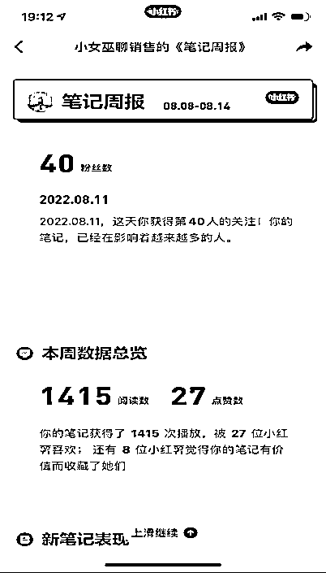

# 从视频号的失败到小红书的成功，如何调整心态并找到最适合自己的赛道？

> 原文：[`www.yuque.com/for_lazy/thfiu8/txl728g8gfqd1br5`](https://www.yuque.com/for_lazy/thfiu8/txl728g8gfqd1br5)

## (59 赞)从视频号的失败到小红书的成功，如何调整心态并找到最适合自己的赛道？ 

作者： 小女巫忻忻 

日期：2023-08-10 

记得今年生财线下聚会的时候亦仁说，生财就好像一个商学院，给大家平台学习，但是修行在个人。我想，大约我算是一个靠选修课修出还不错的成绩的新手吧。生财开启了我获得另一份收入的大门，到现在我也算是一年的自媒体人了，变现了大约 15 万不到。 

大家好，我是忻忻，主业在一家 500 强外资银行做高级销售教练，副业还是做销售教练，用户是除了我所在的公司以外的银行以及保险行业的销售，带他们做大单。和生财的各位大佬比起来，这个成绩其实数量是不值得来分享的，但相比我投入的精力来说，已经是很让我满意的成绩了。 

因为平均下来，我花在副业上的时间每天不超过一个小时。这个性价比，甚至可以认为有点躺赚。 

我其实是去年才加入生财的新人，甚至可以这么说，是通过生财才知道原来副业有这么多可以去尝试的渠道。赚钱，创业，不是我过往想象中的一定要做微商，要认认真真开一家公司。 

感谢生财给我这个机会让我去回顾这一段经历。很多人会有幸存者偏差，拿到一些成绩的时候，仿佛这件事情来的很容易，但是当我再去回忆自己是如何从一期一期航海，在生财启航的时候我才意识到，目前的成绩一半是偶然，另一半才到了今天的必然，我感谢自己的坚持。 <ne-h3 id="9a64b302" data-lake-id="9a64b302">第一次航海我没赚到钱，还倒贴了 100 元</ne-h3> 

参加第 1 期航海是在加入生财后不久，看了一两个月的精华帖，我依然没有赚到一分钱，但是在那些帖子里，我看到大部分生财的新人是参加了航海，“把手弄脏”以后才一点点开始蜕变的。于是我也决定入局尝试。 

但是和很多生财的萌新一样，可以选择的航海实在是太多了，对我来说都是一个起步——就是我完全不会。所以到底选择哪一个呢？ 

不怕大家笑话，我当时甚至因为付了 2000 多块加入生财，都不太舍得多花押金，不像有些人能同一时间报十几个航海。虽说押金最后是可以拿回来的，但我还是揣着一丝怀疑，这是不是变相再割我一波呀？ 

所以在那个时候我只选了一个，就是很多大佬说机会难得的视频号带货，小红书已经有一拨人入局做出成绩了，抖音卷得不行，而视频号是新生事物。 

但是结局非常惨淡，我在之前的帖子里也分享过，我不但一分钱没有赚到，还倒贴了另一个手机号包年套餐的 100 多块钱。 

当然了，会倒贴是因为我是一个听话照做的乖小孩。航海手册说做视频号带货必须两个号，而我作为一个小白，不知道什么是性价比更高的拥有一个新号的方式，乖乖地买了一个副卡的套餐，而且当时还不能只选择一个月，是包年的。 

21 天以后，我的第 1 次航海正式宣告失败。但是我是个很清醒的人，我知道如果一个人只用不到一个月的时间就能赚几千上万，这大概率是运气，而凭运气并不是我进入生财或者想要寻找一个好的副业的初衷。所以我就在思考自己为什么不适合视频号带货。 

首先，我要花很多的时间和精力去选品。 

第二，我要学会剪辑，而这些恰恰是我所不擅长的。如果要去重新学习，对我来说性价比不高，所以我得寻求一个目前为止不用投入太多时间精力，但是更适合我的方式。 

此时我就找到了小红书。它的客群可能更符合我的客户对象，就是以女性居多。其次，因为我的主要培训对象是银行的理财经理，可以认为是一线二线有相当的购买力和生活品质追求的女性。而且我自己也知道理财经理的业绩压力很大，所以会经常刷刷小红书来解压。 <ne-h3 id="6b87a214" data-lake-id="6b87a214">第二次航海突破千粉，找对方向了！</ne-h3> 

根据之前的分析，第 2 次航海我毅然决然选择了小红书赛道。 

但说实话，我的小红书没有像很多人以为的那样——马上就爆起来，我才参加小红书航海的时候，粉丝数是 40 个。那时候网感不是很好，无论是封面还是标题，都不是特别吸引人的眼球。 

 

就这样持续发了十几二十个视频，小眼睛大多都在几百，点赞数也以个位数和十几居多。但毕竟小红书是对新人友好的平台，即便是这样的数据，我还是陆陆续续涨了一些粉的，从四十几到五六十。 

我是一个特别容易自我满足的人，只要有一点点正反馈，我就会觉得可以继续往下走。 

而最关键的是因为我还是挺有行业经验的，毕竟做了十几年的销售培训，所以录视频对我来说，一个一两分钟的视频大约只需要花十几二十分钟，那还是我对于剪辑特别不熟练的状态下，到后来我大概完成一个视频的录制加剪辑，只需要不到 10 分钟的时间。 

又没有花太多时间，多少有一些涨粉，所以这件事情就让我觉得找对了赛道。21 天航海下来，我第一次突破了 1000 粉，虽然没有变现，但是还是让我觉得很开心的。 

不过渐渐地我也发觉了一些问题，做小红书还是为了变现，所以光是涨粉，没有引流更卖不出去产品的自嗨是没有意义的。我发觉第一阶段里没有出过什么爆款，好像从来没有百赞以上，这时我就请教了小红书以及私域经营方面的大咖们，像是芷蓝、靠谱等。 

原来问题出在我基本录的是泛销售话题。销售这个赛道太大了，按照我的粉丝级别，讲这种话题很难“出来”。泛粉不值钱，大类话题不吸睛，很难吸引到垂直人群。所以我要抓更垂直用户的痛点。后来我就改变了笔记的标题，把重点集中在理财经理最难突破的业务，也就是保险和基金上。 

虽然网感还没有出来，但是对这一人群的经验我还是有的，所以这两个话题的笔记都带来了小爆款，点赞数突破了 200，最好的一个笔记，小眼睛 6000 点赞数达到 400 多，收藏差不多也在 400 多。 

 <ne-h3 id="41eb2212" data-lake-id="41eb2212">找到精准用户，从公域转私域变现 10w+</ne-h3> 

从那时起我意识到了，做小而美的话题是非常容易吸引精准用户的，有不少人开始给我评论了。当然那时主动咨询的人还是少，所以第二步我也是根据航海手册以及一些圈友的作业，开始去主动给关注我的人发私信。这也是我开始慢慢的从公域转换一部分人到私域的起点。 

 

当粉丝数突破 3000 的时候，我也开始建立了自己的红薯群，因为来不及一一发私信了，便开始尝试群引流。只是引流的数据和大部分的圈友相比，真的是非常非常的惭愧。哪怕是到现在为止，我小红书做了一整年，也只引流了 191 个人。 

好在我销售能力的确是不错，转化率达到 50%，私教 30 人，买知识星球的 90 人，买课的 50 多人，他们为我贡献了 10 万以上的纯利润。 

有人问过我为什么参加了好几期的小红书航海，我想，可能是因为在一个平台深耕的时候，会需要一个氛围。如果为了拿个航海手册，喜欢埋头自学，可能参加一期最多两期就够了。可我们读大学的时候，难道主要是为了那些老师和课程吗？最让我们一辈子受益的难道不是同学们和各种社会实践吗？ 

连续好几期在小红书航海，不但养成了网感，知道标题怎么写可能会爆，知道哪些标签会吸引垂直用户，还能从大家的作业里获得新的灵感。 

而且，在某一个航海过程中，以前迷惘的“选哪些航海”便不是问题了。比如我参加了几期小红书以后发觉，好像引流到微信之后，朋友圈还得写得更好些，能增加成交，于是又在后来同时参加了朋友圈的航海。此时，航海不是为了学而学，成了我们拥有最富裕选择权的丰盛的“选修课”。 <ne-h3 id="0fb25ad2" data-lake-id="0fb25ad2">航海心得总结</ne-h3> 

几期航海下来，我总结了以下心得—— <ne-oli index-type="0"><ne-oli-i>1</ne-oli-i><ne-oli-c class="ne-oli-content" id="ubfeb3859" data-lake-id="ubfeb3859">第一，不把小红书的用户或者粉丝当学生，而是当走过路过你店门口的路人，第一时间是吆喝他们看一眼，而不是发产品说明书。</ne-oli-c></ne-oli> <ne-oli index-type="0"><ne-oli-i>1</ne-oli-i><ne-oli-c class="ne-oli-content" id="u941396c8" data-lake-id="u941396c8">第二，呈现的一定是垂直领域的信息，不要指望所有人都来关注你，泛粉在变现上其实是相对比较吃力的。</ne-oli-c></ne-oli> <ne-oli index-type="0"><ne-oli-i>1</ne-oli-i><ne-oli-c class="ne-oli-content" id="u60833bbf" data-lake-id="u60833bbf">第三，先卖出一部分产品，筛选出愿意为你付费的人，然后根据他们的诉求再去打造新的产品进行迭代，而不是先设计自嗨的产品。</ne-oli-c></ne-oli> 

这篇主要是分享航海的收获，在如何打磨产品以及转化方面简单一说，以后我会认认真真再写帖子跟大家分享百人变现十万，主打产品就三个的经验。 

最后想和大家分享，也想时刻提醒自己的是：如果你在一次两次航海里没有看到特别好的成绩，认真的思考一下自己的期待是不是过高了或者考虑一下。赛道是不是让你很吃力？如果说赛道不吃力，没有达成结果，也许你需要再给自己多一点时间。 

我们的航海是可以一期接一期无成本地续下去的。一期不行就两期三期，半年不行就一年两年，算下来学习的成本也不过几千块钱，但是你拥有的几乎是一个商学院可以给你的超过六位数的知识财富。 

我是从事金融行业的，金融就是算账，如果大家会算一笔账——哪怕两期生财也才大学一年的学费，学到了三年的 EMBA 都不一定教的知识，这么一想就不会焦急。给自己宽松的预期反而能得到更好的结果。 

我当时给自己的时间是两年，没有想到只有两三个月就看到了初步的成效，我相信再过一年我应该会比现在有更大的进步。所以群友们也和我一起加油吧，我们都没有什么天赋，只不过稍微多了一点点努力和愿意学习的心罢了。 

评论区： 

坏脾气的小可爱 : 贴贴忻忻。 小女巫忻忻 : 小可爱么么哒 小浩哥 : 牛 肉松 : 选修课这个形容感觉好贴切！ 书情小跟班 : 优秀，链接下 小女巫忻忻 : 书情可以通过知识号加到我的哦 小女巫忻忻 : 嘿嘿嘿，可以赚到钱的选修课 橘子有何 : 贴贴~多多学习🙆❤️ 

  