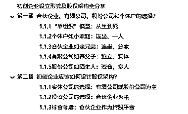
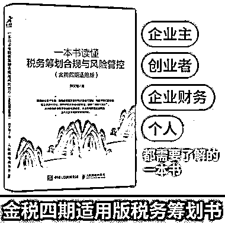
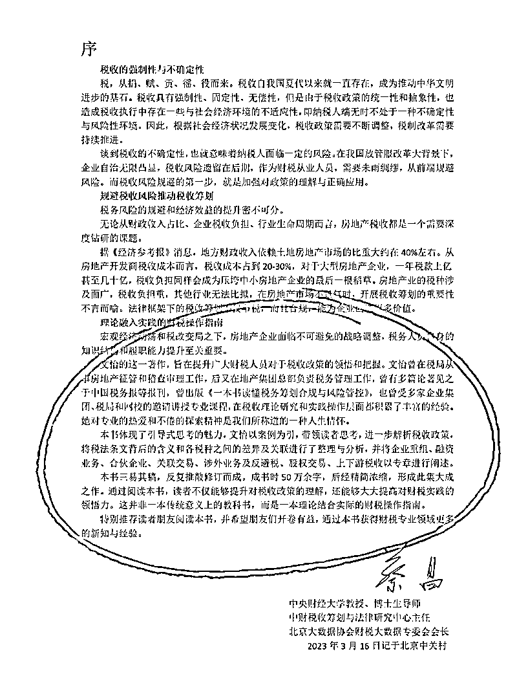

# 初创企业设立形式及股权架构全分享

> 原文：[`www.yuque.com/for_lazy/thfiu8/ldnqvmhnvz27xczz`](https://www.yuque.com/for_lazy/thfiu8/ldnqvmhnvz27xczz)

<ne-h2 id="4ca54aac" data-lake-id="4ca54aac"><ne-heading-ext><ne-heading-anchor></ne-heading-anchor><ne-heading-fold></ne-heading-fold></ne-heading-ext><ne-heading-content><ne-text id="uf3769d55">(精华帖)(98 赞)初创企业设立形式及股权架构全分享</ne-text></ne-heading-content></ne-h2> <ne-p id="u7b8d2da9" data-lake-id="u7b8d2da9"><ne-text id="u467681ee">作者： 红泥小酒杯</ne-text></ne-p> <ne-p id="u325ea162" data-lake-id="u325ea162"><ne-text id="u8b1f68bd">日期：2023-08-11</ne-text></ne-p> <ne-p id="ueae9f132" data-lake-id="ueae9f132"><ne-text id="ub4639bde">初创企业设立形式及股权架构全分享 ————架构没搭对，利润全交税</ne-text></ne-p> <ne-p id="u36b57e05" data-lake-id="u36b57e05"><ne-text id="u5ecce2f3">上次分享完《从 18 线贫困县学生逆袭成为年薪百万的清华卷王 ———— 人人都能学的卷王“大法“》之后，收到了许多生财小伙伴的正反馈，于是和闫君商量还有什么能跟大家分享的，闫君说，写你擅长的领域吧，于是就有了这篇分享。</ne-text></ne-p> <ne-p id="u985129dd" data-lake-id="u985129dd"><ne-text id="u0a0f8c64">大家好，我是刘文怡。清华大学和美国常春藤工商管理双硕士，全国税务高端人才，常年为中税协、东奥、四川/西藏/宁波/安徽等税务局、四川师范大学/西南交通大学/西南财经大学、多家世界 500 强授课。原税务局公务员，后任多家世界 500 强集团税务总监，节税上百亿，现任全国排名前四的 5A 级税务师事务所合伙人，有税务局征管稽查和企业税务管理双重经验。</ne-text></ne-p> <ne-p id="u3226d606" data-lake-id="u3226d606"><ne-text id="u5f2c41f0">生财的各位老板应该也会考虑设立公司，对于有创业愿望的老板们来说，公司设立可能是必然选择，但区分有限公司、合伙企业、个体户、股份公司在税务方面的差别并不容易，稍有不慎就架构没搭对，利润全交税。</ne-text></ne-p> <ne-p id="u3d668df8" data-lake-id="u3d668df8"><ne-text id="uaacc5933">我曾经在清华和北大都讲过初创企业股权架构，此次分享改编自我在人民邮电出版社出版的《一本书读懂税务税务筹划合规与风险管控（金税四期适用版）》中的内容。旨在为大家扫清创业路上的第一个障碍。无论你是财务大拿还是初入创业，都将受益于这次分享。</ne-text></ne-p> <ne-p id="u2ae83dcd" data-lake-id="u2ae83dcd"><ne-text id="uab06f738">全文分为两部分，一是只设立一个主体时的选择，二是设立多个主体的选择。</ne-text></ne-p> <ne-p id="u1be049cc" data-lake-id="u1be049cc"><ne-text id="ud5ae284c">我会用一个蛋糕店案例和多首打油诗总结每种情况的差异，力求通俗易懂，有趣不迷茫，希望对大家有用。</ne-text></ne-p> <ne-p id="u878aabc4" data-lake-id="u878aabc4">[<ne-text id="u04a9bdf3">https://kdocs.cn/l/cvBfeemTjOfy</ne-text>](https://kdocs.cn/l/cvBfeemTjOfy)[<ne-text id="u6914120c">https://wugz3cl7dd.feishu.cn/docx/V5JpdhySsoIJirxcw4DcKkOInhg</ne-text>](https://wugz3cl7dd.feishu.cn/docx/V5JpdhySsoIJirxcw4DcKkOInhg)<ne-card data-card-name="image" data-card-type="inline" id="lXCYF" data-event-boundary="card"></ne-card></ne-p> <ne-p id="u34d4f136" data-lake-id="u34d4f136"><ne-card data-card-name="image" data-card-type="inline" id="tYryc" data-event-boundary="card"></ne-card></ne-p> <ne-p id="u0e93c631" data-lake-id="u0e93c631"><ne-card data-card-name="image" data-card-type="inline" id="b3C2H" data-event-boundary="card"></ne-card></ne-p> <ne-hole id="ub7d4d0a6" data-lake-id="ub7d4d0a6"><ne-card data-card-name="hr" data-card-type="block" id="a4JV0" data-event-boundary="card"><ne-p id="u738078f9" data-lake-id="u738078f9"><ne-text id="u88c8b5d5">评论区：</ne-text></ne-p> <ne-p id="uc8ec122e" data-lake-id="uc8ec122e"><ne-text id="u50d1d018">闫君 : 越分享越幸运[胜利]非常棒的股权架构避税指南，对于想创业和正在创业的老板都非常有帮助，感谢文怡的真诚分享。</ne-text> <ne-text id="u6b62733d">红泥小酒杯 : 谢谢！</ne-text> <ne-text id="u05406088">马时珍 : 棒👍🏻</ne-text> <ne-text id="u2187cf9d">书豪 : 棒</ne-text> <ne-text id="u931083ee">铃铛 : 很清晰明了</ne-text> <ne-text id="uf9055460">Aimmon : 已购</ne-text> <ne-text id="u4557ae29">芷蓝 : 现在 1 人公司越来越多了</ne-text> <ne-text id="uff75d52c">生财小苗哥 : 合伙人，选择太难，股权不清楚，后期扯皮太多！收藏反复看！</ne-text></ne-p> <ne-p id="uff87cd07" data-lake-id="uff87cd07"><ne-card data-card-name="image" data-card-type="inline" id="lCXDJ" data-event-boundary="card">  <ne-hole id="u7f54b278" data-lake-id="u7f54b278"><ne-card data-card-name="hr" data-card-type="block" id="UiedO" data-event-boundary="card"></ne-card></ne-hole></ne-card></ne-p></ne-card></ne-hole>