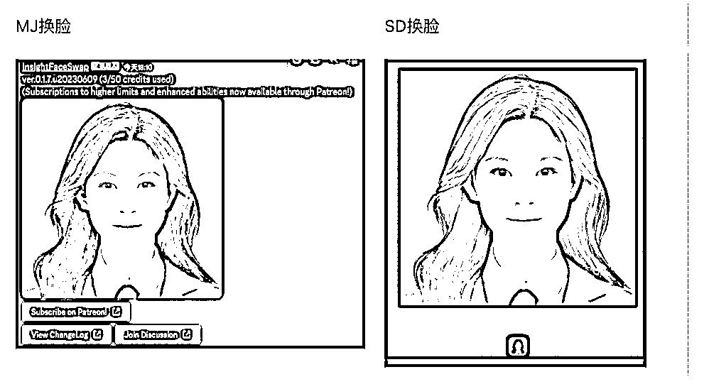

# MJ、SD 以及 lora 的换脸教程整合版

> 原文：[`www.yuque.com/for_lazy/thfiu8/ksngfbhg0i90byq6`](https://www.yuque.com/for_lazy/thfiu8/ksngfbhg0i90byq6)

<ne-h2 id="ab72acd0" data-lake-id="ab72acd0"><ne-heading-ext><ne-heading-anchor></ne-heading-anchor><ne-heading-fold></ne-heading-fold></ne-heading-ext><ne-heading-content><ne-text id="u1bab2a98">(58 赞)MJ、SD 以及 lora 的换脸教程整合版</ne-text></ne-heading-content></ne-h2> <ne-p id="u6f610392" data-lake-id="u6f610392"><ne-text id="uae881540">作者： 萧川川川</ne-text></ne-p> <ne-p id="u2e3db7dc" data-lake-id="u2e3db7dc"><ne-text id="u44662b8c">日期：2023-08-07</ne-text></ne-p> <ne-p id="u78c0d2e2" data-lake-id="u78c0d2e2"><ne-text id="u32a05442">写真自由！终于实现用 lora 换脸啦～MJ、SD 以及 lora 的换脸教程整合版</ne-text></ne-p> <ne-p id="u58210658" data-lake-id="u58210658"><ne-text id="uaa9848a7">MJ 和 SD 的换脸我都用过，体验上是 SD 的局部重绘相似度会更高一点。但是从普通人做证件照的角度，还远远不够，我就直接给自己练了 lora 进行换脸，还蛮像的，感觉可以成为手动秒鸭相机了。</ne-text></ne-p> <ne-p id="u51a2a559" data-lake-id="u51a2a559"><ne-text id="u11af8bf9">这里把用 MJ、SD 和 lora 炼丹换脸的教程全部整合到一起了，如果想看炼丹直接到第四部分。</ne-text></ne-p> <ne-p id="ub401a420" data-lake-id="ub401a420"><ne-text id="u9b286753">强调一下，我是 mac 电脑，SD 和炼丹都是在云端完成的，mac 用户友好版。</ne-text> <ne-text id="uee9fa556">一、图片准备</ne-text> <ne-text id="u1a89a43c">需要一张表情自然的正面照，可以参考下面吴彦祖、安妮的。</ne-text> <ne-text id="u6babf63f">如果是想要换自己的脸，可以根据这几条去拍摄：</ne-text> <ne-text id="ua2f7ee68">1、正脸照，光线好</ne-text> <ne-text id="udd7cbddd">2、五官清晰</ne-text> <ne-text id="ub5ba9fab">3、微笑（表情尽量和要换脸的照片保持一致）</ne-text> <ne-text id="ub1053bae">4、可以在美图秀秀里稍微美颜一下，加强优化下眉毛、眼睛和皮肤（mj 里是不改肤色的 t_t）</ne-text></ne-p> <ne-p id="u12d5fad9" data-lake-id="u12d5fad9"><ne-text id="u138c25f7">二、MJ 换脸教程</ne-text> <ne-text id="u7a9358ee">（全文看飞书链接）</ne-text></ne-p> <ne-p id="u5e7570e6" data-lake-id="u5e7570e6"><ne-text id="ud8570fa0">三、SD 换脸教程-roop 插件</ne-text> <ne-text id="u278ae71d">这里用的是 sd 中的 roop 插件换脸 ，我是 mac 电脑，所以只能用云端部署。但是查了一下 roop 云端部署也比较费劲，我直接在镜像中选择了一个有 roop 插件的。</ne-text> <ne-text id="udcb375d4">选择的平台是 autoDL：</ne-text> <ne-text id="uc23db947">流程：注册>>租用新实例>>选内蒙 A 区+A40（之前试过太低的配置，roop 带不起来）>>选一个带 roop 的镜像>>创建成功>>跑 python 文件>> 成功后打开 SD</ne-text></ne-p> <ne-p id="ucc4325c4" data-lake-id="ucc4325c4"><ne-text id="u5e06761f">四、lora 的安装与使用</ne-text> <ne-text id="u76e845a7">因为头疼配置，直接选择青椒云，然后在选择朱尼酱大佬直接打包好的镜像。</ne-text> <ne-text id="uaf4ce4c2">青椒云链接：</ne-text> <ne-text id="u688c0a4c">1、素材准备</ne-text> <ne-text id="u5ab19e82">这里需要强调一下，训练集非常非常重要！</ne-text> <ne-text id="u31c11d1d">这是模型的学习材料，直接关系你的 lora 能不能成功，泛化性好不好。</ne-text> <ne-text id="ua66d04c4">1）照片准备</ne-text> <ne-text id="u2775b79d">a、20-30 张；</ne-text> <ne-text id="u819faa0e">b、高清晰度；</ne-text> <ne-text id="u5ab82c48">c、多角度(尽量不要重复）</ne-text> <ne-text id="u8925848e">中景、近景、远景；上下左右，更多更充分、更丰富的数据；</ne-text> <ne-text id="u7b6506b4">d、背景、妆容、服装尽量简单：</ne-text> <ne-text id="u3d9bd880">我第一次用了出去玩的写真，练了 4 个多小时都没出来；</ne-text> <ne-text id="u73b1b3b3">e、瑕疵处理：</ne-text> <ne-text id="uc62d2a02">有些比较明显的瑕疵且不想输入给模型的，比如肤色太暗、痘痘啥的可以微 p。</ne-text> <ne-text id="u89a08e0c">但是不要美颜过度，会影响模型效果。</ne-text></ne-p> <ne-p id="u4b18bb7d" data-lake-id="u4b18bb7d"><ne-text id="u01c0cd3e">2）tag 打标</ne-text> <ne-text id="u3b40bf35">正确的、丰富的 tag 非常重要，把你的特征转成文字、数据并正确学习的重要一步！</ne-text></ne-p> <ne-p id="u26e822d6" data-lake-id="u26e822d6"><ne-text id="u281c17e0">可以按照这个模板进行打标：</ne-text> <ne-text id="u7fc13629">主题（人物 1boy1girl、触发词）；</ne-text> <ne-text id="udd869fc8">主要的人物特征（发色）；</ne-text> <ne-text id="ua4a9c5db">动作、视角、光影效果、其他。</ne-text> <ne-text id="u590ce42f">另外，想要保留的特征就不要放到 tag 里，比如你希望发色永远不变，是你自带的一个特征，就不需要标注。</ne-text></ne-p> <ne-p id="uebfcaf0b" data-lake-id="uebfcaf0b"><ne-text id="u43add6be">Tag 检验：原 tag 生成图片的时候越像 tag 打得越好。</ne-text></ne-p> <ne-p id="u6d2cf7e8" data-lake-id="u6d2cf7e8"><ne-text id="u290f87bc">教程图比较多，为了阅读体验，还是看飞书文档吧</ne-text>[<ne-text id="u1c718bf0">https://njmseq3llu.feishu.cn/wiki/KxYyw0xQaiBtZKkQDNtcFDvKnQf?from=from_copylink</ne-text>](https://njmseq3llu.feishu.cn/wiki/KxYyw0xQaiBtZKkQDNtcFDvKnQf?from=from_copylink)[<ne-text id="u0007cfe9">https://www.autodl.com/console/instance/list</ne-text>](https://www.autodl.com/console/instance/list)[<ne-text id="u55574df7">https://www.qingjiaocloud.com/</ne-text>](https://www.qingjiaocloud.com/)[<ne-text id="ub16d6666">https://njmseq3llu.feishu.cn/wiki/KxYyw0xQaiBtZKkQDNtcFDvKnQf?from=from_copylink</ne-text>](https://njmseq3llu.feishu.cn/wiki/KxYyw0xQaiBtZKkQDNtcFDvKnQf?from=from_copylink)<ne-card data-card-name="image" data-card-type="inline" id="LJ4YE" data-event-boundary="card">  <ne-p id="u2538e37f" data-lake-id="u2538e37f"><ne-card data-card-name="image" data-card-type="inline" id="ug7iC" data-event-boundary="card"></ne-card></ne-p> <ne-p id="u6a503261" data-lake-id="u6a503261"><ne-card data-card-name="image" data-card-type="inline" id="dR6I1" data-event-boundary="card">  <ne-hole id="u02066594" data-lake-id="u02066594"><ne-card data-card-name="hr" data-card-type="block" id="Ap5Av" data-event-boundary="card"><ne-p id="u6f6eec7c" data-lake-id="u6f6eec7c"><ne-text id="uccca2014">评论区：</ne-text></ne-p> <ne-p id="uce66f557" data-lake-id="uce66f557"><ne-text id="u42546c05">萧川川川 : 萌新第一次发文，还请生财的老师、前辈们多多指导~</ne-text> <ne-text id="u5287905f">小哈 : 太强了👍</ne-text> <ne-text id="uafeaa8ea">萧川川川 : 目前实现层面我已经跑通，如果在商业化上有相关需求的大佬，求链接啦～（只知实现但不懂变现的前大厂产品经理[捂脸]</ne-text> <ne-text id="ue34270a6">大炜 : 链接，有产品变现</ne-text> <ne-text id="u840ef011">萧川川川 : 您的知识号是微信吗，我加您了～</ne-text></ne-p> <ne-p id="u6f5be141" data-lake-id="u6f5be141"><ne-card data-card-name="image" data-card-type="inline" id="g2EmL" data-event-boundary="card">  <ne-hole id="u7c8d4716" data-lake-id="u7c8d4716"><ne-card data-card-name="hr" data-card-type="block" id="VlUCS" data-event-boundary="card"></ne-card></ne-hole></ne-card></ne-p></ne-card></ne-hole></ne-card></ne-p></ne-card></ne-p>