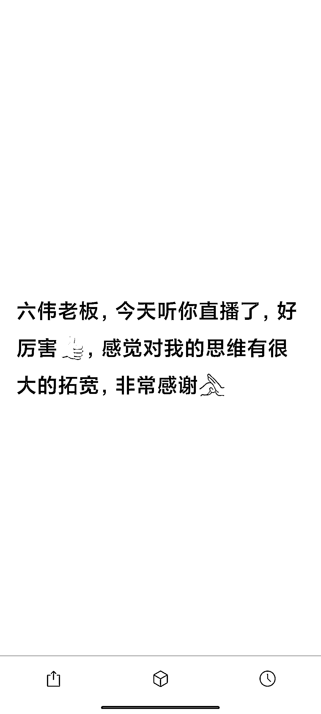

# 2 万一套的指令，调教的全过程

> 原文：[`www.yuque.com/for_lazy/thfiu8/cn8hykaeeafnbssr`](https://www.yuque.com/for_lazy/thfiu8/cn8hykaeeafnbssr)

<ne-h2 id="fdc66f8e" data-lake-id="fdc66f8e"><ne-heading-ext><ne-heading-anchor></ne-heading-anchor><ne-heading-fold></ne-heading-fold></ne-heading-ext><ne-heading-content><ne-text id="u0a1a11a3">(123 赞)2 万一套的指令，调教的全过程</ne-text></ne-heading-content></ne-h2> <ne-p id="u73955a8c" data-lake-id="u73955a8c"><ne-text id="u2ba05a10">作者： 袁六伟</ne-text></ne-p> <ne-p id="u56a9ff4a" data-lake-id="u56a9ff4a"><ne-text id="u98d3b9c1">日期：2023-08-08</ne-text></ne-p> <ne-p id="ue3a229d2" data-lake-id="ue3a229d2"><ne-text id="u17e7b653">2 万一套的指令，调教的全过程</ne-text></ne-p> <ne-p id="u8ef1b39f" data-lake-id="u8ef1b39f"><ne-text id="u4763143b">大家好呀，我是六伟，2 万+学员的阅读教练、得到领读人、月入 10 万+的指令工程师。</ne-text></ne-p> <ne-p id="u39488d06" data-lake-id="u39488d06"><ne-text id="u8db81e45">在 7 月 20 日，在星球的第一次分享，就很受大家欢迎，被亦仁老师加精华。</ne-text></ne-p> <ne-p id="u571c6fb7" data-lake-id="u571c6fb7"><ne-text id="ucfbff90c">错过的同学请戳链接《》</ne-text></ne-p> <ne-p id="ub2a88811" data-lake-id="ub2a88811"><ne-text id="u42e7e0b2">8 月 2 日在生财有术邀请下，给大家做了一场直播，在直播结束前，有相当多的老师和同学们期待我出一个更实操的调教方法论分享。</ne-text></ne-p> <ne-p id="u0ce5e3a1" data-lake-id="u0ce5e3a1"><ne-text id="u4f4ce516">今天，为你详细分享一个指令工程师接指令定制商单的完整过程，这也是我新书的部分内容。</ne-text></ne-p> <ne-p id="u7c512fd8" data-lake-id="u7c512fd8"><ne-text id="u8a0f0c0c">一 服务过程</ne-text></ne-p> <ne-p id="u915f109d" data-lake-id="u915f109d"><ne-text id="ub4af339f">1 前期沟通</ne-text> <ne-text id="u167ce488">2 调教过程</ne-text> <ne-text id="u04c1b3c8">3 调教案例</ne-text></ne-p> <ne-p id="ua1cf2176" data-lake-id="ua1cf2176"><ne-text id="u4dc058fa">二 背后原理</ne-text></ne-p> <ne-p id="u024e21cb" data-lake-id="u024e21cb"><ne-text id="u5f0e2f9f">1 元指令:CHAT 模型</ne-text> <ne-text id="u50dd9974">2 每步的手把手操作步骤</ne-text> <ne-text id="u03d67d3b">3 小白学习指令的步骤</ne-text></ne-p> <ne-p id="u2185ff48" data-lake-id="u2185ff48"><ne-text id="ud42c9751">三 高质量指令调教的 Seeder 模型</ne-text></ne-p> <ne-p id="uf8a12f29" data-lake-id="uf8a12f29"><ne-text id="u91a784ab">详情大家戳飞书链接</ne-text> [<ne-text id="ubec736db">https://t.zsxq.com/10nWdw0C1</ne-text>](https://t.zsxq.com/10nWdw0C1)[<ne-text id="ub66496fa">https://fl2dhgx3i3.feishu.cn/docx/IpjydwIVwoC5xcxbUcoc90gcnlc</ne-text>](https://fl2dhgx3i3.feishu.cn/docx/IpjydwIVwoC5xcxbUcoc90gcnlc)<ne-card data-card-name="image" data-card-type="inline" id="CBtBp" data-event-boundary="card"></ne-card></ne-p> <ne-p id="u9c930cf2" data-lake-id="u9c930cf2"><ne-card data-card-name="image" data-card-type="inline" id="jLikp" data-event-boundary="card"></ne-card></ne-p> <ne-p id="u73f07d22" data-lake-id="u73f07d22"><ne-card data-card-name="image" data-card-type="inline" id="uQZa7" data-event-boundary="card"></ne-card></ne-p> <ne-p id="uc1e9f601" data-lake-id="uc1e9f601"><ne-card data-card-name="image" data-card-type="inline" id="MSIJr" data-event-boundary="card"></ne-card></ne-p> <ne-hole id="ucc2f1681" data-lake-id="ucc2f1681"><ne-card data-card-name="hr" data-card-type="block" id="dTIvx" data-event-boundary="card"><ne-p id="ue2eb9b2d" data-lake-id="ue2eb9b2d"><ne-text id="u67c5f5a3">评论区：</ne-text></ne-p> <ne-p id="u5bbd43d9" data-lake-id="u5bbd43d9"><ne-text id="u60ed0c72">AI 同行侠-文卓 : 需求明确，才会有最终的提示词评估标准，才能对交付的定制提示词进行评估。需求不明确，最后定制的提示词有可能南辕北辙，中间浪费很多沟通时间。所以想要定制提示词的朋友一定要把自己的需求想明白，想透彻，分点列出，不要做无用功。</ne-text> <ne-text id="u91511fd1">袁六伟 : 需求明确且有付费能力的神仙客户，可遇不可求，但是绝大多数客户都是不明确需求，且表达不清楚需求的，所以商务沟通很费力，我也就成立了指令 MCN 业务</ne-text> <ne-text id="u0f214654">胖大魔 : 六伟大佬，亦仁老板那儿大单！！！</ne-text> <ne-text id="u934d15e8">杨梅 : 对，大部分人都是不明确需求且表达不出来的，我就是哈哈</ne-text></ne-p> <ne-p id="uda8d19bc" data-lake-id="uda8d19bc"><ne-card data-card-name="image" data-card-type="inline" id="gfeVE" data-event-boundary="card"></ne-card></ne-p> <ne-hole id="u5a1d0019" data-lake-id="u5a1d0019"><ne-card data-card-name="hr" data-card-type="block" id="a8Yhf" data-event-boundary="card"></ne-card></ne-hole></ne-card></ne-hole>