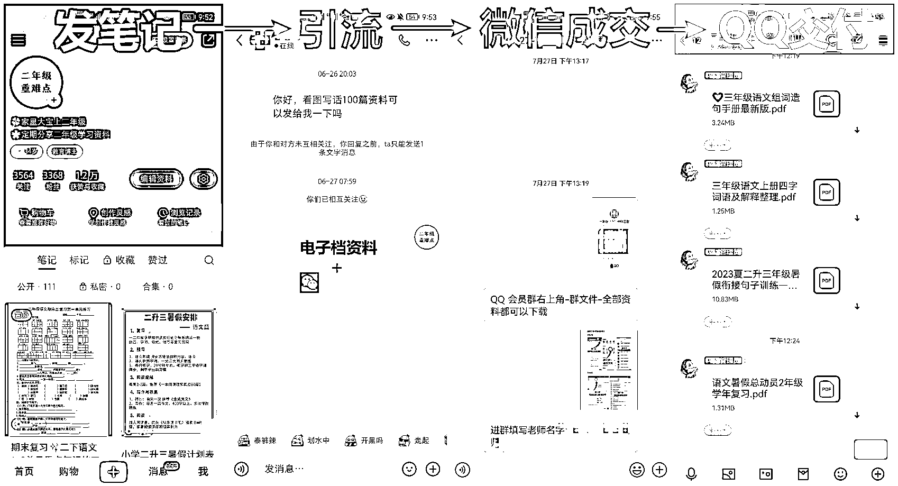

# 小红书虚拟资料项目，月入 2w+的实操复盘

> 原文：[`www.yuque.com/for_lazy/thfiu8/afk01l14hn0h7nok`](https://www.yuque.com/for_lazy/thfiu8/afk01l14hn0h7nok)

<ne-h2 id="a7afdbec" data-lake-id="a7afdbec"><ne-heading-ext><ne-heading-anchor></ne-heading-anchor><ne-heading-fold></ne-heading-fold></ne-heading-ext><ne-heading-content><ne-text id="ubccc14e5">(151 赞)小红书虚拟资料项目，月入 2w+的实操复盘</ne-text></ne-heading-content></ne-h2> <ne-p id="ubf00b398" data-lake-id="ubf00b398"><ne-text id="u0fcc3d71">作者： 希平</ne-text></ne-p> <ne-p id="ub3d63774" data-lake-id="ub3d63774"><ne-text id="u65dc6708">日期：2023-08-08</ne-text></ne-p> <ne-p id="u0ac56acb" data-lake-id="u0ac56acb"><ne-text id="u1977ffcd">实操复盘：小红书虚拟资料项目，月入 2w+（业务闭环篇）</ne-text></ne-p> <ne-p id="u67ae5f01" data-lake-id="u67ae5f01"><ne-text id="ubf463fed">各位圈友好，我是希平，一名轻创业者，专注互联网可复制的项目，目前在收集年赚 100w 的优质项目，有相关项目的圈友请多多推荐哈~</ne-text></ne-p> <ne-p id="u2b5678bb" data-lake-id="u2b5678bb"><ne-text id="uaff921ff">对于小红书虚拟资料项目，先说收益，我是今年一月初开始做，到现在足足有半年了，一共赚了 12w+，算起来每个月收入 2w+（要分部分出去），从一月到四月都在做各种测试去积累经验，以至于在六月份的旺季，单月收入 7w+.</ne-text></ne-p> <ne-p id="ued866c92" data-lake-id="ued866c92"><ne-text id="u003e9a77">这个项目的操作特别简单，就是在小红书发布小学虚拟资料的图文笔记，吸引家长或老师关注，然后引流到微信成交，最后在 QQ 群或百度网盘做交付。因为它足够简单，变现反馈快，特别适合教培从业者、宝妈，以及第一次尝试做副业的人。</ne-text></ne-p> <ne-p id="u010509c6" data-lake-id="u010509c6"><ne-text id="u1a4b39ae">复盘主要分为两篇，</ne-text> <ne-text id="u49fac8e1">第一篇是业务闭环篇，也就是卖出 1 单；</ne-text> <ne-text id="u4b8a7d1c">第二篇是业务扩量篇，也就是卖出 N 单，链接：</ne-text></ne-p> <ne-p id="udf5d3b9d" data-lake-id="udf5d3b9d"><ne-text id="u6ede2ccb">本文为第一篇为业务闭环篇，目录：</ne-text> <ne-text id="ud697caa9">一、准备阶段</ne-text> <ne-text id="u986414da">二、养号阶段</ne-text> <ne-text id="u1894fcac">三、流量获取</ne-text> <ne-text id="u54b29cba">四、引流</ne-text> <ne-text id="ucf612e10">五、微信成交</ne-text> <ne-text id="u986a66d6">六、疑难解答 QA</ne-text></ne-p> <ne-p id="ub400a4cf" data-lake-id="ub400a4cf"><ne-text id="ud34f493a">详情移步飞书链接，电脑观感更佳：</ne-text>[<ne-text id="u0b92ea1d">https://t.zsxq.com/11CJuz6Jc</ne-text>](https://t.zsxq.com/11CJuz6Jc)[<ne-text id="u5d0af4a3">https://www.yuque.com/maoxiaodd/operation/iiayl08s6gzyfvcm</ne-text>](https://www.yuque.com/maoxiaodd/operation/iiayl08s6gzyfvcm)<ne-card data-card-name="image" data-card-type="inline" id="jzy5L" data-event-boundary="card"></ne-card></ne-p> <ne-hole id="ud5c5abc1" data-lake-id="ud5c5abc1"><ne-card data-card-name="hr" data-card-type="block" id="CQRhJ" data-event-boundary="card"><ne-p id="u3beb08dd" data-lake-id="u3beb08dd"><ne-text id="ued995685">评论区：</ne-text></ne-p> <ne-p id="u1b78d2e4" data-lake-id="u1b78d2e4"><ne-text id="u36c22951">郑鹏鑫 : 这个项目能不能实现半自动化，效果会不会更好，引流到 【公众号单篇文章简介】 通过文章添加跳转小程序商城，然后实现商城支付操作，我是个外人，想到这一点了，不知道实际逻辑操作用户那边的顾虑</ne-text> <ne-text id="u95404361">风往 : 没想到在生财看到你</ne-text> <ne-text id="uc48d73e0">龙王 : 资料不会涉及到侵权问题吗，之前想过做学习资料的无货源，但看到不少侵权被诉的案例</ne-text> <ne-text id="u7cccd44b">希平 : 你是？</ne-text> <ne-text id="ub33bbf4a">希平 : 尽量做无版权的，不碰那些黄冈、王朝霞等资料</ne-text> <ne-text id="ubf9449d5">希平 : 宝妈私域用户很贵的[偷笑][偷笑][偷笑]</ne-text> <ne-text id="ube258134">雨烟 : 为什么要分一部分出去呢？</ne-text> <ne-text id="u3595298b">希平 : 下篇会讲到</ne-text></ne-p> <ne-p id="ub02af712" data-lake-id="ub02af712"><ne-card data-card-name="image" data-card-type="inline" id="UuHY2" data-event-boundary="card">  <ne-hole id="u6ad85ad6" data-lake-id="u6ad85ad6"><ne-card data-card-name="hr" data-card-type="block" id="GxpYW" data-event-boundary="card"></ne-card></ne-hole></ne-card></ne-p></ne-card></ne-hole>