# 新人如何做小红书店铺？卖聚拢内衣的店铺用低粉爆款法从 0 到 1 教程

> 原文：[`www.yuque.com/for_lazy/thfiu8/ckg6vmncf60n0mkl`](https://www.yuque.com/for_lazy/thfiu8/ckg6vmncf60n0mkl)

<ne-h2 id="56e46cec" data-lake-id="56e46cec"><ne-heading-ext><ne-heading-anchor></ne-heading-anchor><ne-heading-fold></ne-heading-fold></ne-heading-ext><ne-heading-content><ne-text id="ufc0f1f56">(89 赞)新人如何做小红书店铺？卖聚拢内衣的店铺用低粉爆款法从 0 到 1 教程</ne-text></ne-heading-content></ne-h2> <ne-p id="u634e761b" data-lake-id="u634e761b"><ne-text id="u0b9f35eb">作者： 书豪</ne-text></ne-p> <ne-p id="u4594420e" data-lake-id="u4594420e"><ne-text id="uef3acdf7">日期：2023-08-11</ne-text></ne-p> <ne-p id="ub87c9a59" data-lake-id="ub87c9a59"><ne-text id="ud08825ca" style="color: rgb(73, 73, 73);">各位朋友好，我是在杭州的圈友书豪，一个连续创业四年的 95 后，目前连续四年都年入百万。</ne-text></ne-p> <ne-p id="ucd921b53" data-lake-id="ucd921b53"><ne-text id="u80322046" ne-bold="true">从三月份到六月份，我们团队总计在运营 30 家小红书店铺，目前一个月利润在 20 万左右，平均下来我们单店铺单月的利润在 6000 元左右。今天以聚拢内衣店铺为例，给大家介绍一下低粉爆款选品法在小红书开店铺的全流程。</ne-text></ne-p> <ne-p id="uced6b359" data-lake-id="uced6b359"><ne-text id="u6aaa7e98">新人还是特别适合以小红书店铺切入电商的，不用自己囤货，对于新手也很友好，入门门槛低，操作上简单可直接上手。</ne-text></ne-p> <ne-p id="ue5ec441c" data-lake-id="ue5ec441c"><ne-text id="u0020f496">小红书属于一个种草平台，据我观察身边朋友日常刷小红书频率较高，日常有所需求，皆可查，堪称女生们的百度。小红书店铺当下属于红利期的中期，入场的人越来越多的当下，我们更应该注重方法的高效。</ne-text></ne-p> <ne-h3 id="261c3c57" data-lake-id="261c3c57"><ne-heading-ext><ne-heading-anchor></ne-heading-anchor><ne-heading-fold></ne-heading-fold></ne-heading-ext><ne-heading-content><ne-text id="uc75775cf">—、前期的账号活跃，简称养号</ne-text></ne-heading-content></ne-h3> <ne-p id="u5759909d" data-lake-id="u5759909d"><ne-text id="u533ce473">注册小红书账号过程，想好自己要开店的类别，通过这个类别在选择兴趣爱好时，选对应的推荐。开始模拟真实用户刷小红书，在小红书首页进行浏览，也可在搜索框直接搜索对应类别商品，点进笔记进行查看，反复操作几次，平台会更多的推荐给你相关的内容。此操作为给小红书养号，时间三天左右即可。</ne-text></ne-p> <ne-p id="u5f2ffe11" data-lake-id="u5f2ffe11"><ne-text id="u588da9a2">优化小红书个人首页</ne-text></ne-p> <ne-p id="u9ad9f6bd" data-lake-id="u9ad9f6bd"><ne-text id="ue8d477c4">名字，性别，头像，背景图，简介位置，这些信息主要体现在账号主页，最好有一定的美观度。</ne-text></ne-p> <ne-p id="ud09778de" data-lake-id="ud09778de"><ne-text id="u6ab6373f">名字可根据店铺类目的类别来，比如：XX 女装，XX 百货，XX 童装店等等；小红书主要女性用户多，头像，性别，背景图可直接选择女性风格；简介位置可参考相关类别店铺进行修改填写。</ne-text></ne-p> <ne-h1 id="c105ab55" data-lake-id="c105ab55"><ne-heading-ext><ne-heading-anchor></ne-heading-anchor><ne-heading-fold></ne-heading-fold></ne-heading-ext><ne-heading-content><ne-text id="uf68ac120">二、店铺的开通及后台流程操作</ne-text></ne-heading-content></ne-h1> <ne-p id="u6dab695f" data-lake-id="u6dab695f"><ne-text id="u0c517608">①店铺的开通</ne-text></ne-p> <ne-p id="u954bb54c" data-lake-id="u954bb54c"><ne-text id="u502092ab">打开我—左上角有三横点开—创作中心—更多服务—开通店铺—店铺类别建议选择个人店（只需缴纳 1000 元保证金，后期关店铺可退）—经营类目选择普通商品</ne-text></ne-p> <ne-p id="u567ce60b" data-lake-id="u567ce60b"><ne-card data-card-name="image" data-card-type="inline" id="PMezn" data-event-boundary="card"></ne-card></ne-p> <ne-p id="u8e320ccf" data-lake-id="u8e320ccf"><ne-card data-card-name="image" data-card-type="inline" id="ycKLy" data-event-boundary="card"></ne-card></ne-p> <ne-p id="u6e73c202" data-lake-id="u6e73c202"><ne-card data-card-name="image" data-card-type="inline" id="ndjR3" data-event-boundary="card">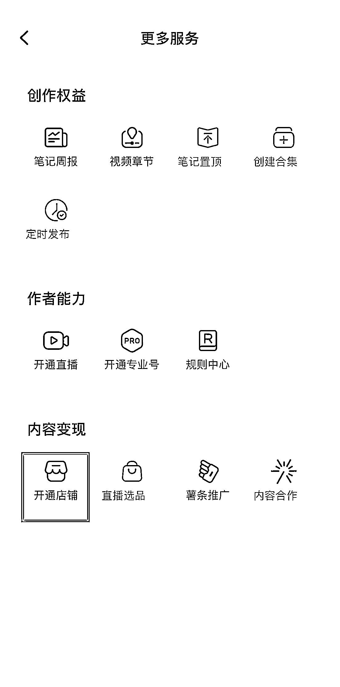</ne-card></ne-p> <ne-p id="ucf47bc3c" data-lake-id="ucf47bc3c"><ne-card data-card-name="image" data-card-type="inline" id="c9Wgu" data-event-boundary="card">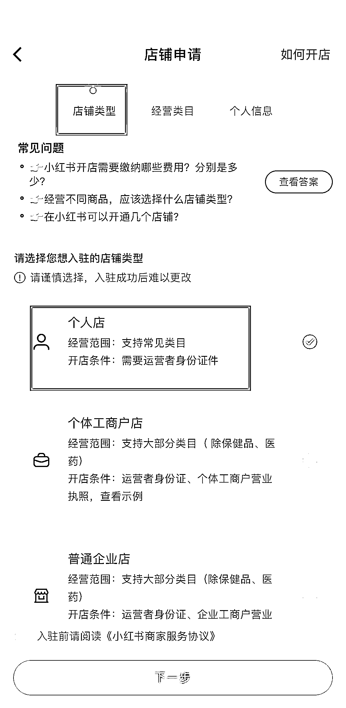</ne-card></ne-p> <ne-p id="u9c73bf75" data-lake-id="u9c73bf75"><ne-text id="uf417d01f">②后台的设置</ne-text></ne-p> <ne-p id="uf22ebfa2" data-lake-id="uf22ebfa2"><ne-text id="uc2a73caa">可采用网页版进行操作，网页版链接：</ne-text>[<ne-text id="u9c691f1b">https://customer.xiaohongshu.com/login?service=https://ark.xiaohongshu.com/</ne-text>](https://customer.xiaohongshu.com/login?service=https://ark.xiaohongshu.com)<ne-text id="ufd28cbf3">也可手机下载小红书商家版 APP 进行操作</ne-text></ne-p> <ne-p id="ud542dc07" data-lake-id="ud542dc07"><ne-text id="u2250a49b">这里截图网页版操作，店铺的基础信息，这三块位置根据显示的内容，将个人身份证，手机号等上传填写</ne-text></ne-p> <ne-p id="ub3df0c5d" data-lake-id="ub3df0c5d"><ne-card data-card-name="image" data-card-type="inline" id="BDSfc" data-event-boundary="card">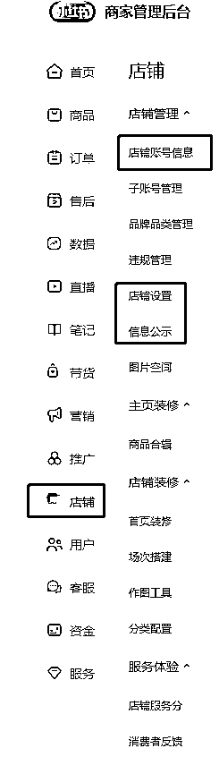</ne-card></ne-p> <ne-p id="uf20435de" data-lake-id="uf20435de"><ne-text id="uc6e44df2">资金—店铺保证金，这个位置需进行充值</ne-text></ne-p> <ne-p id="u7c924af9" data-lake-id="u7c924af9"><ne-card data-card-name="image" data-card-type="inline" id="NwvIF" data-event-boundary="card">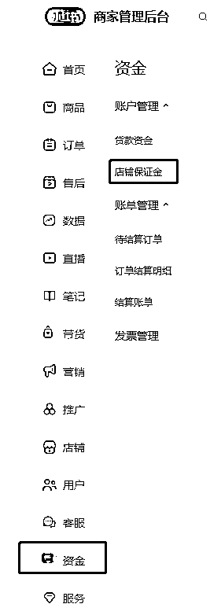</ne-card></ne-p> <ne-p id="u01bd83a1" data-lake-id="u01bd83a1"><ne-text id="uf6567fcf">涉及上品问题：可手动到商品—发布上品进行上传（将将所要上传的上品图文信息，根据货源信息保存电脑上传），也可使用服务—服务市场—蚂蚁搬家—授权登录进行上传，可用链接复制/店铺名称进行搜索，复制</ne-text></ne-p> <ne-p id="u9ee2a321" data-lake-id="u9ee2a321"><ne-card data-card-name="image" data-card-type="inline" id="x4Dv2" data-event-boundary="card"></ne-card></ne-p> <ne-p id="ud1380795" data-lake-id="ud1380795"><ne-card data-card-name="image" data-card-type="inline" id="fLNwX" data-event-boundary="card">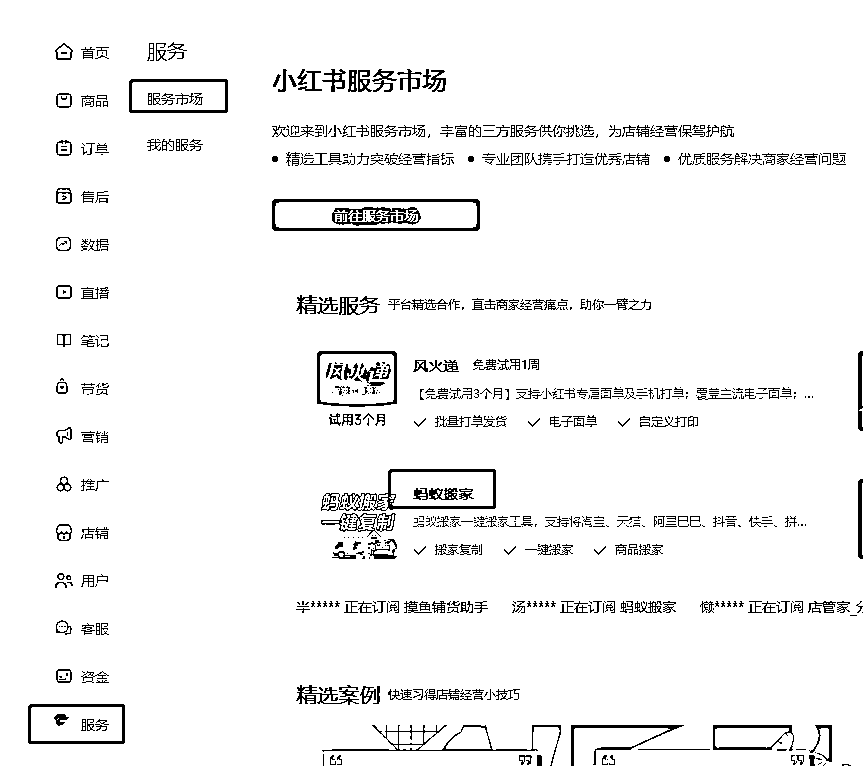</ne-card></ne-p> <ne-p id="u066a98be" data-lake-id="u066a98be"><ne-card data-card-name="image" data-card-type="inline" id="a2wt8" data-event-boundary="card">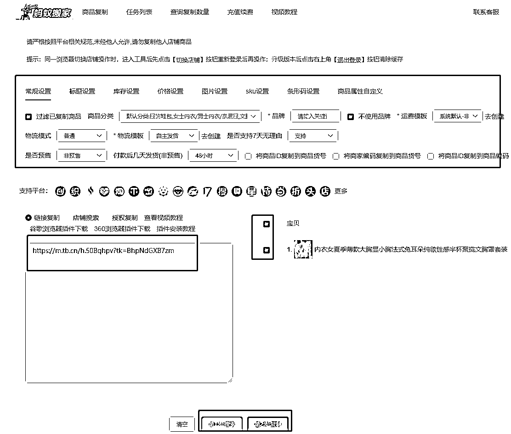</ne-card></ne-p> <ne-p id="u4d0b79b1" data-lake-id="u4d0b79b1"><ne-text id="u89dde746">复制后查看任务栏是否上传成功，若上传成功后部分内容还需进行浏览编辑后手动进行上架</ne-text></ne-p> <ne-p id="u0cfa1afc" data-lake-id="u0cfa1afc"><ne-card data-card-name="image" data-card-type="inline" id="z31LI" data-event-boundary="card"></ne-card></ne-p> <ne-p id="u7069d7da" data-lake-id="u7069d7da"><ne-text id="ub1ed0ea0">资金—货款资金—可将微信账户，支付宝账户进行开通，方便用户进行支付</ne-text></ne-p> <ne-p id="u2f97f582" data-lake-id="u2f97f582"><ne-card data-card-name="image" data-card-type="inline" id="J1FgY" data-event-boundary="card"></ne-card></ne-p> <ne-p id="u36df856e" data-lake-id="u36df856e"><ne-text id="u3d392914">售后—运费宝开通—开通运费宝可提高下单率，打消买家下单退货顾虑</ne-text></ne-p> <ne-p id="u20544b06" data-lake-id="u20544b06"><ne-card data-card-name="image" data-card-type="inline" id="QenvW" data-event-boundary="card">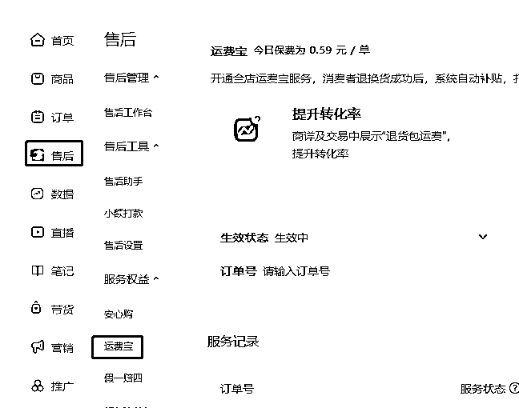</ne-card></ne-p> <ne-p id="ub9961225" data-lake-id="ub9961225"><ne-text id="u71913f1a">运费模板填写：订单—物流工具——发货地和退货地的填写，发货地可填写自己的，退货地可参考图中填写</ne-text></ne-p> <ne-p id="ud2901595" data-lake-id="ud2901595"><ne-card data-card-name="image" data-card-type="inline" id="qKJhk" data-event-boundary="card">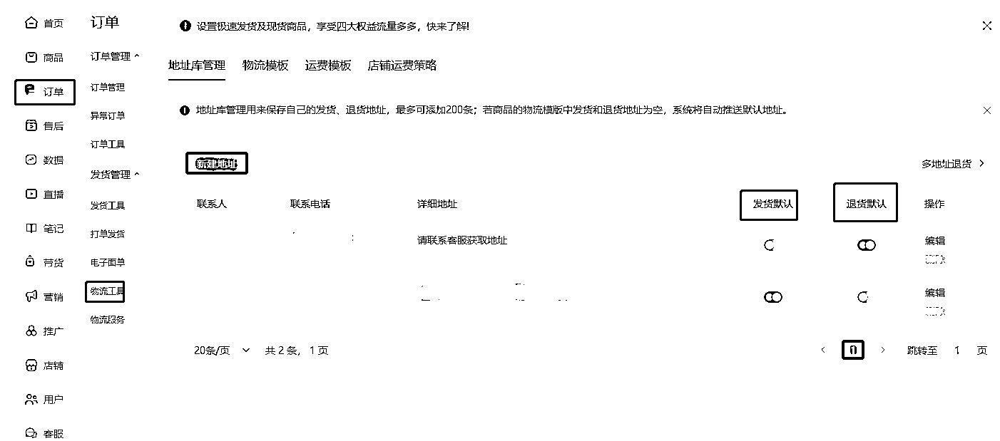</ne-card></ne-p> <ne-p id="ue0365826" data-lake-id="ue0365826"><ne-text id="ubc8ad0e7">拍单流程：如果是前期单量不多的情况下，可手动复制买家地址至货源店铺下单，就像平常我们自己网购一样；如果是单量多的情况可借助拍单软件进行下单，比如：逸淘</ne-text></ne-p> <ne-h1 id="9039450f" data-lake-id="9039450f"><ne-heading-ext><ne-heading-anchor></ne-heading-anchor><ne-heading-fold></ne-heading-fold></ne-heading-ext> <ne-heading-content></ne-heading-content></ne-h1> <ne-h1 id="1f711dc7" data-lake-id="1f711dc7"><ne-heading-ext><ne-heading-anchor></ne-heading-anchor><ne-heading-fold></ne-heading-fold></ne-heading-ext><ne-heading-content><ne-text id="ud966170a">三、如何选品及素材的获取</ne-text></ne-heading-content></ne-h1> <ne-p id="u6661b71f" data-lake-id="u6661b71f"><ne-text id="uef4a0695">选品这块围绕“低粉高赞”四个字。这里主要介绍四个无需借助软件新手可直接方便上手的平台选品方法：小红书、拼多多、淘宝、抖音。当然也可用相关软件进行选品，比如灰豚数据等。</ne-text></ne-p> <ne-p id="uc3a9a5b0" data-lake-id="uc3a9a5b0"><ne-text id="u1233f08f">①小红书：直接在首页—发现—搜索栏直接搜索，点开全部—最新/最热；筛选位置可选行视屏/图文，进行商品浏览，点进对应用户主页，查看是否符合低粉高赞标准。</ne-text></ne-p> <ne-p id="u0852e228" data-lake-id="u0852e228"><ne-card data-card-name="image" data-card-type="inline" id="B09tp" data-event-boundary="card">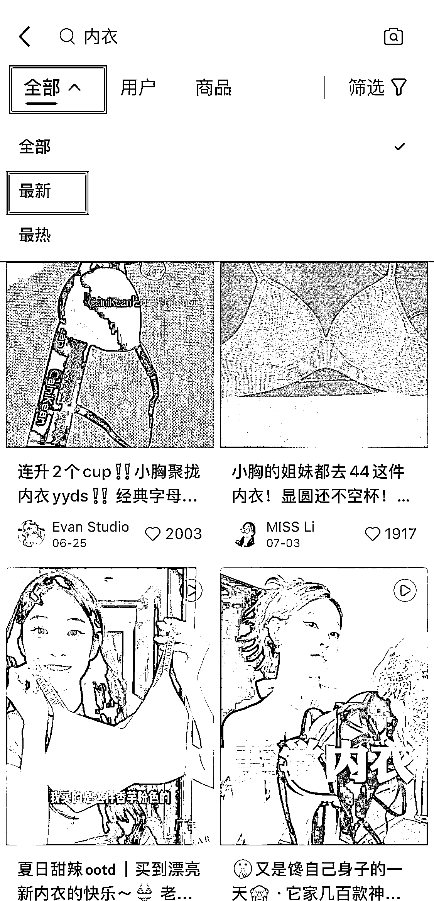</ne-card></ne-p> <ne-p id="u4088ad85" data-lake-id="u4088ad85"><ne-text id="u1ab5d24a" ne-bold="true">这里有个注意点：粉丝数低于 200；最近 7 天内的笔记有超过 100 点赞；点赞商品销量有超过 1000 单；符合这三个标准，可作为对标选品的账号。（聚拢内衣这个赛道是很卷的，粉丝越少，成交越多的可以作为爆款，100 单以上的销量可能是当然也可以）</ne-text></ne-p> <ne-p id="ub747e79f" data-lake-id="ub747e79f"><ne-text id="uaf806468">粉丝少，出单量多，同类别为什么其他的品没有销量，而出单这个品高销量？是说明这个品已经有经过市场验证的，是可以去跟的品。</ne-text></ne-p> <ne-p id="uaa210ce9" data-lake-id="uaa210ce9"><ne-text id="u9a0e894a">低粉高赞，为什么说销量 1000 更好呢？500，100 的销量能不能跟呢？这种销量不高的情况，我们也是可以自我判断的。这时候我们就可以查看该用户的笔记数，同时刷这个品的笔记停留观看，返回小红书页面，观察是否这个品类在小红书笔记是较少，但是其他平台抖音，淘宝，拼多多销量又不错的，这种时候也是可以直接跟品的。</ne-text></ne-p> <ne-p id="u39972f80" data-lake-id="u39972f80"><ne-text id="u5aa2f8af">我拿内衣进行举例，如下图。（发现该账号为写文稿前，符合低粉高赞）</ne-text></ne-p> <ne-p id="uf3d5d615" data-lake-id="uf3d5d615"><ne-card data-card-name="image" data-card-type="inline" id="RlxB4" data-event-boundary="card">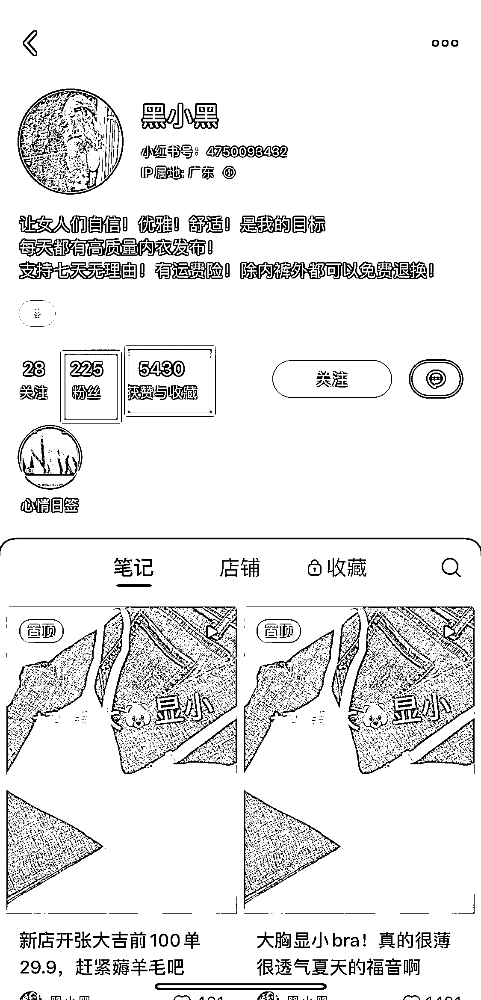</ne-card></ne-p> <ne-p id="u1c905e74" data-lake-id="u1c905e74"><ne-card data-card-name="image" data-card-type="inline" id="O3iHw" data-event-boundary="card">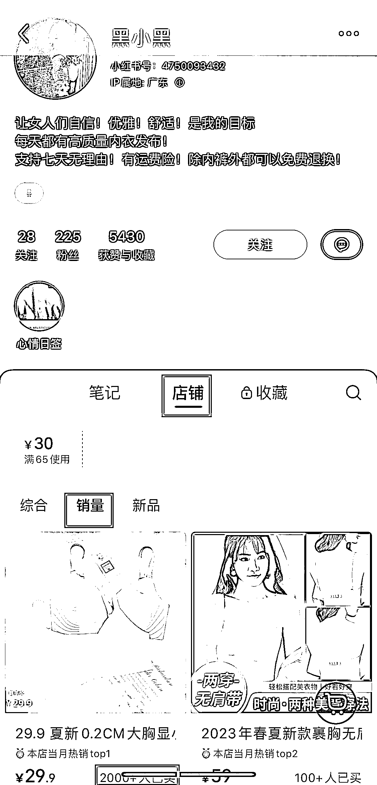</ne-card></ne-p> <ne-p id="u49419f8e" data-lake-id="u49419f8e"><ne-text id="u2ffead27">小红书另外一个选品方法：</ne-text></ne-p> <ne-p id="u088c23ed" data-lake-id="u088c23ed"><ne-text id="u47144467">购物—最顶上进行搜索—内衣，点击全部，对商品类别销量进行查看，这也是一个选品的路径</ne-text></ne-p> <ne-p id="u7999c420" data-lake-id="u7999c420"><ne-card data-card-name="image" data-card-type="inline" id="xCJSU" data-event-boundary="card">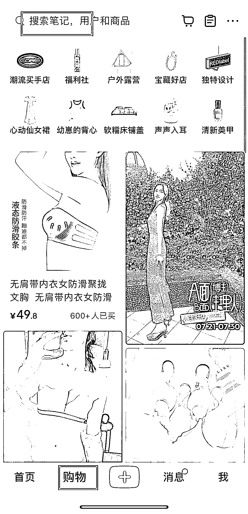</ne-card></ne-p> <ne-p id="u237c77d1" data-lake-id="u237c77d1"><ne-card data-card-name="image" data-card-type="inline" id="YY9Pq" data-event-boundary="card">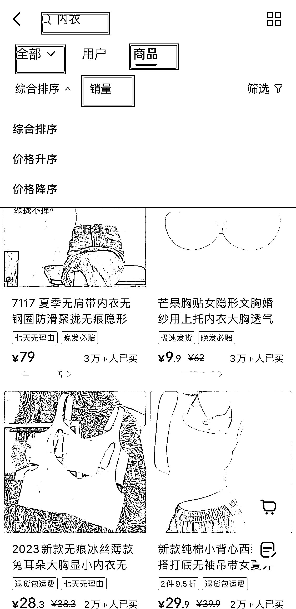</ne-card></ne-p> <ne-p id="u1219cccd" data-lake-id="u1219cccd"><ne-text id="u3182eed3">拼多多选品方法：</ne-text></ne-p> <ne-p id="uba4abf5e" data-lake-id="uba4abf5e"><ne-text id="u0cd782ce">点击首页进行类别选择—点击排行榜—查看最近热销的款式，可用保存/截图方式，储存图片，再到小红书浏览此商品，最近的销量进行考虑上品</ne-text></ne-p> <ne-p id="u10a892a1" data-lake-id="u10a892a1"><ne-card data-card-name="image" data-card-type="inline" id="AhhaV" data-event-boundary="card">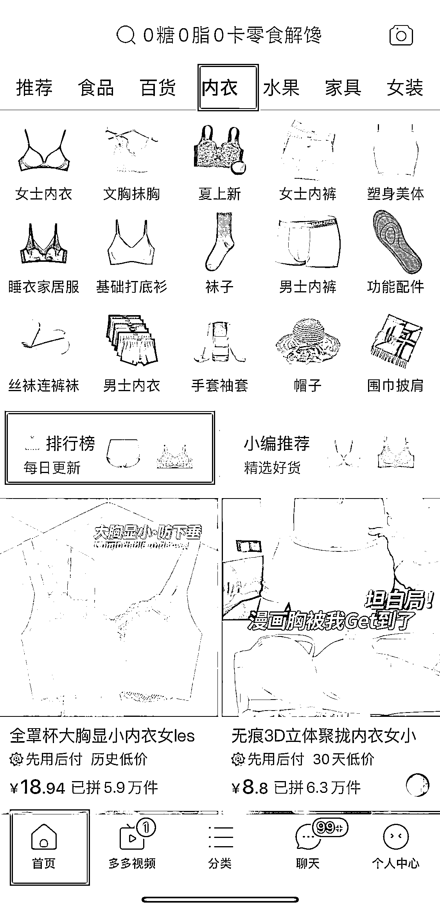</ne-card></ne-p> <ne-p id="u9fb11e34" data-lake-id="u9fb11e34"><ne-card data-card-name="image" data-card-type="inline" id="A56Gi" data-event-boundary="card"></ne-card></ne-p> <ne-p id="u444d1e21" data-lake-id="u444d1e21"><ne-text id="u5db7c13d">淘宝选品法：</ne-text></ne-p> <ne-p id="uc79384a1" data-lake-id="uc79384a1"><ne-text id="ua2bc9cd0">淘宝页面—分类—选到对应品类进行查询—点击全部—销量，即可查询最近销量较好的商品</ne-text></ne-p> <ne-p id="ue14c6027" data-lake-id="ue14c6027"><ne-card data-card-name="image" data-card-type="inline" id="WPtdW" data-event-boundary="card">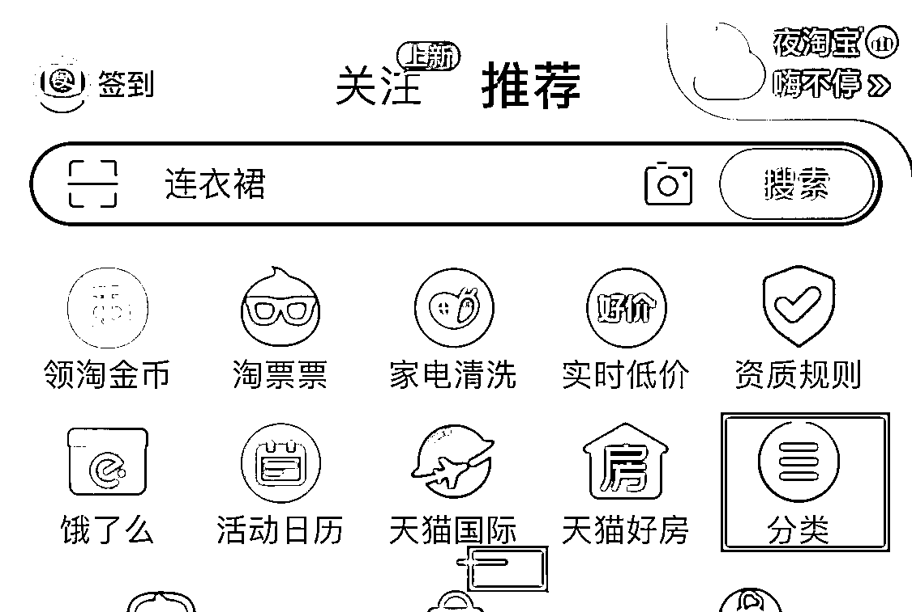</ne-card></ne-p> <ne-p id="u27c046ed" data-lake-id="u27c046ed"><ne-card data-card-name="image" data-card-type="inline" id="WE5IM" data-event-boundary="card">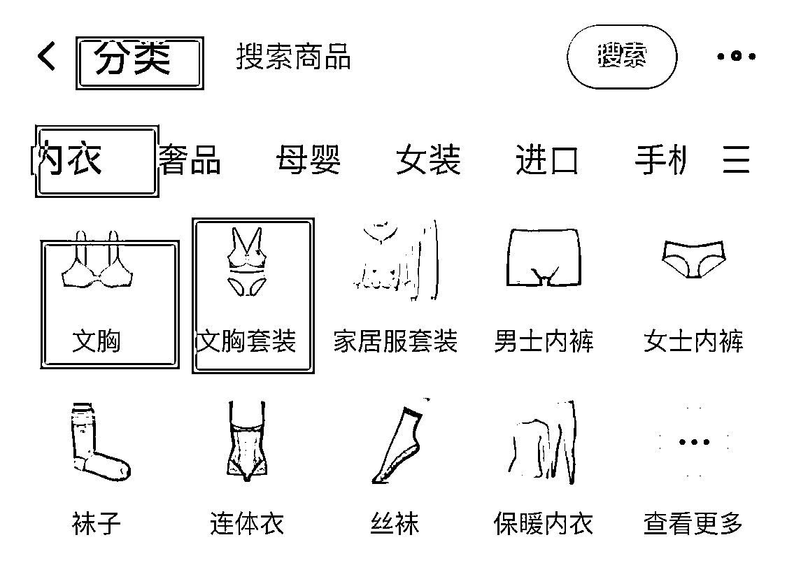</ne-card></ne-p> <ne-p id="u166b90a1" data-lake-id="u166b90a1"><ne-card data-card-name="image" data-card-type="inline" id="mUEDP" data-event-boundary="card"></ne-card></ne-p> <ne-p id="u8f494750" data-lake-id="u8f494750"><ne-text id="uba5e64ff">抖音选品法：</ne-text></ne-p> <ne-p id="ue205a5d3" data-lake-id="ue205a5d3"><ne-text id="uf7f81d87">点击首页—商城—搜索框进行搜索相关类目，点击全部—销量进行查看。</ne-text></ne-p> <ne-p id="u62ad5455" data-lake-id="u62ad5455"><ne-card data-card-name="image" data-card-type="inline" id="ff5NV" data-event-boundary="card"></ne-card></ne-p> <ne-p id="ube68db8c" data-lake-id="ube68db8c"><ne-card data-card-name="image" data-card-type="inline" id="mxzeo" data-event-boundary="card"></ne-card></ne-p> <ne-p id="ud98f387b" data-lake-id="ud98f387b"><ne-text id="ue0c88174">根据找到销量好的商品返回小红书进行一个验证，该款商品小红书上是否有人发布过，若有，点进用户主页根据上面的“低粉爆款”进行一个校验，符合即可跟品。</ne-text></ne-p> <ne-p id="u8cc4332f" data-lake-id="u8cc4332f"><ne-text id="uc1b5183d">以上的四种选品方法的过程，也是一个素材积累的过程，选定好品后，根据找到的商品，可进行以图找品的功能进行查看，可看到该商品的相关视屏图文，进行一个保存，即可有素材资料。</ne-text></ne-p> <ne-p id="ud2a87a6a" data-lake-id="ud2a87a6a"><ne-text id="ua2da8c75">这里介绍一个去重工具“轻抖”微信可直接搜索，将选定商品的相关视屏图文链接复制，粘贴到图二，点击一键去水印即可保存。</ne-text></ne-p> <ne-p id="u6b811893" data-lake-id="u6b811893"><ne-card data-card-name="image" data-card-type="inline" id="NjqNf" data-event-boundary="card">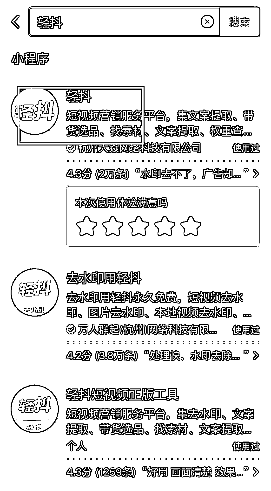</ne-card></ne-p> <ne-p id="uc8022875" data-lake-id="uc8022875"><ne-card data-card-name="image" data-card-type="inline" id="gwqjI" data-event-boundary="card">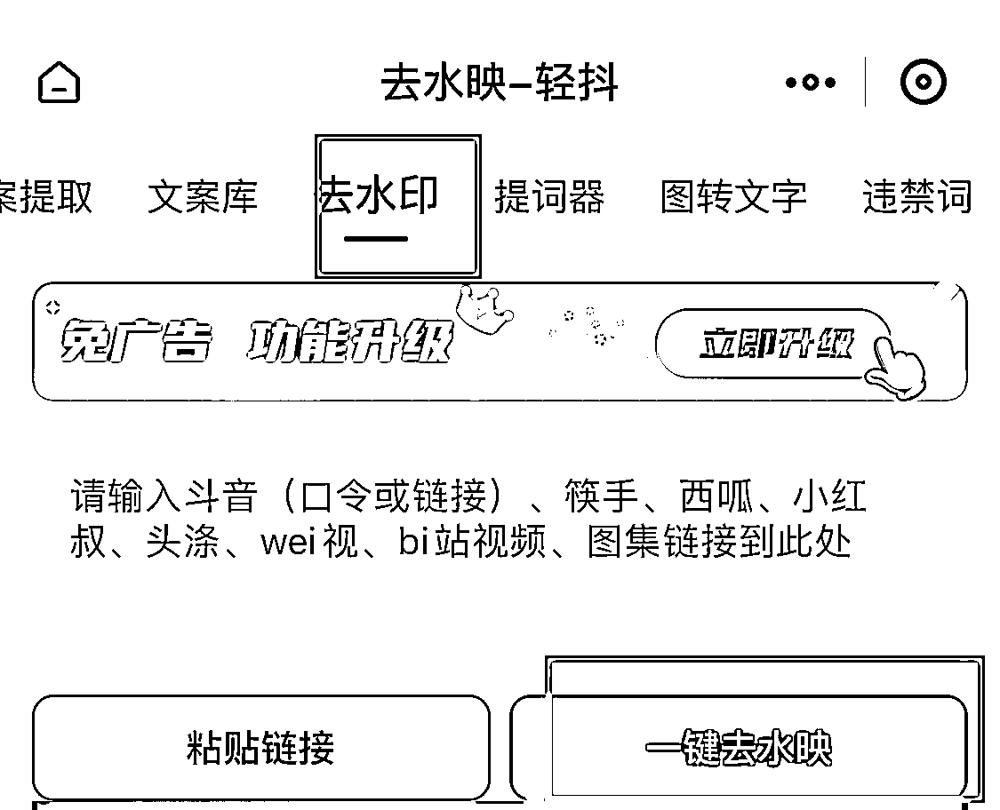</ne-card></ne-p> <ne-p id="uc0ede62e" data-lake-id="uc0ede62e"><ne-text id="u2c0dd42f">四、如何混剪以及混剪的过程需要注意什么？</ne-text></ne-p> <ne-p id="ufb724a34" data-lake-id="ufb724a34"><ne-text id="u6bced842">剪辑视频的软件推荐用剪映，当然其他软件用的熟练也是可以选择，以自己用的顺手习惯为主，可提高剪辑效率。</ne-text></ne-p> <ne-p id="u4e44a45e" data-lake-id="u4e44a45e"><ne-text id="u6dac31d7">剪辑的方法也有很多，比如拼多多，淘宝买家秀的评论区图文视频，以上介绍的四种选品方法的素材图文视频也可保存进行一个混剪。</ne-text></ne-p> <ne-p id="u381ecc26" data-lake-id="u381ecc26"><ne-text id="u59f72355" ne-bold="true">有的人会苦恼剪辑效率低，不知道怎么剪辑。这里我分享一个非常简单粗暴，但也能出单的剪辑方法。</ne-text></ne-p> <ne-p id="u7cd25d51" data-lake-id="u7cd25d51"><ne-text id="u735f7a77">小红书站内视频混剪法：</ne-text></ne-p> <ne-p id="u2fd877ae" data-lake-id="u2fd877ae"><ne-text id="ufb2f405a">若选的用户笔记内容为视频的：前提是找到所选类别商品当下销量较好的品的用户，保存他们的视频去重，进行一个画面替换的混剪；同时保存该用户的视屏封面（直接用同款）及标题文案（可进行适当修改文字，标点符号）</ne-text></ne-p> <ne-p id="u0604ac32" data-lake-id="u0604ac32"><ne-text id="u2b3ba8ce">添加保存的视频 2-3 个即可进行混剪，这里有个注意的，所保存的其一视频必须是小红书用户“低粉高赞”且销量超 1000 的视频，在做其他视频混剪的时候建议保留该视频前 3-5 秒的视频内容，替换中间或者尾部图片视频，因为该类视频能爆肯定是有吸引到用户眼球，以此视频为重点分析；</ne-text></ne-p> <ne-p id="u16cd35b0" data-lake-id="u16cd35b0"><ne-text id="uf6076d70">比如前面几秒的视频是怎样的？背景音乐可直接用同一音乐，视频中是否有文字内容，混剪其他视频过程是否需要文字的增加，视屏删减的，剪辑的前后是否能连贯，考虑到用户看到视频的感受。</ne-text></ne-p> <ne-p id="u2d242976" data-lake-id="u2d242976"><ne-text id="u8dbfd38a">我拿前面内衣视频举例：我找到的原视频如图一，符合低粉高赞。假设这个账号有且只有一个视频是低粉高赞的情况，这时候分析这个视频是图片加文字生成的一个视频。原视频先使用轻抖去水印。我们可以截图视频中商品图片在淘宝上以图搜相关商品图片，任意点开商家图片/详情图/买家秀图片保存结合图一视频，对应添加文字，替换图片，剪成一个新的视频。</ne-text></ne-p> <ne-p id="ubdd9b1ad" data-lake-id="ubdd9b1ad"><ne-text id="u6a78a98b">操作如下图：打开剪映—开始创作—添加原视频—点击➕号—选择淘宝保存的图片—对视屏，图片进行一个添加，删除，顺序的分割调整，若要添加文字尽量模仿和原视频中一样的字体—关闭原声—音频—音乐里面有各种音乐可选，建议使用查找和原视频一样的音乐，也可进行音乐更换测试下浏览量—最后导出，剪辑过程可参考图四视频。假设找到的为多个高赞高销量视屏也可用同样的剪辑方法进行一个视屏分割，打乱顺序重新排序进行剪辑。</ne-text></ne-p> <ne-p id="ue140d3cf" data-lake-id="ue140d3cf"><ne-card data-card-name="image" data-card-type="inline" id="bbOON" data-event-boundary="card"></ne-card></ne-p> <ne-p id="uae1bec3a" data-lake-id="uae1bec3a"><ne-card data-card-name="image" data-card-type="inline" id="mh51N" data-event-boundary="card"></ne-card></ne-p> <ne-p id="uf99c7a0e" data-lake-id="uf99c7a0e"><ne-card data-card-name="image" data-card-type="inline" id="vKYrS" data-event-boundary="card"></ne-card></ne-p> <ne-p id="u352b2518" data-lake-id="u352b2518"><ne-text id="u090172e6">若选的用户图片为主：可直接保存图片，再进行四个平台任选相关好看的图片，进行添加，一键生成。</ne-text></ne-p> <ne-p id="ua9e4b053" data-lake-id="ua9e4b053"><ne-text id="ue3234f1d">剪辑方法有很多，上面介绍的是剪辑速度相对较快较简单的，当然也有更精细的剪辑方法，比如特效，画中画，贴纸等进行结合。选一个最适合方便自己的同时也能出单的即可。</ne-text></ne-p> <ne-p id="u2a6c9d48" data-lake-id="u2a6c9d48"><ne-text id="u1c0e76c8">混剪视频教程给大家放在飞书链接里</ne-text>[<ne-text id="u22193136">https://tb9qrhlhl7.feishu.cn/docx/ZI1jd5bkmoOE5exD6cGcYer4nnh?from=from_copylink</ne-text>](https://tb9qrhlhl7.feishu.cn/docx/ZI1jd5bkmoOE5exD6cGcYer4nnh?from=from_copylink)</ne-p> <ne-p id="u1a7a2fa9" data-lake-id="u1a7a2fa9"><ne-text id="u0f2b0027" style="background-color: rgb(255, 255, 255); color: rgb(47, 48, 52);">以上，一起生财有术！对于小红书有不懂的问题欢迎交流，微信  wshinvest1</ne-text></ne-p> <ne-h2 id="34093387" data-lake-id="34093387"><ne-heading-ext><ne-heading-anchor></ne-heading-anchor><ne-heading-fold></ne-heading-fold></ne-heading-ext><ne-heading-content><ne-text id="u813413b0" ne-bold="true">往期文章：</ne-text></ne-heading-content></ne-h2> <ne-p id="u27e21b90" data-lake-id="u27e21b90">[<ne-text id="u8b67f24a" ne-bold="true" ne-underline="true">如何矩阵化经营 30 个小红书店铺月利润过 20 万？</ne-text>](https://articles.zsxq.com/id_3qslvwfcmwn3.html)</ne-p> <ne-p id="uf21a97b9" data-lake-id="uf21a97b9">[<ne-text id="u838d43f6" ne-bold="true" ne-underline="true">小红书店铺卖情娶内衣，直播+笔记打法月入 6000 保姆级教程</ne-text>](https://articles.zsxq.com/id_jj8hu5xhf5c4.html)</ne-p> <ne-p id="u73b45d1a" data-lake-id="u73b45d1a">[<ne-text id="ub0fa4ca0" ne-bold="true" ne-underline="true">组织生财有术福建厦门圈友聚会复盘！</ne-text>](https://articles.zsxq.com/id_7gqhllpk7tpk.html)</ne-p> <ne-p id="u21f672ee" data-lake-id="u21f672ee">[<ne-text id="u7f03948a" ne-bold="true" ne-underline="true">小红书单店铺单月 6000+利润选品保姆级教程</ne-text>](https://articles.zsxq.com/id_xwveu3e0usfv.html)</ne-p> <ne-p id="ua127c58a" data-lake-id="ua127c58a">[<ne-text id="u4f5a64f6" ne-bold="true" ne-underline="true">小红书无货源电商，单品 4w+利润，我做了什么？</ne-text>](https://articles.zsxq.com/id_8o3ptacdp6mj.html)</ne-p> <ne-p id="uec0f7e3b" data-lake-id="uec0f7e3b">[<ne-text id="uda0041ae" ne-bold="true" ne-underline="true">带 04 年大二堂妹做小红书店铺，从 0 开始做小红书，月入 3000</ne-text>](https://articles.zsxq.com/id_ker60oc8oimj.html)</ne-p> <ne-p id="u27994836" data-lake-id="u27994836">[<ne-text id="u1e9c9710" ne-bold="true" ne-underline="true">2023 小红书幼教考编保姆级教程</ne-text>](https://articles.zsxq.com/id_cpdec6j4xtho.html)</ne-p> <ne-p id="u11359744" data-lake-id="u11359744">[<ne-text id="uba49c783" ne-bold="true" ne-underline="true">小红书爆款封面最新设计攻略！带你掌握流量密码</ne-text>](https://articles.zsxq.com/id_bbisxulzsup1.html)</ne-p> <ne-p id="u3a35c7aa" data-lake-id="u3a35c7aa">[<ne-text id="u5ce1ad7a" ne-bold="true" ne-underline="true">如何拆解一个小红书爆款视频</ne-text>](https://articles.zsxq.com/id_opo78sxacew9.html)</ne-p> <ne-p id="u74dd6098" data-lake-id="u74dd6098">[<ne-text id="u70872f48" ne-bold="true" ne-underline="true">小红书无货源电商做女装如何选品？</ne-text>](https://articles.zsxq.com/id_1wxixz3rofb3.html)</ne-p> <ne-p id="u07da9fcc" data-lake-id="u07da9fcc">[<ne-text id="u54ae76dc" ne-bold="true" ne-underline="true">小红书颜值测评变现保姆级教程</ne-text>](https://articles.zsxq.com/id_15njj2g5hxfr.html)</ne-p> <ne-p id="u45ef0c06" data-lake-id="u45ef0c06">[<ne-text id="ue5a935f5" ne-bold="true" ne-underline="true">小红书低粉爆款案例拆解教程</ne-text>](https://articles.zsxq.com/id_0nmnwdg6mb0l.html)</ne-p> <ne-p id="u2939df58" data-lake-id="u2939df58">[<ne-text id="u0d5ed7a8" ne-bold="true" ne-underline="true">小红书新人入局月入 100-1000 元保姆级教程</ne-text>](https://articles.zsxq.com/id_sbk8lqv5unca.html)</ne-p> <ne-p id="u2c089f2e" data-lake-id="u2c089f2e">[<ne-text id="u8a93bfaa" ne-bold="true" ne-underline="true">人生的第一个 100 万，我是怎么赚到的？！</ne-text>](https://articles.zsxq.com/id_kek27cqo56wf.html)</ne-p> <ne-p id="u8ef1c6ef" data-lake-id="u8ef1c6ef">[<ne-text id="u99c3205e" ne-bold="true" ne-underline="true">抖音单品短视频带货 1000 万 GMV，我是怎么做到的？！</ne-text>](https://articles.zsxq.com/id_qoak1w7ptnwf.html)</ne-p> <ne-p id="u1664c047" data-lake-id="u1664c047">[<ne-text id="u0431ccc8" ne-bold="true" ne-underline="true">抖音直播间月消耗过百万的千川投流经验分享</ne-text>](https://articles.zsxq.com/id_d3zembkeh2cw.html)</ne-p> <ne-hole id="ueaec955b" data-lake-id="ueaec955b"><ne-card data-card-name="hr" data-card-type="block" id="Wb2Qa" data-event-boundary="card"><ne-p id="u7745ebce" data-lake-id="u7745ebce"><ne-text id="ub92dc394">评论区：</ne-text></ne-p> <ne-p id="u16280e77" data-lake-id="u16280e77"><ne-text id="u3d2865d3">谢安生 : 好详细，爱了爱了</ne-text> <ne-text id="u1e033ab5">佳慧是个菜头 : 这篇等同于手把手教学啊😱</ne-text> <ne-text id="u3b62b0c0">宝藏干货必须收藏！！</ne-text> <ne-text id="u2213f92f">谦墨 : 属于喂饭吃的程度[奋斗][奋斗][奋斗]</ne-text> <ne-text id="uf9a8db43">飞书何伟建 : 书豪牛逼，手把手了</ne-text> <ne-text id="u000f7524">Rex : 新人启蒙</ne-text> <ne-text id="u0f46bf09">书豪 : 星星之火可以燎原，小红书大有可为</ne-text> <ne-text id="uc2bb7c2d">书豪 : 感谢潮女佳慧</ne-text> <ne-text id="uaf6b2d04">书豪 : 感谢伟建大佬</ne-text></ne-p> <ne-p id="u765528af" data-lake-id="u765528af"><ne-card data-card-name="image" data-card-type="inline" id="H7kkR" data-event-boundary="card"></ne-card></ne-p> <ne-hole id="u9ca72af3" data-lake-id="u9ca72af3"><ne-card data-card-name="hr" data-card-type="block" id="hYvQr" data-event-boundary="card"></ne-card></ne-hole></ne-card></ne-hole>