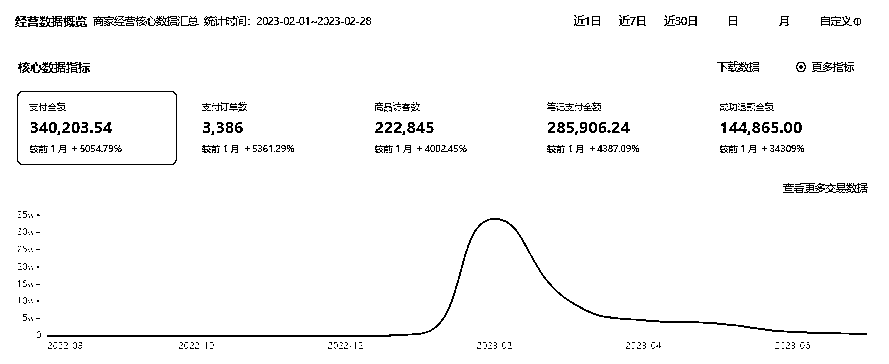
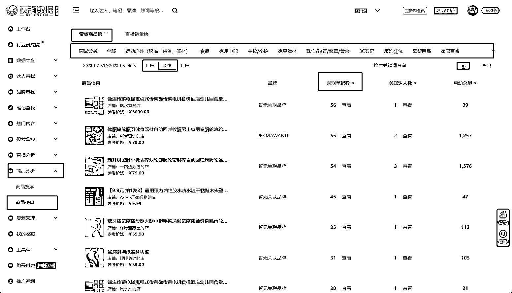
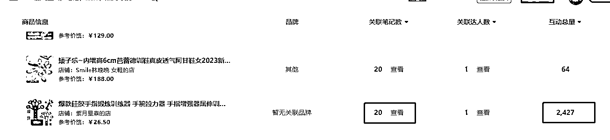
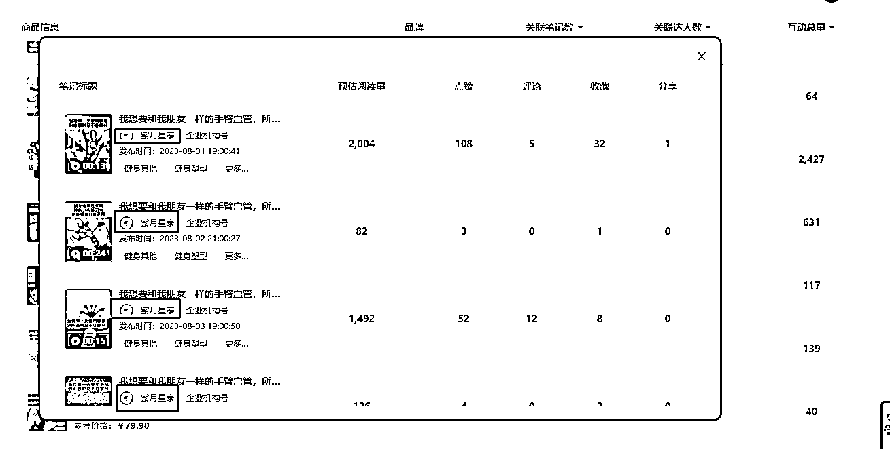
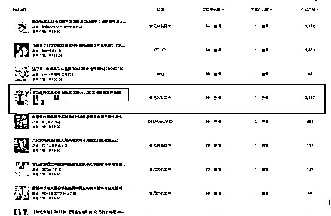
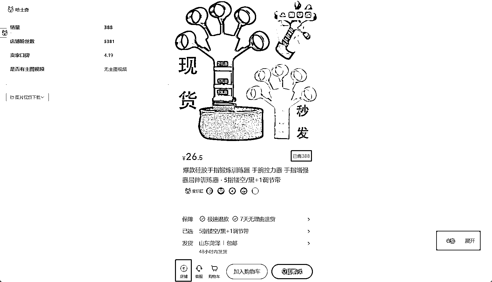
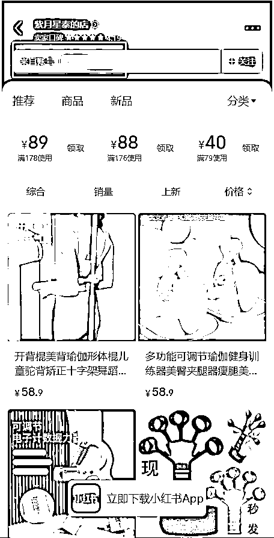
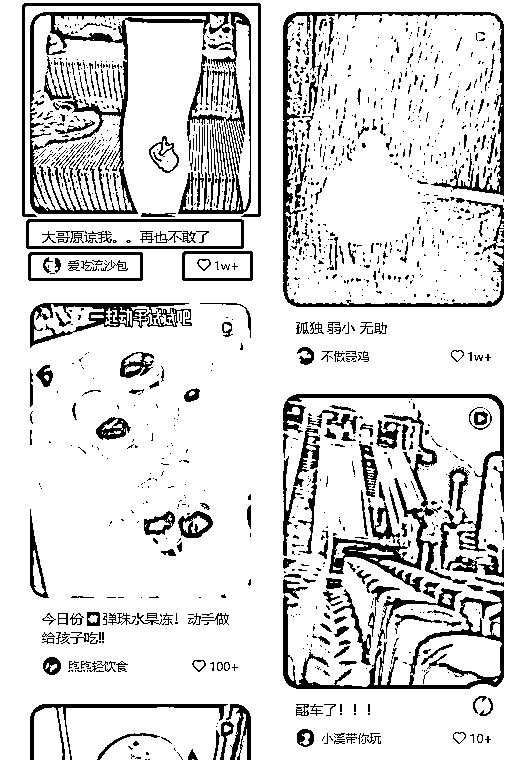

# 小红书店铺逆向思维选品及爆款笔记制作

> 原文：[`www.yuque.com/for_lazy/thfiu8/ml6wig2i74axt59s`](https://www.yuque.com/for_lazy/thfiu8/ml6wig2i74axt59s)

<ne-h2 id="10ef3910" data-lake-id="10ef3910"><ne-heading-ext><ne-heading-anchor></ne-heading-anchor><ne-heading-fold></ne-heading-fold></ne-heading-ext><ne-heading-content><ne-text id="u3e22b79a">(74 赞)小红书店铺逆向思维选品及爆款笔记制作</ne-text></ne-heading-content></ne-h2> <ne-p id="u26f65a97" data-lake-id="u26f65a97"><ne-text id="u7e30e3b8">作者： 表弟</ne-text></ne-p> <ne-p id="u7018f1b4" data-lake-id="u7018f1b4"><ne-text id="u20f00e98">日期：2023-08-09</ne-text></ne-p> <ne-p id="ud2c3c464" data-lake-id="ud2c3c464"><ne-text id="ub6154dcf">大家好，我是表弟，90 后，陕西宝鸡人，现居西安，主要项目有淘宝，小红书，正在学习视频号及抖音图文带货，有同城的伙伴可以交流学习。</ne-text></ne-p> <ne-p id="u52106f55" data-lake-id="u52106f55"><ne-text id="uecd44457">10 年前后，高中时期因家有打印机，通过整理打印历届高考真卷+答案销售 300 余份，获利 3000 余元。18 岁当天，去银行办了第一张银行卡，开通了第一个淘宝店</ne-text></ne-p> <ne-p id="u0f6ceffc" data-lake-id="u0f6ceffc"><ne-text id="u15c5e681">14 年毕业后从事快消品销售行业，当年获得人生第一个年薪十万。</ne-text></ne-p> <ne-p id="uae92b0f7" data-lake-id="uae92b0f7"><ne-text id="u83c4095a">19 年辞职从事旅游行业（高端定制游+企业团建），因与客户对接以显亲切，给自己起了个花名表弟。后因为口罩原因导致旅游无法维持生计，期间摆过地摊，做过小餐饮，均以口罩原因失败告终。</ne-text></ne-p> <ne-p id="u56455159" data-lake-id="u56455159"><ne-text id="udb0e9032">21 年报课学习淘宝，做到了月销售额 1000+，后来偶然期间认识到本地老乡大哥兼生财圈友@佳境，通过线下陪跑三个月，非优秀学员，实现稳定日销 1000+。实现了稳定月入 1-3 万+</ne-text></ne-p> <ne-p id="u7f80fd2d" data-lake-id="u7f80fd2d"><ne-text id="u57039af3">22 年底接触到小红书项目，报课学习后，起了三个店，其中一个礼品店月利润达到 5000+。23 年初，新开一个女装类目的店，运气好，1 月底更新，月底开始爆单，2 月产出 34 万，利润 10 万+，短暂的做到了月入十万。</ne-text></ne-p> <ne-p id="u6a70a29d" data-lake-id="u6a70a29d"><ne-card data-card-name="image" data-card-type="inline" id="IAPvX" data-event-boundary="card">  <ne-p id="udcb72e73" data-lake-id="udcb72e73"><ne-text id="u8bd42d1f">虽然之后成绩不怎么好，但是一直在学习复盘，做了很多类目，也踩过很多坑，再后来通过佳境大佬的洗脑，加入生财这个大家庭，立刻参加了小红书航海，续航，以及现在的再续航。</ne-text></ne-p> <ne-p id="ubf958238" data-lake-id="ubf958238"><ne-text id="u9395ab9b">接下来也由我给大家分享选品以及笔记制作的一些干货，希望对大家有所帮助。</ne-text></ne-p> <ne-p id="ufb56baa4" data-lake-id="ufb56baa4"><ne-card data-card-name="image" data-card-type="inline" id="ZbH2g" data-event-boundary="card"></ne-card></ne-p> <ne-p id="u52d97a7a" data-lake-id="u52d97a7a"><ne-text id="u1bbdb1b1">一、选品  主要有数据平台选品和电商平台选品</ne-text></ne-p> <ne-p id="u0b279551" data-lake-id="u0b279551"><ne-text id="u03ff9f72">数据平台有蝉妈妈/考古加/灰豚等。</ne-text></ne-p> <ne-p id="uc7e87403" data-lake-id="uc7e87403"><ne-text id="ua409b13d">建议新手选择数据平台，今天就只分享数据平台选品，电商选品容易把新手带坑里，没有选几千几万个品，根本没有选品的感觉。</ne-text></ne-p> <ne-p id="u7305de94" data-lake-id="u7305de94"><ne-text id="u77d7dc95">这里主要介绍我现在使用的方法，灰豚选品【价格实惠，某宝 100 多一个月】，其他选品平台也可以使用对应的逻辑操作。</ne-text></ne-p> <ne-p id="ub33b4fc6" data-lake-id="ub33b4fc6"><ne-text id="uc71206be">打开灰豚红薯版-商品分析-商品榜单-带货商品榜-选择相应类目-选择日榜或者周榜-按关联笔记数排序</ne-text></ne-p> <ne-p id="u85fcdf18" data-lake-id="u85fcdf18"><ne-card data-card-name="image" data-card-type="inline" id="fw7XC" data-event-boundary="card"></ne-card></ne-p> <ne-p id="u27b815ec" data-lake-id="u27b815ec"><ne-text id="u797445c8">比如看到这个硅胶手指锻炼器，可以点击【查看】看下关联笔记确认笔记是商家自己的账号，而不是达人带货账号。如果是达人带货，这个品咱们抄的意义就不大。</ne-text></ne-p> <ne-p id="uf3253851" data-lake-id="uf3253851"><ne-card data-card-name="image" data-card-type="inline" id="QaVO5" data-event-boundary="card"></ne-card></ne-p> <ne-p id="u90035f6b" data-lake-id="u90035f6b"><ne-card data-card-name="image" data-card-type="inline" id="qHFRx" data-event-boundary="card"></ne-card></ne-p> <ne-p id="u13476620" data-lake-id="u13476620"><ne-text id="u6dd7083a">确认好后关闭，进行下一步。</ne-text></ne-p> <ne-p id="ud344e30f" data-lake-id="ud344e30f"><ne-text id="u94abddf4">点击标题进入商品详情页，看下商品销量，销量一百以上的可以考虑选品。</ne-text></ne-p> <ne-p id="u1313f416" data-lake-id="u1313f416"><ne-card data-card-name="image" data-card-type="inline" id="B1YBF" data-event-boundary="card"></ne-card><ne-card data-card-name="image" data-card-type="inline" id="Cz07E" data-event-boundary="card"></ne-card></ne-p> <ne-p id="u9150e9e5" data-lake-id="u9150e9e5"><ne-text id="udbeeed7f">接下来点击左下角【店铺】，进入店铺主页，进来以后点击【销量】排序看下其他的品，拓展一下选品。</ne-text></ne-p> <ne-p id="u072047bd" data-lake-id="u072047bd"><ne-text id="uc6e08788">最后点击最上面的【来自账号】</ne-text></ne-p> <ne-p id="u33a48e1c" data-lake-id="u33a48e1c"><ne-card data-card-name="image" data-card-type="inline" id="fVFEK" data-event-boundary="card"></ne-card></ne-p> <ne-p id="u3a345c54" data-lake-id="u3a345c54"><ne-text id="ufe099e9d">进入账号主页，查看笔记，看下粉丝数，越少越好。最后看下最初的商品对应笔记，看那个封面使用较多，可以保存这个笔记的封面，写笔记的时候进行【抄袭】。持续选品，重复以上。</ne-text></ne-p> <ne-p id="ucbd3a95e" data-lake-id="ucbd3a95e"><ne-text id="ue649d196" ne-bold="true">操作逻辑</ne-text><ne-text id="u796e8b46">，因为大多数同行都是进行笔记互动数进行选品，我们反其道而行：</ne-text></ne-p> <ne-p id="ub1a204c5" data-lake-id="ub1a204c5"><ne-text id="u048918c9">1，按笔记数排序，选择互动数 300 以上【低于 300 也可能是潜力爆款】的商品，笔记数越多越好，证明这个账号在大力推这个产品，在小红书平台属于新品。</ne-text></ne-p> <ne-p id="ud0f16918" data-lake-id="ud0f16918"><ne-text id="u269a8be4">2，进入商品详情以后判断销量【1000 以内】，可以判定并没有大爆，这样我们竞争并不太激烈。</ne-text></ne-p> <ne-p id="u5b8874ea" data-lake-id="u5b8874ea"><ne-text id="u59f08a5f">3，第三个看粉丝数，如果是大博主，对方账号每发一条笔记，基础数据就是你的几倍甚至几十倍，模仿的必要性不是很大，当然也可以模仿，他吃肉你喝口汤也不是不可以。</ne-text></ne-p> <ne-p id="ue6f2fdc0" data-lake-id="ue6f2fdc0"><ne-text id="u13f69429">二、爆款笔记制作</ne-text></ne-p> <ne-p id="ubc40b0c5" data-lake-id="ubc40b0c5"><ne-text id="u336b9512">首先我们要知道小红书</ne-text><ne-text id="u8670f2c0" ne-bold="true">笔记的六要素：封面、图片/视频、标题、正文，话题，发布时间</ne-text><ne-text id="u45dd6d98">。其中对于我们获取流量最重要的是什么呢？</ne-text></ne-p> <ne-p id="uca2b6ec7" data-lake-id="uca2b6ec7"><ne-text id="uc8b6fad7">我们打开小红书发现页，系统会给推送笔记，笔记在发现页只会展现出四个要素，分别是</ne-text><ne-text id="ubd2e444f" ne-bold="true">封面，标题，账号名，点赞数。</ne-text></ne-p> <ne-p id="uecfe68a5" data-lake-id="uecfe68a5"><ne-card data-card-name="image" data-card-type="inline" id="abO5A" data-event-boundary="card"></ne-card></ne-p> <ne-p id="uda1b8c31" data-lake-id="uda1b8c31"><ne-text id="u68605f94">所以笔记六要素里最重要的两个能影响展现的是</ne-text><ne-text id="ud23f060f" ne-bold="true">【封面】</ne-text><ne-text id="u4cc4b740">和</ne-text><ne-text id="ubd69b437" ne-bold="true">【标题】</ne-text><ne-text id="uefb6b83f">，其中封面占 80%，标题占 20%。</ne-text></ne-p> <ne-p id="u10234b32" data-lake-id="u10234b32"><ne-text id="u9ad4a23b">所以一个</ne-text><ne-text id="ufc6f6e42" ne-bold="true">好的封面至关重要</ne-text><ne-text id="u08565101">，刚才将选品的时候就让大家注意同行使用最多的封面，可以参考二创后使用，并不建议直接原图无任何处理使用，笔记爆了容易被投诉。</ne-text></ne-p> <ne-p id="u51db7251" data-lake-id="u51db7251"><ne-text id="ue32b1714">小红书乃至整个电商平台的</ne-text><ne-text id="u8a9773af" ne-bold="true">推送逻辑是，展现-点击率高-继续推展现-点击率高-展现高--无限循环至平台流量吃光。</ne-text></ne-p> <ne-p id="u0c6ac834" data-lake-id="u0c6ac834"><ne-text id="ua2c6033c">所有应该先解决</ne-text><ne-text id="uaa37ecf8" ne-bold="true">展现的问题【小眼睛】</ne-text><ne-text id="u603bc9d7">，再优化正文，视频/图片，话题，发布时间。</ne-text></ne-p> <ne-p id="u922b9da6" data-lake-id="u922b9da6"><ne-text id="u485a4fa1">只有用户看到有点击，才会有后续的爆文，如果基础展现永远卡在 100 左右，考虑自己的封面和标题是不是足够吸引人，再去优化其他的东西。</ne-text></ne-p> <ne-p id="ua3952ce5" data-lake-id="ua3952ce5"><ne-text id="u935dee77">跟淘宝一样，小红书的封面=淘宝的主图，</ne-text><ne-text id="u3dba0b1e" ne-bold="true">封面的点击率影响笔记的权重以及后续展现。</ne-text></ne-p> <ne-p id="ud32cc5ab" data-lake-id="ud32cc5ab"><ne-text id="u413a9709">另外，新账号的笔记标题/正文/话题最好能带商品的关键词，以提高系统推送人群的准确度以及带来一些额外的搜索流量。</ne-text></ne-p> <ne-p id="u0b4bca66" data-lake-id="u0b4bca66"><ne-text id="uff16ae71" ne-bold="true">关于标题</ne-text><ne-text id="u22ddf9c9">，标题就简单多了，直接使用爆款标题，调换顺序，添加表情，稍微修改下直接用就可以了。</ne-text></ne-p> <ne-p id="u9746000c" data-lake-id="u9746000c"><ne-text id="u6561ca2a" ne-bold="true">关于视频</ne-text><ne-text id="u0c7dd5b3">，直接去别的平台下载带货视频【一定不要在小红书本平台搬运！！】，看下奇杰老师混剪文章，混剪做好去重就可以了。</ne-text></ne-p> <ne-p id="u2f3121d5" data-lake-id="u2f3121d5"><ne-text id="u527648a8" ne-bold="true">前期不要考虑实拍</ne-text><ne-text id="ub87eb53d">，因为你没有那个能力，有那能力干啥电商呀，带货不香吗</ne-text></ne-p> <ne-p id="ueebc45f0" data-lake-id="ueebc45f0"><ne-text id="u88aa6e24" ne-bold="true">中后期可以考虑在混剪视频+自己视频的小片段，提高原创度。</ne-text></ne-p> <ne-p id="uabb7014d" data-lake-id="uabb7014d"><ne-text id="ue4f779bc" ne-bold="true">关于话题</ne-text><ne-text id="u4d490fdc">，选择与产品相关和热门的就可以。</ne-text></ne-p> <ne-p id="u91d8289b" data-lake-id="u91d8289b"><ne-text id="u01bbb448" ne-bold="true">关于正文</ne-text><ne-text id="uaf4b8d75">，前期可以少写一些，或者通过 AI 代写。正文越多，阅读时间越长，视频完播率越高，权重越高。</ne-text></ne-p> <ne-p id="u78e2e401" data-lake-id="u78e2e401"><ne-text id="u61171e79" ne-bold="true">关于发布时间</ne-text><ne-text id="u98570e52">，定时发布，间隔一小时，后期根据账号笔记数据那个时间段效果好，集中发布。</ne-text></ne-p> <ne-p id="u64407d9c" data-lake-id="u64407d9c"><ne-text id="ua9f387be">最后</ne-text><ne-text id="udcc1ad82" ne-bold="true">关于笔记更新频率</ne-text><ne-text id="u572b76b8">，建议</ne-text><ne-text id="u8e2262fe" ne-bold="true">一个账号一天 5-10 篇。最高不要超过 20 篇</ne-text><ne-text id="u92436dc1">，不然也容易违规。</ne-text></ne-p> <ne-p id="u566e28ee" data-lake-id="u566e28ee"><ne-text id="ua7303da7">保持一个稳定的频率很重要，</ne-text><ne-text id="u50b3d932" ne-bold="true">每天坚持更新</ne-text><ne-text id="u3a2bdc34">，让平台认为你在认真做。</ne-text></ne-p> <ne-p id="ube0de85a" data-lake-id="ube0de85a"><ne-text id="u9e289eb9" ne-bold="true">一个品连推三天</ne-text><ne-text id="ub1200081">【每天 1-5 篇，根据个人精力及素材多少决定】，不行了就换下一个品，下一个品更香。</ne-text></ne-p> <ne-p id="u9b4d274e" data-lake-id="u9b4d274e"><ne-text id="u3dcec8c8">如果不是季节性的产品，笔记和产品都不要删，让子弹飞一会，可能过一个月才会爆。</ne-text></ne-p> <ne-p id="u3ea2d7c6" data-lake-id="u3ea2d7c6"><ne-text id="uc5fb301e">电商这一块，没有什么秘籍，建议基础不好的同学，可以去看看</ne-text><ne-text id="u777810b1" ne-bold="true">官方的课程</ne-text><ne-text id="uced48d40">，做好笔记，定期复盘下，大部分问题可以解决。</ne-text></ne-p> <ne-p id="u6c2cd597" data-lake-id="u6c2cd597"><ne-card data-card-name="image" data-card-type="inline" id="AdJKK" data-event-boundary="card"></ne-card></ne-p> <ne-p id="uc04b8469" data-lake-id="uc04b8469"><ne-text id="u011731e4">二、关于无货源</ne-text></ne-p> <ne-p id="u999c4e60" data-lake-id="u999c4e60"><ne-text id="ua12db3a0">无货源各个平台到现在也无法完全禁止，大家做到以下几点，可以最大程度避免发生无货源的现象。</ne-text></ne-p> <ne-p id="u4d2f2a44" data-lake-id="u4d2f2a44"><ne-text id="u68f5adc7">1，</ne-text><ne-text id="u25f47dec" ne-bold="true">远离 PDD</ne-text><ne-text id="u3dd41ac8">，实在找不到货可以找 PDD 老板谈代发。</ne-text></ne-p> <ne-p id="u1d01cec7" data-lake-id="u1d01cec7"><ne-text id="u2b42e122">2，尽量</ne-text><ne-text id="u95939753" ne-bold="true">选择 1688 专业代发</ne-text><ne-text id="u6f75cf38">平台。</ne-text></ne-p> <ne-p id="u3b98bb5c" data-lake-id="u3b98bb5c"><ne-text id="u37b18270">3，</ne-text><ne-text id="uf6a06d60" ne-bold="true">不要大批量上货</ne-text><ne-text id="u02d7a2b4">，这也是一个稽查的方向。</ne-text></ne-p> <ne-p id="u6d09145e" data-lake-id="u6d09145e"><ne-text id="ue59b6e53">4，尽量选品的时候在 1688 对接好货源，尽量</ne-text><ne-text id="u7456b7a1" ne-bold="true">不要先上品后找货。</ne-text></ne-p> <ne-p id="ue634dc53" data-lake-id="ue634dc53"><ne-text id="u3120b4b9">5，出现面单/短信/好评卡等无货源导致的投诉，</ne-text><ne-text id="u9de6f7bb" ne-bold="true">能用钱解决的不要吝啬。</ne-text></ne-p> <ne-p id="u8f1bcac4" data-lake-id="u8f1bcac4"><ne-text id="u4a4b723a" ne-bold="true">第四点至关重要</ne-text><ne-text id="ue1c3bac1">，也是无货源与代发的区别。</ne-text></ne-p> <ne-p id="ue5e85ea2" data-lake-id="ue5e85ea2"><ne-text id="u82e1851d">我的淘宝店一直都是先找货源后上架，从来没有出现过 48 分和无货源。</ne-text></ne-p> <ne-p id="u05bf8d93" data-lake-id="u05bf8d93"><ne-text id="u50b43f40">无货源玩家都是先大量铺货，出单后再找货，找不到下架，一次两次平台/消费者不会找你麻烦，次数多了可能会判断无货源。</ne-text></ne-p> <ne-p id="u3fdfd16a" data-lake-id="u3fdfd16a"><ne-text id="ufc25f311">如果实在是这个品太好了，目前没有货源，可以</ne-text><ne-text id="u4d666ddb" ne-bold="true">预售 15 天</ne-text><ne-text id="u5b378835">，给厂家留足够的时间出货，也降低自己的风险。基本没有中国制作十五天造不出来的品，所以只要产品大爆，实在不行自己联系工厂做也可以的。</ne-text></ne-p> <ne-p id="u9ccacfef" data-lake-id="u9ccacfef"><ne-text id="u2ff7b62c">另外大家建议可以做个</ne-text><ne-text id="u8543a473" ne-bold="true">选品表</ne-text><ne-text id="u51e89faa">，提前计算好利润，参考同行定好价以后上架，方便</ne-text><ne-text id="u068c2f38" ne-bold="true">复盘</ne-text><ne-text id="u6fc12b83">和下单。</ne-text></ne-p> <ne-p id="u5cea1e86" data-lake-id="u5cea1e86"><ne-text id="uc7bdc538">以上。仅供大家学习交流。</ne-text></ne-p> <ne-hole id="ub2f37c23" data-lake-id="ub2f37c23"><ne-card data-card-name="hr" data-card-type="block" id="fAUrh" data-event-boundary="card"><ne-p id="ub009c4d6" data-lake-id="ub009c4d6"><ne-text id="ub4686adf">评论区：</ne-text></ne-p> <ne-p id="ua9090eef" data-lake-id="ua9090eef"><ne-text id="uee9703e4">huii : 西安圈友[强]</ne-text> <ne-text id="u56dacbe7">西瓜 : 封面占 80%，先提高小眼睛才有后续，基础曝光 100 以上，做选品表可以复盘用</ne-text> <ne-text id="udc1fa737">淳蓝 : 请问怎么看出是商家带货还是达人带货？</ne-text></ne-p> <ne-p id="uc1bb8bfd" data-lake-id="uc1bb8bfd"><ne-card data-card-name="image" data-card-type="inline" id="ilViC" data-event-boundary="card"></ne-card></ne-p> <ne-hole id="u8791640b" data-lake-id="u8791640b"><ne-card data-card-name="hr" data-card-type="block" id="qq87l" data-event-boundary="card"></ne-card></ne-hole></ne-card></ne-hole></ne-card></ne-p>