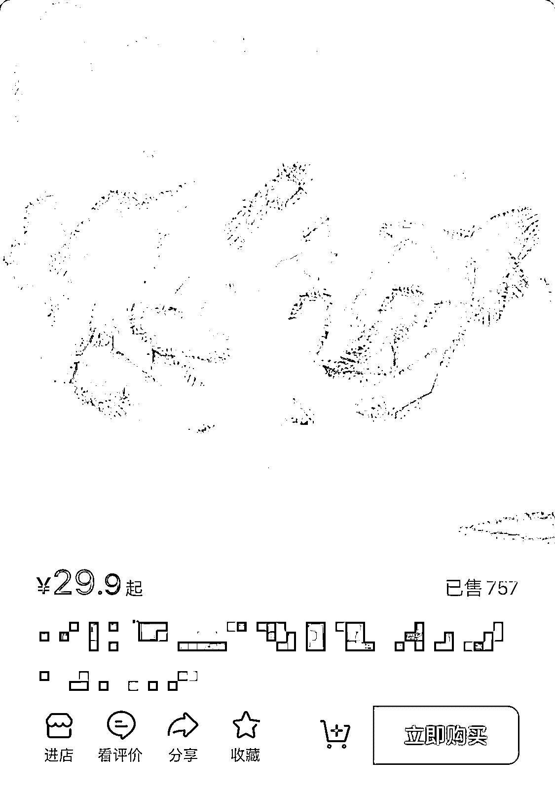

# 小红书开店如何通过信息差 0 风险赚到 1 万，定制戒指复盘

> 原文：[`www.yuque.com/for_lazy/thfiu8/ifrti6vhzmbyuqbi`](https://www.yuque.com/for_lazy/thfiu8/ifrti6vhzmbyuqbi)

## (精华帖)(74 赞)小红书开店如何通过信息差 0 风险赚到 1 万，定制戒指复盘 

作者： 苏木 

日期：2023-08-11 

我是如何通过捡漏 0 风险三天赚到一个 w 的，普通人也能发现的赚钱机会 

大家好，我是苏木，分享一下最近一个小项目，从发现机会到落实的全过程，附上复盘总结。 

不得不感慨一句，你永远赚不到认识以外的钱。 

这个项目机会也来源于这句话，简单晒下成果。 

 

 

以下正式开始分享： 

## 一、自我介绍 

我叫苏木，90 后，先简单介绍下项目的前因后果。 

我本身是小红书运动品类的一个小博主，有开小红书店铺，这个项目属于我本身品类的一个衍生品，也就是说，它可能不止是我能做，放在你的领域也能行得通，所以我决定把它分享出来，希望能给你带来不一样的灵感。 

## 二、发现机会及风险 

我有一个习惯，每天晚上睡前都会刷一会小红书，找找和自己项目有关的内容看看，主要目的是收集素材和发现问题。 

某天晚上刷的时候看到一篇笔记，是和我行业相关的一个衍生品，当时笔记数据是 100 多的赞，60 多收藏，40 多评论，整体数据并不算很优秀，但是直觉告诉我，这是一个机会，先点个收藏，明天在看。 

这里延伸下我的思考，为什么觉得是机会而没有直接去做，有两个原因。 

1、这个衍生品涉及到我不懂的行业，我并不知道那个行业的作业流程是怎么样的，需要找人去了解，当时晚上快 12 点，我也没有这方面的朋友，所以只能先放下。 

2、我不确定这篇笔记是不是钓鱼的，如果是钓鱼，我就没有入局的必要了，等一晚上，明天自然就知道结果了。 

（解释下我这里钓鱼的意思，我有一个产品，为了吸引普通用户的关注，我用普通用户分享的心态写一篇笔记发出去，有人想要的，我会引导加微信或者直接去购买。所以如果这个博主已经准备好承接流量的产品了，你入局可能汤都没得喝。） 

思考结束，正文继续 

等第二天我忙完其他事情，再去看这条笔记的时候，数据已经来到了 300 多赞，100 多评论，而且评论区大部分都是求购买的信息，博文并没有做任何回复，这里就可以排除钓鱼的风险了。 

以上信息说明什么？这，是一个显而易见的机会，但是你会发现，根本没人意识到，包括发这篇笔记的博主。 

我立马就去阿里巴巴上找供应商，因为是定制品，需要有一个开模打样的时间，打样+生产的时间长达一个月之久。 

那这一个月我不能光等着啊！ 

首先开模打样这都是要花钱的，这是一个风险点。 

要等一个月才有产品，但是一个月之后是什么情况谁能说得准呢？这是另一个风险点。 

打样了厂家看到你的产品火了，会不会抄袭你的产品呢？ 

就算厂家不会，其他拥有资源的人会不会呢？ 

## 三、瞒天过海，转嫁风险 

基于以上风险点，我想的是，既然这么多不确定因素，那我可不可以先解决一个风险点，在做决定呢？ 

上面这几个问题，归根结底，是对市场的不确定性担心，要优先解决这个问题。 <ne-h5 id="d3a288a1" data-lake-id="d3a288a1">1、如何解决市场不确定风险</ne-h5> 

最简单的方式就是，假装我已经有了这个产品，图片处理一下，发一篇小红书，同步到朋友圈，看看市场反馈。 

小红书倒是没怎么爆，应该是图片没处理到位，被判抄袭了，分享到朋友圈的直接炸了，都是想要，问怎么买的。 

 <ne-h5 id="475f7be6" data-lake-id="475f7be6">2、如何解决资金问题</ne-h5> 

市场初步确定，但是还不够，判断一个人是不是真的觉得你的产品好，有一个很简单的方法：他愿不愿意为你的产品买单。这里我引用一下徐宿老师经常跟我说刘小排文章中的那段话： 

如何判断自己的产品对于别人到底有没有价值？ 

塔勒布希望我们对所参与的事要有「代价」： 

提出一个方案，决策人要有和结果绑定的代价，成功要有相应的奖励，失败要有相应的损失。 

只有这样，这个决策才是真实、可信的，即 game 中的 skin（skin in the game）。Have a skin in the game，是上述方法之所以有效的底层逻辑。 

当你问别人「我这个产品好不好？」时，别人说「挺好的」，那只是嘴炮，别信。因为他没有付出与结果绑定的代价，他又不买，怎么说都行。 

你应该反问：“虽然产品还没做出来，但现在就可以预购了，你买吗？” 

当女孩对你说「你是个好人」时，那只是嘴炮，别信。因为她没有付出与结果绑定的代价，她又不会和你在一起，她怎么说都行。 

你应该反问：“那你愿意和我在一起吗？” 

当银行大堂经理向你推销一支理财产品时，不管她怎么把这支产品夸上天，你要知道，那只是嘴炮，别信。 

在你作出购买的决定之前，你得先反问她：“姐，我相信你。我想参考一下，你自己买了多少钱的？” 

——刘小排《Skin in the Game》 

基于这个逻辑，我意识到其实可以通过做预售，先收钱进一步确定市场反馈。 

趁着大家热度很高的时候，我又做了另外一个动作，告诉客户，我跟工厂沟通好了，产品可以预定，你们觉得不好的可以提出来，我让工厂改，但是需要等 30 天，因为模具调整需要时间，大概是 10 天左右，加上来快递，确定最终版就要花掉 15 天，生产要 7 天左右，发货到我这里，在分发到你们手上差不多 7 天，有多少能等的打钱预算，不接受口头预定。 

其实有没有人提出来改都是 30 天，只是让更容易接受客户这个时间，毕竟 30 天并不短。 

为什么是 30 天，你们应该没忘记吧！因为我前面跟工厂沟通的是 30 天才能拿到产品，这里其实就是生搬硬凑，凑够 30 天，等工厂发货给我，我在分发出去。 <ne-h5 id="c33c3a69" data-lake-id="c33c3a69">3、0 风险项目完成</ne-h5> 

然后朋友圈收了一波钱，小红书店铺上了预售链接收了一波钱，这时候就要夸一波小红书了，上产品不需要什么资质，可预售，而且有优惠券，减少了好多不必要的麻烦，挂上去之后三天两头还有自然成交。 

拿上钱去找工厂打样生产，项目 0 风险实操成功。 

到这里项目操作就基本就已经完了，后面就当一个平常的产品卖就行了。 

## 四、复盘总结 

下面是复盘总结： 

如果说上面一部分能给你一些灵感的话，下面这部分能让你少踩坑，多赚钱。 <ne-h3 id="a17806ab" data-lake-id="a17806ab">1、对行业不了解，少赚了很多钱</ne-h3> 

其实这个项目可以赚更多钱，因为我个人对行业的不了解，以及没和工厂沟通清楚，导致这个产品受众人群少了很多，结果就是少赚了很多钱。 

对不了解的行业，先找熟悉的人聊聊，效率加倍+踩坑减半，当然前提是付费请教，这点我也是跟着生财的小伙伴学会的，免费的真的太贵了，还是付费直接简单点。 <ne-h3 id="d13eb588" data-lake-id="d13eb588">2、想成事，不能等、靠、要，共勉</ne-h3> 

等是什么，等别人给你安排事做，等别人有时间，等产品生产…… 

等待的这一个月，其实我可以做更多事情。比如说： <ne-oli index-type="0"><ne-oli-i>1</ne-oli-i><ne-oli-c class="ne-oli-content" id="uffd9ac51" data-lake-id="uffd9ac51">找到更快生产产品的方式</ne-oli-c></ne-oli> <ne-oli index-type="0"><ne-oli-i>2</ne-oli-i><ne-oli-c class="ne-oli-content" id="ua4ca7de6" data-lake-id="ua4ca7de6">开发更多相似产品</ne-oli-c></ne-oli> <ne-oli index-type="0"><ne-oli-i>3</ne-oli-i><ne-oli-c class="ne-oli-content" id="uf24ab862" data-lake-id="uf24ab862">开发更多渠道售卖</ne-oli-c></ne-oli> 

结果是，我什么都没做，白白错过了后续放大的绝佳机会。 

因为产品生产周期长及产品的不确定性，第一波我不太敢放量，做过生产的朋友都知道，量少则价高，我的产品就不得不高价销售，高价利润高的同时，客户也会少很多，对于我这个产品，应该放量的，量大边际成本可以无限压低。 

一个产品火了很容易有人模仿，尤其是在这个圈子不大的品类，我预售完一波之后，没过两天就有客户找过来问我能不能便宜点，说别人才是我价格的一半，我找他拿链接去看了下，工艺不一样，价格确实便宜，利润也够高，产品可以无限量供应，成本极低。 

我大致估算下，他卖的那个价格利润至少 150%，按他的销售，赚的比我还多。 

 

所以你看，内行打外行，真的是认知碾压，我也知道有那个工艺，但是我没有联想到可以用在这个项目上。 

这一幕就像是开头那样，别人的分享，我看到了机会；我吭哧吭哧做苦力的时候，别人咔一下，自动化了。 

靠是什么，就指着这一家工厂了，别人不给做你也没办法。 

我严重怀疑，做上面这件事的就是给我做样品的工厂，但是没办法，只找了他一家，他懂的还比我多，这个产品自带流量，别人能赚到钱也是本事，就当给自己上了一课，涨点新知识也不错。 

还有一层意思是，别指着一个平台销售，特别是这种抢跑的产品，模式通了就该全网能上的地方都上，我是吃了这个亏，只上了小红书，抖、淘都没上架，又少赚一波，心痛。 

要是什么，我就要你告诉我周一做什么，周二做什么，否则我做不了。 

这一点和本文无关，只是顺便分享，做什么事都要有主人翁意识，主动做，主动想。 

赚钱的事，总不能还让别人天天跟你在屁股后面催吧！ 

最后结尾在叨叨一句吧 

各位做自媒体博主的，一定要学会观察异常数值，不管是自己的账号，还是别人的，有异常就有机会。 

以上，就是本次分享的全部内容！希望能给你带来些许灵感和帮助，如有疑问，欢迎评论区留言。 

评论区： 

书豪 : 棒 苏木 : [耶] 才 : 你这个看到机会就开搞的能力真厉害，能教教我吗？我要遇到种机会而且又是自己不熟悉的领域，多半就变成等等党或者说给自己设限不弄了 苏木 : 比较看个人的执行力吧！或者说，利益还不足以让你下定决心快速开始做 早茶月光 : 你是个幽默的人 张耑一 : 想问一下你发的这个朋友圈，是因为你微信已经有从小红书引流到私域很多人了嘛？还是这个微信只是你私人的微信发的，在你朋友圈点赞的都是现实中的朋友？ 七荷 : 够敏锐，执行力强[强] 曜文 : 异常数值异常就有机会！！用在小红书太适合啦 

  