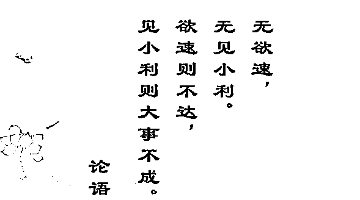
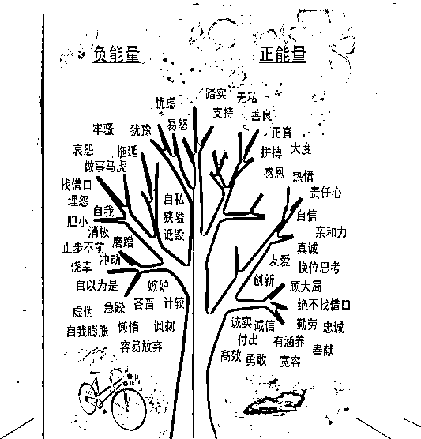
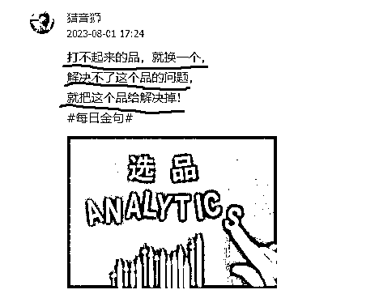

# 抖音-视频号-快手带货，新手攻克想要爆单需要攻克的 3 个问题

> 原文：[`www.yuque.com/for_lazy/thfiu8/hxqzwkgqup8py63k`](https://www.yuque.com/for_lazy/thfiu8/hxqzwkgqup8py63k)

<ne-h2 id="b9ab450c" data-lake-id="b9ab450c"><ne-heading-ext><ne-heading-anchor></ne-heading-anchor><ne-heading-fold></ne-heading-fold></ne-heading-ext><ne-heading-content><ne-text id="u0147d2b1">(169 赞)抖音-视频号-快手带货，新手攻克想要爆单需要攻克的 3 个问题</ne-text></ne-heading-content></ne-h2> <ne-p id="u04f91ef7" data-lake-id="u04f91ef7"><ne-text id="u649d226b">作者： 猎音狮</ne-text></ne-p> <ne-p id="ua486644f" data-lake-id="ua486644f"><ne-text id="ub17d61f6">日期：2023-08-15</ne-text></ne-p> <ne-p id="u4c86837b" data-lake-id="u4c86837b"><ne-text id="uaf7fa9cd">生财的铁子们大家好，我是猎音狮，由于最近都忙着业务，好久没来分享了！</ne-text></ne-p> <ne-p id="u15b6a890" data-lake-id="u15b6a890"><ne-text id="u1ed23755">先说说没来的这段时间里，我的一个成绩。</ne-text></ne-p> <ne-p id="ub00c1b65" data-lake-id="ub00c1b65"><ne-text id="u035333ca">最近三个月，平均每个月抖音战绩 100w＋gmv：</ne-text></ne-p> <ne-p id="u447daff3" data-lake-id="u447daff3"><ne-card data-card-name="image" data-card-type="inline" id="V6ctJ" data-event-boundary="card">  <ne-hole id="u4361e1e4" data-lake-id="u4361e1e4"><ne-card data-card-name="hr" data-card-type="block" id="DD9Az" data-event-boundary="card"><ne-p id="u662c3e7c" data-lake-id="u662c3e7c"><ne-text id="u0b47a634" ne-bold="true">具体玩法，我之前分享过：</ne-text></ne-p> <ne-p id="u720e8d21" data-lake-id="u720e8d21"><ne-text id="u8966c542">这</ne-text><ne-text id="uda952448" ne-bold="true">三篇帖子</ne-text><ne-text id="u6a63c7d9">得到亦仁老师认可，得到了加精，感兴趣的可以复习一下！</ne-text></ne-p> <ne-p id="u18b1e205" data-lake-id="u18b1e205">[<ne-text id="u81bbbe81" ne-bold="true" ne-underline="true">1、【抖音项目】图书类目短视频投流带货，我是如何月入 10W➕的？</ne-text>](https://t.zsxq.com/0e2QVMLub)</ne-p> <ne-p id="u6f6692ae" data-lake-id="u6f6692ae">[<ne-text id="uc6ed6b4a" ne-bold="true" ne-underline="true">2、</ne-text>](https://t.zsxq.com/0e1k8vMdS)[<ne-text id="u6650a2c3" ne-bold="true" ne-underline="true">普通人做抖音图书带货，从起号到投流，有哪些具体玩法？</ne-text>](https://t.zsxq.com/0e1k8vMdS)</ne-p> <ne-p id="u3016666d" data-lake-id="u3016666d">[<ne-text id="u1c7232d3" ne-bold="true" ne-underline="true">3、#抖音【我层层优化这个文案，从“抄”到“超”，卖中高考押题作文，3 天转化 3000 单＋】</ne-text>](https://t.zsxq.com/0eUuHMVwk)</ne-p> <ne-hole id="u3273076c" data-lake-id="u3273076c"><ne-card data-card-name="hr" data-card-type="block" id="MwJ94" data-event-boundary="card"><ne-p id="u5f818d71" data-lake-id="u5f818d71"><ne-text id="u829c0259">很多铁子看了我的分享，有些会举一反三的，自己去跟着实操了，确确实实赚到了钱。</ne-text></ne-p> <ne-p id="u8b3793d7" data-lake-id="u8b3793d7"><ne-text id="u8adc3af9">有趣的是，有个铁子看了我分享的抖音创意中心榜单，想到把榜单上的视频搬运到小红书，赚了</ne-text><ne-text id="u2d831106" ne-bold="true">10w＋</ne-text><ne-text id="ue40f12f1">！</ne-text></ne-p> <ne-p id="u8be7fcd0" data-lake-id="u8be7fcd0"><ne-text id="u5db11f21">但是也有很多刚进入短视频领域的新人，经常问我一些普遍存在的问题，我总结成了这</ne-text><ne-text id="u33874bbf" ne-bold="true">三个</ne-text><ne-text id="ua2950968">！</ne-text></ne-p> <ne-p id="uc6c57d82" data-lake-id="uc6c57d82"><ne-text id="ub21bb554">所以，今天不谈干货，来谈谈心态、谈谈</ne-text><ne-text id="u543a497d" ne-bold="true">生财认知</ne-text><ne-text id="u142d80b1">！</ne-text></ne-p> <ne-p id="u99e89410" data-lake-id="u99e89410"><ne-text id="uf395b0f3" ne-bold="true">第一、贪多图快</ne-text></ne-p> <ne-p id="u0a7b6f20" data-lake-id="u0a7b6f20"><ne-card data-card-name="image" data-card-type="inline" id="RdiQu" data-event-boundary="card">  <ne-p id="ud343cc89" data-lake-id="ud343cc89"><ne-text id="u4f988365">论语曰：</ne-text><ne-text id="uef2791ab" ne-bold="true">无欲速，无见小利。欲速则不达，见小利则大事不成。</ne-text></ne-p> <ne-p id="u337b1f30" data-lake-id="u337b1f30"><ne-text id="u39b8299a">这句话，放到我们行业里来，我是这样理解的：</ne-text></ne-p> <ne-p id="udca7580f" data-lake-id="udca7580f"><ne-text id="u942d780b" ne-italic="true" ne-underline="true">不要贪多图块，也不要见到“小便宜”就上，比如看别人做啥赚了钱，都想掺和一脚，但是又做不精，导致啥也干不好！</ne-text></ne-p> <ne-p id="u1db674dd" data-lake-id="u1db674dd"><ne-text id="uc696ea20">所以，生财里面这么多项目，选一个适合自己的死磕，你终将做出成绩来！</ne-text></ne-p> <ne-p id="uc5aff2fc" data-lake-id="uc5aff2fc"><ne-text id="uee0ad11e">并不是视频发的多你就可以爆，量是要建立在质的基础上，而不是越多越好。</ne-text></ne-p> <ne-p id="ud8e9c44c" data-lake-id="ud8e9c44c"><ne-text id="ue73a2cdf">我看很多人动不动就</ne-text><ne-text id="ucac4bdb7" style="color: rgb(230, 115, 0);">“批量”</ne-text><ne-text id="u90900e14">啥都想批量，做一个视频花个一小时就没耐心了，爆单视频是需要</ne-text><ne-text id="u5ea5c2bd" style="color: rgb(230, 115, 0);">打磨</ne-text><ne-text id="u80c53acb">的。</ne-text></ne-p> <ne-p id="ucfaf6d17" data-lake-id="ucfaf6d17"><ne-text id="uac26ed20">也不是不可以批量，很多小伙伴</ne-text><ne-text id="uee8914e1" ne-bold="true">批量</ne-text><ne-text id="u8e0eba26">的时候忽略了</ne-text><ne-text id="u7c285a7f" ne-bold="true">质量</ne-text><ne-text id="ufeb1d829">，所以，我的观点是</ne-text><ne-text id="uf97f8d3f" ne-bold="true">先抓质量，再放大！</ne-text></ne-p> <ne-p id="u6df5cdb8" data-lake-id="u6df5cdb8"><ne-text id="u1bf09f17">记得我分享过，我一个</ne-text><ne-text id="u61befa9d" style="color: rgb(0, 82, 255);">11 秒的视频卖了 2.6 万单</ne-text><ne-text id="u8c16eb5c">，可是 11 秒你知道我做了多久嘛，差不多就是</ne-text><ne-text id="u05d4ce26" style="color: rgb(204, 0, 0);">一个白天，8 小时</ne-text><ne-text id="ubbe706b6">。</ne-text></ne-p> <ne-p id="ud85ebab8" data-lake-id="ud85ebab8"><ne-text id="ueb01e018">当你静下心来做一个视频的时候，视频还没发，自己心中都会有满满成就感，潜意识里觉得会爆。</ne-text></ne-p> <ne-p id="u5cbc9207" data-lake-id="u5cbc9207"><ne-text id="u407e8e50">当有这种自信的时候，即使你发了没爆，但是每次都是这种态度，不久你真的会爆单！</ne-text></ne-p> <ne-p id="uc6a7c3a7" data-lake-id="uc6a7c3a7"><ne-text id="u33e1e4fb" ne-bold="true">二、落不下地</ne-text></ne-p> <ne-p id="ua3644c12" data-lake-id="ua3644c12"><ne-card data-card-name="image" data-card-type="inline" id="e8aY7" data-event-boundary="card">  <ne-p id="u20245da3" data-lake-id="u20245da3"><ne-text id="u05906c86">这一点主要针对新手！很多新手学习就是</ne-text><ne-text id="u07fbe796" style="color: rgb(0, 82, 255);">走马观花，不加以消化理解</ne-text><ne-text id="uda020f5b">，就是说不知道从哪里做起！群加了很多，但是自己不去学习，群里聊天自己都</ne-text><ne-text id="u6ed1e914" ne-bold="true">插不上话</ne-text><ne-text id="uf5e0cc1c">，</ne-text><ne-text id="ua1cbf7c0" ne-bold="true" ne-underline="true">找不到存在感</ne-text><ne-text id="u1fdd8185">！活生生就像上面这幅图，要想融入圈子，自己就要变成圈子里的一员，不然，就“</ne-text><ne-text id="uf46a7d06" ne-bold="true">蒜</ne-text><ne-text id="u173554d3">”挤进去了，你也是个“</ne-text><ne-text id="u86c88b47" ne-bold="true">橘</ne-text><ne-text id="uf04cf15f">”外人！</ne-text></ne-p> <ne-p id="u5f1e5614" data-lake-id="u5f1e5614"><ne-card data-card-name="image" data-card-type="inline" id="j7yGO" data-event-boundary="card"></ne-card></ne-p> <ne-p id="u801ecfd2" data-lake-id="u801ecfd2"><ne-text id="ue9ee38c5">都说</ne-text><ne-text id="uce4cb7ba" ne-bold="true">二八定律</ne-text><ne-text id="ua68aae80">，要想成功，就要让自己变成 20%里的一员。</ne-text></ne-p> <ne-p id="uc5a9f24e" data-lake-id="uc5a9f24e"><ne-text id="ud5c88a24">那么，怎么才能冲进 20%行列！送你一张能量图！先让自己变成有能量的人，不然做啥项目都是满满的消极情绪与负能量，就很难做起来！</ne-text></ne-p> <ne-p id="uef3cf170" data-lake-id="uef3cf170"><ne-card data-card-name="image" data-card-type="inline" id="t17fX" data-event-boundary="card">  <ne-p id="u626a6fc8" data-lake-id="u626a6fc8"><ne-text id="u96099d56">古人知道吾日三省吾身，这就是每日复盘，一天结束后，对照这张图，看看自己是不是充满乐观积极向上的能量，如果没有，那就要学会调整好心态！</ne-text></ne-p> <ne-p id="uf01fdea6" data-lake-id="uf01fdea6"><ne-text id="u4454ef29">客观看待这件事情，新手本来就很焦虑，希望沉下心，哪怕你每天走一步也是走，如果原地不动，或者整天飘在天上，那真没有人能帮得了你！</ne-text></ne-p> <ne-p id="uc4ee87a1" data-lake-id="uc4ee87a1"><ne-text id="u8e3d71fe" ne-bold="true">第三个问题、选品</ne-text></ne-p> <ne-p id="uf011f804" data-lake-id="uf011f804"><ne-card data-card-name="image" data-card-type="inline" id="AuuZr" data-event-boundary="card">  <ne-p id="u98de1f59" data-lake-id="u98de1f59"><ne-text id="u4c9ccd68" ne-bold="true">先一起来看看“满分带货公式”</ne-text></ne-p> <ne-p id="u916c02e9" data-lake-id="u916c02e9"><ne-text id="u90d7c4e8" ne-bold="true">50 分（选品）</ne-text><ne-text id="u08a364ed" ne-bold="true">+</ne-text><ne-text id="u40c29665" ne-bold="true">40 分（内容）</ne-text><ne-text id="uc85f8a21" ne-bold="true">+</ne-text><ne-text id="u6977181b" ne-bold="true">10 分（投流）</ne-text><ne-text id="ufe7eba82" ne-bold="true">=</ne-text><ne-text id="u382768af" ne-bold="true">100 分（爆单）</ne-text></ne-p> <ne-p id="ud9b471f1" data-lake-id="ud9b471f1"><ne-text id="u342a7e76">选品就占了半壁江山，所以学会选品很重要，不是每个品都能爆，爆不起来的品，就换一个！</ne-text></ne-p> <ne-p id="u97e21c0b" data-lake-id="u97e21c0b"><ne-text id="ucf0e3f6e">最后，送新手朋友</ne-text><ne-text id="uab831cf2" ne-bold="true">两句话</ne-text><ne-text id="uabf5b0d0">：</ne-text></ne-p> <ne-p id="u8c3fb317" data-lake-id="u8c3fb317"><ne-text id="uc0fc98a9" ne-bold="true" ne-underline="true">1、少做伸手党，学会自主学习，也不要总是想着借别人光环照亮自己，要学会自己发光，照亮更多的人！</ne-text></ne-p> <ne-p id="uefd38524" data-lake-id="uefd38524"><ne-text id="udc87a41e" ne-bold="true" ne-underline="true">2、</ne-text><ne-text id="u13b32acc" ne-bold="true">最大的敌人，不是对手，也不是遇到的困难，而是你自己，加油！</ne-text></ne-p> <ne-p id="u2e4265fc" data-lake-id="u2e4265fc"><ne-text id="u13ee8dd5" ne-bold="true">共勉~</ne-text></ne-p> <ne-p id="u6a9bb8e7" data-lake-id="u6a9bb8e7"><ne-card data-card-name="image" data-card-type="inline" id="Frv64" data-event-boundary="card">  <ne-p id="u8c604f8a" data-lake-id="u8c604f8a"><ne-text id="ue0a1ced5" style="color: rgb(230, 115, 0);">好了，这就是我今天对生财认知的分享，希望能给圈友们带来启发！</ne-text></ne-p> <ne-p id="ud17af15c" data-lake-id="ud17af15c"><ne-text id="ue85bcda1" style="background-color: rgb(255, 255, 255); color: rgb(26, 26, 26);">我是猎音狮，</ne-text><ne-text id="u009723ce" ne-bold="true">专注教辅赛道短视频带货</ne-text><ne-text id="u09d1508f" style="background-color: rgb(255, 255, 255); color: rgb(26, 26, 26);">。如果我的分享对你有所</ne-text><ne-text id="uaa96d20f" ne-bold="true">启发</ne-text><ne-text id="u407ad751" style="background-color: rgb(255, 255, 255); color: rgb(26, 26, 26);">，就麻烦帮我</ne-text><ne-text id="u83f8ccd9" ne-bold="true">点个赞</ne-text><ne-text id="ube7c5340" style="background-color: rgb(255, 255, 255); color: rgb(26, 26, 26);">，你们的</ne-text><ne-text id="uc4021292" ne-bold="true">认可</ne-text><ne-text id="u6493f58c" style="background-color: rgb(255, 255, 255); color: rgb(26, 26, 26);">与</ne-text><ne-text id="u2d99c7e8" ne-bold="true">鼓励</ne-text><ne-text id="uf2112472" style="background-color: rgb(255, 255, 255); color: rgb(26, 26, 26);">，将是我</ne-text><ne-text id="u81cefa88" ne-bold="true">继续分享的动力</ne-text><ne-text id="u79150399" style="background-color: rgb(255, 255, 255); color: rgb(26, 26, 26);">！谢谢！</ne-text></ne-p> <ne-p id="ua5ac411c" data-lake-id="ua5ac411c"><ne-text id="u7114ce6f" style="background-color: rgb(255, 255, 255); color: rgb(26, 26, 26);">同行交流 VX：</ne-text><ne-text id="u32185adf" style="color: rgb(69, 128, 0); background-color: rgb(255, 255, 255);">xxsnb6688</ne-text></ne-p> <ne-hole id="u7421c7dd" data-lake-id="u7421c7dd"><ne-card data-card-name="hr" data-card-type="block" id="Xc1hP" data-event-boundary="card"><ne-p id="ub9904eef" data-lake-id="ub9904eef"><ne-text id="ue1763d73">评论区：</ne-text></ne-p> <ne-p id="u9e6978ba" data-lake-id="u9e6978ba"><ne-text id="u5beac244">沧海一粟 : 一如既往的好文章[强][强][强]</ne-text> <ne-text id="u17ac8df5">眼镜 : 跟豪叔做带货，太省心了，什么都安排的明明白白的，少走很多弯路[强]</ne-text> <ne-text id="u0556c10b">猎音狮 : 感谢认可[抱拳]</ne-text> <ne-text id="u8f5a4f42">猎音狮 : 感谢认可，祝老板天天爆单[咖啡]</ne-text> <ne-text id="ud8efd119">FC : 又学到了</ne-text> <ne-text id="uce6ba499">猎音狮 : 哈哈，心态很重要</ne-text> <ne-text id="u39e19453">风尘 : 努力追上豪叔[奋斗]</ne-text> <ne-text id="u67fa0929">汽车人阿伟 : 教辅赛道的一股清流😀 😀</ne-text></ne-p> <ne-p id="u536b3f6b" data-lake-id="u536b3f6b"><ne-card data-card-name="image" data-card-type="inline" id="BPBaZ" data-event-boundary="card">  <ne-hole id="u37c6c07c" data-lake-id="u37c6c07c"><ne-card data-card-name="hr" data-card-type="block" id="JWoSx" data-event-boundary="card"></ne-card></ne-hole></ne-card></ne-p></ne-card></ne-hole></ne-card></ne-p></ne-card></ne-p></ne-card></ne-p></ne-card></ne-p></ne-card></ne-p></ne-card></ne-hole></ne-card></ne-hole></ne-card></ne-p>