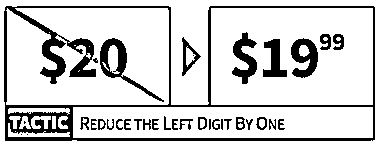

# 1999 这种定价为什么有效？

> 原文：[`www.yuque.com/for_lazy/thfiu8/kk3od7qnc030gzzf`](https://www.yuque.com/for_lazy/thfiu8/kk3od7qnc030gzzf)

<ne-h2 id="5377bc03" data-lake-id="5377bc03"><ne-heading-ext><ne-heading-anchor></ne-heading-anchor><ne-heading-fold></ne-heading-fold></ne-heading-ext><ne-heading-content><ne-text id="ubbb95868">(70 赞)1999 这种定价为什么有效？</ne-text></ne-heading-content></ne-h2> <ne-p id="ub303f94b" data-lake-id="ub303f94b"><ne-text id="ucf6a03f6">作者： 小马宋</ne-text></ne-p> <ne-p id="u7076f382" data-lake-id="u7076f382"><ne-text id="u03d533d7">日期：2023-08-17</ne-text></ne-p> <ne-p id="udaf2b171" data-lake-id="udaf2b171"><ne-text id="ud6f2e399">1999 这种定价为什么有效？</ne-text></ne-p> <ne-p id="u0d7eac26" data-lake-id="u0d7eac26"><ne-text id="u427e49d9">本文节选自我几年前的公号文章。</ne-text></ne-p> <ne-p id="u7b95eb54" data-lake-id="u7b95eb54"><ne-text id="u3c9ffdb3">附图是“Gumroad’s sales”的不同定价对应的销售量</ne-text></ne-p> <ne-p id="u70029569" data-lake-id="u70029569"><ne-text id="u31cc7a84">粗看这个表，很多人会认为功劳在于价格中的数字 9。其实还有一个因素居功至伟：小数点左边的数字（下文简称左数字）。</ne-text></ne-p> <ne-p id="ub59e3575" data-lake-id="ub59e3575"><ne-text id="uf057cfb9">其实当左数字变化的时候，心理定价策略最为有效。从$3.80 到$3.79 这种小数点右侧 1 美分的价格变化无足轻重，但$3.00 到 $2.99 这样的 1 美分的左数字变化就让价格认知产生了完全的不同。</ne-text></ne-p> <ne-p id="u394c805d" data-lake-id="u394c805d"><ne-text id="u9471aa95">左数字为何如此重要？因为它能够锚定感知量级。</ne-text></ne-p> <ne-p id="u943947ea" data-lake-id="u943947ea"><ne-text id="u21c17bf4">我们大脑转换数字的过程是飞速且无意识的，甚至在我们念完价格之前就完成了。学者 Thomas 和 Morwitz (2005)是这么解释的：</ne-text></ne-p> <ne-p id="ua1d7ee73" data-lake-id="ua1d7ee73"><ne-text id="u7a329167">“……当我们眼球看到‘2’这个数字的时候，大脑已经开始解读‘2.99’这个数字了。这个过程中，用左数字 2 定位的 2.99 看上去就比用 3 定位的 3.00 低很多” (pp. 55).</ne-text></ne-p> <ne-p id="u6a82d7cf" data-lake-id="u6a82d7cf"><ne-text id="u31179ccd">进阶技巧：您可以通过视觉上最小化小数点后的右数字位数来强调新的基数（左数字）。</ne-text><ne-card data-card-name="image" data-card-type="inline" id="n0tIx" data-event-boundary="card">  <ne-p id="uf98f3acb" data-lake-id="uf98f3acb"><ne-card data-card-name="image" data-card-type="inline" id="oJ8dv" data-event-boundary="card">  <ne-hole id="u3bc17463" data-lake-id="u3bc17463"><ne-card data-card-name="hr" data-card-type="block" id="BtsJJ" data-event-boundary="card"><ne-p id="u6d75b62c" data-lake-id="u6d75b62c"><ne-text id="uf7d928c4">评论区：</ne-text></ne-p> <ne-p id="u05edf77e" data-lake-id="u05edf77e"><ne-text id="uf3d50355">Eilvo : 之前我卖咖啡的时候也是采用这种策略，定价全都是 6.88，12.88 这样，效果十分不错。</ne-text></ne-p> <ne-p id="u4bcc079f" data-lake-id="u4bcc079f"><ne-card data-card-name="image" data-card-type="inline" id="s1eJf" data-event-boundary="card">  <ne-hole id="u440cad30" data-lake-id="u440cad30"><ne-card data-card-name="hr" data-card-type="block" id="S4Mec" data-event-boundary="card"></ne-card></ne-hole></ne-card></ne-p></ne-card></ne-hole></ne-card></ne-p></ne-card></ne-p>