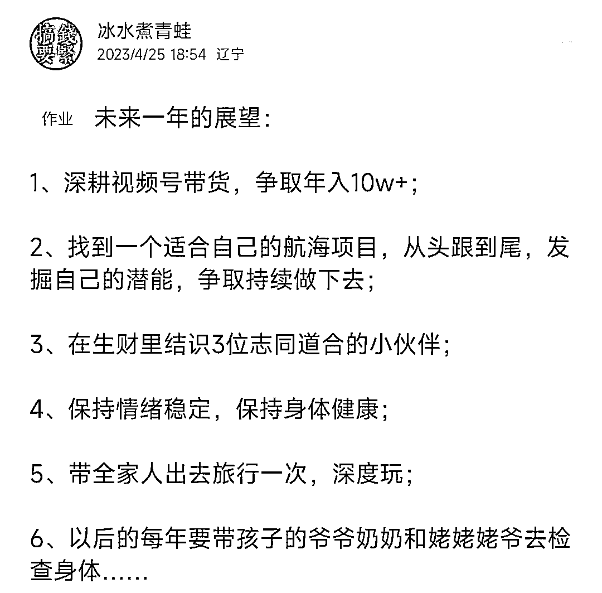
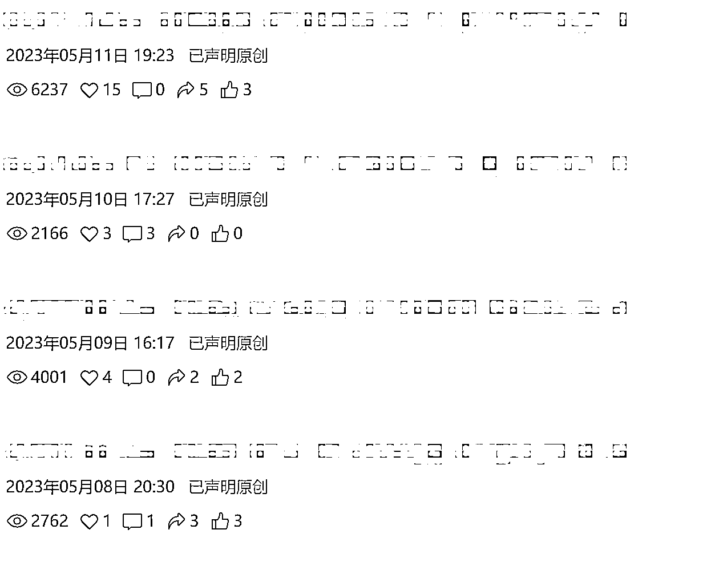
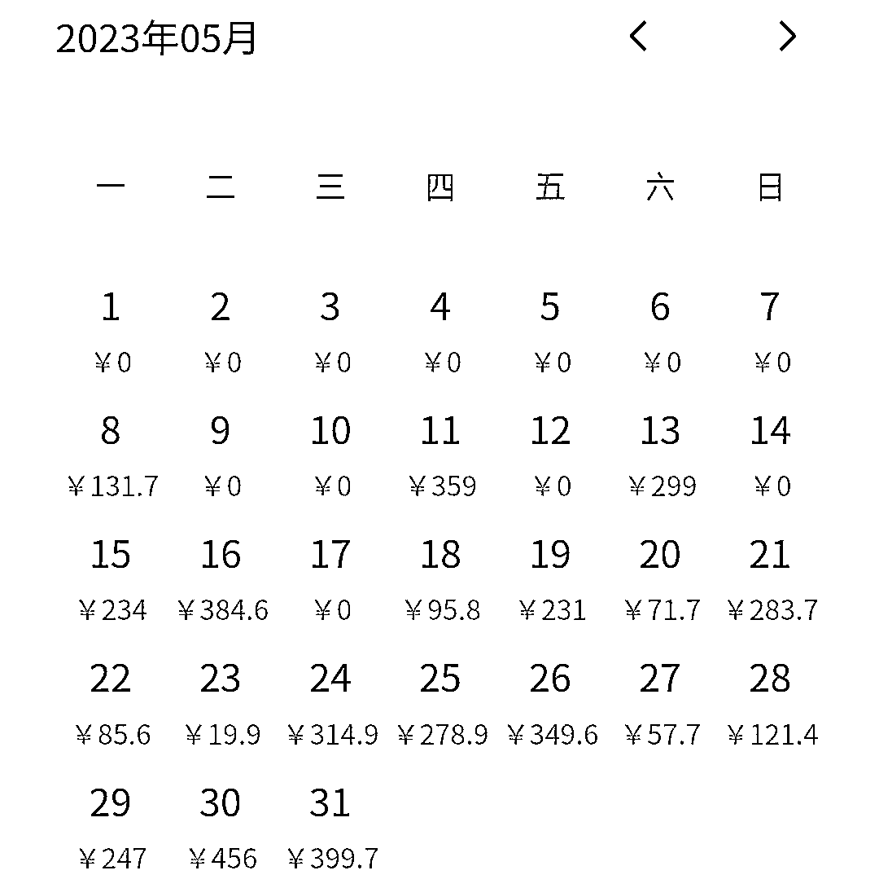

# 月薪 4000 离职后，参加生财有术航海变现 4W+，我做对了什么？

> 原文：[`www.yuque.com/for_lazy/thfiu8/fnep6k7mvyn2pc48`](https://www.yuque.com/for_lazy/thfiu8/fnep6k7mvyn2pc48)

<ne-h2 id="427da815" data-lake-id="427da815"><ne-heading-ext><ne-heading-anchor></ne-heading-anchor><ne-heading-fold></ne-heading-fold></ne-heading-ext><ne-heading-content><ne-text id="u09240358">(精华帖)(429 赞)月薪 4000 离职后，参加生财有术航海变现 4W+，我做对了什么？</ne-text></ne-heading-content></ne-h2> <ne-p id="uf6ba1283" data-lake-id="uf6ba1283"><ne-text id="ub66d7441">作者： 冰水煮青蛙</ne-text></ne-p> <ne-p id="u521550d7" data-lake-id="u521550d7"><ne-text id="u0c3e3e76">日期：2023-08-18</ne-text></ne-p> <ne-p id="ue4963c4e" data-lake-id="ue4963c4e"><ne-text id="ue2e76db6" ne-bold="true">月薪 4000，负债几万，还被迫离职，你会怎么办？放弃还是拼搏？</ne-text></ne-p> <ne-p id="uad6f5f3d" data-lake-id="uad6f5f3d"><ne-text id="u04cb2dae" style="color: rgb(31, 35, 41);">大家好，我是冰水煮青蛙，来自五线养老型城市，在今年年初，这些沉重的关键词正重压了在我身上时，我选择了赌上一次。</ne-text></ne-p> <ne-p id="ue4da157f" data-lake-id="ue4da157f"><ne-text id="u82251a1a">曾有新公司的邀约近在眼前，但我选择了成为一名自由职业者，寄希望于居家办公带给我的新生活。但真正的创业之路比我想象的还要坎坷，离职的第一个月，只赚到了 1000 多元。每个月收入微薄，压力和焦虑如影随形。</ne-text></ne-p> <ne-p id="ucfe4b9aa" data-lake-id="ucfe4b9aa"><ne-text id="u0cb10699">五一前，我给自己定了一个目标：月入过万。否则，我就去送外卖或工地搬砖。可时间在流逝，而希望却遥不可及。每次看到别人的成功故事，我总会问自己：“为什么别人可以，我却不行呢？”</ne-text></ne-p> <ne-p id="ucd0b5ff3" data-lake-id="ucd0b5ff3"><ne-text id="ub88021c3">幸运的是，4 月份，一个转机出现在我的生活中——【生财有术】。听说这里面有无数的赚钱项目分享，虽然入会费需要 2000 元，对我而言是一笔不小的支出，但我知道这可能是我唯一的机会，所以毫不犹豫地加入了他们。</ne-text></ne-p> <ne-p id="u20bb1ef3" data-lake-id="u20bb1ef3"><ne-text id="u17e90201">而事实证明，我的选择是正确的。从月薪 4000 到赚取 4W+，这是我的生财之路。</ne-text><ne-text id="u83576c9a" style="color: rgb(31, 35, 41);">接下来我想聊聊加入生财后的心路历程，希望对你有用。</ne-text></ne-p> <ne-h3 id="39da3fa2" data-lake-id="39da3fa2"><ne-heading-ext><ne-heading-anchor></ne-heading-anchor><ne-heading-fold></ne-heading-fold></ne-heading-ext><ne-heading-content><ne-text id="ua04098e2" style="color: rgb(31, 35, 41);">一、加入生财后为什么选择做“视频号”，并参加视频号航海？</ne-text></ne-heading-content></ne-h3> <ne-p id="u6976bc16" data-lake-id="u6976bc16"><ne-text id="u8f2c0d52" style="color: rgb(31, 35, 41);">刚加入生财，这里面的信息海海的，说实话，超级迷茫，不知道该从哪里入手。还好，生财团队超级贴心，发布了新手村活动。可最开始我是不想参加的，因为那时没做出来成绩，比较自卑，我就想我也没啥可提供的价值，也帮不了别人，参加有啥用。</ne-text></ne-p> <ne-p id="u905cf22c" data-lake-id="u905cf22c"><ne-text id="uc8767e52">参加有啥用？夜深人静的时候，我又问了一遍我自己。然后心里另一个自己突然冒出来一句：</ne-text></ne-p> <ne-p id="u07a50ece" data-lake-id="u07a50ece"><ne-text id="uf708a500">那你来生财干嘛？我：赚钱啊！就你这样，连活动都不参加，能赚什么钱？</ne-text></ne-p> <ne-p id="u68509c37" data-lake-id="u68509c37"><ne-text id="u2483a5ce">当时一下，我就惊醒了。是啊，凡事不都是从小事做起来的吗？再说了，没价值，帮不了别人，也只是我以为的。先完成，再完美，真诚去对待每一件事，结果一定不会差的。</ne-text></ne-p> <ne-p id="udf8ef29b" data-lake-id="udf8ef29b"><ne-text id="u72a06489">就这样，我跟着新手村的任务，开始闯关思考，写下了未来一年的展望：</ne-text></ne-p> <ne-p id="u5b34f14d" data-lake-id="u5b34f14d"><ne-card data-card-name="image" data-card-type="inline" id="ApGog" data-event-boundary="card"></ne-card></ne-p> <ne-p id="uf2c1cef5" data-lake-id="uf2c1cef5"><ne-text id="u0eaa4c4c" style="color: rgb(31, 35, 41);">是的，第一条就是深耕视频号带货，因为当时我有一个视频号的粉丝已经破千了，而且之前还用过一个号同步过其他平台剪辑好的视频，也出了几单。所以在思考过后我想先从视频号这一项目入手，真正完成从 0 到 1。</ne-text></ne-p> <ne-p id="u7a2cfb24" data-lake-id="u7a2cfb24"><ne-text id="u19f860b8">当然，这中间也有波折，就是在完成后面的新手村作业中，我发现 5 月份航海有很多项目，其中小红书和短剧 CPS，我也挺感兴趣，按捺不住想尝试一下。</ne-text></ne-p> <ne-p id="u25f29f90" data-lake-id="u25f29f90"><ne-text id="u7a50cdcd">幸好，我报名了 5 月份的航海志愿者，这个身份帮我做了选择。因为志愿者要求有第一志愿，第二志愿，我必须把我感兴趣的项目排个序。而且志愿者还要求不能参加实战航海，这也就意味着我只能三选一，不再纠结。</ne-text></ne-p> <ne-p id="ued87ad1f" data-lake-id="ued87ad1f"><ne-text id="u9019432d">现在看，我当时其实犯了一个大多数人都会犯的错误，就是既要，也要。既想要追小红书的风口，也想要在短剧上分一杯羹，同时视频号还不想放弃。可是对于刚起步的我来说，与其把鸡蛋分开几个篮子装，不如集中到一个篮子中，然后去竭尽所能，争取用这一篮子的鸡蛋，创造更大的价值。</ne-text></ne-p> <ne-p id="u03e2a7ad" data-lake-id="u03e2a7ad"><ne-text id="uada8f278" style="color: rgb(31, 35, 41);">再补一句：</ne-text><ne-text id="u53f3ff25" ne-bold="true">当我们把一个项目跑通了，其中的底层逻辑也同样适用于其他项目，到那时候有精力再想做，也会事半功倍。</ne-text></ne-p> <ne-h3 id="d6a1a466" data-lake-id="d6a1a466"><ne-heading-ext><ne-heading-anchor></ne-heading-anchor><ne-heading-fold></ne-heading-fold></ne-heading-ext><ne-heading-content><ne-text id="u5f5d7537" style="color: rgb(31, 35, 41);">二、模仿永远是最快的成长方式</ne-text></ne-heading-content></ne-h3> <ne-p id="udd12a2da" data-lake-id="udd12a2da"><ne-text id="u026ba89a" style="color: rgb(31, 35, 41);">一个项目从 0 到 1，最难的就是第一步。我最开始做的一个号，因为闲置了很久，我就想先发些流量视频测试下，如果数据好，再发带货视频，也能事半功倍。</ne-text></ne-p> <ne-p id="u4ec7e1ae" data-lake-id="u4ec7e1ae"><ne-text id="uc5577b92" style="color: rgb(31, 35, 41);">可现实是残酷的，我发了一段时间后，流量很惨淡，本想会有流量扶持，也没有。于是抱着破罐子破摔的心态，决定直接带货，发带货视频。因为我想了一下，本身我的目标就是赚钱，既然引流这条路没走通，那就试试别的路被，如果发带货视频，流量还不行，那就换号。</ne-text></ne-p> <ne-p id="ua650f211" data-lake-id="ua650f211"><ne-text id="u4cd0febd">想到就立马做，在做之前，我简单复盘了一下，为什么我当初发流量视频，数据不好？其实是因为我想当然了。我上面提到过，我还有一个视频号，同步其他平台剪辑好的视频也出了几单，但很快就违规了。</ne-text></ne-p> <ne-p id="u59d6ee1c" data-lake-id="u59d6ee1c"><ne-text id="ua2bbb3b0">所以这次做视频号，我给自己定的方向就是原创，哪怕最开始的流量视频也是。这就面临一个问题，我发的视频基本是感动了自己，让别人划走了。因为根本就没有爆款结构，什么黄金 3 秒样样没有。</ne-text></ne-p> <ne-p id="ua9b39c0d" data-lake-id="ua9b39c0d"><ne-text id="u090d5c31">复盘到这里，我明白一个道理：</ne-text><ne-text id="u196adddc" ne-bold="true">作为新手，模仿永远是最快的成长方式，也能够最快拿到正反馈。</ne-text></ne-p> <ne-p id="uc7859629" data-lake-id="uc7859629"><ne-text id="u508e5b3f">于是，我找了几个对标账号，看他们目前都在带什么货，流量怎么样？恰巧被我发现一个品的流量还不错，销量也可以，正好家里还有样品，我就把这个品的爆款视频找到，下载下来，一比一模仿实拍，文案和音频全用它的，等视频发上去后，流量一下就跑到了 2000 多。</ne-text></ne-p> <ne-p id="udde2847e" data-lake-id="udde2847e"><ne-card data-card-name="image" data-card-type="inline" id="hJCJz" data-event-boundary="card"></ne-card></ne-p> <ne-p id="u09c476b3" data-lake-id="u09c476b3"><ne-text id="u57e2f73c">看上面的图，差距还是很明显的。尝到了甜头以后，同样的品，我又连续发了 3 天，基本上每天都有几千播放，</ne-text><ne-text id="u2d43df1f" ne-bold="true">而就在第三天，我也终于盼到了第一单，赚了差不多小 90 元的佣金，拿到了正反馈。</ne-text></ne-p> <ne-p id="u78bd8739" data-lake-id="u78bd8739"><ne-card data-card-name="image" data-card-type="inline" id="xT70H" data-event-boundary="card"></ne-card></ne-p> <ne-p id="ueab85be1" data-lake-id="ueab85be1"><ne-text id="u3cce97ec">说实话，这一单给了我很大的信心，我开始加大力度做。首先是选品，我没考虑什么蓝海红海的品，开始时，我就去刷同行的视频，看他们带什么品，记下来，然后去选品中心找品，看商家的评分，还有销量。一般评分是“中”，在 4.2 分以上就可以考虑，品的销量最好在 1W+左右。</ne-text></ne-p> <ne-p id="u455b5538" data-lake-id="u455b5538"><ne-text id="ufaf5e436">另外还有一点，我上面出第一单的这个品，客单价太高了，相对不那么容易出单，所以再选品的时候，我就调低了客单价，选了一些 19.9,29.9 的品。品选完以后就是购买了。我最开始是买了 3 个品，挂在视频号橱窗上，用小号去买。因为这样也能适当的提升下橱窗销量。</ne-text></ne-p> <ne-p id="u19f8c849" data-lake-id="u19f8c849"><ne-text id="ua8fd60ce">等买的样品到了以后，我开始每天发 3 条视频，方法就是按照上面讲的，模仿爆款。这样做，流量基本上每条都能保持在几千，好一点甚至能破万，出单也陆陆续续的再出。</ne-text></ne-p> <ne-p id="u46368234" data-lake-id="u46368234"><ne-card data-card-name="image" data-card-type="inline" id="O64E0" data-event-boundary="card"></ne-card></ne-p> <ne-p id="ue9355b1d" data-lake-id="ue9355b1d"><ne-text id="ucb994da0">这里提醒下大家，如果视频号的流量不错，至少要做这两件事：</ne-text></ne-p> <ne-p id="uf2d07024" data-lake-id="uf2d07024"><ne-text id="u8a5083cc">1、</ne-text><ne-text id="u504420df" ne-bold="true">一定要开播转化。</ne-text><ne-text id="u8dfcd39c">尤其是还没有到 1000 粉，挂不了车的时候。我当时就没考虑到这一点，浪费了很多机会。</ne-text></ne-p> <ne-p id="u6d4116fb" data-lake-id="u6d4116fb"><ne-text id="u3b2766e5">2、</ne-text><ne-text id="u09c64b05" ne-bold="true">一定要主动出击，联系商家。</ne-text><ne-text id="u64176e9d">询问是否可以合作，寄样品等等，一般商家都会同意的，有个别商家会让你自己先买，等达到单数在返，总之不管怎么样，能跟商家联系上，对我们的带货，只有好处，没有坏处。</ne-text></ne-p> <ne-p id="ua236e905" data-lake-id="ua236e905"><ne-text id="uac39fa0b">当然，商家这块，除了主动出击，还会有商家主动联系你的，这时候别拒绝，先看看对方的店铺和诚意，感觉好了就合作，感觉不好，就当学习了。</ne-text></ne-p> <ne-p id="ub8522a94" data-lake-id="ub8522a94"><ne-text id="u342997d3">我现在出单比较多的品，基本来自于一个商家，他们就是主动联系的我，我最开始买的样品也是他们家的。其实跟商家沟通，主要还是靠谱和真诚。我就拿这个商家举例吧，现在我们联系的比较多，有新品或者流量比较好的品，都会主动给我寄样。</ne-text></ne-p> <ne-p id="u58d38978" data-lake-id="u58d38978"><ne-text id="u4917eb4e">最开始他加我的时候，就推荐了一个新品，问我有没有兴趣带，我一搜，看这个品之前爆过，就要了，但回来后拍了一个视频，效果不理想，我就主动跟商家说明了情况。就是大家一定要注意，如果跟商家申请了样品，到了以后，一定要第一时间出视频，如果有特殊情况，也要及时报备，不要等商家问起来再说，做事靠谱是会给商家留下好印象的。</ne-text></ne-p> <ne-p id="u9b15c67b" data-lake-id="u9b15c67b"><ne-text id="u7499a476">另外你用没用心推商家的品，商家也都知道。我一般就是流量好的品，会一直发，不好了，也会跟商家沟通，或者商家主动联系我，给我发最近流量不错的视频，让我参考。有时候看到别人爆单，自己还很羡慕，跟商家提，商家会说：只要坚持，你也可以。</ne-text></ne-p> <ne-p id="ufb61300f" data-lake-id="ufb61300f"><ne-text id="u9f9e7e2a">确实，我最开始做的那个号，虽然没有过大爆，但日出 100 多单也有过 2 次，这两次都离不开商家的支持。因为我每次要放弃的时候，商家就跟我说哪个博主爆了...这个品流量还不错，你再试试..等等的话。</ne-text></ne-p> <ne-p id="u1277eaea" data-lake-id="u1277eaea"><ne-text id="uebb5c615">所以大家一定要跟商家搞好关系，这样就算你不太会选品，跟着商家走，有时候也可能喝到一口汤，而这一点，我觉得是初期比较好做，容易拿到正反馈的。</ne-text></ne-p> <ne-h3 id="11579fc7" data-lake-id="11579fc7"><ne-heading-ext><ne-heading-anchor></ne-heading-anchor><ne-heading-fold></ne-heading-fold></ne-heading-ext><ne-heading-content><ne-text id="udb31d2cf" style="color: rgb(31, 35, 41);">三、新的挑战在等着我，航海不止步</ne-text></ne-heading-content></ne-h3> <ne-p id="u001b363f" data-lake-id="u001b363f"><ne-text id="u39e8dae7" style="color: rgb(31, 35, 41);">目前为止，一共做了 4 个视频号。</ne-text></ne-p> <ne-p id="uf81bfee9" data-lake-id="uf81bfee9"><ne-text id="u2c905e71" style="color: rgb(31, 35, 41);">其中有一个视频号，当时脑子短路，流量很好，但没到 1000 粉丝，我就跑去发流量视频了，虽然一条视频破百万播放，粉丝也到了 2000 多，但因为违规了，即使发了自证视频，现在流量也是不温不火。</ne-text></ne-p> <ne-p id="ua583edd1" data-lake-id="ua583edd1"><ne-text id="u4ff22b3b" style="color: rgb(31, 35, 41);">于是我就暂时先不做这个号了，把精力和收获到的经验用在了新号上，目前半个月的时间，新号粉丝破千，佣金也达到了 1W+。所以有时候有问题不怕，怕的是陷入这个问题出不来，一直在纠结。其实有纠结的时间，还不用把它用在更有意义的事情上。</ne-text></ne-p> <ne-p id="u4357ef20" data-lake-id="u4357ef20"><ne-text id="ud2f036e1" style="color: rgb(31, 35, 41);">还有一个号，也是原创的，不过也违规了，说是非原创、优质视频。当时真的，就很纳闷，明明是自己拍的，怎么就非原创了呢？</ne-text></ne-p> <ne-p id="u8de0d9e0" data-lake-id="u8de0d9e0"><ne-text id="u3c40167c" style="color: rgb(31, 35, 41);">后来冷静下来分析，我大概知道，即使原创视频也要做适当的去重，而且文案最好修改下，尽量做到不一样。所以有时候有问题也是好事，可以汲取经验，让以后做的更好。</ne-text></ne-p> <ne-p id="uacb2b20a" data-lake-id="uacb2b20a"><ne-text id="uea45ebaf" style="color: rgb(31, 35, 41);">现在我又遇到了一个做视频号以来，比较难的点了。几个号陆陆续续违规，视频号团队相继发来优化建议，流量也不好。可是同样类型的视频，其他博主发的风生水起，我能咋办呢？</ne-text></ne-p> <ne-p id="ue7e36723" data-lake-id="ue7e36723"><ne-text id="u3e5acd61" style="color: rgb(31, 35, 41);">兵来将挡，水来土掩，针对这个问题，我准备再开几个号，换个赛道去做，试试看，我觉得视频号做到现在，还是一个不断挑战自己的过程，自己不能怂，怂了，还想挣钱，怎么可能。</ne-text></ne-p> <ne-p id="uf106c087" data-lake-id="uf106c087"><ne-text id="u5f59683e" style="color: rgb(31, 35, 41);">就像亮剑似的，遇到问题得敢于亮剑，</ne-text><ne-text id="u1a8f0955" ne-bold="true">拿出狭路相逢勇者胜的心态，才有可能所向披靡</ne-text><ne-text id="u37f91335" style="color: rgb(31, 35, 41);">，一步步提升自己，越做越好。</ne-text></ne-p> <ne-h3 id="9039450f" data-lake-id="9039450f"><ne-heading-ext><ne-heading-anchor></ne-heading-anchor><ne-heading-fold></ne-heading-fold></ne-heading-ext> <ne-heading-content></ne-heading-content></ne-h3> <ne-h3 id="0295e841" data-lake-id="0295e841"><ne-heading-ext><ne-heading-anchor></ne-heading-anchor><ne-heading-fold></ne-heading-fold></ne-heading-ext><ne-heading-content><ne-text id="u22353928" style="color: rgb(31, 35, 41);">四、一个人走的很快，一群人走的更远</ne-text></ne-heading-content></ne-h3> <ne-p id="u3cb1f79f" data-lake-id="u3cb1f79f"><ne-text id="uc67b86a4" style="color: rgb(31, 35, 41);">很感谢生财团队的航海行动、续航计划和再续航计划。因为当我们选择一个项目后，我们能做的就是全力以赴的去死磕它，用时间去战胜它，当我们一直不下牌桌，赢的很可能就是我们自己。</ne-text></ne-p> <ne-p id="u7e763409" data-lake-id="u7e763409"><ne-text id="u516f6ee6" style="color: rgb(31, 35, 41);">另外我们都听过，</ne-text><ne-text id="u8de11aca" ne-bold="true">一个人可能走的很快，但一群人才能走的更远</ne-text><ne-text id="uacddda3f" style="color: rgb(31, 35, 41);">。航海里面的大佬们都是坚持一件事很长时间了，都是有结果的人，我们能够跟着他们一起走，多幸运。所以请珍惜每一次的航海机会，拿出 120% 去做，不成功便成仁，相信自己，一定可以，加油。</ne-text></ne-p> <ne-p id="u9854f60c" data-lake-id="u9854f60c"><ne-text id="ucccb6470" style="color: rgb(31, 35, 41);">哦对了，对于还没有拿到结果的圈友来说，先别考虑什么红海蓝海了，找一个适合自己的先做，当你做到一定程度在考虑也来得及，要不然浪费了时间，最后的选择还不一定对。</ne-text></ne-p> <ne-p id="u406f8860" data-lake-id="u406f8860"><ne-text id="u6dd1aa59" style="color: rgb(31, 35, 41);">最后，很开心我们相遇在生财，期待在不远的未来，我们都能实现自己的目标，加油！</ne-text></ne-p> <ne-hole id="u142417c0" data-lake-id="u142417c0"><ne-card data-card-name="hr" data-card-type="block" id="iiQ8u" data-event-boundary="card"><ne-p id="u347390ab" data-lake-id="u347390ab"><ne-text id="u1fb9cfcb">评论区：</ne-text></ne-p> <ne-p id="u8adca173" data-lake-id="u8adca173"><ne-text id="u58c0858c">书情小跟班 : 优秀</ne-text> <ne-text id="u8ce46763">冰水煮青蛙 : ❤️❤️❤️</ne-text> <ne-text id="u924f300a">冰水煮青蛙 : 感谢大家，感谢生财，8 月航海一起加油[呲牙]</ne-text> <ne-text id="ub019e7f5">陈真 : 牛的</ne-text> <ne-text id="uae7489f9">东哥 : 新人 今年 4 月加入，航海每次 1-2 个项目；5 月航海 6 月续航赚取 4 万+，视频号共 4 个账号，航海日志 第二天开始经常出单，后面每天经常百单非常不错。账号不多 后台佣金等数据截图出来会更好(账号名称/带货产品等敏感信息记得打马赛克)。</ne-text> <ne-text id="u5d3007ca">向^前 : 优秀[强]</ne-text> <ne-text id="u8c9bd8c9">枸艾梦 : 生财新星</ne-text> <ne-text id="uf593617f">冰水煮青蛙 : 一起生财[呲牙]</ne-text></ne-p> <ne-p id="u1b7dd692" data-lake-id="u1b7dd692"><ne-card data-card-name="image" data-card-type="inline" id="TPBdS" data-event-boundary="card">  <ne-hole id="u3771092d" data-lake-id="u3771092d"><ne-card data-card-name="hr" data-card-type="block" id="wgoum" data-event-boundary="card"></ne-card></ne-hole></ne-card></ne-p></ne-card></ne-hole>