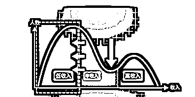

# 创业 2 年，给还在职场打工的你的一封信

> 原文：[`www.yuque.com/for_lazy/thfiu8/toi8idfaxkum5gbs`](https://www.yuque.com/for_lazy/thfiu8/toi8idfaxkum5gbs)

<ne-h2 id="e7169785" data-lake-id="e7169785"><ne-heading-ext><ne-heading-anchor></ne-heading-anchor><ne-heading-fold></ne-heading-fold></ne-heading-ext><ne-heading-content><ne-text id="ub695ade3">(精华帖)(322 赞)创业 2 年，给还在职场打工的你的一封信</ne-text></ne-heading-content></ne-h2> <ne-p id="ud1e92967" data-lake-id="ud1e92967"><ne-text id="uc8559876">作者： 老瞿 Qu</ne-text></ne-p> <ne-p id="ud7ade28d" data-lake-id="ud7ade28d"><ne-text id="u865d7e4b">日期：2023-08-17</ne-text></ne-p> <ne-p id="uedb698ae" data-lake-id="uedb698ae"><ne-text id="u5309ca67">大家好，我是老瞿 Qu，生财有术最懂二手书的男人。</ne-text></ne-p> <ne-p id="u3e421804" data-lake-id="u3e421804"><ne-text id="u2fb426a0">一个农村娃靠读书考上一所 211 大学，留在大城市的小镇做题家。</ne-text></ne-p> <ne-p id="u5ce7de2c" data-lake-id="u5ce7de2c"><ne-text id="u2d12e1c6">也是一个在传统的房地产行业踏踏实实奋斗了 8 年，花了 2 年艰辛的完成转型的 30+中年人，转型的过程中走过很多弯路，目前的成绩如下：</ne-text></ne-p> <ne-p id="u9e900065" data-lake-id="u9e900065"><ne-text id="ucfa2758c">1、居住的小区有一个小工作室，做闲鱼二手书项目，目前运营帐号 30+，平均月利润 10W+，已经持续一年+；</ne-text></ne-p> <ne-p id="u65862216" data-lake-id="u65862216"><ne-text id="uacf2485e">2、2023 年开始做二手书的知识付费，目前付费会员 500+，合伙人 20 个，平均月利润 10W+，已经持续 6 个月。</ne-text></ne-p> <ne-p id="u0b4a64b7" data-lake-id="u0b4a64b7"><ne-text id="u6d31884e">我在上大学的时候，当时比较崇拜李开复，那个时候他给大学生写的 7 封信，年轻的我读了很多遍，刚好最近又不小心翻出来，觉得真的挺有意义一件事，虽然当年领悟的还不够深刻。</ne-text></ne-p> <ne-p id="u800638d3" data-lake-id="u800638d3"><ne-text id="uabb162db">所以今天想用创业 2 年，成功转型自由职业者的经验，给还在职场打工的你写一封信，这封信不能让你马上每天 2 小时月入轻松过万，但如果你看进去了，应该能让你少走很多弯路。</ne-text></ne-p> <ne-p id="u50e25d71" data-lake-id="u50e25d71"><ne-text id="ub6b1f2db">这里说的职场打工人主要包含在企业上班的白领等，因为目前号称是一个中产破产的时代，对这批人的影响是最大的，无论从收入、晋升、还是未来的选择。</ne-text></ne-p> <ne-h3 id="4643e7da" data-lake-id="4643e7da"><ne-heading-ext><ne-heading-anchor></ne-heading-anchor><ne-heading-fold></ne-heading-fold></ne-heading-ext><ne-heading-content><ne-text id="ua2a32c36">一、承认这个时代已经变了</ne-text></ne-heading-content></ne-h3> <ne-p id="uae976d22" data-lake-id="uae976d22"><ne-text id="uaddb2898">你有没有思考过一个问题，就是这个时代是不是真的已经变了？大家都说这是一个中产破产的时代，你觉的是危言耸听，还是真实的情况？</ne-text></ne-p> <ne-p id="ubaa37bd6" data-lake-id="ubaa37bd6"><ne-text id="u3a4e4108">今年刚好是我大学毕业的第 10 年，10 年前我凭借一所 211 大学的本科学历，还能进入到一所世界 500 强的房企，然后凭着自己的努力，8 年的时间，从员工到主管到经理到总监，最后也能号称年薪百万。</ne-text></ne-p> <ne-p id="u9d0a5612" data-lake-id="u9d0a5612"><ne-text id="ude8bee5f">而如今我才离开房地产行业创业 2 年，2021 年我在的时候，某 TOP 房企江苏区域 300+员工，如今已经裁的只剩下 70 多人，恒大、碧桂园这种曾经的 TOP1-3 的房企开始资不抵债，互联网大厂在疫情放开后，也开启了裁员模式，大批曾经的网红独角兽企业居然都破产了。</ne-text></ne-p> <ne-p id="u4ae7a4f0" data-lake-id="u4ae7a4f0"><ne-text id="uc567e808">同时只要稍微关注一下现在的大学生就业情况，就会发现，如今一个 211 学历很难有机会进入一个世界 500 强公司，市场上留给大学生的岗位越来越少，而职场打工人再也不可能轻易的在某个行业实现年入百万了。</ne-text></ne-p> <ne-p id="uac188bc6" data-lake-id="uac188bc6"><ne-text id="u91e2c5f2">在网上看过一张图，挺认可的，因为我以及我的同事，都算得上是曾经的中收入人群，目前我看着一个个都在面临中年危机，尝试谋求转型。</ne-text></ne-p> <ne-p id="u6d68b737" data-lake-id="u6d68b737"><ne-text id="u2599cde7">以前社会的收入是山丘型，中等收入人群会最多，只要你有个文凭，然后各方面能力还凑合，进入到一个大企业，年入 20-30W 并不是难事，熬个 5-10 年，到一个小领导，年入百万也不是没有可能，因为以前企业都在蓬勃发展，有大量的机会，需要大量的人才，比如那个时候房地产公司，去一个新的城市拿个项目，你就能从一个项目总监干成总经理。</ne-text></ne-p> <ne-p id="uc6b1753e" data-lake-id="uc6b1753e"><ne-card data-card-name="image" data-card-type="inline" id="ldeMt" data-event-boundary="card"></ne-card></ne-p> <ne-p id="u84fe6857" data-lake-id="u84fe6857"><ne-text id="ud203bb11">而现在社会的收入分布即将会进入 M 型结构，就是中收入人群被无情压缩了，大部分转化成了低收入人群，有少部分人通过一些你曾经看不懂的方式成为高收入人群，比如网红、提示词工程师等。网红以前我们都是看不起的，而提示词工程师估计很多读者都不知道是什么鬼。</ne-text></ne-p> <ne-p id="uf00af915" data-lake-id="uf00af915"><ne-card data-card-name="image" data-card-type="inline" id="Gy46u" data-event-boundary="card"></ne-card></ne-p> <ne-p id="u82102f2d" data-lake-id="u82102f2d"><ne-text id="u209b8dec" ne-bold="true">你有没有想过为什么会发生这种情况？</ne-text></ne-p> <ne-p id="u23999ab7" data-lake-id="u23999ab7"><ne-text id="ubc5a3ba6">主要就是因为随着社会的发展，城市化的进程，很多基础建设都完成了，这个基础建设比如我们的房子，够住了，导致地产行业从开始的增长放缓到今天的开始暴雷了，当年那批房地产高收入人群失业了。</ne-text></ne-p> <ne-p id="ud85a1ac8" data-lake-id="ud85a1ac8"><ne-text id="u5209e48c">再比如以前每个公司做互联网都需要做一款 APP，就需要大量的开发人员，而现在大的 APP 已经占领市场，而且很多 sass 软件已经特别的成熟，比如你做知识付费就用知识星球或者小鹅通就够了，根据不需要去开发什么自己的 APP，那么这批曾经的互联网精英也不需要了。</ne-text></ne-p> <ne-p id="u359c06db" data-lake-id="u359c06db"><ne-text id="u5aa1b57e" ne-bold="true">所以我们现在需要做的第一件事就是：意识到这个时代要开始变化了，承认并接受变化真的非常重要，只有拥抱这个时代，你才能抓住机会继续留在中收入区域，甚至可以越级到高收入人群。</ne-text></ne-p> <ne-p id="u62e77c02" data-lake-id="u62e77c02"><ne-text id="ufa8ffe04">而如果你还是把观念停留在过去，一心想着努力高考，然后靠着一份不错的学历，或者努力做一个忠诚的打工者就想继续保住自己的收入，已经越来越不可能了。</ne-text></ne-p> <ne-p id="ub3d0e9d8" data-lake-id="ub3d0e9d8"><ne-text id="u8ff77739">毕竟现在滴滴开车和送外卖这两个行业，已经被失业的中年人挤爆了。目前可能主要还体现在一二线城市，而如果一旦大城市这样，更多的曾经的精英和大学生都会流向三四线小城市，向下压缩，那么他们将会取代谁的饭碗？</ne-text></ne-p> <ne-p id="uf458fef0" data-lake-id="uf458fef0"><ne-text id="u3134fe3b">所以如今还在职场的你，要做的第一件事就是接受这个时代随着发展的变化，而不要把一切都当成危言耸听，然后掩耳盗铃。</ne-text></ne-p> <ne-h3 id="f74721cb" data-lake-id="f74721cb"><ne-heading-ext><ne-heading-anchor></ne-heading-anchor><ne-heading-fold></ne-heading-fold></ne-heading-ext><ne-heading-content><ne-text id="u51ee112e">二、思考离开公司你到底能带走什么</ne-text></ne-heading-content></ne-h3> <ne-p id="u4119ba70" data-lake-id="u4119ba70"><ne-text id="u4c44a1da">假设，明天你离职了，也不去别的公司上班，作为一个独立的个体，你可以通过什么赚钱？</ne-text></ne-p> <ne-p id="u78c071df" data-lake-id="u78c071df"><ne-text id="u1f4ef723">相信绝大多数人这个时候会有点懵，从来没有想过不上班，这么多年了，感觉好像不可能不上班，但仔细一想，除了去摆地摊、送外卖、开滴滴，好像自己并没有作为一个独立个体赚钱的技能，更不要谈什么积累，因为绝大多数打工人都是这样的。</ne-text></ne-p> <ne-p id="u5535be44" data-lake-id="u5535be44"><ne-text id="u8ff0215e">就好像我也是一样，曾经 TOP30 房企最年轻的一批中层管理岗，在职场干了 8 年坐上 300 亿区域公司运营管理中心的负责人，然而当我离开职场的时候，我发现自己一无所有。我之前做房地产行业的，我可没几十个亿去拿一块地去盖房子，而且我当时在整个房地产体系中只扮演了一个环节，真有块地给我开发，可能我还不一定能干的好。</ne-text></ne-p> <ne-p id="u10867b32" data-lake-id="u10867b32"><ne-text id="u7b0aae24">所以 8 年的职场生涯在我离职的那一刻，其实并没有什么太大的帮助，因为没有什么个人赚钱方式的积累。这应该也是很多打工人的现状，只是大家还没有离开职场罢了，等你离开的时候，发现自己一无所有。</ne-text></ne-p> <ne-p id="u546cebed" data-lake-id="u546cebed"><ne-text id="u23f9afc6">这个时候最好的办法，其实就是看看身边那些成功转型的案例，我给大家列举几个我见过并羡慕的：</ne-text></ne-p> <ne-p id="ud8eb9a14" data-lake-id="ud8eb9a14"><ne-text id="u17403636">同事 A，以前我们的营销总监，在上班的时候就一直在给一款国外的红酒做代理，因为卖房子都是高端客户，他就顺带发展自己的红酒业务，有时候成交佣金比较高的时候，他还能直接给客户送一箱红酒。我曾经特别看不起他，因为我觉得他对公司不忠诚，人品不行，对不起老板开的工资，可是当我们离开地产行业以后，他转身就完成了转型，而且收入比上班还高不少，那个时候我才发现，原来那个小丑居然是自己。</ne-text></ne-p> <ne-p id="u5e96b049" data-lake-id="u5e96b049"><ne-text id="u2ddf5a60">同事 B，以前我们某个项目的营销经理，当时为了获取客户，就自己拍抖音做短视频获取流量，然后积累了 20W 的粉丝，不仅上班的时候是销冠，公司项目结束了，他离职了，马上开始用抖音给这个城市的多家楼盘引流，收入是上班的好几倍。</ne-text></ne-p> <ne-p id="uafc6ef41" data-lake-id="uafc6ef41"><ne-text id="u9b1f4151">同事 C，我们项目的一个项目经理，组建了一个地产行业工程师交流微信群，经过几年的积累，慢慢的有一万多人，几十个交流群，行情不好的时候，转型做了一个付费社群，收 199/年，因为之前他就给大家经常整理一些干货资料，很多人还记得他的好，付费社群很快就达到了 7000 多人，一百万到手了。</ne-text></ne-p> <ne-p id="u80fcb5a9" data-lake-id="u80fcb5a9"><ne-text id="ue54bf598">这是我身边看到的比较成功的转型案例，其实无论是在哪个行业，哪个岗位，只要你有心，你觉得上班只是你的一个副业，你一心想要为自己今后做一些积累，那么无论是本专业相关，还是没有相关性，其实我们都可以采取一些行动。</ne-text></ne-p> <ne-p id="u483788b2" data-lake-id="u483788b2"><ne-text id="u62a1b886">大多数时候，是因为我们把上班这个最靠不住的事业，却当成了我们人生的主业，同时没有意识到有一天离开工作岗位以后，我们的核心技能到底是什么。在以前各个行业蓬勃发展的时候，需要的劳动力较多，我们有很多选择，可是当经济下行的时候，一切就都成了问题。</ne-text></ne-p> <ne-p id="ub71406d6" data-lake-id="ub71406d6"><ne-text id="ua04f3506">而且上班的时间越久，逐渐磨灭我们一项很重要的能力，就是自己赚钱的能力，我们已经习惯有一份工作，干一天拿一天的钱，我们不会关心公司是不是赚钱，我们也不关心自己离开了能干什么，因为我们能想到的就是离开了公司再找一家公司继续上班。</ne-text></ne-p> <ne-p id="ufad95c7f" data-lake-id="ufad95c7f"><ne-text id="ua4601d22">所以如今还在职场的你，一定要举起右手摸着自己的良心问自己一个问题：假如我离开了公司，或者这个行业不行了，我也没有去其他地方上班，作为一个独立的个体，我到底能带走什么？我到底靠什么赚钱？</ne-text></ne-p> <ne-h3 id="7fdcd2f2" data-lake-id="7fdcd2f2"><ne-heading-ext><ne-heading-anchor></ne-heading-anchor><ne-heading-fold></ne-heading-fold></ne-heading-ext><ne-heading-content><ne-text id="uf6785e99">三、了解未来这个时代到底需要能力</ne-text></ne-heading-content></ne-h3> <ne-p id="u8f587dfa" data-lake-id="u8f587dfa"><ne-text id="u112659db">2023 年最击中我的一句话就是：</ne-text><ne-text id="u2c07f600" ne-bold="true">这是一个被直播和短视频裹挟着向前的时代。</ne-text><ne-text id="u1fea42d4">所以我们应该去思考一个问题，就是在当下这个时代，我们到底需要什么样的能力？</ne-text></ne-p> <ne-p id="u694adb7d" data-lake-id="u694adb7d"><ne-text id="u76848deb">如果你还没有办法回答这个问题的时候，其实我们要看看目前到底什么行业最赚钱？</ne-text></ne-p> <ne-p id="uaacef02e" data-lake-id="uaacef02e"><ne-text id="u936692c2">毫无疑问是短视频和直播，老罗靠直播还清几个亿负债，重新开始创业。新东方在双减政策以后，靠直播变成了东方甄选，成功转型活下去了，曾经的令狐冲李亚鹏，现在一堆负债，也拉着媳妇开始直播了。</ne-text></ne-p> <ne-p id="u577bc155" data-lake-id="u577bc155"><ne-text id="u6c15b6d7" ne-bold="true">那短视频和直播为什么赚钱呢？为什么那些身价过亿的明星和网红，每天还在给你推销着 9.9 包邮的商品呢？为什么那些清华北大的，甚至阿里 P10 每天直播 7-8 个小时给你推销 199 的课程？</ne-text></ne-p> <ne-p id="u77650517" data-lake-id="u77650517"><ne-text id="u85d2fb47">是因为现在是一个信息爆炸的时代，更是一个产品过剩的时代，企业没有岗位了，我们也很难在单独的靠信息差赚钱，一个赚钱的生意出来以后，可能短短一个月的时间，就会在全网散开了。</ne-text></ne-p> <ne-p id="u72e1095b" data-lake-id="u72e1095b"><ne-text id="u8b5fa678">所以当下最重要的一个能力变成了：销售。只要你能把商品卖的出去，什么产品都会求着你，要跟你合作。你要销售出去，那你就必须有流量，而目前获取流量最快的方式就是短视频，因为短视频就是当下的一种社交语言，直播就是最好的销售转化场景。</ne-text></ne-p> <ne-p id="uc97f2294" data-lake-id="uc97f2294"><ne-text id="uc715d48e">一个典型的案例就是：疯狂小杨哥，小杨哥之前是干啥的？拍恶搞视频的，可能他没有火之前，作为曾经的中产，我都不一定瞧得上他，现在通过恶搞视频有了流量以后，开始直播带货，现在每年赚几十个亿应该是比较轻松的。</ne-text></ne-p> <ne-p id="u9b0ea7ef" data-lake-id="u9b0ea7ef"><ne-text id="u0f116199">小杨哥就属于典型的拥抱了短视频和直播的人。</ne-text></ne-p> <ne-p id="u16d3f8a1" data-lake-id="u16d3f8a1"><ne-text id="uacf74e87">当然说到这里的时候，很多人会去反驳，如果说大家都做这个了，那实业兴邦呢？谁去造火箭、研究芯片？</ne-text></ne-p> <ne-p id="u5aa0302a" data-lake-id="u5aa0302a"><ne-text id="ua4588238">你说的也没有错，确实一些前沿的科技需要人去发展，瓜果蔬菜也需要人去种，但是你要搞清楚两个前提，一是现在是一个产品过剩的时代，瓜果蔬菜太多了，就看谁卖的出去。二是你一届互联网小白，能不能先养活了自己，有了钱以后，你再去用实际行动去研究芯片和火箭，而不是打嘴炮，你这样子去研究芯片和火箭，你怎么生活，家里孩子谁养活？</ne-text></ne-p> <ne-p id="ud4f7bcb6" data-lake-id="ud4f7bcb6"><ne-text id="ub3283078">但是我们会发现，传统的教育也好，或者我们在企业的打工经历也好，我们都没有销售能力，以前在房地产的时候，售楼小姐是个贬义词，我们告诉别人我是地产行业的，我们都要赶紧解释一句，我不是卖房子的。</ne-text></ne-p> <ne-p id="ud4a12f22" data-lake-id="ud4a12f22"><ne-text id="uf8d476df">因为大家天然对营销、推销会感到厌烦。在企业中绝大多数人其实并没有参与过销售，没有面对过客户。</ne-text></ne-p> <ne-p id="ua48dc82c" data-lake-id="ua48dc82c"><ne-text id="ud37ca783">所以我们会得到一个结论，未来最需要的能力就是销售能力，哪怕你没有自己的产品，你依旧可以活的很好。如果你有销售能力，在目前比较健全的生产制造环境之下，你完全可以去打造自己的产品，比如小杨甄选。</ne-text></ne-p> <ne-p id="u44bf95f8" data-lake-id="u44bf95f8"><ne-text id="u05dd577b">但如果你只有产品不懂销售，卖不出去，一切都将举步维艰，除非你这个产品具有不可替代性，但你想要达到这种高度会很难很难，不是一个普通人所能达到的。</ne-text></ne-p> <ne-p id="u179d1556" data-lake-id="u179d1556"><ne-text id="u0355434d">所以如今还在职场的你，一定要去提升自己的销售能力，而这也决定了，你最好要去拥抱短视频和直播，因为这是当下目前最直接的销售方式。</ne-text></ne-p> <ne-h3 id="ec175655" data-lake-id="ec175655"><ne-heading-ext><ne-heading-anchor></ne-heading-anchor><ne-heading-fold></ne-heading-fold></ne-heading-ext><ne-heading-content><ne-text id="u19083060">四、努力去转变自己的心态和思维方式</ne-text></ne-heading-content></ne-h3> <ne-p id="u76a189d3" data-lake-id="u76a189d3"><ne-text id="u81e463b5">当我们承认了这个时代的变化了以后，我们也确定了销售是未来一个很重要的能力，我们需要拥抱直播和短视频，接下来我们就会转型成功了？显然不是，我们一定要去转变自己的心态和思维方式。</ne-text></ne-p> <ne-p id="u48bff5aa" data-lake-id="u48bff5aa"><ne-text id="u0cd7600f">最近以前的一个地产公司的 HR 总监朋友离职了，约我吃了个饭，我惊人的发现，原来哪怕已经走出职场了以后，他的思维方式跟我刚离开地产的时候几乎没有什么区别。</ne-text></ne-p> <ne-p id="u710c24be" data-lake-id="u710c24be"><ne-text id="ubf084a93">他现在想做职业规划相关的产品，他的第一步居然是先搭建一个平台，利用自己在地产行业多年的人脉，链接到设计、工程、成本等各个专业的人，把他们培训成为咨询师，之后他就能坐在平台上抽佣。</ne-text></ne-p> <ne-p id="u6e1f86c4" data-lake-id="u6e1f86c4"><ne-text id="udab98142">他准备先花几个月把这个产品包装好，然后再去销售，同步通过基金会的形式，去跟学校合作，以做公益为出发点，然后导流去做付费的大学生职业规划。</ne-text></ne-p> <ne-p id="u1150d556" data-lake-id="u1150d556"><ne-text id="ub7e0478e" ne-bold="true">为什么他会有这样的想法和思维方式？</ne-text></ne-p> <ne-p id="ua5f394a9" data-lake-id="ua5f394a9"><ne-text id="uabd492aa">1、这样他就能完美的逃避流量的问题，逃避客户从哪里来的问题，然后做一些不需要面对销售业绩的事情上去，就跟我当初离职以后浪费了 6 个月开发 APP 一样，他们想的也是后面要开发 APP，确实惊讶到我了。</ne-text></ne-p> <ne-p id="u40c56805" data-lake-id="u40c56805"><ne-text id="uca9dc9fe">因为他不懂销售，不懂流量，所以他会不断的视图逃避，可能潜意识中，他还会觉得没有产品怎么销售？因为人性就是这样的，大家不愿意去做一些自己不擅长的东西，毕竟在企业上班这么多年了。</ne-text></ne-p> <ne-p id="u940e12b3" data-lake-id="u940e12b3"><ne-text id="uba27f2e1">2、因为知识的诅咒，他没有办法跟很多人一样，在没有做 IP 输出视频和直播的情况下，他不愿意去生产一些在他看来的互联网垃圾去获取流量，也不会愿意搞一个大厂出来做自媒体月入 10W 的虚假人设，然后去教别人做自媒体，但你发现在小红书那种中年离职，做自媒体月入几万的人设流量最好。</ne-text></ne-p> <ne-p id="u0ee8ec85" data-lake-id="u0ee8ec85"><ne-text id="u2e3e9ed0">所以在我们认清了很多东西以后，我们需要转化以前在打工时候的思维方式，我们要设计出最小的产品去做 MVP 测试，比如这种人力资源总监就可以去帮助别人做简历修改服务，看看怎么获取流量。然后在过程中就去不断的迭代我们的产品。</ne-text></ne-p> <ne-p id="u46c6f0bf" data-lake-id="u46c6f0bf"><ne-text id="u365f0f48">赚钱的本质，无非就是有一个产品去销售，比如可以是修改简历的服务，也可以是在闲鱼销售二手书的电商。</ne-text></ne-p> <ne-p id="u0fcd710e" data-lake-id="u0fcd710e"><ne-text id="uc031394e">所以如今还在职场的你，一定要转变自己的想法和思维方式，做离钱最近的事情，戒掉身上的大企业病，勇敢的面对客户、销售和流量，因为卖不出去，再完美的产品都没用。</ne-text></ne-p> <ne-h3 id="b195b355" data-lake-id="b195b355"><ne-heading-ext><ne-heading-anchor></ne-heading-anchor><ne-heading-fold></ne-heading-fold></ne-heading-ext><ne-heading-content><ne-text id="u2d40d614">五、给自己制定一个完整的转型计划</ne-text></ne-heading-content></ne-h3> <ne-p id="u885c8b00" data-lake-id="u885c8b00"><ne-text id="u57d4d4d8">想的再多，最后没有行动，一切都是枉然。这也是很多职场打工人的通病，因为目前正在有一份工作让自己养家糊口，同时因为精力问题，可能没有等到被干掉的那天，都很难走出第一步。</ne-text></ne-p> <ne-p id="u7a60336a" data-lake-id="u7a60336a"><ne-text id="u3e8b24dd">我们需要制定具体的行动计划去让自己的想法落地。同时做好心理建设工作，让自己从一开始就明白，要做成功一个项目，对于自己来说需要突破一些东西，所以给一点时间。具体的计划建议如下：</ne-text></ne-p> <ne-p id="u3e50380f" data-lake-id="u3e50380f"><ne-text id="u2e2e1e15">1、给自己 1 个月时间，深挖生财精华帖，看看各种项目到底是怎么网赚的，你可能会眼花缭乱，嘴里一句句 woc，这样居然也能赚钱，是不是割韭菜的？这个时候接受自己的无知，多看，然后有兴趣的，针对性去看，比如看到很多人做闲鱼二手书，把生财里面关于闲鱼二手书的帖子都看一遍。</ne-text></ne-p> <ne-p id="u1fc7f55d" data-lake-id="u1fc7f55d"><ne-text id="ub9c2cb30">这个过程中，我们需要分析下自己的优势是什么，挖掘一下，然后看看各个项目需要什么能力，比如看到直播很厉害，你可以直接打开个视频号直播，简单尝试下，大概率前期大部分人没有出镜的能力的。</ne-text></ne-p> <ne-p id="u16e90d0e" data-lake-id="u16e90d0e"><ne-text id="u18c91d8b">在自己的分析和对比以后，确定一个项目，这就是我们第一个月的目标。</ne-text></ne-p> <ne-p id="u9dccc459" data-lake-id="u9dccc459"><ne-text id="u58edaef2">2、通过赶上某次航海，或者链接有结果的人去实操这个项目，这个时候我们要清楚的认知到，我们不能把希望寄托在一次航海或者某个有结果的人，他们能帮你的只能占比 10-20%，剩下 80%以上还是需要你自己的努力。</ne-text></ne-p>