# IT 上市公司市场总监转行做中医养生膏推广，轻运营实现月利润 2-3w

> 原文：[`www.yuque.com/for_lazy/thfiu8/pwt2hkq08do1p6zl`](https://www.yuque.com/for_lazy/thfiu8/pwt2hkq08do1p6zl)

<ne-h2 id="c939e380" data-lake-id="c939e380"><ne-heading-ext><ne-heading-anchor></ne-heading-anchor><ne-heading-fold></ne-heading-fold></ne-heading-ext><ne-heading-content><ne-text id="ufee02e2a">(33 赞)IT 上市公司市场总监转行做中医养生膏推广，轻运营实现月利润 2-3w</ne-text></ne-heading-content></ne-h2> <ne-p id="u2811bd37" data-lake-id="u2811bd37"><ne-text id="u7e9ddf75">作者： 青妍老师🌸</ne-text></ne-p> <ne-p id="ud2df9866" data-lake-id="ud2df9866"><ne-text id="ub9b3c7b4">日期：2023-08-15</ne-text></ne-p> <ne-p id="uaf35d28f" data-lake-id="uaf35d28f"><ne-text id="uc94a9f29">如果这个项目需要你发 20 条朋友圈来变现，你要做吗？</ne-text></ne-p> <ne-p id="u9556bad8" data-lake-id="u9556bad8"><ne-text id="ufcc10daf">如果经过实地考察，你发现自己要做的这个副业有品牌、产品、专业等方面的保障，你会开始做吗？</ne-text></ne-p> <ne-p id="u7d0117be" data-lake-id="u7d0117be"><ne-text id="ua0411528">我的答案是：要做！</ne-text></ne-p> <ne-p id="ub7e0149c" data-lake-id="ub7e0149c"><ne-text id="ua428bb30">虽然有这些保障，但做项目的过程中，我也遇到了一些卡点，比如不敢大方发朋友圈、不知道怎么带团队等。这些卡点看似很小，但也很要命，不过幸好我都一一解决了。</ne-text></ne-p> <ne-p id="u8e19c4d6" data-lake-id="u8e19c4d6"><ne-text id="uc80acb47">今天的这篇文章，我就主要从为何选择这份副业、如何克服发圈卡点、如何借力等方面来复盘一下我的副业之旅，希望能够给你一些启发。</ne-text></ne-p> <ne-p id="udffc5943" data-lake-id="udffc5943"><ne-text id="u9a6b3680">目录：</ne-text></ne-p> <ne-p id="u9d309f12" data-lake-id="u9d309f12"><ne-text id="u45568186" style="color: rgb(31, 35, 41);">一、大健康副业的背景</ne-text></ne-p> <ne-p id="u560f417a" data-lake-id="u560f417a"><ne-text id="uec6d6262" style="color: rgb(31, 35, 41);">二、为什么选择做大健康副业</ne-text></ne-p> <ne-p id="u8269ac55" data-lake-id="u8269ac55"><ne-text id="ud23f19fa" style="color: rgb(31, 35, 41);">三、我是怎么运营的？</ne-text></ne-p> <ne-p id="ude0a1ff9" data-lake-id="ude0a1ff9"><ne-text id="u8c8b34f7" style="color: rgb(31, 35, 41);">四、运营中的困难和突破</ne-text></ne-p> <ne-p id="u8292b017" data-lake-id="u8292b017"><ne-text id="u7c70d104" style="color: rgb(31, 35, 41);">五、对做大健康创业朋友的建议</ne-text></ne-p> <ne-p id="ua6b60fdb" data-lake-id="ua6b60fdb"><ne-text id="u733df46f" style="color: rgb(31, 35, 41);">六、我做大健康产品的收获</ne-text></ne-p> <ne-p id="u8cb6720d" data-lake-id="u8cb6720d"><ne-text id="uea36e5f8" style="color: rgb(31, 35, 41);">首先非常感谢生财平台！我是感觉型宝宝，感受能力很强，逻辑较弱，写一直是我的短板。我知道怎么做，但要我系统教大家怎么做，对我来说是一个很大的挑战。</ne-text></ne-p> <ne-p id="u51c10845" data-lake-id="u51c10845"><ne-text id="u3ffe264a" style="color: rgb(31, 35, 41);">这次在鱼丸老师的鼓励下，我拖了至少 7 个月，终于能完稿了，很感激！通过写稿，也在梳理我赋能团队的方法和工具。</ne-text></ne-p> <ne-p id="u2fb46828" data-lake-id="u2fb46828"><ne-text id="ue7109e25" style="color: rgb(31, 35, 41);">希望看完的文章的小伙伴也可以给我一些反馈意见，让我更快速的成为千万富婆。</ne-text></ne-p> <ne-h1 id="183eb8af" data-lake-id="183eb8af"><ne-heading-ext><ne-heading-anchor></ne-heading-anchor><ne-heading-fold></ne-heading-fold></ne-heading-ext><ne-heading-content><ne-text id="u026d9a02" style="color: rgb(31, 35, 41);">一、大健康副业的背景</ne-text></ne-heading-content></ne-h1> <ne-p id="uc22f3959" data-lake-id="uc22f3959"><ne-text id="ucf00110e" style="color: rgb(31, 35, 41);">19 年底疫情后，大健康是越来越热的赛道，我一直很想涉足此领域却没找到合适的入口。</ne-text></ne-p> <ne-p id="u86cbcf73" data-lake-id="u86cbcf73"><ne-text id="u6c556b4b" style="color: rgb(31, 35, 41);">随着大环境的变化，20 年为了能先有稳定收入，我从比较自由待了 10 年的管理咨询公司进入了 IT 行业，到一家上市公司负责某区域的市场和政府关系。</ne-text></ne-p> <ne-p id="u98577725" data-lake-id="u98577725"><ne-text id="u9c8c2566" style="color: rgb(31, 35, 41);">每月收入是比较稳定了，但是加班多，内耗多，不开心很多。尝试过很多项目：抖音、快手、小红书、短视频、直播......跟着生财有术大航海也几次，没能全情跟进付出，自然很难有好结果。</ne-text></ne-p> <ne-p id="u5c59c344" data-lake-id="u5c59c344"><ne-text id="ud627fc3d" style="color: rgb(31, 35, 41);">正好 22 年 3 月开始封控在家，这期间我就开始思考我到底喜欢什么，兴趣爱好，适合做什么？</ne-text></ne-p> <ne-p id="u31e089ff" data-lake-id="u31e089ff"><ne-text id="u45754c54" style="color: rgb(31, 35, 41);">（说起来惭愧，都 40+，三个娃的妈了，居然不知道自己喜欢什么？ 对生活的热情都被日子给磨灭了。你的喜欢非常重要，这取决你是否有坚持的动力源。)</ne-text></ne-p> <ne-p id="ufa143541" data-lake-id="ufa143541"><ne-text id="u194bd64e" style="color: rgb(31, 35, 41);">封控在家我想的很清楚：不想继续在公司摸鱼（内耗太浪费时间），要为着更好的生活想要多赚钱！要做自己喜欢的事。</ne-text></ne-p> <ne-p id="ua272b7ff" data-lake-id="ua272b7ff"><ne-text id="u8f10a825" style="color: rgb(31, 35, 41);">在 22 年 5 月（还继续封控中），朋友圈里发现了名中医王主任太太在推荐一款膏膏，介绍此产品滋阴润肺，对于咳嗽、发烧、嗓子嘶哑都有不错的效果。</ne-text></ne-p> <ne-p id="u2eeb5717" data-lake-id="u2eeb5717"><ne-text id="ucad59f31" style="color: rgb(31, 35, 41);">我有慢性咽炎，加上疫情特殊期，一药难求，于是立马种了草。心里很是好奇：咋名医太太都开始朋友圈卖货了呢？</ne-text></ne-p> <ne-p id="ufa9ee3ff" data-lake-id="ufa9ee3ff"><ne-text id="ud26f1a24" style="color: rgb(31, 35, 41);">（我认识王主任的时候，他是上海三甲医院龙华医院的副主任医师，上海中医药大学特聘教授。)</ne-text></ne-p> <ne-p id="u034f4fde" data-lake-id="u034f4fde"><ne-text id="udbe7e81b" style="color: rgb(31, 35, 41);">在生财混了一段时间，对于新项目都怀有好奇心，于是跟王主任太太静静主动了解产品。</ne-text></ne-p> <ne-h1 id="fe98da22" data-lake-id="fe98da22"><ne-heading-ext><ne-heading-anchor></ne-heading-anchor><ne-heading-fold></ne-heading-fold></ne-heading-ext><ne-heading-content><ne-text id="u7a5560bd" style="color: rgb(31, 35, 41);">二、为什么选择这份大健康副业？</ne-text></ne-heading-content></ne-h1> <ne-p id="uc70ebe41" data-lake-id="uc70ebe41"><ne-text id="ud992093b" style="color: rgb(31, 35, 41);">6 月解封后拿到产品试吃，口感很好，孩子们也很喜欢。7 月到杭州胡庆余堂国药号实地考察，深入了解，决定正式启动副业。</ne-text></ne-p> <ne-p id="u72512cab" data-lake-id="u72512cab"><ne-text id="ue7b27bb6" style="color: rgb(31, 35, 41);">有以下几点原因：</ne-text></ne-p> <ne-p id="u55fc389b" data-lake-id="u55fc389b"><ne-text id="ufcfc3cb3" ne-bold="true">（1）品牌保障</ne-text></ne-p> <ne-p id="u72e1ca89" data-lake-id="u72e1ca89"><ne-text id="u90ba0d01" style="color: rgb(31, 35, 41);">这家（胡庆余堂）是国企，百年老字号，全国唯一的双国宝单位：国家级重点保护文物单位，国家级非遗物质文化遗产；创始人是清朝富可敌国的红顶商人“胡雪岩”。</ne-text></ne-p> <ne-p id="ub8c5767c" data-lake-id="ub8c5767c"><ne-text id="u73f33d1f" style="color: rgb(31, 35, 41);">（“为官须看曾国藩，经商必读胡雪岩”，建议小伙伴可以看看胡雪岩传记。)</ne-text></ne-p> <ne-p id="u465809df" data-lake-id="u465809df"><ne-text id="ud9e30525" ne-bold="true">（2）产品保障</ne-text></ne-p> <ne-p id="u8ace626e" data-lake-id="u8ace626e"><ne-text id="u24014761" style="color: rgb(31, 35, 41);">产品是食字号的膏膏，口感好，目前 8 款膏膏的配方来自以宋代皇家药典《太平惠民和剂局方》，道地药材，品质保障。</ne-text></ne-p> <ne-p id="uc307bdcc" data-lake-id="uc307bdcc"><ne-text id="ud5c3c811" style="color: rgb(31, 35, 41);">食品级膏方，无添加防腐剂；产品效果好（特别小朋友调理见效快），产品从小朋友到老人调理，年龄全覆盖，且复购率高。</ne-text></ne-p> <ne-p id="u8a9153f1" data-lake-id="u8a9153f1"><ne-text id="ud7e3d23e" ne-bold="true">（3）文化保障</ne-text></ne-p> <ne-p id="u7c624fcb" data-lake-id="u7c624fcb"><ne-text id="u9568254c" style="color: rgb(31, 35, 41);">百年老字号的文化传承非常好：“戒欺”、“真不二价”、“采办务真、修制务精”、“是乃仁术”等，传承的每一点文化在现在的企业中都有对应的实践。文化其实是最打动我的，让我道德感提升和净化，开始有着使命感。</ne-text></ne-p> <ne-p id="ue4e01d8b" data-lake-id="ue4e01d8b"><ne-text id="ucf1c7500" ne-bold="true">（4）专业保障</ne-text></ne-p> <ne-p id="u02a7c2f2" data-lake-id="u02a7c2f2"><ne-text id="uf4f81293" style="color: rgb(31, 35, 41);">以三甲医院的副主任医师，中医博士王主任、尹主任为主的医生群体，在指导我们辨证配膏，有专业技术支持。</ne-text></ne-p> <ne-p id="u67d30138" data-lake-id="u67d30138"><ne-text id="ua3099057" ne-bold="true">（5）销售模式</ne-text></ne-p> <ne-p id="ub4e72b39" data-lake-id="ub4e72b39"><ne-text id="uce107b8b" style="color: rgb(31, 35, 41);">线上+线下，零售+批发，采用社交新零售的模式。其实用好朋友圈私域就能赚钱了。以家庭调理为主，通常以小朋友切入就能调整一个家庭。</ne-text></ne-p> <ne-p id="u7d8307bf" data-lake-id="u7d8307bf"><ne-text id="u2fdac980" ne-bold="true">（6）创业门槛低</ne-text></ne-p> <ne-p id="uceb584f0" data-lake-id="uceb584f0"><ne-text id="u965f7342" style="color: rgb(31, 35, 41);">首先启动资金不大，3000 左右就可以开启副业，轻松无压力；</ne-text></ne-p> <ne-p id="ufc5b095b" data-lake-id="ufc5b095b"><ne-text id="u127e76a5" ne-bold="true">（7）个人成长</ne-text></ne-p> <ne-p id="uf6cb2ed8" data-lake-id="uf6cb2ed8"><ne-text id="u5325d536" style="color: rgb(31, 35, 41);">全方面提升个人能力：包括不限沟通能力、销售能力、人际交往能力、团队管理能力、朋友圈私域运营能力；还能提升个人中医基础知识，提升养生意识。并且在这好的平台上还能拓展人脉，掉进医生窝窝里！</ne-text></ne-p> <ne-h1 id="afe92816" data-lake-id="afe92816"><ne-heading-ext><ne-heading-anchor></ne-heading-anchor><ne-heading-fold></ne-heading-fold></ne-heading-ext><ne-heading-content><ne-text id="ubd621fe9" style="color: rgb(31, 35, 41);">三、我是怎么运营的？</ne-text></ne-heading-content></ne-h1> <ne-p id="u6dd9068a" data-lake-id="u6dd9068a"><ne-text id="uad32cab4" style="color: rgb(31, 35, 41);">我从 7 月开始正式启动大健康食养膏项目。我的启动资金：9000，拿货 30 盒，两周不到销售完，盈利 3000 左右。</ne-text></ne-p> <ne-p id="u4bdbbaa1" data-lake-id="u4bdbbaa1"><ne-text id="u09e97018" style="color: rgb(31, 35, 41);">8 月订货 200 盒，其中 100 盒批发，100 盒零售，盈利共计 2w 左右。</ne-text></ne-p> <ne-p id="u8bdf2203" data-lake-id="u8bdf2203"><ne-text id="udb70deff" style="color: rgb(31, 35, 41);">到 2023 年 1 月，我团队有代理有 30 人左右，共销售了接近 3000 盒，在 12-1 月这波阳了以后，收入在 3W+。</ne-text></ne-p> <ne-p id="u1df64910" data-lake-id="u1df64910"><ne-text id="uf40bd17c" style="color: rgb(31, 35, 41);">我比较忙（时间管理不行），大健康副业做的是兼职，我只发朋友圈，只针对我自己私域。因为我工作一直偏市场属性，我微信好友超过 7000+，自身人脉资源是不错的。</ne-text></ne-p> <ne-p id="u3e14699c" data-lake-id="u3e14699c"><ne-text id="ub6e3c99e" style="color: rgb(31, 35, 41);">在这个项目开启时，我也考虑过做短视频、直播等引流，后来发现我自己朋友圈就是宝藏，为啥不深挖我自己呢？ 运营好朋友圈一样可以轻松赚钱。</ne-text></ne-p> <ne-p id="uf0ea5a67" data-lake-id="uf0ea5a67"><ne-text id="uce5d6c34" style="color: rgb(31, 35, 41);">当然我确实是人脉资源很好。我们膏膏团队有一位宝妈启动膏膏副业的时候，她微信好友只有 100 来位，她通过拓展圈子、线下陌拜等方式，做到了月销售 3000 盒以上，比我厉害多了。</ne-text></ne-p> <ne-p id="u30442fec" data-lake-id="u30442fec"><ne-text id="ue61ce785" style="color: rgb(31, 35, 41);">这样的案例还很多。所以，大家一定要去梳理自己现有的资源，不要跟别人比，要先用好自己的优势。</ne-text></ne-p> <ne-p id="u1791ea1d" data-lake-id="u1791ea1d"><ne-text id="u0ef613cf" style="color: rgb(31, 35, 41);">我来说说我是怎么操作的：</ne-text></ne-p> <ne-p id="udef3c7ea" data-lake-id="udef3c7ea"><ne-text id="ubb85268e" ne-bold="true">（1）朋友圈私域打造</ne-text></ne-p> <ne-p id="ufa26619c" data-lake-id="ufa26619c"><ne-text id="u6eee89af" ne-bold="true">1、首先解决心理卡点</ne-text></ne-p> <ne-p id="u9e7e2994" data-lake-id="u9e7e2994"><ne-text id="u3eab61a1" style="color: rgb(31, 35, 41);">我的团队长以及她的团队长，都是靠发朋友圈拿到了结果，他们的客户、代理都是靠朋友圈吸引来的，保持月销量在 2000 盒以上，月收入好几万。</ne-text></ne-p> <ne-p id="uc2a8931d" data-lake-id="uc2a8931d"><ne-text id="uaad8db24" style="color: rgb(31, 35, 41);">有他们的成功案例和经验所在，对我来说，就是听话照做就行。</ne-text></ne-p> <ne-p id="ua4f22ae4" data-lake-id="ua4f22ae4"><ne-text id="u91a37a99" style="color: rgb(31, 35, 41);">凡事都是从 0 突破是最难点，而我发现包括我自己在内的很多人发圈文最大的卡点就是：我卖产品了，别人会不会看不起我？ 我卖产品了，别人会不会我觉得过的不好？</ne-text></ne-p> <ne-p id="ufde87644" data-lake-id="ufde87644"><ne-text id="u23902db4" style="color: rgb(31, 35, 41);">这些心理都需要克服。因为，别人不管在不在乎你，交不交你这个朋友，并不是取决于你的朋友圈。跟你关系好的，他照样跟你还是朋友。如果因为你发微信圈，就指责你，跟你断交的，这个朋友可以不交。</ne-text></ne-p> <ne-p id="ua50b1288" data-lake-id="ua50b1288"><ne-text id="u72fc4598" style="color: rgb(31, 35, 41);">只需要注意一点：不能暴力发圈。</ne-text></ne-p> <ne-p id="u4e7d6ab2" data-lake-id="u4e7d6ab2"><ne-text id="ud36691bd" ne-bold="true">2、为什么要发朋友圈？</ne-text></ne-p> <ne-p id="ub4d0c01a" data-lake-id="ub4d0c01a"><ne-text id="u9b85f9e5" style="color: rgb(31, 35, 41);">为什么我们要发朋友圈？我们很多人是没有实体店铺的。你没有实体店铺，你要想展示让大家知道你在做这个事业，那怎么办？</ne-text></ne-p> <ne-p id="ufe39b2ea" data-lake-id="ufe39b2ea"><ne-text id="u2c08d76c" style="color: rgb(31, 35, 41);">我们就要利用朋友圈来让大家知道，我其实我是开了一个小店在我的微信上。我的微信的展示就是我的一个店面的展示。我每天发的产品，这就是我的柜台。</ne-text></ne-p> <ne-p id="uf2cdd9de" data-lake-id="uf2cdd9de"><ne-text id="u16228e30" style="color: rgb(31, 35, 41);">所以，你要当把你的这个微信就当做你的店面，你的柜台来展示你的商品，展示你这个人。所以大家首先要克服这个心态！</ne-text></ne-p> <ne-p id="udf4e8986" data-lake-id="udf4e8986"><ne-text id="ue60502ac" style="color: rgb(31, 35, 41);">解决发朋友圈的卡点和障碍，去发圈，你离钱宝宝就更近了！</ne-text></ne-p> <ne-p id="uebaa941e" data-lake-id="uebaa941e"><ne-text id="u30b86799" ne-bold="true">3、发朋友圈的目的</ne-text></ne-p> <ne-p id="ua7ee7ce9" data-lake-id="ua7ee7ce9"><ne-text id="u58879506" ne-bold="true">① 好的产品需要曝光</ne-text></ne-p> <ne-p id="uc62ee22a" data-lake-id="uc62ee22a"><ne-text id="u2ba016eb" style="color: rgb(31, 35, 41);">酒香也怕巷子深，好产品自然是需要宣传推广的。</ne-text></ne-p> <ne-p id="u08e8d887" data-lake-id="u08e8d887"><ne-text id="ua65619fc" style="color: rgb(31, 35, 41);">我们的八款食养膏，你不介绍，谁知道？产品文化，你不介绍，无人知道产品的效果怎么样，还有产品的成分怎么样？产品的反馈怎么样？那么大家都不知道，都需要你来把它曝光。</ne-text></ne-p> <ne-p id="u0033b59e" data-lake-id="u0033b59e"><ne-text id="u67b2c4d1" ne-bold="true">② 你的状态需要曝光</ne-text></ne-p> <ne-p id="u8585c7ba" data-lake-id="u8585c7ba"><ne-text id="u3ebd87a3" style="color: rgb(31, 35, 41);">做这产品，除了打造店面，还要</ne-text><ne-text id="u5cd581d3" style="background-color: rgb(255, 233, 40); color: rgb(31, 35, 41);">打造你的人设</ne-text><ne-text id="ua5ea5e8b" style="color: rgb(31, 35, 41);">。这个人设是非常重要的。比方说你做经商，你不诚信，那么你的人设，就崩塌了。你做医生，你对患者不好，你没有秉承医者仁心的原则，那么你的人设也崩塌了。</ne-text></ne-p> <ne-p id="u7d1bdc31" data-lake-id="u7d1bdc31"><ne-text id="ud516c90e" style="color: rgb(31, 35, 41);">那么我们在朋友圈里就要打造我们的人设，除了产品以外，我们还要打造自己的这种友爱，对朋友的真诚，互相帮助，我们的团队，我们的医生专家，我们能够帮助大家，那么这些都是你的个人的魅力，都是你的人设。</ne-text></ne-p> <ne-p id="u16649c94" data-lake-id="u16649c94"><ne-text id="u2f5d9f13" ne-bold="true">③ 吸引朋友来问你买</ne-text></ne-p> <ne-p id="u43a9297a" data-lake-id="u43a9297a"><ne-text id="ud8fa2d45" style="color: rgb(31, 35, 41);">你开的这么一个小店，你要想有生意，你是要吸引朋友来问，来为你买的，那么我们就要通过这些圈文来展示你，通过一些行为来展示你和你的店面、产品。</ne-text></ne-p> <ne-p id="u74c5157b" data-lake-id="u74c5157b"><ne-text id="u71683c05" style="color: rgb(31, 35, 41);">然，我们刚开始起步，都是先从零售开始的。但是，大家会发现，零售到一定的程度，会有一定的瓶颈。可</ne-text></ne-p> <ne-p id="ua4ab30f0" data-lake-id="ua4ab30f0"><ne-text id="u5aeb52c8" style="color: rgb(31, 35, 41);">能到一定的程度以后，你的零售量一下子不会走太大，我们还需要来打造团队来吸引别的人来跟着我们一起来做这个事业。</ne-text></ne-p> <ne-p id="u53428648" data-lake-id="u53428648"><ne-text id="u9514da21" ne-bold="true">④ 吸引代理来跟你做</ne-text></ne-p> <ne-p id="u6600d56b" data-lake-id="u6600d56b"><ne-text id="uc3116bb5" style="color: rgb(31, 35, 41);">也就是说，我们要来招代理，那么这些都要通过你的圈文来展示来吸引的。</ne-text></ne-p> <ne-p id="u70997281" data-lake-id="u70997281"><ne-text id="u82632f99" ne-bold="true">4、发圈前的准备</ne-text></ne-p> <ne-p id="u89be0e44" data-lake-id="u89be0e44"><ne-card data-card-name="image" data-card-type="inline" id="xFM12" data-event-boundary="card"></ne-card></ne-p> <ne-p id="u44184bc5" data-lake-id="u44184bc5"><ne-text id="u8c6b168c" style="color: rgb(31, 35, 41);">重点：</ne-text></ne-p> <ne-p id="ue114197b" data-lake-id="ue114197b"><ne-text id="ufabe223d" style="color: rgb(31, 35, 41);">1、做好朋友圈分组，比如我现在工作已经跳槽到金融公司做大健康产业投资了，所以我们公司的同事和客户是看不到我发副业的内容的。</ne-text></ne-p> <ne-p id="u9d20e416" data-lake-id="u9d20e416"><ne-text id="u5aba6a00" style="color: rgb(31, 35, 41);">2、开启社交新零售，真实很重要，所以头像都建议换成自己的相对职业的头像。这样对于对方来说，会更有安全感。</ne-text></ne-p> <ne-p id="u134a5fe4" data-lake-id="u134a5fe4"><ne-text id="u6ecedc4c" style="color: rgb(31, 35, 41);">3、现在微信朋友圈折叠比较严重，所以文案最好需要不要原封不动的搬运，需要二次加工。</ne-text></ne-p> <ne-p id="uaa34360e" data-lake-id="uaa34360e"><ne-text id="u0a0b439d" ne-bold="true">5、朋友圈发什么内容？</ne-text></ne-p> <ne-p id="uae2d2a13" data-lake-id="uae2d2a13"><ne-text id="u9e21da88" style="color: rgb(31, 35, 41);">这里介绍我们的戒欺 health 小程序，这是圈文内容小程序，所有关于百年老字号、产品、企业文化、生产工艺、以及代理商们自用的内容文案，图文、视频都有，下载即可发布，非常方便。</ne-text></ne-p> <ne-p id="ua245ffe6" data-lake-id="ua245ffe6"><ne-card data-card-name="image" data-card-type="inline" id="y69iu" data-event-boundary="card">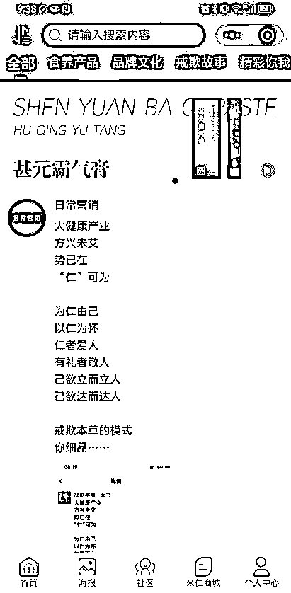</ne-card></ne-p> <ne-p id="u4df8dfa4" data-lake-id="u4df8dfa4"><ne-text id="u32ce4978" style="color: rgb(31, 35, 41);">这是专门提供圈文的小程序。</ne-text></ne-p> <ne-p id="u203a08db" data-lake-id="u203a08db"><ne-card data-card-name="image" data-card-type="inline" id="BTsv6" data-event-boundary="card"></ne-card></ne-p> <ne-p id="uc0c7e6a2" data-lake-id="uc0c7e6a2"><ne-text id="u4a601608" ne-bold="true">① 晒宣文：仪式感：</ne-text><ne-text id="uf2ba90f8" style="color: rgb(31, 35, 41);">将你开启这份事业的决定，晒到朋友圈，建议圈文原创走心。</ne-text></ne-p> <ne-p id="u705384db" data-lake-id="u705384db"><ne-text id="ub2be9bb7" style="color: rgb(31, 35, 41);">贴几个不错的官宣文给大家看看。（</ne-text><ne-text id="u98fd7206" style="color: rgb(216, 57, 49);">是否需要贴图？</ne-text><ne-text id="u6d7580ec" style="color: rgb(31, 35, 41);">)</ne-text></ne-p> <ne-p id="ub44e7747" data-lake-id="ub44e7747"><ne-card data-card-name="image" data-card-type="inline" id="Vf1aH" data-event-boundary="card"></ne-card></ne-p> <ne-p id="u70502018" data-lake-id="u70502018"><ne-text id="u8570abaf" ne-bold="true">中医博士</ne-text></ne-p> <ne-p id="u9454f32b" data-lake-id="u9454f32b"><ne-card data-card-name="image" data-card-type="inline" id="gHQV2" data-event-boundary="card">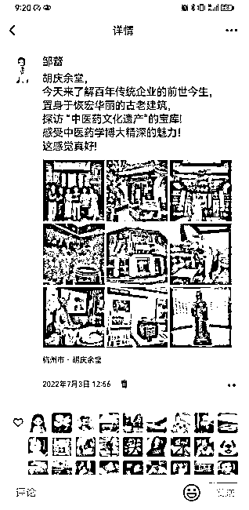</ne-card></ne-p> <ne-p id="ubf28c27f" data-lake-id="ubf28c27f"><ne-card data-card-name="image" data-card-type="inline" id="d6iaB" data-event-boundary="card">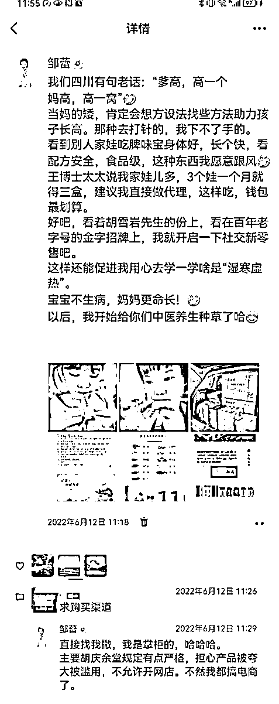</ne-card></ne-p> <ne-p id="ue93fc9ef" data-lake-id="ue93fc9ef"><ne-text id="u5049fa1b" ne-bold="true">② 晒吃膏：</ne-text><ne-text id="u09ac94ad" style="color: rgb(31, 35, 41);">无自用，不分享，全家各年龄层每天打卡吃膏晒起来，自己才是产品的最佳代言人</ne-text></ne-p> <ne-p id="uafa53fac" data-lake-id="uafa53fac"><ne-card data-card-name="image" data-card-type="inline" id="WP9Ns" data-event-boundary="card">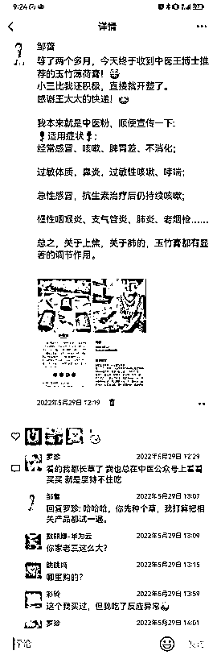</ne-card></ne-p> <ne-p id="u225deccd" data-lake-id="u225deccd"><ne-card data-card-name="image" data-card-type="inline" id="tJ8bm" data-event-boundary="card">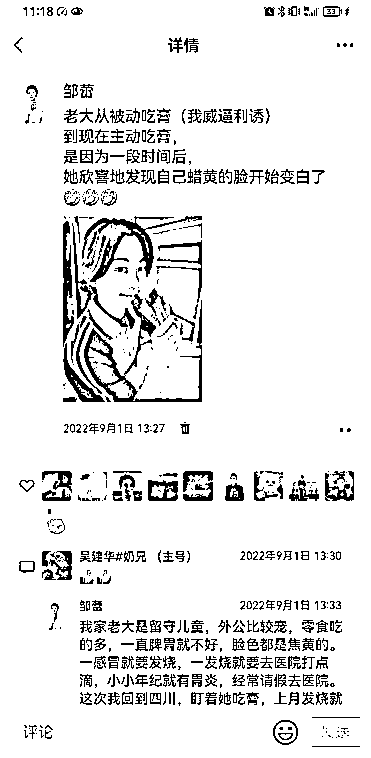</ne-card></ne-p> <ne-p id="u6fee4f1d" data-lake-id="u6fee4f1d"><ne-card data-card-name="image" data-card-type="inline" id="avbnT" data-event-boundary="card"></ne-card></ne-p> <ne-p id="uc9830dc2" data-lake-id="uc9830dc2"><ne-text id="uf849cc0b" ne-bold="true">③ 晒产品：</ne-text><ne-text id="u8fef8c2a" style="color: rgb(31, 35, 41);">最基础的内容，品牌文化、产品知识、产品成份、产品反馈等；</ne-text></ne-p> <ne-p id="u8a84cdb5" data-lake-id="u8a84cdb5"><ne-card data-card-name="image" data-card-type="inline" id="ZhSB9" data-event-boundary="card">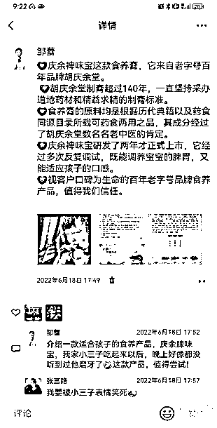</ne-card></ne-p> <ne-p id="u8efece41" data-lake-id="u8efece41"><ne-card data-card-name="image" data-card-type="inline" id="tgFMz" data-event-boundary="card">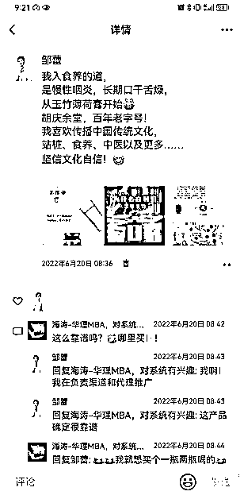</ne-card></ne-p> <ne-p id="u8e791441" data-lake-id="u8e791441"><ne-card data-card-name="image" data-card-type="inline" id="U23Af" data-event-boundary="card"></ne-card></ne-p> <ne-p id="u1d640784" data-lake-id="u1d640784"><ne-text id="uceaef3d0" style="color: rgb(31, 35, 41);">④</ne-text> <ne-text id="u9c4e86e1" ne-bold="true">晒学习：</ne-text><ne-text id="ue8efcf96" style="color: rgb(31, 35, 41);">主业下班，副业学习中医基础知识，比如舌诊、手诊，将自己的学习态度晒到朋友圈</ne-text></ne-p> <ne-p id="uc0a4d398" data-lake-id="uc0a4d398"><ne-card data-card-name="image" data-card-type="inline" id="YgKjN" data-event-boundary="card"></ne-card></ne-p> <ne-p id="ubcbcf49b" data-lake-id="ubcbcf49b"><ne-card data-card-name="image" data-card-type="inline" id="sdSyd" data-event-boundary="card">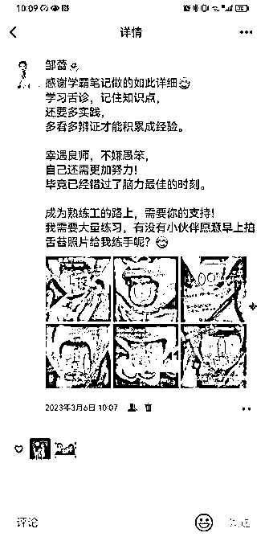</ne-card></ne-p> <ne-p id="ud3908bcb" data-lake-id="ud3908bcb"><ne-text id="u6292dc5f" ne-bold="true">⑤ 晒行动：</ne-text></ne-p> <ne-oli index-type="0"><ne-oli-i>1</ne-oli-i><ne-oli-c class="ne-oli-content" id="ubb5ad9f9" data-lake-id="ubb5ad9f9"><ne-text id="ufc2471e5">1 条行动图抵过 10 条产品图</ne-text></ne-oli-c></ne-oli> <ne-oli index-type="0"><ne-oli-i>1</ne-oli-i><ne-oli-c class="ne-oli-content" id="u0a765122" data-lake-id="u0a765122"><ne-text id="u8f8867e2">行动图包括：咨询-出单-收款-理货-打包-发货-回访跟进-谈代理-搬膏-线下活动</ne-text></ne-oli-c></ne-oli> <ne-oli index-type="0"><ne-oli-i>1</ne-oli-i><ne-oli-c class="ne-oli-content" id="uf5c5aa5b" data-lake-id="uf5c5aa5b"><ne-text id="u84eac603">所有行动图都要带有自己的印迹：自己或者家人出镜照片、自己的头像（点赞、评价、收款、聊天）</ne-text></ne-oli-c></ne-oli> <ne-oli index-type="0"><ne-oli-i>1</ne-oli-i><ne-oli-c class="ne-oli-content" id="uef5b3b24" data-lake-id="uef5b3b24"><ne-text id="u324ff5a2">拆分节点发朋友圈：将一个事情按节点拆分发圈，营造风风火火的场面（咨询-下单-收款-打包。。。)</ne-text></ne-oli-c></ne-oli> <ne-oli index-type="0"><ne-oli-i>1</ne-oli-i><ne-oli-c class="ne-oli-content" id="u10135127" data-lake-id="u10135127"><ne-text id="ud8727e63">一定要有货，拍大货、没有大货，将小货拍成大货的感觉。</ne-text></ne-oli-c></ne-oli> <ne-p id="u3a9052bc" data-lake-id="u3a9052bc"><ne-card data-card-name="image" data-card-type="inline" id="zSeNS" data-event-boundary="card"></ne-card></ne-p> <ne-p id="u11ce7328" data-lake-id="u11ce7328"><ne-card data-card-name="image" data-card-type="inline" id="SnL5c" data-event-boundary="card">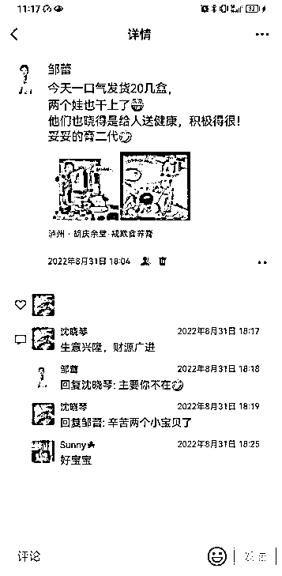</ne-card></ne-p> <ne-p id="u53daf46f" data-lake-id="u53daf46f"><ne-card data-card-name="image" data-card-type="inline" id="TUNaU" data-event-boundary="card"></ne-card></ne-p> <ne-p id="u130845e9" data-lake-id="u130845e9"><ne-text id="u316a084a" style="color: rgb(31, 35, 41);">⑥</ne-text> <ne-text id="u3231e0b2" ne-bold="true">晒团队：</ne-text></ne-p> <ne-p id="u9f88ed7b" data-lake-id="u9f88ed7b"><ne-text id="u2ec6f0d0" style="color: rgb(31, 35, 41);">一个人走过的是岁月，一群人走过的是芳华，一个人是单打独斗，一群人是称霸江湖。</ne-text></ne-p> <ne-p id="u9a1115ee" data-lake-id="u9a1115ee"><ne-text id="u3017d1ed" style="color: rgb(31, 35, 41);">晒新开拓的社交圈子。包括我们医生专家团队、做副业的企业高管们，晒优秀的团队成员，感恩团队长及专家们给予的帮助。</ne-text></ne-p> <ne-p id="ucb1e032e" data-lake-id="ucb1e032e"><ne-card data-card-name="image" data-card-type="inline" id="drrU2" data-event-boundary="card">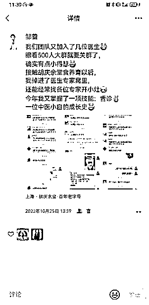</ne-card></ne-p> <ne-p id="uc09b3dee" data-lake-id="uc09b3dee"><ne-card data-card-name="image" data-card-type="inline" id="GEF3h" data-event-boundary="card"></ne-card></ne-p> <ne-p id="u6d152925" data-lake-id="u6d152925"><ne-text id="ue25f7d12" style="color: rgb(31, 35, 41);">⑦</ne-text> <ne-text id="u46aaefdc" ne-bold="true">晒收获：</ne-text><ne-text id="u12b92950" style="color: rgb(31, 35, 41);">晒钱、晒健康、晒人脉、晒成长总结、晒家人支持。</ne-text></ne-p> <ne-p id="u89570b8a" data-lake-id="u89570b8a"><ne-card data-card-name="image" data-card-type="inline" id="w8tqk" data-event-boundary="card"></ne-card></ne-p> <ne-p id="u0f418745" data-lake-id="u0f418745"><ne-card data-card-name="image" data-card-type="inline" id="jiYaO" data-event-boundary="card"></ne-card></ne-p> <ne-p id="u2e666c78" data-lake-id="u2e666c78"><ne-text id="u0c821d2c" ne-bold="true">⑧ 晒日常：</ne-text><ne-text id="u121dd93e" style="color: rgb(31, 35, 41);">晒膏膏以外的生活，让朋友圈的人全方位认识你，更了解、信任你，不局限于是生意，更像是朋友。</ne-text></ne-p> <ne-p id="u5624ddec" data-lake-id="u5624ddec"><ne-card data-card-name="image" data-card-type="inline" id="aE4OK" data-event-boundary="card">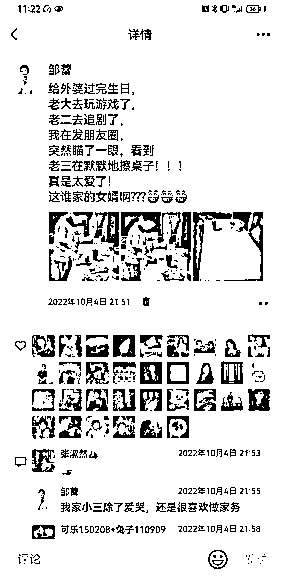</ne-card></ne-p> <ne-p id="u4ef21243" data-lake-id="u4ef21243"><ne-card data-card-name="image" data-card-type="inline" id="i8mOb" data-event-boundary="card"></ne-card></ne-p> <ne-p id="ud769b7fd" data-lake-id="ud769b7fd"><ne-text id="u5e363248" ne-bold="true">核心：</ne-text></ne-p> <ne-p id="u5f6c3c8d" data-lake-id="u5f6c3c8d"><ne-text id="udac027e7" style="color: rgb(31, 35, 41);">人：朋友圈展示你不断有朋友咨询项目、进行合作</ne-text></ne-p> <ne-p id="uf0d34484" data-lake-id="uf0d34484"><ne-text id="u9340b164" style="color: rgb(31, 35, 41);">财：晒钱，让别人看到你的收获、你的成功</ne-text></ne-p> <ne-p id="ue6a83899" data-lake-id="ue6a83899"><ne-text id="u59db47fe" style="color: rgb(31, 35, 41);">行动：晒出你的努力（搬膏、发货、寄快递）、你不断谈代理</ne-text></ne-p> <ne-p id="u702ccae1" data-lake-id="u702ccae1"><ne-text id="u9998d039" style="color: rgb(31, 35, 41);">有些代理有个误区，就是觉得，我做这个微商，我是不是可以不进货？就是我家里可以不用放货，然后我就想卖货。</ne-text></ne-p> <ne-p id="uc694e58e" data-lake-id="uc694e58e"><ne-text id="u4cac2368" style="color: rgb(31, 35, 41);">我试问一下，你开个实体店，你这个店里你不进货，你怎么卖货？ 对不对，所以就是一定要进货拿货出货，这样人家才能看到你干的红红火火，你身边的人才能跟你干是不是？</ne-text></ne-p> <ne-p id="u7cc491b5" data-lake-id="u7cc491b5"><ne-text id="ue0065591" style="color: rgb(31, 35, 41);">我所有的客户和代理商全是看我朋友圈后主动来联系我。我是有偶像包袱的人，一开始我也有发圈卡点，太在意别人的看法。</ne-text></ne-p>