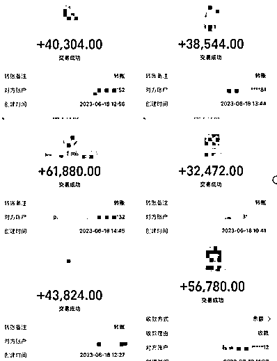
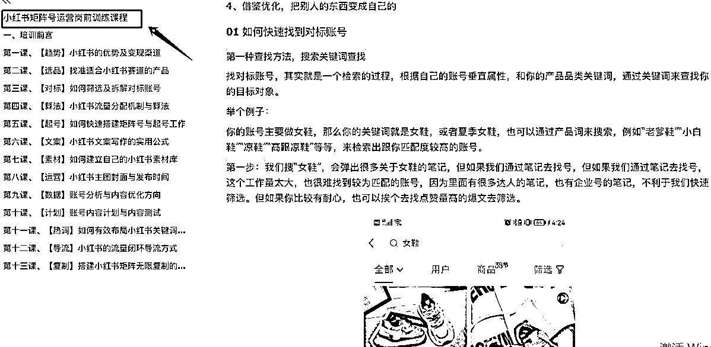

# 小红书千万级矩阵号的精细化运营复盘

> 原文：[`www.yuque.com/for_lazy/thfiu8/unxz3oayicl5x3ym`](https://www.yuque.com/for_lazy/thfiu8/unxz3oayicl5x3ym)

## (精华帖)(157 赞)小红书千万级矩阵号的精细化运营复盘 

作者： 凯哥 

日期：2023-08-16 

越是简单的事情，越需要专业化运营，精细化地去做标准。 

小红书矩阵号就是这样一个事，它的核心是要让项目和团队具备可复制性。几个账号的成功，有一定偶然性；但多个账号的成功，才算是一个良性可无限放大的循环。 

我刚做矩阵号时，没想明白这些，踩坑之后才开始着手研究复制工作，比如制定标准、规范流程等。这个过程中，我总结了一套小红书运营的 SOP 流程，也通过这套方法把业务放大了。 

今天就跟大家聊聊，有团队或开始在做小红书的圈友，如何通过运营的标准化流程来实现项目从 1-10 的复制放大。 

哈喽，大家好，我是凯哥。 

记得 6 月的时候写了 2 篇帖子，一不小心都成了精华帖。很多人看了我那篇从负债 400w 开始做小红书逆袭上岸的帖子，深受鼓舞。 

尤其是现阶段可能正处于人生低谷期，或者小白普通人想逆袭的伙伴，希望可以深度拆解一下，我在小红书去年做 2000w+的细节。 

我是从 2021 年开始做小红书引流卖货的，当时还是负债的状态，我一个朋友是做小众设计师品牌服装的，为了帮助我，一开始想让我帮她代运营，结果做了也就 1 个多月吧，发现引流变现能力特别强，于是我就跟她商量，看能不能供货的模式来合作。 

就这样，我开启了我的小红书矩阵号卖货的神奇之旅。 

后来，圈子里认识我的人，都知道我在做小红书引流，做得还不错，就想着也让我帮他们代运营，我心想着，反正也缺钱，想都没想就接了。 

短短 1 年时间，我竟然接了 300 多个账号，团队也初具规模了，慢慢我发现，代运营实在太累了，而且产品品类都不一样，什么五花八门的产品都有，天花板太低了，纯粹就是靠赚点人头钱，跟我自己运营的矩阵号相比，差距有点太离谱了。 

直到 2022 年，我一咬牙，把所有代运营的账号全部交付交接了，并专注转做自营的矩阵号。 

截止到今天，我自己的账号已经有 270 多个了，主要还是以高端小众设计师女装为主，客单价平均在 5000 左右，最低的折扣清仓单价也到了 2000+。 

去年是做了 2700w 的 gmv，今年的目标是 5000w，上个月已经完成了 60%的进度，总体来说，还有很大的上升空间。 

与此同时，我在小众服装这个领域，也慢慢感觉到有些掣肘，我朋友不希望我做得太大，因为她也只是个代理，而我也根本无法接触到源头。 

所以就想着还是要自己开发、测试其他赛道的产品。陆续尝试了不少产品，比如瑜伽服、调整内衣、奢侈品、珠宝翡翠等等。。 

最近我群友在小红书上做的珠宝翡翠产品，也陆续起来了，客单价更高了，平均都是 20000+的客单！ 

 

刚开始做矩阵号的时候，我是一穷二白地从深圳回到桂林，就一个光杆司令，拍图、写文案、发笔记、客服全部都自己搞定，每天把自己关在房间里，一忙就是一天，根本感觉不到时间过得飞速。 

当我一个人运营到 6 个账号的时候，把整个流程都跑了一遍，发现我的天花板已经到顶了，我根本没办法再做其他事情，6 个号充其量一个月也就做到 100w+。 

于是，开始招聘员工，慢慢开始扩大规模。没想到，招了几个员工，搞了 2 个月才发现，业绩不但没有上升，反而比以前做得更累了，除了自己运营账号外，还得花大量的精力去盯着他们的账号数据，每天当救火员，这是非常累的，完全没有成效。 

我反思自己，到底是哪个环节出了问题，是招的人不对？还是说我的管理有问题？ 

偶然的一次吃饭的时间，刷抖音，刷到一个视频，让我瞬间感觉醍醐灌顶，视频的大概内容就是：简单的事情重复做，重复的事情用心做，用心的事情坚持做，但是想要放大规模坚持做，就必须要有标准化的 SOP，每个环节都需要有指标，有参考范本。 

原来，这就是我的症结所在，我只是安排员工做事，拍图、写文案，运营账号，但是从来没有给过他们标准，话术，方法，和参考的范本。 

所以我才开始着手研究团队的复制工作，把我的运营经验复盘成可落地的内训资料，对团队进行系统性的培训，给他们关键性的运营工具。 

因为小红书矩阵号的核心，是要让项目和团队具备可复制性，几个账号的成功，是有一定偶然性的，多个账号的成功，才算是一个良性地，可无限放大的循环。 

因此，就需要完善每个环节的细节，制定相应的标准和范本，将我的经验真正应用到实际的运营过程中去。 

所以说，这篇帖子，比较适合有稳定货源，电商团队，已经在小红书上开始做项目的圈友，或者是已经有团队，想要转型做小红书的人，帮助你如何从 1～10 的复制放大阶段。 

虽然小红书矩阵号是一个简单复制的工作，但越是简单的事情，越需要专业化运营，精细化地去做标准。 

这也是为什么，我们做项目，带团队，经常会遇到一个情况，就是我自己单打独斗时做项目，运营账号，很容易就成功起号了，数据稳定增长，并且快速可以出单转化。 

但是账号一到同事手里，就快速下滑，甚至各种原因被限流，让下面的同事来做账号，账号总是很难成，小眼睛可能都不超过 200 个，让人非常痛苦。 

还有一个情况，就是我第一个号运营起来了，到第二个号就很难起来，搞来搞去也就靠那么 1～2 个号出单。 

其实这种情况，主要是我们没有做好项目的运营复盘，没有制定标准化的运营流程。因为这个项目，复制的不是运营的“人”，而是制定标准，规范流程，复制的是技术和运营思路。 

因此，规范操作流程，给参与项目的每个人和运营环节，做好标准参数，和考核指标，是非常重要的。 

当然，在有些事情上面我们虽然无法做到 100%的复制，比如创新、天赋、思考力这些无法用具体的数值来衡量，但是我们要做的只是复制账号，拓展账号的规模，只需要抓住几个重要节点，进行约束，给出标准答案。 

因此，我们就非常有必要，把这 3 个重要的 SOP 流程完善出来： 

1、小红书运营团队的 SOP 流程 

1）产品培训内容 

2）小红书的运营实操培训 

3）小红书团队的搭建 

2、内容笔记创作的 SOP 流程 

1）图片+封面+文案的模板 

2）关键词及素材库的收集 

3）测试笔记、起号的爆款模型 

3、流量转化 SOP 流程 

1）引流的 SOP 话术 

2）私域转化的标准话术 

# 一、无培训，不上岗 

这个涉及到核心的有效复制放大问题，我们需要对团队进行全面的培训，比如你们现在学习的这些内容，大多数都是从凯哥的团队内训中整理而来的。 

一方面要给团队培训产品知识，让所有参与这个项目的人，都要足够地了解产品，对产品充满信心，至少要在客户面前，你是一个专家，这样才能游刃有余地应对客户提出的问题。 

以及在写笔记内容的时候，有东西可以写，能写到用户的真实需求和痛点，写出爆文，对产品不了解，写着写着就不知道该怎么写了，容易迷失方向，陷入迷茫。 

所以，我在对新人的岗前培训，会集中式地将产品的所有知识，以及账号的运营攻略，花 1～2 天时间进行魔鬼培训，快速让团队成员掌握产品的卖点、优势、重要成分，对标竞品，以及目标用户的人群画像。 

由于我的女装产品和账号不方便对外公布，下面相关的数据和表达，均以我们做的其它产品素材作为替代。 

 

另一方面，新人上岗前，可能很多人对小红书完全不了解，为了达到快速上手的目标，我们一定要给团队培训小红书的运营方法，规则，和标准化的运营流程，要熟练掌握小红书的创作方法，不能啥也不懂，一顿乱写，不是没小眼睛就是被限流，再好的产品都经不起折腾。 

自己一个人做账号很容易，但是想要放大，就必须要把经验和方法总结出来，做出标准，复制给团队，绝对不能直接丢个账号给他，就放任不管了。 

 

一定要秉承一个原则：没培训，不上岗。 

（1）关于团队搭建，招聘新人的建议： 

1、建议优先招募刚毕业不久，出社会工作 2 年以内的职场新人，根据自己的产品属性去有针对性的设定门槛。 

比如你是做服饰时尚品类的，你可以从她的穿衣打扮，谈吐中，大概知道这个人的审美怎么样，在不在线。 

如果你做的产品是小众轻奢高端的衣服，招来的员工，审美很差，自己都没穿过 1000 块的衣服，她是写不出来/拍不出来这个衣服的轻奢感的。 

2、对于新人来说，是不需要去考验她是否有创造力的，重点去考核她是否有模仿能力，能不能独立思考。 

比如给她一个产品，和一条对标账号的笔记，让她模仿这篇笔记写一条自己产品的文案。这个时候，我们主要从 2 个方面去考量，一个是她有没有对我们的产品卖点进行分析提炼，完全不问我们产品的，说明没有产品意识； 

第二方面，从她的模仿能力去判断，是不是抓住了对标笔记的要点，笔记文案、封面设计，以及笔记的段落格式。 

3、最好是接触过小红书，是小红书的用户，经常刷小红书或者在小红书上有购物经验。文案岗位的员工，可以是做过淘宝客服、应届毕业，听话照做，有网感的最好。 

4、摄影岗位的，建议是有审美，爱专研的女孩子，用手机来拍就可以，特殊品类需要专业摄影的，则可以雇佣/兼职专业的摄影师，一个人负责团队的图片素材，量大的话可以配个助理，能够帮忙搭建场景，修图之类的。 

正常来说，一个专业摄影至少是可以完成 10 个号以上的图片需求。 

（2）阿米巴模式的成立 

我真正的爆发，其实是从我把团队薪酬体系模式，变成了阿米巴合作的模式。 

2022 年 4 月份，我发现，尽管我给团队的提成已经很高了，在桂林这种三线城市，平均工资也就 2800～3000，而我已经开到了 5000+的底薪。 

但是，毕竟是三线城市，员工的工作积极性根本没有办法跟一二线城市的人比，早上 9 点掐着点到公司，还没到 6 点就开始收拾东西准备下班了，周末你想让他处理点事，根本找不到人。 

于是，我开始尝试找几个看着有野心，工作能力强的员工做测试，从员工变成合伙人模式。 

也就是说，他们运营一组号（3 个号为 1 组），这 1 组号所产生的利润，我给他们 30%的利润分成，如果 2 个月内，拿到的提成比工资高，那就按照这个模式开始合作，重新签订合同，将劳务合同改签成合作合同，不发工作，不交社保，自负盈亏。 

如果 2 个月内的收入比原先还低，那我就给他们兜底，按之前的正常水平发工资。 

就这样，试了一个月，没想到第一个月，他们的收入都破了 2 万，当场就催着我变更合作模式。这样的合作开始以后，我发现大家的工作状态完全变了个样。 

每个人像打了鸡血一样嗷嗷叫，每天到公司比我还早，下了班都不愿回去，原本每天一个号只发 3 篇笔记，他们自己增加到了 5 篇笔记。对待私信的客户，态度也发生了 180 度的大转弯，恨不得每个咨询的客户都要搞定。 

后来在此基础上，我承诺给他们提供货源，提供技术指导，提供账号，提供手机设备，但是他们自己运营的账号，需要他们提供身份证和手机卡给我，由公司统一采购手机卡和注册个体户执照。 

小组要增加人员，我可以安排人事帮他们招聘，但是新招的同事工资得由他们负责。 

目前，我已经由之前初始的 20 人团队，慢慢发展到了近 50 人的规模，每个小组 6～10 个人，累积起来已经有 270 多个账号，大多数都是他们的表姐表妹表弟之类的年轻人，截止上个月，单月拿到最高收益的人已经破了 30 万。 

在桂林这样的城市，职场上能拿到 1 万以上的收益，最少也是要到副总级别以上才有的待遇，我的这个模式，不仅仅是解放了我的大脑，更多的是给他们提供了个舞台，创造更多的可能性。 

至于这个模式的基本配置，从整个团队的分配来说，所有的运营，其实都只是文案+销售的角色，因为在拍摄，图片创作的环节，我是单独养了几个摄影，每个月给一定的底薪，然后每个运营小组，从他们的收益中拿出部分提成给到他们。 

这几个摄影的职责，就是负责所有运营小组的图片/视频素材的拍摄输出，按照运营组长的要求来拍图片，保障有足够的优质图片可以提供。 

很多人问我，你就不怕他们自己出去单干吗？ 

答案是否定的，因为离开了我，他们可能会做得好，但一定做不长久，小红书的运营规则和运营策略，都是我在把关，平台的规则一直都是有升级的。 

另外，在这种三四线城市，他们刚出社会参加工作，也遇不到配合度高、优质的货源供应。再说，只要跟着我有钱赚，傻子才会轻易跑呢！ 

所以说，总结这种模式的玩法，一是我们要敢于分钱，大家都是出来挣钱的，只要有利可图，就没有什么合作做不了； 

第二呢，就是必须要打样，大家一开始跟着我上班，每个月都能看到，哇，凯哥做这个那么赚钱，我也想试试。他们看到了样板，这时候你只要一松口，就会有很多人愿意尝试，再说，我一开始也就是找几个人这样打样，做标杆，让大家都看到他们赚的钱比他们多，这就是“酒店服务员效益”。在利益的面前，大多数人都经不起诱惑。 

第三，就是要有标准流程，能够他们提供技术支持，运营方法、工作流程，标准话术，都得要教下去，并把这个当做一种传承，谁带团队，谁负责这个小组，就由他亲自带，因为这个小组的收益是跟他自己相关的。 

# 二、一定要有笔记内容的创作标准 

对于团队而言，他们更多是搬砖的角色，很少有创造性思维，尤其是没有经过专业培训，和长期实战的员工，他们连最基本的“爆文笔记”的“爆点”都不知道，写笔记就像是在碰运气，无法判断“什么样才算是一篇合格的笔记”，这时候我们让她写，简直就是强人所难，很难出成绩的。 

所以，我们必须要给我创作内容范本/标准。帮她找出竞品的样板图片，和样板文案，或者在自己的笔记风格中做出段落框架，让她们在这个框架里面写内容，避免跑偏。 

1）先做一个账号的运营定位表格，确定要做的内容方向； 

这个表格建议是先给团队进行培训之后，让她们根据自己的理解，把表格给到她，亲自去做一遍，然后我们再给她们讲解之后，带着她们一起来重新做一份正确的，具有可行性的表格。 

这样既可以加深她们对产品和行业的认知，也可以明确自己为什么要这样做，掌握基本的运营思路。 

 

2）给每个账号确定好图片风格和笔记框架； 

矩阵号虽然是复制模式，但是每个账号的图片、文案都需要有一定的差异化，不是直接将 A 账号的内容，复制粘贴到 B 账号，我们可以通过拍摄的场景、角度、道具、模特、搭配等等细节的改变，来进行差异化处理。 

尤其是对于时尚品类，服饰鞋包等产品，这些品类主要是看款式，所以对笔记文案字数没有太多要求。 

把每个账号的图片风格、文案框架固定下来之后，我们在运营账号的时候，就不会乱，既能够保持每个账号的独特风格，也可以帮助我们在拍摄图片的时候，更有有目的性地去快速批量化生产素材，大大节约时间和提高产能。 

 

3）关键词及素材库的收集 

小红书主要是依靠算法来分发流量的，一篇笔记从发布到推流，系统首先会把句子拆解成关键词，再匹配到人群的标签库，来做分类推荐。借由搜索结果与需求的匹配度，来找到最能命中用户需求的内容。 

因此笔记中的关键词布局，是直接影响目标用户是否点击的关键因素。关键词分为：核心关键词、相关词和长尾词。 

笔记中的关键词，尤其是标题关键词，主要起到 2 个重要作用：