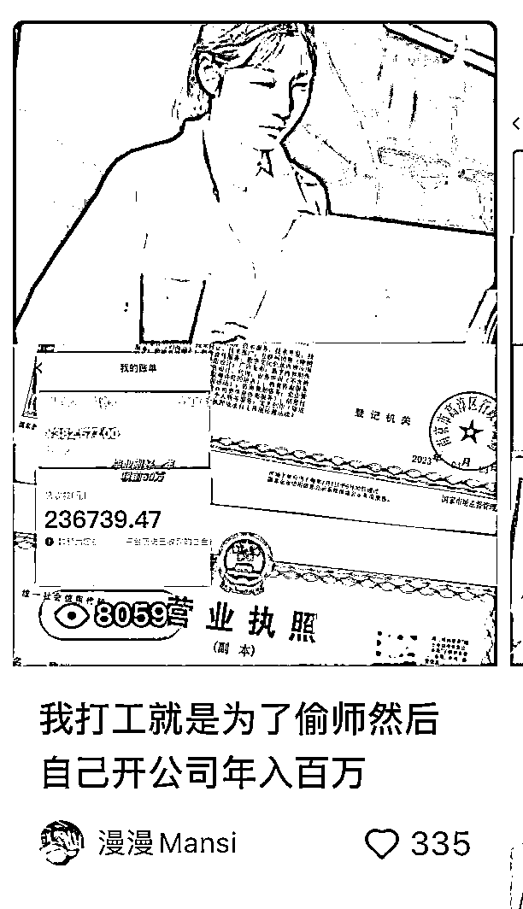
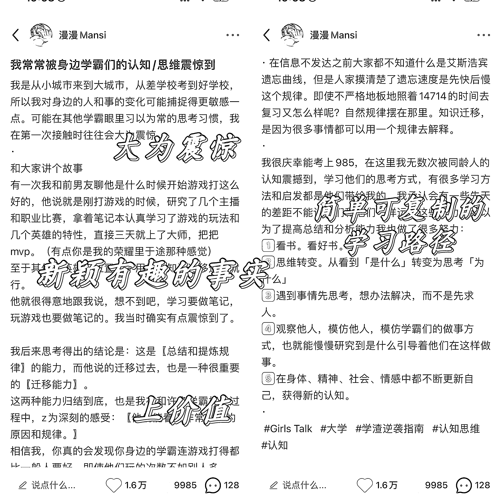
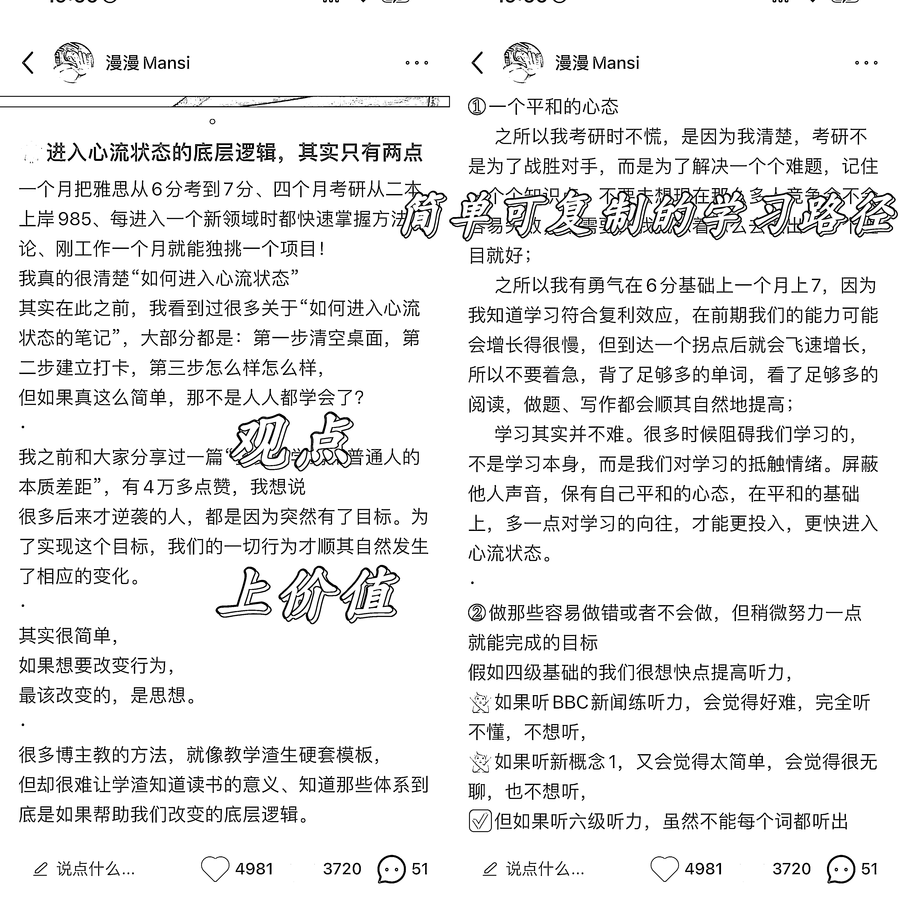
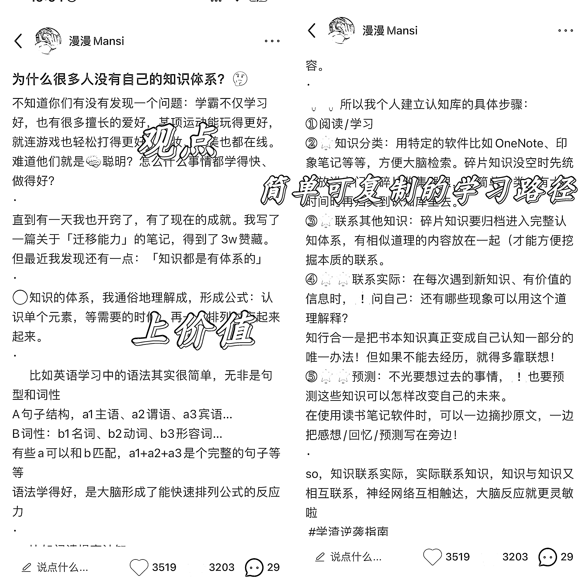
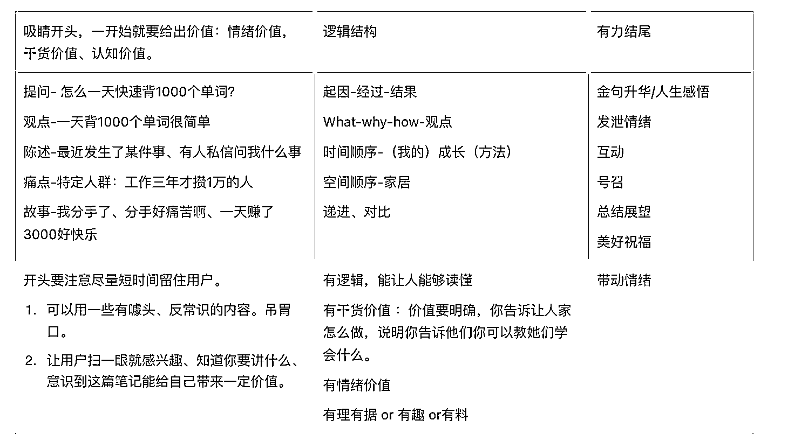
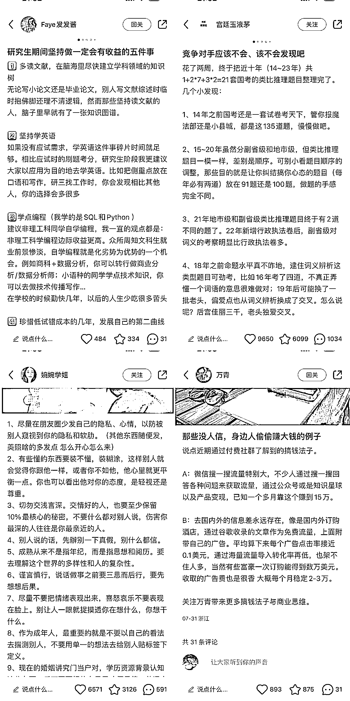

# 小红书爆文率 70%，一篇人设文涨粉 1w 的爆文公式

> 原文：[`www.yuque.com/for_lazy/thfiu8/zdgdnoddlq912dnm`](https://www.yuque.com/for_lazy/thfiu8/zdgdnoddlq912dnm)

<ne-h2 id="4cde100a" data-lake-id="4cde100a"><ne-heading-ext><ne-heading-anchor></ne-heading-anchor><ne-heading-fold></ne-heading-fold></ne-heading-ext><ne-heading-content><ne-text id="u0f14d005">(125 赞)小红书爆文率 70%，一篇人设文涨粉 1w 的爆文公式</ne-text></ne-heading-content></ne-h2> <ne-p id="u5444ecc5" data-lake-id="u5444ecc5"><ne-text id="uf9ac5558">作者： 漫漫 mansi</ne-text></ne-p> <ne-p id="ub0cfeec2" data-lake-id="ub0cfeec2"><ne-text id="u2d8b8e84">日期：2023-08-14</ne-text></ne-p> <ne-p id="u2b494f54" data-lake-id="u2b494f54"><ne-text id="u4a0cf6b1">今天的内容又爆了，（发布一小时小眼睛 7000+点赞 330 就是爆的预兆，估计能上万）</ne-text></ne-p> <ne-p id="u9aed1e5b" data-lake-id="u9aed1e5b"><ne-text id="u37d400f6">果然我做内容只要想爆就能爆。</ne-text></ne-p> <ne-p id="ubda270fa" data-lake-id="ubda270fa"><ne-card data-card-name="image" data-card-type="inline" id="A4Bmt" data-event-boundary="card">  <ne-p id="u32dbc15e" data-lake-id="u32dbc15e"><ne-text id="u6ace7ccc">我偶尔会不刻意去做爆款，而是做一些能加强粉丝粘性的内容，但是为了维护数据稳定，一周至少要做几篇爆款保证我流量和数据的稳定</ne-text></ne-p> <ne-p id="u42ae96f0" data-lake-id="u42ae96f0"><ne-card data-card-name="image" data-card-type="inline" id="xRaOq" data-event-boundary="card">  <ne-p id="ub7e49b5b" data-lake-id="ub7e49b5b"><ne-text id="u1d207ad8">我流量来源，首页推荐高达 82%。我的很多选题都变成了爆款选题，很多博主模仿借鉴。</ne-text><ne-card data-card-name="image" data-card-type="inline" id="euCuN" data-event-boundary="card">  <ne-p id="ub59417f2" data-lake-id="ub59417f2"><ne-text id="u270ac16b">然后就是我个人 IP 打造</ne-text></ne-p> <ne-p id="u973eb146" data-lake-id="u973eb146"><ne-text id="u26e07dfe">我的粉丝实在是太乖太好了，我刚开始做知识付费产品还没有任何宣传和结果，就有粉丝为我不停付费。我在小红书上发关于自己心情不好的内容也会收到粉丝给我发的邮件。还有很多粉丝是因为我而学英语、考研、做自媒体等等。（获得喜爱很信任的感觉真的很好，是我在任何焦虑的时候每次想到还有这么多人爱我都会有自信的力量来源）</ne-text></ne-p> <ne-p id="u40b5f7a1" data-lake-id="u40b5f7a1"><ne-text id="u84adb547">今天想和大家聊聊内容创作，我的爆款笔记制作思路，真的是直接可以复制的压箱底思路。</ne-text></ne-p> <ne-h2 id="d48d1c8a" data-lake-id="d48d1c8a"><ne-heading-ext><ne-heading-anchor></ne-heading-anchor><ne-heading-fold></ne-heading-fold></ne-heading-ext><ne-heading-content><ne-text id="ud250caaf" ne-bold="true">1\. 观点文爆文围绕一个公式：</ne-text></ne-heading-content></ne-h2> <ne-h2 id="6beb5d43" data-lake-id="6beb5d43"><ne-heading-ext><ne-heading-anchor></ne-heading-anchor><ne-heading-fold></ne-heading-fold></ne-heading-ext><ne-heading-content><ne-text id="uf1fdf674" ne-bold="true">新颖独特的观点/有说服力的事实➕升华上价值➕方法论</ne-text></ne-heading-content></ne-h2> <ne-p id="ua25769fd" data-lake-id="ua25769fd"><ne-text id="uf1c4e55c">大家可以看看我的几篇爆款笔记</ne-text></ne-p> <ne-p id="u5f0a22b7" data-lake-id="u5f0a22b7"><ne-card data-card-name="image" data-card-type="inline" id="jXSKm" data-event-boundary="card">  <ne-p id="u01ba43ee" data-lake-id="u01ba43ee"><ne-card data-card-name="image" data-card-type="inline" id="PgNV0" data-event-boundary="card"><ne-card data-card-name="image" data-card-type="inline" id="apah0" data-event-boundary="card">  <ne-p id="udfd348b7" data-lake-id="udfd348b7"><ne-text id="u7b6a1e8c">其实都是按照这个模板。</ne-text></ne-p> <ne-p id="u7cebd66d" data-lake-id="u7cebd66d"><ne-text id="u449a3346" style="color: rgb(255, 102, 112);">这个就是比较适合普通人的打法。有浅有深。</ne-text></ne-p> <ne-p id="u9920c24b" data-lake-id="u9920c24b"><ne-text id="u0aef5bda" style="color: rgb(255, 102, 112);">【先上升升华，抓住大家想要变好、崇拜权威观点的心态，然后再提出一个极其简单的可复制路线，满足他们急于求成的心态】</ne-text></ne-p> <ne-h2 id="f489de64" data-lake-id="f489de64"><ne-heading-ext><ne-heading-anchor></ne-heading-anchor><ne-heading-fold></ne-heading-fold></ne-heading-ext><ne-heading-content><ne-text id="u0cf5c336" ne-bold="true">2\. 人设文：美强惨人设</ne-text></ne-heading-content></ne-h2> <ne-p id="u6088909f" data-lake-id="u6088909f"><ne-text id="u9d18edf5" style="color: rgb(236, 40, 52);">美：人美  脸蛋好看 身材好看 人设心灵美  坚强勇敢健康乐观</ne-text></ne-p> <ne-p id="u20cbbc8e" data-lake-id="u20cbbc8e"><ne-text id="uba38f41f" style="color: rgb(236, 40, 52);">强：获得了某个成就</ne-text></ne-p> <ne-p id="ud1a4d784" data-lake-id="ud1a4d784"><ne-text id="u1a47c1c0" style="color: rgb(236, 40, 52);">惨：出身不好、受到打压、被人质疑....</ne-text></ne-p> <ne-p id="ub7f57905" data-lake-id="ub7f57905"><ne-text id="u069d681c">这个人设就是无敌人设，</ne-text></ne-p> <ne-p id="u1587a3b7" data-lake-id="u1587a3b7"><ne-text id="u98fedf07">古往今来能够让人记忆深刻的人也是这个人设，</ne-text></ne-p> <ne-p id="u38b0ff09" data-lake-id="u38b0ff09"><ne-text id="uc43a24bf">做 IP 如果你想快速做起来也就往这个人设去偏向。</ne-text></ne-p> <ne-p id="uefce49ea" data-lake-id="uefce49ea"><ne-text id="u91e73ed3">我今天只说内容方面，美强财人设的文章怎么写：</ne-text></ne-p> <ne-p id="ua826467d" data-lake-id="ua826467d"><ne-text id="u691c27b3" style="background-color: rgba(254, 212, 164, 0.8); color: rgb(255, 102, 112);">个人 IP 故事万能公式：</ne-text><ne-text id="u4247d52b" style="color: rgb(255, 102, 112);">苦逼的过去，牛逼的现在，挫折的经历，偶然的转机，发奋的改变，最后的成功，强大的使命。</ne-text></ne-p> <ne-p id="uc4d226c9" data-lake-id="uc4d226c9"><ne-text id="ueb8f790b">·</ne-text></ne-p> <ne-p id="u742c9958" data-lake-id="u742c9958"><ne-text id="ufc14e688">我为什么能火，也是符合这个公式：</ne-text></ne-p> <ne-p id="u2ee45dc5" data-lake-id="u2ee45dc5"><ne-text id="ubd21f3a3">农村出身、没有眼界、考上二本、发现自己的无知、考研上岸逆袭、自学雅思 8 分。</ne-text></ne-p> <ne-p id="u6dd361ea" data-lake-id="u6dd361ea"><ne-text id="uf4d688b4">要时不时暴露一下弱点，具体看看我之前关于自己涨粉二十万的复盘文档第四五部分。</ne-text></ne-p> <ne-p id="u1e9ba9bb" data-lake-id="u1e9ba9bb">[<ne-text id="u191a4d8f">https://t.zsxq.com/1175mrJo6</ne-text>](https://t.zsxq.com/1175mrJo6)</ne-p> <ne-p id="ubb005862" data-lake-id="ubb005862"><ne-text id="ub4c4ef29">·</ne-text></ne-p> <ne-p id="u53ad11de" data-lake-id="u53ad11de"><ne-text id="u1e80b7e6">当然了，人设必须要是真实的，做真实的自己才可独特可持续。</ne-text></ne-p> <ne-p id="u4d915cc1" data-lake-id="u4d915cc1"><ne-text id="u4eccfd76">放大优势和自己的闪光点。</ne-text></ne-p> <ne-p id="uba5f17ac" data-lake-id="uba5f17ac"><ne-text id="uf013c21b">我在自己的复盘里都写到过</ne-text></ne-p> <ne-p id="ub04f903a" data-lake-id="ub04f903a"><ne-text id="u8fa3b4f3">·</ne-text></ne-p> <ne-p id="u535c62c2" data-lake-id="u535c62c2"><ne-text id="u4b72dab2">看看这个几百万粉的大博主，也时不时发一下美强惨人设文。</ne-text></ne-p> <ne-p id="u841298a0" data-lake-id="u841298a0"><ne-card data-card-name="image" data-card-type="inline" id="nWgMt" data-event-boundary="card">  <ne-h2 id="0f429550" data-lake-id="0f429550"><ne-heading-ext><ne-heading-anchor></ne-heading-anchor><ne-heading-fold></ne-heading-fold></ne-heading-ext><ne-heading-content><ne-text id="u0a16b2ad" ne-bold="true">3\. 做证明法</ne-text></ne-heading-content></ne-h2> <ne-p id="u1eb60b78" data-lake-id="u1eb60b78"><ne-text id="u99d8cae7">你要说这个东西好，就要有东西证明这个东西为什么好。眼见为实最好。言传身教最好。而不是空口大道理。</ne-text></ne-p> <ne-p id="u0ed977b2" data-lake-id="u0ed977b2"><ne-text id="u12233610" ne-bold="true">我的证明法公式：首图放上证据或者暗含证据+</ne-text><ne-text id="u999aa145" ne-bold="true">文章要有具体场景</ne-text></ne-p> <ne-p id="uf64417a6" data-lake-id="uf64417a6"><ne-text id="u0a7581d7">1\. 如果你说自己很强：首图放上你取得成就成绩的照片，文字上，要用一个场景来证明自己为此付出的具体努力。</ne-text></ne-p> <ne-p id="ufd3ad675" data-lake-id="ufd3ad675"><ne-text id="u18ce1f7d">2\. 你说自己赚到了钱：放上钱的照片，说自己是如何赚到的。</ne-text></ne-p> <ne-p id="u02d6cf54" data-lake-id="u02d6cf54"><ne-text id="u298e8d62">3\. 你说一个东西好用：放上使用前后对比图的照片，并且写清楚前后使用的差别。</ne-text></ne-p> <ne-p id="u49c9172c" data-lake-id="u49c9172c"><ne-text id="u5648db41">4\. 如果你说你付出了很多努力，那么就放上丰富的你做过的事情的图片，显得很多。</ne-text></ne-p> <ne-p id="u79f87b4c" data-lake-id="u79f87b4c"><ne-text id="u3ef31f3e">5\. 如果你说你的内容很干，那么就让图片上内容显得很多很满，让人一看就觉得内容是很丰富的。</ne-text></ne-p> <ne-p id="uab0f8ba0" data-lake-id="uab0f8ba0"><ne-text id="u3a91d94b">观点类的内容，都要足够自信，都要认准了一个观点去论证</ne-text></ne-p> <ne-p id="u31cb4852" data-lake-id="u31cb4852"><ne-text id="u2e68f82d">认知越高越觉得自己浅薄，做内容时顾虑得越多，因为问题本身就需要辩证看待，但是会导致写出来的东西就越复杂，大众越不看</ne-text></ne-p> <ne-p id="u1658ce62" data-lake-id="u1658ce62"><ne-text id="u63cd9d7b">反而是这种有点「偏执、极端」的内容，大家更喜欢，往往一种声音最吸引人</ne-text></ne-p> <ne-p id="u5e2581a2" data-lake-id="u5e2581a2"><ne-text id="ue3543b20">同意的人高度共鸣，不同意的人骂得也有热度。</ne-text></ne-p> <ne-p id="uce7f7be1" data-lake-id="uce7f7be1"><ne-text id="u56ee6c58">提出问题、提出好处</ne-text></ne-p> <ne-p id="u47a1a7dc" data-lake-id="u47a1a7dc"><ne-text id="u3e44077d">反复论证</ne-text></ne-p> <ne-p id="u9697eb6a" data-lake-id="u9697eb6a"><ne-text id="u5a49b5b9">提供一个让别人也可以达成的实现路径、方法(第 1 点的公式）</ne-text></ne-p> <ne-h2 id="d8e48a7d" data-lake-id="d8e48a7d"><ne-heading-ext><ne-heading-anchor></ne-heading-anchor><ne-heading-fold></ne-heading-fold></ne-heading-ext><ne-heading-content><ne-text id="u0d5db564" ne-bold="true">4\.  好的文章是</ne-text></ne-heading-content></ne-h2> <ne-p id="u29c12183" data-lake-id="u29c12183"><ne-text id="u705528d8">好的图片+有逻辑的文字+有情绪的表达</ne-text></ne-p> <ne-p id="uaf3cda9f" data-lake-id="uaf3cda9f"><ne-text id="u9af29c7f">我总结一个文章框架放在这里</ne-text></ne-p> <ne-p id="u6fcffa2f" data-lake-id="u6fcffa2f"><ne-card data-card-name="image" data-card-type="inline" id="TTQ0i" data-event-boundary="card">  <ne-p id="uaa30605b" data-lake-id="uaa30605b"><ne-text id="u378127ad" ne-bold="true">其中我总结一个重要原则吧：</ne-text><ne-text id="uc51c58a0" ne-bold="true">宁缺毋滥</ne-text></ne-p> <ne-p id="uea14e233" data-lake-id="uea14e233"><ne-text id="u7030d31b">现代人的注意力非常稀缺，如果你不能活在前面几秒，就抓住他们的注意力，他们大概率不会看问题的整篇文章。所以 宁愿少写一点，把他们注意力抓住，也不要为了凑字数写一些乱七八糟的东西。</ne-text></ne-p> <ne-p id="u74a747f4" data-lake-id="u74a747f4"><ne-text id="ueff54310">1\. 客观描述的场景要控制字数。</ne-text></ne-p> <ne-p id="uf1287c7a" data-lake-id="uf1287c7a"><ne-text id="u61d6a6d6">2\. 能一句话说完的不要两句。要精确。</ne-text></ne-p> <ne-p id="u2ae5e7d1" data-lake-id="u2ae5e7d1"><ne-text id="uaab20ffb">3\. 不要用很多</ne-text><ne-text id="u62578b55" ne-underline="true">表情</ne-text><ne-text id="uda18e8c8">。放表情要放在重要位置。因为表情在一堆文字里，能一下子能吸引到用户的注意力。你把表情放在无关紧要不过是表达一下你心情的地方，用户一眼看到你的心情，他会觉得没有价值。</ne-text></ne-p> <ne-p id="uf255621f" data-lake-id="uf255621f"><ne-text id="ue71cd7f0">不如摆好段落层次，重点的内容也能突出出来。</ne-text></ne-p> <ne-p id="u843b66fd" data-lake-id="u843b66fd"><ne-text id="ud6ea34b2">如果你放表情的意义在于给无聊黑白的文字里加一点颜色，那你就要意识到，颜色是很醒目的，能带走别人的视线。所以要放在重点的地方。</ne-text></ne-p> <ne-p id="u73ea8328" data-lake-id="u73ea8328"><ne-text id="u382cec56">不信你看你打开小红书刷到的所有的爆文，其实表情真的蛮少，段落层次很分明。</ne-text></ne-p> <ne-p id="u0e616ace" data-lake-id="u0e616ace"><ne-card data-card-name="image" data-card-type="inline" id="v0WhP" data-event-boundary="card">  <ne-p id="ua69e44e0" data-lake-id="ua69e44e0"><ne-text id="udd8a032d">·</ne-text></ne-p> <ne-p id="ue21896dc" data-lake-id="ue21896dc"><ne-text id="u2031ea6e">今天总结的这几个公式大家可以直接套用，真的是我压箱底的！！！！！！流量密码啊啊啊啊啊</ne-text></ne-p> <ne-hole id="uac7f025b" data-lake-id="uac7f025b"><ne-card data-card-name="hr" data-card-type="block" id="Q8wjL" data-event-boundary="card"><ne-p id="ue46e8ef8" data-lake-id="ue46e8ef8"><ne-text id="u7045c50d">评论区：</ne-text></ne-p> <ne-p id="u1d68cd1d" data-lake-id="u1d68cd1d"><ne-text id="u49aaef8b">雨前 : 哈哈，今天还刷到你呢</ne-text> <ne-text id="u63bdaf59">漫漫 mansi : 刷到就是我火了嘿嘿嘿！！！</ne-text> <ne-text id="uf79e54ce">曜文 : 文案能力强在小红书太吃香啦</ne-text> <ne-text id="u40b0f247">十一 : 学到了马上用</ne-text> <ne-text id="ue4fcb2b3">暖安 : 厉害！学到了，得好好复盘下</ne-text> <ne-text id="u136844c8">希平 : 原来是你，之前刷过你的笔记，写的真的很棒[呲牙]</ne-text> <ne-text id="uc770b73c">旋转の糖豆儿 : 这分享好实诚，关键点都交付给大家</ne-text> <ne-text id="u82668933">漫漫 mansi : 舍不得分享，真的是我压箱底的内容！</ne-text></ne-p> <ne-p id="u73fc5085" data-lake-id="u73fc5085"><ne-card data-card-name="image" data-card-type="inline" id="HUxfJ" data-event-boundary="card">  <ne-hole id="u2b9ed522" data-lake-id="u2b9ed522"><ne-card data-card-name="hr" data-card-type="block" id="WGx5z" data-event-boundary="card"></ne-card></ne-hole></ne-card></ne-p></ne-card></ne-hole></ne-card></ne-p></ne-card></ne-p></ne-card></ne-p></ne-card></ne-card></ne-p></ne-card></ne-p></ne-card></ne-p></ne-card></ne-p></ne-card></ne-p>