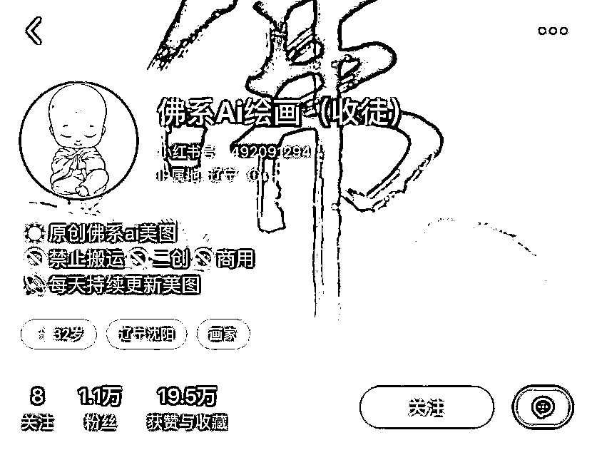
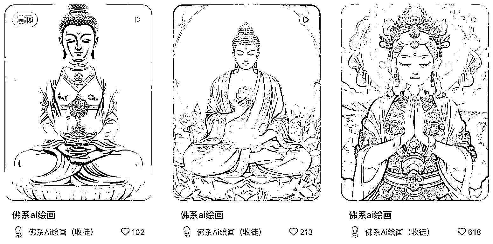
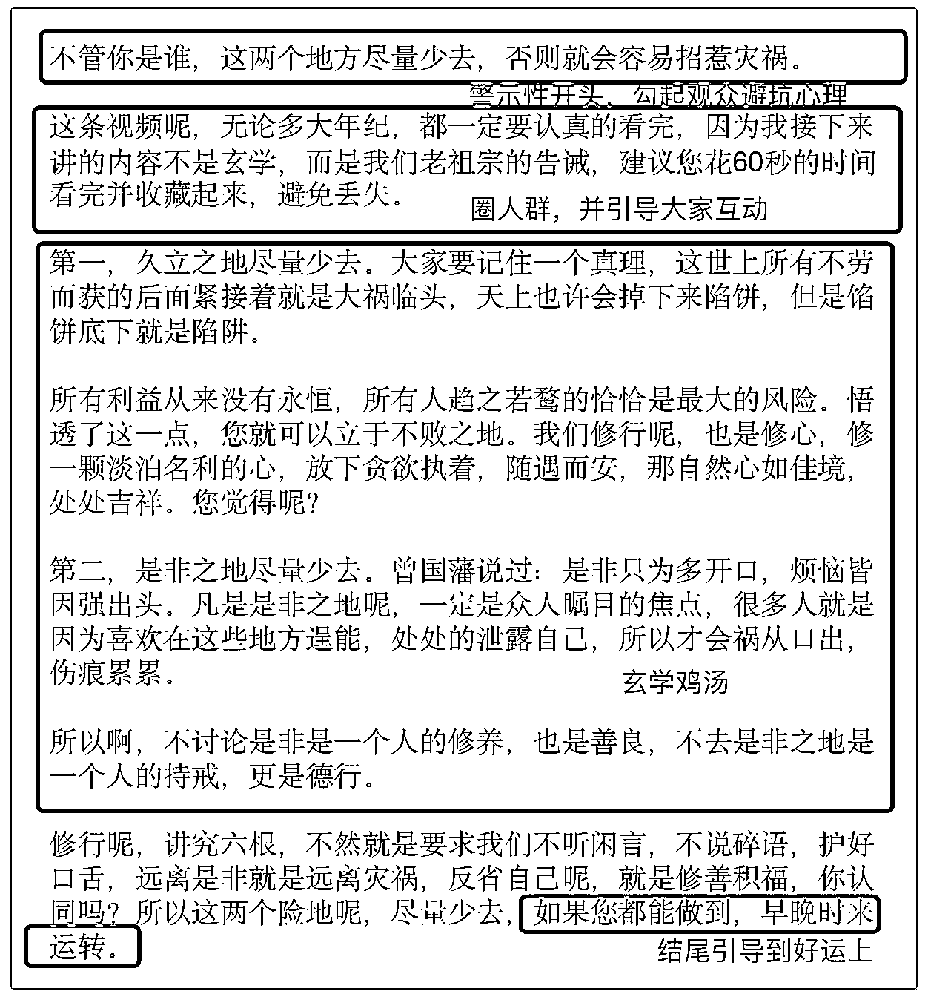
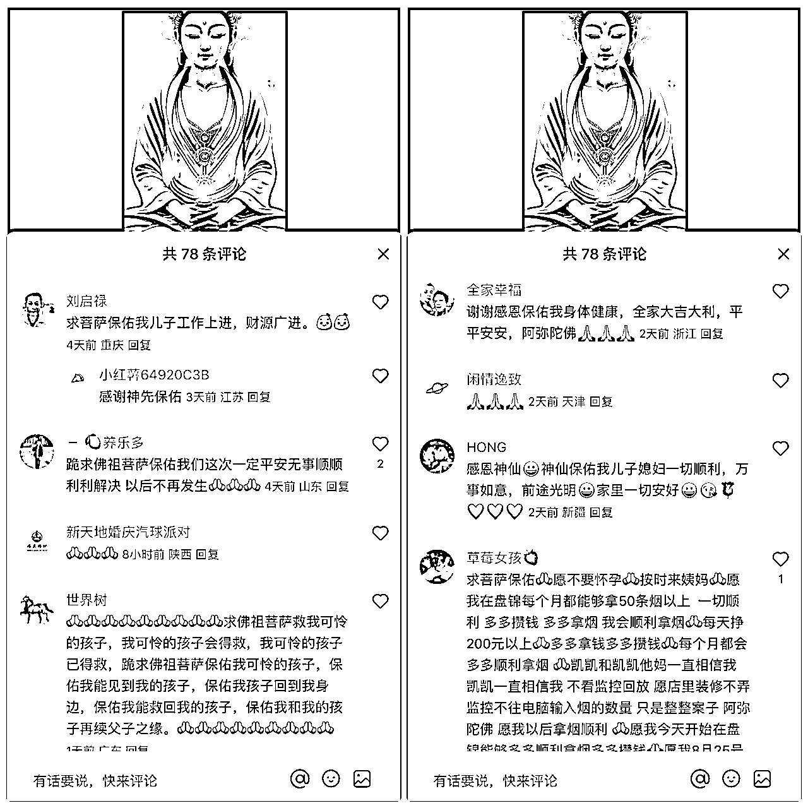
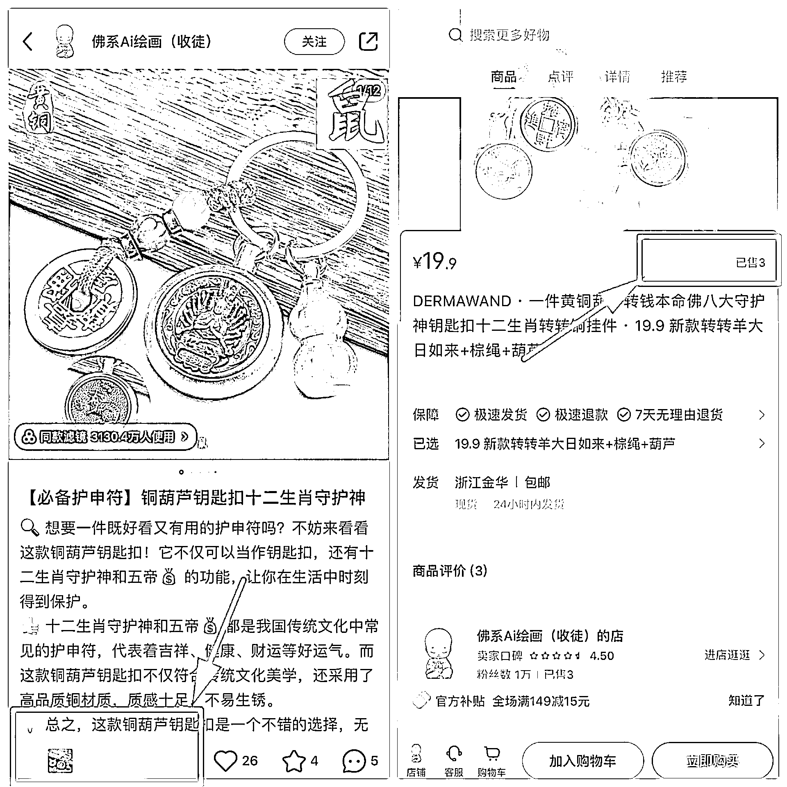
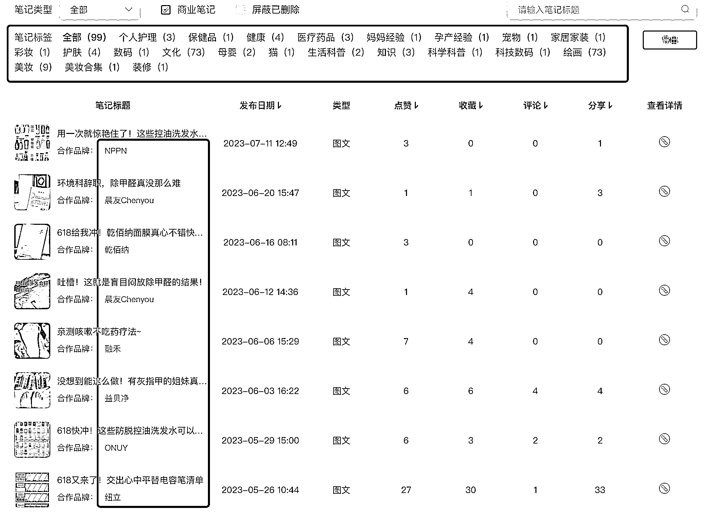
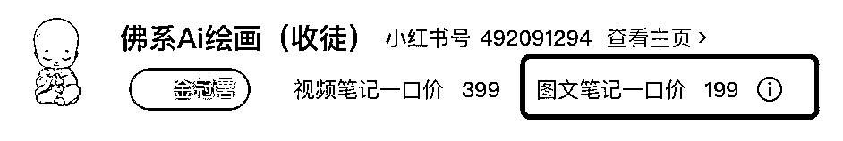

# 1 天涨粉 5k+，一个超容易起号的 AI 赛道玩法！

> 原文：[`www.yuque.com/for_lazy/thfiu8/evtugns338ixgg93`](https://www.yuque.com/for_lazy/thfiu8/evtugns338ixgg93)

<ne-h2 id="4906a760" data-lake-id="4906a760"><ne-heading-ext><ne-heading-anchor></ne-heading-anchor><ne-heading-fold></ne-heading-fold></ne-heading-ext><ne-heading-content><ne-text id="ua9b0f43f">(76 赞)1 天涨粉 5k+，一个超容易起号的 AI 赛道玩法！</ne-text></ne-heading-content></ne-h2> <ne-p id="u1da1385c" data-lake-id="u1da1385c"><ne-text id="u5bd071b7">作者： Sherry💎谢无敌</ne-text></ne-p> <ne-p id="u0d9757dd" data-lake-id="u0d9757dd"><ne-text id="u4643f927">日期：2023-08-17</ne-text></ne-p> <ne-p id="u62afd88f" data-lake-id="u62afd88f"><ne-text id="u01968023" style="background-color: rgb(255, 255, 255); color: rgb(47, 48, 52);">Hi～生财的朋友们大家好~ 我是你们的老朋友-谢无敌，小红书 MCN 闪亮猫传媒创始人。</ne-text></ne-p> <ne-p id="ubf46a7f9" data-lake-id="ubf46a7f9"><ne-text id="u81b7c069">AI 大火已经不是什么秘密了，但是如何用 AI 在小红书赚钱，很多人可能不是特别了解。</ne-text></ne-p> <ne-p id="ue47455c6" data-lake-id="ue47455c6"><ne-text id="ua0a61f70">赛道火爆，意味着竞争也很激烈，大批量的博主涌进来，普通人怎么脱颖而出呢？</ne-text></ne-p> <ne-p id="u095e3cc1" data-lake-id="u095e3cc1"><ne-text id="ud5010738">今天给大家拆解一个账号，第一篇笔记互动量就过千，最高单日涨粉 5k+，起号两个月就涨粉过万，还接到了 18 条广告。</ne-text></ne-p> <ne-p id="u9b354662" data-lake-id="u9b354662"><ne-card data-card-name="image" data-card-type="inline" id="sDCfi" data-event-boundary="card"></ne-card></ne-p> <ne-p id="u25c21906" data-lake-id="u25c21906"><ne-text id="ub251fcba">感兴趣的小伙伴，一起来看看～</ne-text></ne-p> <ne-h2 id="93debcb0" data-lake-id="93debcb0"><ne-heading-ext><ne-heading-anchor></ne-heading-anchor><ne-heading-fold></ne-heading-fold></ne-heading-ext><ne-heading-content><ne-text id="u185badc9">一、账号基础分析</ne-text></ne-heading-content></ne-h2> <ne-p id="u7657c6bb" data-lake-id="u7657c6bb"><ne-card data-card-name="image" data-card-type="inline" id="zlYBN" data-event-boundary="card"></ne-card></ne-p> <ne-p id="u68602671" data-lake-id="u68602671"><ne-text id="u633d82ff">看到这个头像和昵称，你会发现它很巧妙地切入了一个细分赛道。</ne-text></ne-p> <ne-p id="u8c564c4b" data-lake-id="u8c564c4b"><ne-text id="u6b938f80">一级类目：AI，二级类目：AI 绘画，三级类目：佛系 AI 绘画</ne-text></ne-p> <ne-p id="u5bc8c582" data-lake-id="u5bc8c582"><ne-text id="u98f2be0a">我们总说，如果赛道竞争激烈，你一定要从一个细分的领域去切入，找到你的三级甚至四级分类。</ne-text></ne-p> <ne-p id="u9fae20ee" data-lake-id="u9fae20ee"><ne-text id="uc21cc97d">因为对普通人来说，</ne-text><ne-text id="u4d691870" ne-bold="true">大而全等于没特色，小而精才等于专业，</ne-text><ne-text id="u0cc4330b">小而精可以降低用户记住你的成本，快速占领用户心智。</ne-text></ne-p> <ne-p id="uea12c976" data-lake-id="uea12c976"><ne-text id="u9864bd6b">这个账号的昵称，直接包含了自己的细分赛道+变现方式（收徒），所以账号差异化明显，让人很容易就记住它。</ne-text></ne-p> <ne-p id="u01b2fb71" data-lake-id="u01b2fb71"><ne-text id="u185c0c8c">它在 5 月 1 日起号，保持每天一更甚至两更的频率，目前粉丝已经 1.1w。</ne-text></ne-p> <ne-p id="u979394fc" data-lake-id="u979394fc"><ne-card data-card-name="image" data-card-type="inline" id="X7aSg" data-event-boundary="card"></ne-card></ne-p> <ne-h2 id="5140c34d" data-lake-id="5140c34d"><ne-heading-ext><ne-heading-anchor></ne-heading-anchor><ne-heading-fold></ne-heading-fold></ne-heading-ext><ne-heading-content><ne-text id="u35bac9fe">二、账号内容分析</ne-text></ne-heading-content></ne-h2> <ne-p id="u29ff860e" data-lake-id="u29ff860e"><ne-text id="uef158dfd">该账号内容形式是 23%的图文+77%的视频，截止目前，共发布 99 篇笔记，23 篇图文，其中有 18 篇是广告笔记。</ne-text></ne-p> <ne-p id="ue6c833e6" data-lake-id="ue6c833e6"><ne-text id="ub2e25c90">账号风格鲜明，封面大多都是这种金灿灿的 ai 佛图，庄严神圣又唯美。</ne-text></ne-p> <ne-p id="ue29a5798" data-lake-id="ue29a5798"><ne-card data-card-name="image" data-card-type="inline" id="cQgbM" data-event-boundary="card"></ne-card></ne-p> <ne-p id="u2a3ddc07" data-lake-id="u2a3ddc07"><ne-text id="u684eaa5f">我们一起来拆解下其中的一篇笔记。</ne-text></ne-p> <ne-p id="u7cc0c972" data-lake-id="u7cc0c972"><ne-text id="u0c939b10" ne-bold="true">笔记链接：</ne-text>[<ne-text id="u8a7a3f02" ne-underline="true">https://www.xiaohongshu.com/explore/64bf10ed000000000b029cd9?</ne-text>](https://www.xiaohongshu.com/explore/64bf10ed000000000b029cd9)</ne-p> <ne-p id="u8e371d3a" data-lake-id="u8e371d3a"><ne-text id="u476b5d1c" ne-bold="true">笔记封面：</ne-text><ne-text id="u1fb96dbf">一张很好看的菩萨图</ne-text></ne-p> <ne-p id="u0e5afa9a" data-lake-id="u0e5afa9a"><ne-card data-card-name="image" data-card-type="inline" id="D9Tdj" data-event-boundary="card"></ne-card></ne-p> <ne-p id="ucd225dc2" data-lake-id="ucd225dc2"><ne-text id="ube4612b1">现代人内心都比较浮躁，需要一些清心静心的能量，佛像图自带神圣感，再加上 Ai 风格的创新，让人耳目一新。</ne-text></ne-p> <ne-p id="ud5e29349" data-lake-id="ud5e29349"><ne-text id="ua2ee5aef">在我们国家，</ne-text><ne-text id="ua8f756d3" ne-bold="true">可能不是每个人都信佛，但是没有一个人会拒绝好运。</ne-text></ne-p> <ne-p id="ub9a97173" data-lake-id="ub9a97173"><ne-text id="u6f6e565e">你会发现，小红书上那些跟玄学有关的内容都很火爆，那些带有“上岸、接好运、顺利”之类的内容，评论区一般都会有一大堆人跟风。</ne-text></ne-p> <ne-p id="uaf67bf3a" data-lake-id="uaf67bf3a"><ne-text id="ude65b90a">所以，这个博主很聪明地在细分赛道上迎合了大众的需求。</ne-text></ne-p> <ne-p id="u512edd22" data-lake-id="u512edd22"><ne-text id="ubbefb5fd">这样的笔记封面，再加上带点玄学成分的标题，点击率大概率都差不了。</ne-text></ne-p> <ne-p id="u31f4d0f2" data-lake-id="u31f4d0f2"><ne-text id="u5575a060">比如博主的这个标题：</ne-text><ne-text id="u90e08a10" ne-bold="true">“切记！这两个地方千万要少去。佛系 ai 绘画”，</ne-text><ne-text id="u86cc93b4">里面就含有明显的玄学暗示，而且警示性的语气，更容易吸引点击。</ne-text></ne-p> <ne-p id="u44b6c018" data-lake-id="u44b6c018"><ne-text id="u40a078b2">它的 ai 选题类笔记都是视频形式，但没有用到复杂的剪辑技巧，只不过就是把几张图片简单拼接一下，外加配音就做成视频了，视频中所用的图片在多篇笔记被重复使用过。</ne-text></ne-p> <ne-p id="ue1225f5d" data-lake-id="ue1225f5d"><ne-card data-card-name="image" data-card-type="inline" id="a2o7o" data-event-boundary="card"></ne-card></ne-p> <ne-p id="u8b4da77c" data-lake-id="u8b4da77c"><ne-text id="u48d3aa43" ne-bold="true">视频脚本拆解：</ne-text></ne-p> <ne-p id="u09cb11c4" data-lake-id="u09cb11c4"><ne-card data-card-name="image" data-card-type="inline" id="yJvFc" data-event-boundary="card"></ne-card></ne-p> <ne-p id="u26cfdcf5" data-lake-id="u26cfdcf5"><ne-text id="ufe81cafc">这个文案看似专业，但其实你去百度搜一搜，会有很多类似的鸡汤。博主只是稍微改了一下，用符合小红书风格的语气和结构重排一下，制作上没啥难度。</ne-text></ne-p> <ne-p id="u1bf90483" data-lake-id="u1bf90483"><ne-text id="uaab7e0d7">注意看视频最后，它刻意地把用户焦点转移到玄学上，它说“你会时来运转”，这种好话谁不爱听呢？</ne-text></ne-p> <ne-p id="uee058d3a" data-lake-id="uee058d3a"><ne-text id="u81a16d7e">根据峰终定律，结尾的这个激励会让很多人忍不住点赞和互动。</ne-text></ne-p> <ne-p id="u5d776b2b" data-lake-id="u5d776b2b"><ne-text id="ueea5ed35">说到巧用玄学，这个博主还有更简单粗暴的做法，它有很多篇笔记都用了同一个文案：</ne-text><ne-text id="u68f45c00" ne-bold="true">“你不会有事的，我是不会让你有事的，我是神仙，我会保佑你的。”</ne-text></ne-p> <ne-p id="u03ec587d" data-lake-id="u03ec587d"><ne-text id="ucb7f2141">你想想，这样的内容，配上第二人称的对话感，再加上庄严肃穆的佛学图像，刷到这篇笔记的人是什么感觉？内心多少会有一些波动吧。</ne-text></ne-p> <ne-p id="u8bcd20b0" data-lake-id="u8bcd20b0"><ne-text id="ua6ea96c8">说白了，这个账号其实就是借势佛学，拿捏住人们“宁可信其有”的心态。</ne-text></ne-p> <ne-p id="u6b6129bb" data-lake-id="u6b6129bb"><ne-text id="u579f36b3">你看它的评论区，无一例外，都在祈祷、求保佑。</ne-text></ne-p> <ne-p id="uc0846a04" data-lake-id="uc0846a04"><ne-card data-card-name="image" data-card-type="inline" id="IECeq" data-event-boundary="card"></ne-card></ne-p> <ne-h2 id="ffc75dce" data-lake-id="ffc75dce"><ne-heading-ext><ne-heading-anchor></ne-heading-anchor><ne-heading-fold></ne-heading-fold></ne-heading-ext><ne-heading-content><ne-text id="ua67996e5">三、账号变现分析</ne-text></ne-heading-content></ne-h2> <ne-p id="u1e03b880" data-lake-id="u1e03b880"><ne-text id="uf5e16d4f" ne-bold="true">1、知识付费</ne-text></ne-p> <ne-p id="uc9a29651" data-lake-id="uc9a29651"><ne-text id="uffa8f195">前面我们说过了，做知识付费是它的变现方式之一。它在昵称的尾缀上直接标注了“收徒”，通过引流到私域，卖 AI 绘画课赚钱。</ne-text></ne-p> <ne-p id="ueae1b7b8" data-lake-id="ueae1b7b8"><ne-text id="u7839409f" ne-bold="true">2、开店铺</ne-text></ne-p> <ne-p id="u03eb15c5" data-lake-id="u03eb15c5"><ne-card data-card-name="image" data-card-type="inline" id="e2gXY" data-event-boundary="card"></ne-card></ne-p> <ne-p id="ub457a659" data-lake-id="ub457a659"><ne-text id="ub53643f8">由于它的笔记很多涉及到了玄学内容，所以，很多跟玄学有关的东西它就可以拿来带货或者自己卖。</ne-text></ne-p> <ne-p id="u61ffa575" data-lake-id="u61ffa575"><ne-text id="u33dfb87c">目前，它自己开了个店铺，但是只上架了一款商品，客单价不高，也只卖出了 3 个。</ne-text></ne-p> <ne-p id="uc04653a6" data-lake-id="uc04653a6"><ne-text id="u4e5dad42" ne-bold="true">3、接广告</ne-text></ne-p> <ne-p id="u48160b71" data-lake-id="u48160b71"><ne-text id="ue016d95b">说实话，这样的账号接广率做到这么高，还真是出人意料。</ne-text></ne-p> <ne-p id="uc11ab6ed" data-lake-id="uc11ab6ed"><ne-text id="u59fc209b">更离谱的是，它的广告内容跟它的账号定位完全没有关系。</ne-text></ne-p> <ne-p id="ufd4f9909" data-lake-id="ufd4f9909"><ne-card data-card-name="image" data-card-type="inline" id="vAwMQ" data-event-boundary="card"></ne-card></ne-p> <ne-p id="ucb27e1a3" data-lake-id="ucb27e1a3"><ne-text id="u1f331442">广告种类五花八门，装修的、护肤的、养生的、宠物的......看得出来，博主是“来者不拒”啊。</ne-text></ne-p> <ne-p id="uc4e56d2c" data-lake-id="uc4e56d2c"><ne-card data-card-name="image" data-card-type="inline" id="Ip128" data-event-boundary="card"></ne-card></ne-p> <ne-p id="uc2d17dfb" data-lake-id="uc2d17dfb"><ne-text id="u63d9b877">其实这样的广告方式，在它的主页很违和，很明显，数据也都比较差，种草效果就很难说了。</ne-text></ne-p> <ne-p id="u1fc315cf" data-lake-id="u1fc315cf"><ne-text id="u77853102">但是，为什么有这么多品牌商愿意找它合作呢？</ne-text></ne-p> <ne-p id="u0ba00166" data-lake-id="u0ba00166"><ne-text id="u9c45cb26">原因很可能是因为它的报价够低，图文笔记单篇报价不到 200 元，也就是说，只有粉丝量的 1.8%。</ne-text></ne-p> <ne-p id="uc323852f" data-lake-id="uc323852f"><ne-card data-card-name="image" data-card-type="inline" id="L0inO" data-event-boundary="card"></ne-card></ne-p> <ne-p id="u30fe6f72" data-lake-id="u30fe6f72"><ne-text id="u09f543a7">那对于预算不足的商家来说，性价比已经可以了，商家做投放和博主做账号一样，不是所有的 pr 都很专业，他们也在摸索和成长。</ne-text></ne-p> <ne-p id="u02f415bf" data-lake-id="u02f415bf"><ne-text id="u9693b746">所以，知名的大品牌一般不会找她合作，找她的基本都是小品牌，看起来接广很多，但总变现一般，而且非常伤号。</ne-text></ne-p> <ne-p id="u11b14284" data-lake-id="u11b14284"><ne-text id="ua00510f6">总的来说，这种账号起号简单，涨粉快。如果你对 ai 感兴趣，可以尝试一下这个赛道，等粉丝起来后，你还可以通过卖号变现。</ne-text></ne-p> <ne-p id="ue8bacd7f" data-lake-id="ue8bacd7f"><ne-text id="u54eda56a">但如果你想打造长期 IP，建议你优化内容和变现方向，别学这个博主，变现方向上贪多，导致账号杂乱，哪一项都没有做好。</ne-text></ne-p> <ne-p id="udfd49c67" data-lake-id="udfd49c67"><ne-text id="ue385aef7">好啦，拆解就到这里，希望对你有启发～</ne-text></ne-p> <ne-hole id="ub99de615" data-lake-id="ub99de615"><ne-card data-card-name="hr" data-card-type="block" id="VxldT" data-event-boundary="card"><ne-p id="u6c80f423" data-lake-id="u6c80f423"><ne-text id="ub050b2a9">评论区：</ne-text></ne-p> <ne-p id="u945319ac" data-lake-id="u945319ac"><ne-text id="u377a41e1">伦大树 : 举一反三一下</ne-text> <ne-text id="u3d1273e9">森明 : [玫瑰]感谢分享～很有启发</ne-text> <ne-text id="u71e4c96c">Coop : 像这种图用哪款软件好操作啊？MJ 或者 SD</ne-text> <ne-text id="ueedb69af">澜逸 : mj</ne-text></ne-p> <ne-p id="ueb0404b7" data-lake-id="ueb0404b7"><ne-card data-card-name="image" data-card-type="inline" id="QPTQw" data-event-boundary="card"></ne-card></ne-p> <ne-hole id="u94815f02" data-lake-id="u94815f02"><ne-card data-card-name="hr" data-card-type="block" id="FWYrp" data-event-boundary="card"></ne-card></ne-hole></ne-card></ne-hole>