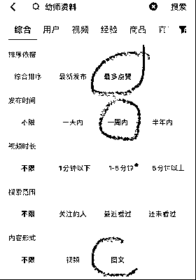
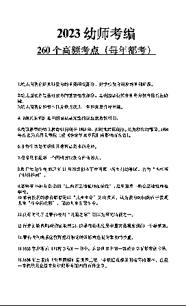
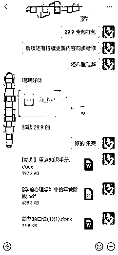
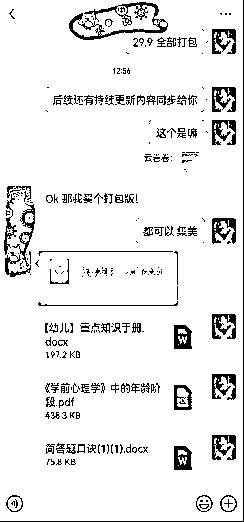
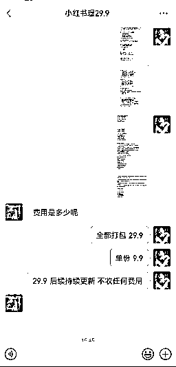
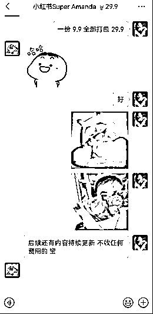
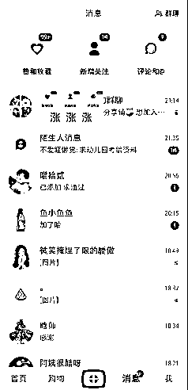
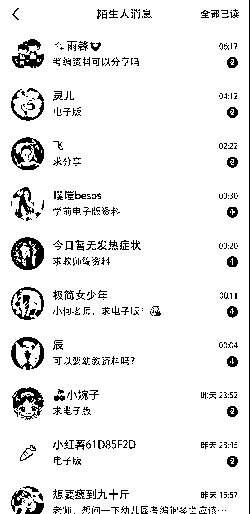
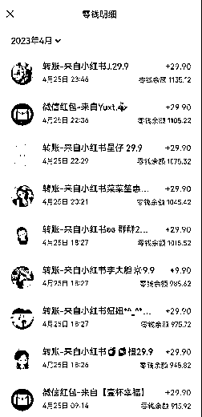
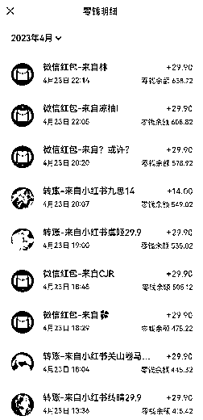

# 2023 小红书虚拟电商幼教考编赛道单账号月入 3000 保姆级教程

> 原文：[`www.yuque.com/for_lazy/thfiu8/gbkrkebfbds1o6bq`](https://www.yuque.com/for_lazy/thfiu8/gbkrkebfbds1o6bq)

<ne-h2 id="89fd56f3" data-lake-id="89fd56f3"><ne-heading-ext><ne-heading-anchor></ne-heading-anchor><ne-heading-fold></ne-heading-fold></ne-heading-ext><ne-heading-content><ne-text id="u5fafd76a">(63 赞)2023 小红书虚拟电商幼教考编赛道单账号月入 3000 保姆级教程</ne-text></ne-heading-content></ne-h2> <ne-p id="u097e3a71" data-lake-id="u097e3a71"><ne-text id="u4ad4cbdc">作者： 书豪</ne-text></ne-p> <ne-p id="ua9383e7b" data-lake-id="ua9383e7b"><ne-text id="u1e2d2b88">日期：2023-08-18</ne-text></ne-p> <ne-p id="ueec2caaa" data-lake-id="ueec2caaa"><ne-text id="u5f4dbe05" style="color: rgb(47, 48, 52);">大家好，我是在杭州的龙珠圈友书豪，一个连续创业四年的 95 后，目前连续四年都年入百万</ne-text></ne-p> <ne-p id="u46653ee0" data-lake-id="u46653ee0"><ne-text id="u2a6df373" style="color: rgb(47, 48, 52);">今天给大家继续拆解一下小红书的赛道，前面给大家分享了小红书这个赛道的前景和制作爆款标题、图片、文案等的方法。</ne-text></ne-p> <ne-p id="ud47934c4" data-lake-id="ud47934c4"><ne-text id="ua61d3b01" style="color: rgb(47, 48, 52);">搬运，这个玩法在抖音、快手、视频号这些平台可能已经玩滥了，但小红书其实也是可以“搬运“的，为什么要加个引号，因为我们不是照抄，而是有技巧地模仿。</ne-text></ne-p> <ne-p id="u6d222cf5" data-lake-id="u6d222cf5"><ne-text id="u58d6f63a" style="color: rgb(47, 48, 52);">而我们最近新做的一个「幼教赛道」账号，就是利用这些方法在一个月的时间内单账号能达到 4500+的收入，今天我就把做这个账号的全部经验和心得告诉你。</ne-text></ne-p> <ne-p id="ud818b34e" data-lake-id="ud818b34e"><ne-text id="u3f2ce6f3" ne-bold="true">一、在抖音上找对标账号</ne-text></ne-p> <ne-oli index-type="0"><ne-oli-i>1</ne-oli-i><ne-oli-c class="ne-oli-content" id="ue7c6aaff" data-lake-id="ue7c6aaff"><ne-text id="u55a25549" style="color: rgb(0, 0, 0);">搜索</ne-text><ne-text id="ufa5b45bb" ne-bold="true">幼师资料</ne-text><ne-text id="u300f01df" style="color: rgb(0, 0, 0);">几个关键词</ne-text></ne-oli-c></ne-oli> <ne-oli index-type="0"><ne-oli-i>2</ne-oli-i></ne-oli><ne-oli index-type="0"><ne-oli-i>3</ne-oli-i><ne-oli-c class="ne-oli-content" id="uefddbf42" data-lake-id="uefddbf42"><ne-text id="u027d8638" style="color: rgb(0, 0, 0);">找到一周或小半个月对标的小爆款（点赞比较多的）图文视频</ne-text></ne-oli-c></ne-oli> <ne-oli index-type="0"><ne-oli-i>4</ne-oli-i></ne-oli><ne-oli index-type="0"><ne-oli-i>5</ne-oli-i><ne-oli-c class="ne-oli-content" id="uef736733" data-lake-id="uef736733"><ne-text id="ufb829cb4" style="color: rgb(0, 0, 0);">找对标一定要找目前在持续更新的对标账号，这样更容易去抄袭模仿</ne-text></ne-oli-c></ne-oli> <ne-oli index-type="0"><ne-oli-i>6</ne-oli-i></ne-oli><ne-oli index-type="0"><ne-oli-i>7</ne-oli-i><ne-oli-c class="ne-oli-content" id="u2a635c9b" data-lake-id="u2a635c9b"><ne-card data-card-name="image" data-card-type="inline" id="S3gk9" data-event-boundary="card"></ne-card><ne-card data-card-name="image" data-card-type="inline" id="fnRjF" data-event-boundary="card"></ne-card><ne-card data-card-name="image" data-card-type="inline" id="iEomr" data-event-boundary="card"></ne-card></ne-oli-c></ne-oli> <ne-p id="ue7e9f6a2" data-lake-id="ue7e9f6a2"><ne-text id="u667f01f3" ne-bold="true">二、 如何“搬运”对标账号作品：</ne-text></ne-p> <ne-p id="uc3cbf253" data-lake-id="uc3cbf253"><ne-text id="u12715f45" style="color: rgb(47, 48, 52);">1、这里就随便拿个对标账号的作品进行搬运</ne-text></ne-p> <ne-p id="uaaa628e5" data-lake-id="uaaa628e5"><ne-text id="ud6f51026" style="color: rgb(47, 48, 52);">2、先复制对标作品链接然后再去下水印，这里我推荐</ne-text><ne-text id="u35024a77" ne-bold="true">轻抖小程序，</ne-text><ne-text id="u2d65b6a5">使用起来比较方便</ne-text></ne-p> <ne-p id="u3471bb50" data-lake-id="u3471bb50"><ne-text id="u6861b994">3、图片下载之后在相册里进行编辑调色参数，这里对标账号我就不发出来了 还望多多理解，</ne-text><ne-text id="u673b70aa" ne-bold="true">原作者的图片如下</ne-text><ne-text id="ud7ae4ba2">：</ne-text></ne-p> <ne-p id="u55571783" data-lake-id="u55571783"><ne-card data-card-name="image" data-card-type="inline" id="k9HDA" data-event-boundary="card" style="color: rgb(47, 48, 52);"></ne-card><ne-card data-card-name="image" data-card-type="inline" id="gliWp" data-event-boundary="card" style="color: rgb(47, 48, 52);"></ne-card><ne-card data-card-name="image" data-card-type="inline" id="DMOCO" data-event-boundary="card" style="color: rgb(47, 48, 52);"></ne-card></ne-p> <ne-p id="uc4cccda8" data-lake-id="uc4cccda8"><ne-text id="u183d48a9" style="background-color: yellow;">以上三张是原作者的图片</ne-text><ne-text id="u08ffc709">：</ne-text><ne-text id="u2d44f0c2" style="color: red;">下面三张是我伪原创的图片过程</ne-text></ne-p> <ne-p id="ub40f453b" data-lake-id="ub40f453b"><ne-card data-card-name="image" data-card-type="inline" id="oGywO" data-event-boundary="card" style="color: rgb(47, 48, 52);"></ne-card><ne-card data-card-name="image" data-card-type="inline" id="unBIq" data-event-boundary="card" style="color: rgb(47, 48, 52);"></ne-card><ne-card data-card-name="image" data-card-type="inline" id="ATHsw" data-event-boundary="card" style="color: rgb(47, 48, 52);"></ne-card></ne-p> <ne-p id="ub6ee8c37" data-lake-id="ub6ee8c37"><ne-text id="u0af55b7c" style="color: rgb(47, 48, 52);">1、下载好图片后，然后在相册中找到你下载的图片开始进行编辑，</ne-text></ne-p> <ne-p id="u2203a14b" data-lake-id="u2203a14b"><ne-text id="uf9078a46" style="color: rgb(47, 48, 52);">2、目前我用的是安卓手机，第一步先进行</ne-text><ne-text id="u0b34e3f4" ne-bold="true">调节模式</ne-text><ne-text id="u013a736f">，这里调色根据大家的喜爱来</ne-text></ne-p> <ne-p id="u515a6ee8" data-lake-id="u515a6ee8"><ne-text id="u1e9eab84">3、然后进行第二步调整</ne-text><ne-text id="uf9abd89e" ne-bold="true">色温</ne-text><ne-text id="u305d55d7">，进行图片的颜色修改，这里可以选装不同的颜色，</ne-text><ne-text id="uf93bdc00" style="color: red;">黑色、蓝色、粉色、绿色、红色、棕色</ne-text><ne-text id="u984caf84">等等一系列颜色，可供大家选择</ne-text></ne-p> <ne-p id="ud31dec15" data-lake-id="ud31dec15"><ne-text id="u2f733f4a">4、在这编辑好之后大家可选择导出即可，以下几个是我做好的图片进行展示参考</ne-text></ne-p> <ne-p id="u2aac7d67" data-lake-id="u2aac7d67"><ne-card data-card-name="image" data-card-type="inline" id="mavWN" data-event-boundary="card" style="color: rgb(47, 48, 52);"></ne-card><ne-card data-card-name="image" data-card-type="inline" id="dtHVa" data-event-boundary="card"></ne-card></ne-p> <ne-p id="u9aa7e101" data-lake-id="u9aa7e101"><ne-text id="u5fe9f88f" style="color: rgb(47, 48, 52);">以上几张图片是根据我的喜爱和伪原创合成出来的图片，这样的基本操作直接过审，这些都是我亲自己测试使用得出来的，不好使用也不会跟大家分享出来。</ne-text></ne-p> <ne-p id="ucbd28cf0" data-lake-id="ucbd28cf0"><ne-text id="u7abb8428" style="color: rgb(47, 48, 52);">当然如果怕被系统识别，可以把这些文字复制出来到 word 文档中，自己进行二次编辑发布。</ne-text></ne-p> <ne-p id="u030734c7" data-lake-id="u030734c7"><ne-text id="ua765e4f2" ne-bold="true">三、资料怎么来？</ne-text></ne-p> <ne-p id="uc0b480b1" data-lake-id="uc0b480b1"><ne-text id="ubdea35a2" style="color: rgb(47, 48, 52);">从抖音把图文“搬运”到小红书后，静待流量的爆发，但是当流量起来了，怎么承接这部分用户呢？也就是说</ne-text><ne-text id="ua78ee5df" ne-bold="true">我出单了但是没有资料怎么办</ne-text><ne-text id="u20cf243a">？</ne-text></ne-p> <ne-p id="u2ee97c29" data-lake-id="u2ee97c29"><ne-text id="u7cbb35f0">很简单，</ne-text><ne-text id="u502ba8e0" ne-bold="true">专业的资料交给专业的人去做</ne-text><ne-text id="u656542be">，直接去找抖音对标账号的博主去买资料就好了，他们的资料绝对比我们自己去搜集来的资料完善。</ne-text></ne-p> <ne-p id="u82912b79" data-lake-id="u82912b79"><ne-card data-card-name="image" data-card-type="inline" id="vQ1a4" data-event-boundary="card" style="color: rgb(47, 48, 52);"></ne-card><ne-card data-card-name="image" data-card-type="inline" id="h9JVn" data-event-boundary="card"></ne-card></ne-p> <ne-p id="ubdd70d12" data-lake-id="ubdd70d12"><ne-text id="ufbda04b6" style="color: rgb(47, 48, 52);">以上是我在同行那边买的资料的过程，我的建议是在大家没有出单的时候不建议去买</ne-text></ne-p> <ne-p id="u248d8b4b" data-lake-id="u248d8b4b"><ne-text id="u1a6d8b55" style="color: rgb(47, 48, 52);">等你出单之后直接模拟用户直接去买就好了，只要把一份资料的钱收回来，后面就是纯利。</ne-text></ne-p> <ne-p id="ub15d0fa5" data-lake-id="ub15d0fa5"><ne-text id="u9cee609e" ne-bold="true">四、定价</ne-text></ne-p> <ne-p id="ud1052de4" data-lake-id="ud1052de4"><ne-text id="ub1ac9c8a" style="color: rgb(47, 48, 52);">我从抖音博主那边买的资料，有单份文件，也有打包卖的资料群</ne-text></ne-p> <ne-p id="u4206ac93" data-lake-id="u4206ac93"><ne-text id="u016e723a" style="color: rgb(47, 48, 52);">因此你也可以对你的用户这样进行售卖，比如一份资料 9.9，进资料群 29.9</ne-text></ne-p> <ne-p id="u8a51753f" data-lake-id="u8a51753f"><ne-text id="ube53d5e8" style="color: rgb(47, 48, 52);">大部分情况下用户都会选择 29.9，因为比 9.9 贵不了多少，还能多获得很多资料</ne-text></ne-p> <ne-p id="u47731984" data-lake-id="u47731984"><ne-card data-card-name="image" data-card-type="inline" id="sxC9Q" data-event-boundary="card" style="color: rgb(47, 48, 52);"></ne-card><ne-card data-card-name="image" data-card-type="inline" id="XVu6E" data-event-boundary="card" style="color: rgb(47, 48, 52);"></ne-card><ne-card data-card-name="image" data-card-type="inline" id="rlUms" data-event-boundary="card" style="color: rgb(47, 48, 52);"></ne-card></ne-p> <ne-p id="u91e67a14" data-lake-id="u91e67a14"><ne-text id="u0c577bd8" ne-bold="true">五、如何转化</ne-text></ne-p> <ne-p id="ue7bef753" data-lake-id="ue7bef753"><ne-text id="u9746eba3" style="color: rgb(47, 48, 52);">流量有了，资料有了，下一步就是转化。</ne-text></ne-p> <ne-p id="ua4b36fef" data-lake-id="ua4b36fef"><ne-text id="u6ede13d8" style="color: rgb(47, 48, 52);">但是转化也面临一个问题，自己本身并不是幼师，也没有相关经验，如果用户来问一些专业性较强的问题，回答不上来露馅了怎么办？</ne-text></ne-p> <ne-p id="u62a33eb1" data-lake-id="u62a33eb1"><ne-text id="u440116c5" style="color: rgb(47, 48, 52);">请放心，大多数已经倒流进微信的用户，他们的目的只有一个，就是拿资料，大多数人面对陌生人都是以自我为中心的，不会去管对方是谁，只要能满足自己的需求就行。</ne-text></ne-p> <ne-p id="ue33df4ba" data-lake-id="ue33df4ba"><ne-text id="uc580e298" style="color: rgb(47, 48, 52);">所以你可以去抖音对标博主那，假装你是一个准备考幼师的用户，去把他的话术学过来就行。</ne-text></ne-p> <ne-p id="uc5f29380" data-lake-id="uc5f29380"><ne-text id="u04773c9e" style="color: rgb(47, 48, 52);">这里我采用的是以「女性」的身份去跟别人聊天，比如多用</ne-text><ne-text id="u07df51c7" ne-bold="true">宝、集美、姐妹</ne-text><ne-text id="uc61a498a">这些去打招呼，增加亲切感，对方的抵触心就没那么强，转化会大大提升，以下用几张图片代替：</ne-text></ne-p> <ne-p id="u493706b2" data-lake-id="u493706b2"><ne-card data-card-name="image" data-card-type="inline" id="msGQP" data-event-boundary="card" style="color: rgb(47, 48, 52);"></ne-card><ne-card data-card-name="image" data-card-type="inline" id="omoRD" data-event-boundary="card" style="color: rgb(47, 48, 52);"></ne-card><ne-card data-card-name="image" data-card-type="inline" id="guW1i" data-event-boundary="card" style="color: rgb(47, 48, 52);"></ne-card></ne-p> <ne-p id="u5529f3da" data-lake-id="u5529f3da"><ne-text id="u91d417b9" style="color: rgb(47, 48, 52);">上面这五步就是我们做这个账号的大致流程</ne-text></ne-p> <ne-p id="u511ee135" data-lake-id="u511ee135"><ne-text id="u57f3164e" style="color: rgb(47, 48, 52);">虽然我们做虚拟资料流量没有别人的大，但是流量足够精准，一般情况下，这个账号一个千浏览，大概能引流到微信 20-30 人，最终成交 10 人以上，转化率是蛮高的：</ne-text></ne-p> <ne-p id="u43f82773" data-lake-id="u43f82773"><ne-card data-card-name="image" data-card-type="inline" id="QeoD3" data-event-boundary="card" style="color: rgb(47, 48, 52);"></ne-card><ne-card data-card-name="image" data-card-type="inline" id="oHArx" data-event-boundary="card" style="color: rgb(47, 48, 52);"></ne-card><ne-card data-card-name="image" data-card-type="inline" id="sI0A9" data-event-boundary="card" style="color: rgb(47, 48, 52);"></ne-card></ne-p> <ne-p id="uf42397f5" data-lake-id="uf42397f5"><ne-text id="ub8f66415" style="color: rgb(47, 48, 52);">以上都是一个账号的数据，原本我想一个账号跑通后，再多做几个账号去放大，但没想到的是，一个账号的消息你都回复不过来，因为全部都是精准用户，都是带着购买或者白嫖意愿的用户，成交自然就简单了，当然，也少不了一些白嫖怪，不过也不要紧，只要能引流到微信，后续就有转化的可能。</ne-text></ne-p> <ne-p id="ub75dcd6c" data-lake-id="ub75dcd6c"><ne-text id="ub4f3667b" style="color: rgb(47, 48, 52);">最后让大家看一下我这个新账号的变现情况：不能说大富大贵，但起码每天能固定收入小几百，饭钱不就有了吗</ne-text></ne-p> <ne-p id="ub0bffc4e" data-lake-id="ub0bffc4e"><ne-card data-card-name="image" data-card-type="inline" id="QHp4m" data-event-boundary="card" style="color: rgb(47, 48, 52);"></ne-card><ne-card data-card-name="image" data-card-type="inline" id="Vjgcq" data-event-boundary="card" style="color: rgb(47, 48, 52);"></ne-card><ne-card data-card-name="image" data-card-type="inline" id="IrMgn" data-event-boundary="card" style="color: rgb(47, 48, 52);"></ne-card></ne-p> <ne-p id="u93b8aee4" data-lake-id="u93b8aee4"><ne-text id="u699a24f4" style="color: rgb(47, 48, 52); background-color: rgb(255, 255, 255);">以上，一起生财有术！欢迎各位圈友前来交流，微信  wshinvest1</ne-text></ne-p> <ne-p id="u28c11a9b" data-lake-id="u28c11a9b"><ne-text id="uf35d3d73" style="color: rgb(47, 48, 52);">如果方向没有错的，那就死磕到底，接下来交给时间就好。</ne-text></ne-p> <ne-hole id="uad85cc12" data-lake-id="uad85cc12"><ne-card data-card-name="hr" data-card-type="block" id="KXvBK" data-event-boundary="card"><ne-p id="u1c5aa481" data-lake-id="u1c5aa481"><ne-text id="u0da5db2d">评论区：</ne-text></ne-p> <ne-p id="u7ea24182" data-lake-id="u7ea24182"><ne-text id="u8212c113">谢安生 : 高产，赞赞赞！[强][强][强]</ne-text> <ne-text id="u2942c2fa">易生 : 书豪教练牛啊，这个小红书玩法真多，就看怎么用啊</ne-text> <ne-text id="u88c7aa27">剽悍的大春 : 书豪点赞👍，牛逼</ne-text> <ne-text id="u7f91800f">雨烟 : 从抖音买的资料，里面会有原来的博主的水印吧，里面会有他自己的联系方式</ne-text> <ne-text id="u81fcd905">书豪 : 感谢安生[呲牙][呲牙]</ne-text> <ne-text id="u54341cde">书豪 : 易生是餐饮大佬，赚大钱找易生加盟</ne-text> <ne-text id="u0a978fb1">书豪 : 谢谢春哥</ne-text> <ne-text id="uef221bf5">书豪 : 去除水印不就好了</ne-text></ne-p> <ne-p id="u029985f7" data-lake-id="u029985f7"><ne-card data-card-name="image" data-card-type="inline" id="XeQ9x" data-event-boundary="card"></ne-card></ne-p> <ne-hole id="uf20949e6" data-lake-id="uf20949e6"><ne-card data-card-name="hr" data-card-type="block" id="ydKSX" data-event-boundary="card"></ne-card></ne-hole></ne-card></ne-hole>