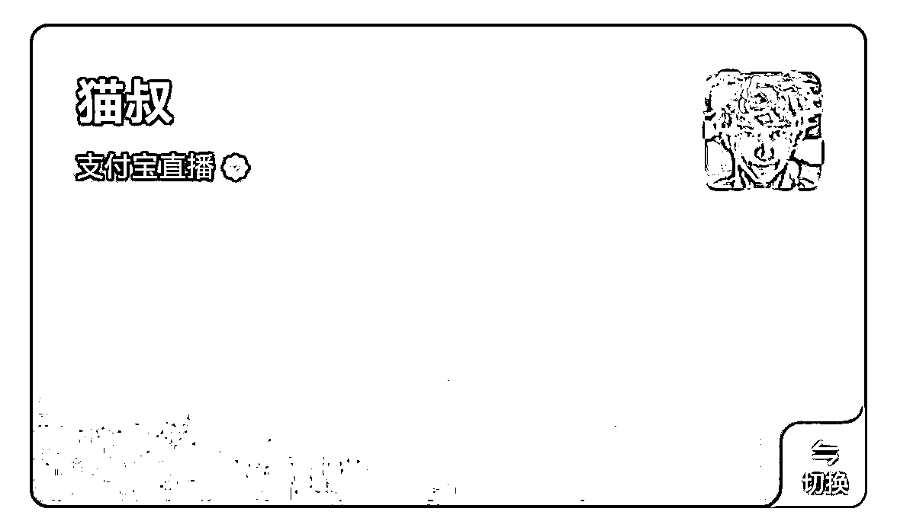
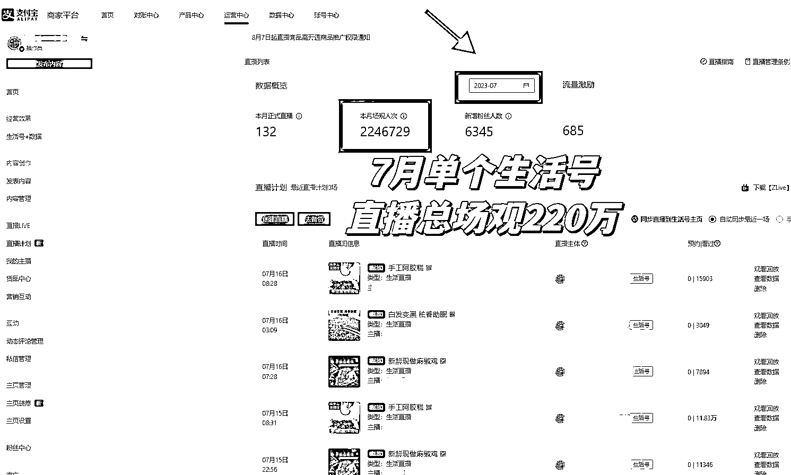

# 通过风向标发掘流量新红利，支付宝生活号直播单场 GMV1 万+，两个月 600 万场观

> 原文：[`www.yuque.com/for_lazy/thfiu8/udu25v4w2kcvlyvx`](https://www.yuque.com/for_lazy/thfiu8/udu25v4w2kcvlyvx)

<ne-h2 id="d84a6957" data-lake-id="d84a6957"><ne-heading-ext><ne-heading-anchor></ne-heading-anchor><ne-heading-fold></ne-heading-fold></ne-heading-ext><ne-heading-content><ne-text id="ue14bb1a6">(精华帖)(69 赞)通过风向标发掘流量新红利，支付宝生活号直播单场 GMV1 万+，两个月 600 万场观</ne-text></ne-heading-content></ne-h2> <ne-p id="u81d27f3f" data-lake-id="u81d27f3f"><ne-text id="ua9130828">作者： 猫叔</ne-text></ne-p> <ne-p id="u54a0a1a5" data-lake-id="u54a0a1a5"><ne-text id="u9a3cf69c">日期：2023-08-16</ne-text></ne-p> <ne-p id="uddfaffb5" data-lake-id="uddfaffb5"><ne-text id="u23a74686">大家好，我是猫叔，首先做个自我介绍，10 年老自媒体人，完整经历了从微信公众号的图文时代，到现在抖音、视频号、支付宝生活号等视频自媒体平台时代，先后参与过多个互联网项目，也算是老韭菜一枚了，同时对新鲜事物非常敏感。目前跟朋友合伙有两家公司，一家做跨境电商，一家刚从事支付宝直播相关业务。</ne-text></ne-p> <ne-p id="u729e6151" data-lake-id="u729e6151"><ne-text id="u3738900c">对于我这两个月在支付宝直播的探索，6、7 月份跑出来的数据是：</ne-text><ne-text id="u40a7fccd" ne-bold="true">4 个支付宝生活号，10 多个主播账号。直播总曝光 600 万+场观，单场直播近 GMV1 万+，总出单 2 万+</ne-text><ne-text id="uc4706554">。对于这次探索，我在不断的复盘和思考，支付宝生活号直播的趋势不比视频号、抖音要弱，作为金融业务起家、坐拥 10 亿用户，日均活跃超过 3 亿人的支付宝来说，大力推广支付宝直播成为了他们今年势不可挡的战略布局。而我们如何去入局呢？</ne-text></ne-p> <ne-p id="ua2220cf3" data-lake-id="ua2220cf3"><ne-text id="u14534735">不管是做自媒体、国内电商直播，还是做跨境电商，我都遵从一个原则，只做蓝海平台，只参与前期，只做轻投入试错。理由也很简单，一没有大的资金去跑成熟的供应链闭环，二目前这个时代平台政策日新月异，变化太快，很多时候一定要学会及时止损。好了下面进入正题。</ne-text></ne-p> <ne-p id="u68d231d6" data-lake-id="u68d231d6"><ne-card data-card-name="image" data-card-type="inline" id="VF8Or" data-event-boundary="card">  <ne-p id="u351284d5" data-lake-id="u351284d5"><ne-card data-card-name="image" data-card-type="inline" id="wbC1d" data-event-boundary="card">  <ne-p id="u8676eebe" data-lake-id="u8676eebe"><ne-card data-card-name="image" data-card-type="inline" id="OYPQl" data-event-boundary="card">  <ne-p id="u026b8b47" data-lake-id="u026b8b47"><ne-text id="u53c5d121" ne-bold="true" ne-italic="true">因为现在支付宝还没有出数据罗盘，只能直接放后台数据（单个生活号 7 月 220 万直播场观，单场直播 1 万+GMV）</ne-text></ne-p> <ne-p id="u2ede975b" data-lake-id="u2ede975b"><ne-text id="u7b4e6eba">篇幅字数有点多，为了方便阅读，请大家移步到飞书文档：</ne-text></ne-p> <ne-p id="u93cdb296" data-lake-id="u93cdb296">[<ne-text id="u4d600d3b">通过风向标，发掘流量新红利，支付宝生活号直播单场 GMV1 万+，两个月 600 万场观</ne-text>](https://otnh7rfhg0.feishu.cn/docx/XWxMdVrZgoBhwlxkgmWc0L98nQe?from=from_copylink)</ne-p> <ne-p id="u72f74117" data-lake-id="u72f74117"><ne-text id="ufd24189b" style="background-color: rgb(255, 255, 255); color: rgb(47, 48, 52);">最后特别感谢生财提供在星球分享的机会，希望 2023 年我们一起生财有术！</ne-text></ne-p> <ne-hole id="u415534ea" data-lake-id="u415534ea"><ne-card data-card-name="hr" data-card-type="block" id="U4z7O" data-event-boundary="card"><ne-p id="ub963ef9b" data-lake-id="ub963ef9b"><ne-text id="u4d67cc0c">评论区：</ne-text></ne-p> <ne-p id="u74a6c6b8" data-lake-id="u74a6c6b8"><ne-text id="u3ee5e0e9">Elvira 叶伊 : 能链接一下吗？我也在做直播</ne-text> <ne-text id="u839ed16a">猫叔 : 我 v:yanjiufu01</ne-text> <ne-text id="ud9257637">亦仁 : 感谢分享，已加精华。</ne-text> <ne-text id="u2c0aaeaa">猫叔 : 感谢亦仁大佬[抱拳][握手]</ne-text> <ne-text id="ucb2e0e44">书情小跟班 : 大佬，链接下</ne-text> <ne-text id="ua1840c04">猫叔 : 好的</ne-text> <ne-text id="u68d18552">帅彬 : 谢谢</ne-text></ne-p> <ne-p id="u4accdd8c" data-lake-id="u4accdd8c"><ne-card data-card-name="image" data-card-type="inline" id="qoxH0" data-event-boundary="card">  <ne-hole id="u08f1809f" data-lake-id="u08f1809f"><ne-card data-card-name="hr" data-card-type="block" id="NZsTH" data-event-boundary="card"></ne-card></ne-hole></ne-card></ne-p></ne-card></ne-hole></ne-card></ne-p></ne-card></ne-p></ne-card></ne-p>