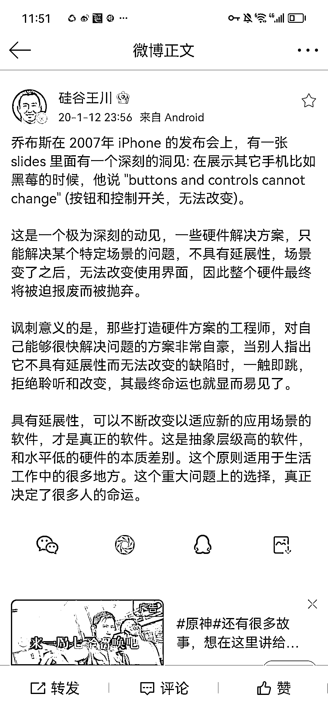

# 具有延展性，才是真正的软件

> 原文：[`www.yuque.com/for_lazy/thfiu8/uaypm901uyqhwiwz`](https://www.yuque.com/for_lazy/thfiu8/uaypm901uyqhwiwz)

<ne-h2 id="c133100b" data-lake-id="c133100b"><ne-heading-ext><ne-heading-anchor></ne-heading-anchor><ne-heading-fold></ne-heading-fold></ne-heading-ext><ne-heading-content><ne-text id="u8d1a2c33">(8 赞)具有延展性，才是真正的软件</ne-text></ne-heading-content></ne-h2> <ne-p id="u54661912" data-lake-id="u54661912"><ne-text id="u71a30f22">作者： 亦仁的收藏夹</ne-text></ne-p> <ne-p id="u51003bb3" data-lake-id="u51003bb3"><ne-text id="uc032c650">日期：2023-08-17</ne-text></ne-p> <ne-p id="uc0be08bd" data-lake-id="uc0be08bd"><ne-text id="u2a2bc49b">具有延展性，可以不断改变以适应新的应用场景的软件，才是真正的软件。</ne-text><ne-card data-card-name="image" data-card-type="inline" id="DjYCT" data-event-boundary="card"></ne-card></ne-p> <ne-hole id="u58741e41" data-lake-id="u58741e41"><ne-card data-card-name="hr" data-card-type="block" id="CbkDK" data-event-boundary="card"><ne-p id="u943ad00a" data-lake-id="u943ad00a"><ne-text id="u5a3705f5">评论区：</ne-text></ne-p> <ne-p id="u17f4ebbb" data-lake-id="u17f4ebbb"><ne-text id="u0dae3070">暂无评论</ne-text></ne-p> <ne-p id="u15a9a8ef" data-lake-id="u15a9a8ef"><ne-card data-card-name="image" data-card-type="inline" id="oNm73" data-event-boundary="card">  <ne-hole id="u0898e161" data-lake-id="u0898e161"><ne-card data-card-name="hr" data-card-type="block" id="xKtX7" data-event-boundary="card"></ne-card></ne-hole></ne-card></ne-p></ne-card></ne-hole>