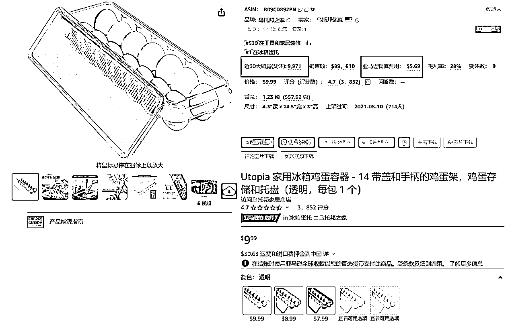
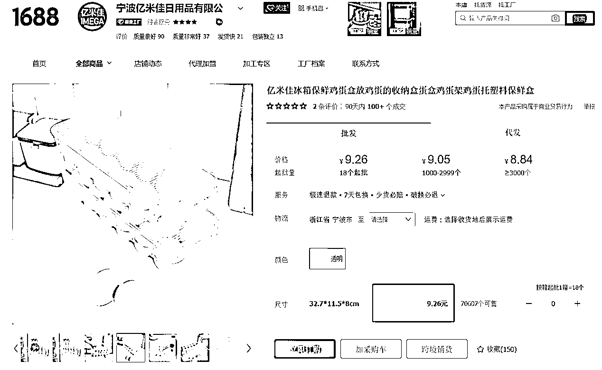
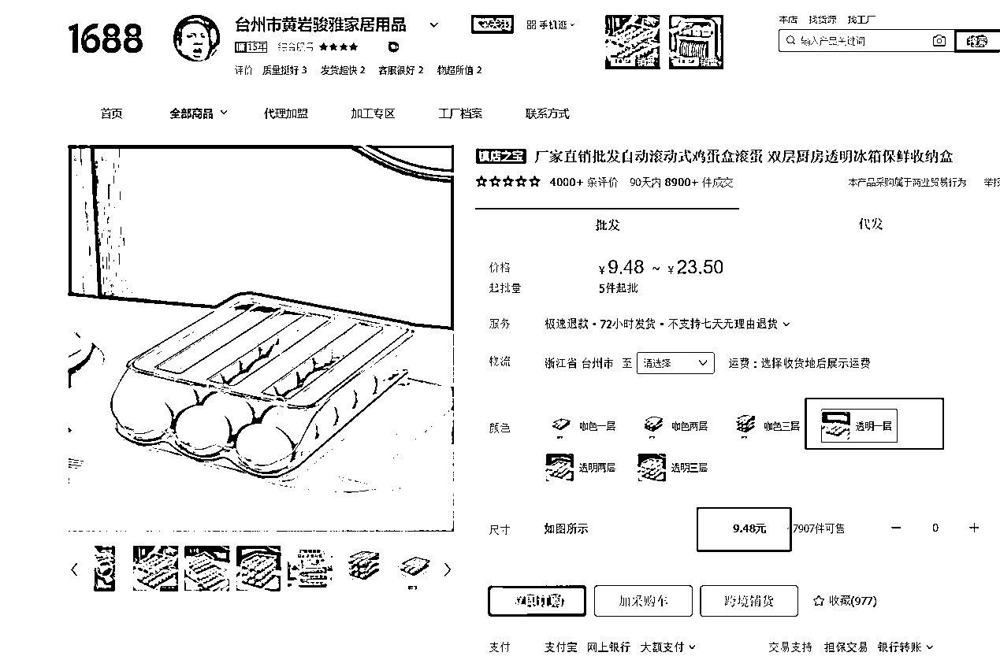
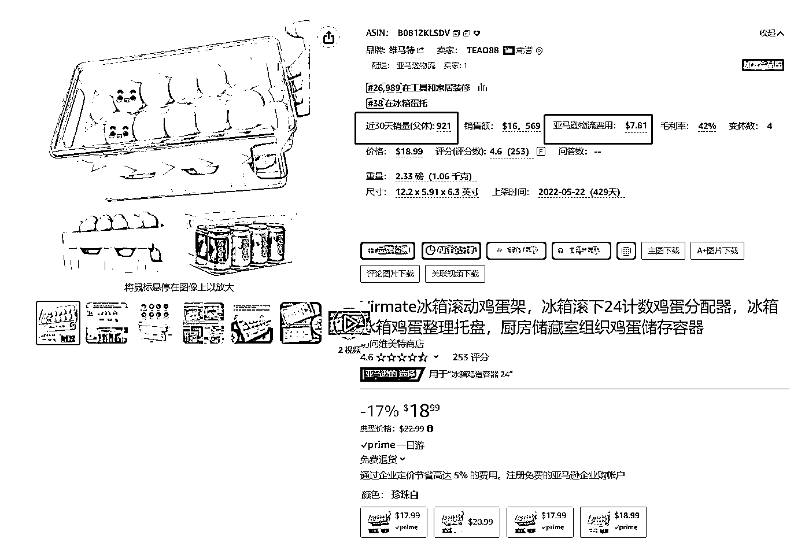
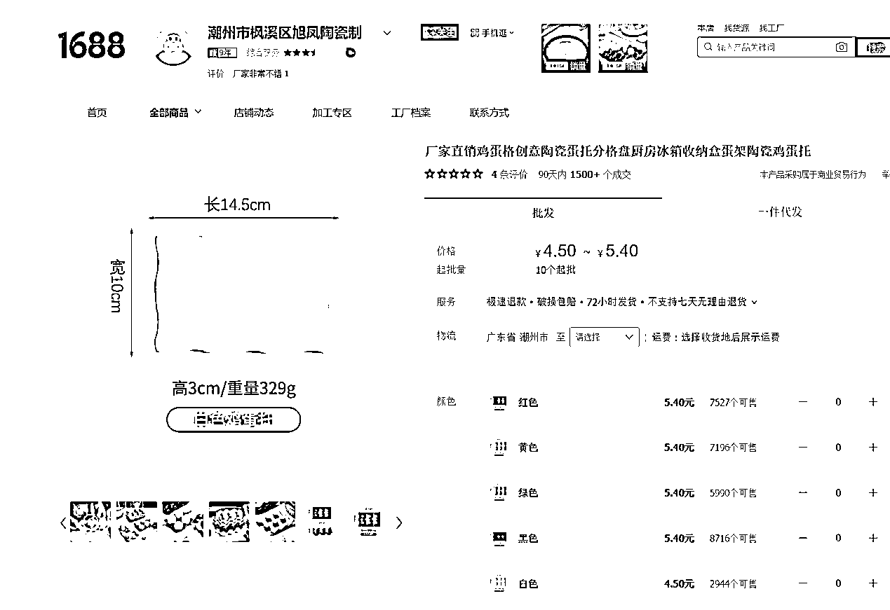
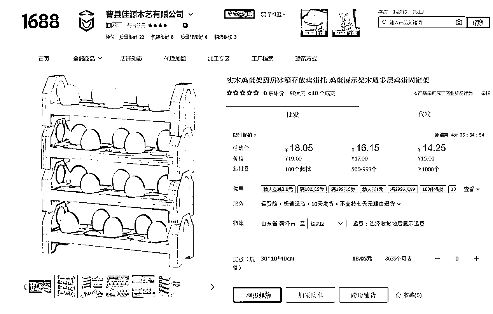
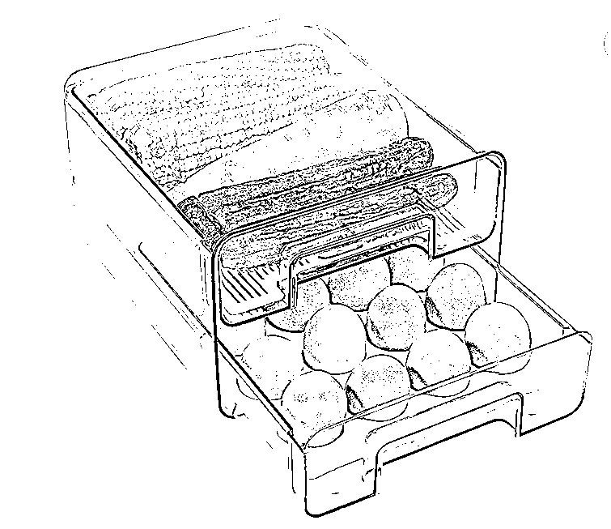
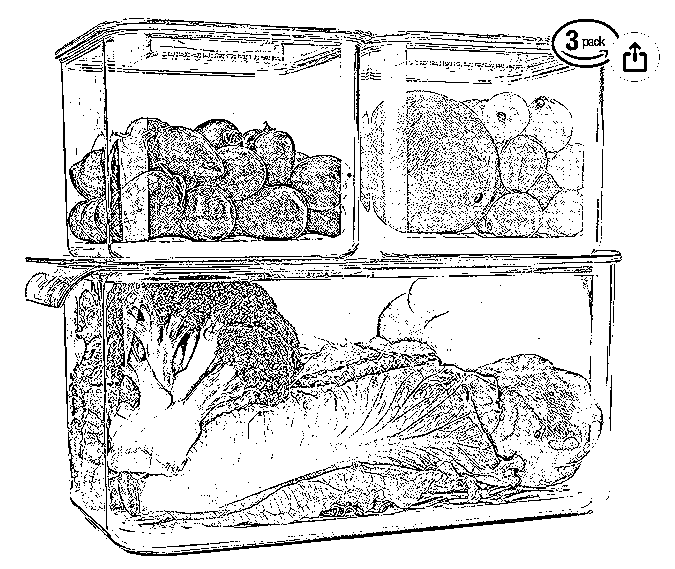
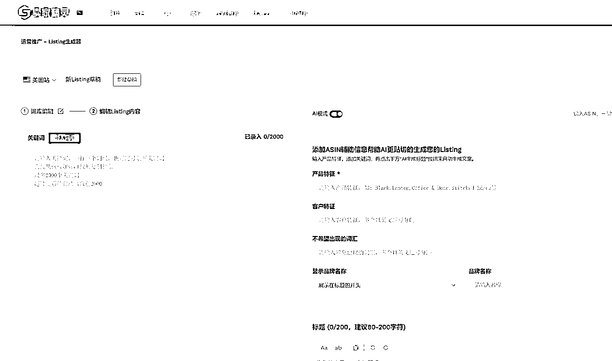
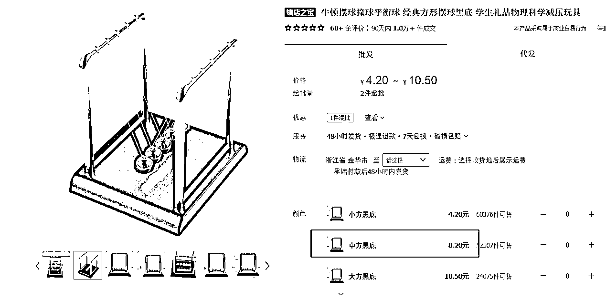

# 3-4 人小团队如何做亚马逊精铺，实现利润翻倍增长？

> 原文：[`www.yuque.com/for_lazy/thfiu8/hs2mnzff16gq3g8f`](https://www.yuque.com/for_lazy/thfiu8/hs2mnzff16gq3g8f)

<ne-h2 id="27cf05ef" data-lake-id="27cf05ef"><ne-heading-ext><ne-heading-anchor></ne-heading-anchor><ne-heading-fold></ne-heading-fold></ne-heading-ext><ne-heading-content><ne-text id="u4fcd86b1">(35 赞)3-4 人小团队如何做亚马逊精铺，实现利润翻倍增长？</ne-text></ne-heading-content></ne-h2> <ne-p id="u9310c230" data-lake-id="u9310c230"><ne-text id="u32c4202e">作者： 黄达龙</ne-text></ne-p> <ne-p id="ud1d4b4c7" data-lake-id="ud1d4b4c7"><ne-text id="u118149e6">日期：2023-08-18</ne-text></ne-p> <ne-p id="u9f52e55e" data-lake-id="u9f52e55e"><ne-text id="u67c552b4">冰箱里的一个鸡蛋收纳盒可以作为一个电商选品，那冰箱里的蔬菜或水果置物盒，是不是也可以呢？如果再延伸到厨房里的其他物品上，是不是也适用？</ne-text></ne-p> <ne-p id="ufd1f0c4f" data-lake-id="ufd1f0c4f"><ne-text id="uebaa97e0">我现在做亚马逊就是用的这个方法，目前一个月的销售额在 60 万美金左右。今天，我就结合自己的经验从选品、团队搭建等方面来讲讲，如何通过精铺模式做好亚马逊。</ne-text></ne-p> <ne-h1 id="2af57542" data-lake-id="2af57542"><ne-heading-ext><ne-heading-anchor></ne-heading-anchor><ne-heading-fold></ne-heading-fold></ne-heading-ext><ne-heading-content><ne-text id="u19340a92" ne-bold="true">一、自我介绍</ne-text></ne-heading-content></ne-h1> <ne-p id="u360fc834" data-lake-id="u360fc834"><ne-text id="ud188b049" style="color: rgb(31, 35, 41);">18 年通过国内一件代发项目几千元开始创业，19 年 800 多万销售额，20 年国内下滑的同时，研究亚马逊，21 年亚马逊销售 60 万美金，22 年 380 万美金，23 年目前月销售额 60 万美金左右。</ne-text></ne-p> <ne-p id="u04cfdf95" data-lake-id="u04cfdf95"><ne-text id="u256a061f" style="color: rgb(31, 35, 41);">亚马逊有精品、精铺、铺货等模式，精品属于红海爆款，精铺属于小爆款或者低需求市场，铺货属于概率性模式海量产品。</ne-text></ne-p> <ne-p id="u3d04f2e7" data-lake-id="u3d04f2e7"><ne-text id="uddfa5147" style="color: rgb(31, 35, 41);">目前我们做的是精铺的模式。</ne-text></ne-p> <ne-p id="u54aa5139" data-lake-id="u54aa5139"><ne-text id="u920f8227" style="color: rgb(31, 35, 41);">刚开始接触亚马逊时，并不知道有这三种模式，只是根据自身能切入的方式就开始尝试了。店铺数据验证后，开始团队搭建，然后解决供应链，通过不断的产品、经验、供应链的积累，获得了一定的销售数据。</ne-text></ne-p> <ne-h1 id="a1d7ba93" data-lake-id="a1d7ba93"><ne-heading-ext><ne-heading-anchor></ne-heading-anchor><ne-heading-fold></ne-heading-fold></ne-heading-ext><ne-heading-content><ne-text id="u74b5207c" style="color: rgb(31, 35, 41);">二、</ne-text><ne-text id="ub1cbf19e" ne-bold="true">亚马逊精铺</ne-text></ne-heading-content></ne-h1> <ne-p id="ue350b2bf" data-lake-id="ue350b2bf"><ne-text id="uee954d78" ne-bold="true">机会</ne-text><ne-text id="u9ac76c4a" style="color: rgb(31, 35, 41);">：</ne-text></ne-p> <ne-p id="u4fd3f111" data-lake-id="u4fd3f111"><ne-text id="u4508771d" style="color: rgb(31, 35, 41);">亚马逊相对于国内电商来说，竞争系数比较小，还有汇率的加持，整体的 ROI 比较高。入行以来美金兑人民币汇率最低 6.4，最高 7.3。目前 ROI 可以达到 3。</ne-text></ne-p> <ne-p id="ufd664922" data-lake-id="ufd664922"><ne-text id="u583b6505" style="color: rgb(31, 35, 41);">我们精铺模式的核心在于选品以及跟品，选品我们只要求日出几单就可以切入了客单价 20$左右，通过一定的积累后，有些产品也能达到月销 800 单左右。</ne-text></ne-p> <ne-p id="ue12177ab" data-lake-id="ue12177ab"><ne-text id="u4a3051b2" ne-bold="true">选品</ne-text><ne-text id="uded5880d" style="color: rgb(31, 35, 41);">：</ne-text></ne-p> <ne-p id="ue8ab0043" data-lake-id="ue8ab0043"><ne-text id="u75749ddd" style="color: rgb(31, 35, 41);">根据以往熟悉的产品、能触达的供应链、身边的灵感，找到一些商品。</ne-text></ne-p> <ne-p id="u211d8c1a" data-lake-id="u211d8c1a"><ne-text id="u944a3435" style="color: rgb(31, 35, 41);">譬如，厨房用于收纳鸡蛋的盒子，是我们身边随时都可以触及的，通过反查亚马逊数据，发现竞争不大、或者可以找到优化方式，以及 1688 的工厂能够配合，那么就可以尝试了。</ne-text></ne-p> <ne-p id="u00b13fdc" data-lake-id="u00b13fdc"><ne-text id="ub0fa5ef1" ne-bold="true">举例</ne-text><ne-text id="uc2b4544e" style="color: rgb(31, 35, 41);">：</ne-text></ne-p> <ne-p id="uaa3f0840" data-lake-id="uaa3f0840"><ne-text id="u9e7353f9" style="color: rgb(31, 35, 41);">在前台调研 egg holder 时，发现此款商品，月销可以达到 9000 件，亚马逊配送费用是 5.69$，15%佣金是 1.5$，回款有 9.99-5.69-1.5=2.8$，投入：1688 拿货成本是 9.26，换成美金不到 1.5$，头程海运大约 1$左右，回款 2.8-1.5-1=0.3$，未计算退货以及广告等。</ne-text></ne-p> <ne-p id="u0241168b" data-lake-id="u0241168b"><ne-text id="u83964bf7" style="color: rgb(31, 35, 41);">毛利率仅有 3%，通过不断的找品、验证，会积累一定的选品技能、供应商沟通技能以及产品分析技能。</ne-text></ne-p> <ne-p id="uf66fc89c" data-lake-id="uf66fc89c"><ne-card data-card-name="image" data-card-type="inline" id="dSBkV" data-event-boundary="card"></ne-card></ne-p> <ne-p id="u77223f92" data-lake-id="u77223f92"><ne-card data-card-name="image" data-card-type="inline" id="qZjdd" data-event-boundary="card"></ne-card></ne-p> <ne-p id="u29f8b9f7" data-lake-id="u29f8b9f7"><ne-text id="u6dcb8b07" style="color: rgb(31, 35, 41);">持续的调研过程中，发现客单价高点，尾程&佣金占比低于 40%，切入机会相对容易点。</ne-text></ne-p> <ne-p id="udc3445be" data-lake-id="udc3445be"><ne-text id="u7ba3b43d" style="color: rgb(31, 35, 41);">譬如一下这个款，月销可以达到 1 万件，亚马逊配送费用是 6.39$，15%佣金是 2.7$，回款有 17.99-6.39-2.7=8.9$，投入：1688 拿货成本是 9.48，换成美金不到 1.5$，头程海运大约 1$左右，回款 8.9-1.5-1=6.4$，未计算退货以及广告等。</ne-text></ne-p> <ne-p id="u75a45b9f" data-lake-id="u75a45b9f"><ne-text id="u60c1f0d4" style="color: rgb(31, 35, 41);">毛利率可以达到 35%。ROI=投入 6.4$/2.5$=2.5，得出毛利率以及 ROI 在自己能接受的范围内后，可以找供应商沟通采购发货事项。</ne-text></ne-p> <ne-p id="u464c853b" data-lake-id="u464c853b"><ne-card data-card-name="image" data-card-type="inline" id="GJJQ2" data-event-boundary="card"></ne-card></ne-p> <ne-p id="ucde8f345" data-lake-id="ucde8f345"><ne-card data-card-name="image" data-card-type="inline" id="HMiGd" data-event-boundary="card"></ne-card></ne-p> <ne-p id="ua7de72a1" data-lake-id="ua7de72a1"><ne-text id="udabe0af7" style="color: rgb(31, 35, 41);">有了第一款的切入后，积累 listing、发货、供应商沟通、头程、广告等经验，可以考虑横向延伸，找到相对有切入机会的产品，但是用户人群是一致的。</ne-text></ne-p> <ne-p id="ue7ba9c00" data-lake-id="ue7ba9c00"><ne-card data-card-name="image" data-card-type="inline" id="nc3kb" data-event-boundary="card"></ne-card></ne-p> <ne-p id="u4b92507c" data-lake-id="u4b92507c"><ne-card data-card-name="image" data-card-type="inline" id="Ic5F1" data-event-boundary="card"></ne-card></ne-p> <ne-p id="u699d41b3" data-lake-id="u699d41b3"><ne-text id="ue14c307e" style="color: rgb(31, 35, 41);">通过几款产品的验证后，梳理出自己对于选品的需求，譬如日销达到 5 个，利润率 30%左右，退货率 5%左右，那么下次选品时可能会更加清晰。在塑料材质的同时，也可以考虑其他的材质，譬如陶瓷类的</ne-text></ne-p> <ne-p id="u41b09e05" data-lake-id="u41b09e05"><ne-card data-card-name="image" data-card-type="inline" id="EyOU6" data-event-boundary="card"></ne-card></ne-p> <ne-p id="u6cddd85d" data-lake-id="u6cddd85d"><ne-text id="ud2010176" style="color: rgb(31, 35, 41);">金属类的</ne-text></ne-p> <ne-p id="ue86db557" data-lake-id="ue86db557"><ne-card data-card-name="image" data-card-type="inline" id="yQTBd" data-event-boundary="card"></ne-card></ne-p> <ne-p id="u3ad2d6ff" data-lake-id="u3ad2d6ff"><ne-text id="u28c51e79" style="color: rgb(31, 35, 41);">木制类的</ne-text></ne-p> <ne-p id="u25d46bd4" data-lake-id="u25d46bd4"><ne-card data-card-name="image" data-card-type="inline" id="vNP8c" data-event-boundary="card"></ne-card></ne-p> <ne-p id="u807ad6b8" data-lake-id="u807ad6b8"><ne-text id="uae53090b" style="color: rgb(31, 35, 41);">当鸡蛋置物架感觉遇到瓶颈时，有足够的时间精力以及资源匹配，可以延伸到厨房场景的其他产品。</ne-text></ne-p> <ne-p id="u09a109ae" data-lake-id="u09a109ae"><ne-card data-card-name="image" data-card-type="inline" id="lKf9D" data-event-boundary="card"></ne-card></ne-p> <ne-p id="u60ca3036" data-lake-id="u60ca3036"><ne-card data-card-name="image" data-card-type="inline" id="VAjcC" data-event-boundary="card"></ne-card></ne-p> <ne-p id="u97b58804" data-lake-id="u97b58804"><ne-text id="u77685ca9" style="color: rgb(31, 35, 41);">在此过程中，不断积累供应链资源，了解每一道生产工艺，物料成本，有利于后期研发私模产品。</ne-text></ne-p> <ne-p id="u2ab42432" data-lake-id="u2ab42432"><ne-text id="ua00be302" style="color: rgb(31, 35, 41);">在以上几款置物盒获得一定的数据后，可以反向找到工厂开发、延伸，通过不断的复制，可以从材料入手，譬如塑料制品浴室场景、庭院场景、超市场景等。</ne-text></ne-p> <ne-p id="u5ba8a1cd" data-lake-id="u5ba8a1cd"><ne-text id="ucfae4e9a" ne-bold="true">供应链</ne-text><ne-text id="u1fe52ab9" style="color: rgb(31, 35, 41);">：店铺有一定的销售数据后，通过 1688 的了解，发现塑料的供应商在浙江居多，可以先去拜访几位合作过的工厂，参观生产线、请教一些生产上的问题。</ne-text></ne-p> <ne-p id="u04de99b1" data-lake-id="u04de99b1"><ne-text id="u545780b2" style="color: rgb(31, 35, 41);">有一定的了解后，根据自己的需求匹配工厂，譬如该工厂没有 1688 店铺，自己有能力设计模具、自己生产加工、订单不饱和、资金不充沛等，跟工厂深入合作，前期给予一定的支持，模具费、货款全部现金，但是要求快速小批量出产品等。</ne-text></ne-p> <ne-h1 id="7c761b1f" data-lake-id="7c761b1f"><ne-heading-ext><ne-heading-anchor></ne-heading-anchor><ne-heading-fold></ne-heading-fold></ne-heading-ext><ne-heading-content><ne-text id="u21244882" style="color: rgb(31, 35, 41);">三、</ne-text><ne-text id="u90f42e1b" ne-bold="true">团队搭建</ne-text></ne-heading-content></ne-h1> <ne-p id="ue9aa0570" data-lake-id="ue9aa0570"><ne-text id="u1eb568f3" style="color: rgb(31, 35, 41);">①</ne-text> <ne-text id="u4622e9a1" ne-bold="true">合伙人</ne-text><ne-text id="ub6325198" style="color: rgb(31, 35, 41);">：</ne-text></ne-p> <ne-p id="u99091e9a" data-lake-id="u99091e9a"><ne-text id="ude4c669f" style="color: rgb(31, 35, 41);">通过现货测试后，跑通数据后，寻找身边价值观吻合，有一定信任基础的朋友一起打造。跨界小白，无需电商经验，无需资金投入，合作的前提是彼此信任、尊重，价值观不吻合、工作不闭环的，不考虑合作，以免后期产生内耗。</ne-text></ne-p> <ne-p id="uf921fc1c" data-lake-id="uf921fc1c"><ne-text id="u6bb1f11d" style="color: rgb(31, 35, 41);">喜欢自己打造的，也可以考虑招人，这样会更可控些；</ne-text></ne-p> <ne-p id="u09296445" data-lake-id="u09296445"><ne-text id="u4fc71f5f" style="color: rgb(31, 35, 41);">②</ne-text> <ne-text id="u6ece31ad" ne-bold="true">运营</ne-text><ne-text id="u2814fb91" style="color: rgb(31, 35, 41);">：</ne-text></ne-p> <ne-p id="u461854ef" data-lake-id="u461854ef"><ne-text id="u755eca7f" style="color: rgb(31, 35, 41);">1、小伙伴进来公司时会分配 1 个有业绩的老店铺以及 1 个新店铺，业绩提成从 3%-10%阶梯式。有一定的运营基础后，会给他多配 1 个新店铺，为下一位小伙伴做准备。</ne-text></ne-p> <ne-p id="ub5f184a8" data-lake-id="ub5f184a8"><ne-text id="u9f7f38d8" style="color: rgb(31, 35, 41);">2、当有新的小伙伴进来时，老员工需贡献一个老店铺给新人，我们理解为一种传承。老店铺给新人后，老员工只需要指导新人，协助其完成销售，但是此店铺老员工的提成会降低 50%。</ne-text></ne-p> <ne-p id="uc697f609" data-lake-id="uc697f609"><ne-text id="u52ade1fc" style="color: rgb(31, 35, 41);">到后续新员工上升之后，老员工基本不需要管理该店铺了，把时间精力放在自己的店铺上，享受被动收入。</ne-text></ne-p> <ne-p id="u14e01927" data-lake-id="u14e01927"><ne-text id="u883ad979" style="color: rgb(31, 35, 41);">3、当新员工再培养下一位时，第三位新员工的业绩只跟第二位员工有挂钩，被动收入只能享受到第二层级。</ne-text></ne-p> <ne-p id="ue75e3a1c" data-lake-id="ue75e3a1c"><ne-text id="u7f03b89c" style="color: rgb(31, 35, 41);">员工培养下一位时，会增加 1000 的底薪，但是贡献出去的店铺提成会降低 50%（本来每月可以拿 6%的话，共享出去后只能拿 3%）。</ne-text></ne-p> <ne-p id="ucaaa0ad8" data-lake-id="ucaaa0ad8"><ne-text id="ubbaeaeb0" style="color: rgb(31, 35, 41);">每一位员工的业绩提成比例时一致的，层级也是一致的，大家都可以想办法培养更多员工，不喜欢带人的也可以做好自己店铺。</ne-text></ne-p> <ne-p id="u5d0f79a6" data-lake-id="u5d0f79a6"><ne-text id="u3569a6fa" style="color: rgb(31, 35, 41);">③</ne-text> <ne-text id="u2ddcffa4" ne-bold="true">协议</ne-text><ne-text id="u49ace4c1" style="color: rgb(31, 35, 41);">：</ne-text></ne-p> <ne-p id="udcd7a35e" data-lake-id="udcd7a35e"><ne-text id="udbd93d3a" style="color: rgb(31, 35, 41);">针对性的拟合作协议、退出机制、持股比例等；</ne-text></ne-p> <ne-p id="u0a0ef70f" data-lake-id="u0a0ef70f"><ne-text id="ub1a9fbe2" style="color: rgb(31, 35, 41);">④</ne-text> <ne-text id="ua274a136" ne-bold="true">选品</ne-text><ne-text id="u8adc35ab" style="color: rgb(31, 35, 41);">：</ne-text></ne-p> <ne-p id="u05353f63" data-lake-id="u05353f63"><ne-text id="u54ee23ca" style="color: rgb(31, 35, 41);">上架测试过的产品，并且横向延伸出同类产品，最好是同个供应商；</ne-text></ne-p> <ne-p id="u1bbed388" data-lake-id="u1bbed388"><ne-text id="u11309ae7" style="color: rgb(31, 35, 41);">⑤</ne-text> <ne-text id="u3e2c57a3" ne-bold="true">文案</ne-text><ne-text id="uab9e5d1f" style="color: rgb(31, 35, 41);">：</ne-text></ne-p> <ne-p id="u9e0af27e" data-lake-id="u9e0af27e"><ne-text id="uc491b764" style="color: rgb(31, 35, 41);">打造 listing（链接），找供应商要素材图，淘宝协助修图，文案可读性的前提下，埋入部分关键词。卖家精灵有个 listing 生成器，前期学习的过程中，可以参考；</ne-text></ne-p> <ne-p id="ue4f6b54e" data-lake-id="ue4f6b54e"><ne-card data-card-name="image" data-card-type="inline" id="LWBZB" data-event-boundary="card"></ne-card></ne-p> <ne-p id="ud883dc10" data-lake-id="ud883dc10"><ne-text id="uf043e33d" style="color: rgb(31, 35, 41);">⑥</ne-text> <ne-text id="ubfc65231" ne-bold="true">广告</ne-text><ne-text id="ub47efde8" style="color: rgb(31, 35, 41);">：</ne-text></ne-p> <ne-p id="u0a5cd986" data-lake-id="u0a5cd986"><ne-text id="ua281541e" style="color: rgb(31, 35, 41);">上架后立马自动广告测试，看系统推荐的词或者同类商品是否吻合，验证 listing 有没有跑偏。自动广告的同时，针对性的投放到竞品；</ne-text></ne-p> <ne-p id="ue6456acd" data-lake-id="ue6456acd"><ne-text id="uac736071" style="color: rgb(31, 35, 41);">亚马逊官方广告网址：</ne-text></ne-p> <ne-p id="u76926d40" data-lake-id="u76926d40">[<ne-text id="ua4ed820a">https://advertising.amazon.com/zh-cn/resources/learning-console?ref_=a20m_us_hnav_lc_t1</ne-text>](https://advertising.amazon.com/zh-cn/resources/learning-console?ref_=a20m_us_hnav_lc_t1)</ne-p> <ne-p id="u20849a59" data-lake-id="u20849a59"><ne-text id="ue0ff5ea9" style="color: rgb(31, 35, 41);">⑦</ne-text> <ne-text id="u9398263c" ne-bold="true">分红</ne-text><ne-text id="u33d76a5a" style="color: rgb(31, 35, 41);">：</ne-text></ne-p> <ne-p id="u63f5a013" data-lake-id="u63f5a013"><ne-text id="u328cb437" style="color: rgb(31, 35, 41);">合伙人模式，前期由公司投入，当总回款大于总投入+预留资金时，约定超出的部分按比例次月分红。</ne-text></ne-p> <ne-p id="ufc20e97d" data-lake-id="ufc20e97d"><ne-text id="u1e4b1515" style="color: rgb(31, 35, 41);">譬如从创始至今，所有的投入共 20 万，亚马逊回款 50 万后，预留 20 万资金公司周转，另外 10 万可以拿出来分红。预留资金随着库存、周转资金可以商讨着调整。</ne-text></ne-p> <ne-p id="u2164b169" data-lake-id="u2164b169"><ne-text id="u405f7c5b" style="color: rgb(31, 35, 41);">不管是合伙人模式还是招人，前期有测试过的产品加持，已经各个流程已经跑通了，可以避免一段摸索的时间，并且增加了成功率。团队合作前期，尽量让问题出现的更多、更快，可以更好的磨合以及打造信任基础。</ne-text></ne-p> <ne-h1 id="829ac13c" data-lake-id="829ac13c"><ne-heading-ext><ne-heading-anchor></ne-heading-anchor><ne-heading-fold></ne-heading-fold></ne-heading-ext><ne-heading-content><ne-text id="u915680f8" style="color: rgb(31, 35, 41);">四、</ne-text><ne-text id="uc250ef60" ne-bold="true">亚马逊机会</ne-text></ne-heading-content></ne-h1> <ne-p id="u0b20aa08" data-lake-id="u0b20aa08"><ne-text id="ue4ed0398" ne-bold="true">亚马逊模式</ne-text><ne-text id="uf33f1538" style="color: rgb(31, 35, 41);">：铺货、精铺、精品；</ne-text></ne-p> <ne-p id="u71427455" data-lake-id="u71427455"><ne-text id="u96e856bd" ne-bold="true">亚马逊测算</ne-text><ne-text id="u0b0a077e" style="color: rgb(31, 35, 41);">：售价-佣金-尾程-成本-头程，佣金按照类目收取，参考：</ne-text></ne-p> <ne-p id="uf5e8520e" data-lake-id="uf5e8520e">[<ne-text id="u326194ab">https://sellercentral.amazon.com/help/hub/reference/GTG4BAWSY39Z98Z3</ne-text>](https://sellercentral.amazon.com/help/hub/reference/GTG4BAWSY39Z98Z3)</ne-p> <ne-p id="u42c15860" data-lake-id="u42c15860"><ne-text id="uf6db0599" ne-bold="true">尾程</ne-text><ne-text id="u40d9ff49" style="color: rgb(31, 35, 41);">按照体积、重量、长宽高等维度判断，可以参考以下链接：</ne-text></ne-p> <ne-p id="uf238b79c" data-lake-id="uf238b79c">[<ne-text id="ua2c196b1">https://sellercentral.amazon.com/help/hub/reference/GABBX6GZPA8MSZGW</ne-text>](https://sellercentral.amazon.com/help/hub/reference/GABBX6GZPA8MSZGW)</ne-p> <ne-p id="u3c08852b" data-lake-id="u3c08852b"><ne-text id="ufbfd0acd" ne-bold="true">头程</ne-text><ne-text id="u9c66ba14" style="color: rgb(31, 35, 41);">，海运按照体积、重量等计算，20 公斤起，目前慢船美西时效 40 天左右。空运也是体积重量参考，一件都可以发，目前时效 5-7 天。</ne-text></ne-p> <ne-p id="u1ea3ed43" data-lake-id="u1ea3ed43"><ne-text id="u883f5736" style="color: rgb(31, 35, 41);">尾程头程都有重量体积等参考维度，所以轻小商品是相对来说有这方面的优势。</ne-text></ne-p> <ne-p id="u331d66c1" data-lake-id="u331d66c1"><ne-text id="uea361fee" style="color: rgb(31, 35, 41);">根据这样的特质，可以借助软件工具</ne-text><ne-text id="ub8d8a0a2" ne-bold="true">选品</ne-text><ne-text id="u87e28f6f" style="color: rgb(31, 35, 41);">，譬如卖家精灵，</ne-text>[<ne-text id="u1e0d50af">https://www.sellersprite.com/.</ne-text>](https://www.sellersprite.com)<ne-text id="u98b495ae" style="color: rgb(31, 35, 41);">有个选市场功能，根据自己的情况，筛选条件。</ne-text></ne-p> <ne-p id="ua25bce4f" data-lake-id="ua25bce4f"><ne-text id="u07eb037c" ne-bold="true">举个例子：</ne-text></ne-p> <ne-p id="uc8154b8e" data-lake-id="uc8154b8e"><ne-text id="ucdc24863" style="color: rgb(31, 35, 41);">选市场-月销量小于 800-售价大于 16$-毛利率大于 50%-新品数量大于 20%（该软件有很多视频可以学习），通过筛选后发现 Executive Desk Toys （办公桌玩具），前台搜索发现结果数量 532，</ne-text></ne-p> <ne-p id="u5a5f902a" data-lake-id="u5a5f902a"><ne-card data-card-name="image" data-card-type="inline" id="KpbVa" data-event-boundary="card"></ne-card></ne-p> <ne-p id="ucbbb2191" data-lake-id="ucbbb2191"><ne-text id="uf7460c41" style="color: rgb(31, 35, 41);">往下调研后发现 10-20 美金区间销量占比最高，从中抽取了一个产品举例，并不是建议哈，因为我也没有做过这个类目。</ne-text></ne-p> <ne-p id="u555b33b6" data-lake-id="u555b33b6"><ne-card data-card-name="image" data-card-type="inline" id="kNQJH" data-event-boundary="card"></ne-card></ne-p> <ne-p id="u35d5db15" data-lake-id="u35d5db15"><ne-text id="u41f0d11f" style="color: rgb(31, 35, 41);">13.99 售价，尾程只要 4.08，佣金 15%，去除尾程、佣金后毛利率有 56%，就是还有 7.8$回款，中号成本 8.2 元，头程空运预计 12 元海运预计 2 元，即使空运还有 4.8 美金回款，34%毛利率。</ne-text></ne-p> <ne-p id="ufb5a1824" data-lake-id="ufb5a1824"><ne-card data-card-name="image" data-card-type="inline" id="iO4fC" data-event-boundary="card"></ne-card></ne-p> <ne-p id="u5343a405" data-lake-id="u5343a405"><ne-text id="u16a1b803" style="color: rgb(31, 35, 41);">所以，建议新切入的小伙伴，可以尽量选择轻小商品，通过学习调研（卖家精灵有很多视频可以学习，有 5 分深入已经领先很多人了），找到细分类目，调研后找到对标产品，排除专利后，思考怎样优化。</ne-text></ne-p> <ne-p id="u443d28d7" data-lake-id="u443d28d7"><ne-text id="u5bc77772" style="color: rgb(31, 35, 41);">前期只能考虑赠品或者搭配组合的方式去切入，后期才考虑模具或者新颖设计。</ne-text></ne-p> <ne-p id="u8aef48e4" data-lake-id="u8aef48e4"><ne-text id="u4b4eb82a" style="color: rgb(31, 35, 41);">拿货发货，关于广告可以关注微信公众号：亚马逊广告，里面也有按照不同阶段提供了很多学习资料。</ne-text></ne-p> <ne-p id="ua1e34e6f" data-lake-id="ua1e34e6f"><ne-text id="u69ae9a63" style="color: rgb(31, 35, 41);">有了点的切入后，再慢慢延伸到面，验证好数据，可以考虑如何复制。</ne-text></ne-p> <ne-hole id="u158d670e" data-lake-id="u158d670e"><ne-card data-card-name="hr" data-card-type="block" id="mIpfQ" data-event-boundary="card"><ne-p id="u96ff5acd" data-lake-id="u96ff5acd"><ne-text id="uc1ca2826">评论区：</ne-text></ne-p> <ne-p id="u7edabfee" data-lake-id="u7edabfee"><ne-text id="ude204c02">西瓜 : 亚马逊品类分为精品，精铺，铺货。[强][强][强]</ne-text></ne-p> <ne-p id="u6243e8d7" data-lake-id="u6243e8d7"><ne-card data-card-name="image" data-card-type="inline" id="Phe0s" data-event-boundary="card"></ne-card></ne-p> <ne-hole id="ue23d05d2" data-lake-id="ue23d05d2"><ne-card data-card-name="hr" data-card-type="block" id="jcvtP" data-event-boundary="card"></ne-card></ne-hole></ne-card></ne-hole>