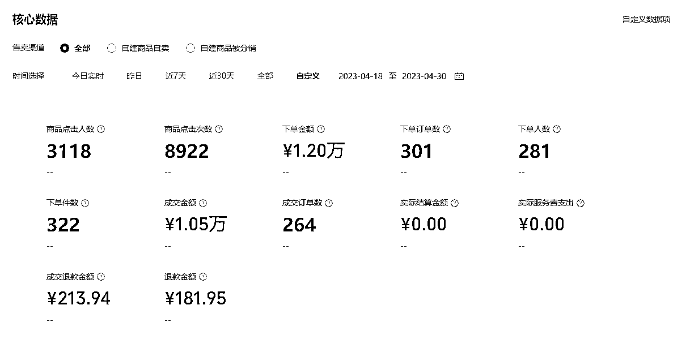
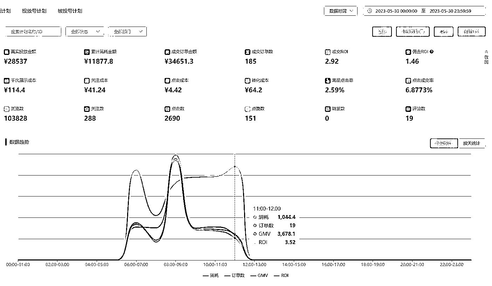

# 不逃避，只解决：我是如何通过视频号投放变现 30w+ 利润的

> 原文：[`www.yuque.com/for_lazy/thfiu8/zxveassf57gdnmyd`](https://www.yuque.com/for_lazy/thfiu8/zxveassf57gdnmyd)

<ne-h2 id="2f3db27d" data-lake-id="2f3db27d"><ne-heading-ext><ne-heading-anchor></ne-heading-anchor><ne-heading-fold></ne-heading-fold></ne-heading-ext><ne-heading-content><ne-text id="u572e6c3e">(精华帖)(184 赞)不逃避，只解决：我是如何通过视频号投放变现 30w+ 利润的</ne-text></ne-heading-content></ne-h2> <ne-p id="u31d7af54" data-lake-id="u31d7af54"><ne-text id="ue51c1aba">作者： Never</ne-text></ne-p> <ne-p id="u27c39dc3" data-lake-id="u27c39dc3"><ne-text id="u7ab7d9f7">日期：2023-08-14</ne-text></ne-p> <ne-p id="u4f792334" data-lake-id="u4f792334"><ne-text id="u72d69e59">大家好，我是 Never，5 月 6 月视频号航海船员，航海期间累计 GMV 过 100 万，变现 30 万+，这次视频号航海，收获非常多，非常感谢生财能提供一个这么好的平台，手把手的带着我们从零把项目做起来。</ne-text></ne-p> <ne-p id="ueee7048a" data-lake-id="ueee7048a"><ne-text id="u84404167">先做个简单自我介绍，之前做过 SEO 优化师，做了 6 年互联网产品经理，20 年跨行业做了 1 年阿里国际站运营，2 年亚马逊产品运营和产品研发，流量分发平台创业者。</ne-text></ne-p> <ne-p id="ub491f180" data-lake-id="ub491f180"><ne-text id="u029e852e">我目前也是一名标准的上班族，跟大家一样，对于副业一直是又爱又恨，爱看各种高手分享，赚钱技巧；恨自己行动力太差，眼高手低。</ne-text></ne-p> <ne-p id="u347bd1db" data-lake-id="u347bd1db"><ne-text id="ue081230a">但这一次，我终于证明了只要有决心和正确的方法，即便是普通人，也能创造出不错的成果。</ne-text></ne-p> <ne-p id="ubbaa6261" data-lake-id="ubbaa6261"><ne-text id="u6ab03772">除了做出一定的成绩，航海中我也收到分享的邀请，刚好趁这次分享，我把这段时间摸索投放的经验进行了整理复盘。对视频号投放感兴趣的小伙伴可以来看看，一起交流：</ne-text>[<ne-text id="uc96205c7">《视频号短视频投放分享》</ne-text>](https://search01.shengcaiyoushu.com/docx/TWubdznTRoUnoLxN6W0cWGNNn8b)</ne-p> <ne-p id="ua2f5cee9" data-lake-id="ua2f5cee9"><ne-text id="u54b48a2e">而这篇，我想主要聊聊在做视频号时是怎么获得第一个爆款，又是怎么开始视频号投放并且获得这个成绩的。</ne-text></ne-p> <ne-h2 id="9ee7fb9c" data-lake-id="9ee7fb9c"><ne-heading-ext><ne-heading-anchor></ne-heading-anchor><ne-heading-fold></ne-heading-fold></ne-heading-ext><ne-heading-content><ne-text id="uf20b490b">一、航海提前抢跑</ne-text></ne-heading-content></ne-h2> <ne-p id="u6be751e6" data-lake-id="u6be751e6"><ne-text id="uf1fef4dd">今年在生财，给自己定了 2 层目标，第一是赚回门票，第二是能稳定 3000 一个月，补贴日常开支。看了很多项目的航海手册，一直期待航海，计划在小红书和视频号中选择一个。</ne-text></ne-p> <ne-p id="ueeaf5868" data-lake-id="ueeaf5868"><ne-text id="ubbd2ca67">4 月底偶然看到生财圈友发的一篇文章，关于视频号三农视频搬运，通勤上班路上看完，马上脑海里闪过一个声音：我也能做！</ne-text></ne-p> <ne-p id="u40a5c498" data-lake-id="u40a5c498"><ne-text id="u1d125ff4">到公司后，我立即注册了一个新账号，上午抽空在抖音找了一圈对标账号，中午确定后，立即执行开始发视频。</ne-text></ne-p> <ne-p id="u33b5ff45" data-lake-id="u33b5ff45"><ne-text id="ufe02ed92">搬运了 10 个后，我看到视频数据不温不火。</ne-text></ne-p> <ne-p id="uba30f558" data-lake-id="uba30f558"><ne-text id="uff842c30">看到这样的数据，说实话我不意外，但是真的不甘心。视频在抖音效果很好，人群也没什么问题，那为什么他的爆了，而我的没有爆？</ne-text></ne-p> <ne-p id="u5cc9ef6c" data-lake-id="u5cc9ef6c"><ne-text id="u35e7bc08">这个问题，我问了自己一下午。等到晚饭的时候，我决定投放试一试，于是花 50 块加热了一下播放，晚上开始视频爆发，连续 3 天，过 100 万播放，后连续出了几个过 50 万播放的视频。</ne-text></ne-p> <ne-p id="uaf218c3a" data-lake-id="uaf218c3a"><ne-text id="u6d340d28">因为视频素材有一定的带货属性，从第一天晚上视频爆了开始，就有很多来咨询购买的用户，所以我第一天晚上基本上没睡觉，一口气开橱窗，选品中心找产品，微信小商店上架，企业微信，开视频号小店，不断优化引导话术……</ne-text></ne-p> <ne-p id="u92a644cd" data-lake-id="u92a644cd"><ne-text id="u0e52e9d4">三天下来，累计出单 1000+，变现 1 万+（下面小店数据，前两天优选联盟出了几百单，私域也出了几百单）</ne-text></ne-p> <ne-p id="u68503356" data-lake-id="u68503356"><ne-card data-card-name="image" data-card-type="inline" id="PfCps" data-event-boundary="card"></ne-card></ne-p> <ne-p id="ue31d8a38" data-lake-id="ue31d8a38"><ne-text id="u499d27bc">后来想想，如果用直播承接，单量还能翻几倍，但由于从来没有做过直播，胆怯没有去尝试，眼看着钱从指尖溜走。</ne-text></ne-p> <ne-p id="u1f1b3b5a" data-lake-id="u1f1b3b5a"><ne-text id="ua1421339">不过能有正反馈总是能让人精神一振，刚好航海也已经开船，毫不犹豫的上了视频号的船，算是在同一批船员里提前抢跑的一个。</ne-text></ne-p> <ne-h2 id="c0254a55" data-lake-id="c0254a55"><ne-heading-ext><ne-heading-anchor></ne-heading-anchor><ne-heading-fold></ne-heading-fold></ne-heading-ext><ne-heading-content><ne-text id="u3f4534e4">二、正反馈之后，我再也回不去了</ne-text></ne-heading-content></ne-h2> <ne-p id="u7b5d0cf8" data-lake-id="u7b5d0cf8"><ne-text id="u8e3c6445">大家都知道，自然流的稳定性会差一些，而且我一直都没有直播，所以在拿到一定的正反馈后，很焦虑，想拿到更多正反馈。就像亦仁之前有一次说过：</ne-text><ne-text id="u21a473a8" ne-bold="true">一旦靠自己真的赚过钱，特别是体会过这种收入暴击的感觉，就再也回不去了。</ne-text></ne-p> <ne-p id="ubfcd87eb" data-lake-id="ubfcd87eb"><ne-text id="uba7e491a">但在上次爆单之后，我陆陆续续搬了十几个三农新号都没什么效果。</ne-text></ne-p> <ne-p id="uae17900e" data-lake-id="uae17900e"><ne-text id="uc7c70a6a">这个时候，我整个人都开始处于相对比较分裂的状态了。对短视频行业的不了解，让我看不清这个行业该怎么前行，一方面我迫切的想把盈利的事情继续放大，一方面现实很残酷，效果一般，平均每天 5-20 单。</ne-text></ne-p> <ne-p id="u192a22e9" data-lake-id="u192a22e9"><ne-text id="ucfb6830a">当欲望放大，需要有足够的认知和执行力的支撑，感谢我兄弟 @bluest 龙哥的信息同步，了解到木易哥有一个线上直播课，是关于视频号投放的。</ne-text></ne-p> <ne-p id="ucc9285c5" data-lake-id="ucc9285c5"><ne-text id="u66fece28">我在反复学习了三四遍投放相关的东西后，并且在过往的航海文章、生财精华文章中，仔细研究了短视频投放相关的东西，开始自己尝试着去进行操作。</ne-text></ne-p> <ne-p id="u0ec96acf" data-lake-id="u0ec96acf"><ne-text id="u6dc760d6">当然，刚开始也是举步维艰，找视频素材、剪辑、过审，一个视频撞审 12 次没过，账号加热封禁，各种问题。但路总是一步步走出来的。之前跨行业做亚马逊，独自熬了 2 年勉强初窥门径，所以这次我耐住了性子，一步步想办法解决，好在这次没有等太久。</ne-text></ne-p> <ne-p id="u254df544" data-lake-id="u254df544"><ne-text id="u7a54bb48">5 月 18 日，正式投放成功第一天，GMV 接近 8000，30 号第一次 GMV 过 10 万。</ne-text></ne-p> <ne-p id="ud59339ec" data-lake-id="ud59339ec"><ne-card data-card-name="image" data-card-type="inline" id="IWo9V" data-event-boundary="card"></ne-card><ne-card data-card-name="image" data-card-type="inline" id="xy4pW" data-event-boundary="card"></ne-card></ne-p> <ne-p id="ub4bdd20a" data-lake-id="ub4bdd20a"><ne-text id="u7e0f67fe">仔细想想，这次做的最对的事情是对外链接，不断和航海的教练，优秀船员沟通，学习航海投放相关的文章，在生财看跟投放相关的方方面面，找答案，并且去杭州和木易老师链接取经。</ne-text></ne-p> <ne-h2 id="d512378f" data-lake-id="d512378f"><ne-heading-ext><ne-heading-anchor></ne-heading-anchor><ne-heading-fold></ne-heading-fold></ne-heading-ext><ne-heading-content><ne-text id="uff56bd09">三、视频号投放，最核心的并不是投放技巧</ne-text></ne-heading-content></ne-h2> <ne-p id="ub45b33b4" data-lake-id="ub45b33b4"><ne-text id="u61e63ba9">在初步吃到一些投放带来的红利之后，我继续前行，开始投放更多的产品。</ne-text></ne-p> <ne-p id="u4816e147" data-lake-id="u4816e147"><ne-text id="ue29c5e92">因为我自身对投放有一些经验，无论是信息流投放还是电商广告，做的都很多，但视频的感觉缺不是很强，我知道自己要做的是把视频这块去努力攻克。</ne-text></ne-p> <ne-p id="u0d79e17e" data-lake-id="u0d79e17e"><ne-text id="u38578807">为了培养自己对视频素材的感觉，我每天都会抽时间看海量的视频素材，有米有术的达人千川投放账户，被我反复看了 N 遍。</ne-text></ne-p> <ne-p id="u0f005806" data-lake-id="u0f005806"><ne-text id="uf936b55a">航海里教练、船员分享出来的优秀带货视频，我也都非常认真的去进行拆解，并且结合学到的知识，去构建适合在视频号投放的优质素材。</ne-text></ne-p> <ne-p id="ueb891873" data-lake-id="ueb891873"><ne-text id="ucb9e93e0">我很清楚，</ne-text><ne-text id="u67e81d7f" ne-bold="true">在货架电商领域，运营的终点是产品，在短视频领域，那么核心肯定是产品和视频素材，最核心的是把这两个点解决掉，投放技巧在微豆投放这块，尤其不是重点。</ne-text></ne-p> <ne-p id="u1af94c34" data-lake-id="u1af94c34"><ne-text id="u1cf41ab7">有做过微豆投放的同学，看下面这两组数据，应该能看出来我对产品、视频素材是非常用心的。</ne-text></ne-p> <ne-p id="uf8c47dea" data-lake-id="uf8c47dea"><ne-card data-card-name="image" data-card-type="inline" id="N8Scp" data-event-boundary="card"></ne-card></ne-p> <ne-p id="u1af21d68" data-lake-id="u1af21d68"><ne-card data-card-name="image" data-card-type="inline" id="G9qPm" data-event-boundary="card"></ne-card></ne-p> <ne-p id="ubb891283" data-lake-id="ubb891283"><ne-text id="ud038ef57">具体摸索出来的经验，大家可以直接看开头提到的那场</ne-text>[<ne-text id="u487f09fe">航海分享：《视频号短视频投放》</ne-text>](https://search01.shengcaiyoushu.com/docx/TWubdznTRoUnoLxN6W0cWGNNn8b#LtYDdlUgSosIy9x7x4FcNdqPn8e)<ne-text id="u0779443c">，这里就不重复展开了。</ne-text></ne-p> <ne-h2 id="7f1b290e" data-lake-id="7f1b290e"><ne-heading-ext><ne-heading-anchor></ne-heading-anchor><ne-heading-fold></ne-heading-fold></ne-heading-ext><ne-heading-content><ne-text id="ud0120e0d">四、平台规则转变，开始迎接新挑战</ne-text></ne-heading-content></ne-h2> <ne-p id="u8b0f2e77" data-lake-id="u8b0f2e77"><ne-text id="u77162188">6 月是投放比较顺利的一个月，拿到了比较好的结果。而 7 月开始，平台稳定性很差，出现了各种问题，平台的主要稽查点由视频内容的合规性，逐步向内容原创度以及店铺纠纷靠，这就导致大量账号购物车权限被取消。</ne-text></ne-p> <ne-p id="u17265bc6" data-lake-id="u17265bc6"><ne-text id="u0f2d68fb">我也遇到过太多次，新买的账号，购物车几个小时就没了，很多投放玩家也陆陆续续退场。但我相信，正在困扰你的问题，这个世界上肯定有人已经解决了。</ne-text></ne-p> <ne-p id="ue51fc85b" data-lake-id="ue51fc85b"><ne-text id="ue1006b14">当然不是说退场就不好，我知道有很多大佬有其他版块的业务，视频号只是继续观察，但如果你也是把视频号作为你的核心副业，我觉得还是应该坚持一下，有问题想办法解决掉，多对外链接，在能在这个平台胜者为王，如果每个项目都是浅尝即止，遇到问题就退缩，很难拿到比较大的结果。跟平台一起成长，在这个平台沉淀下来，才可能把这个变成自己的事业。</ne-text></ne-p> <ne-p id="uba9815a2" data-lake-id="uba9815a2"><ne-text id="ufb850bb4">所以目前我在想办法自己养号，批量养号，同时也大量采购账号，和租账号（绑定运营者），在不断尝试和打磨细节的过程中，虽然目前还有一些不稳定，但我相信，可以逐步解决目前的问题。</ne-text></ne-p> <ne-h2 id="1684003c" data-lake-id="1684003c"><ne-heading-ext><ne-heading-anchor></ne-heading-anchor><ne-heading-fold></ne-heading-fold></ne-heading-ext><ne-heading-content><ne-text id="uc8ff8991">五、和生财的交集和想法</ne-text></ne-heading-content></ne-h2> <ne-p id="u4046ed4d" data-lake-id="u4046ed4d"><ne-text id="uefbf3c70">我是 20 年加入生财，进了一年后就退出了。因为当时刚好事业变动比较大，跨行业出来做跨境，处于一个极度需要专注学习的阶段。当时看了很多生财的赚钱项目，觉得这个也可以做做，那个也可以学学，感觉自己的思绪有点过于分散，所以在 21 年专注做亚马逊后就退出了。而今年，我的主业逐渐稳定，加上想看看新的信息，找找新思路，再次加入生财大家庭。</ne-text></ne-p> <ne-p id="ub5ce9d17" data-lake-id="ub5ce9d17"><ne-text id="u7ce9616b">我觉得退出生财不是好事，但可能对于当时我的心性上来说是相对合理的选择。19 年赚了波块钱，钱来的太快，心态异常浮躁，没有心思上班，辞退了在联想高薪产品经理工作，拿着月薪 7000 的工资去学做跨境，但事与愿违，任何一个行业的成功都不是朝夕之间。</ne-text></ne-p> <ne-p id="udad0753f" data-lake-id="udad0753f"><ne-text id="u17895c1b">这几年下来，给我感觉是：拓展副业很重要，但需要咬牙坚持，拿到结果都不容易。</ne-text><ne-text id="u10c368e3" ne-bold="true">挺过最难熬的那段时间，不断扩大自己的圈子，对外链接大神，跟上节奏，才能逐步把你的副业发展稳定。</ne-text></ne-p> <ne-p id="uc61323d9" data-lake-id="uc61323d9"><ne-text id="u78ccead9">遇到问题不要逃避，坚决的去找答案。借用偶像的话，这个项目你没有做成，其他人做成了，是项目的问题吗？是你的问题，换其他项目大概率还是不行。选好自己要走的路，坚持去做就好了。</ne-text></ne-p> <ne-p id="u6475a31c" data-lake-id="u6475a31c"><ne-text id="ueb560d81">最后，祝各位圈友，事业蒸蒸日上，好事不断！</ne-text></ne-p> <ne-hole id="u5d9ccde3" data-lake-id="u5d9ccde3"><ne-card data-card-name="hr" data-card-type="block" id="JNWFM" data-event-boundary="card"><ne-p id="uca52b1bc" data-lake-id="uca52b1bc"><ne-text id="u5fda75bf">评论区：</ne-text></ne-p> <ne-p id="ub8b5a73a" data-lake-id="ub8b5a73a"><ne-text id="u8ee52dcb">cenky : 投放的链接跳转不过去</ne-text> <ne-text id="u4b9fcb63">Never : 好的，抱歉，我明天修改一下[呲牙]</ne-text> <ne-text id="u42b291cf">书豪 : 牛逼</ne-text> <ne-text id="u0b023457">Never : 大佬过奖了[抱拳]</ne-text> <ne-text id="u3bd25efb">亦仁 : 感谢分享，已加精华。</ne-text> <ne-text id="uf3ac42b1">Never : 感谢亦仁大大[抱拳]</ne-text> <ne-text id="u00901a2b">灿灿 : never 大佬，方便链接一下不~</ne-text></ne-p> <ne-p id="ud9bcacac" data-lake-id="ud9bcacac"><ne-card data-card-name="image" data-card-type="inline" id="uu7I5" data-event-boundary="card">  <ne-hole id="uae8477e6" data-lake-id="uae8477e6"><ne-card data-card-name="hr" data-card-type="block" id="CkPHz" data-event-boundary="card"></ne-card></ne-hole></ne-card></ne-p></ne-card></ne-hole>