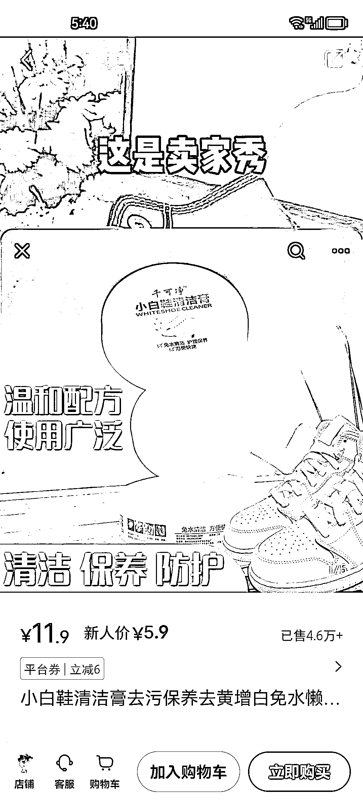

# 小红书上日入过万的那些爆款单品，到底要如何跟品测品呢！？

> 原文：[`www.yuque.com/for_lazy/thfiu8/ecf5h3sygo55es5q`](https://www.yuque.com/for_lazy/thfiu8/ecf5h3sygo55es5q)

## (146 赞)小红书上日入过万的那些爆款单品，到底要如何跟品测品呢！？

作者： 书豪

日期：2023-08-25

##### 大家好，我是在杭州的龙珠圈友书豪，连续四年年入百万。目前小红书有 30 个店铺，也是本次生财小红书店铺的航海教练。

##### **今天给大家分享一下我们是如何测品跟品的。其实每个人开小红书店铺离第一个单品 1 万元收入，都是很接近的。**

##### **为什么你的单品不出单，或者是出单数少于 1000 单呢！？为什么同样都是打一个品，有人能几十单，有人单日 1000 单+呢？！**

##### **太阳底下没有新鲜事，根本就没有所谓的流量密码，也没有什么独门秘籍。方法和细节都在对手的爆款笔记里。**

##### **这篇文章也许能对你有帮助！上车，咱们出发！各位 enjoy！**

## 总原则：测品期间，测多个封面+标题

就拿小白鞋清洁膏这个品来说，能打爆这个品的标题+封面有好几个。

## 一、拆解账号：小红书号 796626839

1、比如小红书号 796626839 这个叫解忧丑精灵的账号来说，你看她的爆款标题：！！太太太太太太太牛🐂了！擦不干净算我输！？

2、你看它的爆款笔记的封面还会有一个【干洗店不会告诉你的秘密】封面标题。

3、视频脚本是什么！？

【看看啊看看啊，这是卖家秀，哇，我买咯。再好的洗涤剂，它也是洗不干净的。包括这种泡沫清洗剂，它也是刷不掉的。拿少许的去黑剂，轻轻一擦，都能擦掉。像那种漆皮鞋上的蹭痕。它是走路出现的蹭痕，还有这种老爹鞋，你正常洗它是洗不掉的。橡胶鞋边，都可以去除。家里的鞋边鞋后有黑印。都可以按照这个方法】

4、比如小红书号 796626839 这个叫解忧丑精灵的账号来说也是测试了多个标题+封面，最后爆一条笔记杀上 2945 单。兄弟们，你再去 1688 以图搜商品就知道进货价多少钱了！？算一算，人家的打品效率的利润。

5、定价 39.9 元买一赠一

## 二、拆解账号：小红书号 6865017546

1、比如小红书号 6865017546 这个叫招财财的账号来说，你看她的爆款标题有两个对吧：

爆款标题 A    这就是人类智慧的产物吗？

爆款标题 B 到底是谁发明的这玩意儿啊？

2、你看它的爆款笔记的封面  都是猎奇派

3、视频脚本是什么！？

【看看啊看看啊，这是卖家秀，哇，我买咯。再好的洗涤剂，它也是洗不干净的。包括这种泡沫清洗剂，它也是刷不掉的。拿少许的去黑剂，轻轻一擦，都能擦掉。像那种漆皮鞋上的蹭痕。它是走路出现的蹭痕，还有这种老爹鞋，你正常洗它是洗不掉的。橡胶鞋边，都可以去除。家里的鞋边鞋后有黑印。都可以按照这个方法】

4、测品策略也是多标题+多封面测试

5、定价 13.9，斩获 8081 单（多账号累计），但是这个小红书号是一个关联账号。

## 三、拆解账号：小红书号 5518867890

1、比如小红书号 5518867890 这个叫[元気优选](https://www.xiaohongshu.com/user/profile/649036f4000000001203417c)的账号来说，你看她的爆款标题：

为什么现在夏天都没人穿凉鞋了？上班的时候

是不是一个爆款标题测出来后一直在延用。

  2、你看它的爆款笔记的封面  都是猎奇派，然后一个爆款封面，在街上疯狂实拍收集素材。

3、视频脚本是什么！？

【看看啊看看啊，这是卖家秀，哇，我买咯。再好的洗涤剂，它也是洗不干净的。包括这种泡沫清洗剂，它也是刷不掉的。拿少许的去黑剂，轻轻一擦，都能擦掉。像那种漆皮鞋上的蹭痕。它是走路出现的蹭痕，还有这种老爹鞋，你正常洗它是洗不掉的。橡胶鞋边，都可以去除。家里的鞋边鞋后有黑印。都可以按照这个方法】

4、测品策略也是多标题+多封面测试

5、定价 11.9，斩获 46000+单

## **四、测品跟品策略以及踩坑点是什么？**

1.  定好了一个产品后，一定要测试至少 12 个笔记，每个笔记选择对手最爆的那个笔记脚本混剪四条。多找几个爆款笔记的封面+标题做组合测试。分为三组不同的标题+封面测试。

3.  小红书的长尾流量是很大的，不要只测试三五个笔记就放弃。

5.  也许你测试的第十个笔记就爆了一两千单。

8.  就拿小白鞋清洁膏这个品来说，小红书号 5518867890 和小红书号 6865017546 和小红书号 796626839 的爆款笔记封面和标题不一样，但是都爆了，但是都是同一套视频笔记在混剪。

10.  对于单品想突破 2000 单+的同学来说，在测品方面，就需要注意同商品多爆款笔记模板组合测试的策略了。

12.  价钱的加价其实是不用担心的，不要盲目创新脚本就好，对手的脚本模板，已经是经过市场认可的脚本，还是熟悉的佩方，爆款前三秒给痛点或者给猎奇，中间是转化画面，给使用前后对比的使用效果，最后引导购买。这一套玩法的配方百战百胜！

希望我们走过的经验能够帮助到圈友们，祝大家在搞钱的道路上，顺风顺水顺财神~咱们一起在小红书搞钱！

以上，一起生财有术！欢迎各位圈友前来交流，微信  wsh137552775

## **往期文章：**

**[如何矩阵化经营 30 个小红书店铺月利润过 20 万？](https://articles.zsxq.com/id_3qslvwfcmwn3.html)**

**[小红书店铺卖情娶内衣，直播+笔记打法月入 6000 保姆级教程](https://articles.zsxq.com/id_jj8hu5xhf5c4.html)**

**[新人如何做小红书店铺？卖聚拢内衣的店铺用低粉爆款法从 0 到 1 保姆级教程](https://articles.zsxq.com/id_8ugxoroquobl.html)**

**[小红书单店铺单月 6000+利润选品保姆级教程](https://articles.zsxq.com/id_xwveu3e0usfv.html)**

**[小红书无货源电商，单品 4w+利润，我做了什么？](https://articles.zsxq.com/id_8o3ptacdp6mj.html)**

**[带 04 年大二堂妹做小红书店铺，从 0 开始做小红书，月入 3000](https://articles.zsxq.com/id_ker60oc8oimj.html)**

**[2023 小红书幼教考编保姆级教程](https://articles.zsxq.com/id_cpdec6j4xtho.html)**

**[小红书爆款封面最新设计攻略！带你掌握流量密码](https://articles.zsxq.com/id_bbisxulzsup1.html)**

**[如何拆解一个小红书爆款视频](https://articles.zsxq.com/id_opo78sxacew9.html)**

**[小红书无货源电商做女装如何选品？](https://articles.zsxq.com/id_1wxixz3rofb3.html)**

**[小红书颜值测评变现保姆级教程](https://articles.zsxq.com/id_15njj2g5hxfr.html)**

**[小红书低粉爆款案例拆解教程](https://articles.zsxq.com/id_0nmnwdg6mb0l.html)**

**[小红书新人入局月入 100-1000 元保姆级教程](https://articles.zsxq.com/id_sbk8lqv5unca.html)**

**[人生的第一个 100 万，我是怎么赚到的？！](https://articles.zsxq.com/id_kek27cqo56wf.html)**

**[抖音单品短视频带货 1000 万 GMV，我是怎么做到的？！](https://articles.zsxq.com/id_qoak1w7ptnwf.html)**

**[抖音直播间月消耗过百万的千川投流经验分享](https://articles.zsxq.com/id_d3zembkeh2cw.html)**

**[组织生财有术福建厦门圈友聚会复盘！](https://articles.zsxq.com/id_7gqhllpk7tpk.html)**

**[百家号月入 5000~10000 元口播玩法介绍，保姆级教程来啦！](https://articles.zsxq.com/id_rrl0r4z5x8x0.html)**

* * *

评论区：

挽心 : 优秀
梅子 : 牛哇！
坏脾气的小可爱 : 太厉害啦
VV 姐 : 牛！
Rico : 优秀！
夏颖 : 威武！
刘小 6 : 牛！！🐮
Becky 单润盈 : 书豪哥超强输出力！

* * *