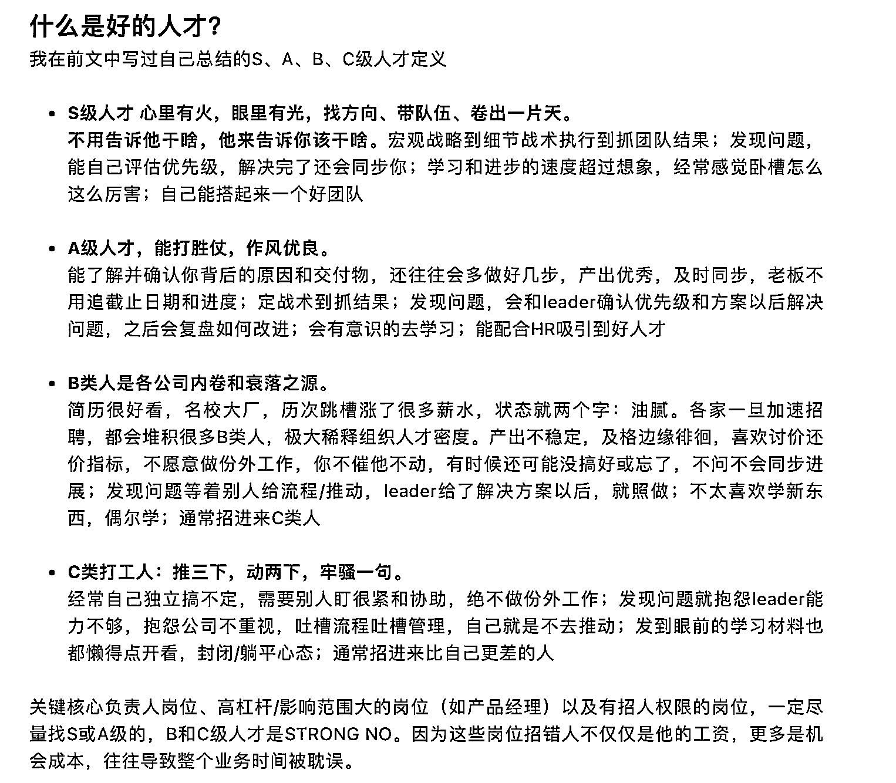

# 什么是好的人才？

> 原文：[`www.yuque.com/for_lazy/thfiu8/ct02hm0qp9xl2504`](https://www.yuque.com/for_lazy/thfiu8/ct02hm0qp9xl2504)

## (20 赞)什么是好的人才？

作者： 亦仁的收藏夹

日期：2023-08-23

什么是好的人才？

* * *

评论区：

帅彬 : 感觉有时候也会受到环境的影响 S-A-B 之间转换。特别是国企军工这些平台上。

* * *