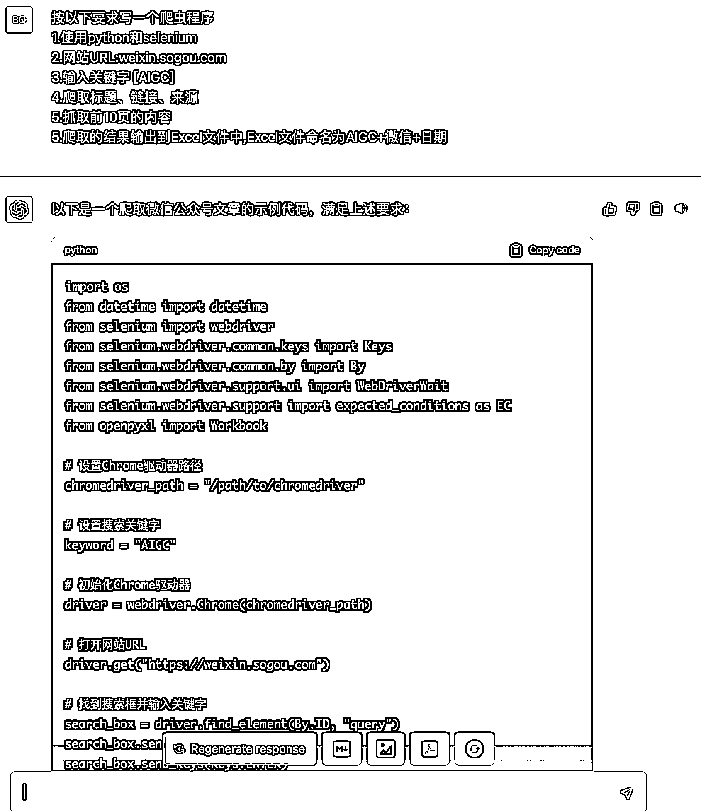
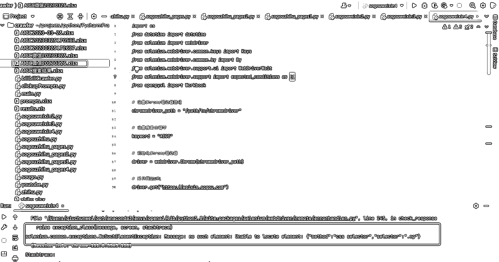
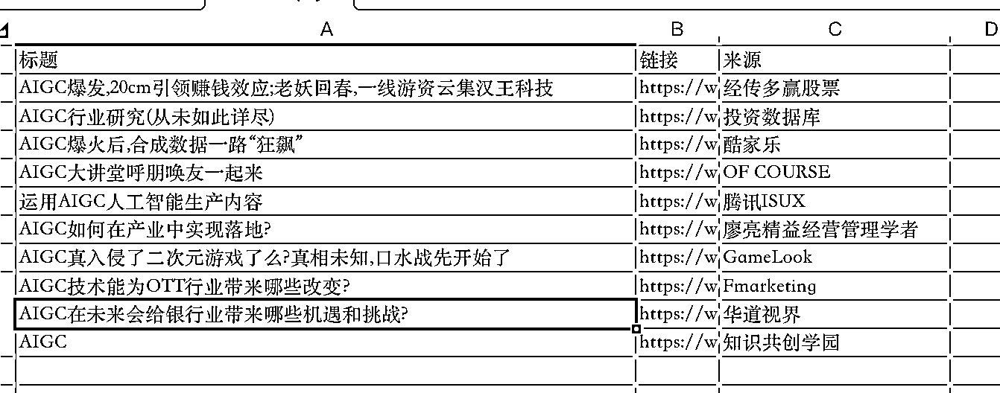
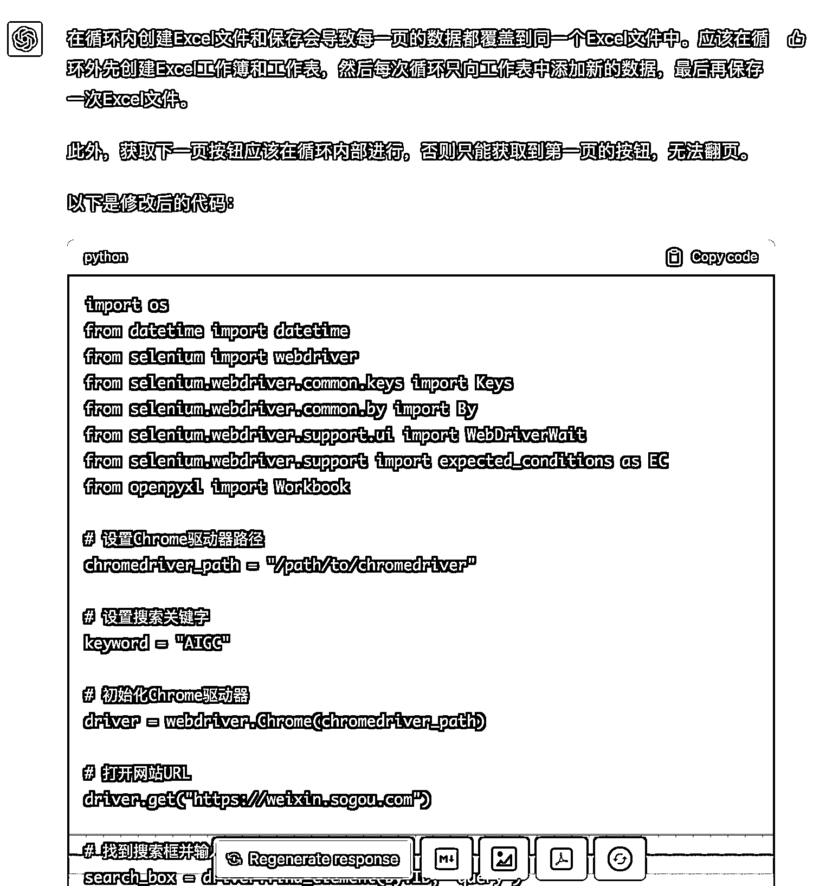
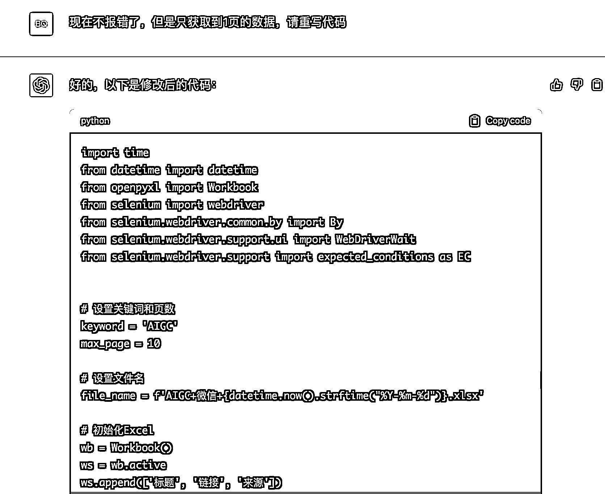

# 用 ChatGPT 写个爬虫爬取微信公众号文章

> 原文：[`www.yuque.com/for_lazy/thfiu8/aq0ms7vwic78hnq8`](https://www.yuque.com/for_lazy/thfiu8/aq0ms7vwic78hnq8)

## (精华帖)(250 赞)用 ChatGPT 写个爬虫爬取微信公众号文章

作者： 邱比特

日期：2023-08-28

在生财看到很多圈友用 ChatGPT 写代码，今天分享一个我以前用 ChatGPT 写的爬虫。

3 月底的时候，AIGC 比较火，天天在知乎和微信里面刷相关内容，切换 app 比较麻烦，就想到了用爬虫去爬一些比较火的文章去读，于是想到了搜狗(搜狗里面有知乎和微信的搜索)，在搜狗中搜索【AIGC】抓取每天发布的阅读量高的文章来看。

当时 ChatGPT 也是🔥的不行，于是就用 ChatGPT 写了个爬虫做这件事，下面是实操的步骤👇🏻

## 0: 如何向 ChatGPT 描述我的需求？

想法有了，接下来要去用 ChatGPT 写代码了。那如何向他描述我的需求呢。不妨先问一下它，我怎么描述它能理解清楚我的需求。

如上图，ChatGPT 的回答非常具体清晰，我们按它的建议提出我们的需求即可。

## 1：整理需求，交给 ChatGPT 生成代码

按 ChatGPT 给我的要点，我整理了一下我的需求

按以下要求写一个爬虫程序

1.使用 python 和 selenium

2.网站[URL:weixin.sogou.com](http://about:blank)

3.输入关键字 [AIGC]

4.爬取标题、链接、来源

5.抓取前 10 页的内容

6.爬取的结果输出到 Excel 文件中,Excel 文件命名为 AIGC+微信+日期

如图：

ChatGPT 生成第一版代码

import os

from datetime import datetime

from selenium import webdriver

from [selenium.webdriver.common.keys](http://selenium.webdriver.common.keys) import Keys

from [selenium.webdriver.common.by](http://selenium.webdriver.common.by) import By

from [selenium.webdriver.support.ui](http://selenium.webdriver.support.ui) import WebDriverWait

from selenium.webdriver.support import expected_conditions as EC

from openpyxl import Workbook

# 设置 Chrome 驱动器路径

chromedriver_path = "/path/to/chromedriver"

# 设置搜索关键字

keyword = "AIGC"

# 初始化 Chrome 驱动器

driver = webdriver.Chrome(chromedriver_path)

# 打开网站 URL

[driver.get](http://driver.get)("[`weixin.sogou.com`](https://weixin.sogou.com)")

# 找到搜索框并输入关键字

search_box = driver.find_element(By.ID, "query")

search_box.send_keys(keyword)

search_box.send_keys(Keys.ENTER)

# 循环爬取前 10 页的内容

for page in range(1, 11):

# 等待页面加载完成

WebDriverWait(driver, 10).until(EC.presence_of_element_located((By.CLASS_NAME, "news-list")))

# 获取当前页面的所有文章元素

articles = driver.find_elements(By.CLASS_NAME, "news-list").pop().find_elements(By.TAG_NAME, "li")

# 创建 Excel 工作簿

wb = Workbook()

# 创建工作表

   ws = [wb.active](http://wb.active)

# 设置工作表表头

[ws.append](http://ws.append)(["标题", "链接", "来源"])

# 循环处理每篇文章

for article in articles:

# 获取文章标题和链接

title = article.find_element(By.TAG_NAME, "h3").text

link = article.find_element(By.TAG_NAME, "a").get_attribute("href")

# 获取文章来源

try:

source = article.find_element(By.CLASS_NAME, "account").text

except:

source = ""

# 将文章信息写入 Excel 工作表中

[ws.append](http://ws.append)([title, link, source])

# 保存 Excel 文件

   date_str = [datetime.now](http://datetime.now)().strftime("%Y%m%d")

filename = f"AIGC 微信{date_str}.xlsx"

[wb.save](http://wb.save)(filename)

# 点击下一页按钮

next_btn = driver.find_element(By.CLASS_NAME, "np")

[next_btn.click](http://next_btn.click)()

# 关闭 Chrome 驱动器

[driver.quit](http://driver.quit)()

我们复制代码到 PyCharm，然后执行一下，看看结果是否符合预期。

从截图我们可以看到，程序执行失败了。但是生成了文件。我们再看一下文件生成的数据对不对？

生成的文件里面确实有内容，但是只有最后一页的数据！

## 2：跟 ChatGPT 互动，让它修改代码（改 bug）

我把上面代码执行的结果和异常信息告诉它，看它如何回复。

这个回复对小白来说显然不友好，我先不管它。直接让它修改自己的代码。我直接把刚才的代码贴给它（为什么这么做？），让它去修改 bug。

把它写的代码贴给它后，它很显然发现了自己的错误，然后它自己修改了代码。

修改后代码

import os

from datetime import datetime

from selenium import webdriver

from [selenium.webdriver.common.keys](http://selenium.webdriver.common.keys) import Keys

from [selenium.webdriver.common.by](http://selenium.webdriver.common.by) import By

from [selenium.webdriver.support.ui](http://selenium.webdriver.support.ui) import WebDriverWait

from selenium.webdriver.support import expected_conditions as EC

from openpyxl import Workbook

# 设置 Chrome 驱动器路径

chromedriver_path = "/path/to/chromedriver"

# 设置搜索关键字

keyword = "AIGC"

# 初始化 Chrome 驱动器

driver = webdriver.Chrome(chromedriver_path)

# 打开网站 URL

[driver.get](http://driver.get)("[`weixin.sogou.com`](https://weixin.sogou.com)")

# 找到搜索框并输入关键字

search_box = driver.find_element(By.ID, "query")

search_box.send_keys(keyword)

search_box.send_keys(Keys.ENTER)

# 等待页面加载完成

WebDriverWait(driver, 10).until(EC.presence_of_element_located((By.CLASS_NAME, "news-list")))

# 获取 Excel 文件名

date_str = [datetime.now](http://datetime.now)().strftime("%Y%m%d")

filename = f"AIGC 微信{date_str}.xlsx"

# 创建 Excel 工作簿

wb = Workbook()

# 创建工作表

ws = [wb.active](http://wb.active)

# 设置工作表表头

[ws.append](http://ws.append)(["标题", "链接", "来源"])

# 循环爬取前 10 页的内容

for page in range(1, 11):

# 获取当前页面的所有文章元素

articles = driver.find_elements(By.CLASS_NAME, "news-list").pop().find_elements(By.TAG_NAME, "li")

# 循环处理每篇文章

for article in articles:

# 获取文章标题和链接

title = article.find_element(By.TAG_NAME, "h3").text

link = article.find_element(By.TAG_NAME, "a").get_attribute("href")

# 获取文章来源

try:

source = article.find_element(By.CLASS_NAME, "account").text

except:

source = ""

# 将文章信息写入 Excel 工作表中

[ws.append](http://ws.append)([title, link, source])

# 保存 Excel 文件

if page == 10:

[wb.save](http://wb.save)(filename)

# 点击下一页按钮

try:

next_btn = driver.find_element(By.CLASS_NAME, "np")

[next_btn.click](http://next_btn.click)()

except:

break

# 关闭 Chrome 驱动器

[driver.quit](http://driver.quit)()

这次我们执行代码后获取到了满意的效果，在搜狗输入【AIGC】后把前 10 页的微信公众号文章到抓取到了。

篇幅有限只截取一部分。

## 3：总结

1.  整体效果还算满意，基本不用费太大劲就能实现我的需求。

2.  提示词很重要，除了网上收集的模板，大家也可以用我的思路。

      先去问 ChatGPT 怎么向他提问它才能理解你的需求。然后按它的调调给它提示词。

1.  比较触动的是 ChatGPT 能发现自己的 bug 并自主修改。

2.  目前看对一点编程经验的小白来说还不能那么容易的自己用 ChatGPT 写代码，需要一些编程的通识。

## 4：最后

回答一下我为什么把之前写的代码直接贴给它去修改？

有人或许说他不是能记住上下文吗。

看下图，当我让它重写时它又换了一个写法去写代码。

对写代码这种需求来说，我们上一版的代码都调一半了，它在换个思路显然是不合适。

所以我把之前的代码贴给它，让它去修改，否则用重写的方案又得再调一遍比较浪费时间。

关于【爬取微信公众号文章和知乎】的代码感兴趣同学可以找我要，我私下发。

这个代码其实是通用的代码，咱们把【AIGC】换成你感兴趣的关键字就可以自己采集信息了。

* * *

评论区：

我爱这世界 : 赞
良辰美 : 搜狗微信的好像不是特别全，而且没办法看到阅读量和评论，也不能按照最新和热度排序，所以我就自己弄了个 RPA 机器人，在微信端搜索爬取记录，当然腾讯是反爬虫的，所以内容还是要到 WEB 端去抓，当然文章链接已经有了，剩下都不是事了
良辰美 : 找不到你联系方式哦，要不你针对这个代码的使用写个操作手册吧，然后咱们就可以呼唤了，我有微信版本的自动化抓取爆文和最新文章手册——公众号自动化批量上传文档 SOP 之一，咱们说不定可以互换哈哈，我就不花时间测试了
亦仁 : 感谢分享，已加精华。
我来 : 优秀，
邱比特 : bit2coding，我的微信，分享代码给你
邱比特 : 谢谢亦仁老板，[抱拳]
邱比特 : 晚上下班丰富一下，谢谢😊

* * *