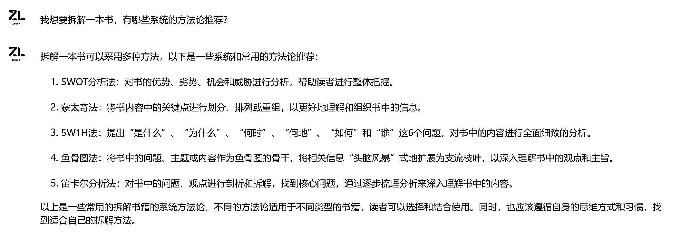

# 商业拆书稿或者读书笔记很难写？送你一个 prompt，五分钟成稿

> 原文：[`www.yuque.com/for_lazy/thfiu8/ah7feizbtwkhvpxv`](https://www.yuque.com/for_lazy/thfiu8/ah7feizbtwkhvpxv)

## (88 赞)商业拆书稿或者读书笔记很难写？送你一个 prompt，五分钟成稿

作者： 枫晓陌

日期：2023-08-29

生财的朋友们大家好，我是枫晓陌，微软认证的 AI 工程师。未来一年、我要用 AI 切入一百个工作场景，让大家感受到 AI 给我们带来的便利。

大家想要用 AI 切入什么领域都可以告诉我呀，AI+写作、阅读、小红书、健身教练、AI+朋友圈营销、AI+简历、AI+热点分析……都可。

写下你的需求，我给你一个 prompt，下一个 prompt，我想切入小红书。

上一篇精华帖： [`t.zsxq.com/11cSTRIYG`](https://t.zsxq.com/11cSTRIYG)

前几天参加了一个 AI 拆书快闪群，听老师说，现在拆书稿还有市场，但没有以前那么火，知识付费刚起来的时候，一篇拆书稿可达万元，有兴趣的朋友可以单独去了解一下。

那现在读书笔记怎么变现？

提供几个方向！我相信聪明的你，从这些方向会联想到更多方向，大家都是高手，那就继续往下看吧。

但很多人写读书笔记写的很烂或者花费时间很多，那怎么办？

我把常用的拆书方法论，5W1H 法、蒙太奇法、笛卡尔分析法、洋葱阅读法等等融入到 prompt 中，让小白，也能在这个领域快速达成 60 分的高手，发挥超常拿个 80 分也不是难事。

剩下的分数就看个人修炼了，ai 再强，也只是辅助。有一种东西叫做审美感，ai 目前还无法和你精准共鸣，产生出让你 100%满意的作品。

设计思路：其实我并不懂什么拆书方法论，怎么办？问 AI 或者直接网上检索。

问了几个 AI，每一个给出的答案都不太一样，从里面选择自己喜欢的。

**如果你有属于自己的方法论或者知道更好的方法论，那就更好了，直接把方法论凝结成 prompt。**

于是设计以下操作流程。

## Workflow

1\. 用户提供书籍信息。

2\. 如果我数据库中有该书，则继续对话；否则，结束对话。

3\. 推荐三种适合的拆书方法，并解释原因。

4\. 用户选择拆书方法后输出拆书稿大纲。

5\. 根据用户指定部分进行输出。

6\. 用户确认拆书内容。

7\. 用户反馈后，根据反馈调整内容。

文章很长，拿好板凳。

prompt 如下：

文章代码块和图片较多，欢迎大家移步飞书观看：

[`w194sny3eli.feishu.cn/wiki/I43owUUxViqZ8nkSgH2cKYprnpO?from=from_copylink`](https://w194sny3eli.feishu.cn/wiki/I43owUUxViqZ8nkSgH2cKYprnpO?from=from_copylink)

* * *

评论区：

平凡小吴 : 圈友能分享一篇 ai+简历的 prompt 吗，提起感谢，自己尝试过，但效果一直都不是很好[捂脸]
枫晓陌 : 可以，但是要很久。还有好几个 prompt 要写，先完成航海的以及亦仁大大的。
平凡小吴 : 可以的，航海和老大的更重要，能排上期已经很惊喜了[抱拳]
深圳大冲 : 牛啊
年轻的老灵魂 : 希望您写 AI+网文/爽文。虽然逻辑都差不多，但你写的比较香。

* * *