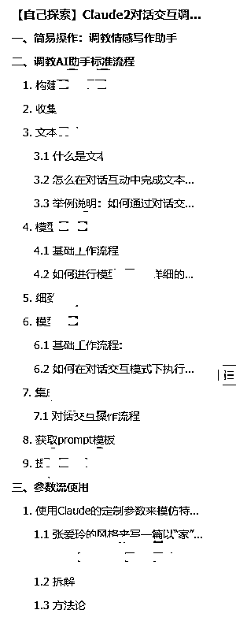

# 简洁精准的参数流提问技巧，不懂技术的普通人玩转 Claude

> 原文：[`www.yuque.com/for_lazy/thfiu8/oq6u942twmae2mld`](https://www.yuque.com/for_lazy/thfiu8/oq6u942twmae2mld)

## (63 赞)简洁精准的参数流提问技巧，不懂技术的普通人玩转 Claude

作者： 李拜日

日期：2023-08-29

# 写在前面

大家好，我是李拜日，作为小透明默默蹲在生财三年了，现在的身份是一只高龄待业的产品汪。第一次发帖，文笔不好请包涵。

写这篇文章之前纠结了很久，我一直很担心，自己知道的这一丁点东西，写出来能不能帮助到别人。有没有一种可能写出来的东西其实就是别人的常识。

挣扎之后，断断续续磨蹭近一周，还是写出来了。

整件事的起因是前几天看了袁六伟大佬分享的指令工程师相关的帖子。瞬间调动了我的情绪，然后就去网上检索相关的信息，发现需要懂得东西还挺多的，什么机器学习等等一大堆的知识。

作为一只没有写代码能力的产品汪，这些年工作积累的那些浅显的技术知识，并不足以支撑我去直接上手这个指令工程师的角色。

所以当时老婆站在我身边问我“难吗？”

我说“难”！

但是周末静下心来通过浏览生财的精华帖，慢慢的梳理，也发现了有了一些眉目。

把思路整理出来之后，记录在知识库中，渐渐也演变成了一份通过对话交互去调教 Claude 的教程雏形。

整个教程还需要去反复测试。但对于今天分享的参数流使用技巧，是我这两天验证之后可行的技巧。也是这套教程雏形里面的内容之一。

同时，也大概率是未来支撑整套教程的底层技巧之一。

[手指敲麻，万字分享，简洁精准的参数流提问技巧——不懂技术的普通人玩转 Claude](https://jx8v8j88mr6.feishu.cn/docx/Ed2cdt1i0oJAVlxPyR0cDLRIn7e?from=from_copylink)

* * *

评论区：

莲深 : 有意思
未见青山 : 有点意思
青空明月 : 感谢分享，很有帮助
倪大胖 : 感谢分享。看成高龄待产，原谅我。
李拜日 : 你吓得我赶紧回去喽一眼
亦仁 : 主题挺好，不过看的有点吃力，这些英语参数的来源是哪里来的？
李拜日 : 参数是 Claude 内置+自定义的。Claude 支持自定义。也就是说，我想表达什么，就用“/+这个单词“就可以了。
比如我想要给故事设置一个地点，那就是地点的单词“/location 天安门”。
因为很多技术人员在工作中，写的东西也是有道云词典查询粘贴的。 自定义参数就可以了。
李拜日 : 最开始我尝试问 Claude 有多少参数，他给我了很多很多，然后我就问，这种参数怎么来的，得到的答案是可以自定义。
测试下来，自己编的单词确实可以，比如基于某部分创作“/based_on_part”这就是自由组合出来的。

* * *