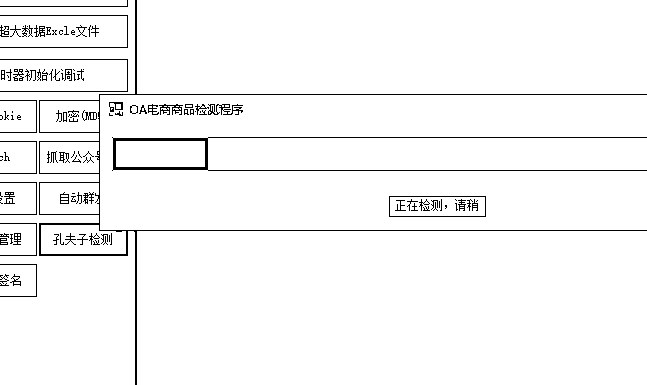
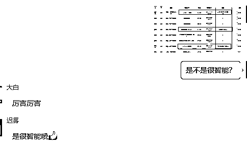
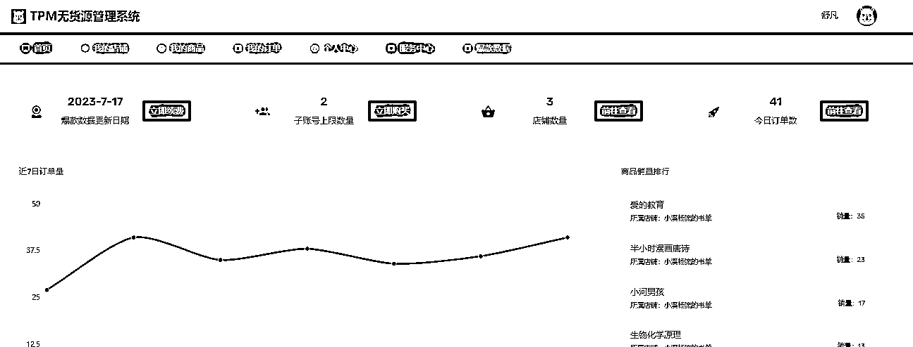

# 从跟着小航海实践，到 1 个月 GMV 破万，分享我的闲鱼二手书项目小白成长历程

> 原文：[`www.yuque.com/for_lazy/thfiu8/deg9ck6ud7x0lw4t`](https://www.yuque.com/for_lazy/thfiu8/deg9ck6ud7x0lw4t)

## (71 赞)从跟着小航海实践，到 1 个月 GMV 破万，分享我的闲鱼二手书项目小白成长历程

作者： 舒凡

日期：2023-08-29

大家好，我是舒凡，这是我第一次在星球上发布内容，写的不通顺的地方望大家海涵。

这篇文章早就写了，直到今天才发出来是因为这个小工具是业余时间开发的，总想着让他至少像那么回事，所以就一直在改。虽然今天发出来了，但是可能也还有些小问题，以后会随时更新的。

前年加入的生财大家庭，参加了几次小航海，包括小红书、社群运营、闲鱼二手教材等，结实了不少牛人大咖，开拓了眼界。

今年五月份的时候参加的闲鱼二手书项目，由于工作比较忙，时间有限，所以当初还是抱着学习的心态参加的小航海。然后从 6 月 9 日第一次出单到现在已经有 300+的单量，GMV 已经超过 1 万元，利润率也比较可观，期间还有卖出过一个小爆款，《爱的教育》同一天卖出了十几本。虽然利润只有几千块钱，但是这次的正向反馈还是让我成就感满满。分享给大家我是如何操作的，希望对其他朋友也有些帮助和启发。

先说一下闲鱼二手书项目的问题吧，可能也是所有无货源项目都存在的问题。

1、成交效率依赖沟通效率

因为闲鱼二手书项目也是无货源的，所以，当有买家咨询的时候我们需要花费较多的时间咨询孔夫子平台上的卖家，而孔夫子上的卖家也有不在线的时候，于是就会出现，我们的买家在等我们的回复，我们在等孔夫子卖家的回复。而结果往往是我们的买家没有那么多的耐心等我们的回复，选择从其他商家下单了。到手的买卖就飞走了。

2、商品的价格有误差

无货源的二手书是在孔夫子上拿的，我们在闲鱼商品的时候价格是 A，然而过了几天有买家下单时我们发现孔夫子上的价格变成 B，如果仍有利润还好，没有利润我们就要做赔本的买卖。赔本的买卖不能做，这是做任何生意最基本的要求吧。于是，到手的买卖又飞走了。

因为价格的误差还会出现一种情况，就是买家在晚上下单了，第二天早上醒来看到订单之后本来很开心，心想又可以赚几块钱了，但是在孔夫子上一查才发现是赔本的买卖，于是跟买家沟通退款。增加了店铺的退货率，到手的买卖又飞走了。

3、商品同质化严重

都是一个老师教出来的徒弟，方法大差不差，于是上架到闲鱼上的书也差不多，现在我感觉都不用和闲鱼的卖家沟通，光看他商家的书目就能判断对方是不是生财的圈友。：）任何行业的同质化最终的结果一定是利润的下降，于是，到手的买卖又飞走了。

4、我的其他经验

这一点其实我没有太多的发言权，因为做这个闲鱼二手书项目满打满算才一个多月的时间，但是还是想分享出来，目的是有不对的地方，希望高手能够指点迷津。

首先一个经验是不是宝贝越多鱼小铺的曝光量就越高。其实每天有上新即可，让平台知道，我们还在用心经营这个店铺。影响曝光量的因素很多，综合来说就是店铺权重或宝贝权重。提升权重又有几个综合指标，比如动销率、曝光支付率、退款率（这些我也是网上学来的，现学现卖一下）。所以，不用费劲使劲上新。目前为止，我三个店铺在售的商品总量好像才 800 多个（可以上到 1500，甚至更多）

第二，降价。降价对于曝光量的提升也不是那么明显，那天我手动把其中一个店铺的宝贝全部降价一遍，第二天的曝光量也没有提升的太多。我觉得还是和前一天差不多。

第三，闲鱼二手书的好卖的客单价再 20 块钱左右，这一个月中，经常是早上到了办公室，打开闲管家，就看到几个已经付款的订单，而客单价都在这个区间。客单价太低的没有利润空间，忙活半天赚不了钱。

针对以上几个问题，我是这么做的

1、针对沟通和目标商品价格的问题，我们应该离货源更近一些

我们把孔夫子的书上架到自己的闲鱼店铺时，人家老板是不知道的，只有当我们来了订单的时候才会跟老板沟通一下，假装成买家从人家那里下单。我的方式是稍微多花一点时间在孔夫子店铺的考察上，他的书目是和我们所需要的书目较为匹配，而且都是实拍，跟老板聊了一会儿之后不是孔夫子上的二道贩子（孔夫子上也有不少的无货源操盘手），那么就说明来意，当我们有订单时，简单说两句就 OK，甚至直接打电话，发微信让对方老板发货，大大减少了沟通成本。

2、针对同质化的问题，任何生意都需要用心去发现

可能这个标题有点扯哈，讲讲我的两件事吧。有天晚上带着家人去逛夜市，夜市很大，卖啥的都有，其中就有几个卖书的老板练摊儿，我加了他们的微信，和他们交流一下，向人家学习一下，最好还能成为我的“供货商”，后来还真成了“供货商”，发过几本小说，现在也一直在保持沟通和联系。

另外一件事就是，我儿子今年幼儿园毕业，我去参加毕业家长指导时，老师给推荐了两本书：《爱的教育》和《正面管教》，在教室里我就把这两本书发给了同事，让同事上架。于是后面就有了那次小爆款。

我想可能每个教育局都会给幼儿园、小学发一些指导大纲，可能会有些相同的内容，比如推荐相同的书这种事。

类似的事情我相信每个人身边都在发生着，用心，就会发现机会。

3、降低工作量、提高工作效率

重点来了

在生财的圈友中，牛人大咖云集，当我们还在学习的时候，就有人开发了一款批量发布商品的软件，还有孔夫子去水印的插件等等，我也是程序员出身。从我发现第一个问题时也开始做一个目标商品管理的软件，就是一键检测目标商品信息，包括是否有价格变动、是否下架了等信息，保证我的在售的商品和目标商品信息是同步的。后来又研究了下闲鱼开放平台，我们把他整理成了一个软件：TPM（Target Product Management）

这是最开始的雏形，受到了同事的表扬，后来也发到航海的小组群里，有 30 多个朋友加我微信，想用这个工具，于是我们对他做了升级。

除了检测目标商品之外，我们还增加了爆款数据、支持 1688 货源检测，商品销量统计，闲鱼订单实时推送等功能，看上去更像一个软件了。

所以这个工具不仅仅适用于二手书项目，其他的无货源项目同样适用。未来我们除了做闲鱼店铺的放大工作之外，TPM 也会不断升级。会有更多的功能，更多的数据提供给大家。比如：对接闲管家批量降价，发货等等，用这个软件啥事都干了。

这个爆款数据我重点炫耀一下吧，技术含量挺高，哈哈

通过逆向的数据抓取，数据源包括：孔夫子、豆瓣书评及其他，把当前较为火爆的图书数据做了汇总和分析，得出的爆款数据结果，对我们做这个二手书项目有不错的指导作用。

最后，我想说无论是主业还是副业，目的都是为了那碎银几两，而赚钱这件事，9 年的创业经验告诉我，要有持久力也要有爆发力。当有机会的时候，有爆发力能够快速的赚钱，当趋于常态的时候，又要有持久力能够坚持下去。

最后的最后，希望大家在生财都能够找到适合自己的生财之术。

* * *

评论区：

温特森ᴗ : 软件怎么获得[色]围观闲鱼二手书没上船，交流少
舒凡 : 忘了公布地址了！
[`tpm.xiaoxichangliu.net`](http://tpm.xiaoxichangliu.net)
CloudMan : 真棒
二十四夜满庭芳 : 赞
小双＆楚娟 : [强][强]学习了，谢谢分享
竹芯 : 感谢大佬，想问一下这个软件里店铺链接填写闲管家的链接就可以了吗？
舒凡 : 加我微信，我拉你进群
竹芯 : 加您了

* * *