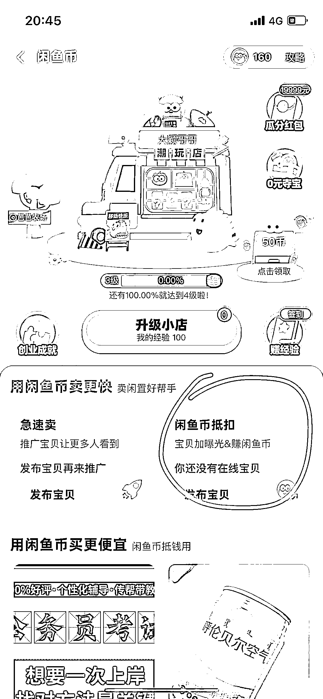

# 经过闲鱼二手书生财航海-续航-再续航利润 4w+

> 原文：[`www.yuque.com/for_lazy/thfiu8/aoh6o2ou7cleaaht`](https://www.yuque.com/for_lazy/thfiu8/aoh6o2ou7cleaaht)

## (77 赞)经过闲鱼二手书生财航海-续航-再续航利润 4w+

作者： 大颖哥哥

日期：2023-08-29

**大家好，新一期闲鱼二手书航海即将起航，今天的闲鱼二手书项目经验分享是精心准备和总结的，现在分享给大家。**

**闲鱼二手书项目从航海开始到现在，我每天都在认真运营，经历了航海、续航、再续航，每次结束都有认真复盘总结，截至目前已经通过闲鱼二手书生财航海-续航-再续航利润 4w+，打算继续增加账号扩大做。**

**今天的分享分为四个部分，毫无保留的分享给大家，亲身经验总结的，干货满满，本次分享适合在做二手书的所有人哈**

先自我介绍一下，我是大颖哥哥，坐标山东省济南市，主业是区农业农村委员会办公室普通科员、副业是一家电商个体户老板，在做淘宝闲鱼拼多多店铺(目前已经成型运营的项目有快递物流优惠代下单；承接全国跨市搬家客户、可整车可拼车价格实惠；大宗货物拼车下单；6 个闲鱼二手书项目计划继续增加)

## 第一部分：闲鱼二手书运营经验分享

1、二手书库存很关键，不及时增加库存会导致物品下架，然后权重流量会受到影响，大家每天及时查看库存，库存少一定及时库存，避免销售下架：具体步骤是登录闲管家账号，点击商品，再点击所有商品，再点击库存右侧的箭头，库存从低往高进行排序即可。如果是库存 0 的及时增加库存，如果是库存很少的，也及时增加库存。现在陆续开学季了，现在书销售比较多，每天检查一次，如果库存少及时增加。

2、大家在平时优化商品的时候，在操作下架商品的时候，要看上架时间为已经一个月多的没有销量的才可下架，刚上架的商品不要操作下架。

3、闲鱼二手书收货地址是新疆、西藏、内蒙古，青海等偏远地区收货地址都要额外收取运费哈，因为孔夫子一般这几个地区不包邮。

4、售出的订单在操作买书的时候，同时留意下每本书确保 25%以上利润哦，举例比如 10 元售价，利润要有 2.5 元以上，比如 15 元售价，利润要有 15×0.25=3.75 元以上，如果达不到这个利润，就直接用闲助手，进行提价操作。

5、及时观察是否有新增差评，及时在差评页面回复我们如何解决的方案，就是为了给以后刷到差评的客户看！有差评正常，但是我们得在差评页面回复是怎么为客户解决的，这样不会影响新客户下单。

6、记得每天开启闲鱼币推广有销量的商品，闲鱼币必须用推广花掉，留着一点用也没有！还能提高账号活跃度。每天早上每个账号记得购买一个 2 元的超级擦亮：（步骤：点击我的-超级擦亮-抢超级擦亮即可。目前可推宝贝数量是这样的：例如一个人名下 3 个闲鱼的账号，大号 2 元是可以推 30 个产品的，另外的两个新店 2 元可以推 3 个宝贝、经营一段时间后 2 元可以推 10 个产品。也就是 3 个店铺一天 6 元钱可以推 36 到 50 个产品，当然也会遇到你前一天数据比较好的情况下，第二天会额外多送推广机会，也就是可以花好几个 2 元）这样可以增加活跃度和曝光。

7、商品选择主图一定要按照下面要求选择：实拍图，没有乱七八糟的水印；俯视图比斜视图让人看着更舒服；如果有手拿着书的图片，尽量选手拿着；近距离拍摄和远距离拍摄，选近距离的；光线亮和光线暗，选光线亮的。

8、所有物品均要开启 5%闲鱼币抵扣，能带来额外流量，开启入口在这里。

9、我一直存着的官方曾经发布的闲鱼图书卖家易犯违规类型及解决办法：一是内容违禁，主要是上传的图书内容比较敏感，涉及禁书/作者被封杀等，闲鱼 C2C 平台用户轻发布，所以在算法侧对内容排查会更谨慎力度更大，请各位卖家注意再注意。特别容易触犯的名单：政治相关、国家领导人相关、乔治奥威尔、废都、索罗斯、查理九世、赵薇等。解决办法：此类图书请勿发布。二是全新低价盗版/影印版/2023 年包括未来的 2024 最新版教材教辅最好不要上架。

## 第二部分：闲鱼二手书售后解决办法

1、遇到盗版书，我们立马给客户安排快递上门退，我们包邮，孔夫子也申请盗版原因进行退款，孔夫子一般也都有 8 元额外盗版补贴。

2、如果遇到客户各种原因强烈想退款，但是书不是盗版，先和客户沟通补偿下试试 3 元或者 5 元，一般客户会同意的。如果实在不愿意，而且想投诉我们，分两种情况：一是书售价为 6-10 元的，我们可以直接考虑给客户通过退款。二是金额超过 10 元的，我们可以安排快递员上门取件，我们优惠代下成本也就 5-7 元。但是告知客户请勿私自去操作邮寄，私自邮寄我们店铺不承担任何运费！(一定告知客户)

3、总之尽量顺着客户的要求，售后要做完美！为了店铺，损失一点没什么的，赚个好评，尽量避免差评。损失一点钱没事的，闲鱼二手书是长期可操作的项目，所以大家一定精细化尽量完美售后。

## 第三部分：二手书成立项目组的人员分工构成

因为目前我是根据成立项目组，员工在操作干，给大家分享下经验。

人员配置与上班时间：

2 位

白班 8-16 点 1 位

晚班 16-23 点 1 位

工资：

每人底薪 1600+提成（提成是 6 个闲鱼二手书业绩×3%）有提成可以增加员工积极性

具体 2 位人员工作分工如下：

白班：

1、每天群内汇报 6 个账号今日优化书数量以及售后待处理数量

2、主要负责闲鱼 6 个账号的售后处理工作和上班时间的消息及时回复工作。

3、6 个账号负责优化书，每个账号优化 10 本，有时间就多优化(只有优化书，陆续把一个月之外没有销量的书及时替换掉，才能增加起来业绩)

4、在闲管家的时候，及时检查闲管家在售商品的库存数量，库存少的及时增加库存。

5、及时购买待发货的书籍。

6、早上操作一键擦亮、购买 2 元超级擦亮。

夜班：

1、闲鱼消息回复：晚班负责回复闲鱼消息

2、处理闲鱼售后：负责监督并且协助处理售后等工作。

3、晚上操作花费闲鱼币推广商品、及时开启 5%闲鱼币抵扣。

4、6 个账号负责优化书，每个账号优化 10 本

为了监督员工，我要求员工每天在群内汇报每个账号上书数量及待处理售后数量

员工汇报格式：

2023 年 _ 月 _ 日

**图书馆  今日优化 ___ 本 闲管家待处理售后 ___ 个。

**图书馆  今日优化 ___ 本 闲管家待处理售后 ___ 个。

**图书馆  今日优化 ___ 本 闲管家待处理售后 ___ 个。

## 第四部分：对于出版物许可证办证问题分享

想做二手书项目以及正在做的大家目前肯定已经每人最少 3 个账号了，肯定也有伙伴考虑继续增加账号办证，分享下我 0 成本一周在当地办 2 张办证的经验，具体每个当地监管和流程不一样，各地政策不一，适合大部分地区，不一定适用于所有地方，但是大部分地方都是好办的。

办证指导：

1、办公地点，可以和开公司的朋友借用了办公地点或者与房产中介批量合作地点。

2、办公地点有消防栓、安一个逃生应急灯与烟感器以及禁止吸烟标志

3、打电话咨询当地区县的行政审批服务局，咨询办理出版物经营许可证的窗口，告知我要办理，请告知我们需要准备的材料和要求。

准备完成资料后，直接到当地区县的行政审批服务局提交材料进行办理，预计一周可以下证。

**好啦，以上是我准备的分享，闲鱼二手书项目是长期可做的项目，本次航海的伙伴一定好好抓住生财提供航海实战的机会，有不懂得一定随时请教教练，预祝参与闲鱼二手书航海伙伴天天爆单！！数钱到抽筋！！**

* * *

评论区：

二十四夜满庭芳 : 很棒
黑妞 : 受益匪浅，谢谢
大颖哥哥 : [玫瑰][握手]
大颖哥哥 : 有收获就好哦，谢谢[握手][握手]
王淇 : 谢谢分享，请问两个员工是兼职远程在家还是在工作室上班呢？
大颖哥哥 : 两位员工白班夜班是在工作室坐班，如果扩大账号可以招聘一位兼职大学生，只做上书工作，每天让大学生抽 1 小时左右时间，优化 50 本书，给 30 元
王淇 : 明白，谢谢
大颖哥哥 : ok 没事。

* * *