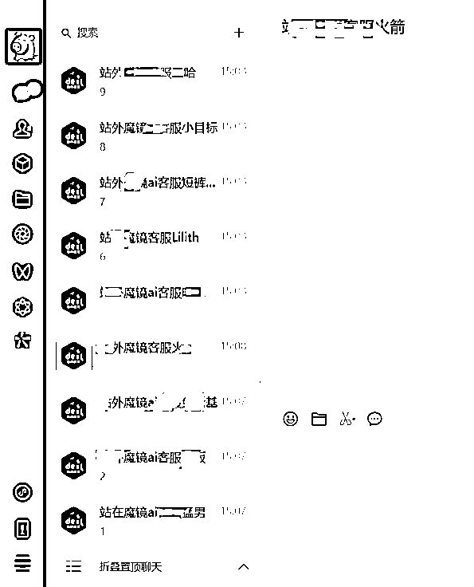
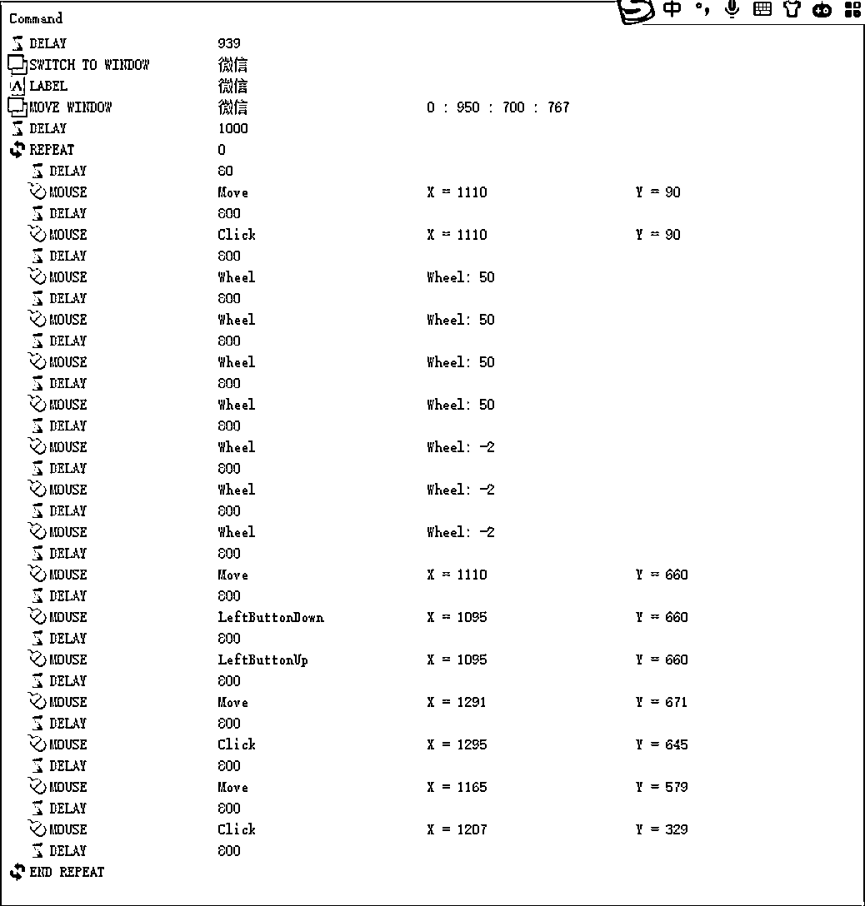
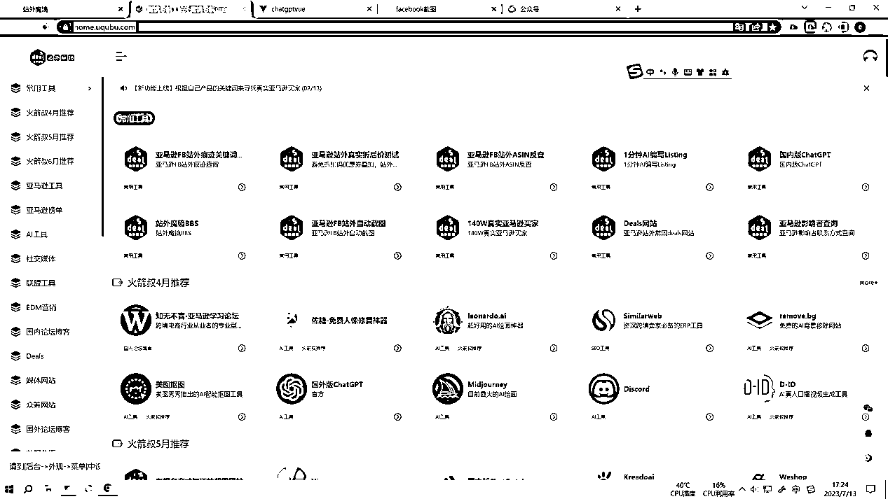
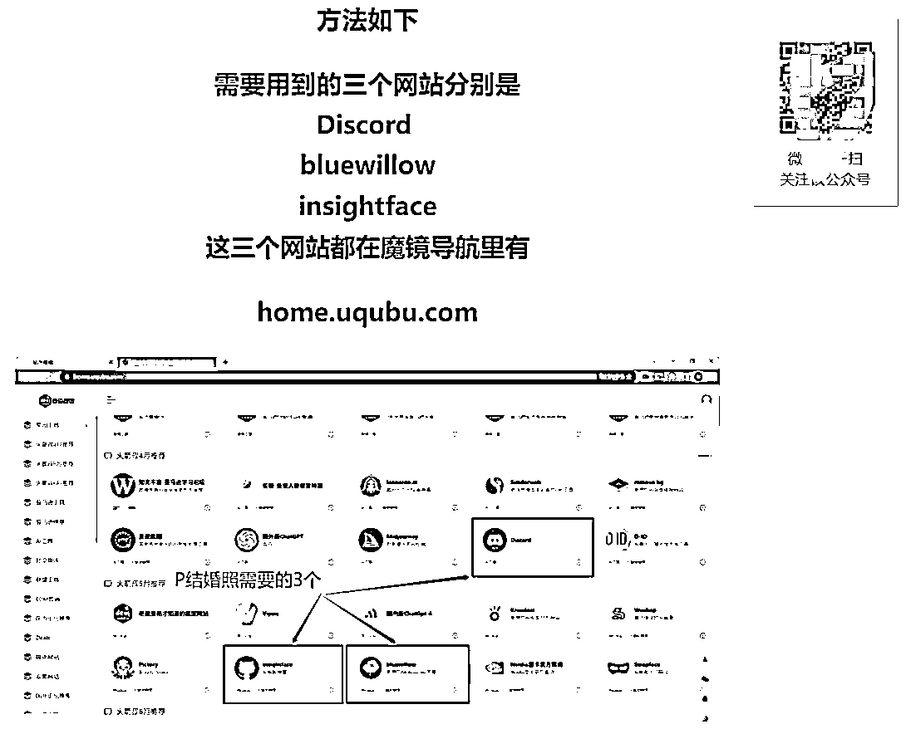
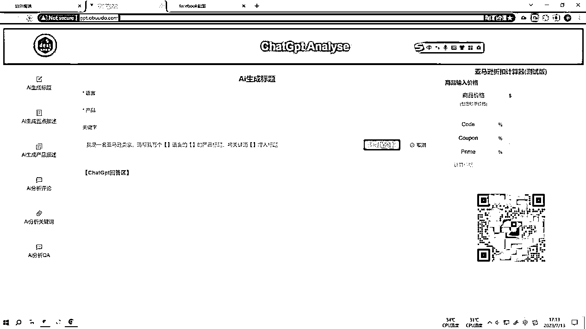
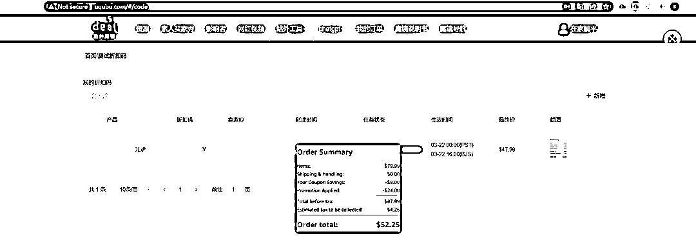
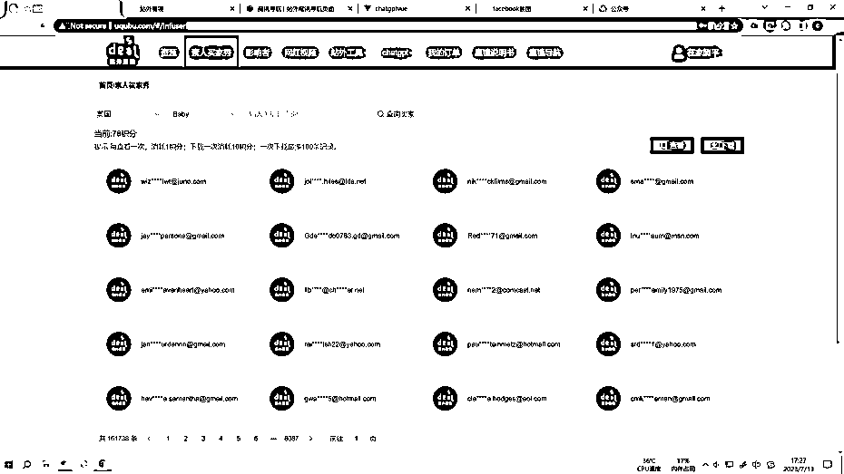

# 亚马逊+技术开发，如何通过技术解决 80%的重复问题

> 原文：[`www.yuque.com/for_lazy/thfiu8/yra1i8n3oedgbvne`](https://www.yuque.com/for_lazy/thfiu8/yra1i8n3oedgbvne)

## (精华帖)(45 赞)亚马逊+技术开发，如何通过技术解决 80%的重复问题

作者： Alex Cheun*

日期：2023-08-31

80% 的重复问题都可以通过技术手段来解决。对亚马逊服务商们来说，这也同样适用。

因为他们的日常工作中充满着太多的重复性事项。比如，联系国外红人推广客户的店铺产品时，先人工复制粘贴产品促销信息，然后再挨个发给对方；当给客户反馈时，需要先截图，人工打马赛克，再加上美图秀秀的图片拼接，最后才发给客户一张长图......

接下来，我就来分享下自己是如何通过技术手段解决了 80%的重复问题，希望能对你有所启发。

In a gold rush , don't dig for gold , sell sholves

想必大家都知道深圳有一个华强北吧

华强北是最容易草根逆袭的地方之一，但是大部分人到华强北，撑不到半年就被淘汰了。

但是有那么一些人，看上去普普通通，但是生活却一直红红火火，且越做越大，想知道他们是谁吗？

他们是卖包材的！

纸箱，泡棉，胶带纸，通用胶带，通用胶盒。

就是大家都觉得很普通，但是每个人都需要，聚沙成塔，闷声发大财！

火箭叔在华强北 6 年，离开华强北 5 年，如今再去华强北逛逛，几乎看不到熟人了，只有当初的包材档口没换老板了，并且规模看着扩大了 10 倍不止。

大家好，我是火箭叔，今年的生财新圈友。2012 年创业销售手机壳，在淘宝赚到第一桶金。2018 年转战跨境电商亚马逊，通过风口+技术升级，成为连续 5 年毛利过百万的亚马逊服务商。

# 一、**项目背景**

第一段创业史：2012 年 2 月 22 号，火箭叔带着 5000 块钱来到深圳，借宿在深圳西乡的同学家，每天坐 1 个多小时海滨观光 4 路去华强北进货，靠着勤奋和运气在不到一年的时间就赚到了上百万。

并在 2014 年，从去华强北进货，到去华强北卖货，巅峰期在华强北有 3 个档口并把自己的品牌手机壳做到年销售数量超百万个，年销售额过千万元。

总结第一段创业史，为什么能成功？

首先是风口，比如火箭叔在 2012 年做淘宝，没有美工，自己拿个单反拍个照片，上架就能出单，不用直通车，不用钻展，不用直播带货（那个年代压根没有），就自己买 100 多张不记名的手机卡注册淘宝账号，自己给自己做数据就能把店铺做起来。

感谢马爸爸，因为淘宝自己的体量在不断扩张，买家的数量增长大于卖家数量的增长，有一波流量红利期。

各位圈友别不相信，2012 年做淘宝赚钱就是这么简单，枯燥，乏味。

第二个点火箭叔觉得是降维打击，你在任何一个赛道可以挣到钱，主要是因为你的对手不强，2012 年什么人做淘宝，2012 年做淘宝可能会被人看不起吧？有几个专业的卖家？

火箭叔所做的细分类目曾经的最大卖家就是一个在校大学生。再看看 2014 年的华强北档口老板，有几个有品牌意识的？

公模，通用包装，往档口一挂就在那卖货。火箭叔借鉴国外大牌的设计，短时间内就把自己的品牌快速崛起。

这是 2014 年火箭叔的第一个档口，华强北档口的普遍水平

这是 2015 年火箭叔的第二个档口，请设计师设计了展厅以及统一风格的包装设计

  

这是 2016 年火箭叔的第三个档口，仿照苹果的展厅以及包装设计

直到 2023 年，华强北很多档口还是和火箭叔 2014 年差不多的情况，所以这就是保持胜利的秘诀：降维打击，职业拳手和小学生打架。

火箭叔总结在第一段创业史中，火箭叔成功的因素主要是抓住了风口，并且火箭叔的对手并不是很强，这个为火箭叔的第二段创业史打下了基础，让火箭叔很清楚自己擅长什么，不擅长什么，从而提高了第二段创业的成功率。

重要的事情说三遍：

不要去对手比你强大太多的赛道去卷！

不要去对手比你强大太多的赛道去卷！

不要去对手比你强大太多的赛道去卷！

谈谈火箭叔为什么会退出手机壳这个赛道，因为内卷！

当越来越强大的竞争对手入场之后，像火箭叔这样红利期入场的选手就开始被清退出局了，火箭叔当年一个仅有三台注塑机的小工厂，被 100 台注塑机的大工厂抄了爆款，这就是屠杀，完全没有能力反抗。

打不过，那火箭叔就跑呗。

# 二、**跨境电商亚马逊**

在被迫退出手机壳这个赛道之后，2018 年，火箭叔又开始了二次创业，由于火箭叔之前的手机壳客户有做亚马逊暴富的，据说在亚马逊卖手机壳赚了 2 个亿，于是火箭叔羡慕了，跟着进入了跨境电商亚马逊这个赛道。

一开始是做普通卖家，卖货，做得一般，一天也就是几十单的水平。

做了几个月，火箭叔感到这个赛道的红利期确实有，但是竞争也比较激烈，火箭叔高考 600 分不到，但是发现很多卖家都是高考 650 分左右的学霸，火箭叔和小学生打架的计划泡汤！

火箭叔这时候做了一下盘中计划调整，分析了一下形势：

1、亚马逊红利期还有很长时间，这个赛道值得坚持；

2、深耕亚马逊卖货风险与机遇共存，可能挣几千万，也可能亏几千万；

3、手机壳结束的时候还有 20 万个手机壳库存滞销，如果亚马逊也一样呢？

4、华强北大部分档口都做不到半年，但是做手机壳包装的档口却坚持到了火箭叔倒闭以后还好好的，并且越做越红火。

5、火箭叔通过国外社媒做促销，可以把自己的产品提价一倍以后打五折销售，销量是平时的几十倍。反复测试这条路是可行的。

战略调整，把重心放到帮其他卖家做国外社媒促销，帮别人卖货挣服务费！回到开始的话题，火箭叔要做那个在淘金热下卖铲子的人。

同样的，这个赛道刚入场的时候非常轻松。大量的卖家涌入亚马逊，但服务商其实没几个，尤其是做国外社媒促销的服务商，自己会英语能和老外沟通的都跑去做卖家了。

所以，起盘也是非常的轻松，客户都是经人介绍自己找上门来的。

但是问题很快来了，从 0 到 1 非常简单，从 1 到 10 却很难！

这个行业门槛非常的低，会英语，能科学上网，有个 FB 账号就可以称自己为一手渠道。如果招人的话，瞬间可以变成竞争对手，要怎么扩张呢。

那么不能招人火箭叔只好延长工作时间，开启了 7*20 小时工作制。

工作到凌晨 5 点，睡到早上 9 点，其他时间全都在工作，睡办公室，洗澡就去隔壁的健身房解决，健身房的人很疑惑，这个人每天过来锻炼 15 分钟，但是风雨无阻，图啥？

有一次火箭叔爆单了，从早上 9 点一直工作到第二天下午 1 点，连着工作了 30 多个小时，睡下后，睡太死没接到火箭嫂 10 几个未接来电，事后火箭嫂哭唧唧和火箭叔说，以为你去陪稣哥下棋了。

连着 5 个月，这样的生活以后，火箭叔开始招人了，毕竟每天睡这么少，钱挣到了，也没命花，实在不行招一眼看就不会创业的人吧。

然后，命运之神眷顾了火箭叔，让火箭叔招到了第一个程序员，老林！

老林其实是个电脑爱好者，并不算严格意义上的程序员，但是足够了，老林在火箭叔这呆了不到一个星期，就说这个东西可以搞个脚本自动化，并且在一个星期后给了火箭叔成品，见到成品的一瞬间，火箭叔激动的想哭，之前 5 个月不分昼夜的工作，原来动动脑子这么容易解决！

这下，火箭叔突然意识到，曾经有个大佬说过，一个优秀的程序员，可以顶得上 100 个平庸的员工。这句话是对的！

这下火箭叔开始对自动化上瘾了，只要是人能做的事情，都会考虑自动化，并且老林之后又有了小刘，小吴，小孙，这时候火箭叔体会到了一句名言。

“It doesn't make sense to hire smart people and then tell them what to do; we hire smart people so they can tell us what to do.”

火箭叔发现程序员是一群非常聪明的人，他们可以开拓你的视野，并且给你解决问题的新方法。让你也变得聪明。

于是，火箭叔慢慢形成了自己在这个行业里的壁垒，几乎每一个工序都做了自动化软件，甚至同一个岗位，用 3 个不同程序员写的 3 个不同程序做同一间事情，避免程序偶尔罢工。

不用再担心招人会成为竞争者了，毕竟现在我们的效率是普通人的 100 倍，光在效率上我们就可以碾压竞争者。

# 三、**亚马逊哪些环节可以通过技术开发减少重复工作**

确定方向以后，就复盘一下实操经验吧。

所谓亚马逊服务商，那就是一个服务行业，服务是由人提供的，在火箭叔扩张规模的时候就遇到了招人难的问题，并且成本很高！

一个英语好又懂国外社媒的员工工资在 7000 到 12000 之间，不仅成本高，还不可控！

火箭叔招过 2 个六级 550 分以上的小姐姐，一个考上了研究生，一个考上了公务员，根本留不住。

火箭叔招过 1 个意大利留学回来的 96 年小哥哥，趁国庆假期公司没人，拷走公司电脑里所有资料单干去了。

所以火箭叔决定把流程自动化，让程序去模仿人的操作，标准的，不会出错的程序，去代替不可控的人。

那么，要怎么去实现这个流程自动化？我们逐步来拆解一下！

**（1）理顺流程，让流程标准且可复制化。**

我们首先要明白什么是自动化，自动化就是模仿人的操作，并且不断重复，只要是人能做得，并且反复做不会出错的，就可以自动化。

我们以给红人发消息为例，前期做好开发工作以后，每天的日常，就是把消息发送给红人，那我们的步骤就可以拆解为“复制，粘贴，下一个”

为了便于理解，火箭叔给圈友们现场做一个微信自动化发送表情包的案例。

众所周知，微信群发助手，是有人数上限的，而且是根据通讯录发，而不是最近聊天记录发，并且不支持发表情包。

那么我想给最近聊过天的一些朋友，批量发送表情包要怎么实现呢？我们现场做一个出来！

第一步：把鼠标定位到左边的联系人列表

第二步：用鼠标滚轮向下滚，滚到第 N 个人的位置，并点击鼠标左键

第三步：在对话框点击选择好的表情并发送

第四步：重复 N 次

  

用人的语言，那就是把鼠标移到站外魔镜 ai 客服猛男的头像的位置。

但是机器不认识猛男啊，需要把这个命令转化为机器能听懂的命令，就是把鼠标移到 X=1110  Y=660 的屏幕位置

所以对象的宏命令为：

Mouse move X=1110  Y=660

这样机器就能把鼠标移到猛男的头像的位置了。

**（2）用标准的流程去解决自动化带来的 Bug。**

人和机器最大的区别是有人具有辨识和判断能力，遇到问题时，人会停下来，但机器不会，所以自动化有一个很难的点，就是在碰到没有考虑到的问题时会卡住，机器人不知道怎么办了。

这时候就需要人来找出解除这个 bug 的方法，并且写进程序里。例如，火箭叔在搞自动给微信联系人发消息的软件时，碰到批量发消息的途中，有某个联系人突然和你说话，那就导致了聊天窗口的改变。

怎么解决呢？其实也很简单，那就是把你需要的联系人置顶，那其他人突然给你发消息就不影响了，很多小伙伴会抱怨自动化程序不好用，就是在实际落地的时候，遇到了这样那样的问题，其实写完程序只是开始而已，反复调试是一个漫长的过程。

要把遇到的所有 Bug 解决。之后你就能省下好多人工成本了。

火箭叔在反复测试后，把这个微信机器人搞定了，设置了足够长的随机延迟，同样的原理，火箭叔在 2019 年编辑出了自动给国外社媒红人发消息的机器人。

**火箭叔自动化案例一：给红人发消息自动化**

人工给国外红人发帖，其实是一个重复的劳动，同样的产品促销信息，给几十上百个红人挨个发一遍，就是不停地点复制黏贴。

这个用投屏软件+宏文件就可以实现。

点击鼠标，左键，右键，鼠标滚轮下滑，鼠标定位到具体某个位置，全都可以编辑，再加上投屏软件，用一台电脑可以控制多台手机。

这一套系统上线，火箭叔立马省下 3 个发消息给红人的员工工资，每个月节省 2 万元工资，并且随叫随到，不会请假，不会发脾气，不会出错。

  

**火箭叔自动化案例二：[amzdeal.top](http://amzdeal.top) 自动反馈社媒上帖截图网站。**

通过第一步节省了给国外社媒红人的人工，火箭叔又准备节省给国内卖家反馈上帖截图的人工，土办法是用 QQ 的截长图功能，人工打马赛克，再加上美图秀秀的图片拼接，给客户一张长图。

客户随时可能会问你要反馈截图，导致火箭叔白天面对国内卖家，晚上面对国外社媒红人，一天睡不到 3 个小时，感觉快猝死了。

所以，火箭叔找程序员开发出了自动截图的软件，并且把截图上传到服务器数据库，客户凭下单时候的指定编码就可以下载反馈截图，客户也不用等，火箭叔也不用守着电脑。

由于是网站自动下载，这样等于 24 小时随时响应，不仅可以做到秒回，还能 24*365 工作。请问多少钱能招到一个这样的员工，答案是不可能招得到，只有自动化网站才能实现，并且成本非常低。

靠前 2 个自动化替代方案大量的节省了人工成本，即使业务量扩大 10 倍，火箭叔的用人成本也不会增加太多

**火箭叔自动化案例三：[`home.uqubu.com`](http://home.uqubu.com) 引流端的自动化工具网站。**

火箭叔通过在最大的亚马逊论坛写软文的形式，给自己的网站引流，例如时下最火的 AI

用 2 张一寸照，AI 生成婚纱照

火箭叔会通过热点，例如 AI 学习，分享 AI 能实现功能的实操过程，并且在文章里告诉用户，需要用到的工具网站在火箭叔网站里都有，从而到达引流的目的。

由于文章是分享在亚马逊论坛，所以用户的精准度还可以。

  

**火箭叔自动化案例四：[`uqubu.com/#/chat`](http://uqubu.com/#/chat)**

ChatGPT 的接入网站，方便用户使用，免费的，可以引流。

**火箭叔自动化案例五：[`gpt.obuudo.com/`](http://gpt.obuudo.com/)**

这是一个接入 GPT 智能生成亚马逊标题，描述，以及计算亚马逊促销折后价的网站。免费的，可以引流。

**火箭叔自动化案例六：[`uqubu.com/#/code`](http://uqubu.com/#/code)**

这个是测试亚马逊折后价功能的网站，可以避免设置错折扣导致被 Lu 羊毛。免费的，可以引流。

**火箭叔自动化案例七：[`uqubu.com/#/Infuser`](http://uqubu.com/#/Infuser)**

通过关键词查找国外买家的网站功能，免费的，可以引流。

**火箭叔自动化案例八：[`uqubu.com/#/video`](http://uqubu.com/#/video)**

展示其他客户买家秀的网页展示，可以让客户在网站自助挑选，减少沟通成本和时间。

**火箭叔自动化案例九：[`bbs.obuudo.com/`](https://bbs.obuudo.com/)**

BBS 告诉用户怎么使用网站，当别的同行只能靠一张嘴去介绍自己公司的适合，火箭叔可以通过网站的功能展示，减少大量的沟通成本。

并且这些功能都是用户实实在在需要的，也增加了用户的黏性。

在当下这个获客成本越来越高的背景下，火箭叔的工具网站自带传播属性，用户用得好了会口口相传，大大降低了火箭叔的获客成本。

到这个时候，行业已经内卷到，单纯靠人工，已经很难挣到利润了，大量没有规模效应的个体户同行，跑来做火箭叔的代理，火箭叔在公司只有 3 个员工的情况下，和 20 多个员工的同行业务量是差不多的。

所有这些个体户代理共用火箭叔网站的功能，减少了大量的人工成本。

一个人做跨境电商，他懂英语的概率假设是 80%，他懂数据分析的概率假设是 50%，他懂 IT 的概率假设是 20%，所以又懂英语又懂数据分析又懂 IT 的人，其实就很少，只有不到 8%。

也就是交叉行业的能力，这样可以甩开大量的竞争对手。

所以这样，火箭叔就根据自己先前创业的经验，根据自己的能力，设定了火箭叔这次创业的赛道定位，就是做一个高度自动化，并且擅长于数据分析的亚马逊站外推广公司。

# 四、**经验分享**

**（1）保持对知识的饥饿感，持续的学习**

如果说火箭叔做淘宝和华强北开档口，都是碰上了风口，挣到轻松的钱，这次创业，火箭叔感觉非常的难，完全是靠积累，以及靠不断地学习。

这么内卷，每天想的都是降本增效，想到有什么人工反复操作可以自动化的，就去研究，摸清楚以后，分析成本，只要成本不高，立马就让程序员去实现。

不是简简单单的说一句，我要实现什么功能。而是理清整个流程，把每一个关键步骤怎么做整理出来给程序员，程序员只需要把步骤转成代码，不需要考虑专业背景。

别的程序员 10 天给老板做一个程序，在火箭叔这里，只需要几个小时，因为火箭叔已经代替了产品经理的角色，自己把这个程序员听得懂的话讲给了程序员。

当下，各行各业都内卷，只有你比 95%的人都努力，都优秀，你才能赚到钱，因为短视频，自媒体的风口，大量流量掌握在少数行业 top 手里，确实 90%以上的普通人是挣不到钱的，你要挣钱，你就要比 95%的人更努力，更优秀。

卷死自己，往死里卷。所以火箭叔几乎每天都在短视频上学习新的知识并且实操。也是靠火箭叔自己不断的学习，才能让公司在这么内卷的情况下生存下来。

**（2）自我定位以及行业交叉能力提升杠杆。**

火箭叔作为一个 35+，普通人（普通大学本科），社恐（不善于交际，不喜欢应酬）中年人，怎么重新创业，肯定是经过反复思考的。

大部分人的失败，是因为对自己的盲目自信，但其实我们都只是普通人而已，太多人比我们优秀了。

但如果你愿意放下所谓的面子，向下去竞争，你就会容易很多，因为比你强的人看不上这块蛋糕，和你竞争的人又刚好比较弱。

那么在放低自己一个身位之后，再想想自己到底有哪些优势，这些优势怎么组合以后可以形成一定的壁垒。这样就可以在一个较长的周期内，都能依靠这些壁垒持续的占据优势地位并收获利润。

* * *

评论区：

西风残雪 : 问一个问题，为什么文章一直强调火箭叔，是有什么说法吗？
陈真 : 大概是说明文章不是马云写的。[呲牙]
王人三 : 估计是做 ip
小穗 : 嗨，能否加个 V[呲牙]学习请教一下
亦仁 : 很精彩的分享
亦仁 : 感谢分享，已加精华。
亦仁 : 跨境 AI 工具箱 这个可以深入打一打 新的维度
Alex Cheun* : 亦仁大大威武，跨境 AI 工具箱确实不错

* * *