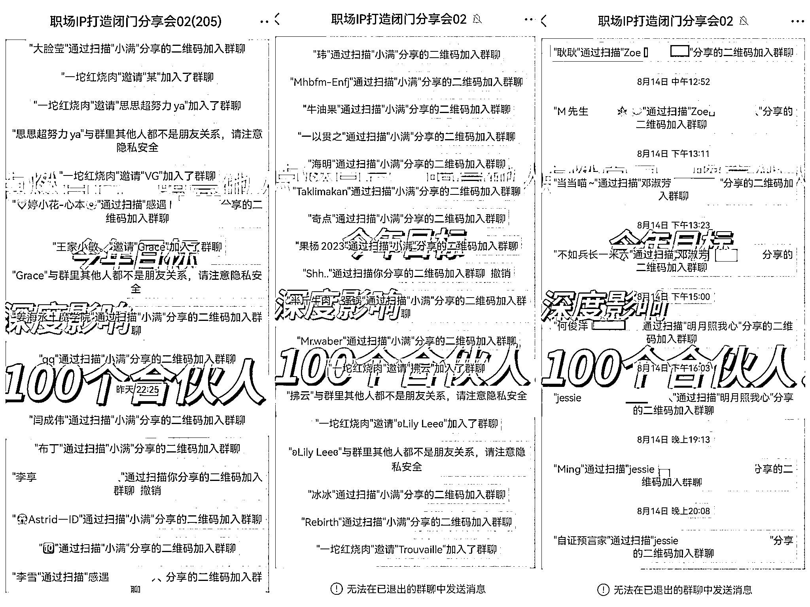

# 四天收入近 8w，职场 IP 如何做好日常经营及爆发式发售

> 原文：[`www.yuque.com/for_lazy/thfiu8/eisfkahlut6diwo8`](https://www.yuque.com/for_lazy/thfiu8/eisfkahlut6diwo8)

## (40 赞)四天收入近 8w，职场 IP 如何做好日常经营及爆发式发售

作者： AI 君

日期：2023-09-01

大家好，我是生财龙珠圈友 AI 君，95 后，前大厂产品经理，做个人 IP 两年，辞职一年半，月入六位数，目前是一名职场个人 IP 孵化教练。

这几个月，我通过两场品牌活动，靠着 3000 私域好友+1000 粉公众号，以及一些甚至自己都没有粉丝量的普通职场人帮我转介绍，做到了四天收入差不多 8w。

我们的基底其实很少，去掉重复的和自己人，实际有效人数，线下活动 30 多人，线上几个群 400 多人而已，但靠着精准人群和强转化能力，我们转化了 6 个 1w+的合伙人产品，和一批几百块钱的会员产品。

这群人中，有差不多一半的人，都是我的学员、合伙人们拉来的，报名的人数也有三分之一是他们介绍来的。

里面出现了神奇的四级转化（我拉了 A，A 拉了 B，B 拉了 C，C 拉了报名者）。以及，一个陌生人看了我朋友的推荐来听分享，当场直接打了五位数入我合伙人，而我朋友压根都不熟这个人。

而这几次的活动我都在复用同样的逻辑，也往往能够获得差不多的结果。这些都让我感知到，这个事儿是可以有效复制给大家去做的。

普通人其实就是没那么大的号召力和流量池的，但是只要能把自己这块的设计做好，做一个垂直 IP，自己来打造势能，一样可以有还不错的成绩。

这篇文章就想和大家详细分享一下《普通职场人，如何通过打造 IP+举办品牌活动的玩法，实现日入 3w》，具体包括——

1、职场人如何突破收入瓶颈和道路狭窄的问题？职场 IP 必须要打通的三个重要环节

2、如何通过做事+做势放大自己的影响力和收入？IP 日常储蓄势能与 IP 品牌活动释放势能

3、如何低成本做一场低流量高转化的 IP 品牌活动？一套从整体规划、人员调度、内容准备到现场应对的 SOP

4、大型运营活动操盘，容易出现哪些问题？如何调整心态，从容过关？

全文 15000+字，详细写了我做活动的经历和 SOP，详情请移步：[`j7329dxmbu.feishu.cn/docx/W7nudn38IoxRuyxz1tpcrJOZnnd`](https://j7329dxmbu.feishu.cn/docx/W7nudn38IoxRuyxz1tpcrJOZnnd)

最后，感谢生财提供了一个这么好的平台，让我认识了一群优秀靠谱的伙伴。

感谢 jessie，李心釉，何俊洋律师，感遇，小丸子等伙伴，在活动过程中的积极参与和帮助。没有你们，就没有这次的活动，和后面的所有成绩。

感谢靠谱，在群发售和这篇帖子写作过程中的帮助。在几次关键时刻，给了我非常有价值的指导。

感谢大家的收看，希望能对你们有所帮助。

整个运营操盘，细节真的非常非常非常之多。帖子篇幅有限，有一些对方也可能有遗漏，不足之处望理解。如果大家想了解更多，也欢迎和我交流。

另外，我们这边办活动比较多，北京、上海、广州、深圳都有一些可以用的高端场地资源，艺术园区、酒店、咖啡厅等都有，大家如果有需要，也可以联系我。

【往期龙珠贴】

大厂裸辞一年半，跑通职场个人 IP，千人私域半月被动收入近六位数，我的历程分享 [`t.zsxq.com/11m3BTCz6`](https://t.zsxq.com/11m3BTCz6)

视频号第一次直播卖课，单场净利 16000+ [`articles.zsxq.com/id_lg037c6uozh8.html`](https://articles.zsxq.com/id_lg037c6uozh8.html)

* * *

评论区：

小女巫忻忻 : 超棒的耶！
AI 君 : 忻妈贴贴~
大西 CC : 超牛的 AI 君！
AI 君 : 大西[玫瑰][玫瑰]
Dancy : 很真诚，很干[玫瑰]
亦仁 : 一定要换名字了，千万别用 ai 君，这个建议值七龙珠。

* * *