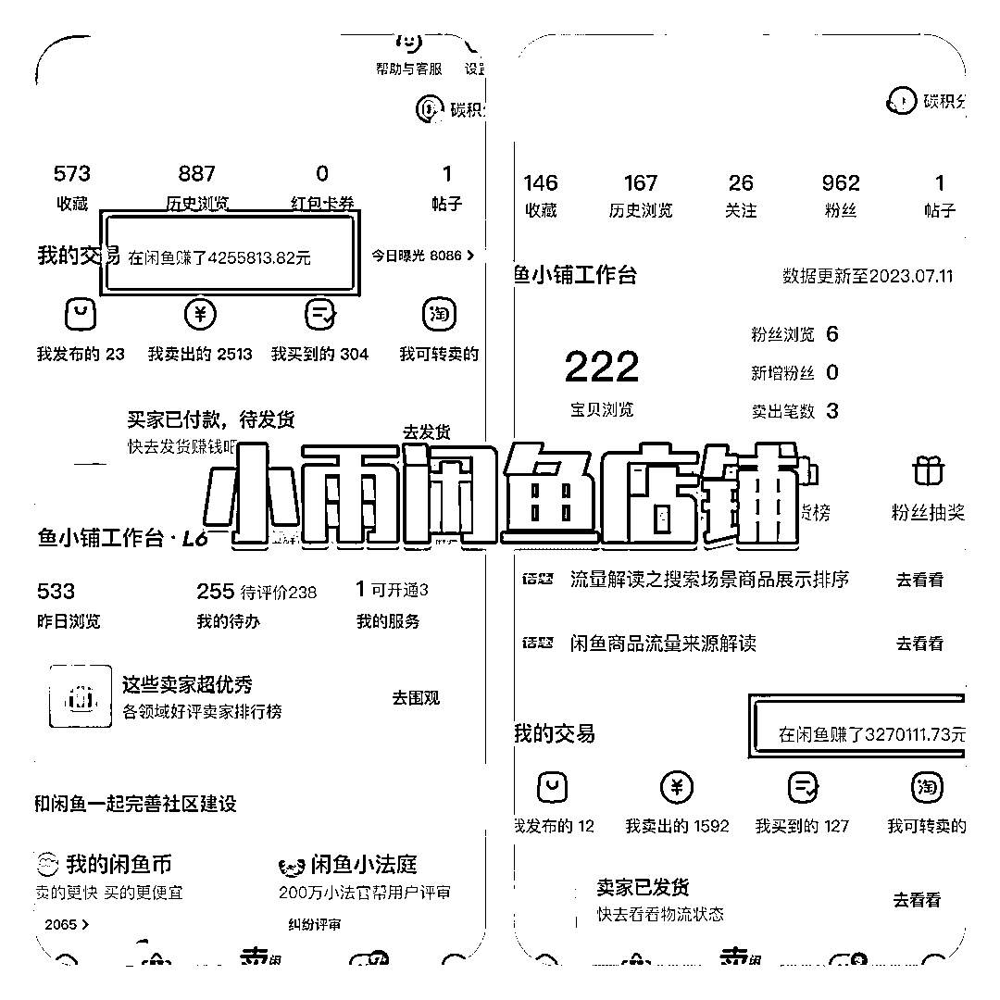

# 爆款选品技巧

> 原文：[`www.yuque.com/for_lazy/thfiu8/cgc2sq6zqe16tbk0`](https://www.yuque.com/for_lazy/thfiu8/cgc2sq6zqe16tbk0)

## (71 赞)爆款选品技巧

作者： 捧着风的小雨

日期：2023-09-08

生财的伙伴们大家好，我是小雨。利用闲鱼平台做到月入 3-5W

闲鱼账号营业额达到 4255813 元，另一个账号 3270111 元。还有一个账号营业额五十多万

这么多的营业额和每月稳定 3-5W 的收入，离不开我的核心选品方法。靠这些选品方法，我在闲鱼卖出很多爆款产品

选品方法都写在了文档里，大家可以移步到文档查看

【腾讯文档】日入 500➕爆款选品技巧 [`docs.qq.com/doc/DQlBsT0JiZ0VzRG91`](https://docs.qq.com/doc/DQlBsT0JiZ0VzRG91)

* * *

评论区：

Aarom °🐟 : 做垂直还是做百货好？
捧着风的小雨 : 前期做百货，有爆款后再用爆款做垂直
Superhero : 链接打不开啊[流泪]
捧着风的小雨 : 就是蓝色字体那句话，你点一下就进去啦
丹枫 : 请问大佬一条发几个产品啊，测品占几个啊
黄燕妃 : 很干，谢谢分享
阿润 : 看到 400 多万 GMV 时我以为看错了[捂脸]闲鱼上限这么高么
捧着风的小雨 : 一条链接就是一个产品，我上架过的产品有上千个了

* * *