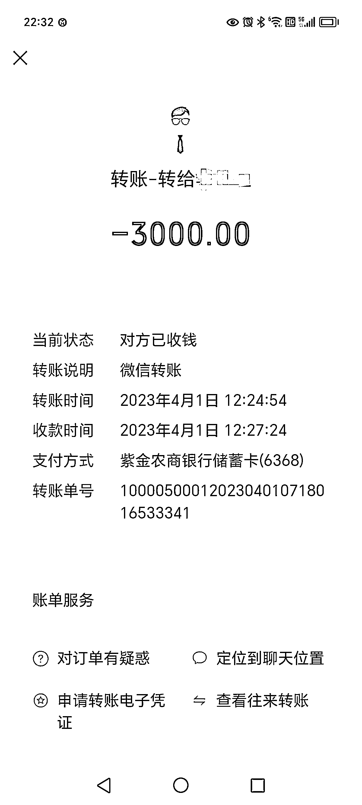
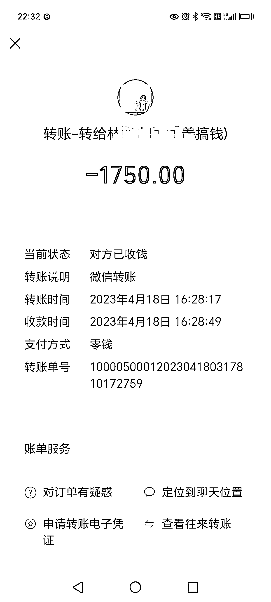
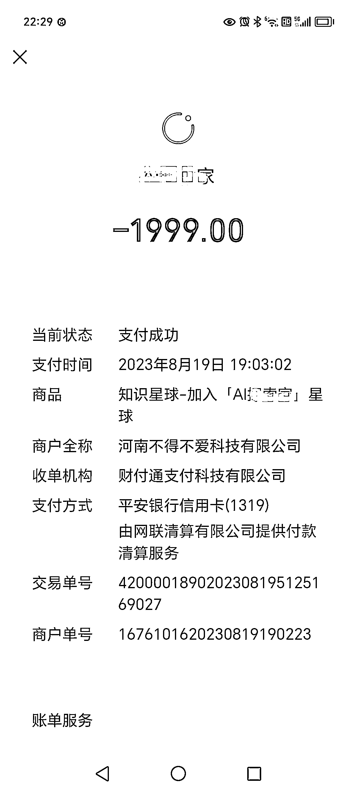
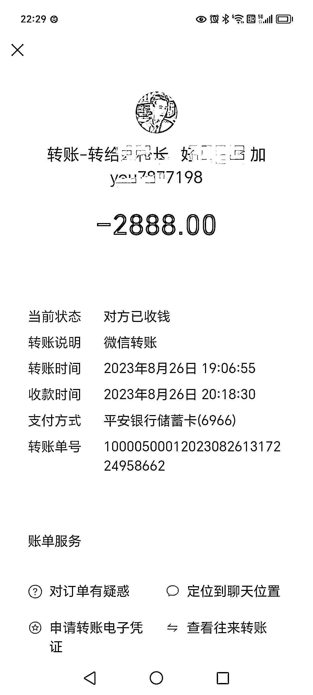
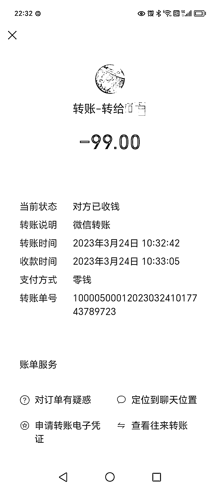

# 花 150 万，成为知识付费体验家

> 原文：[`www.yuque.com/for_lazy/thfiu8/ebssgbmyg2751zix`](https://www.yuque.com/for_lazy/thfiu8/ebssgbmyg2751zix)

## (166 赞)花 150 万，成为知识付费体验家

作者： 子白

日期：2023-09-07

《花 150 万，成为知识付费体验家》

大家好，我是子白，原来大家都叫我乾哥，子白是 给我起了一卦，算出来的名，说这 IP 一定能火，我从了他，从此圈子里少了个叫乾哥的大韭菜，多了个叫子白的创业家。

生财有术、高研社、掘金之路、AI 探索家、K 大说 AI、参哥抖音课、程前朋友圈、粥佐罗、玩赚新媒、尤校长、炸天帮……你听过或没听过的社群/星球/小报童/朋友圈我大都付过费，我付费的爽快程度（也可以说我不过脑子）， 、 、 等大佬都有体会。下面是我的知识付费之路，希望对迷茫的你有所帮助。

一、门外汉误入互联网
我是国内某银行部门主管，人不安分，工作 5 年，折腾 5 年，也被割了 5 年，经常是主动送割，常被人骗了还帮人数钱。直到今年 1 月，我花了、赔了、被骗了合计有 120 多万。但一直没花到正确的地方，也没付给正确的人，如果这一百多万交给了对的人，人生早就变样了（苦笑），每次都是满腔真情被人利用，至今也不长记性。

但我不安分的心从未停止，今年 2 月，GPT 火出圈了，让我倍感惊奇。想见识一下，又因为不会上外网被拦在门外。好巧不巧，在某微信群里被一个老哥骗进了 GPT 的 Mai 号群。

为什么说骗呢？大哥跟我说这个群收费 888，我想都没想就转了帐，拉进群以后，大哥就消失了。我问群主咱这个群收费不？群主说不收费。我当时还不知道圈子本身就有价值，只惊叹这智商税交的太冤枉，但钱都付了，退群更冤枉，就在群里潜水窥屏。群里天天聊的“注册机”“日产 10 万个”“Token”“api”我全都看不懂，就看懂一句：“这钱赚的太容易了！”

我按捺不住问群主：“咱这个群干嘛的？”
“MaiGpt 账号的”
“卖多少钱啊？”
“98-298 随便卖”
“成本呢？”
“8 毛”
“我艹？”
“互联网的事儿，谈什么成本？”
“求带！”
【恭喜发财，大吉大利】
群主领取了你的红包
【恭喜发财，大吉大利】
群主领取了你的红包
【恭喜发财，大吉大利】
群主领取了你的红包

从此我就成了群主的下线，他发我一个账密，收我 2 块，教我去各大评论区截流。第一天晚上就来了 100 多个客资，我不敢卖高价，只收 9.9。

结果麻烦来了，客户都是穷学生，九块九的玩意恨不得全宿舍共享，各种来骚扰。不堪其扰的我听群主的，直接涨到 98 一个，过滤穷学生，来的都是白领及以上收入群体，直接收钱不用售后，还挣得更多了……

我不断地截流加好友、发账密，然后就收钱，2 月底一算账，赚了 8 万块，群主 2 月份收入 100 万。我们压根没用过 GPT，可并不影响我们靠它赚钱，我静下来想想，这钱赚的跟能力有关系吗？没有，就是信息差，且踩上了风口。这时候我明白了钱确实不是挣的，是大风刮来的。

二、小团伙打造精品课
2 月开始，GPT 的课程/星球/社群如雨后春笋一般冒了出来，出于好奇，我挑了几款付费，买到手才发现都是预售，海报上标着“早鸟价”，即使这样，动辄狂赚百万。当时知识星球的赚钱排行，前十有六个都是 GPT。

我被震撼了，同时又不服气，凭什么他们画一张海报卖空气都能赚钱？他们能做我凭什么不能做？说干就干，招揽了 3 个同伙，开始做课！有趣的是，我们分别是银行、汽车、培训、公务员，全是互联网小白，更不懂 AI，所以称咱们为“团伙”一点没错。我是团伙里的资方，出钱又出力，为了找对（chao）标（xi），我买了当时市面上所有的 GPT 课程和社群。说实话，90%以上是垃圾，明显只为了圈一波快钱，也有个别做得好的，比如刀姐，成了我的主要对（chao）标（xi）对象。

5 天后，课程新鲜出炉，公司注册完毕，小鹅通上架完成，海报也是高价请 大佬画的，就在我纠结赚了 500 万该怎么分的时候，现实给我泼了一盆冷水：我们的课程无人问津。这时候我才明白，能凭一张海报赚到钱的人，大都是做社群做 IP 的，他发一个朋友圈就有人框框付费，这是他们势能的变现，跟课程本身没多大关系。

三、真小白看到新世界
课程卖不动，让我加深了对势能的认识，同时又发现一点，那就是不少优秀的镰刀手都有一个共同的产地：生财有术。（亦仁别打我）

正好遇上 4 月拉新，就直接加入了 战队，但是我扭头就为 拉了一个新圈友，刘驴大哥对不起，不是我不给战队做贡献，是靠谱笑容太迷人，天天在朋友圈看她冲你乐，谁能不迷糊？

进生财 5 分钟后，我心里的知识付费 No.1 就非生财莫属了，别的不说，两千块能买到几万人花了 7 年积累下来的创业心得，还要啥自行车？

可是后来我越看越焦虑，毕竟生财拿到结果的圈友太多了，赚到千万的帖子我看了 6 篇，赚到百万的帖子我看了 82 篇，赚到十几二十万的帖子不计其数，相比之下自己就是废物啊，能不焦虑吗？

所以我继续不停地付费加社群、学项目、报航海，5 月份的航海我上岸了 4 条船，同时把本期所有航海手册阅读完毕后，我没那么焦虑了，真是看十遍不如干一遍，我有底气多了，但还是被五花八门的社群吸引，控制不住地交钱。

四、老韭菜回头金不换
直到我认识了比高，终结了我几年来的韭菜习惯。

我是在 口中听说比高的，芷蓝某天在群里发言说“做社群就去抄比高，一定要抄比高”，当时我还在想谁的名字这么奇怪，但心里已经种下了种子。

两个月后我在某创业号上看到了比高的一百条经典语录：
1、有人赚确定性的钱，有人赚不确定的钱，有人赚概率性的钱，有人了解概率性所以拉高概率去赚钱。（比高是一个赚确定性钱的高手）
2、看十遍不如干一遍，干一遍再和一群人聊一遍，年轻人不瞎扯，只做无情的搞钱机器。
（认知+执行力+项目=赚钱）
小红书要打商业闭环，首先就是深耕变现。变现两大点，一个是电商，另一个是本地生活，我研究了那么多平台，我觉得小红书的商业价值是极高的，最主要的是它起到了一个“消费决策”的作用。

我对他的言论高度认可，开始拿着钱找他，这时候我还不知道他是做 PPT 拆项目的祖师爷，也不认识他，仅仅是从别人的口中听到他说的话，就认准了要付费，说明他的认知、他的势能足够高，我的本能驱使着我向高势能的人靠拢。

通过圈友链接，我加上了比高的助理：
“大佬你好，久仰大名，最高客单价多少？”
“现在开了门徒计划，报名费两万八。”
“行，转哪里？”
“转公司，明天比高会打电话给你。”
两句话成交，这就是比高势能到位的结果。

而且我加的社群已经够多，我已经体会到创业类社群同质化很严重，很难说谁做得更好一些，只能说创业粉足够多，蛋糕够大，卖铲子的人总有一席之地。我付了太多 1 万以内的客单，链接不到大佬本人，进不了核心圈子的社群对我没有意义，而且两万八远低于我的心理价位，我以为怎么着也得 5 万以上。

现在跟比高几个月，比高的超预期交付让我心满意足，小圈子的强链接让我倍感亲切。比高开发我的优势，说我不拍视频不搞直播太可惜，逼着我天天拍视频（说我一定能火的哈哈）。他的高研社维护也很到位，细节做的很棒。

曾经沧海难为水，我现在拆过的项目没有一百也有八十，加过的社群也快 100 个，现在脖子上镶了钢板，根本不可能被割。我依然保持着付费的习惯，但不再是因为焦虑，更不是被钓鱼，大都是为了交个朋友或者补个票（比如给刀姐哈哈）。

我走出了付费陷阱，经历也许比大部分圈友丰富一些？ 提升认知的方式有很多，我被迫选择了花钱买教训的方式，这是性价比最低的一种，截至目前一共花了有 150 万，不多说，里面至少 130 万都打了水漂喂狗。我如果 5 年前有幸加入生财，估计早就拿到结果了，也不用花这么多冤枉钱，省 100 万给圈友们发红包多好啊对吧！

最后给年轻人一点建议：
1、不要焦虑，人的心力非常宝贵，内耗只会让你更难熬。别跟大佬比，生财几万人，大佬毕竟是少数；
2、项目也许过时，经历难以复制，但赚钱的事总踩着相似的韵脚，学习大佬的思想，拔高自己的认知；
3、付费本身不是坏事，付费给正确的人能让你迅速成长；
4、生财是极优秀的流量池，每一位圈友都是被筛选过的，具有良好付费习惯和付费能力的用户，就是俗称的优质韭菜，有无数镰刀手对咱们垂涎欲滴；
5、哪怕在生财内部，有的帖子引流也很明显，无可厚非，如果我自己发帖，我也会展示自己好的一面。比如 100 个号跑出来 10 个，挑里面收益最高的截图，实在不行 PS。没办法，所有人都往大了吹，你谦虚就是你的不对了。
6、话又说回来，知识付费的事儿，能叫割吗？割不割的判断是非常主观的，你交了钱，他确实提供了价值，但不是你想要的，算不算被割？所以说付费是因人而异，你得仔细选择。
7、如果你决定不了付费与否，那不妨来问问我，因为你想交钱的那个人，我大概率替你交过了，不然怎么叫知识付费体验家呢？而且消费过才有评价权，你说对吧～

* * *

评论区：

普通. : 付费天花板，还是老哥有钱砸
香格里拉 : 牛逼
控心 : 哈哈。差不多
吴佩在天涯 : 子白 yyds[得意]
坏孩（大学生） : 哇塞，加了这么久的老哥是付费大佬[呲牙][呲牙]
庸人不自扰 : 大哥真的是付费社群收集者[捂脸]
🔥逆熵增者💰 : 老哥，你的文风太幽默了，不过看完很有启发，谢谢分享
吴佩在天涯 : 子白可以做一期，付费社群评测

* * *