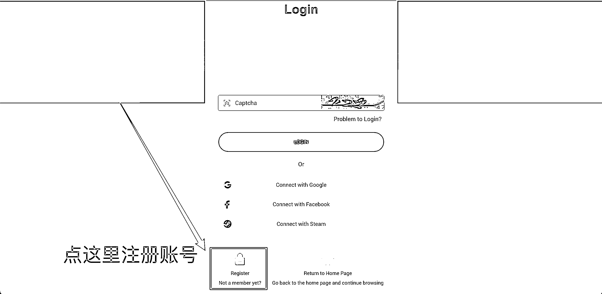
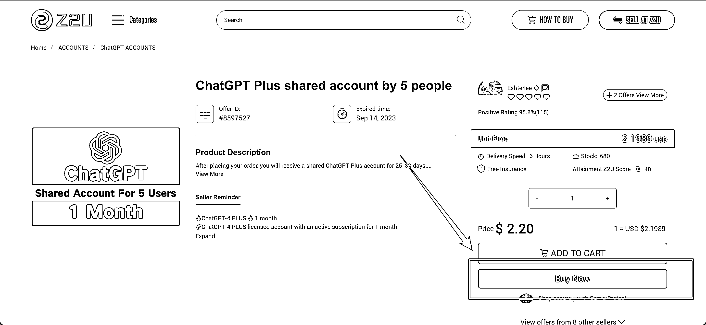
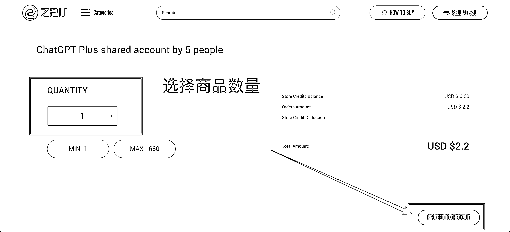
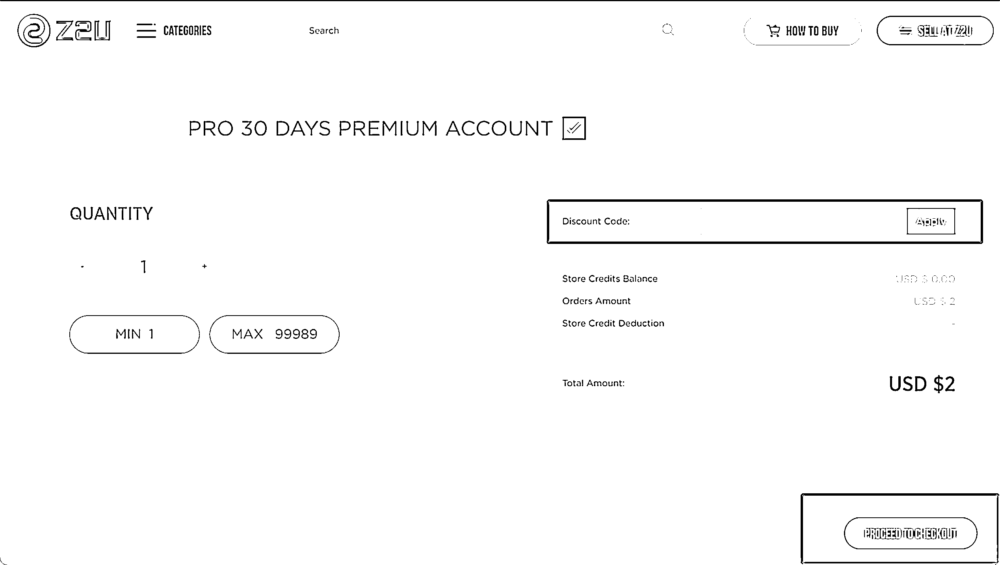
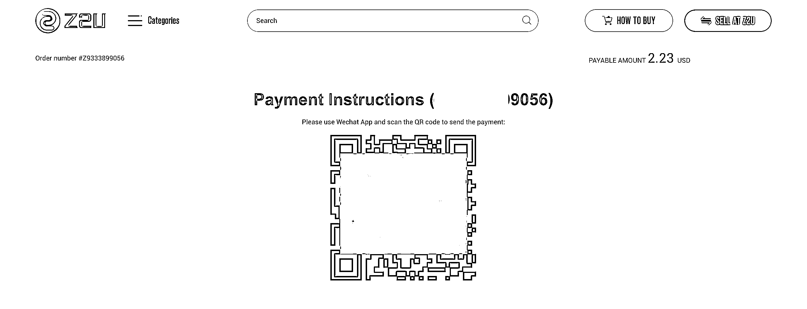

# 利用 Google 挖掘信息差：如何花不到 16 块使用 ChatGPT Plus 账号 30 天？

> 原文：[`www.yuque.com/for_lazy/thfiu8/kotyo6qnt83tv8sn`](https://www.yuque.com/for_lazy/thfiu8/kotyo6qnt83tv8sn)

## (44 赞)利用 Google 挖掘信息差：如何花不到 16 块使用 ChatGPT Plus 账号 30 天？

作者： 陈星空

日期：2023-09-04

ChatGPT 每个人都用上了吧，没用的话自己面壁思过去。

ChatGPT 应该是人手必备的工具了，至少我们团队是一人一号。

大多数朋友想开某个会员，基本都是淘宝咸鱼 or 拼多多，但有的会员账号在这些平台也不算便宜。所以，我们把**思路打开**，到「外面」看看，会有意想不到的惊喜。

**比如利用 Google 挖掘信息。**

**本篇分享大纲：**

1.  通过 Google 去搜索所有我们想要的东西

2.  利用平台信息查低价购买账号会员

3.  思考利用这个信息差，我们是否可以赚钱小钱

那就开始吧～

## 01、用 Google 挖掘信息

一开始我本来是想在咸鱼找一个工具的会员，找了一圈，嫌贵。于是上 Google 搜 XXX Account Sell。

以 ChatGPT 举例，搜 ChatGPT Account Sell. 来，我们打开第一个网站。

打开看着像是一个论坛，后面去 Google 了一下，哦这是一家游戏账户交易平台。

大家看到下面三个费用，是不是很便宜？**5 人共享账号只需要 2$,不到 16 块钱就可以使用上 ChatGPT Plus 版本。**（官方原价 20USD）。

接下来，我将一步步介绍如何购买下单。

但是注意，**这篇文章除了分享一个信息差平台外，更主要的还是希望大家多用 Google、学会用 Google，把思路打开，还是前面那句话，去「外面」看看，会有不一样的收获。**

亦仁老板 2017 年 3 月在公众号分享过一篇文章《[通过 Google 挖掘细分市场的一个案例](https://mp.weixin.qq.com/s/cXa6Rwiet5gN8bSe-h4QNw)》，没看过的小伙伴一定要去多看看。我觉得看案例，除了案例本身，还要去思考这个能为我带来哪些启发、我能做什么？

OK，回到前面，我们如何通过这个平台购买低价 ChatGPT Plus。

## 02、利用平台购买会员账号

打开商品看介绍，这个账号是 5 个人共享的账号，反正价格不贵，还要什么自行车呢，我们点击 **Buy Now.**

点击后会弹出要注册，输入自己的邮箱，打开邮箱点击平台发送的验证链接就注册成功了。

登陆后还是会回到商品页面，我们继续点击 Buy Now.

我们进入商品确认页面，左边可以选择我们需要的商品数量，然后点击右下角的 PROCEED TO CHECKOUT 按钮后进入结账页面。

这里多说一嘴，像下图有的**商店**在右侧是可以输入 Code，也就是优惠码，本着低成本的理念，这时我们还可以去 Google 搜索 Z2U XX Code 找相应的优惠码。

到了结账页面，发现支付方式还可以选择微信、支付宝，都有一个手续费，微信的手续费比支付宝的低。选择了微信后点击右边的 PAY NOW 按钮.

用微信扫码支付就可以支付。

支付完成后，在页面右上角选择 Order 查询订单状态，一般卖家可能会不在线，所以你需要做的是等待他确认你的订单发货，我等了一小时左右。然后再订单红框位置会显示账户跟密码。

卖家发货后，在下图位置就可以看到会员账号和密码了。

OK，整个流程就这么简单丝滑，执行力高的伙伴可能不会看完中间的过程，而是直接去搜索了。

最后，就可以拿着账号密码去官网登陆啦。

## **3、最后一点：**

前面说了这个平台是游戏账号交易平台，但不仅限于游戏账号。问题来了，我们一起想想除了自己买会员外，我们还能做什么呢？

首先，我能想到的，就是**低买高卖，赚差价**。就拿 ChatGPT 来说，我发现很多社群都在问怎么注册、IP 问题，其实开 PLUS 就是一个大多数人的门槛，自然就出现了代充。

那么，我们现在就可以直接低价购买会员账号，再倒卖给其他人。不要局限于 ChatGPT 哦，多搜一些工具。

其次，**卖教程**。就像之前卖小红书群聊撤回功能教程一样，只要有信息差就可以卖。

最后，**Affiliate Program**（联盟计划）。就是你创建一个链接或者邀请码，然后 A 通过你的链接注册账号下单后，你能获得 20%的佣金，A 再把链接分享给 B 注册，你还能获得 B 下单的佣金，不过有个 30$费用的激活费用。

最后的最后，伙伴们也可以通过这个案例，去思考如何再利用 Google 去挖掘其他的平台，不要只盯着案例本身去看，尽情发挥大家的想象，**让 Google 成为我们的大脑。**

好了，希望这篇分享能对大家有所帮助，哪怕是一点点启发也好，有帮助的话可以动动伙伴们金手指点个赞。

* * *

评论区：

暂无评论

* * *