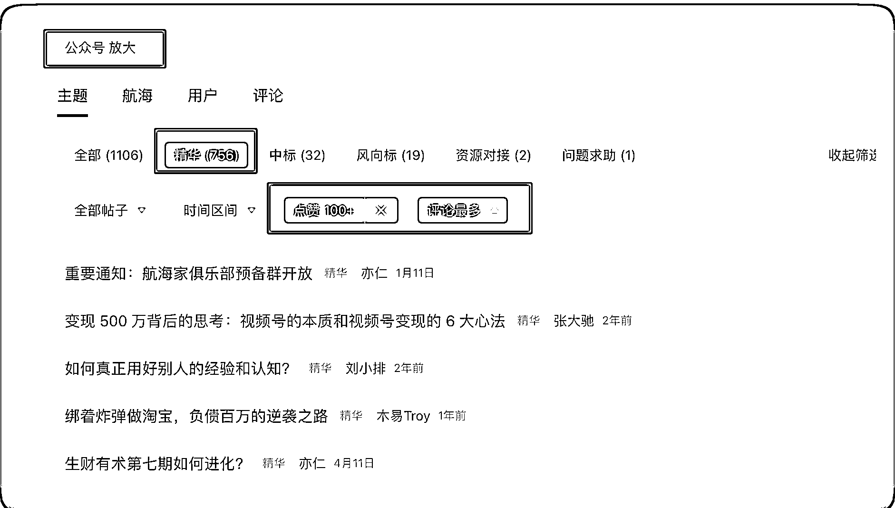
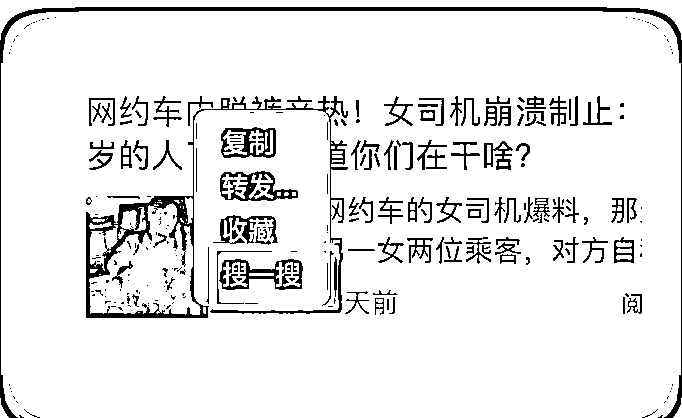

# 公众号爆款文章，你需要知道哪些技巧

> 原文：[`www.yuque.com/for_lazy/thfiu8/qplfqxf9zuyc2cv2`](https://www.yuque.com/for_lazy/thfiu8/qplfqxf9zuyc2cv2)

## (68 赞)公众号爆款文章，你需要知道哪些技巧

作者： 叉叉敌

日期：2023-09-04

这篇文章是前段时间@亦小亮 教练，拉了一个爆款的文章写作群，就是挑战写作爆款文章，通过一段时间的持续输出，总结出来的一些经验。

下面是我分享的一些细节，需要注意的那些坑，技巧等。

借这个时间点，给这次参加爆款文章写作的船员们，加油打气。

希望大家上岸，同时还能赚得彭满钵满。

下面开始正文……

# 1\. 开篇：知行合一

首先就是参考我之前的写作方法，去写作。

之前更新了一篇新人贴，链接好多人，但是大部人来都会问，用的是什么工具？

个人觉得，不管是你用 claude 还是 ChatGPT3.5，亦或 4.0，这些都只是工具而已。重点还是我们自己，**做到知行合一**。

写作方法：https://t.zsxq.com/0fnVdiSN0

注册公众号，账号准备等等，这就不用说了，好好利用生财的搜索索引。如果没有准备这一步，说明你对赚钱还是没有那么强烈的意愿。加入生财除了赚钱还有其他的玩法，也不一定要赚钱才行。

搜索索引 2.0 真的好用，记住 2 个：**关键字+过滤条件。**

过滤条件，看个人偏好，我一般是看精华+点赞>100 的帖子，特别是**评论区的内容也要多关注**，生财前期的文章，在评论更容易找到有营养的回答，说不定有一个思路就打开了。

# 2\. 素材选取

那就写什么呢？可以参考上一次的航海活动，其他的公众号爆款文章写作。

航海手册，不是船员，扫码也可以阅读。https://search01.shengcaiyoushu.com/docx/NHgUdKMcLoPz0VxSz8LcspWqnsg#doxcnklJQZZRe0xMSCBHvUZhm0f

## a.普通情感

**一般就是写情感文章。**

这个情感文章里面分很多，我开始想到的就是：婚姻、爱情、仇恨、喜悦，这些都算情感的一个方向，那我们写什么呢？

**这里是重点**，我发现很多素材容易爆火的，那就是要抓住阅读者的情绪，瞬间被提高的这一种，是在短时间收到正反馈的。

比如说。前段时间最近食堂发现老鼠头和鸭脖子，我把这种称之为愤怒。

## b.长词尾类

**爱情婚姻**相关的这种，我发现它的词尾很长，什么叫词尾很长？就是说你写这篇文章之后，不可能在短时间内爆发阅读量的。

那可能在过一段时间，有可能是 30 天，有可能是半年，才会爆发很高的阅读量。

因为我发现热搜一搜这个地方，它会出现一些热门评价的。里面的文章可能就是这样的，有可能是 2021 年或者是 2022 年写的文章才火起来。

这是我一个个人的猜测，因为目前我也没有这样的文章火过，所以说我只是一个猜测。

除了爱情婚姻，那就是养老系列的文章(**银发项目**)，可以参考前段时间公众号的精华文章。

## c.看一看精选

没有素材？

看一看精选里面的文章是根据你个人的喜悦爱好去推荐的，只要你阅读这样的几篇类似的文章之后，再次刷新，他就会不停的给你，推荐相同的热门文章。

这样素材就找到了。

那不得不说一句的就是，有一些非常非常火热的事件，它会出现在你的看一看精选里面，全部 90%都是这样的文章。

因为前段时间我发现在成都街头走一走的董小姐，如果全篇有十篇文章，有九篇都是写她的，你可以想象一下这个热点有多热，我觉得就可以去写，，如果是一个新人，至少写出来的文章，可以比平时的阅读多几倍。

## d.热门搜索

点开搜一搜里面可以看到，一些提示，当前微信平台下，大家喜爱的内容。

找到地方的热门时间之后自己点击进去，然后选择了「文章」一栏，就可以看到很多相关的文章了，我一般都是选择这里的热点事件来写的。

## e.手动搜索

在看一看精选，或者是热门， 疑惑是被人推荐给你的热点事件，都可以通过搜一搜。

下面用的是「最热」，搜出来的结果排名，就可以看到高阅读的文章。

这个就是别人的成功案例了， 直接复制即可。

技巧：在微信客户端里面，复制文字，右键直接点击搜一搜，很方便的。

# 3\. 注意坑

1.  不要写政治等其他敏感的话题，再热也不写，AI 生成的文章，不仔细看，谁知道会发生什么

2.  对热点事件，不要站队，保持中立的态度

3.  不写人血馒头类的事件，比如前段时间跳楼自杀的妈妈，估计为了故事情节和流量，虚构一些文字

# 4\. 开始写

选择好了素材，就开始用我们 ChatGPT 去生成文章，我们文章 ChatGPT 写出的文章，不加个润色，不加文章的主体框架，不加上我们人为的修改。基本上文章大概有 60% 完成度了。

如果是赶时间，批量发的，怼量的直接就发吧。用这个最省时间，用最小的投入，ROI 也高。

如果你想做到百分之八九十的一个文章水平，其实是需要花时间的。这个地方我没有总结出来，大概就是提供新知识，引起共鸣。

比如你是一个有敏锐洞察的人， 能给大家提供那种 「卧槽」 的感觉，就是一个是好的点子。

这个和高考的应试类作文还是有差别的。高考作文，大部分人的文章写了除了自己和阅卷老师，几乎没有第三人再看了。所以写不好高考作文，这个也不定写不好。

# 5\. 数据分析

最近看了后台的数据，有一个关键点，就是通过用户人群画像，来想象他们看文章的样子，或者在生活中多观察这样的人群，工地门口，菜市场，或者是身边的亲戚，如果你碰到了，也可以直接请教他们「喜欢什么样的文章」，然后请他们抽支烟，喝杯水之类的，作为感谢。

我自己通过我自己的一篇 10w+的文章，得到了里面的数据，然后自己分析如下。

1.  阅读人群：40～60 岁的年龄，中国这个基数的年龄不少了，个人猜测是年轻人更喜欢视频这样的快餐文化

2.  同时也可以对这部分人群做「精细化」营运的手段，比如文字，图片，内容等等

3.  90%的阅读数据来自，看一看精选里面；这个就是被官方推荐的文章（找这里的热门直接炒）

4.  推送文章的时候：一篇群发+ 2 篇发布， 这样就有更多的曝光，相当于一个公众号顶替了 3 个公众号；

5.  文章里面的图片很重要：尽量贴合你写的事件的内容。如果你是怕被投诉，不要用带有视觉中国的任何图片，可以在这里搜一下这些相关的文章，哪些图片是有可能被侵权的，有可能被投诉的。

我的分享就就到这里了，期望大家一起多多交流，共同进步。

* * *

评论区：

暂无评论

* * *