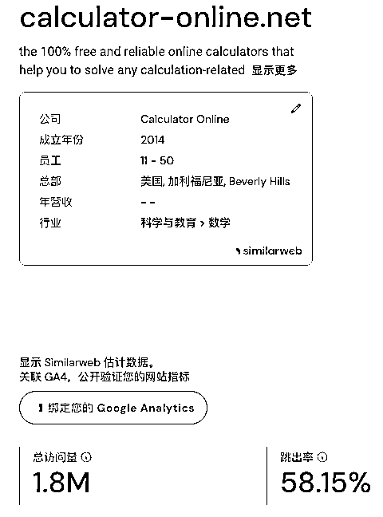
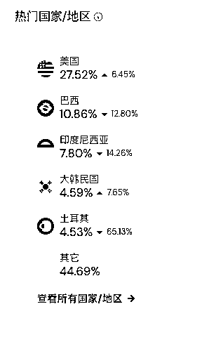

# 为什么要出海及如何快速估算一个网站的广告收入？

> 原文：[`www.yuque.com/for_lazy/thfiu8/qglzw6g0ezy05wha`](https://www.yuque.com/for_lazy/thfiu8/qglzw6g0ezy05wha)

## (78 赞)为什么要出海及如何快速估算一个网站的广告收入？

作者： 哥飞

日期：2023-09-06

大家好，我是哥飞，这篇文章跟大家分享两个话题：

1、用一个 AI 工具站最近 7 天 Adsense 不同国家收入数据对比告诉你为什么要出海

2、如何快速估算一个网站的 Adsense 广告收入？

## 一、从一个 AI 工具站最近 7 天 Adsense 不同国家收入数据分析对比告诉你为什么要出海

给大家看一张刺激的图片，是一个朋友的 AI 工具站的最近 7 天 Adsense 数据。

从上图可以看出来，并不是浏览量高收入就高，而是也要综合考虑不同国家单价的影响。

我们先按照每千次展示收入从高到低排序，得到如下表格：

可以看到，每千次展示收入，最高的是瑞士，达到了 7.34 美元，次之就是美国 4.34 美元，还有法国、加拿大也是 4 美元以上的。

接下来英国、澳大利亚、德国都是 2 美元到 3 美元之间的。

从上面的对比，我们就看出来，为什么要出海，为什么要面向全球人民去做产品，为什么要去赚美元了。

## 二、如何快速估算一个网站的 Adsense 广告收入？

继续聊一下 Adsense 的广告收入快速估算。

### 2.1、理论

首先我们解释几个关键指标：

1.  UV：Unique Visitor 即独立访客量

2.  PV：Page View 即页面访问量

3.  广告曝光：网页里的广告被展示的次数

4.  ECPM：广告展示 1000 次的收入

一般来说，国内网站的 ECPM 很有可能不到 1 美元，但是欧美等发达国家的 ECPM 可以达到 3 到 6 美元。

通常来讲，一个用户进来我们网站之后，他一般都不止看一个页面，张三看了 5 个页面，李四看了 3 个页面，总共产生了 5+3=8 个 PV，那么平均来看，就是每个 UV 能够带来 4 个 PV。

而一个页面我们通常也不止放一个广告位，一般谷歌推荐最多放 3 个广告位，也就是一个 PV 能够最高产生 3 次广告展示。

下面为了估算方便，我们先做一些假设：

假设 ECPM 为 1 美元；

假设 1 个 UV 只能产生 1 个 PV；

假设一个 PV 只能产生 1 个广告展示。

假设一个网站每天的 UV 是 1000，那么 1 天就可以产生 1000*1*1=1000 个广告展示，也就是 1 个 ECPM，所以日收入是 1 美元，那么月收入就是 30 美元；

请大家记住这个数字，30 美元，这是基数。

现在假设一个用户主要是欧美的查询工具类网站，每天 UV 是 10000，也即是 1000 的 10 倍。

因为用户都是欧美用户，ECPM 假设是 4 美元。

因为是查询类工具网站，所以用户都会很好奇，一个人会查多次，就能够产生多个 PV，我们假设一个 UV 可以产生 3 个 PV。

又因为是查询类网站，用户每次查看查询出来的数据，页面都会刷新，所以每次都会产生新的广告展示，假设一个 PV 可以产生 3 个广告展示。

那么这个网站的月收入可以按照下面公式计算：

30*10*4*3*3=10800 美元≈78807 元人民币

这就很可观了。

### 2.2、实践

好了，理论学完了，我们拿一个网站实际来练习一下。

以 [calculator-online.net](http://calculator-online.net/) 这个网站为例，我们先看一下 similarweb 的数据。

这里哥飞给大家介绍一下 similarweb 访问量的定义，同一个用户，只要某一次的访问离前一次访问大于 30 分钟，那么访问量就有加一。

举个例子，哥飞今天在 08:00、08:25、08:50、09:30、09:40 几个时间点访问了这个网站，那么会被记为 3 个访问量，假设平均每天每个人都产生 3 个访问量，那么实际这个网站的 UV 是(180/30)/3=2 万。

而 [calculator-online.net](http://calculator-online.net/) 这个网站属于在线计算工具，流量主要来自于搜索，通常一个人不会短时间内访问多次，所以可以认为每天每人产生 1 个访问量，所以 UV 是 180/30=6 万，也就是 60 个 1000。

而上面可以看到，一个 UV 可以产生 2.36 个 PV。

再打开网站看一下，首页首屏就有 3 个广告位，可以认为会 1 个 PV 会产生 3 个广告展示。其它内页，哥飞也点进去了，虽然有 3 个广告位，但是有些广告位不在第 1 屏，也就是不一定有 3 个广告展示。

综合来看的话，哥飞大概估一下，一个 PV 可以产生 2 个广告展示左右。

再看下这个网站的主要流量来自于美国、巴西、印尼，那么哥飞也是大概估一下，平均 ECPM 在 2.5 美元左右。

好，那我们就可以来计算一下这个网站的月收入了：

30*60*2.5*2.36*2=21240 美元。

当然我们上面有些假设，所以实际收入肯定不会两万多，但是也不会差别特别多，有可能会更多，举例可能是 3 万美元。

哥飞查了一下这个网站域名注册于 2013 年，相对于别的在线计算器类网站已经做得比较晚了，所以其实一直都会有机会。

尤其是现在 AI 出来了，也是一个全新的机会摆在大家面前，我们可以把别的做得比较成功的在线工具，都加上 AI 的能力，再做一遍。

好了，哥飞的文章到此结束，你学会了吗？

* * *

评论区：

灵犀 : 先赞再看[旺柴]
弗流 : 那订阅变现的网站可以预估收入嘛？
哥飞 : 那你就要收集数据，再加上你的经验，也可以估算。
弗流 : 谢谢
英雄哥 : 主要是学到出海思维。
做个网站，同样的展示，瑞士流量＞美国流量＞中国流量。
所以，同样的努力，赚外币比赚人民币香。[调皮]

* * *