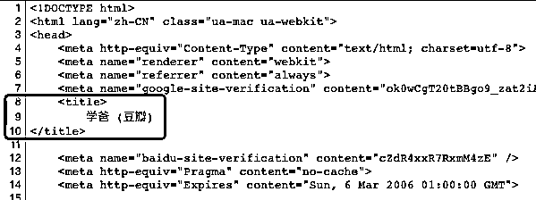
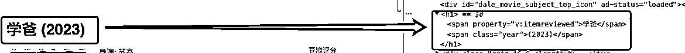
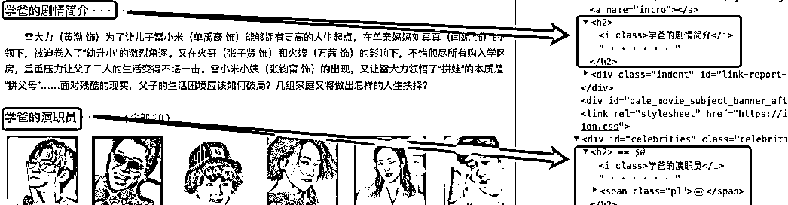
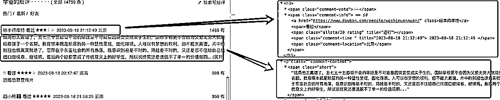
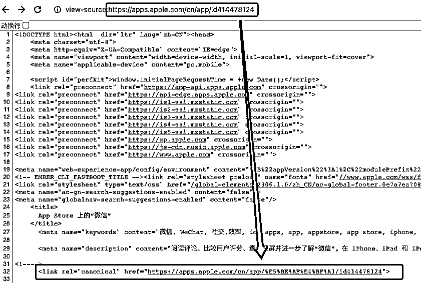
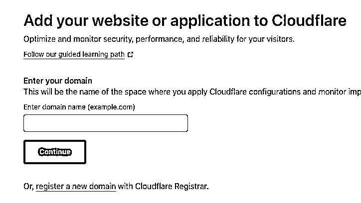
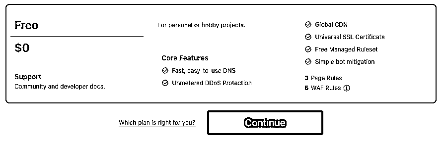
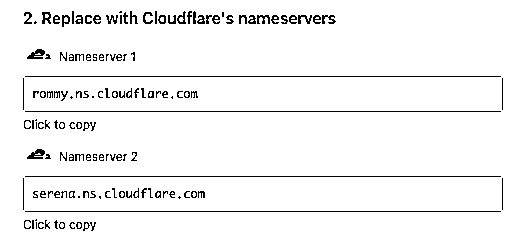
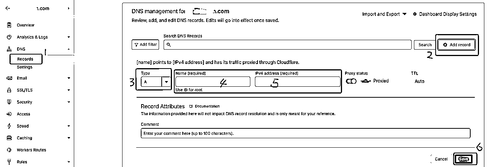

# 从网站站内优化到部署上线再到推广运营一篇文章让你学明白

> 原文：[`www.yuque.com/for_lazy/thfiu8/geyqnx73l271e8ux`](https://www.yuque.com/for_lazy/thfiu8/geyqnx73l271e8ux)

## (44 赞)从网站站内优化到部署上线再到推广运营一篇文章让你学明白

作者： 哥飞

日期：2023-09-07

大家好，我是哥飞。

前天给大家分享了如何挖掘需求，和制作工具，今天来讲讲接下来的站内优化和上线工作。

[海外工具从需求挖掘到网站制作一篇文章让你搞懂](https://t.zsxq.com/11TqORn77)

## **一、站内优化经验**

我们通过分析需求，找到了我们可以做的关键词之后，就要思考，用户在搜索引擎里搜索这个关键字，到底是想找什么，是想找内容？还是想找工具？还是想找服务？还是想找商品？或者其它东西？

分析清楚了用户的真实需求，我们就有的放矢，知道到底要给这个关键词做一个什么页面来承接搜索过来的流量。

### 1.1、TDK

现在假设我们已经知道要做一个什么页面了，那么页面内的 TDK 要怎么写呢？

我们跟着豆瓣学一学。

#### title

先说 title，也就是网页标题。

这是搜索引擎判断一个网页的主要内容最重要的参考来源之一。

很多时候我们说 SEO 优化，其实就是如何写好网页标题。

标题会直接出现在搜索结果中，所以写一个好标题，还有助于吸引用户点进你的网页

豆瓣的电影页面标题很简单，就是电影名称（豆瓣）。

那是因为豆瓣已经有足够的权重了，如果我们现在要做一个电影介绍网站，那么就应该分析用户对于每一个电影到底想关心什么，然后去写标题。

如“学爸主演、演员表、主角、评分、票房”

用户可能会关心的，且有搜索流量的，都可以拼凑上去。

#### description 和 keywords

description 网页描述，也比较重要，也会出现在搜索结果中。

keywords 关键词列表，一般可以不写。我的优化风格是优化不要太满，所以一般都是好好写 title 和 description，但直接删除 keywords 。

可以看到，豆瓣把一些本来要写到标题里的，写到描述里去了。

好了，TDK 就介绍完了，我们看看实际在搜索引擎里的结果显示成什么样。

这是百度：

这是谷歌：

### 1.2、网页结构

一个 HTML 网页，除了要写好 title 和 descrition 外，最重要的就是要让整个网页结构清晰，有明显的 h1、h2、h3 结构。

#### 先说下 H1

一个网页只能有一个 h1，如果说 title 是给搜索引擎看的，那么 h1 就是给用户看的。但同时搜索引擎也会参考 h1 来对你的网页进行内容评判，最终给不给你排名，排在哪个位置，很多时候就是 h1 和 title 决定的。

再说下 h2 和 h3

这两个也是一个完整的语义化 HTML 必不可少的部分。一个网页可以有多个 h2 和 h3。

#### h1 h2 h3 p

h1 h2 h3 这些都是标题，分别是一级标题、二级标题和三级标题。

除了标题之外，其它正文内容，就要写在 p 里边了，图片也可以放在 p 里。

#### img

图片也是一个网页必不可少的一部分，用 img 标签，合理的放置图片，不仅可以让用户更好的理解你的内容，也可以从搜索引擎的图片搜索获取流量。

img 标签一定要写 alt 属性，这是对图片的描述，专门写给搜索引擎看的。图片尽量用大图，也就是 300x300 以上的。

不管你是工具页面，还是内容页面，都需要有 TDK 和 h1 h2 h3 p img 。

#### 典型网页结构

一个典型的网页结构一般长这样：

h1

h2

p

h3

p

h3

p

h2

p

h3

### 1.3、内链建设

按照上面说的，网页你就做好了，那么接下来就要把各个网页用链接连起来。

网站内互相跳转的链接叫做内链。

外部网站跳转到我们网站的链接叫外链。

通常来讲，我们找到的关键词，都可以拓展出很多二级三级关键词，那么在我们网站首页里，一般会把主关键词和二级三级关键词都分别用 h1、h2、h3 列出来，做这些的目的都是为了优化主页的主关键词。

以 coloring pages 为力，主关键词是 coloring pages 。

二级关键词就是

dog coloring pages

cat coloring pages

girl coloring pages

flower coloring pages

等等

而 dog coloring pages 的三级关键词可以是

cute dog coloring pages

等等

主关键词用域名首页来做，二级关键词用子目录来做，三级关键词用子目录的子目录来做，最后是内页。

内链建设的意思是，既要能够从首页有链接到每个二级、三级关键词，也要每个页面都有链接能够指向上级。

举例，在 cute dog coloring pages 可以增加文本为“dog coloring pages”的链接指向 dog coloring pages 页面。

在 dog coloring pages 页面，可以增加文本为“coloring pages”的链接指向首页。

然后所有的页面，都增加文本为“coloring pages”的链接指向首页。

也就是说，某个二级关键词的所有的三级关键词都需要指向到这个二级关键词子目录页面。

然后所有的二级关键词子目录页面也需要有链接能够指向到首页。

### 1.4、六字真言：分门别类罗列

然后哥飞总结了首页可以用的六字真言：分门别类罗列。

举例，coloring pages 网站首页结构

h1 coloring pages

h2 dog coloring pages

h3 cute dog coloring pages

img1 img2 img3 ……

h3 little dog coloring pages

img1 img2 img3 ……

h2 cat coloring pages

h3 cute cat coloring pages

img1 img2 img3 ……

h3 little cat coloring pages

img1 img2 img3 ……

h2 flower coloring pages

h3 red flower coloring pages

img1 img2 img3 ……

h3 yellow flower coloring pages

img1 img2 img3 ……

### 1.5、后端渲染

有一点一定要注意，以上所有这些都需要直接在 html 代码里体现出来，而不能是前端渲染。

也就是说，我们打开网页，浏览器右键查看网页源代码，需要能够看到这些内容。

那么搜索引擎的爬虫去抓取网页，也能够抓取到这些内容。

虽然，的确搜索引擎有时候能够解析前端 js，触发渲染。

但这需要更多的算力资源，凭什么给我们的新网站用。

所以新网站，老老实实后端渲染。

### 1.6、确保 URL 唯一

还有一点要注意，我们需要确保 url 唯一。

每一个网页，有可能会有多个 url 可以打开，但是我们需要在网页的 head 中通过设置 canonical 来让搜索引擎知道当前网页正确且唯一的 URL。

举个例子，微信 App 在苹果 AppStore 的网页，苹果官方推荐的唯一 URL 是 https://apps.apple.com/cn/app/%E5%BE%AE%E4%BF%A1/id414478124。

但其实我们可以通过多个 URL 都能打开这个页面，如以下 URL 都可以：

https://apps.apple.com/cn/app/id414478124

https://apps.apple.com/cn/app/weixin/id414478124

https://apps.apple.com/cn/app/wechat/id414478124

可以看到，不管用哪个 URL 打开，苹果官方用 canonical 指定的规范且唯一的 URL 都是同一个。

有些网站可能同时支持 www 和 裸域名访问，有时还同时支持 http 和 https 访问。

这里也要注意，需要通过 canonical 告诉搜索引擎，我们官方指定的正确规范化 url 到底是哪一个。

否则，在搜索引擎看来，就会有多个网址，打开是重复的内容。

另外，包括前面说的后端渲染也是一样，如果你用前端渲染，也会让搜索引擎认为多个网页的网页是重复的，就不会收录了。

好了，网站站内优化部分，就讲完了。

## 二、域名、服务器

接下来我们说说域名、服务器和部署相关。

### 2.1、域名购买渠道

海外站，尽量不要在国内的域名注册商注册域名，国外的推荐注册商：

https://www.godaddy.com/

https://www.namecheap.com/

https://www.namesilo.com/

https://www.cloudflare.com/

https://www.hostinger.com/

随便哪个都可以，你有哪个帐号就在哪里注册，不用去纠结那几块钱的价格差

### 2.2、服务器购买渠道

服务器购买渠道有很多，哥飞推荐几个哥飞知道的，其实还有很多别的，你用惯了哪个就用哪个就行。

有国内阿里云、腾讯云帐号的话，直接在上面购买海外服务器即可。

国外的话 AWS、谷歌云等也可以

https://aws.amazon.com/

https://cloud.google.com/

https://www.digitalocean.com/

https://www.linode.com/

### 2.3、不用服务器

那么不要服务器行不行呢？

我们之前说过，也可以。

其实如果是做简单前端工具的话，用 Vercel 免费版就足够了，前后端代码都可以放。

前端还可以用 CloudFlare Pages ，后端可以用 CloudFlare workers。

Vercel 和 CloudFlare 的免费套餐就足够用了，等流量上来了之后再付费。

### 2.4、LOGO 制作工具

再推荐两个 logo 制作工具

https://ideogram.ai/

https://www.midjourney.com/

## 三、如何部署

以上这些都准备好了之后，就可以部署我们做好的网页了。

哥飞先简单介绍一下一点技术小知识。

用户在浏览器输入你的域名之后，会经过 dns 解析，找到域名提供服务的服务器 IP，也许这是你自己购买的云服务器 IP，也许是你的 Vercel、CloudFlare 等平台的 IP，之后请求就会被发送到服务器里，由服务器进行一些处理后，返回 html 页面代码给浏览器，最终浏览器渲染出网页。

所以我们购买到的域名，需要有一个 dns 服务器，一般域名注册商都会免费提供，我们也可以使用第三方的 dns 服务。这里统一建议大家使用 CloudFlare 的域名解析服务。

接下来我们以 CloudFlare 和 Vercel 为例，说明如何部署一个前端工具站点。

### 3.1、域名解析

首先是配置域名解析，打开 CloudFlare ，点击左侧 Websites ，打开网站列表页面，点击右上角“Add a site”，在新开的页面输入框中填入你的域名，点击“Continue”按钮。

选择免费套餐，继续点击“Continue”按钮。

复制 CloudFlare 提供的 ns1 和 ns2 ，填到域名注册商后台的域名 dns 设置界面。

有些 dns 服务商有 5 个 ns，一般最少都有 2 个，CloudFlare 就只有 2 个，那么就填这两个进去，提交保存。

之后继续下一步，三个都开启，最后点击“Finish”就可以了。生效需要一段时间，等回到网站列表页面，网站地下显示“Active”就表示修改 dns 成功了。

### 3.2、添加域名解析记录

常用的域名解析记录类型有 A 记录、CNAME 记录、TXT 记录、MAX 记录，如果只需要配置网站访问，只需要用前两个就行，如果要配置邮箱，才需要用到后两个。有时候做一些域名所有权校验，需要用到第三个 TXT 记录。

一般别人叫你添加什么，你就添加什么就好了。

### 3.3、静态网站部署

以 Vercel 配合 CloudFlare 为例说明静态网站部署流程，总共有以下几步：

1、创建 Github 仓库，把网站前端代码提交到仓库；

2、在 Vercel 新建项目，选择关联上一步创建的仓库；

3、等待自动构建成功，点击 Vercel 免费提供的子域名，可以成功打开网站；

4、在 Vercel 域名设置中添加自定义域名，选择默认用无 www 域名，把 www 域名跳转到无 www 域名（刚好与官方建议相反），并且开始 SSL 证书，选择从 http 跳转到 https；

5、在 CloudFlare 中添加域名解析记录，注意要 SSL 要选择 Full 模式；

6、等待解析记录生效，使用 https://域名 打开网站，部署完成。

通过以上步骤，我们成功部署了一个网站，可以打开搜索引擎，好好欣赏 3 分钟。

## 四、上线第一步

那么网站部署好了之后，我们还需要做一些准备工作。

如提交到谷歌 search console 后台，配置流量统计代码，添加一些外链等等。

### 4.1、提交谷歌 search console 后台

先要为网站制作制作 sitemap，具体格式请百度或者谷歌或者问 GPT。

之后在谷歌中搜索 site:域名 ，会有一个提示“尝试使用 Google Search Console”，点击进去。

进去之后，在页面左侧找到按钮，添加资源，选择网域形式，输入域名，点击继续。之后因为你的域名是在 CloudFlare 管理的，所以可以一键授权验证所有权。如果是在别处管理，按照要求配置解析记录进去进行所有权验证即可。

验证之后，就可以去添加我们之前准备好的 sitemap 文件，之后就等待谷歌爬虫光临就好了。

### 4.2、别忘了放置流量统计代码

打开谷歌分析 https://analytics.google.com/analytics/ ，点击左下角的设置按钮，在设置页面中点击“添加媒体资源”按钮，在新界面中按照步骤添加自己域名。按照要求，一步一步填写即可，第 3 步时选择“获取基准报告”。

第 4 步选择类型为网站，之后输入网站域名和网站名称，提交后就可以获取网站统计代码。

把网站统计代码放到你的网站的所有页面的 </body>之前，如下所示：

</body></html>

如果你用不太习惯，也可以同时放百度统计代码，也是放到这个 display:none 的 div 内。

### 4.3、吸引爬虫

通过建立启动外链，吸引爬虫，可以尽快让搜索引擎收录我们的新网站。

主要有 2 个办法。

1、找到谷歌爬虫经常光顾的网站，去发布帖子，宣传

如 V2EX.com 就是一个不错的发布网站，可以去分享创造节点发布自己的网站，注意，介绍一定要真诚一点，不要敷衍了事。

2、在自己的老网站上增加友链

如果你有一些已经被收录的网站就最好了，在你的老网站里给新网站添加外链，也容易吸引到爬虫。

所以当我们手里的网站越来越多之后，上一个新网站被搜索引擎收录就会更快好多。

## 五、宣传推广

接下来就可以开始推广了，其实今天早上我们已经大概聊了一下如何获取流量。

先从你熟悉的渠道开始，把你能够影响的渠道，都去发一遍。先获取第一批用户，即使不是海外用户都行，因为第一批用户可以帮助你找出一些 Bug，修复一些问题。

接着，可以提交到一些周刊，如阮一峰的每周五科技周刊，如 ahhhhfs.com ，如小众软件等。

之后，把产品提交到 ProductHunt，能够带来真正意义上的第一波海外用户。

因为我们的产品是 AI 工具，所以会被各个 AI 导航爬虫从 PH 上自动抓取，收录，这样又能够从这些导航站获取一批用户。

然后还可以提交到一些不会自动抓取，需要我们手动提交的 AI 导航站，甚至有些付费的也可以试试提交，不过量力而行，太贵的就先不提交了。

到这一步，你已经有几批新用户过来了，需要观察一下用户使用情况，是否能够正常使用工具，是否会愿意分享工具，看看老用户有没有带新用户进来。

如果以上步骤都效果不错的话，还可以去找一些小科技媒体，小自媒体帐号，自荐一下。

尽量找免费的，如果你的工具有趣且好用的话，能找到愿意帮你宣传的媒体的，因为他们发内容也需要素材。

最后，还可以去推特上搜索有没有人在找相关的产品，你可以去评论区自荐，注意态度一定要诚恳，诚实说是自己做的产品，请对方使用，并且提提意见。会有人不理你没关系，但也会有人理你，那就收获用户+1。

经过以上步骤，你的网站就会有了初始启动用户。

如果产品做得不错的话，还会被不断传播出去。

同时搜索引擎也会因为外链增加而得到排名，也能够开始带来一些流量。

一些都向着美好迈进。

## 六、调整预期

但，是不是就可以高枕无忧，躺平不上班了呢？

先别美。

不要幻想着流量会爆发，很多时候很可能网站上线了，访问量只有很少的几个。

那么我们需要调整一下预期。

我们读书时学过的《劝学》分享给大家：

积土成山，风雨兴焉；积水成渊，蛟龙生焉；

积善成德，而神明自得，圣心备焉。

故不积跬步，无以至千里；不积小流，无以成江海。

骐骥一跃，不能十步；驽马十驾，功在不舍。

锲而舍之，朽木不折；锲而不舍，金石可镂。

蚓无爪牙之利，筋骨之强，上食埃土，下饮黄泉，用心一也。

蟹六跪而二螯，非蛇鳝之穴无可寄托者，用心躁也。

对于我们来说，有些船员之前已经有相关经验，那么目标可以定得高一些。

但是对于没有经验的新船员来说，最好的办法就是目标放低一点。

看得上小钱，才能赚大钱，积少成多，聚沙成塔。

我们先从我们能力范围内能做的网站开始做起，先把第一个网站做出来。

能够从搜索引擎获取到免费的流量，能够从 Adsense 赚到第一笔广告费，那就说明你入门了。

举例，去找需求的时候，先找搜索量小一些并且竞争度低的词，先按照这个操作方法，做一个网站，上线后从谷歌拿到流量再说。有了这样的正反馈之后，我们才会更有动力去投入进去做更难一点的词。

就我的经验来讲，谷歌依然还是搜索霸主，谷歌就是一片大海，我们去谷歌之海航行，词找对的话，2 周内就能够拿到结果。甚至快的，一周就能有流量进来。

哥飞有个朋友，算是新手，7 月开始做网站，到现在做了 3 个网站了，加起来每天的广告费已经超过 500 美元了。

这，就是谷歌的馈赠。

希望大家都能有收获。

* * *

评论区：

阿泽 : 这么好的内容，多谢分享

* * *