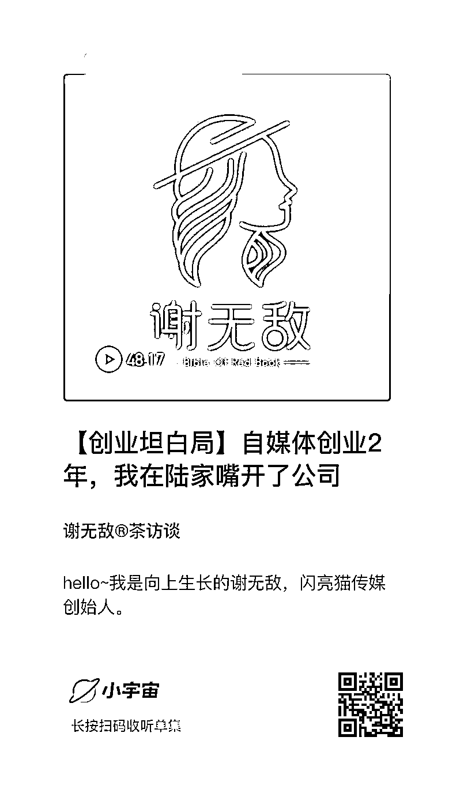

# 自媒体创业 2 年，我在陆家嘴开了公司

> 原文：[`www.yuque.com/for_lazy/thfiu8/dm7eqm1p6dwta1vb`](https://www.yuque.com/for_lazy/thfiu8/dm7eqm1p6dwta1vb)

## (47 赞)自媒体创业 2 年，我在陆家嘴开了公司

作者： Sherry💎谢无敌

日期：2023-09-08

Hi～我是向上生长的谢无敌～闪亮猫传媒创始人。

前几天和亦仁大哥吃饭，大哥说：“无敌，你应该是属于从 0-1 能力比较强的人，能够快速把一个项目做起来”。

趁着这次小航海学习，我也把播客从 0 做起来，凌晨交了第一篇作业，来星球和大家分享一下。

距离我金融行业辞职，自媒体创业已经 2 年多了。

在这 2 年里，我的生活也发生了翻天覆地的变化。回顾了我的创业之路，经历很多，收获也很大。
💎 知识付费本质是为“圈子”付费。在创业过程中，我自己知识付费的花费超过 20 万，并且通过自身努力，让每花的一笔钱都能够快速赚出来。

💎自媒体创业是给所有人的机会：之前在金融圈工作的时候，虽然自己的学历和学校都还不错，但是金融圈里厉害的人实在太多太多了，动不动就是清北和常青藤，压力十分大。

但是进入自媒体圈后，发现自己的背景在圈内竟然属于是上层。最重要的是，自媒体圈内从草根创业成功的人，特别特别多，越接地气的博主其实信任感越强，变现能力也越好。

💎自媒体的业态也很多：仅仅小红书 MCN 机构，可以经营的业务就很多，像我的公司主要做知识付费和自营品牌运营为主，还有的机构很擅长做媒介生意和投放生意，以及媒介生意里又会细分很多垂类媒介，每一个都是赚钱的方法，但也挺辛苦。

这次的播客是我和闪亮猫合伙人周周一起录的，她来做主持人，我来和大家娓娓道来自己从 0-1 的故事，希望对你有帮助🎧

02:33 从金融财经领域跨界自媒体的故事
06:42 千人付费社群是如何完成冷启动的
14:26 知识付费是为了靠近优质的圈子
19:03 主动筛选用户，提升社群的质量
23:14 可以持续发展的团队和品牌应该是什么样的？
25:01 我的创业黑暗时刻——合伙人退场
31:10 女生创业应该拥有的 4 个特质
35:47 普通人创业搞钱的 3 个方向
40:55 在小红书上创业，该选择纯博主还是商家博主？
46:34 赚钱的本质是什么？

* * *

评论区：

Sherry💎谢无敌 : 欢迎各位圈友关注我的频道：谢无敌®️茶访谈
[`www.xiaoyuzhoufm.com/episode/64f9fa816884ccbb195305a9`](https://www.xiaoyuzhoufm.com/episode/64f9fa816884ccbb195305a9)
强哥手记 : 关注了！
书情小跟班 : 不错，关注了
浪久 : 敌敌真棒👍🏻
书豪 : 无敌真棒

* * *